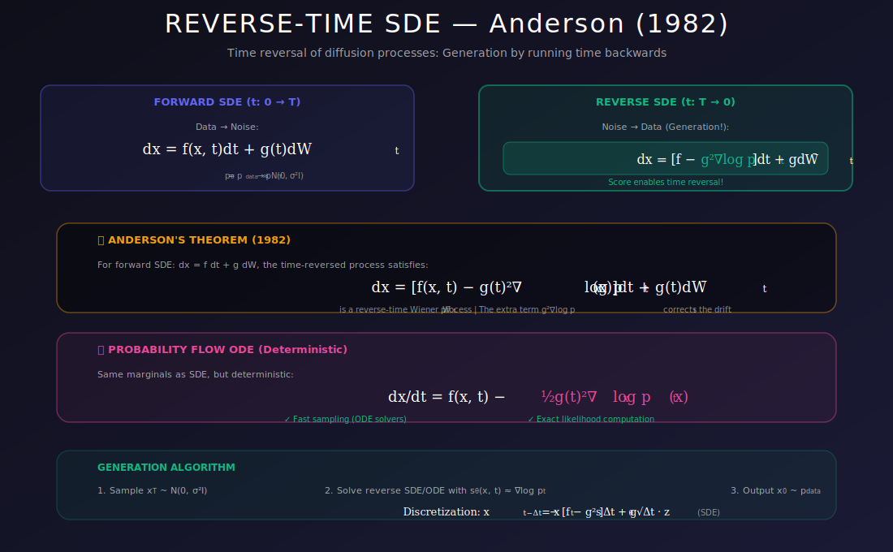

# ⏮️ Reverse-Time SDE for Generation

<div align="center">



*Run time backwards to generate — the mathematical magic of diffusion models*

[](#references)
[](#)
[](#)

</div>

---

## 🎯 Where & Why Use Reverse-Time SDE?

<table>
<tr>
<th width="25%">📍 Where</th>
<th width="40%">💡 Why</th>
<th width="35%">🔧 Practical Use Cases</th>
</tr>
<tr>
<td><b>All Diffusion Sampling</b></td>
<td>THE algorithm for generating samples from learned scores</td>
<td>DDPM, Score SDE, Stable Diffusion inference</td>
</tr>
<tr>
<td><b>Image Generation</b></td>
<td>State-of-the-art quality with controllable diversity</td>
<td>Text-to-image, unconditional generation</td>
</tr>
<tr>
<td><b>Deterministic Generation</b></td>
<td>Probability flow ODE gives reproducible outputs</td>
<td>Interpolation, editing, inversion</td>
</tr>
<tr>
<td><b>Likelihood Computation</b></td>
<td>ODE form enables exact log-likelihood calculation</td>
<td>Model comparison, density estimation</td>
</tr>
<tr>
<td><b>Fast Sampling</b></td>
<td>Adaptive solvers can reduce number of steps</td>
<td>Real-time applications</td>
</tr>
</table>

### 🌟 The Key Insight

> **The Problem:** We can turn data into noise (forward SDE). How do we turn noise into data?
>
> **The Solution:** Anderson's theorem (1982) — every forward SDE has a reverse SDE that depends only on the **score function**!

---

## 📊 Representation Comparison

| Representation | Pros | Cons |
|----------------|------|------|
| **Euler-Maruyama** | Simple, fast | O(1/N) error |
| **Heun's Method** | Better accuracy | 2× score evals |
| **Predictor-Corrector** | Flexible quality/speed | Hyperparameters |
| **DPM-Solver** | Few steps (10-20) | Complex implementation |
| **Probability Flow ODE** | Deterministic | May miss modes |

---

## 📚 Introduction

The reverse-time SDE is the mathematical foundation for generating samples in score-based diffusion models. Anderson (1982) showed that any forward SDE has a corresponding reverse-time SDE that runs backward in time, and this reverse SDE depends on the score function of the time-dependent distribution.

---

## 1. Anderson's Fundamental Result

### 1.1 Forward SDE

$$dx = f(x, t) \, dt + g(t) \, dW_t$$

This defines a distribution $p_t(x)$ that evolves from $p_0 = p_{data}$ to $p_T = p_{prior}$.

### 1.2 Reverse-Time SDE

**Theorem (Anderson, 1982):** The reverse of the forward SDE is:

$$\boxed{dx = \left[f(x, t) - g(t)^2 \nabla_x \log p_t(x)\right] dt + g(t) \, d\bar{W}_t}$$

where $d\bar{W}_t$ is a reverse-time Brownian motion.

### 1.3 Intuition

| Process | Direction | Information Flow |
|---------|-----------|------------------|
| **Forward** | Data → Noise | Destroy information (add randomness) |
| **Reverse** | Noise → Data | Recover information (use learned score) |

The score $\nabla_x \log p_t(x)$ is the **missing ingredient** that tells us how to reverse!

---

## 2. Complete Derivation

### 2.1 Time Reversal Basics

Let $\tau = T - t$ be reversed time.

In reversed time, the SDE takes a different form due to the change of variables.

<details>
<summary><b>📐 Full Derivation of Anderson's Reverse-Time SDE</b></summary>

**Goal:** Given forward SDE $dx = f(x,t)dt + g(t)dW_t$, derive the reverse-time SDE.

**Step 1: The Forward Kolmogorov (Fokker-Planck) Equation**

The forward SDE induces a time-evolving density $p_t(x)$ satisfying:
$$\frac{\partial p_t}{\partial t} = -\nabla \cdot (f p_t) + \frac{g^2}{2}\nabla^2 p_t$$

**Step 2: Time-Reversed Process**

Consider the process $\tilde{x}_\tau = x_{T-\tau}$ running backward.

The key question: What SDE does $\tilde{x}_\tau$ satisfy?

**Step 3: Path Measure Analysis**

The path measure of the forward process over $[t, t+dt]$ is characterized by:
$$p(x_{t+dt}|x_t) \propto \exp\left(-\frac{\|x_{t+dt} - x_t - f(x_t,t)dt\|^2}{2g^2 dt}\right)$$

For the reversed process, we need:
$$p(x_t|x_{t+dt}) = \frac{p(x_{t+dt}|x_t)p_t(x_t)}{p_{t+dt}(x_{t+dt})}$$

**Step 4: Compute the Backward Transition**

Using Bayes' rule and the Gaussian transition kernel:

$$\log p(x_t|x_{t+dt}) = \log p(x_{t+dt}|x_t) + \log p_t(x_t) - \log p_{t+dt}(x_{t+dt})$$

Taking the gradient w.r.t. $x_t$ and evaluating the most likely backward transition:

$$x_t - x_{t+dt} = \left[-f(x_t, t) + g^2 \nabla_{x_t} \log p_t(x_t)\right]dt + g \cdot \xi\sqrt{dt}$$

where $\xi \sim \mathcal{N}(0, I)$.

**Step 5: Write in Standard SDE Form**

Rearranging for the backward process (time running from $T$ to $0$):

$$dx = \left[f(x,t) - g(t)^2 \nabla_x \log p_t(x)\right]dt + g(t)d\bar{W}_t$$

where $d\bar{W}_t$ represents reverse-time Brownian motion. $\quad\blacksquare$

</details>

### 2.2 The Score Correction

The key insight: In reverse time, we need a **drift correction**:

$$\text{score correction} = g(t)^2 \nabla_x \log p_t(x)$$

This compensates for the "information lost" in the forward process.

**Mathematical Intuition:**

| Forward | Reverse |
|---------|---------|
| Drift $f$ pushes distribution | Need to undo this push |
| Diffusion $g^2$ spreads distribution | Need score to contract back |
| Lost information about which $x_0$ | Score encodes this information! |

### 2.3 Why the Score?

Intuitively:
- Forward process adds noise → distribution spreads
- To reverse, we need to "contract" → move toward high-density regions
- Score points toward high density → provides the guidance!

<details>
<summary><b>📐 Score as Denoising Direction</b></summary>

**Claim:** The score $\nabla_x \log p_t(x)$ points toward the "true" data given noisy observation.

**Proof via Tweedie's Formula:**

For $x_t = \sqrt{\bar\alpha_t}x_0 + \sqrt{1-\bar\alpha_t}\epsilon$ with $\epsilon \sim \mathcal{N}(0,I)$:

$$\mathbb{E}[x_0 | x_t] = x_t + (1-\bar\alpha_t) \nabla_{x_t} \log p_t(x_t)$$

**Interpretation:**
- $\nabla_{x_t} \log p_t(x_t)$ points from $x_t$ toward $\mathbb{E}[x_0|x_t]$
- Scaled by noise level $(1-\bar\alpha_t)$
- This is the optimal denoising direction!

**The score tells us where clean data is likely to be!** $\quad\blacksquare$

</details>

### 2.4 Complete Reverse SDE

Running from $t = T$ to $t = 0$:

$$dx = \underbrace{f(x, t)}_{\text{original drift}} - \underbrace{g(t)^2 \nabla_x \log p_t(x)}_{\text{score correction}} \, dt + \underbrace{g(t) \, d\bar{W}_t}_{\text{reverse noise}}$$

At $t = 0$, we recover samples from $p_{data}$!

### 2.5 Probability Flow ODE: Deterministic Alternative

<details>
<summary><b>📐 Derivation of Probability Flow ODE</b></summary>

**Goal:** Find a deterministic ODE with the same marginal distributions $p_t(x)$ as the SDE.

**Key Insight:** Both SDE and ODE must satisfy the same Fokker-Planck equation for marginals.

**SDE Fokker-Planck:**
$$\frac{\partial p_t}{\partial t} = -\nabla \cdot (f_{rev} \cdot p_t) + \frac{g^2}{2}\nabla^2 p_t$$

where $f_{rev} = f - g^2 \nabla \log p_t$.

**ODE Continuity Equation:**
$$\frac{\partial p_t}{\partial t} = -\nabla \cdot (\tilde{f} \cdot p_t)$$

**Matching Conditions:**

Expand the SDE diffusion term:
$$\frac{g^2}{2}\nabla^2 p_t = \frac{g^2}{2}\nabla \cdot (\nabla p_t) = \nabla \cdot \left(\frac{g^2}{2} p_t \nabla \log p_t\right)$$

Combine:
$$\frac{\partial p_t}{\partial t} = -\nabla \cdot \left[\left(f - g^2\nabla\log p_t + \frac{g^2}{2}\nabla\log p_t\right) p_t\right]$$
$$= -\nabla \cdot \left[\left(f - \frac{g^2}{2}\nabla\log p_t\right) p_t\right]$$

**Result:** The ODE drift is:
$$\tilde{f}(x,t) = f(x,t) - \frac{g(t)^2}{2}\nabla_x \log p_t(x)$$

**Probability Flow ODE:**
$$\boxed{dx = \left[f(x,t) - \frac{g(t)^2}{2}\nabla_x \log p_t(x)\right]dt}$$

$\quad\blacksquare$

</details>

---

## 3. Sampling Algorithms

### 3.1 Euler-Maruyama (Simple)

```python
import torch
import numpy as np

def reverse_sde_euler(score_model, sde, shape, num_steps=1000, device='cuda'):
    """
    Sample using reverse-time SDE with Euler-Maruyama.
    
    Args:
        score_model: Network s_θ(x, t) predicting score
        sde: SDE object with drift, diffusion methods
        shape: Output shape (batch_size, ...)
        num_steps: Number of discretization steps
        device: Compute device
    
    Returns:
        Generated samples at t=0
    """
    # Start from prior (noise)
    x = sde.prior_sampling(shape, device)
    dt = sde.T / num_steps
    
    for i in reversed(range(num_steps)):
        t = torch.ones(shape[0], device=device) * (i + 1) * dt
        
        # Get SDE coefficients
        f = sde.drift(x, t)
        g = sde.diffusion(t)
        
        # Estimate score
        score = score_model(x, t)
        
        # Reverse drift: f - g² * score
        reverse_drift = f - g ** 2 * score
        
        # Euler-Maruyama update
        noise = torch.randn_like(x)
        x = x - reverse_drift * dt + g * np.sqrt(dt) * noise
    
    return x
```

### 3.2 Predictor-Corrector (Better Quality)

**Predictor:** Take one reverse SDE step
**Corrector:** Refine with Langevin dynamics

```python
def predictor_corrector(score_model, sde, shape, num_steps, 
                        snr=0.1, corrector_steps=1, device='cuda'):
    """
    Predictor-Corrector sampling (Song et al., 2021).
    
    Better quality than pure Euler-Maruyama.
    """
    x = sde.prior_sampling(shape, device)
    dt = sde.T / num_steps
    
    for i in reversed(range(num_steps)):
        t = torch.ones(shape[0], device=device) * (i + 1) * dt
        t_next = torch.ones(shape[0], device=device) * i * dt
        
        # === PREDICTOR (reverse SDE step) ===
        f = sde.drift(x, t)
        g = sde.diffusion(t)
        score = score_model(x, t)
        
        x = x - (f - g ** 2 * score) * dt
        x = x + g * np.sqrt(dt) * torch.randn_like(x)
        
        # === CORRECTOR (Langevin refinement) ===
        for _ in range(corrector_steps):
            g_next = sde.diffusion(t_next)
            score = score_model(x, t_next)
            
            # Langevin step
            noise_scale = np.sqrt(2 * snr) * g_next
            x = x + snr * g_next ** 2 * score
            x = x + noise_scale * torch.randn_like(x)
    
    return x
```

### 3.3 Probability Flow ODE (Deterministic)

**Alternative:** Deterministic ODE with same marginals:

$$\boxed{dx = \left[f(x, t) - \frac{1}{2}g(t)^2 \nabla_x \log p_t(x)\right] dt}$$

**No stochastic term!** Can use any ODE solver.

```python
def probability_flow_ode(score_model, sde, shape, num_steps=1000, device='cuda'):
    """
    Sample using probability flow ODE (deterministic).
    
    Same marginal distributions as reverse SDE, but deterministic!
    """
    x = sde.prior_sampling(shape, device)
    dt = sde.T / num_steps
    
    for i in reversed(range(num_steps)):
        t = torch.ones(shape[0], device=device) * (i + 1) * dt
        
        f = sde.drift(x, t)
        g = sde.diffusion(t)
        score = score_model(x, t)
        
        # ODE update (note the 1/2 factor, no noise!)
        x = x - (f - 0.5 * g ** 2 * score) * dt
    
    return x


def probability_flow_ode_scipy(score_model, sde, shape, device='cuda'):
    """
    Use scipy's ODE solver for adaptive stepping.
    Much faster with fewer function evaluations!
    """
    from scipy.integrate import solve_ivp
    
    def ode_func(t, x_flat):
        x = torch.tensor(x_flat.reshape(shape), device=device, dtype=torch.float32)
        t_tensor = torch.ones(shape[0], device=device) * t
        
        f = sde.drift(x, t_tensor)
        g = sde.diffusion(t_tensor)
        score = score_model(x, t_tensor)
        
        drift = f - 0.5 * g ** 2 * score
        return drift.cpu().numpy().flatten()
    
    # Sample initial noise
    x0 = sde.prior_sampling(shape, device).cpu().numpy().flatten()
    
    # Solve ODE from T to 0
    solution = solve_ivp(ode_func, [sde.T, 0], x0, method='RK45')
    
    return torch.tensor(solution.y[:, -1].reshape(shape), device=device)
```

---

## 4. Comparison of Samplers

| Method | Steps | Quality | Deterministic | Use Case |
|--------|-------|---------|---------------|----------|
| **Euler-Maruyama** | 1000+ | Good | No | Baseline |
| **Predictor-Corrector** | 500-1000 | **Best** | No | Quality-focused |
| **Probability Flow ODE** | 100-500 | Good | **Yes** | Fast, reproducible |
| **Adaptive ODE** | 50-200 | Good | **Yes** | Fastest |

---

## 5. Properties

### 5.1 Marginal Preservation

**Theorem:** Both reverse SDE and probability flow ODE have the **same marginal distributions** $p_t(x)$.

The difference:
- **SDE:** Samples have stochasticity (more diverse)
- **ODE:** Samples are deterministic given initial noise

### 5.2 Likelihood Computation

Probability flow ODE enables **exact likelihood** via the instantaneous change of variables formula:

$$\log p_0(x_0) = \log p_T(x_T) + \int_0^T \text{tr}\left(\nabla_x \tilde{f}(x, t)\right) dt$$

where $\tilde{f}(x,t) = f(x,t) - \frac{1}{2}g(t)^2 \nabla_x \log p_t(x)$ is the ODE drift.

### 5.3 Interpolation in Latent Space

Starting from two noise samples $z_1, z_2$:

$$z_\alpha = \text{slerp}(z_1, z_2, \alpha)$$

Then run probability flow ODE to get **smoothly interpolated images**!

```python
def slerp(z1, z2, alpha):
    """Spherical linear interpolation."""
    z1_norm = z1 / z1.norm(dim=-1, keepdim=True)
    z2_norm = z2 / z2.norm(dim=-1, keepdim=True)
    
    omega = torch.acos((z1_norm * z2_norm).sum(dim=-1, keepdim=True))
    
    return (torch.sin((1-alpha)*omega) * z1 + torch.sin(alpha*omega) * z2) / torch.sin(omega)
```

---

## 6. Numerical Considerations

### 6.1 Discretization Error

| Method | Per-Step Error | Total Error |
|--------|----------------|-------------|
| Euler | $O(\Delta t)$ | $O(\sqrt{\Delta t})$ |
| Heun (2nd order) | $O(\Delta t^2)$ | $O(\Delta t)$ |
| RK4 (4th order) | $O(\Delta t^4)$ | $O(\Delta t^3)$ |

### 6.2 Step Size Selection

**For SDE:**
$$\Delta t \propto \min\left(\frac{\epsilon}{\|f\|}, \frac{\epsilon^2}{g^2}\right)$$

**For ODE:**
$$\Delta t \propto \frac{\epsilon}{\|\text{drift}\|}$$

### 6.3 Numerical Stability Tips

- Clip extreme values to prevent NaN
- Use float64 for ODE integration if needed
- Be careful with variance exploding schedules (large σ)
- Consider exponential integrators for stiff problems

---

## 🔑 Key Equations Summary

| Process | Equation |
|---------|----------|
| **Forward SDE** | $dx = f \, dt + g \, dW$ |
| **Reverse SDE** | $dx = (f - g^2 \nabla \log p) \, dt + g \, d\bar{W}$ |
| **Probability Flow ODE** | $dx = (f - \frac{1}{2}g^2 \nabla \log p) \, dt$ |

| Property | SDE | ODE |
|----------|-----|-----|
| **Stochastic** | Yes | No |
| **Same marginals** | Yes | Yes |
| **Exact likelihood** | No | Yes |
| **Diversity** | Higher | Lower |

---

## 💻 Complete Implementation

```python
import torch
import torch.nn as nn
import numpy as np
from tqdm import tqdm

class ReverseSampler:
    """Complete reverse-time sampling framework."""
    
    def __init__(self, score_model, sde, device='cuda'):
        self.model = score_model
        self.sde = sde
        self.device = device
    
    @torch.no_grad()
    def sample_euler(self, shape, num_steps=1000):
        """Basic Euler-Maruyama sampler."""
        x = self.sde.prior_sampling(shape, self.device)
        dt = self.sde.T / num_steps
        
        for i in tqdm(reversed(range(num_steps)), desc="Euler"):
            t = torch.ones(shape[0], device=self.device) * (i + 1) * dt
            
            f = self.sde.drift(x, t)
            g = self.sde.diffusion(t)
            score = self.model(x, t)
            
            x = x - (f - g**2 * score) * dt
            if i > 0:  # No noise at final step
                x = x + g * np.sqrt(dt) * torch.randn_like(x)
        
        return x
    
    @torch.no_grad()
    def sample_pc(self, shape, num_steps=500, snr=0.1, corrector_steps=1):
        """Predictor-Corrector sampler."""
        x = self.sde.prior_sampling(shape, self.device)
        dt = self.sde.T / num_steps
        
        for i in tqdm(reversed(range(num_steps)), desc="PC"):
            t = (i + 1) * dt
            t_tensor = torch.ones(shape[0], device=self.device) * t
            
            # Predictor
            f = self.sde.drift(x, t_tensor)
            g = self.sde.diffusion(t_tensor)
            score = self.model(x, t_tensor)
            
            x = x - (f - g**2 * score) * dt
            x = x + g * np.sqrt(dt) * torch.randn_like(x)
            
            # Corrector
            t_next = i * dt
            if t_next > 0:
                t_next_tensor = torch.ones(shape[0], device=self.device) * t_next
                for _ in range(corrector_steps):
                    g_next = self.sde.diffusion(t_next_tensor)
                    score = self.model(x, t_next_tensor)
                    
                    eps = 2 * (snr * g_next) ** 2
                    x = x + eps * score + np.sqrt(2 * eps) * torch.randn_like(x)
        
        return x
    
    @torch.no_grad()
    def sample_ode(self, shape, num_steps=200):
        """Probability flow ODE sampler."""
        x = self.sde.prior_sampling(shape, self.device)
        dt = self.sde.T / num_steps
        
        for i in tqdm(reversed(range(num_steps)), desc="ODE"):
            t = torch.ones(shape[0], device=self.device) * (i + 1) * dt
            
            f = self.sde.drift(x, t)
            g = self.sde.diffusion(t)
            score = self.model(x, t)
            
            # ODE: note 0.5 factor, no noise
            x = x - (f - 0.5 * g**2 * score) * dt
        
        return x
    
    @torch.no_grad()
    def compute_likelihood(self, x0, num_steps=200):
        """
        Compute log p(x0) using probability flow ODE.
        
        Uses the instantaneous change of variables formula.
        """
        batch_size = x0.shape[0]
        dt = self.sde.T / num_steps
        
        # Forward: x0 -> xT
        x = x0.clone()
        log_det = torch.zeros(batch_size, device=self.device)
        
        for i in tqdm(range(num_steps), desc="Likelihood"):
            t = torch.ones(batch_size, device=self.device) * i * dt
            
            x.requires_grad_(True)
            
            f = self.sde.drift(x, t)
            g = self.sde.diffusion(t)
            score = self.model(x, t)
            
            drift = f - 0.5 * g**2 * score
            
            # Hutchinson trace estimator
            v = torch.randn_like(x)
            drift_sum = (drift * v).sum()
            grad = torch.autograd.grad(drift_sum, x)[0]
            trace = (grad * v).sum(dim=tuple(range(1, x.dim())))
            
            log_det = log_det - trace * dt
            
            x = x.detach() + drift.detach() * dt
        
        # Prior log-probability
        log_prior = -0.5 * (x ** 2).sum(dim=tuple(range(1, x.dim())))
        log_prior = log_prior - 0.5 * np.prod(x.shape[1:]) * np.log(2 * np.pi)
        
        return log_prior + log_det
```

---

## 📚 References

1. **Anderson, B. D. O.** (1982). "Reverse-time diffusion equation models." *Stochastic Processes and their Applications*.

2. **Song, Y., et al.** (2021). "Score-Based Generative Modeling through Stochastic Differential Equations." *ICLR*. [arXiv:2011.13456](https://arxiv.org/abs/2011.13456)

3. **Karras, T., et al.** (2022). "Elucidating the Design Space of Diffusion-Based Generative Models." *NeurIPS*. [arXiv:2206.00364](https://arxiv.org/abs/2206.00364)

---

## ✏️ Exercises

1. **Derive** the reverse-time SDE from Anderson's theorem.

2. **Implement** both SDE and ODE samplers, compare sample quality.

3. **Show** that reverse SDE and probability flow ODE have same marginals.

4. **Compare** sample diversity: SDE vs ODE on a 2D dataset.

5. **Implement** adaptive step size for probability flow ODE.

6. **Compute** exact likelihood on test data and compare models.

---

<div align="center">

**[← SDE Formulation](../05_sde_formulation/README.md)** | **[Next: Score-Flow Relationship →](../07_score_flow_relationship/README.md)**

*Reverse-time SDE: turning learned scores into generated samples*

</div>
