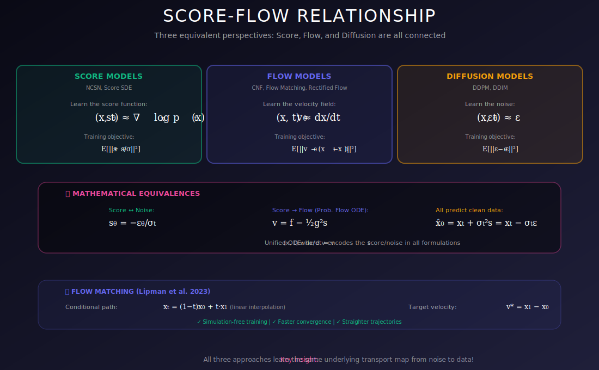

# 🔗 Score-Flow Relationship

<div align="center">



*Two perspectives, one elegant framework — the deep connection between scores and flows*

[](#)
[](#)
[](#)

</div>

---

## 🎯 Where & Why Understand This Relationship?

<table>
<tr>
<th width="25%">📍 Where</th>
<th width="40%">💡 Why</th>
<th width="35%">🔧 Practical Use Cases</th>
</tr>
<tr>
<td><b>Model Design</b></td>
<td>Choose between score-based and flow-based training</td>
<td>Deciding architecture and training objective</td>
</tr>
<tr>
<td><b>Fast Sampling</b></td>
<td>Flow view enables ODE solvers, consistency models</td>
<td>Real-time inference, mobile deployment</td>
</tr>
<tr>
<td><b>Exact Likelihood</b></td>
<td>Flow formulation gives tractable log-likelihood</td>
<td>Density estimation, model comparison</td>
</tr>
<tr>
<td><b>Flow Matching</b></td>
<td>Modern training that's simpler than DSM</td>
<td>Stable Diffusion 3, newer models</td>
</tr>
<tr>
<td><b>Research</b></td>
<td>Unified view enables new algorithms and analysis</td>
<td>Theoretical advances, new methods</td>
</tr>
</table>

### 🌟 The Key Insight

> **Score-based models and normalizing flows are two sides of the same coin!**
>
> The probability flow ODE connects them: same marginal distributions, different training objectives.

---

## 📊 Representation Comparison

| Representation | Pros | Cons |
|----------------|------|------|
| **Score-based** | Scalable training | Sampling needs many steps |
| **Flow-based** | Exact likelihood, fast sampling | Architectural constraints |
| **ODE Formulation** | Deterministic, adaptive solvers | No stochastic refinement |
| **SDE Formulation** | Better sample quality | More steps needed |
| **Flow Matching** | Simple training, straight paths | Newer, less studied |

---

## 📚 Introduction

Score-based models and normalizing flows are deeply connected through continuous normalizing flows (CNFs) and the probability flow ODE. This document explores how scores define a flow and the implications for generative modeling.

---

## 1. Flows from Scores

### 1.1 Probability Flow ODE

Given a score function $s_t(x) = \nabla_x \log p_t(x)$, we can define a flow:

$$\boxed{\frac{dx}{dt} = f(x, t) - \frac{1}{2}g(t)^2 s_t(x)}$$

This ODE transforms samples from $p_T$ to $p_0$ (noise to data).

### 1.2 This IS a Flow!

The probability flow ODE defines an **invertible mapping**:

| Direction | Operation | Result |
|-----------|-----------|--------|
| **Forward** | $x_0 \to x_T$ | Encode data to latent |
| **Inverse** | $x_T \to x_0$ | Generate from latent |

Unlike discrete flows, this is a **continuous** transformation in time.

### 1.3 Same Marginals, Different Paths

**Theorem:** The probability flow ODE has the **same marginal distributions** $p_t(x)$ as the reverse SDE.

The difference: ODE paths are deterministic, SDE paths are stochastic.

```
                   ODE vs SDE Paths
                   
    Noise (pT)                          Data (p0)
       ●────────────────────────────────────●  ODE (deterministic)
       ●╲                              ╱────●
        ╲──────╲              ╱──────╱       SDE (stochastic)
         ╲      ╲────────────╱      ╱
          ●──────●──────────●──────●
          
    Same start, same end distribution, different paths!
```

---

## 2. Continuous Normalizing Flows (CNFs)

### 2.1 Definition

A CNF defines a time-varying transformation:

$$\frac{dx}{dt} = v_\theta(x, t)$$

where $v_\theta$ is a neural network **velocity field**.

### 2.2 Change of Variables (Instantaneous)

For CNFs, the log-density evolves as:

$$\frac{d \log p_t(x)}{dt} = -\text{tr}\left(\frac{\partial v_\theta}{\partial x}\right)$$

**Total change:**

$$\boxed{\log p_0(x_0) = \log p_T(x_T) - \int_0^T \text{tr}\left(\frac{\partial v_\theta}{\partial x}\right) dt}$$

### 2.3 Trace Estimation

Computing trace exactly: $O(d)$ evaluations of $v_\theta$.

**Hutchinson estimator:**

$$\text{tr}(J) = \mathbb{E}_{\epsilon}[\epsilon^T J \epsilon], \quad \epsilon \sim \mathcal{N}(0, I)$$

Unbiased estimate with **one** backward pass!

---

## 3. Score-Based CNFs

### 3.1 Velocity from Score

The probability flow ODE velocity is:

$$v(x, t) = f(x, t) - \frac{1}{2}g(t)^2 s_t(x)$$

where $s_t = \nabla_x \log p_t(x)$ is the score.

### 3.2 Two Training Approaches

| Approach | What We Learn | Training Objective |
|----------|---------------|-------------------|
| **Score-based** | $s_\theta(x, t)$ | Denoising score matching |
| **Flow-based** | $v_\theta(x, t)$ | Flow matching |

### 3.3 Equivalence

Both approaches learn the same transformation when:

$$v_\theta(x, t) = f(x, t) - \frac{1}{2}g(t)^2 s_\theta(x, t)$$

---

## 4. Advantages of the Connection

### 4.1 Exact Likelihood

Score-based models can compute exact likelihood via:

$$\log p_0(x) = \log p_T(x_T) + \int_0^T \text{tr}\left(\frac{\partial v}{\partial x}\right) dt$$

```python
def compute_log_likelihood(model, sde, x0, num_steps=1000):
    """Compute exact log p(x0) via probability flow ODE."""
    batch_size = x0.shape[0]
    dt = sde.T / num_steps
    
    x = x0.clone()
    log_det = torch.zeros(batch_size)
    
    for i in range(num_steps):
        t = i * dt
        
        # Get velocity
        f = sde.drift(x, t)
        g = sde.diffusion(t)
        score = model(x, t)
        v = f - 0.5 * g**2 * score
        
        # Trace estimation (Hutchinson)
        eps = torch.randn_like(x)
        v_eps = (v * eps).sum()
        grad = torch.autograd.grad(v_eps, x)[0]
        trace = (grad * eps).sum(dim=-1)
        
        # Accumulate
        log_det = log_det - trace * dt
        x = x + v * dt
    
    # Prior log-prob
    log_prior = -0.5 * (x**2).sum(dim=-1) - 0.5 * x.shape[-1] * np.log(2*np.pi)
    
    return log_prior + log_det
```

### 4.2 Latent Space

The mapping $x_0 \leftrightarrow x_T$ provides a **meaningful latent space**:

- $x_T \sim \mathcal{N}(0, I)$: Gaussian latent
- Deterministic mapping (given $x_0$)
- Smooth interpolations possible

### 4.3 Best of Both Worlds

| From Score Models | From Flows |
|-------------------|------------|
| Denoising training (simple, scalable) | Exact likelihood |
| Multi-scale noise levels | Deterministic sampling |
| Proven high quality | Smooth latent space |

---

## 5. Flow Matching

### 5.1 Modern Approach (Lipman et al., 2023)

Flow Matching trains CNFs directly without simulation:

$$\mathcal{L}_{FM} = \mathbb{E}_{t, x_0, x_1}\left[\|v_\theta(x_t, t) - u_t(x_t | x_0, x_1)\|^2\right]$$

where $x_t = \phi_t(x_0, x_1)$ interpolates between data $x_0$ and noise $x_1$.

### 5.2 Conditional Flow Matching

$$\mathcal{L}_{CFM} = \mathbb{E}_{t, x_0, x_1}\left[\|v_\theta(x_t, t) - \dot{\phi}_t(x_0, x_1)\|^2\right]$$

where:
- $x_1 \sim p_1$ (prior, e.g., Gaussian)
- $x_0 \sim p_0$ (data)
- $\phi_t$ = interpolation path

### 5.3 Simple Linear Path

For linear interpolation:

$$\phi_t(x_0, x_1) = (1-t)x_0 + tx_1$$

The target velocity is simply:

$$\dot{\phi}_t = x_1 - x_0$$

**This is even simpler than DSM!**

```python
def flow_matching_loss(model, x0, x1=None):
    """
    Conditional Flow Matching loss.
    Simpler than DSM, no noise schedule needed!
    """
    batch_size = x0.shape[0]
    
    # Sample prior (noise)
    if x1 is None:
        x1 = torch.randn_like(x0)
    
    # Sample time
    t = torch.rand(batch_size, 1, device=x0.device)
    
    # Linear interpolation
    x_t = (1 - t) * x0 + t * x1
    
    # Target velocity
    target = x1 - x0
    
    # Predicted velocity
    v_pred = model(x_t, t.squeeze())
    
    # MSE loss
    return ((v_pred - target) ** 2).mean()
```

### 5.4 Connection to Scores

For Gaussian paths, the optimal velocity relates to the score:

$$v^*(x_t, t) = \mathbb{E}[x_1 - x_0 | x_t] = \text{(function of score)}$$

The score is always lurking behind!

---

## 6. Computational Trade-offs

### 6.1 Training

| Method | Per-step Cost | Stability | Simplicity |
|--------|---------------|-----------|------------|
| **Score Matching (DSM)** | $O(1)$ | High | Good |
| **Flow Matching** | $O(1)$ | High | **Best** |
| **CNF (likelihood)** | $O(d)$ | Medium | Complex |

### 6.2 Sampling

| Method | Steps | NFEs* | Deterministic |
|--------|-------|-------|---------------|
| **Reverse SDE** | 1000 | 1000 | No |
| **Probability Flow ODE** | 100-500 | 100-500 | Yes |
| **Adaptive ODE** | 50-200 | ~100 | Yes |

*NFE = Number of Function Evaluations

### 6.3 Likelihood

| Method | Cost | Exact |
|--------|------|-------|
| **Score model (ELBO)** | Cheap | No |
| **Probability flow ODE** | Expensive | Yes |
| **Flow (trace estimator)** | Expensive | ~Yes |

---

## 7. Unified View

### 7.1 All Generative ODEs

All these models define the same structure:

$$\frac{dx}{dt} = v(x, t)$$

**Differences:**
- Training objective (likelihood, score matching, flow matching)
- Path design (VP, VE, optimal transport)
- Parameterization (score vs velocity)

### 7.2 The Score is Key

For any generative ODE with marginals $p_t$:

$$v(x, t) = \text{something} + \text{(something)} \cdot \nabla_x \log p_t(x)$$

**The score appears in ALL formulations!**

---

## 🔑 Key Equations Summary

| Concept | Formula |
|---------|---------|
| **Probability Flow ODE** | $dx/dt = f - \frac{1}{2}g^2 s(x,t)$ |
| **CNF Likelihood** | $\log p_0 = \log p_T + \int_0^T \text{tr}(\partial_x v) \, dt$ |
| **Velocity from Score** | $v = f - \frac{1}{2}g^2 s$ |
| **Flow Matching Loss** | $\mathbb{E}[\|v_\theta(x_t,t) - \dot{\phi}_t\|^2]$ |

---

## 💻 Complete Implementation

```python
import torch
import torch.nn as nn
import numpy as np

class FlowMatchingTrainer:
    """Flow Matching training framework."""
    
    def __init__(self, velocity_model, sigma_min=1e-4):
        self.model = velocity_model
        self.sigma_min = sigma_min
    
    def loss(self, x0):
        """Conditional Flow Matching loss."""
        batch_size = x0.shape[0]
        device = x0.device
        
        # Sample noise (x1)
        x1 = torch.randn_like(x0)
        
        # Sample time uniformly
        t = torch.rand(batch_size, device=device)
        
        # Expand t for broadcasting
        t_expand = t.view(-1, *([1] * (x0.dim() - 1)))
        
        # Optimal transport path (linear interpolation)
        x_t = (1 - t_expand) * x0 + t_expand * x1
        
        # Target velocity = direction from x0 to x1
        target_v = x1 - x0
        
        # Predicted velocity
        pred_v = self.model(x_t, t)
        
        # MSE loss
        loss = ((pred_v - target_v) ** 2).mean()
        
        return loss
    
    @torch.no_grad()
    def sample(self, shape, num_steps=100, device='cuda'):
        """Generate samples via ODE integration."""
        # Start from noise
        x = torch.randn(shape, device=device)
        dt = 1.0 / num_steps
        
        # Integrate from t=1 to t=0
        for i in reversed(range(num_steps)):
            t = torch.ones(shape[0], device=device) * (i + 1) * dt
            v = self.model(x, t)
            x = x - v * dt  # Note: going backwards in time
        
        return x


class ProbabilityFlowODE:
    """Probability Flow ODE for score-based models."""
    
    def __init__(self, score_model, sde):
        self.score_model = score_model
        self.sde = sde
    
    def velocity(self, x, t):
        """Compute ODE velocity from score."""
        f = self.sde.drift(x, t)
        g = self.sde.diffusion(t)
        score = self.score_model(x, t)
        return f - 0.5 * g**2 * score
    
    @torch.no_grad()
    def sample(self, shape, num_steps=100, device='cuda'):
        """Generate samples."""
        x = self.sde.prior_sampling(shape, device)
        dt = self.sde.T / num_steps
        
        for i in reversed(range(num_steps)):
            t = torch.ones(shape[0], device=device) * (i + 1) * dt
            v = self.velocity(x, t)
            x = x - v * dt
        
        return x
    
    def encode(self, x0, num_steps=100):
        """Encode data to latent space."""
        x = x0.clone()
        dt = self.sde.T / num_steps
        
        for i in range(num_steps):
            t = torch.ones(x0.shape[0], device=x0.device) * i * dt
            v = self.velocity(x, t)
            x = x + v * dt
        
        return x
    
    def interpolate(self, x0_a, x0_b, num_interp=10, num_steps=100):
        """Interpolate between two data points in latent space."""
        # Encode both
        z_a = self.encode(x0_a, num_steps)
        z_b = self.encode(x0_b, num_steps)
        
        # Interpolate in latent space (spherical)
        results = []
        for alpha in np.linspace(0, 1, num_interp):
            # Spherical interpolation
            z_interp = slerp(z_a, z_b, alpha)
            # Decode
            x_interp = self.sample_from_latent(z_interp, num_steps)
            results.append(x_interp)
        
        return torch.stack(results)
    
    @torch.no_grad()
    def sample_from_latent(self, z, num_steps=100):
        """Decode from latent to data."""
        x = z.clone()
        dt = self.sde.T / num_steps
        
        for i in reversed(range(num_steps)):
            t = torch.ones(z.shape[0], device=z.device) * (i + 1) * dt
            v = self.velocity(x, t)
            x = x - v * dt
        
        return x


def slerp(z1, z2, alpha):
    """Spherical linear interpolation."""
    z1_flat = z1.flatten(1)
    z2_flat = z2.flatten(1)
    
    z1_norm = z1_flat / z1_flat.norm(dim=1, keepdim=True)
    z2_norm = z2_flat / z2_flat.norm(dim=1, keepdim=True)
    
    dot = (z1_norm * z2_norm).sum(dim=1, keepdim=True).clamp(-1, 1)
    omega = torch.acos(dot)
    
    sin_omega = torch.sin(omega)
    
    # Handle small angles
    mask = sin_omega.abs() < 1e-6
    
    s1 = torch.sin((1 - alpha) * omega) / sin_omega
    s2 = torch.sin(alpha * omega) / sin_omega
    
    s1 = torch.where(mask, torch.ones_like(s1) * (1 - alpha), s1)
    s2 = torch.where(mask, torch.ones_like(s2) * alpha, s2)
    
    result_flat = s1 * z1_flat + s2 * z2_flat
    return result_flat.view_as(z1)
```

---

## 📚 References

1. **Chen, R. T. Q., Rubanova, Y., Bettencourt, J., & Duvenaud, D.** (2018). "Neural Ordinary Differential Equations." *NeurIPS*. [arXiv:1806.07366](https://arxiv.org/abs/1806.07366)

2. **Grathwohl, W., et al.** (2019). "FFJORD: Free-form Continuous Dynamics for Scalable Reversible Generative Models." *ICLR*. [arXiv:1810.01367](https://arxiv.org/abs/1810.01367)

3. **Lipman, Y., Chen, R. T. Q., Ben-Hamu, H., Nickel, M., & Le, M.** (2023). "Flow Matching for Generative Modeling." *ICLR*. [arXiv:2210.02747](https://arxiv.org/abs/2210.02747)

4. **Song, Y., et al.** (2021). "Score-Based Generative Modeling through Stochastic Differential Equations." *ICLR*.

---

## ✏️ Exercises

1. **Derive** the instantaneous change of variables formula for CNFs.

2. **Show** that probability flow ODE and reverse SDE have same marginals.

3. **Implement** likelihood computation via probability flow ODE.

4. **Compare** score matching vs flow matching training on 2D data.

5. **Prove** the connection between optimal velocity and score function.

6. **Implement** latent space interpolation and visualize results.

---

<div align="center">

**[← Reverse-Time SDE](../06_reverse_time_sde/README.md)** | **[Back to Overview →](../README.md)**

*Score-flow relationship: understanding the deep unity of modern generative models*

</div>
