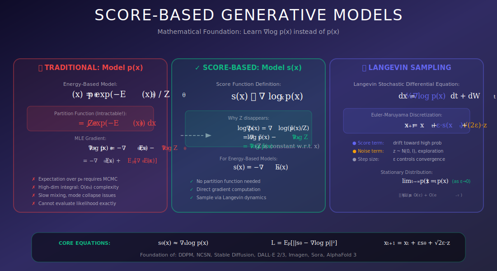
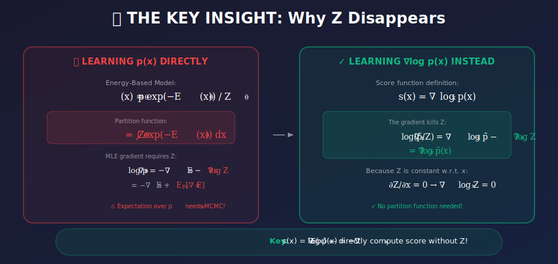
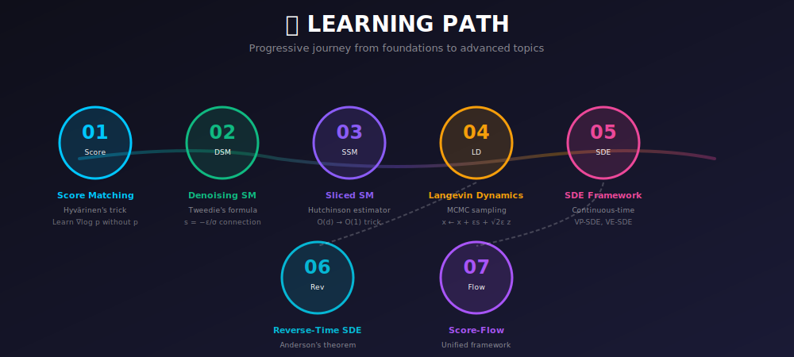

# 📈 Score-Based Generative Models

<div align="center">



*Learn the gradient of log-probability—a powerful alternative to explicit density modeling*

[](#-what-is-the-score-function)
[](#-langevin-dynamics)
[](#-sde-formulation)

</div>

---

## 🎯 Where & Why Use Score-Based Models?

<table>
<tr>
<th width="25%">📍 Application</th>
<th width="40%">💡 Why Score Models Excel</th>
<th width="35%">🔧 Example Use Cases</th>
</tr>
<tr>
<td><b>🎨 High-Quality Image Generation</b></td>
<td>State-of-the-art quality without mode collapse</td>
<td>DALL-E, Stable Diffusion, Imagen, Midjourney</td>
</tr>
<tr>
<td><b>🔬 Scientific Simulations</b></td>
<td>Model complex distributions on manifolds</td>
<td>Molecular dynamics, protein structure (AlphaFold 3)</td>
</tr>
<tr>
<td><b>🔊 Audio & Music Synthesis</b></td>
<td>Capture fine-grained temporal structure</td>
<td>WaveGrad, DiffWave, Riffusion, MusicGen</td>
</tr>
<tr>
<td><b>📊 Density Estimation</b></td>
<td>Avoids intractable normalization constants</td>
<td>Anomaly detection, uncertainty quantification</td>
</tr>
<tr>
<td><b>🧪 Bayesian Inference</b></td>
<td>Sample from unnormalized posteriors</td>
<td>Posterior sampling, inverse problems</td>
</tr>
<tr>
<td><b>🎬 Video Generation</b></td>
<td>Temporal consistency through score guidance</td>
<td>Runway Gen-2, Pika, Sora</td>
</tr>
</table>

### 🌟 The Revolutionary Insight

<div align="center">



</div>

---

## 📚 What is the Score Function?

### Definition

The **score function** of a probability distribution $p(x)$ is the gradient of its log-density:

$$\boxed{s(x) = \nabla_x \log p(x)}$$

### Key Property: Independence from Normalization

$$\nabla_x \log p(x) = \nabla_x \log \frac{\tilde{p}(x)}{Z} = \nabla_x \log \tilde{p}(x) - \underbrace{\nabla_x \log Z}_{=0} = \nabla_x \log \tilde{p}(x)$$

**This is revolutionary:** We can work with unnormalized densities!

### Geometric Interpretation

The score vector at point $x$:
- **Direction:** Points toward steepest increase in probability
- **Magnitude:** Proportional to how quickly probability increases
- **At modes:** Zero (local maxima of density)
- **Overall:** Forms a vector field over the entire data space

---

## 🗂️ Topics in This Module

<div align="center">



</div>

| # | Topic | Description | Key Concepts |
|:-:|-------|-------------|--------------|
| 📐 | **[Score Matching](./01_score_matching/)** | Learn scores from data without knowing the true density | Hyvärinen's objective, explicit vs implicit |
| 🔊 | **[Denoising Score Matching](./02_denoising_score_matching/)** | Practical, scalable score learning | Noise perturbation, Tweedie's formula |
| 🎯 | **[Sliced Score Matching](./03_sliced_score_matching/)** | Scale to high dimensions with random projections | Hutchinson estimator, variance reduction |
| 🚶 | **[Langevin Dynamics](./04_langevin_dynamics/)** | Sample using learned scores | MCMC, annealing, mixing |
| 📈 | **[SDE Formulation](./05_sde_formulation/)** | Unified continuous-time framework | VP-SDE, VE-SDE, noise schedules |
| ⏮️ | **[Reverse-Time SDE](./06_reverse_time_sde/)** | Generate samples by reversing noise | Anderson's theorem, probability flow |
| 🔗 | **[Score-Flow Relationship](./07_score_flow_relationship/)** | Connection to normalizing flows | CNFs, flow matching |

---

## 🧮 Mathematical Deep Dive

### 1. The Score Matching Problem

**Goal:** Learn $s_\theta(x) \approx \nabla_x \log p_{data}(x)$.

**Naive Objective:**

$$\mathcal{L}_{naive}(\theta) = \frac{1}{2}\mathbb{E}_{p_{data}}\left[\|s_\theta(x) - \nabla_x \log p_{data}(x)\|^2\right]$$

**Problem:** We don't know $\nabla_x \log p_{data}(x)$!

### 2. Hyvärinen's Score Matching

**Theorem (Hyvärinen, 2005):** Under mild regularity conditions:

$$\boxed{\mathcal{L}_{SM}(\theta) = \mathbb{E}_{p_{data}}\left[\frac{1}{2}\|s_\theta(x)\|^2 + \text{tr}(\nabla_x s_\theta(x))\right] + C}$$

where $C$ is constant w.r.t. $\theta$.

<details>
<summary><b>📖 Click to expand proof sketch</b></summary>

Expand the squared difference:
$$\mathbb{E}\left[\|s_\theta - \nabla \log p\|^2\right] = \mathbb{E}\left[\|s_\theta\|^2\right] - 2\mathbb{E}\left[s_\theta \cdot \nabla \log p\right] + \mathbb{E}\left[\|\nabla \log p\|^2\right]$$

The key is the cross-term. Using $\nabla \log p = \nabla p / p$:
$$\mathbb{E}_p[s_\theta \cdot \nabla \log p] = \int s_\theta(x) \cdot \nabla p(x) dx$$

Integration by parts (assuming boundary terms vanish):
$$= -\int p(x) \nabla \cdot s_\theta(x) dx = -\mathbb{E}_p[\text{tr}(\nabla_x s_\theta)]$$

</details>

### 3. Denoising Score Matching

Add noise to data: $\tilde{x} = x + \sigma\epsilon$, where $\epsilon \sim \mathcal{N}(0, I)$.

**Key Insight:** The score of the conditional distribution is known:
$$\nabla_{\tilde{x}} \log p(\tilde{x}|x) = -\frac{\tilde{x} - x}{\sigma^2} = -\frac{\epsilon}{\sigma}$$

**DSM Objective:**

$$\boxed{\mathcal{L}_{DSM}(\theta) = \mathbb{E}_{x \sim p_{data}}\mathbb{E}_{\epsilon \sim \mathcal{N}(0,I)}\left[\left\|s_\theta(x + \sigma\epsilon, \sigma) + \frac{\epsilon}{\sigma}\right\|^2\right]}$$

**Connection to DDPM:** If we define $\epsilon_\theta = -\sigma \cdot s_\theta$:

$$\mathcal{L}_{DSM} \propto \mathbb{E}\left[\|\epsilon_\theta - \epsilon\|^2\right]$$

**This is exactly the diffusion model objective!**

### 4. Langevin Dynamics

**Sampling Algorithm:** Given score $s(x) = \nabla_x \log p(x)$:

$$x_{t+1} = x_t + \frac{\epsilon}{2} s(x_t) + \sqrt{\epsilon}\, z_t, \quad z_t \sim \mathcal{N}(0, I)$$

**Convergence:** As $\epsilon \to 0$ and $t \to \infty$: $x_t \sim p(x)$.

**Intuition:**
- $\frac{\epsilon}{2} s(x_t)$: Move toward high-probability regions
- $\sqrt{\epsilon}\, z_t$: Random exploration (prevents getting stuck)

---

## 📊 Score Matching Variants Comparison

| Method | Objective | Pros | Cons |
|--------|-----------|------|------|
| **Explicit SM** | $\frac{1}{2}\|s_\theta\|^2 + \text{tr}(\nabla s_\theta)$ | Theoretically elegant | $O(d)$ backprops for Jacobian |
| **Denoising SM** | $\|s_\theta(\tilde{x}) + \epsilon/\sigma\|^2$ | Simple, efficient, scalable | Requires noise schedule |
| **Sliced SM** | $\frac{1}{2}(v^T s_\theta)^2 + v^T(\nabla s_\theta)v$ | Scales to high-d | Higher variance |
| **Flow Matching** | $\|v_\theta(x_t) - (x_1 - x_0)\|^2$ | Simplest training | Newer, less studied |

---

## 💡 Multi-Scale Score Matching (NCSN)

### The Challenge

Single noise level is problematic:
- **Low noise:** Data lies on low-dimensional manifold; score undefined in ambient space
- **High noise:** Score is well-defined but far from actual data distribution

### Solution: Noise Conditioning

Train on multiple noise levels $\{\sigma_i\}_{i=1}^{L}$:

$$\mathcal{L}(\theta) = \sum_{i=1}^{L} \lambda(\sigma_i) \mathbb{E}\left[\left\|s_\theta(x + \sigma_i\epsilon, \sigma_i) + \frac{\epsilon}{\sigma_i}\right\|^2\right]$$

### Annealed Sampling

```python
def annealed_langevin_dynamics(model, sigmas, steps_per_sigma, eps):
    """Generate samples using annealed Langevin dynamics."""
    x = torch.randn(shape)  # Start from noise
    
    for sigma in sigmas:  # High to low noise
        alpha = eps * (sigma / sigmas[-1]) ** 2  # Adaptive step size
        
        for _ in range(steps_per_sigma):
            score = model(x, sigma)
            noise = torch.randn_like(x)
            x = x + (alpha / 2) * score + math.sqrt(alpha) * noise
    
    return x
```

---

## 🔗 Connection to Diffusion Models

Score-based models and diffusion models are **two perspectives on the same framework**:

| Aspect | Score-Based View | Diffusion View |
|--------|------------------|----------------|
| **What we learn** | Score $s_\theta(x, t) = \nabla_x \log p_t(x)$ | Noise $\epsilon_\theta(x, t)$ |
| **Relationship** | $s_\theta = -\frac{\epsilon_\theta}{\sqrt{1-\bar\alpha_t}}$ | $\epsilon_\theta = -\sqrt{1-\bar\alpha_t} \cdot s_\theta$ |
| **Training** | Denoising score matching | Predict added noise |
| **Sampling** | Langevin dynamics / SDE | DDPM / DDIM |

**Unified SDE Framework:**

$$dx = f(x, t)dt + g(t)dW_t \quad \text{(forward: add noise)}$$

$$dx = [f(x,t) - g(t)^2 \nabla_x \log p_t(x)]dt + g(t)d\bar{W}_t \quad \text{(reverse: generate)}$$

---

## 📈 From Discrete to Continuous: SDE Formulation

### Variance Preserving SDE (VP-SDE / DDPM)

$$dx = -\frac{1}{2}\beta(t)x\, dt + \sqrt{\beta(t)}\, dW_t$$

### Variance Exploding SDE (VE-SDE / NCSN)

$$dx = \sqrt{\frac{d[\sigma^2(t)]}{dt}}\, dW_t$$

### Probability Flow ODE

Deterministic sampling with same marginals:

$$dx = \left[f(x,t) - \frac{1}{2}g(t)^2 \nabla_x \log p_t(x)\right]dt$$

---

## 🏆 Historical Timeline

| Year | Milestone | Significance |
|------|-----------|--------------|
| **2005** | Score Matching (Hyvärinen) | Original theoretical formulation |
| **2011** | Denoising Score Matching (Vincent) | Practical training method |
| **2019** | NCSN (Song & Ermon) | Multi-scale noise levels → better quality |
| **2020** | DDPM (Ho et al.) | Diffusion perspective goes mainstream |
| **2021** | Score SDE (Song et al.) | Unified SDE framework |
| **2022** | Stable Diffusion | Score-based models revolutionize AI art |
| **2023** | Flow Matching (Lipman et al.) | Simulation-free training |
| **2024** | Stable Diffusion 3, Sora | State-of-the-art generation |

---

## 📚 References

### Foundational Papers

1. **Hyvärinen, A.** (2005). "Estimation of Non-Normalized Statistical Models by Score Matching." *JMLR*. [PDF](http://jmlr.org/papers/v6/hyvarinen05a.html)

2. **Vincent, P.** (2011). "A Connection Between Score Matching and Denoising Autoencoders." *Neural Computation*.

3. **Song, Y., & Ermon, S.** (2019). "Generative Modeling by Estimating Gradients of the Data Distribution." *NeurIPS*. [arXiv:1907.05600](https://arxiv.org/abs/1907.05600)

4. **Ho, J., Jain, A., & Abbeel, P.** (2020). "Denoising Diffusion Probabilistic Models." *NeurIPS*. [arXiv:2006.11239](https://arxiv.org/abs/2006.11239)

5. **Song, Y., et al.** (2021). "Score-Based Generative Modeling through Stochastic Differential Equations." *ICLR*. [arXiv:2011.13456](https://arxiv.org/abs/2011.13456)

6. **Lipman, Y., et al.** (2023). "Flow Matching for Generative Modeling." *ICLR*. [arXiv:2210.02747](https://arxiv.org/abs/2210.02747)

---

## ✏️ Exercises

1. **Derive** the score function for a mixture of two Gaussians $p(x) = \frac{1}{2}\mathcal{N}(x; \mu_1, \sigma^2) + \frac{1}{2}\mathcal{N}(x; \mu_2, \sigma^2)$.

2. **Prove** Hyvärinen's identity using integration by parts in 1D.

3. **Implement** denoising score matching for 2D toy data and visualize the learned score field.

4. **Show** that Langevin dynamics converges to the target distribution.

5. **Derive** the relationship between DDPM's noise prediction and the score function.

6. **Implement** the probability flow ODE and compare with SDE sampling.

---

<div align="center">

**Start Learning:** [Score Matching](./01_score_matching/) →

*The journey from theory to state-of-the-art generation begins here*

---

**Quick Navigation**

[Score Matching](./01_score_matching/) • [Denoising SM](./02_denoising_score_matching/) • [Sliced SM](./03_sliced_score_matching/) • [Langevin](./04_langevin_dynamics/) • [SDE](./05_sde_formulation/) • [Reverse SDE](./06_reverse_time_sde/) • [Score-Flow](./07_score_flow_relationship/)

</div>
