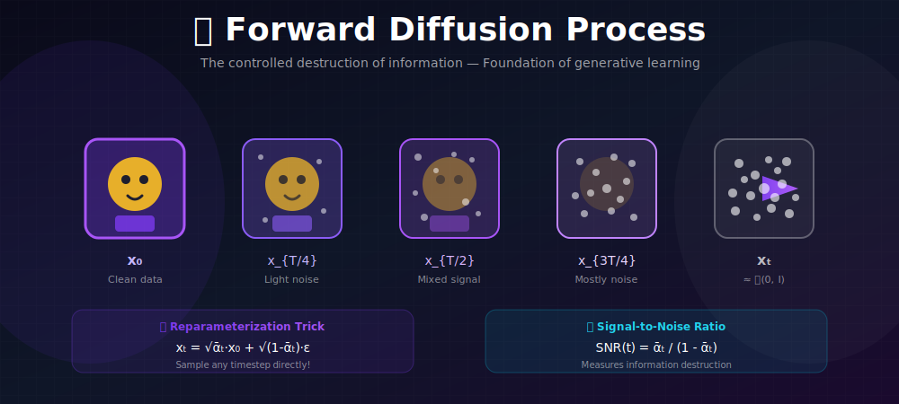
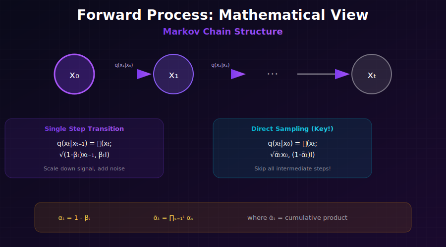
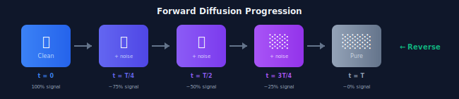

# 📉 Forward Diffusion Process

<div align="center">



*The controlled destruction of information—foundation of generative learning*

</div>

---

## 🖼️ Visual Overview

<div align="center">

### Forward Process Step-by-Step


</div>

---

[](#)
[](#)
[](#)

</div>

---

## 🎯 Where & Why Use This Knowledge?

<table>
<tr>
<th width="30%">Where It's Used</th>
<th width="35%">Why It Matters</th>
<th width="35%">Real Applications</th>
</tr>
<tr>
<td><b>🏋️ Training Data Preparation</b></td>
<td>Forward process creates noisy samples for training</td>
<td>Every diffusion model training loop</td>
</tr>
<tr>
<td><b>📊 SNR Analysis</b></td>
<td>Understanding signal-to-noise ratio guides schedule design</td>
<td>Schedule optimization, loss weighting</td>
</tr>
<tr>
<td><b>🔬 Information Theory Research</b></td>
<td>Studying how quickly information is destroyed</td>
<td>Optimal schedule derivation, theoretical analysis</td>
</tr>
<tr>
<td><b>🖼️ Image Corruption Analysis</b></td>
<td>Visualizing diffusion helps debug and understand models</td>
<td>Model debugging, educational visualization</td>
</tr>
</table>

### 💡 Why Forward Diffusion is Elegant

> *"The forward process is beautifully simple—just add Gaussian noise. But this simplicity enables a powerful closed-form solution that makes training efficient."*

**Key Advantages:**
- **No learning required**: Fixed mathematical process
- **Efficient sampling**: Jump to any timestep directly
- **Theoretical tractability**: Gaussian math is well-understood
- **Variance preservation**: Keeps data in reasonable range

---

## 📊 Representation Comparison

| Representation | Pros | Cons |
|----------------|------|------|
| **Linear β Schedule** | Simple, well-studied | May destroy info too fast |
| **Cosine Schedule** | Better log-SNR spacing | Slightly more complex |
| **Learned Schedule** | Optimal for data | Harder to train |
| **VP Formulation** | Variance preserving | Less intuitive |
| **VE Formulation** | Simpler math | Variance grows unbounded |

---

## 📖 The Forward Process

### Single-Step Definition

At each step, we:
1. **Scale down** the signal by $\sqrt{1-\beta_t}$
2. **Add noise** with variance $\beta_t$

$$\boxed{q(x_t|x_{t-1}) = \mathcal{N}(x_t; \sqrt{1-\beta_t}x_{t-1}, \beta_t I)}$$

**Expanding the Gaussian density:**

$$q(x_t|x_{t-1}) = \frac{1}{(2\pi\beta_t)^{d/2}} \exp\left(-\frac{\|x_t - \sqrt{1-\beta_t}x_{t-1}\|^2}{2\beta_t}\right)$$

where $d$ is the dimensionality of $x$.

### Understanding the Transition

**Why $\sqrt{1-\beta_t}$?** This specific choice ensures **variance preservation**:

Let $\text{Var}(x_{t-1}) = \sigma^2$. Then:

$$\text{Var}(x_t) = (1-\beta_t)\text{Var}(x_{t-1}) + \beta_t \cdot 1 = (1-\beta_t)\sigma^2 + \beta_t$$

If $\sigma^2 = 1$ initially, then $\text{Var}(x_t) = 1$ for all $t$!

### Full Markov Chain

$$q(x_{1:T}|x_0) = \prod_{t=1}^T q(x_t|x_{t-1})$$

**Expanded form:**

$$q(x_{1:T}|x_0) = q(x_1|x_0) \cdot q(x_2|x_1) \cdot q(x_3|x_2) \cdots q(x_T|x_{T-1})$$

Each step only depends on the **previous step**—this is the Markov property.

### Marginal Distribution

After $t$ steps, we can express $x_t$ directly in terms of $x_0$:

$$\boxed{q(x_t|x_0) = \mathcal{N}(x_t; \sqrt{\bar{\alpha}_t}x_0, (1-\bar{\alpha}_t)I)}$$

where $\bar{\alpha}_t = \prod_{s=1}^t (1-\beta_s) = \prod_{s=1}^t \alpha_s$.

**Notation Summary:**

| Symbol | Definition | Interpretation |
|--------|------------|----------------|
| $\beta_t$ | Noise schedule | Amount of noise added at step $t$ |
| $\alpha_t$ | $1 - \beta_t$ | Signal retention at step $t$ |
| $\bar{\alpha}_t$ | $\prod_{s=1}^t \alpha_s$ | Cumulative signal retention |
| $1 - \bar{\alpha}_t$ | — | Cumulative noise variance |

---

## 🔑 The Reparameterization Trick

### Sampling $x_t$ from $x_0$ Directly

$$\boxed{x_t = \sqrt{\bar{\alpha}_t}x_0 + \sqrt{1-\bar{\alpha}_t}\epsilon, \quad \epsilon \sim \mathcal{N}(0, I)}$$

**Why this matters:**
- ✅ **Skip steps**: No need to iterate through $t$ steps
- ✅ **Efficient training**: Sample any $x_t$ in $O(1)$
- ✅ **Parallel computation**: Train on different $t$ simultaneously

### Visual Intuition



---

## 📊 Signal-to-Noise Ratio (SNR)

### Definition

$$\boxed{\text{SNR}(t) = \frac{\bar{\alpha}_t}{1-\bar{\alpha}_t} = \frac{\text{signal variance}}{\text{noise variance}}}$$

### SNR Interpretation

| Timestep | SNR | Interpretation |
|----------|-----|----------------|
| $t \to 0$ | $\to \infty$ | Pure signal, no noise |
| $t = T/2$ | $\approx 1$ | Equal signal and noise |
| $t \to T$ | $\to 0$ | Pure noise, no signal |

### Log-SNR

For analysis, often use log-SNR:

$$\log \text{SNR}(t) = \log \bar{\alpha}_t - \log(1 - \bar{\alpha}_t)$$

A good noise schedule has **smooth, monotonic log-SNR**.

---

## 🧮 Mathematical Properties & Proofs

### Property 1: Variance Preservation

**Theorem:** If $\text{Var}(x_0) = I$, then $\text{Var}(x_t) = I$ for all $t$.

**Proof:**
$$\text{Var}(x_t) = \mathbb{E}[x_t x_t^T] - \mathbb{E}[x_t]\mathbb{E}[x_t]^T$$

Taking expectation over $x_0$ (assuming $\mathbb{E}[x_0] = 0$):
$$\mathbb{E}[x_t] = \sqrt{\bar{\alpha}_t}\mathbb{E}[x_0] = 0$$

For the second moment:
$$\mathbb{E}[x_t x_t^T] = \bar{\alpha}_t \mathbb{E}[x_0 x_0^T] + (1-\bar{\alpha}_t)I$$
$$= \bar{\alpha}_t \cdot I + (1-\bar{\alpha}_t) \cdot I = I$$ ✓

**Why it matters**: Keeps neural network activations stable throughout the diffusion process, avoiding numerical issues.

---

### Property 2: Information Destruction Rate

**Mutual Information** between $x_0$ and $x_t$ decreases monotonically:

$$I(x_0; x_t) = H(x_t) - H(x_t|x_0)$$

**Detailed calculation (for Gaussian $x_0 \sim \mathcal{N}(0, I)$):**

Since $x_t = \sqrt{\bar{\alpha}_t}x_0 + \sqrt{1-\bar{\alpha}_t}\epsilon$:

$$H(x_t) = \frac{d}{2}\log(2\pi e \cdot \text{det}(\text{Cov}(x_t))) = \frac{d}{2}\log(2\pi e)$$

$$H(x_t|x_0) = \frac{d}{2}\log(2\pi e (1-\bar{\alpha}_t))$$

Therefore:
$$\boxed{I(x_0; x_t) = -\frac{d}{2}\log(1-\bar{\alpha}_t)}$$

**Interpretation:**
| $\bar{\alpha}_t$ | $I(x_0; x_t)$ | Information State |
|------------------|---------------|-------------------|
| 1.0 | $\infty$ | Complete information |
| 0.5 | $\frac{d}{2}\log 2$ | Half information lost |
| 0.0 | 0 | No information remains |

---

### Property 3: Data Processing Inequality

**Theorem:** For the Markov chain $x_0 \to x_s \to x_t$ (where $s < t$):

$$I(x_0; x_t) \leq I(x_0; x_s)$$

**Proof:** This follows from the Data Processing Inequality. Since $x_0 \to x_s \to x_t$ forms a Markov chain, processing $x_s$ to get $x_t$ cannot increase information about $x_0$.

**Implication:** Information about $x_0$ can only decrease (or stay constant) as we progress through the forward process.

---

### Property 4: Posterior Distribution $q(x_{t-1}|x_t, x_0)$

**Theorem:** The posterior is also Gaussian:

$$q(x_{t-1}|x_t, x_0) = \mathcal{N}(x_{t-1}; \tilde{\mu}_t(x_t, x_0), \tilde{\beta}_t I)$$

where:
$$\tilde{\mu}_t = \frac{\sqrt{\bar{\alpha}_{t-1}}\beta_t}{1-\bar{\alpha}_t}x_0 + \frac{\sqrt{\alpha_t}(1-\bar{\alpha}_{t-1})}{1-\bar{\alpha}_t}x_t$$

$$\tilde{\beta}_t = \frac{(1-\bar{\alpha}_{t-1})\beta_t}{1-\bar{\alpha}_t}$$

<details>
<summary><b>Full Derivation</b></summary>

Using Bayes' rule:
$$q(x_{t-1}|x_t, x_0) = \frac{q(x_t|x_{t-1}, x_0) \cdot q(x_{t-1}|x_0)}{q(x_t|x_0)}$$

By the Markov property: $q(x_t|x_{t-1}, x_0) = q(x_t|x_{t-1})$

All three terms are Gaussian:
- $q(x_t|x_{t-1}) = \mathcal{N}(x_t; \sqrt{\alpha_t}x_{t-1}, \beta_t I)$
- $q(x_{t-1}|x_0) = \mathcal{N}(x_{t-1}; \sqrt{\bar{\alpha}_{t-1}}x_0, (1-\bar{\alpha}_{t-1})I)$
- $q(x_t|x_0) = \mathcal{N}(x_t; \sqrt{\bar{\alpha}_t}x_0, (1-\bar{\alpha}_t)I)$

**Computing the log-posterior:**
$$\log q(x_{t-1}|x_t, x_0) = -\frac{1}{2}\left[\frac{(x_t - \sqrt{\alpha_t}x_{t-1})^2}{\beta_t} + \frac{(x_{t-1} - \sqrt{\bar{\alpha}_{t-1}}x_0)^2}{1-\bar{\alpha}_{t-1}} + C\right]$$

**Expanding and grouping by powers of $x_{t-1}$:**

$$= -\frac{1}{2}\left[x_{t-1}^2\underbrace{\left(\frac{\alpha_t}{\beta_t} + \frac{1}{1-\bar{\alpha}_{t-1}}\right)}_{\text{precision } 1/\tilde{\beta}_t} - 2x_{t-1}\underbrace{\left(\frac{\sqrt{\alpha_t}x_t}{\beta_t} + \frac{\sqrt{\bar{\alpha}_{t-1}}x_0}{1-\bar{\alpha}_{t-1}}\right)}_{\text{linear term}} + C'\right]$$

**Computing the precision:**
$$\frac{1}{\tilde{\beta}_t} = \frac{\alpha_t}{\beta_t} + \frac{1}{1-\bar{\alpha}_{t-1}}$$

$$= \frac{\alpha_t(1-\bar{\alpha}_{t-1}) + \beta_t}{\beta_t(1-\bar{\alpha}_{t-1})}$$

Using $\alpha_t + \beta_t = 1$ and $\alpha_t(1-\bar{\alpha}_{t-1}) + \beta_t = 1 - \bar{\alpha}_t$:

$$= \frac{1-\bar{\alpha}_t}{\beta_t(1-\bar{\alpha}_{t-1})} \implies \tilde{\beta}_t = \frac{\beta_t(1-\bar{\alpha}_{t-1})}{1-\bar{\alpha}_t}$$

**Computing the mean:**
$$\tilde{\mu}_t = \tilde{\beta}_t\left(\frac{\sqrt{\alpha_t}x_t}{\beta_t} + \frac{\sqrt{\bar{\alpha}_{t-1}}x_0}{1-\bar{\alpha}_{t-1}}\right)$$

After simplification:
$$\tilde{\mu}_t = \frac{\sqrt{\bar{\alpha}_{t-1}}\beta_t}{1-\bar{\alpha}_t}x_0 + \frac{\sqrt{\alpha_t}(1-\bar{\alpha}_{t-1})}{1-\bar{\alpha}_t}x_t$$

</details>

**This posterior is crucial for the reverse process!**

---

### Property 5: Asymptotic Behavior

**Theorem:** As $T \to \infty$ with $\sum_t \beta_t = \infty$:

$$q(x_T|x_0) \xrightarrow{d} \mathcal{N}(0, I)$$

$$D_{KL}(q(x_T|x_0) \| \mathcal{N}(0, I)) \to 0$$

**Explicit KL formula:**

$$D_{KL}(q(x_T|x_0) \| \mathcal{N}(0, I)) = \frac{1}{2}\left[\bar{\alpha}_T\|x_0\|^2 - d\log(1-\bar{\alpha}_T) - d\bar{\alpha}_T\right]$$

For bounded $\|x_0\|$, this vanishes as $\bar{\alpha}_T \to 0$.

---

## 🔢 Complete Mathematical Derivations

### Derivation 1: Closed-Form Marginal $q(x_t|x_0)$

**Goal**: Show $q(x_t|x_0) = \mathcal{N}(\sqrt{\bar{\alpha}_t}x_0, (1-\bar{\alpha}_t)I)$

<details>
<summary><b>Method 1: Proof by Induction</b></summary>

**Base case** ($t=1$):
$$x_1 = \sqrt{\alpha_1}x_0 + \sqrt{1-\alpha_1}\epsilon_1, \quad \epsilon_1 \sim \mathcal{N}(0, I)$$

- Mean: $\mathbb{E}[x_1|x_0] = \sqrt{\alpha_1}x_0 = \sqrt{\bar{\alpha}_1}x_0$ ✓
- Variance: $\text{Var}(x_1|x_0) = (1-\alpha_1) \cdot I = (1-\bar{\alpha}_1)I$ ✓

**Inductive step**: Assume true for $t$:
$$x_t = \sqrt{\bar{\alpha}_t}x_0 + \sqrt{1-\bar{\alpha}_t}\bar{\epsilon}_t, \quad \bar{\epsilon}_t \sim \mathcal{N}(0, I)$$

Then:
$$x_{t+1} = \sqrt{\alpha_{t+1}}x_t + \sqrt{1-\alpha_{t+1}}\epsilon_{t+1}$$

Substituting:
$$x_{t+1} = \sqrt{\alpha_{t+1}}(\sqrt{\bar{\alpha}_t}x_0 + \sqrt{1-\bar{\alpha}_t}\bar{\epsilon}_t) + \sqrt{1-\alpha_{t+1}}\epsilon_{t+1}$$

$$= \sqrt{\alpha_{t+1}\bar{\alpha}_t}x_0 + \underbrace{\sqrt{\alpha_{t+1}(1-\bar{\alpha}_t)}\bar{\epsilon}_t + \sqrt{1-\alpha_{t+1}}\epsilon_{t+1}}_{\text{sum of independent Gaussians}}$$

**Computing the mean:**
$$\mathbb{E}[x_{t+1}|x_0] = \sqrt{\alpha_{t+1}\bar{\alpha}_t}x_0 = \sqrt{\bar{\alpha}_{t+1}}x_0$$ ✓

**Computing the variance** (using $\text{Var}(aX + bY) = a^2\text{Var}(X) + b^2\text{Var}(Y)$ for independent $X, Y$):
$$\text{Var}(x_{t+1}|x_0) = \alpha_{t+1}(1-\bar{\alpha}_t) + (1-\alpha_{t+1})$$
$$= \alpha_{t+1} - \alpha_{t+1}\bar{\alpha}_t + 1 - \alpha_{t+1}$$
$$= 1 - \alpha_{t+1}\bar{\alpha}_t = 1 - \bar{\alpha}_{t+1}$$ ✓

</details>

<details>
<summary><b>Method 2: Direct Derivation via Characteristic Functions</b></summary>

**Using characteristic functions (moment generating functions):**

The characteristic function of $\mathcal{N}(\mu, \sigma^2)$ is:
$$\phi(t) = \exp\left(i\mu t - \frac{\sigma^2 t^2}{2}\right)$$

For the iterative process $x_t = \sqrt{\alpha_t}x_{t-1} + \sqrt{\beta_t}\epsilon$:

$$\phi_{x_t|x_0}(s) = \mathbb{E}[\exp(is^T x_t)|x_0]$$

Since each step is a linear transformation of Gaussian:
$$\phi_{x_t|x_0}(s) = \exp\left(is^T\sqrt{\bar{\alpha}_t}x_0 - \frac{(1-\bar{\alpha}_t)\|s\|^2}{2}\right)$$

This is the characteristic function of $\mathcal{N}(\sqrt{\bar{\alpha}_t}x_0, (1-\bar{\alpha}_t)I)$. ✓

</details>

<details>
<summary><b>Method 3: Recursive Substitution</b></summary>

Starting from $x_0$, recursively substitute:

$$x_1 = \sqrt{\alpha_1}x_0 + \sqrt{1-\alpha_1}\epsilon_1$$
$$x_2 = \sqrt{\alpha_2}x_1 + \sqrt{1-\alpha_2}\epsilon_2$$
$$= \sqrt{\alpha_2\alpha_1}x_0 + \sqrt{\alpha_2(1-\alpha_1)}\epsilon_1 + \sqrt{1-\alpha_2}\epsilon_2$$

Continuing this pattern:
$$x_t = \sqrt{\prod_{s=1}^t \alpha_s}x_0 + \sum_{i=1}^t \sqrt{\prod_{s=i+1}^t \alpha_s} \cdot \sqrt{1-\alpha_i} \cdot \epsilon_i$$

The sum of weighted independent Gaussians has variance:
$$\sum_{i=1}^t \left(\prod_{s=i+1}^t \alpha_s\right)(1-\alpha_i) = 1 - \prod_{s=1}^t \alpha_s = 1 - \bar{\alpha}_t$$

(This can be proven by induction or telescoping.) ✓

</details>

---

### Derivation 2: Why the Noise Adds to $\mathcal{N}(0, I)$

**Theorem:** As $T \to \infty$ with appropriate $\beta_t$, $q(x_T) \to \mathcal{N}(0, I)$.

**Proof:**

The marginal at time $T$ has:
- Mean: $\sqrt{\bar{\alpha}_T}x_0 \to 0$ as $\bar{\alpha}_T \to 0$
- Variance: $(1 - \bar{\alpha}_T)I \to I$ as $\bar{\alpha}_T \to 0$

**Condition for convergence:** We need $\bar{\alpha}_T = \prod_{s=1}^T (1-\beta_s) \to 0$.

For small $\beta_s$: $\log(1-\beta_s) \approx -\beta_s$

$$\log \bar{\alpha}_T = \sum_{s=1}^T \log(1-\beta_s) \approx -\sum_{s=1}^T \beta_s$$

So $\bar{\alpha}_T \to 0$ when $\sum_{s=1}^T \beta_s \to \infty$.

**Example (Linear schedule):** $\beta_t = \beta_{min} + (t-1)\frac{\beta_{max}-\beta_{min}}{T-1}$

$$\sum_{s=1}^T \beta_s = T \cdot \frac{\beta_{min} + \beta_{max}}{2} \to \infty \text{ as } T \to \infty$$

---

### Derivation 3: Information-Theoretic Analysis

**Mutual Information Decay:**

$$I(x_0; x_t) = H(x_t) - H(x_t|x_0)$$

Since $q(x_t|x_0)$ is Gaussian with variance $(1-\bar{\alpha}_t)I$:

$$H(x_t|x_0) = \frac{d}{2}\log(2\pi e (1-\bar{\alpha}_t))$$

As $t \to T$: $(1-\bar{\alpha}_t) \to 1$, so $H(x_t|x_0) \to \frac{d}{2}\log(2\pi e)$ (entropy of $\mathcal{N}(0,I)$)

**KL Divergence to Prior:**

$$D_{KL}(q(x_T|x_0) \| \mathcal{N}(0,I)) = \frac{1}{2}\left[\bar{\alpha}_T\|x_0\|^2 + d(1-\bar{\alpha}_T) - d - d\log(1-\bar{\alpha}_T)\right]$$

As $\bar{\alpha}_T \to 0$: $D_{KL} \to 0$. ✓

---

## 💻 Implementation

```python
import torch

def forward_diffusion(x0, t, alpha_bar):
    """
    Sample x_t from q(x_t | x_0) using the reparameterization trick.
    
    Args:
        x0: Original data [batch, channels, height, width]
        t: Timestep indices [batch]
        alpha_bar: Cumulative alpha values [T]
    
    Returns:
        x_t: Noised data at timestep t
        epsilon: The noise that was added (needed for training)
    """
    # Get alpha_bar for each sample in batch
    # Shape: [batch, 1, 1, 1] for proper broadcasting
    alpha_bar_t = alpha_bar[t].view(-1, *([1] * (x0.dim() - 1)))
    
    # Sample noise
    epsilon = torch.randn_like(x0)
    
    # Apply forward process: x_t = sqrt(alpha_bar_t) * x_0 + sqrt(1 - alpha_bar_t) * epsilon
    x_t = torch.sqrt(alpha_bar_t) * x0 + torch.sqrt(1 - alpha_bar_t) * epsilon
    
    return x_t, epsilon


def get_alpha_bar(betas):
    """
    Compute cumulative alpha values from noise schedule.
    
    Args:
        betas: Noise schedule [T]
    
    Returns:
        alpha_bar: Cumulative product of (1 - beta) [T]
    """
    alphas = 1 - betas
    alpha_bar = torch.cumprod(alphas, dim=0)
    return alpha_bar


# Example usage
T = 1000
betas = torch.linspace(1e-4, 0.02, T)  # Linear schedule
alpha_bar = get_alpha_bar(betas)

# Simulate forward diffusion
x0 = torch.randn(16, 3, 64, 64)  # Batch of 16 images
t = torch.randint(0, T, (16,))    # Random timesteps
x_t, noise = forward_diffusion(x0, t, alpha_bar)
```

---

## 📈 Visualization: Watching Information Disappear

```python
import matplotlib.pyplot as plt

def visualize_forward_diffusion(x0, alpha_bar, timesteps=[0, 250, 500, 750, 999]):
    """Visualize the forward diffusion process at different timesteps."""
    fig, axes = plt.subplots(1, len(timesteps), figsize=(15, 3))
    
    for ax, t in zip(axes, timesteps):
        if t == 0:
            x_t = x0
        else:
            x_t, _ = forward_diffusion(x0, torch.tensor([t]), alpha_bar)
        
        # Convert to displayable format
        img = x_t[0].permute(1, 2, 0).clamp(-1, 1) * 0.5 + 0.5
        
        ax.imshow(img.numpy())
        ax.set_title(f't = {t}\nSNR = {alpha_bar[t]/(1-alpha_bar[t]):.2f}')
        ax.axis('off')
    
    plt.tight_layout()
    plt.savefig('forward_diffusion_visualization.png')
```

---

## 📊 Key Equations Summary

| Concept | Formula |
|---------|---------|
| Single step | $q(x_t\|x_{t-1}) = \mathcal{N}(\sqrt{1-\beta_t}x_{t-1}, \beta_t I)$ |
| Marginal | $q(x_t\|x_0) = \mathcal{N}(\sqrt{\bar{\alpha}_t}x_0, (1-\bar{\alpha}_t)I)$ |
| Reparameterization | $x_t = \sqrt{\bar{\alpha}_t}x_0 + \sqrt{1-\bar{\alpha}_t}\epsilon$ |
| SNR | $\text{SNR}(t) = \bar{\alpha}_t / (1-\bar{\alpha}_t)$ |
| Cumulative alpha | $\bar{\alpha}_t = \prod_{s=1}^t (1-\beta_s)$ |

---

## 📚 References

1. **Ho, J., Jain, A., & Abbeel, P.** (2020). "Denoising Diffusion Probabilistic Models." *NeurIPS*. [arXiv:2006.11239](https://arxiv.org/abs/2006.11239)

2. **Sohl-Dickstein, J., et al.** (2015). "Deep Unsupervised Learning using Nonequilibrium Thermodynamics." *ICML*. [arXiv:1503.03585](https://arxiv.org/abs/1503.03585)

---

## ✏️ Exercises

1. **Prove** that $q(x_t|x_0) = \mathcal{N}(\sqrt{\bar{\alpha}_t}x_0, (1-\bar{\alpha}_t)I)$ by induction.

2. **Compute** the SNR at $t = T/2$ for linear and cosine schedules with $T=1000$.

3. **Visualize** forward diffusion on MNIST—show $x_t$ for $t \in \{0, 250, 500, 750, 1000\}$.

4. **Derive** the entropy $H(x_t|x_0)$ as a function of $t$.

5. **Show** that the process is variance-preserving when $\text{Var}(x_0) = 1$.

6. **Implement** the forward process and verify numerically that variance is preserved.

---

<div align="center">

**[← Back to Diffusion Fundamentals](../)** | **[Next: Noise Schedules →](../02_noise_schedules/)**

</div>
