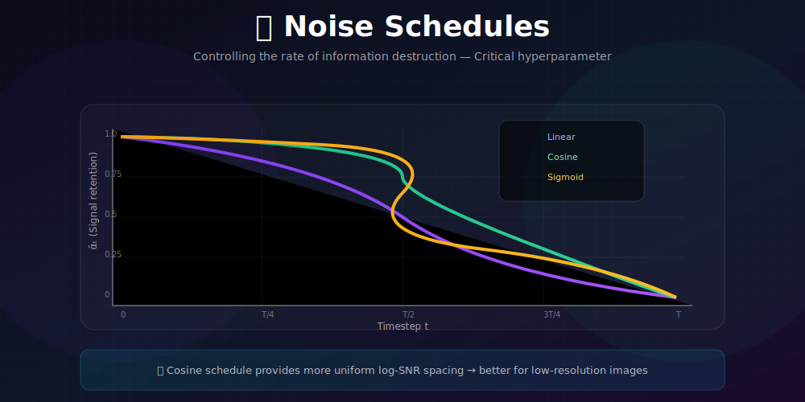
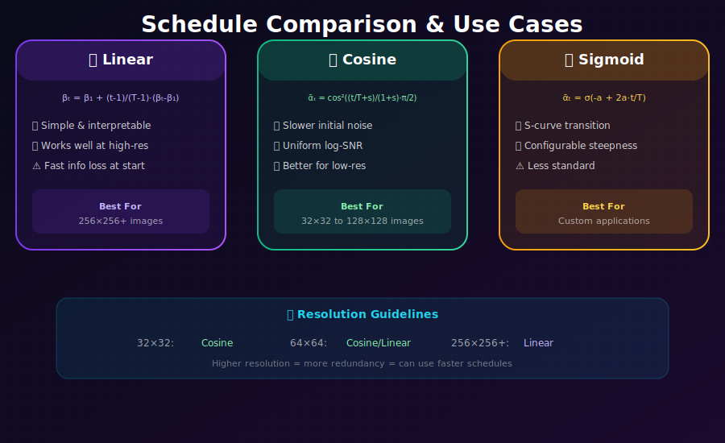

# 📊 Noise Schedules in Diffusion Models

<div align="center">



*The art of controlling information destruction—where schedule design meets generation quality*

</div>

---

## 🖼️ Visual Overview

<div align="center">

### Schedule Comparison


</div>

---

[](#)
[](#)
[](#)

</div>

---

## 🎯 Where & Why Use This Knowledge?

<table>
<tr>
<th width="30%">Where It's Used</th>
<th width="35%">Why It Matters</th>
<th width="35%">Real Applications</th>
</tr>
<tr>
<td><b>🎨 Model Quality Tuning</b></td>
<td>Schedule choice significantly affects sample quality</td>
<td>Stable Diffusion, DALL-E, production models</td>
</tr>
<tr>
<td><b>📐 Resolution Adaptation</b></td>
<td>Different resolutions need different schedules</td>
<td>Training at 256×256 vs 1024×1024</td>
</tr>
<tr>
<td><b>⚡ Efficiency Optimization</b></td>
<td>Better schedules enable faster sampling</td>
<td>Real-time applications, reduced compute</td>
</tr>
<tr>
<td><b>🔬 Research & Development</b></td>
<td>Novel schedules can improve SOTA</td>
<td>Academic papers, architecture improvements</td>
</tr>
</table>

### 💡 Why Noise Schedules Matter

> *"The noise schedule is one of the most underappreciated hyperparameters. A bad schedule can ruin an otherwise perfect model; a good schedule can make a simple model shine."*

**Impact on Generation:**
- **Too fast**: Model can't learn fine details (destroys info too quickly)
- **Too slow**: Inefficient, model wastes capacity on easy steps
- **Just right**: Smooth learning across all detail levels

---

## 📖 Role of the Noise Schedule

### What It Controls

The sequence $\{\beta_t\}_{t=1}^T$ determines:

| Aspect | Effect | Visualization |
|--------|--------|---------------|
| **Rate of noise addition** | How quickly info is destroyed | Speed of blur |
| **SNR curve** | Signal-to-noise progression | Quality at each step |
| **Difficulty distribution** | Which timesteps are hardest | Where model focuses |
| **Generation order** | Global→local or uniform | Structure vs details |

### Key Quantities

From $\beta_t$, we derive everything:

$$\alpha_t = 1 - \beta_t$$
$$\bar{\alpha}_t = \prod_{s=1}^t \alpha_s$$
$$\text{SNR}(t) = \frac{\bar{\alpha}_t}{1 - \bar{\alpha}_t}$$

---

## 📈 Common Schedules

### 1. Linear Schedule (Original DDPM)

<div align="center">

$$\boxed{\beta_t = \beta_{\min} + \frac{t-1}{T-1}(\beta_{\max} - \beta_{\min})}$$

</div>

**Typical values:** $\beta_{\min} = 10^{-4}$, $\beta_{\max} = 0.02$, $T = 1000$

| Pros | Cons |
|------|------|
| ✅ Simple and interpretable | ❌ May be suboptimal for low-res |
| ✅ Uniform noise increase | ❌ Destroys fine details quickly |
| ✅ Works well at high resolution | ❌ Not optimal log-SNR spacing |

### 2. Cosine Schedule (Improved DDPM)

<div align="center">

$$\boxed{\bar{\alpha}_t = \frac{f(t)}{f(0)}, \quad f(t) = \cos^2\left(\frac{t/T + s}{1 + s} \cdot \frac{\pi}{2}\right)}$$

</div>

**Typical values:** $s = 0.008$ (small offset to prevent $\beta_t = 0$)

Then: $\beta_t = 1 - \frac{\bar{\alpha}_t}{\bar{\alpha}_{t-1}}$ (clipped to $[0, 0.999]$)

| Pros | Cons |
|------|------|
| ✅ Slower noise increase initially | ❌ More complex to implement |
| ✅ Better for low-resolution images | ❌ May be too slow for high-res |
| ✅ More uniform log-SNR spacing | ❌ Requires clipping |

### 3. Sigmoid Schedule

<div align="center">

$$\boxed{\bar{\alpha}_t = \sigma\left(-a + 2a \cdot \frac{t}{T}\right)}$$

</div>

where $\sigma$ is the sigmoid function and $a$ controls steepness (e.g., $a = 3$).

| Pros | Cons |
|------|------|
| ✅ Smooth S-curve transition | ❌ Less studied |
| ✅ Configurable via $a$ | ❌ May need tuning |
| ✅ Natural transition behavior | ❌ Not standard |

### 4. Quadratic Schedule

$$\beta_t = \beta_{\min} + \left(\frac{t-1}{T-1}\right)^2 (\beta_{\max} - \beta_{\min})$$

**Properties:** Slower start, faster end. Less aggressive than linear initially.

---

## 📊 SNR Analysis: Deep Mathematical Dive

### Understanding Signal-to-Noise Ratio

The **Signal-to-Noise Ratio (SNR)** measures the relative strength of the original signal vs. added noise:

$$\boxed{\text{SNR}(t) = \frac{\text{Var}(\text{signal})}{\text{Var}(\text{noise})} = \frac{\bar{\alpha}_t}{1 - \bar{\alpha}_t}}$$

**Derivation:**

From $x_t = \sqrt{\bar{\alpha}_t}x_0 + \sqrt{1-\bar{\alpha}_t}\epsilon$:
- Signal component: $\sqrt{\bar{\alpha}_t}x_0$ has variance $\bar{\alpha}_t \cdot \text{Var}(x_0) = \bar{\alpha}_t$
- Noise component: $\sqrt{1-\bar{\alpha}_t}\epsilon$ has variance $(1-\bar{\alpha}_t)$

### Log-SNR: The Key Quantity

$$\boxed{\lambda(t) = \log \text{SNR}(t) = \log \bar{\alpha}_t - \log(1 - \bar{\alpha}_t)}$$

**Properties of log-SNR:**

| Time | $\bar{\alpha}_t$ | $\lambda(t)$ | Interpretation |
|------|------------------|--------------|----------------|
| $t=0$ | $\approx 1$ | $+\infty$ | Pure signal |
| $t=T/2$ | $\approx 0.5$ | $0$ | Equal signal/noise |
| $t=T$ | $\approx 0$ | $-\infty$ | Pure noise |

**Monotonicity Theorem:** $\lambda(t)$ is strictly decreasing in $t$ for any valid schedule.

**Proof:** 
$$\frac{d\lambda}{dt} = \frac{d\bar{\alpha}_t/dt}{\bar{\alpha}_t} + \frac{d\bar{\alpha}_t/dt}{1-\bar{\alpha}_t} = \frac{d\bar{\alpha}_t/dt}{\bar{\alpha}_t(1-\bar{\alpha}_t)}$$

Since $d\bar{\alpha}_t/dt < 0$ (noise always increases) and $0 < \bar{\alpha}_t < 1$, we have $d\lambda/dt < 0$. ✓

---

### Mathematical Analysis of Each Schedule

#### Linear Schedule

$$\beta_t = \beta_{min} + \frac{t-1}{T-1}(\beta_{max} - \beta_{min})$$

**Cumulative product (for small $\beta$):**

$$\bar{\alpha}_t = \prod_{s=1}^t (1-\beta_s) \approx \exp\left(-\sum_{s=1}^t \beta_s\right)$$

**Sum of linear schedule:**
$$\sum_{s=1}^t \beta_s = t \cdot \beta_{min} + \frac{t(t-1)}{2(T-1)}(\beta_{max} - \beta_{min})$$

**Approximation:** $\bar{\alpha}_t \approx \exp(-at - bt^2)$ where:
- $a = \beta_{min}$
- $b = \frac{\beta_{max} - \beta_{min}}{2(T-1)}$

**Log-SNR for linear:**
$$\lambda_{linear}(t) \approx -at - bt^2 - \log(1 - e^{-at-bt^2})$$

---

#### Cosine Schedule

Designed to have uniform log-SNR spacing:

$$\bar{\alpha}_t = \frac{f(t)}{f(0)}, \quad f(t) = \cos^2\left(\frac{t/T + s}{1 + s} \cdot \frac{\pi}{2}\right)$$

**Why cosine works:**

$$\cos^2(\theta) = \frac{1 + \cos(2\theta)}{2}$$

Near $\theta = \pi/2$: $\cos^2(\theta) \approx (\pi/2 - \theta)^2$

**Log-SNR for cosine:**

Let $\theta = \frac{t/T + s}{1+s} \cdot \frac{\pi}{2}$, then:

$$\bar{\alpha}_t = \cos^2(\theta) / \cos^2(\theta_0)$$

$$\lambda(t) = \log\cos^2(\theta) - \log\sin^2(\theta) + C$$
$$= 2\log\cot(\theta) + C$$
$$\approx -2\log\tan(\theta) + C$$

**Key insight:** The $\tan$ function's derivative is $\sec^2(\theta)$, which is relatively uniform, giving more even spacing of log-SNR values.

---

#### Sigmoid Schedule

$$\bar{\alpha}_t = \frac{\sigma(-a + 2a \cdot t/T)}{\sigma(-a)}$$

where $\sigma(x) = \frac{1}{1 + e^{-x}}$ is the sigmoid function.

**Log-SNR for sigmoid:**

$$\lambda(t) = \log\sigma(-a + 2at/T) - \log(1 - \sigma(-a + 2at/T)) + C$$
$$= -a + 2at/T + C$$

**Remarkable property:** Sigmoid gives **perfectly linear log-SNR**!

---

### Optimal Schedule Derivation

**Theorem (Uniform Log-SNR):** The optimal schedule for equal learning across timesteps satisfies:

$$\frac{d\lambda(t)}{dt} = \text{constant} = -\frac{\lambda(0) - \lambda(T)}{T}$$

**Derivation:**

If we want uniform learning, each timestep should contribute equally to the total log-SNR change. This gives:

$$\lambda(t) = \lambda(0) - \frac{t}{T}(\lambda(0) - \lambda(T))$$

Solving for $\bar{\alpha}_t$:

$$\bar{\alpha}_t = \frac{\text{SNR}_0 \cdot e^{-ct/T}}{\text{SNR}_0 \cdot e^{-ct/T} + 1}$$

where $c = \log(\text{SNR}_0/\text{SNR}_T)$.

**This is exactly the sigmoid schedule!**

---

## 🖼️ Resolution Guidelines

Different resolutions need different schedules:

| Resolution | Recommended | Rationale |
|------------|-------------|-----------|
| **32×32** | Cosine | Need to preserve early details longer |
| **64×64** | Cosine or Linear | Both work, cosine slightly better |
| **256×256** | Linear | Higher res = more redundancy |
| **512×512+** | Shifted Linear | Need more aggressive start |

### Why Resolution Matters

**Higher resolution images have more redundancy:**
- A single noise sample affects more pixels
- More noise needed to destroy the same information
- Can afford faster schedules

**Lower resolution images are fragile:**
- Each pixel is more important
- Need gentler noise addition
- Cosine schedule preserves early structure

---

## 💻 Implementation

```python
import torch
import numpy as np

def linear_schedule(T, beta_min=1e-4, beta_max=0.02):
    """
    Linear noise schedule (original DDPM).
    
    Args:
        T: Number of timesteps
        beta_min: Starting beta value
        beta_max: Ending beta value
    
    Returns:
        betas: Tensor of shape [T]
    """
    return torch.linspace(beta_min, beta_max, T)


def cosine_schedule(T, s=0.008):
    """
    Cosine noise schedule (Improved DDPM).
    
    Produces smoother noise addition, better for low-res images.
    
    Args:
        T: Number of timesteps
        s: Small offset to prevent beta=0 at t=0
    
    Returns:
        betas: Tensor of shape [T]
    """
    t = torch.linspace(0, T, T + 1)
    f_t = torch.cos((t / T + s) / (1 + s) * torch.pi / 2) ** 2
    alpha_bar = f_t / f_t[0]
    betas = 1 - alpha_bar[1:] / alpha_bar[:-1]
    return torch.clamp(betas, max=0.999)


def sigmoid_schedule(T, start=-3, end=3):
    """
    Sigmoid noise schedule.
    
    S-curve transition: slow start, fast middle, slow end.
    
    Args:
        T: Number of timesteps
        start: Sigmoid input at t=0
        end: Sigmoid input at t=T
    
    Returns:
        betas: Tensor of shape [T]
    """
    t = torch.linspace(0, T, T + 1)
    v_t = torch.sigmoid(start + (end - start) * t / T)
    alpha_bar = v_t / v_t[0]
    betas = 1 - alpha_bar[1:] / alpha_bar[:-1]
    return torch.clamp(betas, max=0.999)


def get_schedule_quantities(betas):
    """
    Compute all schedule-related quantities needed for training and sampling.
    
    Args:
        betas: Noise schedule tensor [T]
    
    Returns:
        dict: All precomputed schedule values
    """
    alphas = 1 - betas
    alpha_bar = torch.cumprod(alphas, dim=0)
    alpha_bar_prev = torch.cat([torch.ones(1), alpha_bar[:-1]])
    
    # Posterior variance for reverse process
    posterior_variance = betas * (1 - alpha_bar_prev) / (1 - alpha_bar)
    
    return {
        'betas': betas,
        'alphas': alphas,
        'alpha_bar': alpha_bar,
        'alpha_bar_prev': alpha_bar_prev,
        'sqrt_alpha_bar': torch.sqrt(alpha_bar),
        'sqrt_one_minus_alpha_bar': torch.sqrt(1 - alpha_bar),
        'sqrt_recip_alpha': 1 / torch.sqrt(alphas),
        'posterior_variance': posterior_variance,
        'posterior_log_variance': torch.log(torch.clamp(posterior_variance, min=1e-20)),
        'snr': alpha_bar / (1 - alpha_bar),
        'log_snr': torch.log(alpha_bar / (1 - alpha_bar)),
    }
```

---

## 📈 Visualization: Comparing Schedules

```python
import matplotlib.pyplot as plt

def plot_schedules(T=1000):
    """Compare different noise schedules visually."""
    linear = get_schedule_quantities(linear_schedule(T))
    cosine = get_schedule_quantities(cosine_schedule(T))
    sigmoid = get_schedule_quantities(sigmoid_schedule(T))
    
    fig, axes = plt.subplots(2, 2, figsize=(12, 10))
    t = np.arange(T)
    
    # Alpha bar
    axes[0, 0].plot(t, linear['alpha_bar'], label='Linear', color='#667eea')
    axes[0, 0].plot(t, cosine['alpha_bar'], label='Cosine', color='#38ef7d')
    axes[0, 0].plot(t, sigmoid['alpha_bar'], label='Sigmoid', color='#f5576c')
    axes[0, 0].set_xlabel('Timestep t')
    axes[0, 0].set_ylabel('α̅ₜ')
    axes[0, 0].set_title('Signal Retention (α̅ₜ)')
    axes[0, 0].legend()
    
    # Log SNR
    axes[0, 1].plot(t, linear['log_snr'], label='Linear', color='#667eea')
    axes[0, 1].plot(t, cosine['log_snr'], label='Cosine', color='#38ef7d')
    axes[0, 1].plot(t, sigmoid['log_snr'], label='Sigmoid', color='#f5576c')
    axes[0, 1].set_xlabel('Timestep t')
    axes[0, 1].set_ylabel('log SNR(t)')
    axes[0, 1].set_title('Log Signal-to-Noise Ratio')
    axes[0, 1].legend()
    
    # Beta values
    axes[1, 0].plot(t, linear['betas'], label='Linear', color='#667eea')
    axes[1, 0].plot(t, cosine['betas'], label='Cosine', color='#38ef7d')
    axes[1, 0].plot(t, sigmoid['betas'], label='Sigmoid', color='#f5576c')
    axes[1, 0].set_xlabel('Timestep t')
    axes[1, 0].set_ylabel('βₜ')
    axes[1, 0].set_title('Noise Amount per Step (βₜ)')
    axes[1, 0].legend()
    
    # SNR
    axes[1, 1].semilogy(t, linear['snr'], label='Linear', color='#667eea')
    axes[1, 1].semilogy(t, cosine['snr'], label='Cosine', color='#38ef7d')
    axes[1, 1].semilogy(t, sigmoid['snr'], label='Sigmoid', color='#f5576c')
    axes[1, 1].set_xlabel('Timestep t')
    axes[1, 1].set_ylabel('SNR(t) (log scale)')
    axes[1, 1].set_title('Signal-to-Noise Ratio')
    axes[1, 1].legend()
    
    plt.tight_layout()
    plt.savefig('schedule_comparison.png', dpi=150)

plot_schedules()
```

---

## 🔬 Advanced: Loss Weighting Theory

### The Problem with Uniform Weighting

The simplified DDPM loss weights all timesteps equally:
$$\mathcal{L}_{simple} = \mathbb{E}_{t \sim \text{Uniform}(1,T)}[\|\epsilon - \epsilon_\theta(x_t, t)\|^2]$$

**Why this is suboptimal:**

Different timesteps contribute differently to the ELBO (Evidence Lower Bound):

$$\mathcal{L}_{VLB} = \mathbb{E}_t[w_{VLB}(t) \cdot \|\epsilon - \epsilon_\theta\|^2]$$

where the true VLB weighting is:

$$\boxed{w_{VLB}(t) = \frac{\beta_t^2}{2\sigma_t^2\alpha_t(1-\bar{\alpha}_t)}}$$

---

### Mathematical Analysis of Loss Weighting

**Theorem (Ho et al.):** The KL divergence term $\mathcal{L}_{t-1}$ can be written as:

$$\mathcal{L}_{t-1} = \mathbb{E}_q\left[\frac{1}{2\sigma_t^2}\|\tilde{\mu}_t(x_t, x_0) - \mu_\theta(x_t, t)\|^2\right]$$

**Deriving the weight:**

Substituting the parameterization $\mu_\theta = \frac{1}{\sqrt{\alpha_t}}(x_t - \frac{\beta_t}{\sqrt{1-\bar{\alpha}_t}}\epsilon_\theta)$:

$$\tilde{\mu}_t - \mu_\theta = \frac{\beta_t}{\sqrt{\alpha_t}(1-\bar{\alpha}_t)}(\sqrt{1-\bar{\alpha}_t}\epsilon_\theta - \sqrt{1-\bar{\alpha}_t}\epsilon)$$

$$= \frac{\beta_t}{\sqrt{\alpha_t}\sqrt{1-\bar{\alpha}_t}}(\epsilon_\theta - \epsilon)$$

Therefore:
$$\mathcal{L}_{t-1} = \frac{\beta_t^2}{2\sigma_t^2\alpha_t(1-\bar{\alpha}_t)}\|\epsilon - \epsilon_\theta\|^2$$

---

### Min-SNR Weighting

**Hang et al. (2023)** propose:
$$w_{MinSNR}(t) = \min(\text{SNR}(t), \gamma) \cdot \frac{1}{\text{SNR}(t)}$$

where $\gamma \approx 5$ is a truncation value.

**Intuition:**
- For $\text{SNR}(t) < \gamma$: $w(t) = 1$ (full weight for noisy steps)
- For $\text{SNR}(t) > \gamma$: $w(t) = \gamma/\text{SNR}(t)$ (reduced weight for clean steps)

**Mathematical justification:**

The expected gradient magnitude scales as:
$$\|\nabla_\theta \mathcal{L}\| \propto \text{SNR}(t)$$

To balance gradients: $w(t) \propto 1/\text{SNR}(t)$, capped at $\gamma$ to prevent instability.

```python
def min_snr_loss_weight(snr, gamma=5.0):
    """
    Min-SNR loss weighting for balanced training.
    
    Mathematical form: w(t) = min(SNR(t), γ) / SNR(t)
    
    Args:
        snr: Signal-to-noise ratio at timestep t
        gamma: Maximum weight (truncation)
    
    Returns:
        weight: Loss weight for this timestep
    """
    # min(SNR, γ) / SNR = min(1, γ/SNR)
    return torch.minimum(snr, torch.full_like(snr, gamma)) / snr
```

---

### P2 (Perception Prioritized) Weighting

**Choi et al.** propose weighting based on perceptual importance:

$$w_{P2}(t) = \frac{1}{(k + \text{SNR}(t))^\gamma}$$

where typically $k = 1$ and $\gamma \approx 1$.

**Interpretation:** 
- Down-weights high-SNR (early) steps where predictions are "easy"
- Up-weights intermediate SNR where perceptual details are learned

---

### Comparing Weightings

| Weighting | Formula | Behavior |
|-----------|---------|----------|
| **Uniform** | $w(t) = 1$ | Overweights easy steps |
| **VLB** | $\propto \beta_t^2/[\sigma_t^2\alpha_t(1-\bar{\alpha}_t)]$ | Theoretically optimal |
| **Min-SNR** | $\min(\text{SNR}, \gamma)/\text{SNR}$ | Balances gradients |
| **P2** | $1/(k + \text{SNR})^\gamma$ | Prioritizes perception |

---

## 📊 Key Equations Summary

| Schedule | Definition |
|----------|------------|
| **Linear** | $\beta_t = \beta_{\min} + \frac{t-1}{T-1}(\beta_{\max} - \beta_{\min})$ |
| **Cosine** | $\bar{\alpha}_t = \cos^2((t/T + s)/(1+s) \cdot \pi/2) / C$ |
| **Sigmoid** | $\bar{\alpha}_t = \sigma(-a + 2a \cdot t/T) / \sigma(-a)$ |
| **SNR** | $\text{SNR}(t) = \bar{\alpha}_t / (1 - \bar{\alpha}_t)$ |

---

## 📚 References

1. **Ho, J., Jain, A., & Abbeel, P.** (2020). "Denoising Diffusion Probabilistic Models." *NeurIPS*. [arXiv:2006.11239](https://arxiv.org/abs/2006.11239)

2. **Nichol, A., & Dhariwal, P.** (2021). "Improved Denoising Diffusion Probabilistic Models." *ICML*. [arXiv:2102.09672](https://arxiv.org/abs/2102.09672)

3. **Chen, T.** (2023). "On the Importance of Noise Scheduling for Diffusion Models." [arXiv:2301.10972](https://arxiv.org/abs/2301.10972)

4. **Hang, T., et al.** (2023). "Efficient Diffusion Training via Min-SNR Weighting Strategy." *CVPR*. [arXiv:2303.09556](https://arxiv.org/abs/2303.09556)

---

## ✏️ Exercises

1. **Plot** $\bar{\alpha}_t$ and log-SNR for linear, cosine, and sigmoid schedules.

2. **Show** mathematically that cosine schedule has more uniform log-SNR spacing.

3. **Experiment** with different schedules on CIFAR-10 and compare FID scores.

4. **Derive** the optimal schedule for perfectly uniform log-SNR.

5. **Implement** min-SNR loss weighting and compare training curves.

6. **Create** a custom schedule that performs better than cosine on your dataset.

---

<div align="center">

**[← Forward Diffusion](../01_forward_diffusion/)** | **[Next: Reverse Diffusion →](../03_reverse_diffusion/)**

</div>
