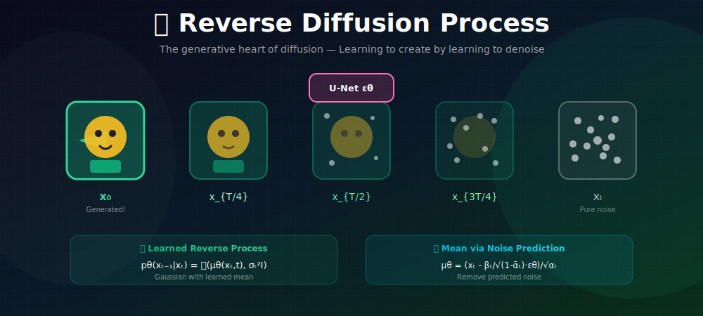
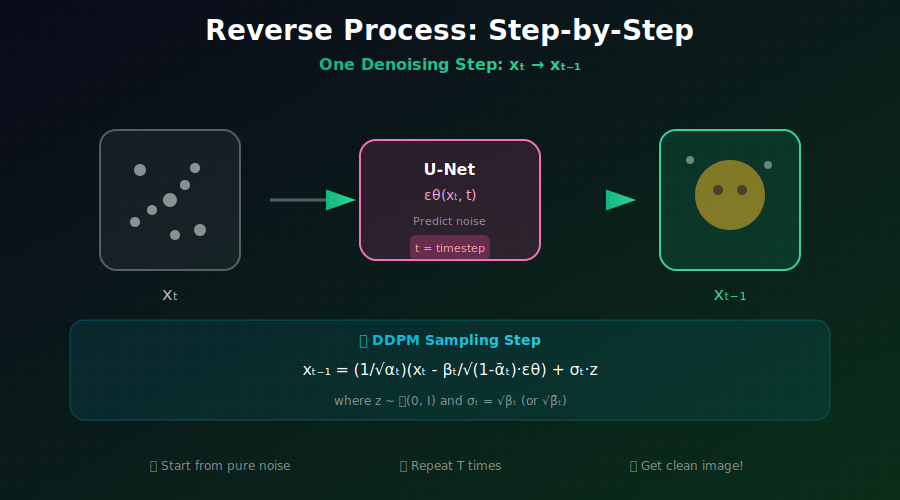

# 📈 Reverse Diffusion Process

<div align="center">



*The generative heart of diffusion models—learning to create by learning to denoise*

</div>

---

## 🖼️ Visual Overview

<div align="center">

### Reverse Process Step-by-Step


</div>

---

[](#)
[](#)
[](#)

</div>

---

## 🎯 Where & Why Use This Knowledge?

<table>
<tr>
<th width="30%">Where It's Used</th>
<th width="35%">Why It Matters</th>
<th width="35%">Real Applications</th>
</tr>
<tr>
<td><b>🎨 Image Generation</b></td>
<td>Reverse process IS the generator</td>
<td>DALL-E, Midjourney, Stable Diffusion</td>
</tr>
<tr>
<td><b>🔄 Sampling Algorithms</b></td>
<td>Understanding enables better samplers</td>
<td>DDIM, DPM-Solver, Euler methods</td>
</tr>
<tr>
<td><b>🛠️ Model Architecture</b></td>
<td>Parameterization affects what the network learns</td>
<td>U-Net design, conditioning mechanisms</td>
</tr>
<tr>
<td><b>⚡ Inference Optimization</b></td>
<td>Math enables step reduction and speedups</td>
<td>Real-time generation, mobile deployment</td>
</tr>
</table>

### 💡 Why Reverse Diffusion is Powerful

> *"The reverse process transforms noise into data. By learning this transformation step-by-step, diffusion models achieve unprecedented generation quality with stable training."*

**Key Insights:**
- **Gradual generation**: Build from coarse to fine, like an artist
- **Error correction**: Each step can fix mistakes from previous steps
- **Uncertainty handling**: Natural way to model ambiguity
- **Controllable**: Can intervene at any step during generation

---

## 📖 The Reverse Process

### The Challenge

Forward process: $x_0 \to x_T$ (add noise) — **Easy, fixed**
Reverse process: $x_T \to x_0$ (remove noise) — **Hard, must learn**

The true reverse is:
$$q(x_{t-1}|x_t) = \int q(x_{t-1}|x_t, x_0) q(x_0|x_t) dx_0$$

**Problem:** We don't know $q(x_0|x_t)$! It depends on the entire data distribution.

### The Solution: Tractable Posterior

When **conditioned on $x_0$**, the reverse becomes tractable:

$$\boxed{q(x_{t-1}|x_t, x_0) = \mathcal{N}(x_{t-1}; \tilde{\mu}_t(x_t, x_0), \tilde{\beta}_t I)}$$

**Insight:** Learn a neural network to approximate this!

### Learned Reverse Process

$$\boxed{p_\theta(x_{t-1}|x_t) = \mathcal{N}(x_{t-1}; \mu_\theta(x_t, t), \Sigma_\theta(x_t, t))}$$

---

## 🧮 Complete Posterior Derivation

### Using Bayes' Rule

$$q(x_{t-1}|x_t, x_0) = \frac{q(x_t|x_{t-1}) \cdot q(x_{t-1}|x_0)}{q(x_t|x_0)}$$

**By the Markov property:** $q(x_t|x_{t-1}, x_0) = q(x_t|x_{t-1})$

**Each term is Gaussian:**

| Term | Distribution | Parameters |
|------|-------------|------------|
| $q(x_t\|x_{t-1})$ | $\mathcal{N}(x_t; \sqrt{\alpha_t}x_{t-1}, \beta_t I)$ | Forward step |
| $q(x_{t-1}\|x_0)$ | $\mathcal{N}(x_{t-1}; \sqrt{\bar{\alpha}_{t-1}}x_0, (1-\bar{\alpha}_{t-1})I)$ | Marginal |
| $q(x_t\|x_0)$ | $\mathcal{N}(x_t; \sqrt{\bar{\alpha}_t}x_0, (1-\bar{\alpha}_t)I)$ | Marginal |

---

### Complete Derivation: Step by Step

**Step 1: Write out the log-probability**

The posterior is:
$$q(x_{t-1}|x_t, x_0) \propto q(x_t|x_{t-1}) \cdot q(x_{t-1}|x_0)$$

Taking logs:
$$\log q(x_{t-1}|x_t, x_0) = \log q(x_t|x_{t-1}) + \log q(x_{t-1}|x_0) + C$$

**Step 2: Expand each Gaussian**

$$\log q(x_t|x_{t-1}) = -\frac{1}{2\beta_t}\|x_t - \sqrt{\alpha_t}x_{t-1}\|^2 + C_1$$

$$\log q(x_{t-1}|x_0) = -\frac{1}{2(1-\bar{\alpha}_{t-1})}\|x_{t-1} - \sqrt{\bar{\alpha}_{t-1}}x_0\|^2 + C_2$$

**Step 3: Combine and expand**

$$\log q(x_{t-1}|x_t, x_0) = -\frac{1}{2}\left[\frac{(x_t - \sqrt{\alpha_t}x_{t-1})^2}{\beta_t} + \frac{(x_{t-1} - \sqrt{\bar{\alpha}_{t-1}}x_0)^2}{1-\bar{\alpha}_{t-1}}\right] + C$$

Expanding the squares:
$$= -\frac{1}{2}\left[\frac{x_t^2 - 2\sqrt{\alpha_t}x_t x_{t-1} + \alpha_t x_{t-1}^2}{\beta_t} + \frac{x_{t-1}^2 - 2\sqrt{\bar{\alpha}_{t-1}}x_0 x_{t-1} + \bar{\alpha}_{t-1}x_0^2}{1-\bar{\alpha}_{t-1}}\right] + C$$

**Step 4: Group by powers of $x_{t-1}$**

$$= -\frac{1}{2}\left[x_{t-1}^2\underbrace{\left(\frac{\alpha_t}{\beta_t} + \frac{1}{1-\bar{\alpha}_{t-1}}\right)}_{A} - 2x_{t-1}\underbrace{\left(\frac{\sqrt{\alpha_t}x_t}{\beta_t} + \frac{\sqrt{\bar{\alpha}_{t-1}}x_0}{1-\bar{\alpha}_{t-1}}\right)}_{B}\right] + C'$$

**Step 5: Identify as Gaussian**

This has the form $-\frac{A}{2}(x_{t-1} - \frac{B}{A})^2 + C''$, which is Gaussian with:
- **Precision:** $A = 1/\tilde{\beta}_t$
- **Mean:** $\tilde{\mu}_t = B/A$

---

### Computing the Posterior Variance

$$\frac{1}{\tilde{\beta}_t} = \frac{\alpha_t}{\beta_t} + \frac{1}{1-\bar{\alpha}_{t-1}}$$

**Finding common denominator:**
$$= \frac{\alpha_t(1-\bar{\alpha}_{t-1}) + \beta_t}{\beta_t(1-\bar{\alpha}_{t-1})}$$

**Using $\alpha_t = 1 - \beta_t$:**
$$\alpha_t(1-\bar{\alpha}_{t-1}) + \beta_t = (1-\beta_t)(1-\bar{\alpha}_{t-1}) + \beta_t$$
$$= 1 - \bar{\alpha}_{t-1} - \beta_t + \beta_t\bar{\alpha}_{t-1} + \beta_t$$
$$= 1 - \bar{\alpha}_{t-1} + \beta_t\bar{\alpha}_{t-1}$$
$$= 1 - \bar{\alpha}_{t-1}(1 - \beta_t) = 1 - \bar{\alpha}_{t-1}\alpha_t = 1 - \bar{\alpha}_t$$

Therefore:
$$\boxed{\tilde{\beta}_t = \frac{\beta_t(1-\bar{\alpha}_{t-1})}{1-\bar{\alpha}_t}}$$

---

### Computing the Posterior Mean

$$\tilde{\mu}_t = \tilde{\beta}_t \cdot B = \tilde{\beta}_t\left(\frac{\sqrt{\alpha_t}x_t}{\beta_t} + \frac{\sqrt{\bar{\alpha}_{t-1}}x_0}{1-\bar{\alpha}_{t-1}}\right)$$

Substituting $\tilde{\beta}_t$:
$$= \frac{(1-\bar{\alpha}_{t-1})}{1-\bar{\alpha}_t}\left(\sqrt{\alpha_t}x_t + \frac{\beta_t\sqrt{\bar{\alpha}_{t-1}}x_0}{1-\bar{\alpha}_{t-1}}\right)$$

$$= \frac{\sqrt{\alpha_t}(1-\bar{\alpha}_{t-1})}{1-\bar{\alpha}_t}x_t + \frac{\sqrt{\bar{\alpha}_{t-1}}\beta_t}{1-\bar{\alpha}_t}x_0$$

$$\boxed{\tilde{\mu}_t(x_t, x_0) = \frac{\sqrt{\bar{\alpha}_{t-1}}\beta_t}{1-\bar{\alpha}_t}x_0 + \frac{\sqrt{\alpha_t}(1-\bar{\alpha}_{t-1})}{1-\bar{\alpha}_t}x_t}$$

---

### Alternative Form Using Noise

Since $x_0 = \frac{x_t - \sqrt{1-\bar{\alpha}_t}\epsilon}{\sqrt{\bar{\alpha}_t}}$, we can rewrite:

$$\tilde{\mu}_t = \frac{1}{\sqrt{\alpha_t}}\left(x_t - \frac{\beta_t}{\sqrt{1-\bar{\alpha}_t}}\epsilon\right)$$

<details>
<summary><b>Derivation of Alternative Form</b></summary>

Starting from:
$$\tilde{\mu}_t = \frac{\sqrt{\bar{\alpha}_{t-1}}\beta_t}{1-\bar{\alpha}_t}x_0 + \frac{\sqrt{\alpha_t}(1-\bar{\alpha}_{t-1})}{1-\bar{\alpha}_t}x_t$$

Substitute $x_0 = \frac{x_t - \sqrt{1-\bar{\alpha}_t}\epsilon}{\sqrt{\bar{\alpha}_t}}$:

$$= \frac{\sqrt{\bar{\alpha}_{t-1}}\beta_t}{1-\bar{\alpha}_t} \cdot \frac{x_t - \sqrt{1-\bar{\alpha}_t}\epsilon}{\sqrt{\bar{\alpha}_t}} + \frac{\sqrt{\alpha_t}(1-\bar{\alpha}_{t-1})}{1-\bar{\alpha}_t}x_t$$

$$= \frac{\sqrt{\bar{\alpha}_{t-1}}\beta_t}{(1-\bar{\alpha}_t)\sqrt{\bar{\alpha}_t}}x_t - \frac{\sqrt{\bar{\alpha}_{t-1}}\beta_t\sqrt{1-\bar{\alpha}_t}}{(1-\bar{\alpha}_t)\sqrt{\bar{\alpha}_t}}\epsilon + \frac{\sqrt{\alpha_t}(1-\bar{\alpha}_{t-1})}{1-\bar{\alpha}_t}x_t$$

Using $\frac{\sqrt{\bar{\alpha}_{t-1}}}{\sqrt{\bar{\alpha}_t}} = \frac{1}{\sqrt{\alpha_t}}$:

$$= \left[\frac{\beta_t}{(1-\bar{\alpha}_t)\sqrt{\alpha_t}} + \frac{\sqrt{\alpha_t}(1-\bar{\alpha}_{t-1})}{1-\bar{\alpha}_t}\right]x_t - \frac{\beta_t}{(1-\bar{\alpha}_t)\sqrt{\alpha_t}\sqrt{1-\bar{\alpha}_t}}\sqrt{1-\bar{\alpha}_t}\epsilon$$

The coefficient of $x_t$:
$$\frac{\beta_t + \alpha_t(1-\bar{\alpha}_{t-1})}{\sqrt{\alpha_t}(1-\bar{\alpha}_t)} = \frac{1-\bar{\alpha}_t}{\sqrt{\alpha_t}(1-\bar{\alpha}_t)} = \frac{1}{\sqrt{\alpha_t}}$$

Therefore:
$$\tilde{\mu}_t = \frac{1}{\sqrt{\alpha_t}}\left(x_t - \frac{\beta_t}{\sqrt{1-\bar{\alpha}_t}}\epsilon\right)$$

</details>

**This is the form used in DDPM!** The model predicts $\epsilon$, then we use this formula.

---

## 🎯 Parameterization Choices: Mathematical Analysis

### The Key Insight

We have $x_t$ but need to predict the mean $\mu_\theta$. The true posterior mean depends on knowing $x_0$, which we don't have. The neural network must approximate this.

---

### Option 1: Predict $x_0$ Directly ($\hat{x}_0$-parameterization)

**Network output:** $\hat{x}_0 = f_\theta(x_t, t)$

**Mean formula:**
$$\mu_\theta = \frac{\sqrt{\bar{\alpha}_{t-1}}\beta_t}{1-\bar{\alpha}_t}\hat{x}_0(x_t, t) + \frac{\sqrt{\alpha_t}(1-\bar{\alpha}_{t-1})}{1-\bar{\alpha}_t}x_t$$

**Loss function:**
$$\mathcal{L}_{x_0} = \mathbb{E}_{t,x_0,\epsilon}\left[\|x_0 - \hat{x}_0(x_t, t)\|^2\right]$$

**Mathematical issue at low SNR:** When $t \to T$, $x_t \approx \epsilon$ and predicting $x_0$ from pure noise is ill-posed.

---

### Option 2: Predict Noise $\epsilon$ (DDPM Standard, $\epsilon$-parameterization)

**Network output:** $\epsilon_\theta = f_\theta(x_t, t)$

**Relationship:** Since $x_t = \sqrt{\bar{\alpha}_t}x_0 + \sqrt{1-\bar{\alpha}_t}\epsilon$:

$$x_0 = \frac{x_t - \sqrt{1-\bar{\alpha}_t}\epsilon}{\sqrt{\bar{\alpha}_t}}$$

**Deriving $\mu_\theta$ from $\epsilon_\theta$:**

Substituting into the posterior mean formula:
$$\mu_\theta = \frac{\sqrt{\bar{\alpha}_{t-1}}\beta_t}{1-\bar{\alpha}_t} \cdot \frac{x_t - \sqrt{1-\bar{\alpha}_t}\epsilon_\theta}{\sqrt{\bar{\alpha}_t}} + \frac{\sqrt{\alpha_t}(1-\bar{\alpha}_{t-1})}{1-\bar{\alpha}_t}x_t$$

After simplification (see detailed derivation above):

$$\boxed{\mu_\theta = \frac{1}{\sqrt{\alpha_t}}\left(x_t - \frac{\beta_t}{\sqrt{1-\bar{\alpha}_t}}\epsilon_\theta(x_t, t)\right)}$$

**Loss function:**
$$\mathcal{L}_{\epsilon} = \mathbb{E}_{t,x_0,\epsilon}\left[\|\epsilon - \epsilon_\theta(x_t, t)\|^2\right]$$

**Why this works better:** The noise $\epsilon$ is always standard normal $\mathcal{N}(0, I)$, regardless of $t$. This gives consistent target statistics.

---

### Option 3: Predict Velocity $v$ ($v$-parameterization)

**Definition:**
$$v = \sqrt{\bar{\alpha}_t}\epsilon - \sqrt{1-\bar{\alpha}_t}x_0$$

**Network output:** $\hat{v} = f_\theta(x_t, t)$

**Recovering $x_0$ and $\epsilon$ from $v$:**

From the definition and $x_t = \sqrt{\bar{\alpha}_t}x_0 + \sqrt{1-\bar{\alpha}_t}\epsilon$:

$$x_0 = \sqrt{\bar{\alpha}_t}x_t - \sqrt{1-\bar{\alpha}_t}v$$
$$\epsilon = \sqrt{1-\bar{\alpha}_t}x_t + \sqrt{\bar{\alpha}_t}v$$

**Loss function:**
$$\mathcal{L}_{v} = \mathbb{E}_{t,x_0,\epsilon}\left[\|v - \hat{v}(x_t, t)\|^2\right]$$

**Mathematical equivalence:**

$$\|v - \hat{v}\|^2 = \bar{\alpha}_t\|\epsilon - \hat{\epsilon}\|^2 + (1-\bar{\alpha}_t)\|x_0 - \hat{x}_0\|^2 + \text{cross terms}$$

This naturally interpolates between $\epsilon$-prediction at high noise and $x_0$-prediction at low noise!

---

### Theoretical Analysis of Each Parameterization

**Gradient variance analysis:**

| Parameterization | Gradient Variance at $t \to 0$ | Gradient Variance at $t \to T$ |
|------------------|--------------------------------|--------------------------------|
| $\epsilon$-pred | Low (easy, high SNR) | Low (consistent target) |
| $x_0$-pred | Low (easy, high SNR) | **High** (hard, pure noise) |
| $v$-pred | Low | Low |

**Score function relationship:**

For all parameterizations, the score is:
$$\nabla_{x_t}\log p_t(x_t) = -\frac{\epsilon}{\sqrt{1-\bar{\alpha}_t}}$$

- From $\epsilon$-pred: $s_\theta = -\frac{\epsilon_\theta}{\sqrt{1-\bar{\alpha}_t}}$
- From $x_0$-pred: $s_\theta = -\frac{x_t - \sqrt{\bar{\alpha}_t}\hat{x}_0}{1-\bar{\alpha}_t}$
- From $v$-pred: $s_\theta = -\frac{\sqrt{1-\bar{\alpha}_t}x_t + \sqrt{\bar{\alpha}_t}\hat{v}}{1-\bar{\alpha}_t}$

---

### Comparison Summary

| Parameterization | Pros | Cons | Best For |
|------------------|------|------|----------|
| **Predict $\epsilon$** | Simple, stable, consistent targets | May have slight issues at very high SNR | DDPM, most applications |
| **Predict $x_0$** | Direct interpretation | Unstable at low SNR (high $t$) | DDIM, image editing |
| **Predict $v$** | Balanced gradients, interpolates naturally | Slightly more complex | Progressive distillation |

---

## ⚙️ Variance Options

### Fixed Variance

**Option 1:** $\sigma_t^2 = \beta_t$ (upper bound on variance)

**Option 2:** $\sigma_t^2 = \tilde{\beta}_t$ (optimal posterior variance)

Both work in practice. Original DDPM uses $\sigma_t^2 = \beta_t$.

### Learned Variance (Improved DDPM)

Interpolate between bounds:
$$\sigma_t^2 = \exp(v \log \beta_t + (1-v) \log \tilde{\beta}_t)$$

where $v \in [0, 1]$ is predicted by the network.

**Benefit:** Slightly better log-likelihood and FID scores.

---

## 🔄 Sampling Algorithm

### DDPM Sampling

```python
def ddpm_sample(model, shape, T, betas, alpha_bar):
    """
    Generate samples using DDPM reverse process.
    
    Args:
        model: Noise prediction network ε_θ(x_t, t)
        shape: Output shape [batch, channels, height, width]
        T: Number of timesteps
        betas: Noise schedule [T]
        alpha_bar: Cumulative alpha values [T]
    
    Returns:
        x_0: Generated samples
    """
    device = next(model.parameters()).device
    
    # Start from pure noise
    x = torch.randn(shape, device=device)
    
    for t in reversed(range(T)):
        t_batch = torch.full((shape[0],), t, device=device, dtype=torch.long)
        
        # Predict noise
        with torch.no_grad():
            eps_pred = model(x, t_batch)
        
        # Compute posterior mean
        alpha_t = 1 - betas[t]
        alpha_bar_t = alpha_bar[t]
        
        # μ_θ = (1/√α_t)(x_t - β_t/√(1-ᾱ_t) * ε_θ)
        mu = (1 / torch.sqrt(alpha_t)) * (
            x - (betas[t] / torch.sqrt(1 - alpha_bar_t)) * eps_pred
        )
        
        # Add noise (except at final step)
        if t > 0:
            sigma = torch.sqrt(betas[t])
            z = torch.randn_like(x)
            x = mu + sigma * z
        else:
            x = mu
    
    return x
```

### Step-by-Step Intuition

```
Step t=T:    Pure noise → predict ε → compute μ → sample x_{T-1}
Step t=T-1:  Slightly less noisy → predict ε → compute μ → sample x_{T-2}
...
Step t=1:    Almost clean → predict ε → compute μ → sample x_0 (final)

Each step:
1. 🔮 Predict: What noise is in x_t?
2. 📐 Compute: Where should we step?
3. 🎲 Sample: Add controlled randomness
4. ↩️  Repeat until t=0
```

---

## ⚡ Quality vs Speed Trade-off

### Number of Steps

| Steps | Quality | Speed | Use Case |
|-------|---------|-------|----------|
| 1000 (DDPM) | Best | Slow (~min) | Highest quality needed |
| 100-200 | Excellent | Moderate (~10s) | Standard generation |
| 20-50 (DDIM) | Good | Fast (~2s) | Interactive applications |
| 1-4 (Distilled) | Good | Instant | Real-time |

### Why More Steps Help

More steps = smaller per-step change = easier prediction

**Analogy:** Walking down stairs vs jumping—smaller steps are safer!

---

## 💻 Complete Implementation

```python
import torch
import torch.nn as nn

class DiffusionSampler:
    """Complete DDPM sampler with multiple variance options."""
    
    def __init__(self, model, betas, variance_type='fixed_large'):
        """
        Args:
            model: Trained noise prediction network
            betas: Noise schedule [T]
            variance_type: 'fixed_small', 'fixed_large', or 'learned'
        """
        self.model = model
        self.T = len(betas)
        self.variance_type = variance_type
        
        # Precompute schedule quantities
        self.betas = betas
        self.alphas = 1 - betas
        self.alpha_bar = torch.cumprod(self.alphas, dim=0)
        self.alpha_bar_prev = torch.cat([torch.ones(1), self.alpha_bar[:-1]])
        
        # Posterior variance
        self.posterior_variance = betas * (1 - self.alpha_bar_prev) / (1 - self.alpha_bar)
    
    def get_variance(self, t):
        """Get variance for timestep t based on variance_type."""
        if self.variance_type == 'fixed_small':
            return self.posterior_variance[t]
        elif self.variance_type == 'fixed_large':
            return self.betas[t]
        else:
            raise ValueError(f"Unknown variance type: {self.variance_type}")
    
    def p_mean_variance(self, x_t, t):
        """
        Compute mean and variance of p(x_{t-1} | x_t).
        
        Returns:
            mean: Posterior mean
            variance: Posterior variance  
            log_variance: Log of posterior variance
        """
        t_batch = torch.full((x_t.shape[0],), t, device=x_t.device, dtype=torch.long)
        
        # Predict noise
        eps_pred = self.model(x_t, t_batch)
        
        # Compute mean
        alpha_t = self.alphas[t]
        alpha_bar_t = self.alpha_bar[t]
        
        mean = (1 / torch.sqrt(alpha_t)) * (
            x_t - (self.betas[t] / torch.sqrt(1 - alpha_bar_t)) * eps_pred
        )
        
        # Get variance
        variance = self.get_variance(t)
        log_variance = torch.log(torch.clamp(variance, min=1e-20))
        
        return mean, variance, log_variance
    
    @torch.no_grad()
    def sample(self, shape, device='cuda'):
        """Generate samples."""
        x = torch.randn(shape, device=device)
        
        for t in reversed(range(self.T)):
            mean, variance, _ = self.p_mean_variance(x, t)
            
            if t > 0:
                noise = torch.randn_like(x)
                x = mean + torch.sqrt(variance) * noise
            else:
                x = mean
        
        return x
```

---

## 📊 Key Equations Summary

| Concept | Formula |
|---------|---------|
| Posterior variance | $\tilde{\beta}_t = \frac{(1-\bar{\alpha}_{t-1})\beta_t}{1-\bar{\alpha}_t}$ |
| Posterior mean | $\tilde{\mu}_t = \frac{\sqrt{\bar{\alpha}_{t-1}}\beta_t}{1-\bar{\alpha}_t}x_0 + \frac{\sqrt{\alpha_t}(1-\bar{\alpha}_{t-1})}{1-\bar{\alpha}_t}x_t$ |
| From $\epsilon$ prediction | $\mu_\theta = \frac{1}{\sqrt{\alpha_t}}(x_t - \frac{\beta_t}{\sqrt{1-\bar{\alpha}_t}}\epsilon_\theta)$ |
| Sampling step | $x_{t-1} = \mu_\theta + \sigma_t \cdot z, \quad z \sim \mathcal{N}(0, I)$ |

---

## 📚 References

1. **Ho, J., Jain, A., & Abbeel, P.** (2020). "Denoising Diffusion Probabilistic Models." *NeurIPS*. [arXiv:2006.11239](https://arxiv.org/abs/2006.11239)

2. **Nichol, A., & Dhariwal, P.** (2021). "Improved Denoising Diffusion Probabilistic Models." *ICML*. [arXiv:2102.09672](https://arxiv.org/abs/2102.09672)

3. **Salimans, T., & Ho, J.** (2022). "Progressive Distillation for Fast Sampling of Diffusion Models." *ICLR*. [arXiv:2202.00512](https://arxiv.org/abs/2202.00512)

---

## ✏️ Exercises

1. **Derive** the posterior variance $\tilde{\beta}_t$ from first principles.

2. **Show** that predicting $\epsilon$ and predicting $x_0$ yield the same $\mu_\theta$.

3. **Implement** DDPM sampling and generate MNIST digits.

4. **Compare** fixed vs learned variance empirically (FID, visual quality).

5. **Analyze** how sample quality changes with different step counts (10, 50, 100, 1000).

6. **Visualize** the denoising process: show $x_t$ at $t = T, 3T/4, T/2, T/4, 0$.

---

<div align="center">

**[← Noise Schedules](../02_noise_schedules/)** | **[Back to Diffusion Fundamentals →](../)**

</div>
