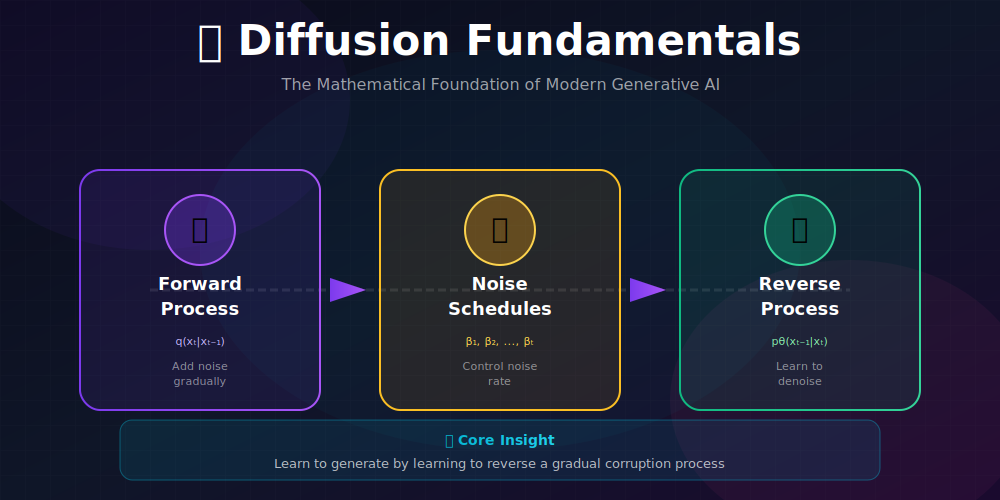
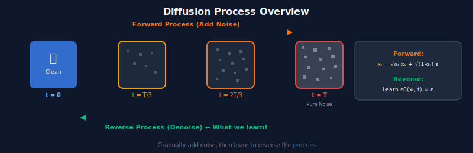

# 📐 Diffusion Model Fundamentals

*The mathematical bedrock of modern generative AI*

---

## 🎯 Where & Why Use This Knowledge?

<table>
<tr>
<th width="30%">Where It's Used</th>
<th width="35%">Why It Matters</th>
<th width="35%">Real Applications</th>
</tr>
<tr>
<td><b>🏗️ Building Diffusion Models</b></td>
<td>Understanding fundamentals is essential before implementing any diffusion system</td>
<td>Custom model architectures, research implementations</td>
</tr>
<tr>
<td><b>🔧 Debugging & Optimization</b></td>
<td>Mathematical intuition helps diagnose training issues and improve quality</td>
<td>Loss debugging, schedule tuning, convergence analysis</td>
</tr>
<tr>
<td><b>📚 Research & Innovation</b></td>
<td>Novel techniques build upon these core concepts</td>
<td>New samplers, improved schedules, architectural innovations</td>
</tr>
<tr>
<td><b>🎓 Teaching & Communication</b></td>
<td>Clear understanding enables effective knowledge transfer</td>
<td>Team education, documentation, paper writing</td>
</tr>
</table>

### 💡 Why Master Fundamentals First?

> *"To understand diffusion models deeply, you must understand the elegant mathematics that makes them work. Everything else—DDPM, DDIM, guidance—builds upon these foundations."*

**Key Benefits:**
- **Debug effectively**: Know *why* things break, not just *what* broke
- **Innovate confidently**: Create new techniques with solid mathematical grounding
- **Communicate clearly**: Explain complex concepts to others accurately
- **Read papers faster**: Quickly parse new research with foundational knowledge

---

## 📖 Table of Contents

1. [The Core Insight](#-the-core-insight)
2. [Forward Diffusion Process](#-forward-diffusion-process)
3. [Reverse Diffusion Process](#-reverse-diffusion-process)
4. [The Training Objective](#-the-training-objective)
5. [Connection to Score Matching](#-connection-to-score-matching)
6. [Subtopics Deep Dives](#-subtopics-deep-dives)

---

## 📊 Representation Comparison

| Representation | Pros | Cons |
|----------------|------|------|
| **Discrete Time (DDPM)** | Simple, well-understood | Fixed step count |
| **Continuous Time (SDE)** | Flexible, adaptive | More complex theory |
| **Noise Prediction** | Stable training | Indirect |
| **Score Prediction** | Theoretically motivated | Can be unstable |
| **v-prediction** | Best of both | Less intuitive |

---

## 💡 The Core Insight

### The Fundamental Idea

> **Instead of learning to generate data directly, learn to reverse a gradual corruption process.**

This seemingly simple idea unlocks remarkable properties:

| Property | Description | Impact |
|----------|-------------|--------|
| **Stable Training** | Simple MSE loss, no adversarial dynamics | Reliable convergence |
| **Mode Coverage** | Learns entire distribution, no mode collapse | Diverse outputs |
| **Controllable** | Gradual generation enables intervention | Guidance, editing |
| **Theoretical Grounding** | ELBO-based objective with tractable bounds | Principled approach |

### The Two Processes

---

## 🔄 Forward Diffusion Process

### Definition

Starting from data $x_0 \sim q(x_0)$, we define a **Markov chain** that gradually adds Gaussian noise:

$$q(x_{1:T}|x_0) = \prod_{t=1}^T q(x_t|x_{t-1})$$

Each transition is a **Gaussian perturbation**:

$$\boxed{q(x_t|x_{t-1}) = \mathcal{N}(x_t; \sqrt{1-\beta_t}x_{t-1}, \beta_t I)}$$

**Interpretation:**
- **Scale down** the signal by $\sqrt{1-\beta_t}$
- **Add noise** with variance $\beta_t$
- After $T$ steps: $x_T \approx \mathcal{N}(0, I)$

### 🔑 Key Result: Direct Sampling

We don't need to iterate! Define:
- $\alpha_t = 1 - \beta_t$
- $\bar{\alpha}_t = \prod_{s=1}^t \alpha_s$ (cumulative product)

**Closed-form marginal:**

$$\boxed{q(x_t|x_0) = \mathcal{N}(x_t; \sqrt{\bar{\alpha}_t}x_0, (1-\bar{\alpha}_t)I)}$$

**Reparameterization trick:**

$$\boxed{x_t = \sqrt{\bar{\alpha}_t}x_0 + \sqrt{1-\bar{\alpha}_t}\epsilon, \quad \epsilon \sim \mathcal{N}(0, I)}$$

### Mathematical Proof (Induction)

<b>Click to expand proof</b>

**Base case** ($t=1$):
$$x_1 = \sqrt{\alpha_1}x_0 + \sqrt{1-\alpha_1}\epsilon_1$$
$$= \sqrt{\bar{\alpha}_1}x_0 + \sqrt{1-\bar{\alpha}_1}\epsilon_1 \quad ✓$$

**Inductive step**: Assume true for $t$. Then:
$$x_{t+1} = \sqrt{\alpha_{t+1}}x_t + \sqrt{1-\alpha_{t+1}}\epsilon_{t+1}$$
$$= \sqrt{\alpha_{t+1}}(\sqrt{\bar{\alpha}_t}x_0 + \sqrt{1-\bar{\alpha}_t}\bar{\epsilon}_t) + \sqrt{1-\alpha_{t+1}}\epsilon_{t+1}$$
$$= \sqrt{\bar{\alpha}_{t+1}}x_0 + \underbrace{\sqrt{\alpha_{t+1}(1-\bar{\alpha}_t)}\bar{\epsilon}_t + \sqrt{1-\alpha_{t+1}}\epsilon_{t+1}}_{\text{sum of independent Gaussians}}$$

The noise terms combine (variance addition):
$$\text{Var} = \alpha_{t+1}(1-\bar{\alpha}_t) + (1-\alpha_{t+1}) = 1 - \bar{\alpha}_{t+1} \quad ✓$$

---

## ⏪ Reverse Diffusion Process

### The Goal

Learn $p_\theta(x_{t-1}|x_t)$ to approximate the **true reverse posterior** $q(x_{t-1}|x_t, x_0)$.

### True Reverse Posterior

Using **Bayes' rule**:

$$q(x_{t-1}|x_t, x_0) = \frac{q(x_t|x_{t-1})q(x_{t-1}|x_0)}{q(x_t|x_0)}$$

Since all terms are Gaussian, the posterior is also **Gaussian**:

$$\boxed{q(x_{t-1}|x_t, x_0) = \mathcal{N}(x_{t-1}; \tilde{\mu}_t(x_t, x_0), \tilde{\beta}_t I)}$$

### Posterior Parameters

**Posterior Mean:**

$$\boxed{\tilde{\mu}_t(x_t, x_0) = \frac{\sqrt{\bar{\alpha}_{t-1}}\beta_t}{1-\bar{\alpha}_t}x_0 + \frac{\sqrt{\alpha_t}(1-\bar{\alpha}_{t-1})}{1-\bar{\alpha}_t}x_t}$$

**Posterior Variance:**

$$\boxed{\tilde{\beta}_t = \frac{(1-\bar{\alpha}_{t-1})\beta_t}{1-\bar{\alpha}_t}}$$

### Express Mean in Terms of $\epsilon$

From $x_t = \sqrt{\bar{\alpha}_t}x_0 + \sqrt{1-\bar{\alpha}_t}\epsilon$, we get:

$$x_0 = \frac{x_t - \sqrt{1-\bar{\alpha}_t}\epsilon}{\sqrt{\bar{\alpha}_t}}$$

Substituting:

$$\boxed{\tilde{\mu}_t = \frac{1}{\sqrt{\alpha_t}}\left(x_t - \frac{\beta_t}{\sqrt{1-\bar{\alpha}_t}}\epsilon\right)}$$

**This is the key insight for noise prediction!**

---

## 🎯 The Training Objective

### Variational Lower Bound (VLB)

$$\log p(x_0) \geq \mathbb{E}_q\left[\log\frac{p_\theta(x_{0:T})}{q(x_{1:T}|x_0)}\right] = -\mathcal{L}_{VLB}$$

### Decomposition

$$\mathcal{L}_{VLB} = \underbrace{D_{KL}(q(x_T|x_0) \| p(x_T))}_{\mathcal{L}_T \text{ (constant)}} + \sum_{t=2}^T \underbrace{D_{KL}(q(x_{t-1}|x_t, x_0) \| p_\theta(x_{t-1}|x_t))}_{\mathcal{L}_{t-1}} + \underbrace{-\log p_\theta(x_0|x_1)}_{\mathcal{L}_0}$$

### KL Between Gaussians

For $\mathcal{L}_{t-1}$:
$$D_{KL}(q \| p_\theta) = \frac{1}{2\sigma_t^2}\|\tilde{\mu}_t - \mu_\theta\|^2 + \text{const}$$

### 🌟 The Simplified Loss

**Ho et al. (2020)'s key insight:** Instead of predicting $\mu_\theta$, predict the noise $\epsilon_\theta$!

$$\mu_\theta(x_t, t) = \frac{1}{\sqrt{\alpha_t}}\left(x_t - \frac{\beta_t}{\sqrt{1-\bar{\alpha}_t}}\epsilon_\theta(x_t, t)\right)$$

**Simplified training objective:**

$$\boxed{\mathcal{L}_{simple} = \mathbb{E}_{t, x_0, \epsilon}\left[\|\epsilon - \epsilon_\theta(x_t, t)\|^2\right]}$$

where $x_t = \sqrt{\bar{\alpha}_t}x_0 + \sqrt{1-\bar{\alpha}_t}\epsilon$.

---

## 📈 Connection to Score Matching

### Score Function

The **score** of a distribution is the gradient of its log-density:

$$s(x) = \nabla_x \log p(x)$$

### Score of Noisy Distribution

For $q(x_t|x_0)$:

$$\nabla_{x_t}\log q(x_t|x_0) = -\frac{x_t - \sqrt{\bar{\alpha}_t}x_0}{1-\bar{\alpha}_t} = -\frac{\epsilon}{\sqrt{1-\bar{\alpha}_t}}$$

### The Deep Connection

$$\boxed{s_\theta(x_t, t) = -\frac{\epsilon_\theta(x_t, t)}{\sqrt{1-\bar{\alpha}_t}}}$$

**Predicting noise $\epsilon$ is equivalent to predicting the score!**

This connection bridges:
- **DDPM** (noise prediction)
- **Score-based models** (NCSN, Score SDE)
- **Continuous-time formulations**

---

## 📚 Subtopics Deep Dives

Explore each component in detail:

| Topic | Description | Key Concepts |
|-------|-------------|--------------|
| [📉 Forward Diffusion](./01_forward_diffusion/) | The noise addition process | Markov chain, reparameterization, SNR |
| [📊 Noise Schedules](./02_noise_schedules/) | Controlling noise rates | Linear, cosine, sigmoid schedules |
| [📈 Reverse Diffusion](./03_reverse_diffusion/) | The learned denoising | Posterior, parameterizations, sampling |

---

## 📊 Key Equations Summary

| Concept | Formula |
|---------|---------|
| Forward (single step) | $q(x_t\|x_{t-1}) = \mathcal{N}(\sqrt{1-\beta_t}x_{t-1}, \beta_t I)$ |
| Forward (any t) | $x_t = \sqrt{\bar{\alpha}_t}x_0 + \sqrt{1-\bar{\alpha}_t}\epsilon$ |
| Posterior mean | $\tilde{\mu}_t = \frac{1}{\sqrt{\alpha_t}}(x_t - \frac{\beta_t}{\sqrt{1-\bar{\alpha}_t}}\epsilon)$ |
| Posterior variance | $\tilde{\beta}_t = \frac{(1-\bar{\alpha}_{t-1})\beta_t}{1-\bar{\alpha}_t}$ |
| Training loss | $\mathcal{L} = \mathbb{E}[\|\epsilon - \epsilon_\theta(x_t, t)\|^2]$ |
| Score-noise relation | $s_\theta = -\epsilon_\theta / \sqrt{1-\bar{\alpha}_t}$ |

---

## 📚 References

1. **Sohl-Dickstein, J., Weiss, E., Maheswaranathan, N., & Ganguli, S.** (2015). "Deep Unsupervised Learning using Nonequilibrium Thermodynamics." *ICML*. [arXiv:1503.03585](https://arxiv.org/abs/1503.03585)

2. **Ho, J., Jain, A., & Abbeel, P.** (2020). "Denoising Diffusion Probabilistic Models." *NeurIPS*. [arXiv:2006.11239](https://arxiv.org/abs/2006.11239)

3. **Song, Y., & Ermon, S.** (2019). "Generative Modeling by Estimating Gradients of the Data Distribution." *NeurIPS*. [arXiv:1907.05600](https://arxiv.org/abs/1907.05600)

---

## ✏️ Exercises

1. **Prove** the closed-form $q(x_t|x_0)$ using the induction method shown above.

2. **Derive** the posterior variance $\tilde{\beta}_t$ from Bayes' rule.

3. **Show** that predicting $\epsilon$ and predicting $x_0$ give the same $\mu_\theta$.

4. **Compute** $\bar{\alpha}_t$ and SNR for a linear schedule with $\beta_1=10^{-4}$, $\beta_T=0.02$, $T=1000$.

5. **Implement** the forward process and visualize $x_t$ at $t = 0, 250, 500, 750, 1000$.

---

**[← Back to Diffusion Models](../)** | **[Next: Forward Diffusion →](./01_forward_diffusion/)**

