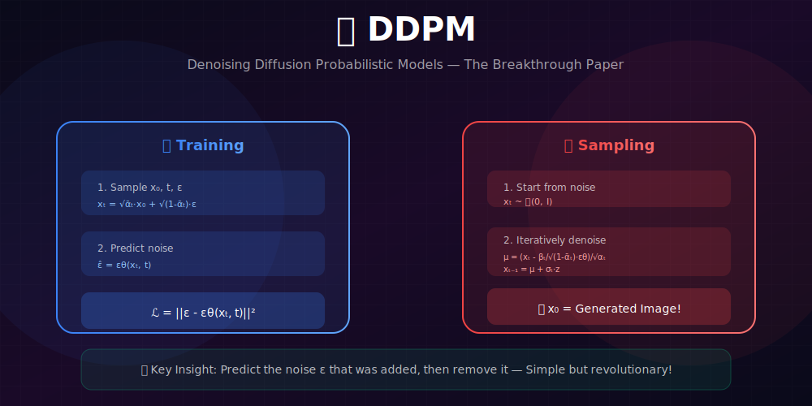
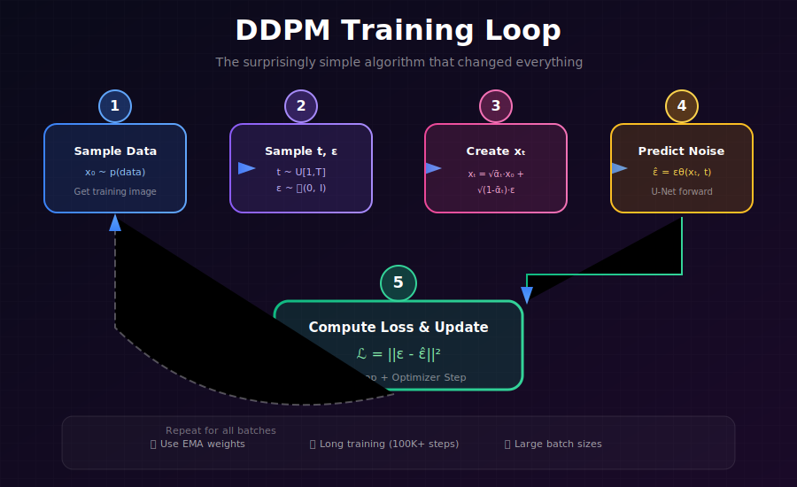
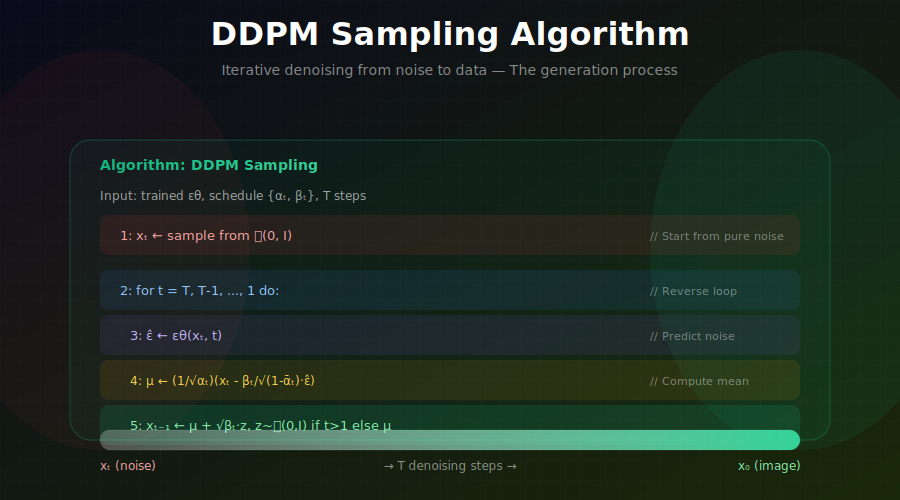
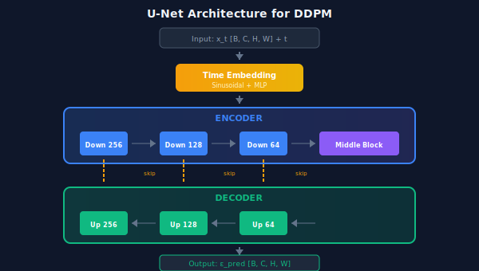

# 🎯 DDPM: Denoising Diffusion Probabilistic Models

<div align="center">



*The breakthrough that made diffusion models competitive with GANs*

</div>

---

## 🖼️ Visual Overview

<div align="center">

### Training Loop


### Sampling Process


</div>

---

[](#)
[](#)
[](#)

</div>

---

## 🎯 Where & Why Use DDPM?

<table>
<tr>
<th width="30%">Where It's Used</th>
<th width="35%">Why It Matters</th>
<th width="35%">Real Applications</th>
</tr>
<tr>
<td><b>🖼️ Image Generation</b></td>
<td>Foundation of all modern image diffusion</td>
<td>Stable Diffusion, DALL-E 2/3, Midjourney</td>
</tr>
<tr>
<td><b>🎬 Video Synthesis</b></td>
<td>Extended to temporal sequences</td>
<td>Runway Gen-2, Pika Labs, Sora</td>
</tr>
<tr>
<td><b>🔊 Audio Generation</b></td>
<td>Applied to spectrograms and waveforms</td>
<td>AudioLDM, Riffusion, MusicGen</td>
</tr>
<tr>
<td><b>🧬 Scientific Discovery</b></td>
<td>Sampling from complex distributions</td>
<td>Protein design, molecular generation</td>
</tr>
<tr>
<td><b>📐 3D Generation</b></td>
<td>Multi-view consistent synthesis</td>
<td>DreamFusion, Magic3D, Point-E</td>
</tr>
</table>

### 💡 Why DDPM Changed Everything

> *"Ho et al. (2020) showed that a simple denoising objective could match GAN quality while being far more stable to train. This sparked the current revolution in generative AI."*

**DDPM Advantages Over GANs:**
| Aspect | DDPM | GANs |
|--------|------|------|
| **Training Stability** | ✅ Very stable | ❌ Notoriously unstable |
| **Mode Coverage** | ✅ Excellent | ❌ Mode collapse |
| **Sample Diversity** | ✅ High | ⚠️ Can be limited |
| **Sample Quality** | ✅ SOTA | ✅ Sharp |
| **Sampling Speed** | ❌ Slow | ✅ Fast |

---

## 📊 Representation Comparison

| Representation | Pros | Cons |
|----------------|------|------|
| **ε-prediction** | Stable, original DDPM | Indirect signal |
| **x₀-prediction** | Direct, intuitive | Unstable at high noise |
| **v-prediction** | Balanced gradients | More complex |
| **Score prediction** | Connects to theory | Needs normalization |
| **Hybrid** | Best of both | Implementation complexity |

---

## 📖 The DDPM Framework

### Core Idea


### 1. Forward Process (Fixed)

Gradually add Gaussian noise:

$$q(x_t | x_{t-1}) = \mathcal{N}(x_t; \sqrt{1-\beta_t} x_{t-1}, \beta_t I)$$

**Closed-form for any $t$:**

$$\boxed{x_t = \sqrt{\bar{\alpha}_t} x_0 + \sqrt{1-\bar{\alpha}_t} \epsilon, \quad \epsilon \sim \mathcal{N}(0, I)}$$

### 2. Reverse Process (Learned)

Learn to denoise:

$$p_\theta(x_{t-1} | x_t) = \mathcal{N}(x_{t-1}; \mu_\theta(x_t, t), \sigma_t^2 I)$$

**Mean parameterization via noise prediction:**

$$\mu_\theta(x_t, t) = \frac{1}{\sqrt{\alpha_t}}\left(x_t - \frac{\beta_t}{\sqrt{1-\bar{\alpha}_t}} \epsilon_\theta(x_t, t)\right)$$

### 3. Training Objective

The simplified loss that works remarkably well:

$$\boxed{\mathcal{L}_{simple} = \mathbb{E}_{t, x_0, \epsilon}\left[\|\epsilon - \epsilon_\theta(\sqrt{\bar{\alpha}_t}x_0 + \sqrt{1-\bar{\alpha}_t}\epsilon, t)\|^2\right]}$$

**In words:** Predict the noise that was added!

---

## 🧮 Complete Mathematical Framework

### The Evidence Lower Bound (ELBO) Derivation

**Goal:** Maximize $\log p_\theta(x_0)$

**Step 1: Introduce latent variables**
$$\log p_\theta(x_0) = \log \int p_\theta(x_{0:T}) dx_{1:T}$$

**Step 2: Apply Jensen's inequality**
$$\log p_\theta(x_0) \geq \mathbb{E}_{q(x_{1:T}|x_0)}\left[\log \frac{p_\theta(x_{0:T})}{q(x_{1:T}|x_0)}\right] = -\mathcal{L}_{VLB}$$

**Step 3: Expand the ELBO**

$$-\mathcal{L}_{VLB} = \mathbb{E}_q\left[\log \frac{p_\theta(x_{0:T})}{q(x_{1:T}|x_0)}\right]$$

$$= \mathbb{E}_q\left[\log p(x_T) + \sum_{t=1}^T \log p_\theta(x_{t-1}|x_t) - \sum_{t=1}^T \log q(x_t|x_{t-1})\right]$$

**Step 4: Rearrange into tractable terms**

After careful rearrangement using Bayes' rule:

$$\boxed{\mathcal{L}_{VLB} = \underbrace{D_{KL}(q(x_T|x_0) \| p(x_T))}_{\mathcal{L}_T} + \sum_{t=2}^{T} \underbrace{D_{KL}(q(x_{t-1}|x_t,x_0) \| p_\theta(x_{t-1}|x_t))}_{\mathcal{L}_{t-1}} + \underbrace{(-\log p_\theta(x_0|x_1))}_{\mathcal{L}_0}}$$

<details>
<summary><b>Full ELBO Derivation</b></summary>

**Starting point:**
$$-\mathcal{L}_{VLB} = \mathbb{E}_q\left[\log \frac{p_\theta(x_{0:T})}{q(x_{1:T}|x_0)}\right]$$

**Expand numerator:**
$$p_\theta(x_{0:T}) = p(x_T)\prod_{t=1}^T p_\theta(x_{t-1}|x_t)$$

**Expand denominator:**
$$q(x_{1:T}|x_0) = \prod_{t=1}^T q(x_t|x_{t-1})$$

**Rewrite using Bayes' rule for $q$:**

$$q(x_t|x_{t-1}) = \frac{q(x_{t-1}|x_t, x_0) \cdot q(x_t|x_0)}{q(x_{t-1}|x_0)}$$

**Substitute and simplify:**

$$-\mathcal{L}_{VLB} = \mathbb{E}_q\left[\log p(x_T) + \sum_{t=1}^T \log p_\theta(x_{t-1}|x_t) - \sum_{t=2}^T \log q(x_{t-1}|x_t, x_0) - \log q(x_1|x_0) + \sum_{t=2}^T \log \frac{q(x_{t-1}|x_0)}{q(x_t|x_0)}\right]$$

**The telescoping sum simplifies:**
$$\sum_{t=2}^T \log \frac{q(x_{t-1}|x_0)}{q(x_t|x_0)} = \log q(x_1|x_0) - \log q(x_T|x_0)$$

**Final result:**
$$\mathcal{L}_{VLB} = D_{KL}(q(x_T|x_0)\|p(x_T)) + \sum_{t=2}^T D_{KL}(q(x_{t-1}|x_t,x_0)\|p_\theta(x_{t-1}|x_t)) - \mathbb{E}_q[\log p_\theta(x_0|x_1)]$$

</details>

---

### KL Divergence Between Gaussians

For two Gaussians $\mathcal{N}(\mu_1, \sigma_1^2 I)$ and $\mathcal{N}(\mu_2, \sigma_2^2 I)$:

$$D_{KL}(\mathcal{N}(\mu_1, \sigma_1^2) \| \mathcal{N}(\mu_2, \sigma_2^2)) = \frac{1}{2}\left[\frac{\sigma_1^2}{\sigma_2^2} + \frac{(\mu_2 - \mu_1)^2}{\sigma_2^2} - 1 + \log\frac{\sigma_2^2}{\sigma_1^2}\right]$$

**For DDPM with fixed variance** ($\sigma_t^2 = \tilde{\beta}_t$ for both):

$$\mathcal{L}_{t-1} = \mathbb{E}_q\left[\frac{1}{2\tilde{\beta}_t}\|\tilde{\mu}_t(x_t, x_0) - \mu_\theta(x_t, t)\|^2\right] + C$$

---

### From KL to Noise Prediction Loss

**Step 1: Express $\tilde{\mu}_t$ in terms of $\epsilon$**

$$\tilde{\mu}_t = \frac{1}{\sqrt{\alpha_t}}\left(x_t - \frac{\beta_t}{\sqrt{1-\bar{\alpha}_t}}\epsilon\right)$$

**Step 2: Express $\mu_\theta$ in terms of $\epsilon_\theta$**

$$\mu_\theta = \frac{1}{\sqrt{\alpha_t}}\left(x_t - \frac{\beta_t}{\sqrt{1-\bar{\alpha}_t}}\epsilon_\theta\right)$$

**Step 3: Compute the difference**

$$\tilde{\mu}_t - \mu_\theta = \frac{1}{\sqrt{\alpha_t}} \cdot \frac{\beta_t}{\sqrt{1-\bar{\alpha}_t}}(\epsilon_\theta - \epsilon)$$

**Step 4: Substitute into KL**

$$\mathcal{L}_{t-1} = \mathbb{E}\left[\frac{1}{2\tilde{\beta}_t} \cdot \frac{\beta_t^2}{\alpha_t(1-\bar{\alpha}_t)}\|\epsilon - \epsilon_\theta\|^2\right]$$

**Step 5: Define the weighting**

$$w(t) = \frac{\beta_t^2}{2\tilde{\beta}_t\alpha_t(1-\bar{\alpha}_t)}$$

Substituting $\tilde{\beta}_t = \frac{\beta_t(1-\bar{\alpha}_{t-1})}{1-\bar{\alpha}_t}$:

$$w(t) = \frac{\beta_t}{2\alpha_t(1-\bar{\alpha}_{t-1})}$$

---

### The Simplified Loss

**Ho et al. (2020)** found that simply using $w(t) = 1$ works better empirically:

$$\boxed{\mathcal{L}_{simple} = \mathbb{E}_{t \sim \text{Uniform}, x_0, \epsilon}\left[\|\epsilon - \epsilon_\theta(\sqrt{\bar{\alpha}_t}x_0 + \sqrt{1-\bar{\alpha}_t}\epsilon, t)\|^2\right]}$$

**Why does ignoring the weighting help?**

The true weighting $w(t)$ overemphasizes small $t$ (low noise), but:
1. Low noise steps are "easy" (high SNR)
2. Uniform weighting allocates more capacity to harder steps
3. Empirically leads to better sample quality

---

## 🔬 Complete VLB to Simple Loss Derivation

### Step-by-Step: Why Does Noise Prediction Work?

<details>
<summary><b>Full Mathematical Derivation (Click to Expand)</b></summary>

**Goal:** Show that minimizing $\mathcal{L}_{VLB}$ is equivalent to noise prediction MSE.

**Starting Point: The KL Term**

$$\mathcal{L}_{t-1} = D_{KL}(q(x_{t-1}|x_t, x_0) \| p_\theta(x_{t-1}|x_t))$$

Both distributions are Gaussian:
- True posterior: $q(x_{t-1}|x_t, x_0) = \mathcal{N}(x_{t-1}; \tilde{\mu}_t(x_t, x_0), \tilde{\beta}_t I)$
- Model: $p_\theta(x_{t-1}|x_t) = \mathcal{N}(x_{t-1}; \mu_\theta(x_t, t), \sigma_t^2 I)$

**KL Between Gaussians with Same Variance:**

For $\mathcal{N}(\mu_1, \sigma^2 I)$ and $\mathcal{N}(\mu_2, \sigma^2 I)$:

$$D_{KL} = \frac{1}{2\sigma^2}\|\mu_1 - \mu_2\|^2$$

**Therefore:**

$$\mathcal{L}_{t-1} = \mathbb{E}_q\left[\frac{1}{2\sigma_t^2}\|\tilde{\mu}_t(x_t, x_0) - \mu_\theta(x_t, t)\|^2\right]$$

**Key Insight: Express $\tilde{\mu}_t$ in terms of noise**

From the forward process $x_t = \sqrt{\bar{\alpha}_t}x_0 + \sqrt{1-\bar{\alpha}_t}\epsilon$, we can solve for $x_0$:

$$x_0 = \frac{x_t - \sqrt{1-\bar{\alpha}_t}\epsilon}{\sqrt{\bar{\alpha}_t}}$$

Substituting into the posterior mean formula:

$$\tilde{\mu}_t = \frac{\sqrt{\bar{\alpha}_{t-1}}\beta_t}{1-\bar{\alpha}_t}x_0 + \frac{\sqrt{\alpha_t}(1-\bar{\alpha}_{t-1})}{1-\bar{\alpha}_t}x_t$$

After algebraic simplification:

$$\tilde{\mu}_t = \frac{1}{\sqrt{\alpha_t}}\left(x_t - \frac{\beta_t}{\sqrt{1-\bar{\alpha}_t}}\epsilon\right)$$

**Parameterize the Model Similarly:**

Let $\mu_\theta(x_t, t) = \frac{1}{\sqrt{\alpha_t}}\left(x_t - \frac{\beta_t}{\sqrt{1-\bar{\alpha}_t}}\epsilon_\theta(x_t, t)\right)$

**Compute the Difference:**

$$\tilde{\mu}_t - \mu_\theta = \frac{1}{\sqrt{\alpha_t}} \cdot \frac{\beta_t}{\sqrt{1-\bar{\alpha}_t}}(\epsilon_\theta - \epsilon)$$

**Substitute Back:**

$$\mathcal{L}_{t-1} = \mathbb{E}\left[\frac{1}{2\sigma_t^2} \cdot \frac{\beta_t^2}{\alpha_t(1-\bar{\alpha}_t)}\|\epsilon - \epsilon_\theta(x_t, t)\|^2\right]$$

**Define the Weight:**

$$w(t) = \frac{\beta_t^2}{2\sigma_t^2 \alpha_t(1-\bar{\alpha}_t)}$$

With $\sigma_t^2 = \tilde{\beta}_t = \frac{(1-\bar{\alpha}_{t-1})\beta_t}{1-\bar{\alpha}_t}$:

$$w(t) = \frac{\beta_t^2}{2 \cdot \frac{(1-\bar{\alpha}_{t-1})\beta_t}{1-\bar{\alpha}_t} \cdot \alpha_t(1-\bar{\alpha}_t)} = \frac{\beta_t}{2\alpha_t(1-\bar{\alpha}_{t-1})}$$

**The VLB:**

$$\mathcal{L}_{VLB} = \sum_{t=1}^T w(t) \cdot \mathbb{E}\left[\|\epsilon - \epsilon_\theta(x_t, t)\|^2\right]$$

**Simplification (Ho et al.):**

Setting $w(t) = 1$ gives $\mathcal{L}_{simple}$. This works because:

1. **Same Optimizer:** If $\epsilon_\theta^* = \arg\min \mathcal{L}_{VLB}$, we need $\epsilon_\theta^*(x_t, t) = \mathbb{E}[\epsilon | x_t]$ for all $t$
2. The weighting only affects relative importance of timesteps during training
3. Uniform weighting empirically leads to better sample quality

</details>

---

### Theorem: Equivalence of Optimizers

**Theorem:** Let $\epsilon_\theta^*$ be the optimal noise predictor. Then:
$$\epsilon_\theta^*(x_t, t) = \mathbb{E}[\epsilon | x_t] = -\sqrt{1-\bar{\alpha}_t} \nabla_{x_t} \log p_t(x_t)$$

**Proof:**

The MSE objective at each timestep is:
$$\min_{\epsilon_\theta} \mathbb{E}_{x_0, \epsilon}\left[\|\epsilon - \epsilon_\theta(x_t, t)\|^2 \,|\, x_t\right]$$

This is minimized when $\epsilon_\theta(x_t, t) = \mathbb{E}[\epsilon | x_t]$.

Using Tweedie's formula for Gaussian denoising:
$$\mathbb{E}[x_0 | x_t] = \frac{x_t + (1-\bar{\alpha}_t)\nabla_{x_t}\log p_t(x_t)}{\sqrt{\bar{\alpha}_t}}$$

Since $\epsilon = \frac{x_t - \sqrt{\bar{\alpha}_t}x_0}{\sqrt{1-\bar{\alpha}_t}}$:
$$\mathbb{E}[\epsilon | x_t] = \frac{x_t - \sqrt{\bar{\alpha}_t}\mathbb{E}[x_0|x_t]}{\sqrt{1-\bar{\alpha}_t}} = -\sqrt{1-\bar{\alpha}_t}\nabla_{x_t}\log p_t(x_t)$$

**This proves:** Noise prediction = Score matching! $\quad\blacksquare$

---

### Connection to Score-Based Models

| Parameterization | Model Predicts | Relationship |
|-----------------|----------------|--------------|
| **Noise ($\epsilon$)** | $\epsilon_\theta(x_t, t)$ | Used in DDPM |
| **Score ($s$)** | $s_\theta(x_t, t) = \nabla_{x_t} \log p_t(x_t)$ | Used in NCSN |
| **Data ($x_0$)** | $\hat{x}_0(x_t, t)$ | Alternative |
| **Velocity ($v$)** | $v_\theta(x_t, t)$ | Used in Rectified Flow |

**Conversion formulas:**
$$\epsilon_\theta = -\sqrt{1-\bar{\alpha}_t} \cdot s_\theta$$
$$\hat{x}_0 = \frac{x_t - \sqrt{1-\bar{\alpha}_t}\epsilon_\theta}{\sqrt{\bar{\alpha}_t}}$$

---

### Posterior Formulas (Summary)

| Quantity | Formula | Derivation |
|----------|---------|------------|
| **Posterior mean** | $\tilde{\mu}_t = \frac{\sqrt{\bar{\alpha}_{t-1}} \beta_t}{1 - \bar{\alpha}_t} x_0 + \frac{\sqrt{\alpha_t}(1 - \bar{\alpha}_{t-1})}{1 - \bar{\alpha}_t} x_t$ | Bayes + completing square |
| **Posterior variance** | $\tilde{\beta}_t = \frac{(1 - \bar{\alpha}_{t-1})\beta_t}{1 - \bar{\alpha}_t}$ | Precision addition |
| **Mean from $\epsilon$** | $\tilde{\mu}_t = \frac{1}{\sqrt{\alpha_t}}(x_t - \frac{\beta_t}{\sqrt{1-\bar{\alpha}_t}}\epsilon)$ | Substitution |
| **$x_0$ from $x_t, \epsilon$** | $x_0 = \frac{x_t - \sqrt{1-\bar{\alpha}_t}\epsilon}{\sqrt{\bar{\alpha}_t}}$ | Rearranging forward |

---

## 💻 Training Algorithm

```python
def train_ddpm(model, dataloader, optimizer, T=1000, epochs=100):
    """
    Standard DDPM training loop.
    
    The simplicity of this loop is deceptive—it's remarkably powerful!
    """
    # Precompute schedule
    betas = torch.linspace(1e-4, 0.02, T)
    alphas = 1 - betas
    alpha_bar = torch.cumprod(alphas, dim=0)
    
    for epoch in range(epochs):
        for x_0 in dataloader:
            optimizer.zero_grad()
            
            # 1. Sample random timesteps
            t = torch.randint(0, T, (x_0.shape[0],))
            
            # 2. Sample noise
            epsilon = torch.randn_like(x_0)
            
            # 3. Create noisy samples: x_t = √ᾱ_t·x_0 + √(1-ᾱ_t)·ε
            sqrt_alpha_bar = torch.sqrt(alpha_bar[t]).view(-1, 1, 1, 1)
            sqrt_one_minus_alpha_bar = torch.sqrt(1 - alpha_bar[t]).view(-1, 1, 1, 1)
            x_t = sqrt_alpha_bar * x_0 + sqrt_one_minus_alpha_bar * epsilon
            
            # 4. Predict noise
            epsilon_pred = model(x_t, t)
            
            # 5. Simple MSE loss
            loss = F.mse_loss(epsilon_pred, epsilon)
            
            # 6. Backprop and update
            loss.backward()
            optimizer.step()
            
            # 7. Update EMA (recommended)
            ema.update(model)
```

### Training Tips

| Tip | Why It Helps |
|-----|--------------|
| **EMA weights** | Smoother, better final model |
| **Gradient clipping** | Prevents exploding gradients |
| **Learning rate warmup** | Stable early training |
| **Large batch sizes** | Better gradient estimates |
| **Long training** | Diffusion benefits from scale |

---

## 🔄 Sampling Algorithm

```python
@torch.no_grad()
def ddpm_sample(model, shape, T=1000, betas=None):
    """
    Generate samples using DDPM ancestral sampling.
    
    Args:
        model: Trained noise prediction network
        shape: Output shape [batch, channels, height, width]
        T: Number of timesteps
        betas: Noise schedule (optional, uses linear if None)
    
    Returns:
        Generated samples
    """
    device = next(model.parameters()).device
    
    # Setup schedule
    if betas is None:
        betas = torch.linspace(1e-4, 0.02, T, device=device)
    alphas = 1 - betas
    alpha_bar = torch.cumprod(alphas, dim=0)
    
    # Start from pure noise
    x = torch.randn(shape, device=device)
    
    # Reverse diffusion
    for t in reversed(range(T)):
        t_batch = torch.full((shape[0],), t, device=device, dtype=torch.long)
        
        # Predict noise
        eps_pred = model(x, t_batch)
        
        # Compute mean: μ = (1/√α_t)(x_t - β_t/√(1-ᾱ_t)·ε_pred)
        alpha_t = alphas[t]
        alpha_bar_t = alpha_bar[t]
        
        mean = (1 / torch.sqrt(alpha_t)) * (
            x - (betas[t] / torch.sqrt(1 - alpha_bar_t)) * eps_pred
        )
        
        # Sample
        if t > 0:
            sigma = torch.sqrt(betas[t])
            x = mean + sigma * torch.randn_like(x)
        else:
            x = mean  # No noise at final step
    
    return x
```

---

## 🏗️ Network Architecture: U-Net

### Why U-Net?

| Feature | Purpose |
|---------|---------|
| **Encoder-Decoder** | Multi-scale feature processing |
| **Skip Connections** | Preserve fine details |
| **Self-Attention** | Global context (at lower res) |
| **Time Conditioning** | Tell network which $t$ |

### Architecture Overview



### Time Embedding

```python
class SinusoidalPosEmb(nn.Module):
    """Sinusoidal positional embedding for timestep."""
    def __init__(self, dim):
        super().__init__()
        self.dim = dim
    
    def forward(self, t):
        half_dim = self.dim // 2
        emb = math.log(10000) / (half_dim - 1)
        emb = torch.exp(torch.arange(half_dim, device=t.device) * -emb)
        emb = t[:, None] * emb[None, :]
        emb = torch.cat([torch.sin(emb), torch.cos(emb)], dim=-1)
        return emb
```

---

## 📊 Results & Benchmarks

### CIFAR-10 (Unconditional)

| Model | FID ↓ | IS ↑ |
|-------|-------|------|
| DDPM (Ho et al.) | 3.17 | 9.46 |
| Improved DDPM | 2.94 | 9.68 |
| Score SDE | 2.20 | 9.89 |
| EDM | **1.97** | **10.02** |

### ImageNet 256×256 (Class-Conditional)

| Model | FID ↓ | Steps |
|-------|-------|-------|
| BigGAN-deep | 6.95 | 1 |
| ADM (Guided Diffusion) | 4.59 | 250 |
| LDM (Latent Diffusion) | 3.60 | 200 |
| DiT-XL/2 | **2.27** | 250 |

---

## 🔧 Improved DDPM (Nichol & Dhariwal, 2021)

### Key Improvements

1. **Cosine schedule**: Better noise addition for low-res
   
2. **Learned variance**: Network predicts $\sigma_t$
   $$\sigma_t^2 = \exp(v \log \beta_t + (1-v) \log \tilde{\beta}_t)$$

3. **Hybrid objective**:
   $$\mathcal{L}_{hybrid} = \mathcal{L}_{simple} + \lambda \mathcal{L}_{VLB}$$

4. **Importance sampling**: Weight loss by likelihood contribution

### Results

| Improvement | FID Change |
|-------------|------------|
| + Cosine schedule | -0.1 |
| + Learned variance | -0.15 |
| + Hybrid objective | -0.05 |
| **Combined** | **-0.3** |

---

## 📚 References

1. **Ho, J., Jain, A., & Abbeel, P.** (2020). "Denoising Diffusion Probabilistic Models." *NeurIPS*. [arXiv:2006.11239](https://arxiv.org/abs/2006.11239)

2. **Nichol, A., & Dhariwal, P.** (2021). "Improved Denoising Diffusion Probabilistic Models." *ICML*. [arXiv:2102.09672](https://arxiv.org/abs/2102.09672)

3. **Sohl-Dickstein, J., et al.** (2015). "Deep Unsupervised Learning using Nonequilibrium Thermodynamics." *ICML*. [arXiv:1503.03585](https://arxiv.org/abs/1503.03585)

---

## ✏️ Exercises

1. **Implement** a complete DDPM training loop for MNIST.

2. **Derive** the closed-form $q(x_t|x_0)$ from the iterative forward process.

3. **Compare** linear vs cosine noise schedules on CIFAR-10 (measure FID).

4. **Visualize** the denoising process at $t = T, 750, 500, 250, 0$.

5. **Implement** learned variance and compare with fixed variance.

6. **Train** a class-conditional DDPM on CIFAR-10 using class embeddings.

---

<div align="center">

**[← Diffusion Fundamentals](../01_diffusion_fundamentals/)** | **[Next: DDIM →](../03_ddim/)**

</div>
