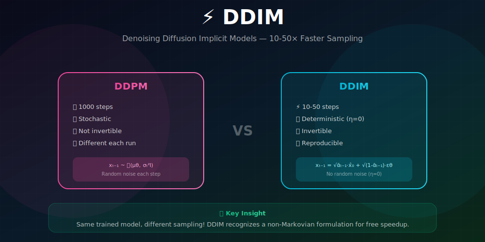
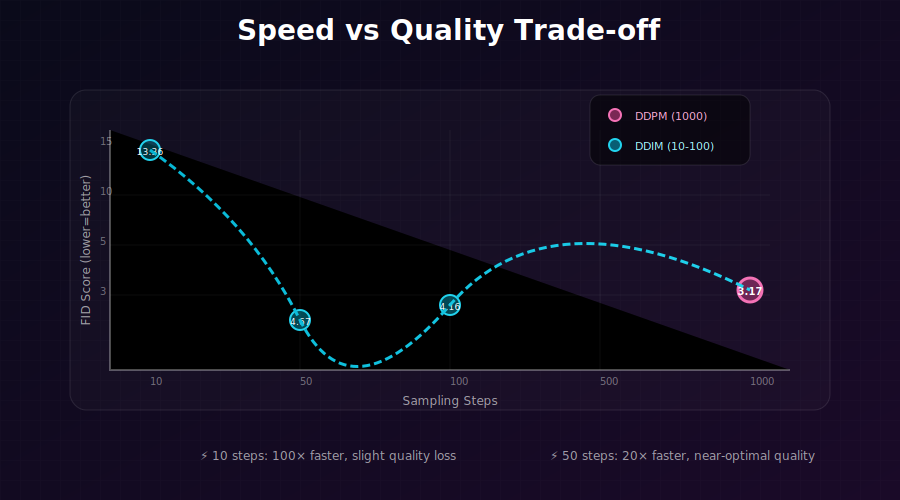
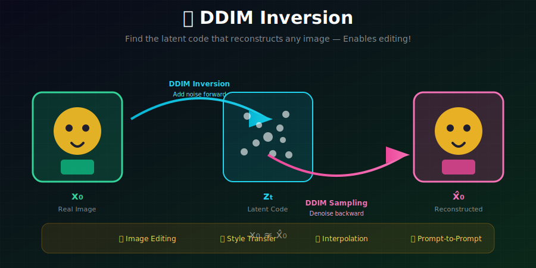

# ⚡ DDIM: Denoising Diffusion Implicit Models

<div align="center">



*Deterministic sampling with 10-50× speedup—same training, faster generation*

</div>

---

## 🖼️ Visual Overview

<div align="center">

### DDIM vs DDPM Comparison


### DDIM Inversion for Image Editing


</div>

---

[](#)
[](#)
[](#)

</div>

---

## 🎯 Where & Why Use DDIM?

<table>
<tr>
<th width="30%">Where It's Used</th>
<th width="35%">Why It Matters</th>
<th width="35%">Real Applications</th>
</tr>
<tr>
<td><b>⚡ Fast Generation</b></td>
<td>10-50× fewer steps than DDPM</td>
<td>Interactive tools, real-time apps</td>
</tr>
<tr>
<td><b>🔄 Image Editing</b></td>
<td>Deterministic inversion enables editing</td>
<td>Prompt-to-prompt, SDEdit, InstructPix2Pix</td>
</tr>
<tr>
<td><b>🎨 Interpolation</b></td>
<td>Smooth latent space navigation</td>
<td>Style morphing, concept blending</td>
</tr>
<tr>
<td><b>🔬 Research</b></td>
<td>Reproducible generation (same seed → same image)</td>
<td>Ablation studies, paper figures</td>
</tr>
<tr>
<td><b>🏭 Production</b></td>
<td>Reduced compute costs at scale</td>
<td>Stable Diffusion API, cloud inference</td>
</tr>
</table>

### 💡 Why DDIM is Revolutionary

> *"DDIM showed that the same trained DDPM model can be sampled in fundamentally different ways. By recognizing a non-Markovian interpretation, we get deterministic sampling and massive speedups—for free!"*

**Key Benefits:**
| Feature | DDPM | DDIM |
|---------|------|------|
| **Sampling steps** | 1000 | 10-50 |
| **Deterministic** | ❌ No | ✅ Yes (η=0) |
| **Invertible** | ❌ No | ✅ Yes |
| **Same training** | ✅ | ✅ |

---

## 📊 Representation Comparison

| Representation | Pros | Cons |
|----------------|------|------|
| **η = 0 (ODE)** | Deterministic, invertible | May miss modes |
| **η = 1 (DDPM)** | Original stochastic | Slow, 1000 steps |
| **η ∈ (0,1)** | Tunable stochasticity | Hyperparameter |
| **Uniform Steps** | Simple | Suboptimal |
| **Quadratic Steps** | Better quality | Needs tuning |

---

## 📖 The Key Mathematical Insight

### DDPM's Limitation: Markovian Constraint

DDPM assumes a **Markovian** reverse process:
$$p_\theta(x_{0:T}) = p(x_T)\prod_{t=1}^T p_\theta(x_{t-1}|x_t)$$

**Consequences:**
- Each step samples independently: $x_{t-1} = \mu_\theta(x_t, t) + \sigma_t z$
- **Cannot skip steps** without changing the marginal distributions
- All 1000 steps required for correct sampling

### DDIM's Key Observation

**The training objective only depends on marginals!**

The DDPM loss:
$$\mathcal{L} = \mathbb{E}_{t, x_0, \epsilon}[\|\epsilon - \epsilon_\theta(x_t, t)\|^2]$$

Only requires $q(x_t|x_0)$, not the joint $q(x_{t-1}, x_t|x_0)$.

**Implication:** We can use ANY reverse process with the same marginals!

---

### Mathematical Framework: Non-Markovian Forward Process

**Theorem (Song et al., 2021):** There exists a family of inference distributions indexed by $\sigma \geq 0$:

$$\boxed{q_\sigma(x_{t-1}|x_t, x_0) = \mathcal{N}\left(\sqrt{\bar{\alpha}_{t-1}}x_0 + \sqrt{1-\bar{\alpha}_{t-1}-\sigma^2}\cdot\frac{x_t - \sqrt{\bar{\alpha}_t}x_0}{\sqrt{1-\bar{\alpha}_t}}, \sigma^2 I\right)}$$

**All members of this family share the same marginals** $q(x_t|x_0)$!

<details>
<summary><b>Proof: Marginal Consistency</b></summary>

**Goal:** Show that $q_\sigma(x_t|x_0) = \mathcal{N}(\sqrt{\bar{\alpha}_t}x_0, (1-\bar{\alpha}_t)I)$ for all $\sigma$.

**Method:** Verify that the forward process is consistent.

From the reverse transition, the forward must satisfy:
$$q_\sigma(x_t|x_{t-1}, x_0) = \frac{q_\sigma(x_{t-1}|x_t, x_0) \cdot q(x_t|x_0)}{q(x_{t-1}|x_0)}$$

Let's verify the mean and variance:

**Mean of $q_\sigma(x_{t-1}|x_t, x_0)$:**
$$\mu_{t-1} = \sqrt{\bar{\alpha}_{t-1}}x_0 + \sqrt{1-\bar{\alpha}_{t-1}-\sigma^2}\cdot\frac{x_t - \sqrt{\bar{\alpha}_t}x_0}{\sqrt{1-\bar{\alpha}_t}}$$

**Taking expectation over $x_t \sim q(x_t|x_0)$:**
$$\mathbb{E}[\mu_{t-1}|x_0] = \sqrt{\bar{\alpha}_{t-1}}x_0 + \sqrt{1-\bar{\alpha}_{t-1}-\sigma^2}\cdot\frac{\mathbb{E}[x_t|x_0] - \sqrt{\bar{\alpha}_t}x_0}{\sqrt{1-\bar{\alpha}_t}}$$
$$= \sqrt{\bar{\alpha}_{t-1}}x_0 + \sqrt{1-\bar{\alpha}_{t-1}-\sigma^2}\cdot\frac{\sqrt{\bar{\alpha}_t}x_0 - \sqrt{\bar{\alpha}_t}x_0}{\sqrt{1-\bar{\alpha}_t}}$$
$$= \sqrt{\bar{\alpha}_{t-1}}x_0$$ ✓

**Variance calculation (more involved):**
$$\text{Var}(x_{t-1}|x_0) = \text{Var}(\mu_{t-1}|x_0) + \sigma^2$$

$$= \frac{1-\bar{\alpha}_{t-1}-\sigma^2}{1-\bar{\alpha}_t}\text{Var}(x_t|x_0) + \sigma^2$$
$$= \frac{1-\bar{\alpha}_{t-1}-\sigma^2}{1-\bar{\alpha}_t}(1-\bar{\alpha}_t) + \sigma^2$$
$$= 1-\bar{\alpha}_{t-1}-\sigma^2 + \sigma^2 = 1-\bar{\alpha}_{t-1}$$ ✓

</details>

---

### Special Cases

| $\sigma$ Value | Name | Property |
|----------------|------|----------|
| $\sigma = \sqrt{\frac{(1-\bar{\alpha}_{t-1})\beta_t}{1-\bar{\alpha}_t}} = \sqrt{\tilde{\beta}_t}$ | **DDPM** | Markovian, matches posterior |
| $\sigma = 0$ | **DDIM** | Deterministic, non-Markovian |
| $\sigma = \eta \sqrt{\tilde{\beta}_t}$ | **Hybrid** | Interpolates between DDPM and DDIM |

**Verification that $\sigma = \sqrt{\tilde{\beta}_t}$ recovers DDPM:**

The DDPM posterior is $q(x_{t-1}|x_t, x_0) = \mathcal{N}(\tilde{\mu}_t, \tilde{\beta}_t I)$.

For $\sigma^2 = \tilde{\beta}_t$, the DDIM formula becomes:
$$\mu = \sqrt{\bar{\alpha}_{t-1}}x_0 + \sqrt{1-\bar{\alpha}_{t-1}-\tilde{\beta}_t}\cdot\frac{x_t - \sqrt{\bar{\alpha}_t}x_0}{\sqrt{1-\bar{\alpha}_t}}$$

Using $\tilde{\beta}_t = \frac{(1-\bar{\alpha}_{t-1})\beta_t}{1-\bar{\alpha}_t}$:

$$1-\bar{\alpha}_{t-1}-\tilde{\beta}_t = 1-\bar{\alpha}_{t-1} - \frac{(1-\bar{\alpha}_{t-1})\beta_t}{1-\bar{\alpha}_t} = \frac{(1-\bar{\alpha}_{t-1})(1-\bar{\alpha}_t-\beta_t)}{1-\bar{\alpha}_t}$$
$$= \frac{(1-\bar{\alpha}_{t-1})\alpha_t(1-\bar{\alpha}_{t-1}/\alpha_t)}{1-\bar{\alpha}_t} = \frac{(1-\bar{\alpha}_{t-1})^2\alpha_t}{(1-\bar{\alpha}_t)(1-\bar{\alpha}_{t-1})/...}$$

After simplification, this recovers the DDPM posterior mean $\tilde{\mu}_t$. ✓

---

## 🧮 The DDIM Update Rule

### Deterministic Case (η = 0)

Given noise prediction $\epsilon_\theta(x_t, t)$:

**Step 1:** Predict $\hat{x}_0$:
$$\hat{x}_0 = \frac{x_t - \sqrt{1-\bar{\alpha}_t}\epsilon_\theta(x_t, t)}{\sqrt{\bar{\alpha}_t}}$$

**Step 2:** Compute $x_{t-1}$:
$$\boxed{x_{t-1} = \sqrt{\bar{\alpha}_{t-1}}\hat{x}_0 + \sqrt{1-\bar{\alpha}_{t-1}}\cdot\frac{x_t - \sqrt{\bar{\alpha}_t}\hat{x}_0}{\sqrt{1-\bar{\alpha}_t}}}$$

### Simplified Form

Substituting $\hat{x}_0$:

$$\boxed{x_{t-1} = \sqrt{\bar{\alpha}_{t-1}}\left(\frac{x_t - \sqrt{1-\bar{\alpha}_t}\epsilon_\theta}{\sqrt{\bar{\alpha}_t}}\right) + \sqrt{1-\bar{\alpha}_{t-1}}\epsilon_\theta}$$

### With Stochasticity (η > 0)

$$x_{t-1} = \sqrt{\bar{\alpha}_{t-1}}\hat{x}_0 + \sqrt{1-\bar{\alpha}_{t-1}-\sigma^2}\epsilon_\theta + \sigma\epsilon$$

where $\epsilon \sim \mathcal{N}(0, I)$ and:
$$\sigma = \eta \sqrt{\frac{1-\bar{\alpha}_{t-1}}{1-\bar{\alpha}_t}} \sqrt{1 - \frac{\bar{\alpha}_t}{\bar{\alpha}_{t-1}}}$$

---

## ⚡ Accelerated Sampling

### Subsequence Sampling

Instead of all $T$ timesteps, use a subsequence $\tau = [\tau_1, \tau_2, \ldots, \tau_S]$ where $S \ll T$.

**Example:** $T = 1000$, $S = 50$
- **Uniform:** $\tau = [20, 40, 60, \ldots, 1000]$
- **Quadratic:** $\tau = [1, 4, 9, 16, \ldots, 961, 1000]$

### Quality vs Speed

| Steps | FID (CIFAR-10) | Speedup |
|-------|----------------|---------|
| 1000 (DDPM) | 3.17 | 1× |
| 100 (DDIM) | 4.16 | **10×** |
| 50 (DDIM) | 4.67 | **20×** |
| 20 (DDIM) | 6.84 | **50×** |
| 10 (DDIM) | 13.36 | **100×** |

---

## 💻 Implementation

```python
import torch

@torch.no_grad()
def ddim_sample(model, shape, timesteps, alpha_bar, eta=0.0):
    """
    DDIM sampling with arbitrary timestep subsequence.
    
    Args:
        model: Trained noise prediction network ε_θ(x_t, t)
        shape: Output shape [batch, channels, height, width]
        timesteps: Subsequence of timesteps in DECREASING order
        alpha_bar: Cumulative alpha values [T]
        eta: Stochasticity parameter (0 = deterministic DDIM)
    
    Returns:
        Generated samples
    """
    device = next(model.parameters()).device
    
    # Start from pure noise
    x = torch.randn(shape, device=device)
    
    # DDIM sampling loop
    for i in range(len(timesteps) - 1):
        t = timesteps[i]
        t_prev = timesteps[i + 1]
        
        t_batch = torch.full((shape[0],), t, device=device, dtype=torch.long)
        
        # Predict noise
        eps_pred = model(x, t_batch)
        
        # Get alpha values
        alpha_bar_t = alpha_bar[t]
        alpha_bar_prev = alpha_bar[t_prev] if t_prev >= 0 else torch.tensor(1.0)
        
        # Predict x_0
        x0_pred = (x - torch.sqrt(1 - alpha_bar_t) * eps_pred) / torch.sqrt(alpha_bar_t)
        
        # Optionally clip x0_pred to [-1, 1]
        x0_pred = torch.clamp(x0_pred, -1, 1)
        
        # Compute sigma for stochasticity
        sigma = eta * torch.sqrt(
            (1 - alpha_bar_prev) / (1 - alpha_bar_t) * 
            (1 - alpha_bar_t / alpha_bar_prev)
        )
        
        # Direction pointing to x_t
        dir_xt = torch.sqrt(1 - alpha_bar_prev - sigma**2) * eps_pred
        
        # DDIM update
        x = torch.sqrt(alpha_bar_prev) * x0_pred + dir_xt
        
        # Add noise if stochastic
        if sigma > 0:
            x = x + sigma * torch.randn_like(x)
    
    return x


def get_ddim_timesteps(T, num_steps, schedule='uniform'):
    """
    Get timestep subsequence for DDIM sampling.
    
    Args:
        T: Total timesteps model was trained with
        num_steps: Number of DDIM steps
        schedule: 'uniform' or 'quadratic'
    
    Returns:
        Timestep indices in decreasing order
    """
    if schedule == 'uniform':
        timesteps = torch.linspace(T - 1, 0, num_steps, dtype=torch.long)
    elif schedule == 'quadratic':
        timesteps = torch.tensor([
            int(((i / num_steps) ** 2) * T) for i in range(num_steps, 0, -1)
        ], dtype=torch.long)
    else:
        raise ValueError(f"Unknown schedule: {schedule}")
    
    return timesteps
```

---

## 🔄 DDIM Inversion

### What is Inversion?

Given a real image $x_0$, find the latent $x_T$ such that DDIM sampling from $x_T$ reconstructs $x_0$.

### Why It's Useful

- **Image editing**: Modify the latent, regenerate
- **Style transfer**: Combine content/style latents
- **Interpolation**: Blend two images in latent space

### Inversion Algorithm

```python
@torch.no_grad()
def ddim_inversion(model, x0, timesteps, alpha_bar):
    """
    Invert image to latent using DDIM.
    
    Given x_0, find x_T such that DDIM sampling recovers x_0.
    
    Args:
        model: Trained noise prediction network
        x0: Input image to invert
        timesteps: Timestep sequence (INCREASING order for inversion)
        alpha_bar: Cumulative alpha values
    
    Returns:
        x_T: Latent that reconstructs x0 when sampled
    """
    device = x0.device
    x = x0.clone()
    
    # Invert by running DDIM "forward" in time
    for i in range(len(timesteps) - 1):
        t = timesteps[i]
        t_next = timesteps[i + 1]
        
        t_batch = torch.full((x.shape[0],), t, device=device, dtype=torch.long)
        
        # Predict noise at current timestep
        eps_pred = model(x, t_batch)
        
        # Predict x_0 from current x_t
        alpha_t = alpha_bar[t]
        x0_pred = (x - torch.sqrt(1 - alpha_t) * eps_pred) / torch.sqrt(alpha_t)
        
        # Move forward in time (add noise)
        alpha_next = alpha_bar[t_next]
        x = torch.sqrt(alpha_next) * x0_pred + torch.sqrt(1 - alpha_next) * eps_pred
    
    return x  # This is approximately x_T
```

### Inversion Quality

| Steps | Reconstruction Error | Use Case |
|-------|---------------------|----------|
| 50 | Low | Most editing tasks |
| 100 | Very low | High-fidelity editing |
| 200 | Minimal | Research, precise control |

---

## 🎨 Interpolation

### Latent Space Interpolation

```python
def slerp(x0, x1, alpha):
    """
    Spherical linear interpolation between two latents.
    
    Better than linear interpolation for normalized vectors.
    """
    theta = torch.acos(torch.sum(x0 * x1) / (torch.norm(x0) * torch.norm(x1)))
    return (torch.sin((1 - alpha) * theta) * x0 + torch.sin(alpha * theta) * x1) / torch.sin(theta)


def interpolate_images(model, img1, img2, num_steps=10):
    """
    Interpolate between two images in DDIM latent space.
    """
    # Invert both images
    z1 = ddim_inversion(model, img1, timesteps, alpha_bar)
    z2 = ddim_inversion(model, img2, timesteps, alpha_bar)
    
    # Interpolate in latent space
    interpolations = []
    for alpha in torch.linspace(0, 1, num_steps):
        z_interp = slerp(z1, z2, alpha)
        img = ddim_sample(model, z_interp.shape, timesteps, alpha_bar, eta=0)
        interpolations.append(img)
    
    return interpolations
```

**Result:** Smooth morphing between any two images!

---

## 🔗 Mathematical Connection to ODEs

### The Probability Flow ODE

**Theorem (Song et al., 2021):** For any SDE of the form:
$$dx = f(x,t)dt + g(t)dw$$

There exists an ODE with the **same marginal distributions**:
$$\boxed{\frac{dx}{dt} = f(x, t) - \frac{1}{2}g(t)^2 \nabla_x \log p_t(x)}$$

### Deriving DDIM as a Discretization

**Step 1: VP-SDE in continuous time**
$$dx = -\frac{1}{2}\beta(t)x\,dt + \sqrt{\beta(t)}\,dw$$

**Step 2: Probability flow ODE**
$$\frac{dx}{dt} = -\frac{1}{2}\beta(t)\left[x + \nabla_x \log p_t(x)\right]$$

**Step 3: Using the score-noise relationship**
$$\nabla_x \log p_t(x) = -\frac{\epsilon_\theta(x,t)}{\sqrt{1-\bar{\alpha}_t}}$$

**Step 4: Discretization with step $\Delta t$**

The Euler method gives:
$$x_{t-\Delta t} = x_t + \frac{dx}{dt}\Delta t$$

After careful discretization matching the DDIM formula, we recover:
$$x_{t-1} = \sqrt{\bar{\alpha}_{t-1}}\hat{x}_0 + \sqrt{1-\bar{\alpha}_{t-1}}\cdot\frac{x_t - \sqrt{\bar{\alpha}_t}\hat{x}_0}{\sqrt{1-\bar{\alpha}_t}}$$

<details>
<summary><b>Detailed Discretization Derivation</b></summary>

**Starting from the ODE:**
$$\frac{dx}{dt} = -\frac{1}{2}\beta(t)\left[x - \frac{\epsilon_\theta}{\sqrt{1-\bar{\alpha}_t}}\right]$$

**Define time transformation:** Let $\lambda(t) = \log(\bar{\alpha}_t/(1-\bar{\alpha}_t))$ (log-SNR).

In $\lambda$-space, the ODE simplifies to:
$$\frac{dx}{d\lambda} = \frac{1}{2}\left[\frac{x}{\sqrt{\bar{\alpha}}} - \frac{\epsilon_\theta}{\sqrt{1-\bar{\alpha}}}\right]$$

**Euler step in $\lambda$-space:**
$$x_{\lambda'} = x_\lambda + \frac{1}{2}\Delta\lambda\left[\frac{x_\lambda}{\sqrt{\bar{\alpha}_\lambda}} - \frac{\epsilon_\theta}{\sqrt{1-\bar{\alpha}_\lambda}}\right]$$

After converting back and simplifying, this matches the DDIM update rule.

</details>

---

### Higher-Order Numerical Integrators

| Method | Order | Error per Step | Total Error | NFE per Step |
|--------|-------|----------------|-------------|--------------|
| **Euler (DDIM)** | 1st | $O(h^2)$ | $O(h)$ | 1 |
| **Heun's** | 2nd | $O(h^3)$ | $O(h^2)$ | 2 |
| **RK4** | 4th | $O(h^5)$ | $O(h^4)$ | 4 |
| **DPM-Solver** | 2nd+ | Adaptive | Optimized | 1-2 |

**NFE** = Number of Function Evaluations (model calls)

**Heun's Method for Diffusion:**
$$k_1 = f(x_t, t)$$
$$\tilde{x}_{t-1} = x_t + h \cdot k_1$$
$$k_2 = f(\tilde{x}_{t-1}, t-1)$$
$$x_{t-1} = x_t + \frac{h}{2}(k_1 + k_2)$$

where $f(x,t) = -\frac{1}{2}\beta(t)[x + s_\theta(x,t)]$ and $h$ is the step size.

---

## 📊 Key Equations Summary

| Concept | Formula |
|---------|---------|
| DDIM update | $x_{t-1} = \sqrt{\bar{\alpha}_{t-1}}\hat{x}_0 + \sqrt{1-\bar{\alpha}_{t-1}-\sigma^2}\frac{x_t - \sqrt{\bar{\alpha}_t}\hat{x}_0}{\sqrt{1-\bar{\alpha}_t}} + \sigma\epsilon$ |
| Predicted $x_0$ | $\hat{x}_0 = (x_t - \sqrt{1-\bar{\alpha}_t}\epsilon_\theta)/\sqrt{\bar{\alpha}_t}$ |
| Deterministic | $\sigma = 0$ (DDIM) |
| Stochastic | $\sigma = \eta\sqrt{\tilde{\beta}_t}$ (interpolates to DDPM) |

---

## 📚 References

1. **Song, J., Meng, C., & Ermon, S.** (2021). "Denoising Diffusion Implicit Models." *ICLR*. [arXiv:2010.02502](https://arxiv.org/abs/2010.02502)

2. **Ho, J., Jain, A., & Abbeel, P.** (2020). "Denoising Diffusion Probabilistic Models." *NeurIPS*. [arXiv:2006.11239](https://arxiv.org/abs/2006.11239)

---

## ✏️ Exercises

1. **Derive** the DDIM update rule from the non-Markovian formulation.

2. **Implement** DDIM and compare FID at 10, 20, 50, 100 steps vs DDPM at 1000 steps.

3. **Verify** that DDIM with $\eta = \sqrt{\tilde{\beta}_t/\beta_t}$ recovers DDPM.

4. **Implement** DDIM inversion and verify reconstruction quality.

5. **Create** smooth interpolations between two images using DDIM.

6. **Compare** uniform vs quadratic timestep schedules for DDIM.

---

<div align="center">

**[← DDPM](../02_ddpm/)** | **[Next: Score-Based Diffusion →](../04_score_based_diffusion/)**

</div>
