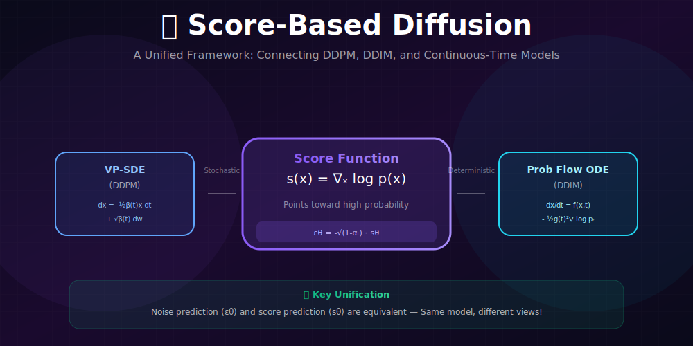
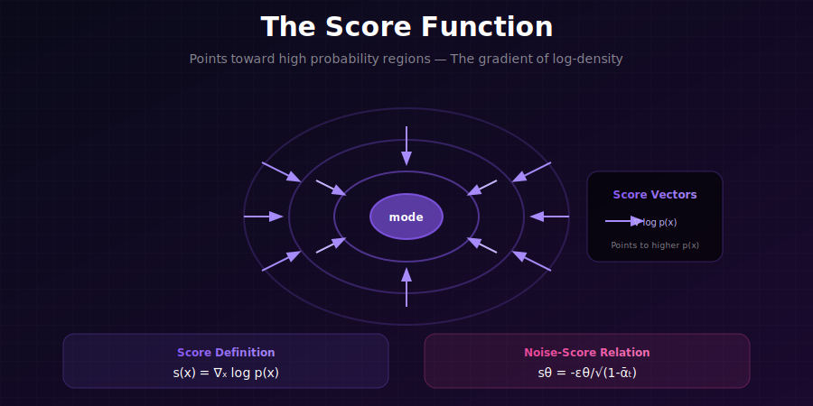
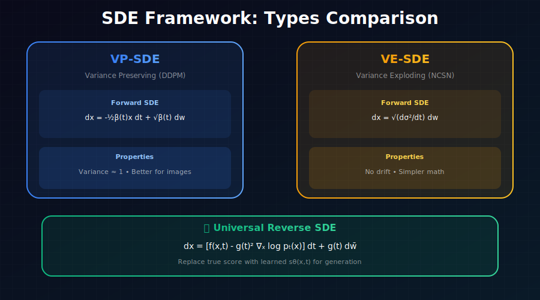

# 📈 Score-Based Diffusion & SDEs

<div align="center">



*A unified continuous-time framework connecting DDPM, NCSN, and beyond*

</div>

---

## 🖼️ Visual Overview

<div align="center">

### The Score Function


### Unified SDE Framework


</div>

---

[](#)
[](#)
[](#)

</div>

---

## 🎯 Where & Why Use This Knowledge?

<table>
<tr>
<th width="30%">Where It's Used</th>
<th width="35%">Why It Matters</th>
<th width="35%">Real Applications</th>
</tr>
<tr>
<td><b>🔬 Research</b></td>
<td>Unifies discrete and continuous diffusion</td>
<td>Novel sampler design, theoretical analysis</td>
</tr>
<tr>
<td><b>📊 Likelihood Computation</b></td>
<td>Exact log-likelihood via probability flow ODE</td>
<td>Model comparison, density estimation</td>
</tr>
<tr>
<td><b>⚡ Advanced Samplers</b></td>
<td>Foundation for DPM-Solver, EDM</td>
<td>State-of-the-art fast sampling</td>
</tr>
<tr>
<td><b>🎛️ Flexible Design</b></td>
<td>Mix SDE and ODE solvers freely</td>
<td>Custom generation pipelines</td>
</tr>
</table>

### 💡 Why Score-Based Perspective Matters

> *"The score-based view reveals that DDPM, DDIM, and score matching are all doing the same thing—learning the gradient of the log probability. This insight enables powerful unifications and new algorithms."*

**Key Unifications:**
- DDPM ↔ VP-SDE (Variance Preserving)
- NCSN ↔ VE-SDE (Variance Exploding)
- DDIM ↔ Probability Flow ODE

---

## 📖 The Score Function: Mathematical Foundations

### Definition and Intuition

The **score function** is the gradient of the log-density:

$$\boxed{s(x) = \nabla_x \log p(x)}$$

**Properties:**
1. **Direction:** Points toward modes (higher probability regions)
2. **Magnitude:** Larger in regions of rapid density change
3. **Zero points:** At local maxima of $p(x)$

### Mathematical Properties of the Score

**Property 1: Integration to Zero**
$$\mathbb{E}_{x \sim p}[s(x)] = \int p(x) \nabla_x \log p(x) dx = \int \nabla_x p(x) dx = 0$$

**Property 2: Fisher Information**
$$\mathcal{I} = \mathbb{E}_{x \sim p}[s(x)s(x)^T] = -\mathbb{E}_{x \sim p}[\nabla_x^2 \log p(x)]$$

**Property 3: Score of Gaussian**

For $p(x) = \mathcal{N}(x; \mu, \Sigma)$:
$$s(x) = -\Sigma^{-1}(x - \mu)$$

---

### Score at Time $t$

For the noisy distribution at time $t$:
$$s(x, t) = \nabla_x \log p_t(x)$$

**Bayes' Rule Decomposition:**
$$p_t(x) = \int p(x|x_0) p_0(x_0) dx_0$$

where $p(x|x_0) = q(x_t|x_0) = \mathcal{N}(\sqrt{\bar{\alpha}_t}x_0, (1-\bar{\alpha}_t)I)$.

---

### Complete Derivation: Score-Noise Relationship

**Step 1: Score of the conditional**

$$\nabla_{x_t}\log q(x_t|x_0) = \nabla_{x_t}\left[-\frac{\|x_t - \sqrt{\bar{\alpha}_t}x_0\|^2}{2(1-\bar{\alpha}_t)}\right]$$

$$= -\frac{x_t - \sqrt{\bar{\alpha}_t}x_0}{1-\bar{\alpha}_t}$$

**Step 2: Using the reparameterization**

Since $x_t = \sqrt{\bar{\alpha}_t}x_0 + \sqrt{1-\bar{\alpha}_t}\epsilon$:

$$x_t - \sqrt{\bar{\alpha}_t}x_0 = \sqrt{1-\bar{\alpha}_t}\epsilon$$

**Step 3: Final relationship**

$$\nabla_{x_t}\log q(x_t|x_0) = -\frac{\sqrt{1-\bar{\alpha}_t}\epsilon}{1-\bar{\alpha}_t} = -\frac{\epsilon}{\sqrt{1-\bar{\alpha}_t}}$$

**Step 4: Marginal score (Tweedie's formula)**

Taking expectation over $x_0|x_t$:
$$s(x_t, t) = \nabla_{x_t}\log p_t(x_t) = \mathbb{E}_{x_0|x_t}\left[\nabla_{x_t}\log q(x_t|x_0)\right] = -\frac{\mathbb{E}[\epsilon|x_t]}{\sqrt{1-\bar{\alpha}_t}}$$

Therefore:

$$\boxed{s_\theta(x_t, t) = -\frac{\epsilon_\theta(x_t, t)}{\sqrt{1-\bar{\alpha}_t}}}$$

**Predicting noise ≡ Predicting the score!**

---

### Tweedie's Formula: A Deeper Look

**Theorem (Tweedie, 1947):** For $x_t = \sqrt{\bar{\alpha}_t}x_0 + \sqrt{1-\bar{\alpha}_t}\epsilon$:

$$\boxed{\mathbb{E}[x_0|x_t] = \frac{x_t + (1-\bar{\alpha}_t)\nabla_{x_t}\log p_t(x_t)}{\sqrt{\bar{\alpha}_t}}}$$

<details>
<summary><b>Proof of Tweedie's Formula</b></summary>

**Using Bayes' rule:**
$$p(x_0|x_t) = \frac{q(x_t|x_0)p_0(x_0)}{p_t(x_t)}$$

**Taking gradient w.r.t. $x_t$:**
$$\nabla_{x_t} \log p_t(x_t) = \nabla_{x_t} \log \int q(x_t|x_0) p_0(x_0) dx_0$$

$$= \frac{\int \nabla_{x_t} q(x_t|x_0) p_0(x_0) dx_0}{\int q(x_t|x_0) p_0(x_0) dx_0}$$

$$= \int \frac{q(x_t|x_0) p_0(x_0)}{p_t(x_t)} \cdot \frac{\nabla_{x_t} q(x_t|x_0)}{q(x_t|x_0)} dx_0$$

$$= \mathbb{E}_{x_0|x_t}\left[\nabla_{x_t} \log q(x_t|x_0)\right]$$

$$= -\frac{\mathbb{E}_{x_0|x_t}[x_t - \sqrt{\bar{\alpha}_t}x_0]}{1-\bar{\alpha}_t}$$

$$= -\frac{x_t - \sqrt{\bar{\alpha}_t}\mathbb{E}[x_0|x_t]}{1-\bar{\alpha}_t}$$

Solving for $\mathbb{E}[x_0|x_t]$:
$$\mathbb{E}[x_0|x_t] = \frac{x_t + (1-\bar{\alpha}_t)\nabla_{x_t}\log p_t(x_t)}{\sqrt{\bar{\alpha}_t}}$$

</details>

**Connection to denoising:**
- Score gives direction to denoise
- $\mathbb{E}[x_0|x_t]$ is the optimal denoising estimate (MMSE)

---

## 🌊 Stochastic Differential Equations

### From Discrete to Continuous

DDPM forward process:
$$x_t = \sqrt{1-\beta_t}x_{t-1} + \sqrt{\beta_t}\epsilon$$

In continuous time ($\Delta t \to 0$):
$$dx = f(x, t)dt + g(t)dw$$

where $w$ is a **Wiener process** (continuous random walk).

### Variance Preserving (VP) SDE

Corresponds to DDPM:

$$\boxed{dx = -\frac{1}{2}\beta(t)x\,dt + \sqrt{\beta(t)}\,dw}$$

**Properties:**
- Variance stays bounded ≈ 1
- $x_T \approx \mathcal{N}(0, I)$ for large $T$
- Drift term: $f(x, t) = -\frac{1}{2}\beta(t)x$
- Diffusion term: $g(t) = \sqrt{\beta(t)}$

### Variance Exploding (VE) SDE

Corresponds to NCSN (Noise Conditional Score Networks):

$$\boxed{dx = \sqrt{\frac{d[\sigma^2(t)]}{dt}}\,dw}$$

**Properties:**
- Variance grows unboundedly
- No drift term ($f = 0$)
- Simpler mathematical form

### Comparison

| SDE Type | Drift $f(x,t)$ | Diffusion $g(t)$ | Origin |
|----------|----------------|------------------|--------|
| VP-SDE | $-\frac{1}{2}\beta(t)x$ | $\sqrt{\beta(t)}$ | DDPM |
| VE-SDE | $0$ | $\sqrt{d\sigma^2/dt}$ | NCSN |
| Sub-VP | $-\frac{1}{2}\beta(t)x$ | Complex | Improved VP |

---

## ⏪ Reverse-Time SDE: Complete Mathematical Treatment

### Anderson's Theorem (1982)

**Theorem:** Any forward SDE:
$$dx = f(x, t)\,dt + g(t)\,dw$$

Has a reverse-time SDE:
$$\boxed{dx = [f(x, t) - g(t)^2 \nabla_x \log p_t(x)]\,dt + g(t)\,d\bar{w}}$$

where $\bar{w}$ is reverse-time Wiener process (runs backward: $d\bar{w} = -dw$).

<details>
<summary><b>Proof Sketch of Anderson's Theorem</b></summary>

**Step 1: Forward Fokker-Planck equation**

For the forward SDE $dx = f(x,t)dt + g(t)dw$, the density $p_t(x)$ satisfies:
$$\frac{\partial p_t}{\partial t} = -\nabla \cdot (f \cdot p_t) + \frac{1}{2}g(t)^2 \nabla^2 p_t$$

**Step 2: Time-reversed density**

Define $\tilde{p}_\tau(x) = p_{T-\tau}(x)$ for $\tau \in [0, T]$.

**Step 3: Derive the reverse Fokker-Planck**

The reversed process must satisfy:
$$\frac{\partial \tilde{p}_\tau}{\partial \tau} = -\frac{\partial p_t}{\partial t}\bigg|_{t=T-\tau}$$

Substituting and rearranging, we get:
$$\frac{\partial \tilde{p}_\tau}{\partial \tau} = -\nabla \cdot (\tilde{f} \cdot \tilde{p}_\tau) + \frac{1}{2}g^2 \nabla^2 \tilde{p}_\tau$$

where the reverse drift is:
$$\tilde{f}(x, \tau) = f(x, T-\tau) - g(T-\tau)^2 \nabla_x \log p_{T-\tau}(x)$$

**Step 4: Convert to SDE form**

This Fokker-Planck corresponds to the reverse SDE:
$$dx = \tilde{f}(x, \tau)d\tau + g(T-\tau)d\bar{w}$$

Converting back to original time: $t = T - \tau$, $dt = -d\tau$:
$$dx = [f(x,t) - g(t)^2 \nabla_x \log p_t(x)]dt + g(t)d\bar{w}$$

</details>

---

### VP-SDE: Forward and Reverse

**Forward VP-SDE:**
$$dx = -\frac{1}{2}\beta(t)x\,dt + \sqrt{\beta(t)}\,dw$$

Here: $f(x,t) = -\frac{1}{2}\beta(t)x$ and $g(t) = \sqrt{\beta(t)}$.

**Reverse VP-SDE:**
$$dx = \left[-\frac{1}{2}\beta(t)x - \beta(t)\nabla_x \log p_t(x)\right]dt + \sqrt{\beta(t)}\,d\bar{w}$$

**Factored form:**
$$\boxed{dx = -\frac{1}{2}\beta(t)\left[x + 2\nabla_x \log p_t(x)\right]dt + \sqrt{\beta(t)}\,d\bar{w}}$$

---

### Score Matching Objective

**Denoising Score Matching (DSM):**

The score matching loss:
$$\mathcal{L}_{SM} = \mathbb{E}_t\mathbb{E}_{x_0}\mathbb{E}_{x_t|x_0}\left[\lambda(t)\|s_\theta(x_t, t) - \nabla_{x_t}\log q(x_t|x_0)\|^2\right]$$

Using $\nabla_{x_t}\log q(x_t|x_0) = -\frac{\epsilon}{\sqrt{1-\bar{\alpha}_t}}$:

$$\mathcal{L}_{SM} = \mathbb{E}_t\mathbb{E}_{x_0,\epsilon}\left[\lambda(t)\left\|s_\theta(x_t, t) + \frac{\epsilon}{\sqrt{1-\bar{\alpha}_t}}\right\|^2\right]$$

**With $\epsilon$-parameterization:** $s_\theta = -\frac{\epsilon_\theta}{\sqrt{1-\bar{\alpha}_t}}$

$$\mathcal{L}_{SM} = \mathbb{E}_t\mathbb{E}_{x_0,\epsilon}\left[\frac{\lambda(t)}{1-\bar{\alpha}_t}\|\epsilon - \epsilon_\theta(x_t, t)\|^2\right]$$

**Optimal weighting:** $\lambda(t) = 1-\bar{\alpha}_t$ recovers the DDPM loss!

---

### Sampling with Learned Score

Replace true score with learned $s_\theta$:
$$dx = \left[f(x, t) - g(t)^2 s_\theta(x, t)\right]dt + g(t)\,d\bar{w}$$

**Discretization (Euler-Maruyama):**
$$x_{t-\Delta t} = x_t + \left[f(x_t, t) - g(t)^2 s_\theta(x_t, t)\right]\Delta t + g(t)\sqrt{\Delta t}\cdot z$$

where $z \sim \mathcal{N}(0, I)$.

---

## 🎯 Probability Flow ODE

### Deterministic Alternative

For any SDE, there exists an **ODE with the same marginals**:

$$\boxed{\frac{dx}{dt} = f(x, t) - \frac{1}{2}g(t)^2 \nabla_x \log p_t(x)}$$

### VP-SDE Probability Flow

$$\frac{dx}{dt} = -\frac{1}{2}\beta(t)\left[x + \nabla_x \log p_t(x)\right]$$

With learned score:
$$\frac{dx}{dt} = -\frac{1}{2}\beta(t)\left[x + s_\theta(x, t)\right]$$

### Advantages of ODE

| Feature | Benefit |
|---------|---------|
| **Deterministic** | Same noise → same output |
| **Exact likelihood** | Compute $\log p(x)$ via change of variables |
| **Efficient solvers** | Use adaptive ODE solvers |
| **Invertible** | Perfect reconstruction |

---

## 🔢 Numerical Solvers

### Euler-Maruyama (SDE)

```python
def euler_maruyama_step(x, t, dt, score_fn, beta_fn):
    """Single Euler-Maruyama step for reverse SDE."""
    beta_t = beta_fn(t)
    f = -0.5 * beta_t * x - beta_t * score_fn(x, t)
    g = torch.sqrt(beta_t)
    
    # dt is negative (reverse time)
    dw = torch.sqrt(-dt) * torch.randn_like(x)
    return x + f * dt + g * dw
```

### Euler (ODE)

```python
def euler_ode_step(x, t, dt, score_fn, beta_fn):
    """Single Euler step for probability flow ODE."""
    beta_t = beta_fn(t)
    dx_dt = -0.5 * beta_t * (x + score_fn(x, t))
    return x + dx_dt * dt
```

### Predictor-Corrector

Combine SDE solver with Langevin correction:

```python
def predictor_corrector_sample(score_fn, shape, T=1.0, num_steps=1000, snr=0.16):
    """Predictor-corrector sampling."""
    x = torch.randn(shape)
    timesteps = torch.linspace(T, 0, num_steps)
    
    for i in range(num_steps - 1):
        t = timesteps[i]
        dt = timesteps[i+1] - t
        
        # Predictor: Euler-Maruyama step
        x = euler_maruyama_step(x, t, dt, score_fn, beta_fn)
        
        # Corrector: Langevin dynamics
        for _ in range(1):  # Can do multiple corrections
            score = score_fn(x, timesteps[i+1])
            noise = torch.randn_like(x)
            step_size = snr * (noise.norm() / score.norm())**2
            x = x + step_size * score + torch.sqrt(2 * step_size) * noise
    
    return x
```

### Higher-Order Methods

| Method | Order | Quality | Speed |
|--------|-------|---------|-------|
| Euler | 1st | Okay | Fast |
| Heun | 2nd | Good | Medium |
| RK4 | 4th | Excellent | Slow |
| DPM-Solver | 2nd+ | Excellent | Fast |

---

## 📊 Likelihood Computation

### Instantaneous Change of Variables

For ODE $\frac{dx}{dt} = f(x, t)$:

$$\log p_0(x_0) = \log p_T(x_T) + \int_0^T \nabla \cdot f(x_t, t)\,dt$$

### Hutchinson's Trace Estimator

Computing $\nabla \cdot f$ directly is expensive. Use:

$$\nabla \cdot f = \mathbb{E}_{v \sim \mathcal{N}(0,I)}[v^T \nabla_x f \cdot v]$$

```python
def compute_log_likelihood(x0, score_fn, beta_fn, T=1.0):
    """Compute log p(x0) using probability flow ODE."""
    
    def ode_with_div(t, state):
        x = state[:-1].reshape(shape)
        x.requires_grad_(True)
        
        # Compute ODE vector field
        f = -0.5 * beta_fn(t) * (x + score_fn(x, t))
        
        # Hutchinson's estimator for divergence
        v = torch.randn_like(x)
        div = torch.autograd.grad(f, x, v)[0]
        div = (div * v).sum()
        
        return torch.cat([f.flatten(), div.unsqueeze(0)])
    
    # Integrate from t=0 to t=T
    init = torch.cat([x0.flatten(), torch.zeros(1)])
    result = ode_solve(ode_with_div, init, [0, T])
    
    x_T = result[:-1].reshape(shape)
    delta_logp = result[-1]
    
    # Log p(x_T) = log N(0, I)
    log_p_T = -0.5 * x_T.pow(2).sum()
    
    return log_p_T - delta_logp
```

---

## 📊 Key Equations Summary

| Concept | Formula |
|---------|---------|
| Score function | $s(x) = \nabla_x \log p(x)$ |
| Score-noise relation | $s_\theta = -\epsilon_\theta / \sqrt{1-\bar{\alpha}_t}$ |
| VP-SDE forward | $dx = -\frac{1}{2}\beta(t)x\,dt + \sqrt{\beta(t)}\,dw$ |
| Reverse SDE | $dx = [f - g^2\nabla_x\log p_t]\,dt + g\,d\bar{w}$ |
| Probability flow ODE | $\frac{dx}{dt} = f - \frac{1}{2}g^2\nabla_x\log p_t$ |

---

## 📚 References

1. **Song, Y., et al.** (2021). "Score-Based Generative Modeling through Stochastic Differential Equations." *ICLR*. [arXiv:2011.13456](https://arxiv.org/abs/2011.13456)

2. **Anderson, B.** (1982). "Reverse-time diffusion equation models." *Stochastic Processes and their Applications*.

3. **Song, Y., & Ermon, S.** (2019). "Generative Modeling by Estimating Gradients of the Data Distribution." *NeurIPS*. [arXiv:1907.05600](https://arxiv.org/abs/1907.05600)

---

## ✏️ Exercises

1. **Derive** the reverse-time SDE for the VE-SDE.

2. **Implement** both SDE and ODE sampling and compare outputs visually.

3. **Verify** that VP-SDE recovers DDPM in the discrete limit.

4. **Compute** exact likelihoods for a simple 2D distribution.

5. **Compare** Euler vs Heun vs predictor-corrector sampling quality.

6. **Show** mathematically that the probability flow ODE has the same marginals as the SDE.

---

<div align="center">

**[← DDIM](../03_ddim/)** | **[Next: Classifier Guidance →](../05_classifier_guidance/)**

</div>
