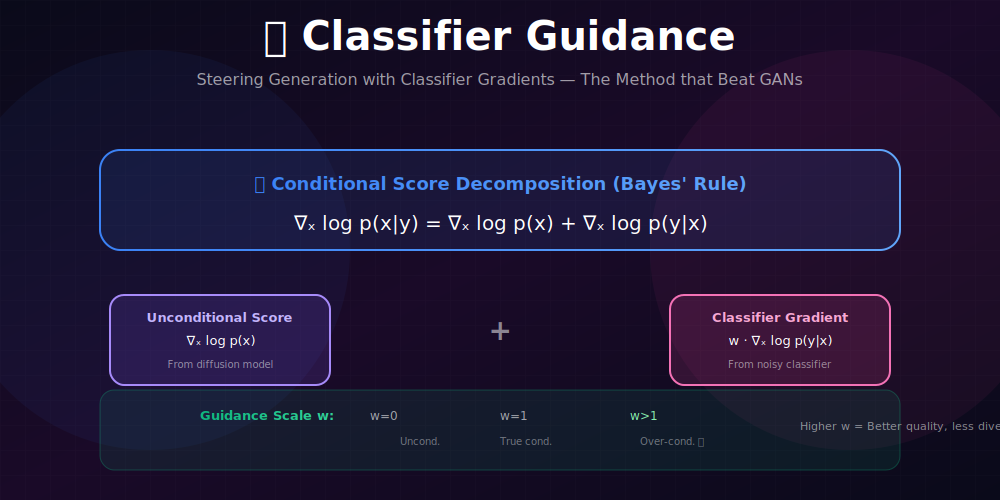
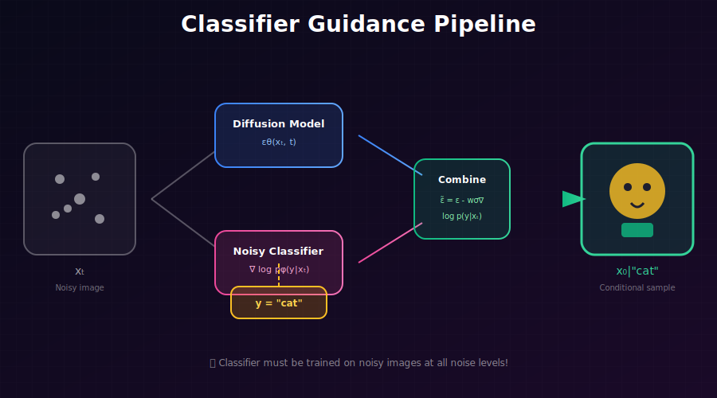

# 🎛️ Classifier Guidance

<div align="center">



*Steering generation with classifier gradients for conditional synthesis*

</div>

---

## 🖼️ Visual Overview

<div align="center">

### How Classifier Guidance Works


</div>

---

[](#)
[](#)
[](#)

</div>

---

## 🎯 Where & Why Use Classifier Guidance?

<table>
<tr>
<th width="30%">Where It's Used</th>
<th width="35%">Why It Matters</th>
<th width="35%">Real Applications</th>
</tr>
<tr>
<td><b>🏷️ Class-Conditional Generation</b></td>
<td>Generate specific classes with high fidelity</td>
<td>ImageNet generation, specific object synthesis</td>
</tr>
<tr>
<td><b>📈 Quality Enhancement</b></td>
<td>Trade diversity for higher sample quality</td>
<td>Production systems requiring consistent quality</td>
</tr>
<tr>
<td><b>🔬 Understanding Guidance</b></td>
<td>Foundation for classifier-free guidance</td>
<td>Research, algorithm development</td>
</tr>
<tr>
<td><b>🖼️ CLIP Guidance</b></td>
<td>Extended to text-image alignment</td>
<td>Early text-to-image systems</td>
</tr>
</table>

### 💡 Why Classifier Guidance is Important

> *"Dhariwal & Nichol (2021) used classifier guidance to make diffusion models beat BigGAN on ImageNet for the first time. This demonstrated that diffusion models could achieve state-of-the-art image quality."*

**Key Achievement:**
- First diffusion model to **beat GANs** on ImageNet
- Introduced the **quality-diversity tradeoff** concept
- Foundation for **classifier-free guidance** (used in modern systems)

---

## 📖 Complete Mathematical Framework

### Conditional Score Decomposition

**Starting from Bayes' rule:**
$$p(x|y) = \frac{p(y|x)p(x)}{p(y)}$$

**Step 1: Take the logarithm**
$$\log p(x|y) = \log p(y|x) + \log p(x) - \log p(y)$$

**Step 2: Take gradient w.r.t. $x$**
$$\nabla_x \log p(x|y) = \nabla_x \log p(y|x) + \nabla_x \log p(x) - \underbrace{\nabla_x \log p(y)}_{=0}$$

The $p(y)$ term vanishes because it doesn't depend on $x$.

$$\boxed{\nabla_x \log p(x|y) = \nabla_x \log p(x) + \nabla_x \log p(y|x)}$$

**In words:** Conditional score = Unconditional score + Classifier gradient

---

### Time-Dependent Version

At each timestep $t$ in the diffusion process:

$$\nabla_{x_t} \log p_t(x_t|y) = \nabla_{x_t} \log p_t(x_t) + \nabla_{x_t} \log p_t(y|x_t)$$

| Term | Meaning | Source |
|------|---------|--------|
| $\nabla_{x_t} \log p_t(x_t\|y)$ | Conditional score at time $t$ | What we want |
| $\nabla_{x_t} \log p_t(x_t)$ | Unconditional score | Diffusion model |
| $\nabla_{x_t} \log p_t(y\|x_t)$ | Noisy classifier gradient | Trained classifier |

---

### Guided Score with Temperature

**Standard form:**
$$\tilde{s}(x_t, t, y) = s(x_t, t) + w \cdot \nabla_{x_t} \log p_\phi(y|x_t)$$

**Interpretation of $w$:** Effective inverse temperature for the classifier.

**Temperature-adjusted classifier:**
$$p_w(y|x) \propto p(y|x)^w$$

**Guided score derivation:**
$$\nabla_x \log p_w(x|y) = \nabla_x \log \frac{p(y|x)^w p(x)}{Z_w}$$
$$= w \nabla_x \log p(y|x) + \nabla_x \log p(x)$$

---

### Implied Sampling Distribution

**Theorem:** Sampling with guidance scale $w$ samples from:

$$\boxed{\tilde{p}_w(x|y) \propto p(x|y)^w \cdot p(x)^{1-w} = \frac{p(y|x)^w p(x)}{p(y)^w}}$$

<details>
<summary><b>Proof</b></summary>

**The guided score is:**
$$\tilde{s}_w(x,y) = \nabla_x \log p(x) + w \nabla_x \log p(y|x)$$

**This is the score of what distribution?**

Let $\tilde{p}_w(x|y) \propto f(x)$ for some function $f$. Then:
$$\nabla_x \log \tilde{p}_w = \nabla_x \log f$$

**Setting $\nabla_x \log f = \tilde{s}_w$:**
$$\nabla_x \log f = \nabla_x \log p(x) + w \nabla_x \log p(y|x)$$
$$= \nabla_x [\log p(x) + w \log p(y|x)]$$
$$= \nabla_x \log[p(x) \cdot p(y|x)^w]$$

Therefore: $f(x) = p(x) \cdot p(y|x)^w$

**Normalizing:**
$$\tilde{p}_w(x|y) = \frac{p(x) \cdot p(y|x)^w}{\int p(x') \cdot p(y|x')^w dx'}$$

**Alternative form:**
Using $p(x|y) = p(y|x)p(x)/p(y)$:
$$\tilde{p}_w(x|y) \propto p(y|x)^w p(x) = \left(\frac{p(x|y)p(y)}{p(x)}\right)^w p(x)$$
$$= p(x|y)^w p(x)^{1-w} \cdot p(y)^w$$

Since $p(y)^w$ is a constant w.r.t. $x$:
$$\tilde{p}_w(x|y) \propto p(x|y)^w \cdot p(x)^{1-w}$$

</details>

**Interpretation:**
- $w = 0$: Sample from $p(x)$ (unconditional)
- $w = 1$: Sample from $p(x|y)$ (true conditional)
- $w > 1$: Sample from "sharpened" conditional (more class-typical)

---

## 📊 Guidance Scale Effect

### What $w$ Controls

| $w$ Value | Effect | Sampling Distribution |
|-----------|--------|----------------------|
| $w = 0$ | Unconditional | $p(x)$ |
| $w = 1$ | True conditional | $p(x\|y)$ |
| $w > 1$ | **Over-conditioned** | $p(x\|y)^w / p(x)^{w-1}$ |

### The Quality-Diversity Tradeoff

**Higher $w$:**
- ✅ Better quality (more class-typical)
- ✅ Higher precision
- ❌ Lower diversity
- ❌ Lower recall (mode coverage)

**Lower $w$:**
- ✅ Higher diversity
- ✅ Better mode coverage
- ❌ Lower per-sample quality
- ❌ May not match class well

### Empirical Results (ImageNet 256×256)

| Guidance Scale | FID ↓ | Precision ↑ | Recall ↓ |
|----------------|-------|-------------|----------|
| 0.0 | 10.94 | 0.69 | **0.63** |
| 1.0 | 4.59 | 0.78 | 0.57 |
| 2.0 | 3.94 | 0.81 | 0.52 |
| 4.0 | **3.52** | **0.83** | 0.45 |

---

## 🔧 The Noisy Classifier

### Why "Noisy"?

The classifier must work on **noisy images** $x_t$, not clean images.

**Wrong:** Train classifier on $x_0$, use on $x_t$
**Correct:** Train classifier on noisy $x_t$ at various noise levels

### Training the Noisy Classifier

```python
class NoisyClassifier(nn.Module):
    """Classifier that works on noisy images at any timestep."""
    
    def __init__(self, num_classes, time_embed_dim=256):
        super().__init__()
        self.backbone = ResNet50()  # Or any architecture
        self.time_mlp = nn.Sequential(
            SinusoidalPosEmb(time_embed_dim),
            nn.Linear(time_embed_dim, time_embed_dim),
            nn.GELU(),
            nn.Linear(time_embed_dim, time_embed_dim),
        )
        self.classifier = nn.Linear(
            self.backbone.output_dim + time_embed_dim, 
            num_classes
        )
    
    def forward(self, x_t, t):
        # Image features
        img_features = self.backbone(x_t)
        
        # Time embedding
        t_emb = self.time_mlp(t)
        
        # Combine and classify
        features = torch.cat([img_features, t_emb], dim=-1)
        logits = self.classifier(features)
        return logits


def train_noisy_classifier(classifier, dataloader, diffusion, epochs=100):
    """Train classifier on noisy images."""
    optimizer = torch.optim.AdamW(classifier.parameters(), lr=1e-4)
    
    for epoch in range(epochs):
        for images, labels in dataloader:
            # Sample random timesteps
            t = torch.randint(0, diffusion.T, (len(images),))
            
            # Add noise to get x_t
            noise = torch.randn_like(images)
            x_t = diffusion.q_sample(images, t, noise)
            
            # Classify noisy images
            logits = classifier(x_t, t)
            loss = F.cross_entropy(logits, labels)
            
            optimizer.zero_grad()
            loss.backward()
            optimizer.step()
```

---

## 🔄 Guided Sampling

### In Terms of Noise Prediction

The relationship between score and noise:
$$\epsilon_\theta(x_t, t) = -\sigma_t \cdot s_\theta(x_t, t)$$

**Guided noise prediction:**
$$\boxed{\tilde{\epsilon}(x_t, t, y) = \epsilon_\theta(x_t, t) - w \cdot \sigma_t \cdot \nabla_{x_t} \log p_\phi(y|x_t)}$$

### Implementation

```python
@torch.no_grad()
def classifier_guided_sample(
    diffusion_model,
    classifier,
    class_label,
    shape,
    guidance_scale=3.0,
    T=1000
):
    """
    Sample with classifier guidance.
    
    Args:
        diffusion_model: Trained unconditional diffusion model
        classifier: Trained noisy classifier
        class_label: Target class index
        shape: Output shape [batch, C, H, W]
        guidance_scale: Strength of guidance (w)
        T: Number of timesteps
    """
    device = next(diffusion_model.parameters()).device
    
    # Setup
    x = torch.randn(shape, device=device)
    y = torch.full((shape[0],), class_label, device=device, dtype=torch.long)
    
    for t in reversed(range(T)):
        t_batch = torch.full((shape[0],), t, device=device, dtype=torch.long)
        
        # Get unconditional noise prediction
        with torch.no_grad():
            eps_uncond = diffusion_model(x, t_batch)
        
        # Get classifier gradient
        with torch.enable_grad():
            x_in = x.detach().requires_grad_(True)
            logits = classifier(x_in, t_batch)
            log_probs = F.log_softmax(logits, dim=-1)
            selected = log_probs[range(len(y)), y].sum()
            classifier_grad = torch.autograd.grad(selected, x_in)[0]
        
        # Guided noise prediction
        sigma_t = diffusion_model.get_sigma(t)
        eps_guided = eps_uncond - guidance_scale * sigma_t * classifier_grad
        
        # Standard DDPM step with guided noise
        x = diffusion_model.p_sample(x, t_batch, noise_pred=eps_guided)
    
    return x
```

---

## 🎨 CLIP Guidance Extension

### From Classes to Text

Replace discrete classifier with **CLIP similarity**:

$$\nabla_{x_t} \log p(y|x_t) \rightarrow \nabla_{x_t} \text{sim}(\text{CLIP}_{img}(x_t), \text{CLIP}_{text}(y))$$

### Implementation

```python
def clip_guided_sample(diffusion, clip_model, text_prompt, shape, guidance_scale=100):
    """
    CLIP-guided diffusion sampling.
    
    Guides generation toward images matching text description.
    """
    # Encode text prompt
    text_tokens = clip.tokenize([text_prompt]).to(device)
    with torch.no_grad():
        text_features = clip_model.encode_text(text_tokens)
        text_features = text_features / text_features.norm(dim=-1, keepdim=True)
    
    x = torch.randn(shape, device=device)
    
    for t in reversed(range(diffusion.T)):
        t_batch = torch.full((shape[0],), t, device=device)
        
        # Unconditional prediction
        with torch.no_grad():
            eps_uncond = diffusion(x, t_batch)
        
        # CLIP guidance
        with torch.enable_grad():
            x_in = x.detach().requires_grad_(True)
            
            # Encode current (noisy) image
            image_features = clip_model.encode_image(x_in)
            image_features = image_features / image_features.norm(dim=-1, keepdim=True)
            
            # Compute similarity
            similarity = (image_features * text_features).sum()
            
            # Get gradient
            clip_grad = torch.autograd.grad(similarity, x_in)[0]
        
        # Apply guidance
        sigma_t = diffusion.get_sigma(t)
        eps_guided = eps_uncond - guidance_scale * sigma_t * clip_grad
        
        x = diffusion.p_sample(x, t_batch, noise_pred=eps_guided)
    
    return x
```

---

## ⚠️ Limitations

### 1. Requires Separate Classifier
- Must train classifier on noisy images
- Additional compute and memory
- Classifier quality affects generation

### 2. Gradient Computation
- Backprop through classifier at every step
- Slower than unconditional sampling
- Memory overhead for gradients

### 3. Discrete Labels Only
- Works well with class labels
- Not directly applicable to text (→ CLIP guidance)
- Led to development of classifier-free guidance

---

## 📊 Key Equations Summary

| Concept | Formula |
|---------|---------|
| Conditional score | $\nabla_x \log p(x\|y) = \nabla_x \log p(x) + \nabla_x \log p(y\|x)$ |
| Guided score | $\tilde{s} = s + w \cdot \nabla_x \log p_\phi(y\|x_t)$ |
| Guided noise | $\tilde{\epsilon} = \epsilon_\theta - w \cdot \sigma_t \cdot \nabla_x \log p_\phi(y\|x_t)$ |
| Implied distribution | $\tilde{p}(x\|y) \propto p(x\|y)^w / p(x)^{w-1}$ |

---

## 📚 References

1. **Dhariwal, P., & Nichol, A.** (2021). "Diffusion Models Beat GANs on Image Synthesis." *NeurIPS*. [arXiv:2105.05233](https://arxiv.org/abs/2105.05233)

2. **Nichol, A., et al.** (2022). "GLIDE: Towards Photorealistic Image Generation and Editing with Text-Guided Diffusion Models." *ICML*. [arXiv:2112.10741](https://arxiv.org/abs/2112.10741)

3. **Radford, A., et al.** (2021). "Learning Transferable Visual Models From Natural Language Supervision." *ICML*. [arXiv:2103.00020](https://arxiv.org/abs/2103.00020)

---

## ✏️ Exercises

1. **Train** a noisy classifier on CIFAR-10 for all noise levels.

2. **Implement** classifier-guided sampling and visualize the effect of guidance scale.

3. **Plot** FID vs guidance scale curve for CIFAR-10.

4. **Compare** samples from the same initial noise with $w \in \{0, 1, 2, 4, 8\}$.

5. **Implement** CLIP guidance for text-to-image generation.

6. **Analyze** the computational overhead of classifier guidance vs unconditional sampling.

---

<div align="center">

**[← Score-Based Diffusion](../04_score_based_diffusion/)** | **[Next: Classifier-Free Guidance →](../06_classifier_free_guidance/)**

</div>
