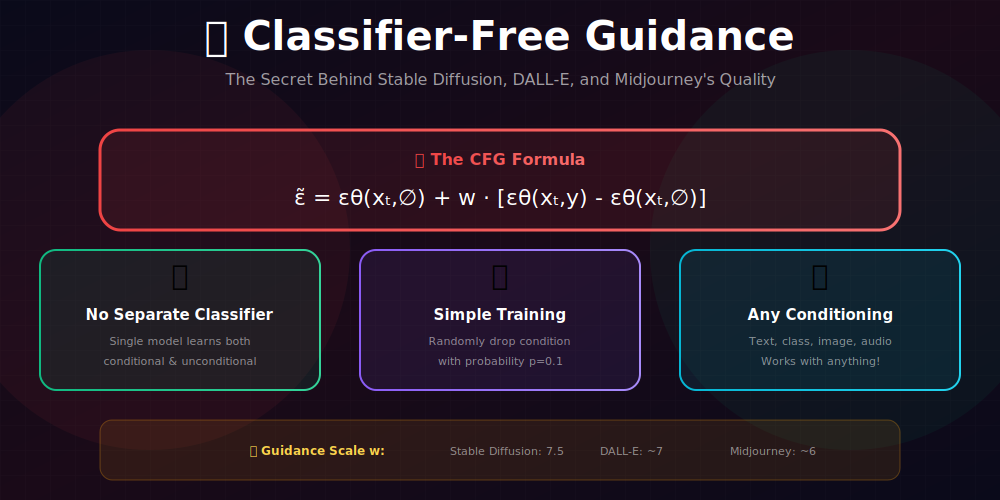
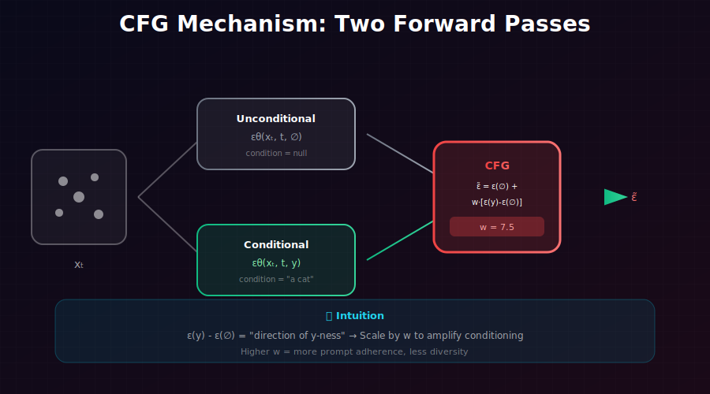
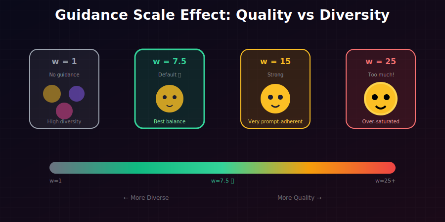

# 🆓 Classifier-Free Guidance (CFG)

<div align="center">



*The secret behind Stable Diffusion, DALL-E, and Midjourney's quality*

</div>

---

## 🖼️ Visual Overview

<div align="center">

### CFG Mechanism


### Guidance Scale Effect


</div>

---

[](#)
[](#)
[](#)

</div>

---

## 🎯 Where & Why Use CFG?

<table>
<tr>
<th width="30%">Where It's Used</th>
<th width="35%">Why It Matters</th>
<th width="35%">Real Applications</th>
</tr>
<tr>
<td><b>🖼️ Text-to-Image</b></td>
<td>Controls prompt adherence vs diversity</td>
<td>Stable Diffusion, DALL-E 2/3, Midjourney</td>
</tr>
<tr>
<td><b>🎬 Text-to-Video</b></td>
<td>Maintains consistency with prompts</td>
<td>Runway Gen-2, Pika, Sora</td>
</tr>
<tr>
<td><b>🔊 Text-to-Audio</b></td>
<td>Ensures audio matches description</td>
<td>AudioLDM, MusicGen</td>
</tr>
<tr>
<td><b>🎛️ Any Conditional Diffusion</b></td>
<td>Works with any conditioning type</td>
<td>ControlNet, Image editing, Inpainting</td>
</tr>
</table>

### 💡 Why CFG is Revolutionary

> *"Classifier-free guidance eliminates the need for a separate classifier while providing even better control. It's used in virtually every production diffusion system today."*

**CFG vs Classifier Guidance:**

| Aspect | Classifier Guidance | CFG |
|--------|--------------------|----|
| **Extra model** | ✅ Need classifier | ❌ No extra model |
| **Training** | Train classifier separately | Joint training |
| **Flexibility** | Class labels | Any conditioning |
| **Quality** | Good | **Better** |

---

## 📖 The Core Idea

### Training: Random Conditioning Dropout

During training, randomly drop the conditioning with probability $p_{uncond}$:

```python
def train_step(model, x_0, condition, p_uncond=0.1):
    # Randomly drop conditioning
    if random.random() < p_uncond:
        condition = null_token  # Empty/null condition
    
    # Standard diffusion training
    t = sample_timestep()
    noise = torch.randn_like(x_0)
    x_t = q_sample(x_0, t, noise)
    
    # Predict noise with condition
    eps_pred = model(x_t, t, condition)
    loss = F.mse_loss(eps_pred, noise)
    return loss
```

**Result:** One model learns both conditional AND unconditional generation!

### Inference: Mathematical Derivation

**Goal:** Sample from $p_w(x|y) \propto p(x|y)^w / p(x)^{w-1}$ without a classifier.

**Step 1: Score of the guided distribution**
$$\nabla_x \log p_w(x|y) = w \nabla_x \log p(x|y) - (w-1) \nabla_x \log p(x)$$

**Step 2: Rearrange using conditional definition**
$$= w \nabla_x \log p(x|y) - w \nabla_x \log p(x) + \nabla_x \log p(x)$$
$$= \nabla_x \log p(x) + w[\nabla_x \log p(x|y) - \nabla_x \log p(x)]$$

**Step 3: Convert to noise prediction**

Using $s(x,t) = -\epsilon(x,t)/\sqrt{1-\bar{\alpha}_t}$:

$$\tilde{\epsilon}_w = \epsilon_\theta(x_t, t, \emptyset) + w \cdot [\epsilon_\theta(x_t, t, y) - \epsilon_\theta(x_t, t, \emptyset)]$$

**Final CFG formula:**
$$\boxed{\tilde{\epsilon}_\theta(x_t, t, y) = \epsilon_\theta(x_t, t, \emptyset) + w \cdot [\epsilon_\theta(x_t, t, y) - \epsilon_\theta(x_t, t, \emptyset)]}$$

**Equivalent forms:**
$$\tilde{\epsilon}_\theta = (1 - w) \cdot \epsilon_\theta(x_t, t, \emptyset) + w \cdot \epsilon_\theta(x_t, t, y)$$
$$\tilde{\epsilon}_\theta = \epsilon_\theta(x_t, t, y) + (w-1) \cdot [\epsilon_\theta(x_t, t, y) - \epsilon_\theta(x_t, t, \emptyset)]$$

---

### Geometric Intuition

Consider the noise predictions as vectors:

$$\vec{\epsilon}_y = \epsilon_\theta(x_t, t, y) \quad \text{(conditional direction)}$$
$$\vec{\epsilon}_\emptyset = \epsilon_\theta(x_t, t, \emptyset) \quad \text{(unconditional direction)}$$

**The difference vector:**
$$\vec{\Delta} = \vec{\epsilon}_y - \vec{\epsilon}_\emptyset = \text{"direction of y-ness"}$$

**CFG output:**
$$\tilde{\vec{\epsilon}} = \vec{\epsilon}_\emptyset + w \cdot \vec{\Delta}$$

| $w$ | Effect | Geometric Interpretation |
|-----|--------|-------------------------|
| 0 | Pure unconditional | Stay at $\vec{\epsilon}_\emptyset$ |
| 1 | Standard conditional | Move to $\vec{\epsilon}_y$ |
| $w > 1$ | **Extrapolation** | Overshoot past $\vec{\epsilon}_y$ |

**Visualization:**
```
        ε_∅           ε_y           w·Δ (w>1)
         •────────────•─────────────→•
     unconditional  conditional   CFG output
```

---

### Implied Distribution Analysis

**Theorem:** CFG with scale $w$ samples from:

$$\boxed{\tilde{p}_w(x|y) \propto \frac{p(x|y)^w}{p(x)^{w-1}} = p(x) \cdot \left(\frac{p(x|y)}{p(x)}\right)^w}$$

<details>
<summary><b>Full Derivation</b></summary>

**CFG score:**
$$\tilde{s}_w(x,y) = s(x) + w \cdot [s(x,y) - s(x)]$$
$$= (1-w)s(x) + w \cdot s(x,y)$$
$$= (1-w)\nabla_x \log p(x) + w \nabla_x \log p(x|y)$$
$$= \nabla_x [(1-w)\log p(x) + w \log p(x|y)]$$
$$= \nabla_x \log [p(x)^{1-w} \cdot p(x|y)^w]$$

**Therefore:**
$$\tilde{p}_w(x|y) \propto p(x)^{1-w} \cdot p(x|y)^w$$

**Rewriting:**
$$= p(x) \cdot p(x)^{-w} \cdot p(x|y)^w = p(x) \cdot \left(\frac{p(x|y)}{p(x)}\right)^w$$

**Using $p(x|y)/p(x) = p(y|x)/p(y)$:**
$$= p(x) \cdot \left(\frac{p(y|x)}{p(y)}\right)^w \propto p(x) \cdot p(y|x)^w$$

</details>

**Interpretation:**
- Base distribution: $p(x)$ (unconditional)
- Reweighted by: $\left(\frac{p(x|y)}{p(x)}\right)^w$ = likelihood ratio raised to power $w$
- Higher $w$ → more weight on samples where $p(x|y) \gg p(x)$

---

## 🎚️ The Guidance Scale

### What $w$ Does

| $w$ | Effect | Best For |
|-----|--------|----------|
| 0 | Pure unconditional | Testing, debugging |
| 1 | Standard conditional (no guidance) | Maximum diversity |
| 3-5 | Light guidance | Creative exploration |
| **7-8** | **Typical default** | **Balanced quality/diversity** |
| 10-15 | Strong guidance | Maximum prompt adherence |
| 20+ | Over-saturated | Usually too much |

### Visual Effect

```
w = 1:  "a cat sitting on a chair"
        → diverse cats, diverse chairs, sometimes wrong

w = 7.5: "a cat sitting on a chair"  [Stable Diffusion default]
        → clear cat, clear chair, good composition

w = 15: "a cat sitting on a chair"
        → very saturated colors, exaggerated features
```

### Guidance Scale in Popular Models

| Model | Default $w$ | Typical Range |
|-------|------------|---------------|
| Stable Diffusion | 7.5 | 5-15 |
| DALL-E 2 | ~7 | 5-10 |
| Midjourney | ~6 | 3-10 |
| Imagen | ~7.5 | 5-15 |

---

## 💻 Implementation

### Training

```python
class CFGDiffusionModel(nn.Module):
    """Diffusion model with classifier-free guidance support."""
    
    def __init__(self, unet, null_token_dim):
        super().__init__()
        self.unet = unet
        # Learnable null token for unconditional generation
        self.null_token = nn.Parameter(torch.randn(1, null_token_dim))
    
    def forward(self, x_t, t, condition=None):
        """Forward pass with optional conditioning."""
        if condition is None:
            condition = self.null_token.expand(x_t.shape[0], -1)
        return self.unet(x_t, t, condition)


def train_cfg(model, dataloader, p_uncond=0.1, epochs=100):
    """Train with classifier-free guidance."""
    optimizer = torch.optim.AdamW(model.parameters(), lr=1e-4)
    
    for epoch in range(epochs):
        for x_0, condition in dataloader:
            optimizer.zero_grad()
            
            # Random conditioning dropout
            mask = torch.rand(x_0.shape[0]) < p_uncond
            condition_input = condition.clone()
            condition_input[mask] = model.null_token.expand(mask.sum(), -1)
            
            # Standard diffusion training
            t = torch.randint(0, T, (x_0.shape[0],))
            noise = torch.randn_like(x_0)
            x_t = q_sample(x_0, t, noise)
            
            eps_pred = model(x_t, t, condition_input)
            loss = F.mse_loss(eps_pred, noise)
            
            loss.backward()
            optimizer.step()
```

### Sampling

```python
@torch.no_grad()
def cfg_sample(model, shape, condition, guidance_scale=7.5, T=1000):
    """
    Sample with classifier-free guidance.
    
    Args:
        model: Trained CFG diffusion model
        shape: Output shape [batch, C, H, W]
        condition: Conditioning (e.g., text embeddings)
        guidance_scale: CFG scale (w)
        T: Number of timesteps
    """
    device = next(model.parameters()).device
    x = torch.randn(shape, device=device)
    
    # Get null token for unconditional
    null_cond = model.null_token.expand(shape[0], -1)
    
    for t in reversed(range(T)):
        t_batch = torch.full((shape[0],), t, device=device, dtype=torch.long)
        
        # ============ KEY: Two forward passes ============
        # Unconditional prediction
        eps_uncond = model(x, t_batch, null_cond)
        
        # Conditional prediction
        eps_cond = model(x, t_batch, condition)
        
        # CFG combination
        eps = eps_uncond + guidance_scale * (eps_cond - eps_uncond)
        # =================================================
        
        # Standard DDPM step
        x = ddpm_step(x, t, eps, ...)
    
    return x
```

### Efficient Batched Implementation

```python
@torch.no_grad()
def cfg_sample_batched(model, shape, condition, guidance_scale=7.5, T=1000):
    """
    Efficient CFG sampling with single forward pass per step.
    
    Doubles batch size to compute both predictions simultaneously.
    """
    device = next(model.parameters()).device
    x = torch.randn(shape, device=device)
    null_cond = model.null_token.expand(shape[0], -1)
    
    for t in reversed(range(T)):
        t_batch = torch.full((shape[0],), t, device=device, dtype=torch.long)
        
        # Stack inputs for single forward pass
        x_double = torch.cat([x, x], dim=0)
        t_double = torch.cat([t_batch, t_batch], dim=0)
        cond_double = torch.cat([null_cond, condition], dim=0)
        
        # Single forward pass
        eps_both = model(x_double, t_double, cond_double)
        eps_uncond, eps_cond = eps_both.chunk(2, dim=0)
        
        # CFG combination
        eps = eps_uncond + guidance_scale * (eps_cond - eps_uncond)
        
        x = ddpm_step(x, t, eps, ...)
    
    return x
```

---

## 🎨 Advanced Techniques

### 1. Negative Prompts

Guide **away** from undesired content:

$$\tilde{\epsilon} = \epsilon_{null} + w_{pos}(\epsilon_{pos} - \epsilon_{null}) - w_{neg}(\epsilon_{neg} - \epsilon_{null})$$

```python
def cfg_with_negative(model, x, t, pos_cond, neg_cond, w_pos=7.5, w_neg=1.0):
    """CFG with negative prompt."""
    eps_null = model(x, t, null_cond)
    eps_pos = model(x, t, pos_cond)
    eps_neg = model(x, t, neg_cond)
    
    eps = eps_null + w_pos * (eps_pos - eps_null) - w_neg * (eps_neg - eps_null)
    return eps
```

**Common negative prompts:**
- "blurry, low quality, distorted"
- "extra limbs, bad anatomy"
- "watermark, signature"

### 2. Dynamic Guidance

Vary $w$ across timesteps:

```python
def dynamic_guidance_scale(t, T, w_start=15.0, w_end=5.0):
    """Higher guidance early, lower late."""
    progress = 1 - (t / T)  # 0 at start, 1 at end
    return w_start + (w_end - w_start) * progress
```

**Intuition:** Strong guidance early establishes structure; lower guidance late preserves details.

### 3. Compositional Guidance

Combine multiple conditions:

$$\tilde{\epsilon} = \epsilon_\emptyset + \sum_i w_i(\epsilon_{y_i} - \epsilon_\emptyset)$$

```python
def compositional_cfg(model, x, t, conditions, weights):
    """Combine multiple conditions."""
    eps_null = model(x, t, null_cond)
    
    eps = eps_null.clone()
    for cond, w in zip(conditions, weights):
        eps_cond = model(x, t, cond)
        eps = eps + w * (eps_cond - eps_null)
    
    return eps
```

---

## 📊 Quality-Diversity Tradeoff

### Metrics vs Guidance Scale

**As $w$ increases:**
- ✅ FID improves initially (better quality)
- ✅ CLIP score increases (better prompt alignment)
- ❌ Diversity decreases (measured by LPIPS between samples)
- ❌ Too high: FID worsens (over-saturation)

### Pareto Frontier

```
Quality (FID↓, CLIP↑)
        │
    ●───●───●───●───●  ← Pareto frontier
        │           w=15
        │     w=7.5
        │  w=3
        │w=1
        └────────────── Diversity (LPIPS↑)
```

### Choosing $w$

| Use Case | Recommended $w$ |
|----------|-----------------|
| Artistic exploration | 3-5 |
| General use | 7-8 |
| Precise prompts | 10-12 |
| Specific styles | 12-15 |

---

## 📊 Key Equations Summary

| Concept | Formula |
|---------|---------|
| CFG formula | $\tilde{\epsilon} = \epsilon_\emptyset + w(\epsilon_y - \epsilon_\emptyset)$ |
| Alternative form | $\tilde{\epsilon} = (1-w)\epsilon_\emptyset + w\epsilon_y$ |
| With negative | $\tilde{\epsilon} = \epsilon_\emptyset + w_{pos}(\epsilon_{pos} - \epsilon_\emptyset) - w_{neg}(\epsilon_{neg} - \epsilon_\emptyset)$ |
| Implied distribution | $p_w(x\|y) \propto p(x\|y)^w / p(x)^{w-1}$ |

---

## 📚 References

1. **Ho, J., & Salimans, T.** (2022). "Classifier-Free Diffusion Guidance." *NeurIPS Workshop*. [arXiv:2207.12598](https://arxiv.org/abs/2207.12598)

2. **Rombach, R., et al.** (2022). "High-Resolution Image Synthesis with Latent Diffusion Models." *CVPR*. [arXiv:2112.10752](https://arxiv.org/abs/2112.10752)

3. **Saharia, C., et al.** (2022). "Photorealistic Text-to-Image Diffusion Models with Deep Language Understanding." *NeurIPS*. [arXiv:2205.11487](https://arxiv.org/abs/2205.11487)

---

## ✏️ Exercises

1. **Implement** CFG for a class-conditional DDPM on CIFAR-10.

2. **Plot** FID and CLIP score vs guidance scale to find optimal $w$.

3. **Compare** samples at $w \in \{1, 5, 7.5, 10, 15, 20\}$ and describe differences.

4. **Implement** negative prompting and test on prompts with common artifacts.

5. **Measure** diversity (LPIPS between samples) vs guidance scale.

6. **Implement** dynamic guidance that decreases $w$ over timesteps.

---

<div align="center">

**[← Classifier Guidance](../05_classifier_guidance/)** | **[Next: Diffusion Evaluation →](../07_diffusion_evaluation/)**

</div>
