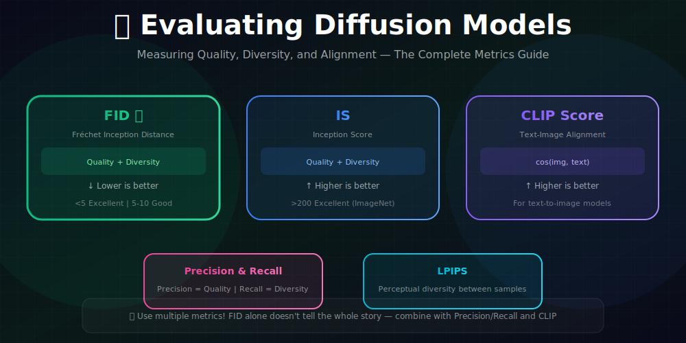
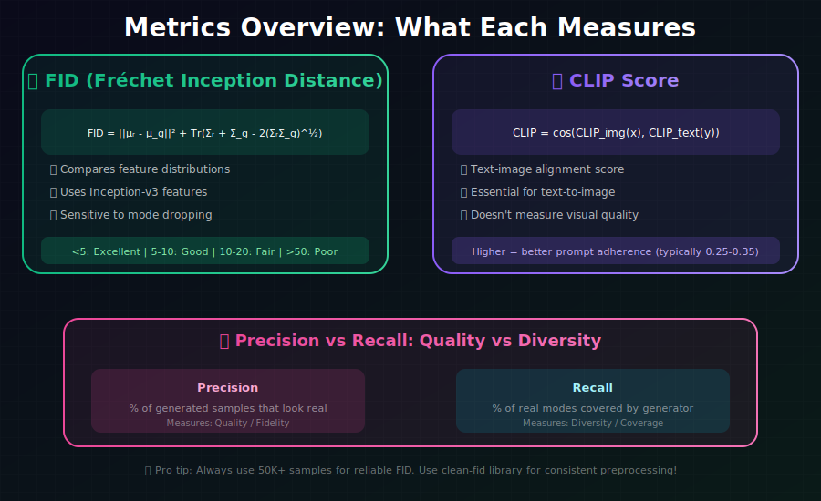

# 📊 Evaluating Diffusion Models

<div align="center">



*Measuring quality, diversity, and alignment in generative models*

</div>

---

## 🖼️ Visual Overview

<div align="center">

### Key Metrics at a Glance


</div>

---

[](#)
[](#)
[](#)

</div>

---

## 🎯 Where & Why Use Evaluation Metrics?

<table>
<tr>
<th width="30%">Where It's Used</th>
<th width="35%">Why It Matters</th>
<th width="35%">Real Applications</th>
</tr>
<tr>
<td><b>📈 Model Comparison</b></td>
<td>Objectively compare different models</td>
<td>Research papers, model selection</td>
</tr>
<tr>
<td><b>🔧 Hyperparameter Tuning</b></td>
<td>Measure impact of changes</td>
<td>Architecture search, training optimization</td>
</tr>
<tr>
<td><b>🏭 Production Monitoring</b></td>
<td>Track quality over time</td>
<td>A/B testing, deployment decisions</td>
</tr>
<tr>
<td><b>📊 Benchmarking</b></td>
<td>Establish baselines and progress</td>
<td>Leaderboards, SOTA claims</td>
</tr>
</table>

### 💡 Why Evaluation is Critical

> *"Without proper evaluation, you're flying blind. FID, IS, and CLIP score tell you different stories—you need all of them to understand your model's true performance."*

**The Evaluation Challenge:**
- Quality and diversity are **both** important
- Single metrics can be gamed
- Human perception doesn't always match metrics

---

## 📐 Quality Metrics: Mathematical Foundations

### 1. Fréchet Inception Distance (FID) ⭐

**The most widely used metric for image generation.**

#### Fréchet Distance Definition

The **Fréchet distance** (or Wasserstein-2 distance) between two Gaussians $\mathcal{N}(\mu_1, \Sigma_1)$ and $\mathcal{N}(\mu_2, \Sigma_2)$:

$$\boxed{d_F^2 = \|\mu_1 - \mu_2\|^2 + \text{Tr}\left(\Sigma_1 + \Sigma_2 - 2(\Sigma_1\Sigma_2)^{1/2}\right)}$$

<details>
<summary><b>Derivation of Fréchet Distance</b></summary>

**Wasserstein-2 distance:**
$$W_2^2(p, q) = \inf_{\gamma \in \Gamma(p,q)} \mathbb{E}_{(x,y) \sim \gamma}[\|x - y\|^2]$$

where $\Gamma(p,q)$ is the set of all couplings of $p$ and $q$.

**For Gaussians:** The optimal coupling is:
$$\gamma^* = \mathcal{N}\left(\begin{bmatrix}\mu_1 \\ \mu_2\end{bmatrix}, \begin{bmatrix}\Sigma_1 & C \\ C^T & \Sigma_2\end{bmatrix}\right)$$

where $C = \Sigma_1^{1/2}(\Sigma_1^{1/2}\Sigma_2\Sigma_1^{1/2})^{1/2}\Sigma_1^{-1/2}$.

**Computing the expected distance:**
$$W_2^2 = \mathbb{E}[\|x - y\|^2] = \mathbb{E}[\|x\|^2] + \mathbb{E}[\|y\|^2] - 2\mathbb{E}[x^T y]$$

$$= \text{Tr}(\Sigma_1) + \|\mu_1\|^2 + \text{Tr}(\Sigma_2) + \|\mu_2\|^2 - 2(\mu_1^T\mu_2 + \text{Tr}(C))$$

$$= \|\mu_1 - \mu_2\|^2 + \text{Tr}(\Sigma_1 + \Sigma_2 - 2C)$$

Using properties of matrix square roots:
$$\text{Tr}(C) = \text{Tr}((\Sigma_1\Sigma_2)^{1/2})$$

</details>

#### FID Formula

$$\boxed{\text{FID} = \|\mu_r - \mu_g\|^2 + \text{Tr}\left(\Sigma_r + \Sigma_g - 2(\Sigma_r\Sigma_g)^{1/2}\right)}$$

where:
- $(\mu_r, \Sigma_r)$ = mean and covariance of **real** image features
- $(\mu_g, \Sigma_g)$ = mean and covariance of **generated** image features
- Features from **Inception-v3** pool3 layer (2048-dim)

#### Mathematical Properties of FID

| Property | Formula/Statement |
|----------|-------------------|
| **Non-negativity** | $\text{FID} \geq 0$ |
| **Identity** | $\text{FID} = 0 \Leftrightarrow \mu_r = \mu_g$ and $\Sigma_r = \Sigma_g$ |
| **Triangle inequality** | $\text{FID}(p, r) \leq \text{FID}(p, q) + \text{FID}(q, r)$ |
| **Scale sensitivity** | Depends on Inception features |

#### Sample Complexity

**Theorem:** FID estimate variance scales as:
$$\text{Var}(\widehat{\text{FID}}) \approx O\left(\frac{d^2}{n}\right)$$

where $d$ = feature dimension (2048), $n$ = sample size.

**Rule of thumb:** Need $n \geq 10,000$ for reliable estimates, $n = 50,000$ standard.

**Interpretation:**
| FID Score | Quality Level |
|-----------|---------------|
| < 5 | Excellent |
| 5-10 | Very good |
| 10-20 | Good |
| 20-50 | Fair |
| > 50 | Poor |

**Implementation:**

```python
import torch
import numpy as np
from scipy import linalg
from torchvision.models import inception_v3

def compute_fid(real_images, gen_images, batch_size=64):
    """
    Compute FID between real and generated images.
    
    Args:
        real_images: Tensor of real images [N, 3, H, W]
        gen_images: Tensor of generated images [N, 3, H, W]
        batch_size: Batch size for feature extraction
    
    Returns:
        FID score (lower is better)
    """
    # Load Inception model
    inception = inception_v3(pretrained=True, transform_input=False)
    inception.fc = torch.nn.Identity()  # Remove classification head
    inception.eval()
    device = next(inception.parameters()).device
    
    def extract_features(images):
        features = []
        for i in range(0, len(images), batch_size):
            batch = images[i:i+batch_size].to(device)
            # Resize to 299x299 for Inception
            batch = torch.nn.functional.interpolate(batch, size=(299, 299))
            with torch.no_grad():
                feat = inception(batch)
            features.append(feat.cpu().numpy())
        return np.concatenate(features)
    
    # Extract features
    real_feat = extract_features(real_images)
    gen_feat = extract_features(gen_images)
    
    # Compute statistics
    mu_r = real_feat.mean(axis=0)
    mu_g = gen_feat.mean(axis=0)
    sigma_r = np.cov(real_feat, rowvar=False)
    sigma_g = np.cov(gen_feat, rowvar=False)
    
    # Compute FID
    diff = mu_r - mu_g
    covmean, _ = linalg.sqrtm(sigma_r @ sigma_g, disp=False)
    
    if np.iscomplexobj(covmean):
        covmean = covmean.real
    
    fid = diff @ diff + np.trace(sigma_r + sigma_g - 2 * covmean)
    return float(fid)
```

### 2. Inception Score (IS)

Measures quality AND diversity simultaneously:

$$\boxed{\text{IS} = \exp\left(\mathbb{E}_{x \sim p_g} [D_{KL}(p(y|x) \| p(y))]\right)}$$

#### Mathematical Decomposition

**Step 1: Expand the KL divergence**
$$D_{KL}(p(y|x) \| p(y)) = \sum_y p(y|x) \log \frac{p(y|x)}{p(y)}$$
$$= -H(y|x) + H(y)$$

where $H(y|x) = -\sum_y p(y|x) \log p(y|x)$ is the conditional entropy.

**Step 2: Average over generated samples**
$$\mathbb{E}_x[D_{KL}] = \mathbb{E}_x[H(y)] - \mathbb{E}_x[H(y|x)]$$
$$= H(y) - H(y|x)$$

since $H(y)$ doesn't depend on $x$.

**Step 3: Recognize as mutual information**
$$\mathbb{E}_x[D_{KL}] = I(y; x)$$

**Therefore:**
$$\boxed{\text{IS} = \exp(I(y; x)) = \exp(H(y) - H(y|x))}$$

#### What IS Measures

| Component | High Value Means | Quality Aspect |
|-----------|------------------|----------------|
| $H(y)$ | Diverse class predictions | **Diversity** |
| $-H(y\|x)$ | Confident predictions | **Quality** |
| $I(y;x)$ | Classes distinguish samples | **Both** |

**Maximum IS:** Achieved when $p(y|x)$ is one-hot (maximum quality) AND $p(y)$ is uniform (maximum diversity).

$$\text{IS}_{max} = \exp(\log K) = K$$

where $K$ = number of classes (1000 for ImageNet).

#### Limitations of IS

1. **Only measures class diversity:** Doesn't detect within-class variation
2. **Inception-specific:** Tied to ImageNet classes
3. **No reference:** Doesn't compare to real data

**Interpretation:**
| IS Score | Quality |
|----------|---------|
| > 200 | Excellent (ImageNet) |
| 100-200 | Very good |
| 50-100 | Good |
| < 50 | Fair |

```python
def compute_inception_score(images, batch_size=64, splits=10):
    """Compute Inception Score."""
    inception = inception_v3(pretrained=True)
    inception.eval()
    
    # Get predictions
    preds = []
    for i in range(0, len(images), batch_size):
        batch = images[i:i+batch_size]
        batch = torch.nn.functional.interpolate(batch, size=(299, 299))
        with torch.no_grad():
            pred = torch.softmax(inception(batch), dim=1)
        preds.append(pred.cpu().numpy())
    preds = np.concatenate(preds)
    
    # Compute IS
    scores = []
    for k in range(splits):
        part = preds[k::splits]
        py = part.mean(axis=0, keepdims=True)
        kl = part * (np.log(part + 1e-10) - np.log(py + 1e-10))
        kl = kl.sum(axis=1).mean()
        scores.append(np.exp(kl))
    
    return np.mean(scores), np.std(scores)
```

### 3. CLIP Score

Measures **text-image alignment** for conditional models.

#### Mathematical Definition

$$\boxed{\text{CLIP Score} = \mathbb{E}_{(x,c) \sim p_{gen}}\left[\frac{f_{img}(x) \cdot f_{text}(c)}{\|f_{img}(x)\| \cdot \|f_{text}(c)\|}\right]}$$

where:
- $f_{img}: \mathcal{X} \to \mathbb{R}^d$ = CLIP image encoder
- $f_{text}: \mathcal{T} \to \mathbb{R}^d$ = CLIP text encoder
- $d$ = embedding dimension (512 or 768)

#### Normalized Form

$$\text{CLIP Score} = \mathbb{E}\left[\cos(\theta_{img,text})\right]$$

where $\theta_{img,text}$ is the angle between image and text embeddings.

**Scaling:** Often multiplied by 100 for readability.

#### CLIP-FID Variant

Combines distribution matching with CLIP features:

$$\text{CLIP-FID} = \text{FID}(f_{img}(X_r), f_{img}(X_g))$$

using CLIP features instead of Inception features.

#### Properties

| Property | Value/Meaning |
|----------|---------------|
| **Range** | [-1, 1] (or [0, 100] scaled) |
| **Higher is better** | More alignment with text |
| **Typical good values** | 25-35 (scaled) |
| **Maximum theoretical** | 100 (perfect alignment) |

```python
import clip

def compute_clip_score(images, prompts, device='cuda'):
    """Compute CLIP score for image-text alignment."""
    model, preprocess = clip.load("ViT-B/32", device=device)
    
    scores = []
    for img, prompt in zip(images, prompts):
        # Preprocess image
        img_input = preprocess(img).unsqueeze(0).to(device)
        text_input = clip.tokenize([prompt]).to(device)
        
        with torch.no_grad():
            img_features = model.encode_image(img_input)
            text_features = model.encode_text(text_input)
            
            # Normalize
            img_features = img_features / img_features.norm(dim=-1, keepdim=True)
            text_features = text_features / text_features.norm(dim=-1, keepdim=True)
            
            similarity = (img_features @ text_features.T).item()
        scores.append(similarity)
    
    return np.mean(scores) * 100  # Scale to 0-100
```

---

## 📊 Diversity Metrics: Mathematical Definitions

### Precision and Recall (Kynkäänniemi et al., 2019)

**Separates quality from diversity using manifold estimation.**

#### Manifold Approximation

**Key idea:** Approximate the data manifold using k-nearest neighbors.

For a set of features $\{x_1, \ldots, x_n\}$, define the **manifold** as:
$$M = \bigcup_{i=1}^n B(x_i, r_i)$$

where $B(x_i, r_i)$ is a ball centered at $x_i$ with radius $r_i$ = distance to k-th nearest neighbor.

#### Precision Definition

$$\boxed{\text{Precision} = \frac{1}{|G|}\sum_{g \in G} \mathbf{1}[g \in M_R]}$$

where:
- $G$ = generated samples
- $M_R$ = manifold of real samples
- $\mathbf{1}[\cdot]$ = indicator function

**Interpretation:** Fraction of generated samples that lie within the real data manifold.

#### Recall Definition

$$\boxed{\text{Recall} = \frac{1}{|R|}\sum_{r \in R} \mathbf{1}[r \in M_G]}$$

where:
- $R$ = real samples
- $M_G$ = manifold of generated samples

**Interpretation:** Fraction of real samples covered by the generated data manifold.

#### Relationship to FID

| Metric | High Precision | High Recall |
|--------|---------------|-------------|
| **FID** | ↓ (helps) | ↓ (helps) |
| **Mode Collapse** | ✓ possible | ✗ detected |
| **Low Quality** | ✗ detected | ✓ possible |

**FID conflates precision and recall.** High precision + low recall (mode collapse) can have similar FID to moderate precision + moderate recall.

| Metric | Measures | Formula |
|--------|----------|---------|
| **Precision** | Quality | Fraction of generated in real manifold |
| **Recall** | Diversity | Fraction of real covered by generated |

```python
from sklearn.neighbors import NearestNeighbors

def compute_precision_recall(real_features, gen_features, k=3):
    """Compute precision and recall using k-NN manifolds."""
    
    # Fit k-NN on each set
    nn_real = NearestNeighbors(n_neighbors=k).fit(real_features)
    nn_gen = NearestNeighbors(n_neighbors=k).fit(gen_features)
    
    # Get k-th neighbor distances (manifold radii)
    dist_real, _ = nn_real.kneighbors(real_features)
    radii_real = dist_real[:, -1]
    
    dist_gen, _ = nn_gen.kneighbors(gen_features)
    radii_gen = dist_gen[:, -1]
    
    # Precision: generated samples in real manifold
    dist_gen_to_real, _ = nn_real.kneighbors(gen_features)
    precision = (dist_gen_to_real[:, 0] <= np.median(radii_real)).mean()
    
    # Recall: real samples in generated manifold
    dist_real_to_gen, _ = nn_gen.kneighbors(real_features)
    recall = (dist_real_to_gen[:, 0] <= np.median(radii_gen)).mean()
    
    return precision, recall
```

### LPIPS (Learned Perceptual Image Patch Similarity)

Measures **perceptual diversity** between samples:

```python
import lpips

def compute_sample_diversity(samples, num_pairs=1000):
    """Compute diversity using LPIPS between random pairs."""
    lpips_model = lpips.LPIPS(net='alex')
    
    distances = []
    for _ in range(num_pairs):
        i, j = np.random.choice(len(samples), 2, replace=False)
        dist = lpips_model(samples[i:i+1], samples[j:j+1])
        distances.append(dist.item())
    
    return np.mean(distances)  # Higher = more diverse
```

---

## ⚡ Efficiency Metrics

### Sampling Speed

```python
import time

def measure_sampling_speed(model, batch_size=16, num_batches=10, shape=(3, 256, 256)):
    """Measure sampling throughput."""
    times = []
    
    for _ in range(num_batches):
        torch.cuda.synchronize()
        start = time.time()
        
        _ = model.sample((batch_size, *shape))
        
        torch.cuda.synchronize()
        times.append(time.time() - start)
    
    avg_time = np.mean(times)
    return {
        'seconds_per_batch': avg_time,
        'seconds_per_image': avg_time / batch_size,
        'images_per_second': batch_size / avg_time,
    }
```

### Quality vs Speed Tradeoff

| Method | Steps | FID | Time (s) |
|--------|-------|-----|----------|
| DDPM | 1000 | 3.17 | 45 |
| DDIM-100 | 100 | 4.16 | 4.5 |
| DDIM-50 | 50 | 4.67 | 2.3 |
| DDIM-20 | 20 | 6.84 | 0.9 |

---

## 📋 Evaluation Protocol

### Standard Settings

| Parameter | Value | Reason |
|-----------|-------|--------|
| **Sample count** | 50,000 | Statistical reliability |
| **Reference set** | Full train/val or 50K | Match distribution |
| **Image size** | 299×299 | Inception input |
| **Random seeds** | Multiple, report mean±std | Reproducibility |

### Common Pitfalls

| Mistake | Problem | Solution |
|---------|---------|----------|
| Too few samples | Unreliable FID | Use 50K+ samples |
| Wrong preprocessing | Inconsistent results | Use clean-fid library |
| Different Inception | Can't compare | Use standard weights |
| Single seed | Variance unknown | Report std over seeds |

### Recommended: clean-fid

```python
from cleanfid import fid

# Compute FID with consistent preprocessing
score = fid.compute_fid(
    'path/to/generated/',
    'path/to/real/',
    mode='clean',  # Consistent preprocessing
    num_workers=4
)
```

---

## 📈 Benchmark Results

### CIFAR-10 (Unconditional)

| Model | FID ↓ | IS ↑ | Year |
|-------|-------|------|------|
| DDPM | 3.17 | 9.46 | 2020 |
| Score SDE | 2.20 | 9.89 | 2021 |
| EDM | **1.97** | **10.02** | 2022 |

### ImageNet 256×256 (Class-Conditional)

| Model | FID ↓ | Steps | Year |
|-------|-------|-------|------|
| BigGAN-deep | 6.95 | 1 | 2019 |
| ADM-G | 4.59 | 250 | 2021 |
| LDM | 3.60 | 200 | 2022 |
| DiT-XL/2 | **2.27** | 250 | 2023 |

---

## 📊 Key Metrics Summary

| Metric | Measures | Direction | Use Case |
|--------|----------|-----------|----------|
| **FID** | Quality + Diversity | Lower ↓ | Overall comparison |
| **IS** | Quality + Diversity | Higher ↑ | Class-conditional |
| **Precision** | Quality | Higher ↑ | Fidelity focus |
| **Recall** | Diversity | Higher ↑ | Coverage focus |
| **CLIP Score** | Text alignment | Higher ↑ | Text-to-image |
| **LPIPS** | Sample diversity | Higher ↑ | Diversity analysis |

---

## 📚 References

1. **Heusel, M., et al.** (2017). "GANs Trained by a Two Time-Scale Update Rule Converge to a Local Nash Equilibrium." *NeurIPS*. [arXiv:1706.08500](https://arxiv.org/abs/1706.08500)

2. **Salimans, T., et al.** (2016). "Improved Techniques for Training GANs." *NeurIPS*. [arXiv:1606.03498](https://arxiv.org/abs/1606.03498)

3. **Kynkäänniemi, T., et al.** (2019). "Improved Precision and Recall Metric for Assessing Generative Models." *NeurIPS*. [arXiv:1904.06991](https://arxiv.org/abs/1904.06991)

4. **Parmar, G., et al.** (2021). "On Aliased Resizing and Surprising Subtleties in GAN Evaluation." *CVPR*. [arXiv:2104.11222](https://arxiv.org/abs/2104.11222)

---

## ✏️ Exercises

1. **Compute** FID and IS for a pre-trained diffusion model on CIFAR-10.

2. **Plot** precision-recall at different CFG guidance scales.

3. **Measure** FID vs sampling steps tradeoff for DDIM.

4. **Compare** FID using different Inception model versions—how much does it vary?

5. **Implement** CLIP score evaluation for a text-to-image model.

6. **Design** a human evaluation study to compare metrics with human preference.

---

<div align="center">

**Congratulations!** 🎉

*You've completed the Diffusion Models learning path!*

**[← Back to Main](../)**

</div>
