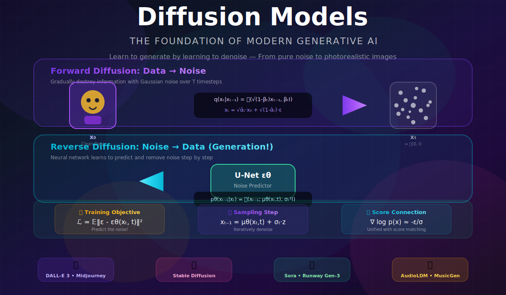
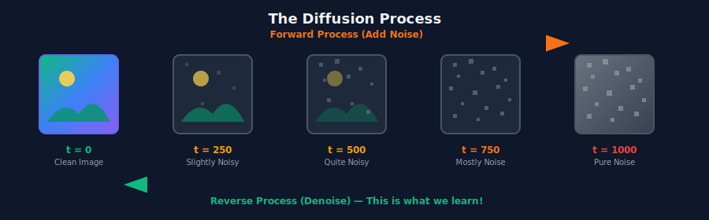
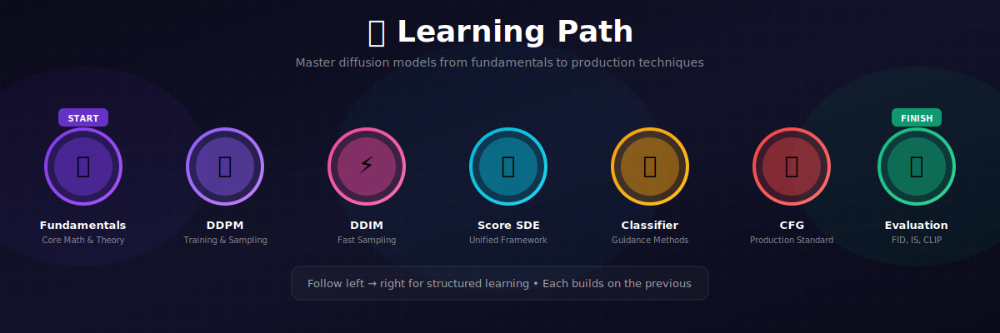
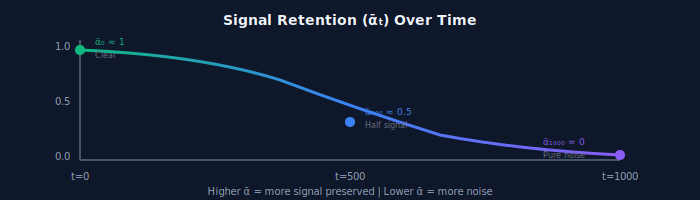

# 🎲 Diffusion Models

<div align="center">



<br/>

### ✨ *The Art of Learning to Denoise* ✨

<br/>

[](#)
[](#)
[](#)

---

*"In the beginning, there was noise. And the model said, 'Let there be images.'"*

</div>

---

## 🎬 The Beautiful Paradox

> **Here's a wild idea:** What if the best way to learn how to *create* is to learn how to *repair*?

Think about it. A master restorer at the Louvre doesn't start by painting masterpieces. They start by understanding damage — how paint cracks, how colors fade, how canvas degrades. Then they learn to reverse it.

**Diffusion models work exactly the same way.**

<div align="center">



</div>

---

## 💡 The Core Insight

<div align="center">

### 💫 *"Don't learn to generate. Learn to denoise. They're secretly the same thing."* 💫

</div>

<table>
<tr>
<td width="50%" style="vertical-align: top">

### ❌ The Hard Way
Learning to generate images directly:
- Map random noise to complex images
- One-shot transformation
- Easy to get wrong, hard to debug
- Mode collapse, training instability

</td>
<td width="50%" style="vertical-align: top">

### ✅ The Diffusion Way
Learning to remove a tiny bit of noise:
- Much simpler task
- Can verify each step
- Extremely stable training
- State-of-the-art results

</td>
</tr>
</table>

---

## 🌍 Where Diffusion Models Shine

> *From Hollywood studios to pharmaceutical labs, diffusion is everywhere.*

<table>
<tr>
<th width="20%">Domain</th>
<th width="35%">Why Diffusion Wins</th>
<th width="45%">Notable Examples</th>
</tr>
<tr>
<td>

### 🖼️ 
**Image Generation**

</td>
<td>

Unmatched quality + diversity. No mode collapse. Beautiful failure modes.

</td>
<td>

**DALL-E 3** • **Midjourney** • **Stable Diffusion**

*The entire AI art revolution runs on diffusion.*

</td>
</tr>
<tr>
<td>

### 🎨 
**Image Editing**

</td>
<td>

Natural inpainting. Semantic understanding. Preserves context.

</td>
<td>

**Adobe Firefly** • **Photoshop Generative Fill**

*"Remove the person" → Photorealistic results*

</td>
</tr>
<tr>
<td>

### 🎬 
**Video**

</td>
<td>

Temporal coherence through 3D diffusion. Consistent characters and physics.

</td>
<td>

**Sora** • **Runway Gen-3** • **Pika Labs**

*Generate consistent 60-second videos*

</td>
</tr>
<tr>
<td>

### 🔊 
**Audio**

</td>
<td>

High-fidelity waveforms. Natural prosody in speech.

</td>
<td>

**AudioLDM** • **Riffusion** • **MusicGen**

*Type a description, get a song*

</td>
</tr>
<tr>
<td>

### 🧬 
**Science**

</td>
<td>

Sample from complex molecular distributions. SE(3)-equivariant.

</td>
<td>

**AlphaFold-style** protein design • **Drug discovery**

*Design molecules with desired properties*

</td>
</tr>
<tr>
<td>

### 📐 
**3D**

</td>
<td>

Multi-view consistency. NeRF integration.

</td>
<td>

**DreamFusion** • **Magic3D** • **Point-E**

*Text to 3D models*

</td>
</tr>
</table>

---

## ⚔️ The Showdown: Diffusion vs GANs

> *For years, GANs ruled generative modeling. Then diffusion came along...*

<table>
<tr>
<th width="25%">Aspect</th>
<th width="35%">Diffusion Models 🎲</th>
<th width="40%">GANs ⚔️</th>
</tr>
<tr>
<td><b>Mode Coverage</b></td>
<td>✅ <b>Excellent</b> — sees all the data</td>
<td>❌ Mode collapse — "forgets" rare examples</td>
</tr>
<tr>
<td><b>Training Stability</b></td>
<td>✅ <b>Rock solid</b> — just MSE loss</td>
<td>❌ Notoriously unstable — delicate balance</td>
</tr>
<tr>
<td><b>Sample Diversity</b></td>
<td>✅ <b>High</b> — stochastic generation</td>
<td>⚠️ Can be limited — generator may specialize</td>
</tr>
<tr>
<td><b>Sample Quality</b></td>
<td>✅ <b>SOTA</b> — FID scores keep dropping</td>
<td>✅ Sharp (when it works) — no blur</td>
</tr>
<tr>
<td><b>Sampling Speed</b></td>
<td>❌ <b>Slow</b> — many denoising steps</td>
<td>✅ <b>Fast</b> — single forward pass</td>
</tr>
<tr>
<td><b>Likelihood</b></td>
<td>⚠️ ELBO (lower bound)</td>
<td>❌ None — can't evaluate probability</td>
</tr>
</table>

<div align="center">

> 💭 *"GANs are sports cars — fast and flashy, but temperamental.*
> *Diffusion models are trains — slower, but they always get there."*

</div>

---

## 📚 The Diffusion Curriculum

<div align="center">



</div>

### Your Journey Through Diffusion

<table>
<tr>
<th width="5%">#</th>
<th width="18%">Topic</th>
<th width="32%">What You'll Learn</th>
<th width="45%">The Hook</th>
</tr>
<tr>
<td align="center">📐</td>
<td><b><a href="./01_diffusion_fundamentals/">Fundamentals</a></b></td>
<td>Forward process, reverse process, noise schedules</td>
<td><em>"The mathematics of controlled destruction — and resurrection."</em></td>
</tr>
<tr>
<td align="center">🎯</td>
<td><b><a href="./02_ddpm/">DDPM</a></b></td>
<td>The breakthrough paper, simplified loss, U-Net</td>
<td><em>"The paper that launched a thousand models."</em></td>
</tr>
<tr>
<td align="center">⚡</td>
<td><b><a href="./03_ddim/">DDIM</a></b></td>
<td>10-50× faster sampling, deterministic generation</td>
<td><em>"Same quality, fraction of the time. The speed hack."</em></td>
</tr>
<tr>
<td align="center">📈</td>
<td><b><a href="./04_score_based_diffusion/">Score-Based</a></b></td>
<td>Continuous time, SDEs, probability flow</td>
<td><em>"Zoom out: diffusion is just score matching in disguise."</em></td>
</tr>
<tr>
<td align="center">🎛️</td>
<td><b><a href="./05_classifier_guidance/">Classifier Guidance</a></b></td>
<td>Control generation with classifier gradients</td>
<td><em>"Want a 'cat'? Let a classifier point the way."</em></td>
</tr>
<tr>
<td align="center">🆓</td>
<td><b><a href="./06_classifier_free_guidance/">Classifier-Free</a></b></td>
<td>The technique behind DALL-E and Stable Diffusion</td>
<td><em>"Skip the classifier, keep the control. The production trick."</em></td>
</tr>
<tr>
<td align="center">📊</td>
<td><b><a href="./07_diffusion_evaluation/">Evaluation</a></b></td>
<td>FID, IS, CLIP score, precision/recall</td>
<td><em>"How do you measure a dream?"</em></td>
</tr>
</table>

---

## 🧮 The Mathematics (Made Beautiful)

### Act I: The Forward Process (Destruction)

We gradually corrupt data over $T$ timesteps. At each step, we add a little Gaussian noise:

$$q(x_t | x_{t-1}) = \mathcal{N}(x_t; \sqrt{1-\beta_t} \cdot x_{t-1}, \beta_t I)$$

<div align="center">

> 🎭 **The Interpretation:** "Shrink the image slightly, then add noise."

</div>

**The Magic Formula** — jump to any timestep directly:

$$\boxed{x_t = \sqrt{\bar{\alpha}_t} \cdot x_0 + \sqrt{1 - \bar{\alpha}_t} \cdot \epsilon, \quad \epsilon \sim \mathcal{N}(0, I)}$$

where $\bar{\alpha}_t = \prod_{s=1}^{t} (1 - \beta_s)$ is the cumulative signal retention.

<div align="center">



</div>

---

### Act II: The Reverse Process (Creation)

We learn a neural network to run this backward:

$$p_\theta(x_{t-1} | x_t) = \mathcal{N}(x_{t-1}; \mu_\theta(x_t, t), \Sigma_\theta(x_t, t))$$

<div align="center">

> 🎭 **The Interpretation:** "Look at noisy image, predict the slightly-less-noisy version."

</div>

**Ho et al.'s Insight:** Instead of predicting $\mu$ directly, predict the noise $\epsilon$!

$$\mu_\theta(x_t, t) = \frac{1}{\sqrt{\alpha_t}}\left(x_t - \frac{\beta_t}{\sqrt{1-\bar{\alpha}_t}} \epsilon_\theta(x_t, t)\right)$$

<div align="center">

> 💡 **Why this works:** If you know what noise was added, you can subtract it!

</div>

---

### Act III: The Training Objective (Elegance)

After all the math dust settles, we get this beautifully simple loss:

$$\boxed{\mathcal{L}_{simple} = \mathbb{E}_{t, x_0, \epsilon}\left[\|\epsilon - \epsilon_\theta(x_t, t)\|^2\right]}$$

<div align="center">

**That's it.** Sample an image, add random noise, predict the noise you added. MSE loss. Done.

</div>

---

### 🔧 The Training Loop (Surprisingly Simple)

```python
def train_diffusion_one_step(model, x_0, noise_schedule):
    """
    The entire training step for diffusion models.
    Beautiful in its simplicity.
    """
    # 1. Pick a random timestep
    t = torch.randint(0, T, (batch_size,))
    
    # 2. Sample random noise
    epsilon = torch.randn_like(x_0)  # The noise we'll add
    
    # 3. Create the noisy image (the forward process!)
    alpha_bar_t = noise_schedule.alpha_bar[t]
    x_t = sqrt(alpha_bar_t) * x_0 + sqrt(1 - alpha_bar_t) * epsilon
    
    # 4. Ask the model: "What noise do you see?"
    epsilon_predicted = model(x_t, t)
    
    # 5. Compare to the truth
    loss = F.mse_loss(epsilon_predicted, epsilon)
    
    return loss  # That's the whole thing!
```

---

### 🎨 The Sampling Loop (The Magic Happens)

```python
@torch.no_grad()
def generate_image(model, shape=(1, 3, 256, 256), T=1000):
    """
    Start from pure noise. End with an image.
    One step at a time.
    """
    # Begin with pure noise
    x = torch.randn(shape)  # Random static
    
    # Walk backward through time
    for t in reversed(range(T)):
        
        # Ask the model: "What noise do you see?"
        eps_pred = model(x, t)
        
        # Remove some of that noise
        alpha_t = alphas[t]
        alpha_bar_t = alpha_bars[t]
        beta_t = betas[t]
        
        mean = (1 / sqrt(alpha_t)) * (
            x - (beta_t / sqrt(1 - alpha_bar_t)) * eps_pred
        )
        
        # Add a tiny bit of fresh noise (except at the last step)
        if t > 0:
            noise = torch.randn_like(x)
            x = mean + sqrt(beta_t) * noise
        else:
            x = mean  # Final step: no noise added
    
    return x  # 🎉 An image emerges from the chaos!
```

---

## ⚡ The Speed Revolution: DDIM

> *1000 steps is slow. What if we could skip ahead?*

**DDIM** (Song et al., 2020) discovered something remarkable: you can jump multiple timesteps at once!

$$x_{t-1} = \sqrt{\bar{\alpha}_{t-1}} \underbrace{\left(\frac{x_t - \sqrt{1-\bar{\alpha}_t} \epsilon_\theta}{\sqrt{\bar{\alpha}_t}}\right)}_{\text{predicted } x_0} + \sqrt{1-\bar{\alpha}_{t-1}-\sigma_t^2} \cdot \epsilon_\theta + \sigma_t \epsilon$$

<div align="center">

| Method | Steps | Quality | Deterministic? |
|:------:|:-----:|:-------:|:--------------:|
| DDPM | 1000 | ⭐⭐⭐⭐⭐ | ❌ |
| DDIM | 50-100 | ⭐⭐⭐⭐ | ✅ |
| DDIM | 10-20 | ⭐⭐⭐ | ✅ |

> 💡 **Secret sauce:** Set $\sigma_t = 0$ and sampling becomes deterministic!

</div>

---

## 🎛️ The Control Revolution: Guidance

### Classifier Guidance (Dhariwal & Nichol, 2021)

*"Want a tiger? Let a tiger classifier show the way."*

$$\tilde{\epsilon}(x_t, t, y) = \epsilon_\theta(x_t, t) - s \cdot \sqrt{1-\bar{\alpha}_t} \nabla_{x_t} \log p(y|x_t)$$

### Classifier-Free Guidance (Ho & Salimans, 2022)

*"Even better: no classifier needed!"*

$$\boxed{\tilde{\epsilon}(x_t, t, y) = \epsilon_\theta(x_t, t, \emptyset) + s \cdot (\epsilon_\theta(x_t, t, y) - \epsilon_\theta(x_t, t, \emptyset))}$$

<div align="center">

| CFG Scale $s$ | Effect |
|:-------------:|--------|
| 1.0 | Normal conditional generation |
| 3.0 | Stronger adherence to prompt |
| **7.0-10.0** | **Sweet spot for text-to-image** |
| 15.0+ | Over-saturated, artifacts |

</div>

---

## 📈 The Noise Schedule: The Hidden Hero

<table>
<tr>
<th>Schedule</th>
<th>Formula</th>
<th>Character</th>
</tr>
<tr>
<td><b>Linear</b></td>
<td>$\beta_t = \beta_1 + \frac{t-1}{T-1}(\beta_T - \beta_1)$</td>
<td>The original. Simple. Gets the job done.</td>
</tr>
<tr>
<td><b>Cosine</b></td>
<td>$\bar{\alpha}_t = \frac{\cos^2(\frac{t/T + s}{1+s} \cdot \frac{\pi}{2})}{\cos^2(\frac{s}{1+s} \cdot \frac{\pi}{2})}$</td>
<td>Smoother. Better for smaller images. More popular now.</td>
</tr>
<tr>
<td><b>Sigmoid</b></td>
<td>Custom smooth transitions</td>
<td>The refined choice. Used in modern systems.</td>
</tr>
</table>

---

## 🏆 The Hall of Fame

> *A brief history of diffusion dominance.*

| Year | Milestone | What Changed |
|:----:|-----------|--------------|
| 2015 | **Deep Unsupervised Learning** | The theoretical foundation |
| 2020 | **DDPM** | *"Wait, this actually works really well!"* |
| 2020 | **DDIM** | Practical sampling speed |
| 2021 | **Score SDE** | Unified theory with score matching |
| 2021 | **Guided Diffusion** | Beat BigGAN. The turning point. |
| 2022 | **GLIDE / DALL-E 2** | Text-to-image goes mainstream |
| 2022 | **Stable Diffusion** | Open-source revolution |
| 2023 | **SDXL** | Production quality, open weights |
| 2024 | **SD3 / DALL-E 3** | Current SOTA |

---

## 📚 The Sacred Texts

<table>
<tr>
<th width="60%">Paper</th>
<th width="40%">Why It's Essential</th>
</tr>
<tr>
<td>

**Ho, Jain, & Abbeel** (2020)
*"Denoising Diffusion Probabilistic Models"*
[arXiv:2006.11239](https://arxiv.org/abs/2006.11239)

</td>
<td>

📖 **The Genesis Paper**
Everything starts here. Read this first.

</td>
</tr>
<tr>
<td>

**Song, Meng, & Ermon** (2020)
*"Denoising Diffusion Implicit Models"*
[arXiv:2010.02502](https://arxiv.org/abs/2010.02502)

</td>
<td>

⚡ **The Speed Breakthrough**
10-50× faster sampling.

</td>
</tr>
<tr>
<td>

**Dhariwal & Nichol** (2021)
*"Diffusion Models Beat GANs on Image Synthesis"*
[arXiv:2105.05233](https://arxiv.org/abs/2105.05233)

</td>
<td>

🏆 **The Coronation**
Diffusion becomes king.

</td>
</tr>
<tr>
<td>

**Ho & Salimans** (2022)
*"Classifier-Free Diffusion Guidance"*
[arXiv:2207.12598](https://arxiv.org/abs/2207.12598)

</td>
<td>

🎛️ **The Control Mechanism**
Powers all modern text-to-image.

</td>
</tr>
</table>

---

## ✏️ Exercises: Prove You Understand

<details>
<summary><b>🟢 Exercise 1:</b> Derive the closed-form forward process</summary>

**Task:** Starting from $q(x_t | x_{t-1}) = \mathcal{N}(x_t; \sqrt{1-\beta_t} x_{t-1}, \beta_t I)$, prove that:

$$q(x_t | x_0) = \mathcal{N}(x_t; \sqrt{\bar{\alpha}_t} x_0, (1-\bar{\alpha}_t) I)$$

**Hint:** Use the reparameterization trick recursively and combine Gaussians.

</details>

<details>
<summary><b>🟡 Exercise 2:</b> Implement DDPM on MNIST</summary>

**Task:** Build a minimal DDPM:
1. Simple U-Net (or even MLP for 28×28)
2. Linear noise schedule
3. 1000 timesteps

**Deliverable:** Generate recognizable digits from noise.

</details>

<details>
<summary><b>🟡 Exercise 3:</b> Compare noise schedules</summary>

**Task:** Train the same model with:
1. Linear schedule ($\beta_1 = 0.0001$, $\beta_T = 0.02$)
2. Cosine schedule

**Compare:** Training curves, sample quality at 10/50/100 steps.

</details>

<details>
<summary><b>🔴 Exercise 4:</b> Prove score-noise equivalence</summary>

**Task:** Show that:

$$\epsilon_\theta(x_t, t) = -\sqrt{1-\bar{\alpha}_t} \cdot \nabla_{x_t} \log p_t(x_t)$$

**Meaning:** Learning to predict noise IS learning the score function!

</details>

<details>
<summary><b>🔴 Exercise 5:</b> Implement classifier-free guidance</summary>

**Task:** 
1. Train conditional DDPM on CIFAR-10 with 10% label dropout
2. Implement CFG sampling
3. Plot quality vs. CFG scale

**Observation:** Find the sweet spot where quality peaks before saturation.

</details>

---

<div align="center">

## 🚀 Begin Your Diffusion Journey

<br/>

**Start with the foundations →** [Diffusion Fundamentals](./01_diffusion_fundamentals/)

*Understand exactly how and why noise schedules work*

<br/>

---

<br/>

> *"Every image you've ever seen was once just noise. Diffusion teaches us the path back."*

</div>
