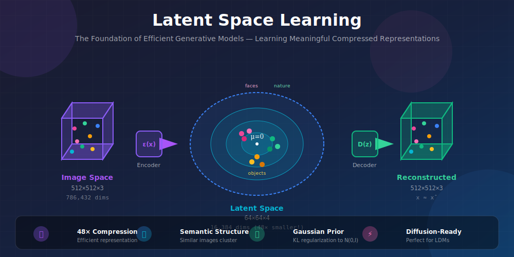
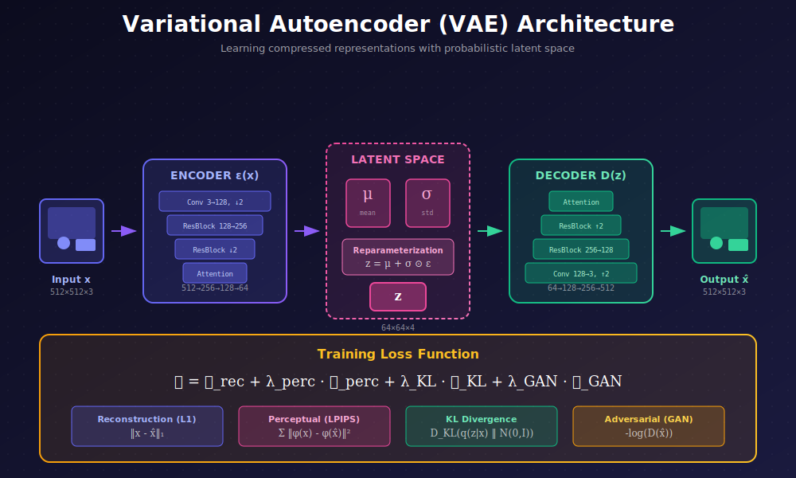
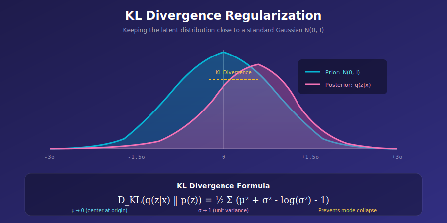

# 🎯 Latent Space Learning

<div align="center">



*The Foundation of Efficient Generative Models — Learning Meaningful Compressed Representations*

[](#)
[](#)
[](#)

</div>

---

## 🌟 Where & Why Use Latent Space Learning?

<table>
<tr>
<th width="20%">🎯 Application</th>
<th width="35%">💡 Why Latent Space?</th>
<th width="45%">🌍 Real-World Examples</th>
</tr>
<tr>
<td><b>Text-to-Image Generation</b></td>
<td>Enables high-res image synthesis without prohibitive compute costs</td>
<td>Stable Diffusion, DALL-E 2, Midjourney</td>
</tr>
<tr>
<td><b>Video Generation</b></td>
<td>Temporal compression + spatial compression for efficient video diffusion</td>
<td>Stable Video Diffusion, Sora, RunwayML</td>
</tr>
<tr>
<td><b>Image Editing</b></td>
<td>Semantic edits are easier in structured latent space</td>
<td>InstructPix2Pix, ControlNet</td>
</tr>
<tr>
<td><b>3D Generation</b></td>
<td>Multi-view consistency through shared latent representations</td>
<td>Zero123, DreamFusion</td>
</tr>
<tr>
<td><b>Audio Synthesis</b></td>
<td>Spectrograms compressed to latents for music/speech generation</td>
<td>AudioLDM, MusicGen</td>
</tr>
</table>

### 💡 The Core Insight

> **The Problem:** Running diffusion directly on high-resolution images (512×512×3 = 786,432 dimensions) is computationally expensive. Each denoising step requires processing nearly 800K values!
>
> **The Solution:** First compress images to a small latent space (64×64×4 = 16,384 dimensions), then run diffusion there. This is **48× more efficient** while preserving image quality!

---

## 📚 Introduction

Latent space learning is the **foundational technique** that made modern text-to-image models practical. Instead of operating directly on pixels, we learn a compressed representation that:

1. **Preserves semantic information** — shapes, objects, colors
2. **Discards imperceptible details** — high-frequency noise
3. **Enables efficient computation** — 48× fewer dimensions
4. **Provides structure** — similar images map to nearby points

<div align="center">



</div>

---

## 🧮 Mathematical Framework

### 1. The Autoencoder Formulation

An autoencoder consists of two neural networks:

**Encoder** $\mathcal{E}$: Compresses input to latent representation
$$z = \mathcal{E}(x), \quad \text{where } x \in \mathbb{R}^{H \times W \times 3}, \quad z \in \mathbb{R}^{h \times w \times c}$$

**Decoder** $\mathcal{D}$: Reconstructs input from latent
$$\hat{x} = \mathcal{D}(z), \quad \text{where } \hat{x} \approx x$$

### 2. Variational Autoencoder (VAE)

For latent diffusion, we use a **Variational Autoencoder** that outputs a distribution:

$$q_\phi(z|x) = \mathcal{N}(z; \mu_\phi(x), \sigma_\phi^2(x) \cdot I)$$

**Reparameterization Trick** (enables gradient flow):
$$z = \mu + \sigma \odot \epsilon, \quad \epsilon \sim \mathcal{N}(0, I)$$

---

## 📐 Deep Dive: Evidence Lower Bound (ELBO)

The VAE is derived from **variational inference**. We want to maximize the log-likelihood of our data:

$$\log p_\theta(x) = \log \int p_\theta(x|z) p(z) dz$$

This integral is intractable, so we derive the **ELBO**:

### Step-by-Step Derivation

**Step 1**: Introduce approximate posterior $q_\phi(z|x)$

$$\log p_\theta(x) = \log \int p_\theta(x|z) p(z) \frac{q_\phi(z|x)}{q_\phi(z|x)} dz$$

**Step 2**: Apply Jensen's inequality (since log is concave)

$$\log p_\theta(x) \geq \mathbb{E}_{q_\phi(z|x)}\left[\log \frac{p_\theta(x|z) p(z)}{q_\phi(z|x)}\right]$$

**Step 3**: Expand and rearrange

$$\log p_\theta(x) \geq \underbrace{\mathbb{E}_{q_\phi(z|x)}[\log p_\theta(x|z)]}_{\text{Reconstruction}} - \underbrace{D_{KL}(q_\phi(z|x) \| p(z))}_{\text{KL Regularization}}$$

This gives us the **Evidence Lower Bound (ELBO)**:

$$\boxed{\mathcal{L}_{ELBO} = \mathbb{E}_{z \sim q_\phi(z|x)}[\log p_\theta(x|z)] - D_{KL}(q_\phi(z|x) \| p(z))}$$

### The Tightness Gap

The gap between $\log p(x)$ and ELBO equals:

$$\log p_\theta(x) - \mathcal{L}_{ELBO} = D_{KL}(q_\phi(z|x) \| p_\theta(z|x)) \geq 0$$

When $q_\phi$ perfectly approximates the true posterior, ELBO equals the log-likelihood.

---

## 📊 KL Divergence: Complete Derivation

For two Gaussians, KL divergence has a closed form. Let:
- $q = \mathcal{N}(\mu, \sigma^2)$ (our encoder output)
- $p = \mathcal{N}(0, 1)$ (standard normal prior)

### Full Derivation

$$D_{KL}(q \| p) = \int q(z) \log \frac{q(z)}{p(z)} dz$$

**Step 1**: Write out the Gaussian PDFs

$$q(z) = \frac{1}{\sqrt{2\pi\sigma^2}} \exp\left(-\frac{(z-\mu)^2}{2\sigma^2}\right)$$

$$p(z) = \frac{1}{\sqrt{2\pi}} \exp\left(-\frac{z^2}{2}\right)$$

**Step 2**: Compute the log ratio

$$\log \frac{q(z)}{p(z)} = -\frac{1}{2}\log\sigma^2 - \frac{(z-\mu)^2}{2\sigma^2} + \frac{z^2}{2}$$

**Step 3**: Take expectation under $q(z)$

Using $\mathbb{E}_q[z] = \mu$, $\mathbb{E}_q[z^2] = \mu^2 + \sigma^2$, $\mathbb{E}_q[(z-\mu)^2] = \sigma^2$:

$$D_{KL} = -\frac{1}{2}\log\sigma^2 - \frac{1}{2} + \frac{\mu^2 + \sigma^2}{2}$$

**Final Result** (for $d$-dimensional latent):

$$\boxed{D_{KL}(q_\phi(z|x) \| \mathcal{N}(0,I)) = \frac{1}{2}\sum_{i=1}^{d}\left(\mu_i^2 + \sigma_i^2 - \log\sigma_i^2 - 1\right)}$$

### Gradient of KL Divergence

$$\frac{\partial D_{KL}}{\partial \mu_i} = \mu_i, \quad \frac{\partial D_{KL}}{\partial \sigma_i^2} = \frac{1}{2}\left(1 - \frac{1}{\sigma_i^2}\right)$$

This shows:
- **Large $\mu$** → pushes mean toward 0
- **Large $\sigma$** → pushes variance toward 1
- **Small $\sigma$** → pushes variance toward 1 (prevents collapse)

---

## 🔬 Information Theory Perspective

### Rate-Distortion Theory

VAEs implement a **rate-distortion trade-off**:

$$\min_{q,p} \underbrace{\mathbb{E}[\|x - \hat{x}\|^2]}_{\text{Distortion } D} + \beta \cdot \underbrace{I(X; Z)}_{\text{Rate } R}$$

where $I(X; Z)$ is the mutual information between input and latent.

### Information Bottleneck

The KL term upper-bounds mutual information:

$$I(X; Z) \leq D_{KL}(q(z|x) \| p(z))$$

This creates an **information bottleneck** that:
1. Forces compression of irrelevant details
2. Preserves only essential features
3. Enables generation from the prior

### β-VAE Interpretation

The weight $\beta$ on KL controls the trade-off:

| $\beta$ | Effect | Use Case |
|:--------|:-------|:---------|
| $\beta \ll 1$ | Better reconstruction, weaker prior | Latent Diffusion |
| $\beta = 1$ | Standard VAE | Balanced |
| $\beta > 1$ | Disentangled representations | β-VAE |

For Stable Diffusion, $\beta \approx 10^{-6}$ prioritizes reconstruction quality.

---

## 🧮 Training Objectives

The VAE is trained with multiple loss terms:

$$\boxed{\mathcal{L}_{total} = \mathcal{L}_{rec} + \lambda_{perc}\mathcal{L}_{perc} + \lambda_{KL}\mathcal{L}_{KL} + \lambda_{GAN}\mathcal{L}_{GAN}}$$

<details>
<summary><b>📖 Click to expand detailed loss explanations</b></summary>

#### Reconstruction Loss
Ensures the decoder can recover the original image:
$$\mathcal{L}_{rec} = \|x - \hat{x}\|_1 \quad \text{or} \quad \|x - \hat{x}\|_2^2$$

- **L1 Loss**: $\mathcal{L}_1 = \frac{1}{n}\sum_{i=1}^{n}|x_i - \hat{x}_i|$ — Better for preserving sharpness
- **L2 Loss**: $\mathcal{L}_2 = \frac{1}{n}\sum_{i=1}^{n}(x_i - \hat{x}_i)^2$ — Smoother but can cause blurring

**Why L1 preserves sharpness**: L1 has constant gradient magnitude regardless of error size, while L2 has smaller gradients for small errors (causing blur).

#### Perceptual Loss (LPIPS)
Uses pre-trained network features for perceptual similarity:
$$\mathcal{L}_{perc} = \sum_{l} w_l \cdot \|\phi_l(x) - \phi_l(\hat{x})\|_2^2$$

Where $\phi_l$ extracts features at layer $l$ of VGG or AlexNet. The weights $w_l$ are learned to match human perception.

**Mathematical insight**: This computes distance in **feature space** rather than pixel space, capturing semantic similarity.

#### KL Regularization
Keeps latent distribution close to standard Gaussian:
$$\mathcal{L}_{KL} = D_{KL}\big(q(z|x) \| \mathcal{N}(0, I)\big) = \frac{1}{2}\sum_{i=1}^{d}\left(\mu_i^2 + \sigma_i^2 - \log\sigma_i^2 - 1\right)$$

**Important**: Use a small weight ($\lambda_{KL} \approx 10^{-6}$) to avoid posterior collapse.

#### Adversarial Loss
Patch discriminator for realistic textures:
$$\mathcal{L}_{GAN}^D = -\mathbb{E}_{x}[\log D(x)] - \mathbb{E}_{\hat{x}}[\log(1 - D(\hat{x}))]$$
$$\mathcal{L}_{GAN}^G = -\mathbb{E}_{\hat{x}}[\log D(\hat{x})]$$

The discriminator $D$ outputs probability that input is real. Generator minimizes $\mathcal{L}_{GAN}^G$.

</details>

### 4. Typical Loss Weights

| Loss Component | Weight | Purpose |
|:--------------|:------:|:--------|
| Reconstruction | 1.0 | Pixel-level accuracy |
| Perceptual | 1.0 | Semantic similarity |
| KL Divergence | 1e-6 | Latent regularization |
| GAN | 0.5 | Sharp, realistic details |

---

## 📊 Compression Analysis

<div align="center">


</div>

### Spatial Compression

| Stage | Resolution | Values | Compression |
|:------|:----------:|:------:|:-----------:|
| Input Image | 512 × 512 × 3 | 786,432 | 1× |
| After Block 1 | 256 × 256 × 128 | 8,388,608 | (expanded) |
| After Block 2 | 128 × 128 × 256 | 4,194,304 | (features) |
| After Block 3 | 64 × 64 × 512 | 2,097,152 | (features) |
| **Latent** | **64 × 64 × 4** | **16,384** | **48×** |

### Why 48× Compression Works

The key insight is **perceptual redundancy**:

1. **Pixel Correlation**: Neighboring pixels are highly correlated
2. **Semantic Focus**: Humans perceive structure, not individual pixels
3. **Information Bottleneck**: Forces the model to learn essential features

---

## 💻 Implementation

### Encoder Architecture

```python
import torch
import torch.nn as nn
import torch.nn.functional as F

class Encoder(nn.Module):
    """VAE Encoder for Latent Diffusion."""
    
    def __init__(self, in_channels=3, latent_channels=4, ch=128):
        super().__init__()
        
        # Initial convolution
        self.conv_in = nn.Conv2d(in_channels, ch, 3, padding=1)
        
        # Downsampling blocks: 512 → 256 → 128 → 64
        self.down_blocks = nn.ModuleList([
            DownBlock(ch, ch * 2),      # 512 → 256
            DownBlock(ch * 2, ch * 4),  # 256 → 128  
            DownBlock(ch * 4, ch * 4),  # 128 → 64
        ])
        
        # Middle block with attention
        self.mid_block = nn.Sequential(
            ResNetBlock(ch * 4, ch * 4),
            AttentionBlock(ch * 4),
            ResNetBlock(ch * 4, ch * 4),
        )
        
        # Output: mean and log-variance (8 channels → split to 4 + 4)
        self.norm_out = nn.GroupNorm(32, ch * 4)
        self.conv_out = nn.Conv2d(ch * 4, latent_channels * 2, 3, padding=1)
    
    def forward(self, x):
        h = self.conv_in(x)
        
        for block in self.down_blocks:
            h = block(h)
        
        h = self.mid_block(h)
        h = self.norm_out(h)
        h = F.silu(h)
        h = self.conv_out(h)
        
        # Split into mean and log-variance
        mean, logvar = torch.chunk(h, 2, dim=1)
        return mean, logvar


class DownBlock(nn.Module):
    """Residual block with downsampling."""
    
    def __init__(self, in_ch, out_ch):
        super().__init__()
        self.res1 = ResNetBlock(in_ch, out_ch)
        self.res2 = ResNetBlock(out_ch, out_ch)
        self.downsample = nn.Conv2d(out_ch, out_ch, 3, stride=2, padding=1)
    
    def forward(self, x):
        x = self.res1(x)
        x = self.res2(x)
        x = self.downsample(x)
        return x
```

### VAE Training Loop

```python
class VAETrainer:
    """Training loop for VAE autoencoder."""
    
    def __init__(self, vae, discriminator, lr=4.5e-6):
        self.vae = vae
        self.discriminator = discriminator
        self.lpips = lpips.LPIPS(net='vgg')
        
        self.opt_vae = torch.optim.Adam(vae.parameters(), lr=lr)
        self.opt_disc = torch.optim.Adam(discriminator.parameters(), lr=lr)
        
        # Loss weights
        self.kl_weight = 1e-6
        self.perc_weight = 1.0
        self.gan_weight = 0.5
    
    def training_step(self, images, step):
        # Forward pass
        mean, logvar = self.vae.encode(images)
        z = self.reparameterize(mean, logvar)
        reconstructed = self.vae.decode(z)
        
        # === Reconstruction Loss ===
        rec_loss = F.l1_loss(reconstructed, images)
        
        # === Perceptual Loss ===
        perc_loss = self.lpips(reconstructed, images).mean()
        
        # === KL Divergence ===
        kl_loss = -0.5 * torch.mean(1 + logvar - mean.pow(2) - logvar.exp())
        
        # === GAN Loss (after warmup) ===
        if step > 10000:
            fake_pred = self.discriminator(reconstructed)
            g_loss = -fake_pred.mean()  # Generator wants D(fake) to be high
        else:
            g_loss = torch.tensor(0.0)
        
        # Total loss
        total_loss = (rec_loss + 
                     self.perc_weight * perc_loss + 
                     self.kl_weight * kl_loss + 
                     self.gan_weight * g_loss)
        
        return total_loss, {
            'rec': rec_loss.item(),
            'perc': perc_loss.item(), 
            'kl': kl_loss.item(),
            'gan': g_loss.item() if step > 10000 else 0
        }
    
    def reparameterize(self, mean, logvar):
        std = torch.exp(0.5 * logvar)
        eps = torch.randn_like(std)
        return mean + std * eps
```

---

## 🔬 Latent Space Properties

### 1. Gaussian Structure

With KL regularization, latents follow approximately $\mathcal{N}(0, I)$:

```python
def analyze_latent_distribution(encoder, dataloader):
    """Check if latents are approximately Gaussian."""
    all_means, all_stds = [], []
    
    for images in dataloader:
        mean, logvar = encoder(images)
        all_means.append(mean.flatten())
        all_stds.append(torch.exp(0.5 * logvar).flatten())
    
    all_means = torch.cat(all_means)
    all_stds = torch.cat(all_stds)
    
    print(f"Latent mean: {all_means.mean():.4f} (target: 0)")
    print(f"Latent std:  {all_stds.mean():.4f} (target: 1)")
```

### 2. Spatial Correspondence

Each latent position corresponds to an 8×8 image patch:
- Latent position (i, j) → Image patch centered at (8i, 8j)
- This enables **spatial control** in generation

### 3. Semantic Organization

Similar images map to nearby latent codes:

```python
def find_similar_images(query_image, database, encoder, k=5):
    """Find k most similar images via latent space distance."""
    query_z = encoder(query_image)[0]  # Use mean
    
    distances = []
    for img in database:
        img_z = encoder(img)[0]
        dist = torch.norm(query_z - img_z)
        distances.append(dist)
    
    return torch.topk(torch.tensor(distances), k, largest=False)
```

---

## 🎨 Latent Channel Visualization

Different channels capture different image aspects:

```python
def visualize_latent_channels(vae, image):
    """Visualize what each latent channel encodes."""
    z = vae.encode(image)[0]  # [1, 4, 64, 64]
    
    fig, axes = plt.subplots(2, 4, figsize=(16, 8))
    
    # Top row: Channel activations
    for i in range(4):
        axes[0, i].imshow(z[0, i].cpu(), cmap='coolwarm')
        axes[0, i].set_title(f'Channel {i}')
    
    # Bottom row: Reconstruction with channel zeroed
    for i in range(4):
        z_modified = z.clone()
        z_modified[:, i] = 0
        recon = vae.decode(z_modified)
        axes[1, i].imshow(recon[0].permute(1, 2, 0).cpu().clamp(0, 1))
        axes[1, i].set_title(f'Without Channel {i}')
    
    plt.tight_layout()
    plt.savefig('latent_channels.png')
```

---

## 📈 Quality Metrics

### Evaluation Targets

| Metric | Good | Excellent | What it Measures |
|:-------|:----:|:---------:|:-----------------|
| **PSNR** | > 25 dB | > 30 dB | Pixel-level reconstruction |
| **SSIM** | > 0.90 | > 0.95 | Structural similarity |
| **LPIPS** | < 0.15 | < 0.10 | Perceptual quality |
| **FID (recon)** | < 5 | < 2 | Distribution match |

### Evaluation Code

```python
from skimage.metrics import peak_signal_noise_ratio, structural_similarity
import lpips

def evaluate_vae(vae, test_loader):
    """Comprehensive VAE evaluation."""
    lpips_fn = lpips.LPIPS(net='alex')
    metrics = {'psnr': [], 'ssim': [], 'lpips': []}
    
    for images in test_loader:
        with torch.no_grad():
            z = vae.encode(images)[0]  # Use mean for eval
            recon = vae.decode(z)
        
        for i in range(len(images)):
            img_np = images[i].cpu().numpy().transpose(1, 2, 0)
            rec_np = recon[i].cpu().numpy().transpose(1, 2, 0)
            rec_np = np.clip(rec_np, 0, 1)
            
            metrics['psnr'].append(peak_signal_noise_ratio(img_np, rec_np))
            metrics['ssim'].append(structural_similarity(
                img_np, rec_np, channel_axis=2, data_range=1.0
            ))
        
        metrics['lpips'].append(lpips_fn(images, recon).mean().item())
    
    return {k: np.mean(v) for k, v in metrics.items()}
```

---

## 🔑 The Reparameterization Trick

<div align="center">


</div>

The reparameterization trick is essential for training VAEs:

**Problem**: We need to sample $z \sim q(z|x)$, but sampling is not differentiable!

**Solution**: Separate the randomness from the parameters:
$$z = \mu + \sigma \odot \epsilon, \quad \epsilon \sim \mathcal{N}(0, I)$$

Now gradients flow through $\mu$ and $\sigma$ while randomness is external in $\epsilon$.

---

## 📈 KL Divergence Visualization

<div align="center">



</div>

The KL term keeps our learned posterior close to the prior:
- **Without KL**: Latents can be arbitrary, making generation from random noise impossible
- **With KL**: Latents cluster around N(0,I), enabling smooth sampling during generation

---

## 🔧 Latent Scaling Factor

For stable diffusion training, latents are scaled:

$$z_{scaled} = z \times 0.18215$$

This normalizes the variance to approximately 1:

```python
class ScaledVAE:
    """VAE with latent scaling for diffusion."""
    
    def __init__(self, vae, scale_factor=0.18215):
        self.vae = vae
        self.scale_factor = scale_factor
    
    def encode(self, x):
        z = self.vae.encode(x)[0]  # Use mean
        return z * self.scale_factor
    
    def decode(self, z):
        z = z / self.scale_factor
        return self.vae.decode(z)
```

---

## 📚 References

### Foundational Papers

1. **Rombach, R., et al.** (2022). "High-Resolution Image Synthesis with Latent Diffusion Models." *CVPR*. [arXiv:2112.10752](https://arxiv.org/abs/2112.10752)

2. **Kingma, D. P., & Welling, M.** (2014). "Auto-Encoding Variational Bayes." *ICLR*. [arXiv:1312.6114](https://arxiv.org/abs/1312.6114)

3. **Esser, P., et al.** (2021). "Taming Transformers for High-Resolution Image Synthesis." *CVPR*. [arXiv:2012.09841](https://arxiv.org/abs/2012.09841)

4. **Zhang, R., et al.** (2018). "The Unreasonable Effectiveness of Deep Features as a Perceptual Metric." *CVPR*. (LPIPS)

---

## ✏️ Exercises

1. **Implement** a simple VAE on MNIST and visualize the 2D latent space with t-SNE.

2. **Compare** reconstruction quality with different loss combinations (L1 only vs L1+LPIPS vs all losses).

3. **Analyze** how the KL weight affects:
   - Latent distribution shape
   - Reconstruction quality  
   - Interpolation smoothness

4. **Visualize** what each of the 4 latent channels encodes by zeroing them one at a time.

5. **Measure** the information bottleneck by training autoencoders with different compression ratios (4×, 8×, 16×, 32×).

---

<div align="center">

**[← Previous: Main Module](../README.md)** | **[Next: Autoencoder Backbone →](../02_autoencoder_backbone/)**

*Master the compression engine that makes latent diffusion possible*

</div>
