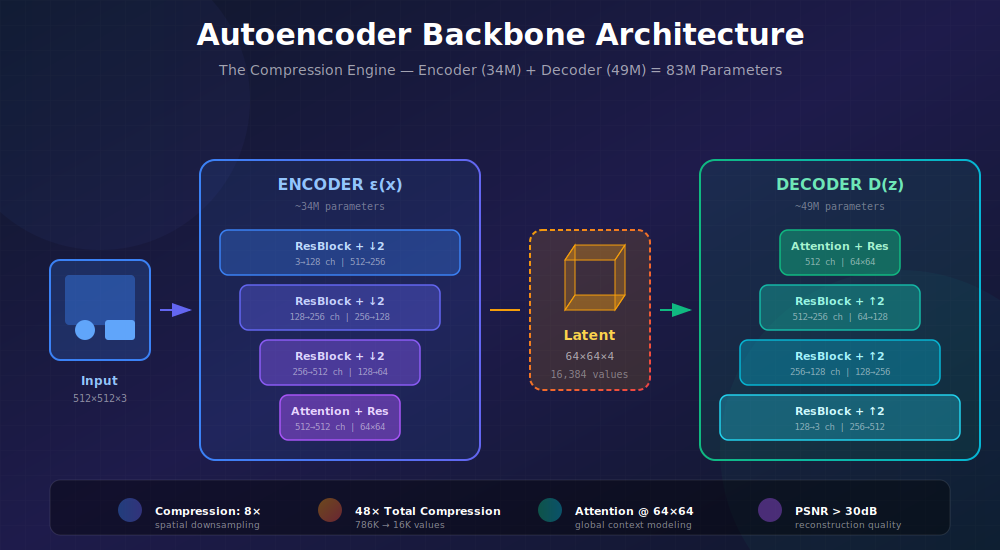
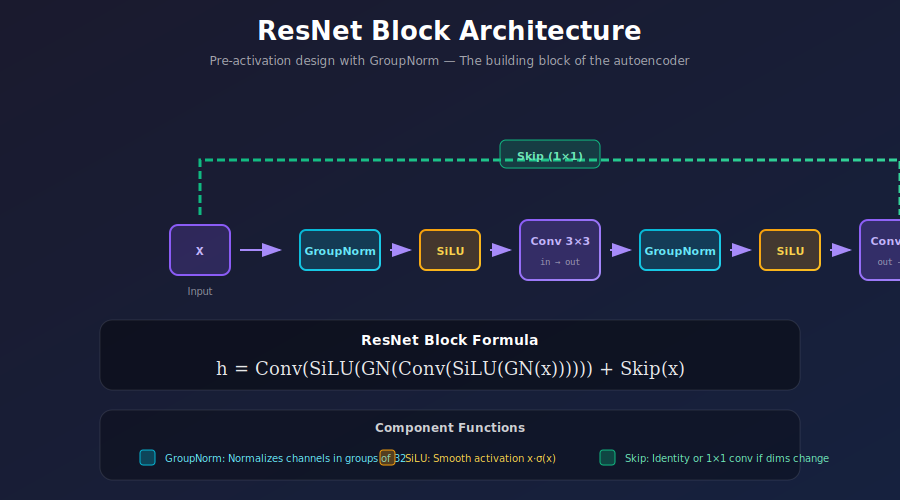
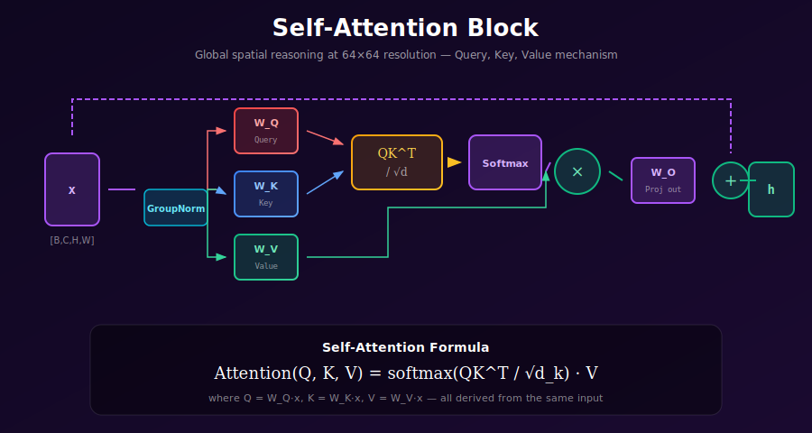
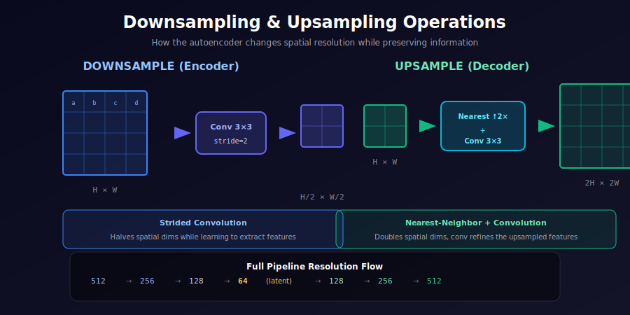

# 🔧 Autoencoder Backbone

<div align="center">



*The Compression Engine of Latent Diffusion — Architecture That Preserves What Matters*

[](#)
[](#)
[](#)

</div>

---

## 🌟 Where & Why Use This Architecture?

<table>
<tr>
<th width="20%">🎯 Application</th>
<th width="40%">💡 Why This Architecture?</th>
<th width="40%">🌍 Used In</th>
</tr>
<tr>
<td><b>Latent Diffusion</b></td>
<td>Creates compact, diffusion-friendly latent space with high-quality reconstruction</td>
<td>Stable Diffusion 1.x, 2.x, XL</td>
</tr>
<tr>
<td><b>Image Compression</b></td>
<td>Learned codecs outperform traditional JPEG at low bitrates</td>
<td>Neural image codecs, streaming</td>
</tr>
<tr>
<td><b>Feature Extraction</b></td>
<td>Encoder provides rich multi-scale features for downstream tasks</td>
<td>Segmentation, detection backbones</td>
</tr>
<tr>
<td><b>Style Transfer</b></td>
<td>Latent space enables disentangled style manipulation</td>
<td>Real-time style transfer apps</td>
</tr>
<tr>
<td><b>Super Resolution</b></td>
<td>Decoder architecture naturally upscales with learned details</td>
<td>Real-ESRGAN, upscaling models</td>
</tr>
</table>

### 💡 Design Philosophy

> **Goal**: Build an autoencoder that compresses images to 1/48th the size while maintaining **perceptually indistinguishable** reconstruction quality.
>
> **Key Insight**: Combine multiple loss functions (reconstruction + perceptual + adversarial) to capture both pixel accuracy and semantic correctness.

---

## 📚 Architecture Overview

The autoencoder backbone follows an **asymmetric encoder-decoder** design:

| Component | Parameters | Input → Output | Key Features |
|:----------|:----------:|:--------------:|:-------------|
| **Encoder** | ~34M | 512×512×3 → 64×64×4 | Downsampling, attention at 64×64 |
| **Decoder** | ~49M | 64×64×4 → 512×512×3 | Upsampling, attention at 64×64 |
| **Total** | ~83M | 8× spatial compression | Much smaller than U-Net (~860M) |

<div align="center">



</div>

---

## 🧮 Mathematical Foundation

### 1. Encoder Transformation

The encoder maps images to a probabilistic latent distribution:

$$\mathcal{E}: \mathbb{R}^{H \times W \times 3} \rightarrow \mathbb{R}^{\frac{H}{8} \times \frac{W}{8} \times 8}$$

The output is split into mean $\mu$ and log-variance $\log\sigma^2$:

$$[\mu, \log\sigma^2] = \mathcal{E}(x)$$

### 2. Sampling (Reparameterization)

$$z = \mu + \sigma \odot \epsilon, \quad \epsilon \sim \mathcal{N}(0, I)$$

### 3. Decoder Reconstruction

$$\hat{x} = \mathcal{D}(z), \quad \hat{x} \in \mathbb{R}^{H \times W \times 3}$$

### 4. Complete Loss Function

$$\boxed{\mathcal{L} = \underbrace{\|x - \hat{x}\|_1}_{\text{L1 Recon}} + \underbrace{\lambda_p \cdot \text{LPIPS}(x, \hat{x})}_{\text{Perceptual}} + \underbrace{\lambda_{KL} \cdot D_{KL}(q \| p)}_{\text{Regularization}} + \underbrace{\lambda_G \cdot \mathcal{L}_{GAN}}_{\text{Adversarial}}}$$

---

## 📐 Deep Dive: Convolution Arithmetic

### Output Size Formula

For a convolution with input size $H_{in}$, kernel size $k$, stride $s$, and padding $p$:

$$H_{out} = \left\lfloor \frac{H_{in} + 2p - k}{s} \right\rfloor + 1$$

### Encoder Dimension Analysis

| Layer | Input | Kernel | Stride | Pad | Output | Channels |
|:------|:-----:|:------:|:------:|:---:|:------:|:--------:|
| conv_in | 512 | 3 | 1 | 1 | 512 | 3 → 128 |
| down_1 | 512 | 3 | 2 | 1 | 256 | 128 → 128 |
| down_2 | 256 | 3 | 2 | 1 | 128 | 128 → 256 |
| down_3 | 128 | 3 | 2 | 1 | 64 | 256 → 512 |
| mid + out | 64 | 3 | 1 | 1 | 64 | 512 → 8 |

**Total downsampling**: $512 \rightarrow 64$ = $8\times$ spatial compression

### Receptive Field Calculation

The **receptive field** is the region of input affecting each output position:

$$RF_l = RF_{l-1} + (k_l - 1) \times \prod_{i=1}^{l-1} s_i$$

For the encoder:
- After conv_in: $RF = 3$
- After down_1: $RF = 3 + (3-1) \times 1 = 5$, then stride doubles effective RF
- After down_2: $RF \approx 13$
- After down_3: $RF \approx 29$
- At bottleneck: $RF \approx 64$ (each latent "sees" ~64×64 pixel region)

This means each latent position has information about an **8×8 input patch** directly, but context from a **64×64 region** through the network.

---

## 🔬 Information Theory Analysis

### Rate-Distortion Framework

The autoencoder implements a **learned compression** system:

**Rate** (bits per pixel): 
$$R = \frac{c \times h \times w \times b}{H \times W}$$

where $c=4$ channels, $h=w=64$ spatial, $b$ bits precision, $H=W=512$ input.

For float16 latents: $R = \frac{4 \times 64 \times 64 \times 16}{512 \times 512} \approx 1$ bpp

For comparison:
| Format | Bits per pixel | Quality |
|:-------|:--------------:|:--------|
| JPEG (low) | ~0.25 bpp | Artifacts visible |
| JPEG (high) | ~1.0 bpp | Good quality |
| **SD VAE** | **~1.0 bpp** | **Excellent quality** |
| PNG | ~4-8 bpp | Lossless |

### Channel Capacity

The latent space has theoretical capacity:
$$C = c \times h \times w \times \log_2(L)$$

where $L$ is the number of distinguishable levels per dimension.

With continuous latents in range $[-4, 4]$ and effective precision of ~256 levels:
$$C = 4 \times 64 \times 64 \times 8 \approx 131,072 \text{ bits}$$

This is **sufficient** to encode the essential information from a 512×512 image while discarding perceptually redundant details.

---

## 📊 ResNet Block Mathematics

### Pre-activation vs Post-activation

**Post-activation** (original ResNet):
$$y = \text{ReLU}(F(x) + x)$$

**Pre-activation** (used in VAE):
$$y = F(\text{ReLU}(x)) + x$$

### Why Pre-activation is Better

The gradient flow in pre-activation:
$$\frac{\partial \mathcal{L}}{\partial x} = \frac{\partial \mathcal{L}}{\partial y} \cdot \left(1 + \frac{\partial F}{\partial x}\right)$$

The **+1 term** ensures gradients always flow, even if $\frac{\partial F}{\partial x} \approx 0$.

### GroupNorm Statistics

GroupNorm normalizes within groups of channels:
$$\hat{x}_{ncij} = \frac{x_{ncij} - \mu_{ng}}{\sqrt{\sigma_{ng}^2 + \epsilon}}$$

where group $g = \lfloor c \cdot G / C \rfloor$ and statistics computed over:
$$\mu_{ng} = \frac{1}{|S_g|}\sum_{(c,i,j) \in S_g} x_{ncij}$$

**Advantage over BatchNorm**: Works with small batch sizes (common in VAE training).

---

## 🎯 SiLU (Swish) Activation

The VAE uses SiLU instead of ReLU:

$$\text{SiLU}(x) = x \cdot \sigma(x) = \frac{x}{1 + e^{-x}}$$

### Properties

| Property | ReLU | SiLU |
|:---------|:-----|:-----|
| Range | $[0, \infty)$ | $(-0.28, \infty)$ |
| Smoothness | Non-smooth at 0 | Smooth everywhere |
| Gradient at 0 | Undefined | 0.5 |
| Dying neurons | Yes | No |

### Derivative

$$\frac{d}{dx}\text{SiLU}(x) = \sigma(x) + x \cdot \sigma(x)(1 - \sigma(x)) = \sigma(x)(1 + x(1 - \sigma(x)))$$

This is always positive for $x > -1.28$, preventing dead neurons.

---

## 🔧 Building Block: ResNet with Pre-Activation

<div align="center">


</div>

The ResNet block is the fundamental building block:
- **Pre-activation design**: GroupNorm → SiLU → Conv (more stable training)
- **Skip connection**: Allows gradients to flow directly, prevents vanishing gradients
- **1×1 conv for channel change**: When input/output channels differ

---

## 🔍 Self-Attention in the Autoencoder

<div align="center">



</div>

Self-attention is applied at the bottleneck (64×64 resolution) to capture global context:
- Computationally feasible at lower resolution
- Enables the model to relate distant spatial locations
- Essential for coherent reconstruction of complex scenes

---

## ⬇️ Downsampling & Upsampling

<div align="center">



</div>

---

## 💻 Complete Implementation

### ResNet Block

The fundamental building block with residual connections:

```python
class ResNetBlock(nn.Module):
    """
    Pre-activation ResNet block with GroupNorm.
    
    Architecture:
        Input → GroupNorm → SiLU → Conv → GroupNorm → SiLU → Conv → + → Output
                                                                    ↑
                                                               Skip Connection
    """
    
    def __init__(self, in_channels, out_channels, groups=32):
        super().__init__()
        
        # First convolution path
        self.norm1 = nn.GroupNorm(groups, in_channels)
        self.conv1 = nn.Conv2d(in_channels, out_channels, 3, padding=1)
        
        # Second convolution path
        self.norm2 = nn.GroupNorm(groups, out_channels)
        self.conv2 = nn.Conv2d(out_channels, out_channels, 3, padding=1)
        
        # Skip connection (identity or 1x1 conv if channels change)
        if in_channels != out_channels:
            self.skip = nn.Conv2d(in_channels, out_channels, 1)
        else:
            self.skip = nn.Identity()
    
    def forward(self, x):
        h = self.norm1(x)
        h = F.silu(h)
        h = self.conv1(h)
        
        h = self.norm2(h)
        h = F.silu(h)
        h = self.conv2(h)
        
        return h + self.skip(x)
```

### Attention Block

Self-attention for capturing global context:

```python
class AttentionBlock(nn.Module):
    """
    Self-attention block for global spatial reasoning.
    
    Applied at lower resolutions (64×64) where attention is computationally feasible.
    """
    
    def __init__(self, channels, num_heads=1):
        super().__init__()
        self.channels = channels
        self.num_heads = num_heads
        
        self.norm = nn.GroupNorm(32, channels)
        
        # Q, K, V projections
        self.q = nn.Conv2d(channels, channels, 1)
        self.k = nn.Conv2d(channels, channels, 1)
        self.v = nn.Conv2d(channels, channels, 1)
        
        # Output projection
        self.proj_out = nn.Conv2d(channels, channels, 1)
        
        self.scale = (channels // num_heads) ** -0.5
    
    def forward(self, x):
        B, C, H, W = x.shape
        
        h = self.norm(x)
        q = self.q(h)
        k = self.k(h)
        v = self.v(h)
        
        # Reshape for attention: [B, C, H, W] → [B, HW, C]
        q = q.reshape(B, C, H * W).permute(0, 2, 1)
        k = k.reshape(B, C, H * W)
        v = v.reshape(B, C, H * W).permute(0, 2, 1)
        
        # Attention: [B, HW, HW]
        attn = torch.bmm(q, k) * self.scale
        attn = F.softmax(attn, dim=-1)
        
        # Apply attention to values
        out = torch.bmm(attn, v)  # [B, HW, C]
        out = out.permute(0, 2, 1).reshape(B, C, H, W)
        out = self.proj_out(out)
        
        return x + out
```

### Complete Encoder

```python
class Encoder(nn.Module):
    """
    VAE Encoder: Image → Latent Distribution
    
    Architecture:
        512×512×3 → [ResBlocks + Downsample]×3 → Attention → 64×64×8
    """
    
    def __init__(
        self,
        in_channels=3,
        base_channels=128,
        channel_mults=(1, 2, 4, 4),
        num_res_blocks=2,
        latent_channels=4,
    ):
        super().__init__()
        
        # Initial convolution
        self.conv_in = nn.Conv2d(in_channels, base_channels, 3, padding=1)
        
        # Downsampling blocks
        self.down_blocks = nn.ModuleList()
        ch = base_channels
        
        for i, mult in enumerate(channel_mults):
            out_ch = base_channels * mult
            
            # Add residual blocks
            for _ in range(num_res_blocks):
                self.down_blocks.append(ResNetBlock(ch, out_ch))
                ch = out_ch
            
            # Add attention at lower resolutions (64×64 and below)
            if i >= 2:
                self.down_blocks.append(AttentionBlock(ch))
            
            # Downsample (except at last level)
            if i < len(channel_mults) - 1:
                self.down_blocks.append(
                    nn.Conv2d(ch, ch, 3, stride=2, padding=1)
                )
        
        # Middle blocks
        self.mid_block1 = ResNetBlock(ch, ch)
        self.mid_attn = AttentionBlock(ch)
        self.mid_block2 = ResNetBlock(ch, ch)
        
        # Output
        self.norm_out = nn.GroupNorm(32, ch)
        self.conv_out = nn.Conv2d(ch, latent_channels * 2, 3, padding=1)
    
    def forward(self, x):
        h = self.conv_in(x)
        
        for block in self.down_blocks:
            h = block(h)
        
        h = self.mid_block1(h)
        h = self.mid_attn(h)
        h = self.mid_block2(h)
        
        h = self.norm_out(h)
        h = F.silu(h)
        h = self.conv_out(h)
        
        # Split into mean and log-variance
        mean, logvar = torch.chunk(h, 2, dim=1)
        return mean, logvar
```

### Complete Decoder

```python
class Decoder(nn.Module):
    """
    VAE Decoder: Latent → Image
    
    Architecture:
        64×64×4 → [ResBlocks + Upsample]×3 → Attention → 512×512×3
    """
    
    def __init__(
        self,
        out_channels=3,
        base_channels=128,
        channel_mults=(1, 2, 4, 4),
        num_res_blocks=2,
        latent_channels=4,
    ):
        super().__init__()
        
        ch = base_channels * channel_mults[-1]
        
        # Input from latent
        self.conv_in = nn.Conv2d(latent_channels, ch, 3, padding=1)
        
        # Middle blocks
        self.mid_block1 = ResNetBlock(ch, ch)
        self.mid_attn = AttentionBlock(ch)
        self.mid_block2 = ResNetBlock(ch, ch)
        
        # Upsampling blocks
        self.up_blocks = nn.ModuleList()
        
        for i, mult in reversed(list(enumerate(channel_mults))):
            out_ch = base_channels * mult
            
            # Add residual blocks (+1 for skip connection equivalent)
            for _ in range(num_res_blocks + 1):
                self.up_blocks.append(ResNetBlock(ch, out_ch))
                ch = out_ch
            
            # Add attention at lower resolutions
            if i >= 2:
                self.up_blocks.append(AttentionBlock(ch))
            
            # Upsample (except at first level)
            if i > 0:
                self.up_blocks.append(Upsample(ch))
        
        # Output
        self.norm_out = nn.GroupNorm(32, ch)
        self.conv_out = nn.Conv2d(ch, out_channels, 3, padding=1)
    
    def forward(self, z):
        h = self.conv_in(z)
        
        h = self.mid_block1(h)
        h = self.mid_attn(h)
        h = self.mid_block2(h)
        
        for block in self.up_blocks:
            h = block(h)
        
        h = self.norm_out(h)
        h = F.silu(h)
        h = self.conv_out(h)
        
        return h


class Upsample(nn.Module):
    """Upsampling with nearest-neighbor interpolation + convolution."""
    
    def __init__(self, channels):
        super().__init__()
        self.conv = nn.Conv2d(channels, channels, 3, padding=1)
    
    def forward(self, x):
        x = F.interpolate(x, scale_factor=2, mode='nearest')
        return self.conv(x)
```

### Complete VAE

```python
class AutoencoderKL(nn.Module):
    """
    Complete KL-regularized Autoencoder for Latent Diffusion.
    
    Includes quantization convolutions for standardization.
    """
    
    def __init__(self, encoder, decoder, embed_dim=4):
        super().__init__()
        self.encoder = encoder
        self.decoder = decoder
        
        # Quantization convolutions (identity-initialized)
        self.quant_conv = nn.Conv2d(embed_dim * 2, embed_dim * 2, 1)
        self.post_quant_conv = nn.Conv2d(embed_dim, embed_dim, 1)
    
    def encode(self, x):
        h = self.encoder(x)
        h = torch.cat(h, dim=1)  # Concatenate mean and logvar
        moments = self.quant_conv(h)
        mean, logvar = torch.chunk(moments, 2, dim=1)
        return DiagonalGaussian(mean, logvar)
    
    def decode(self, z):
        z = self.post_quant_conv(z)
        return self.decoder(z)
    
    def forward(self, x, sample=True):
        posterior = self.encode(x)
        z = posterior.sample() if sample else posterior.mean
        recon = self.decode(z)
        return recon, posterior


class DiagonalGaussian:
    """Diagonal Gaussian distribution for VAE."""
    
    def __init__(self, mean, logvar):
        self.mean = mean
        self.logvar = torch.clamp(logvar, -30.0, 20.0)
        self.std = torch.exp(0.5 * self.logvar)
    
    def sample(self):
        eps = torch.randn_like(self.mean)
        return self.mean + self.std * eps
    
    def kl(self):
        """KL divergence from N(0, I)."""
        return 0.5 * torch.sum(
            self.mean.pow(2) + self.std.pow(2) - self.logvar - 1,
            dim=[1, 2, 3]
        )
```

---

## 📊 Training Strategy

### Patch Discriminator

```python
class PatchDiscriminator(nn.Module):
    """
    PatchGAN discriminator for adversarial training.
    
    Operates on patches rather than full image for stable training.
    """
    
    def __init__(self, in_channels=3, ndf=64, n_layers=3):
        super().__init__()
        
        layers = [
            nn.Conv2d(in_channels, ndf, 4, stride=2, padding=1),
            nn.LeakyReLU(0.2, True)
        ]
        
        nf_mult = 1
        for n in range(1, n_layers):
            nf_mult_prev = nf_mult
            nf_mult = min(2 ** n, 8)
            layers += [
                nn.Conv2d(ndf * nf_mult_prev, ndf * nf_mult, 4, stride=2, padding=1),
                nn.GroupNorm(32, ndf * nf_mult),
                nn.LeakyReLU(0.2, True)
            ]
        
        nf_mult_prev = nf_mult
        nf_mult = min(2 ** n_layers, 8)
        layers += [
            nn.Conv2d(ndf * nf_mult_prev, ndf * nf_mult, 4, stride=1, padding=1),
            nn.GroupNorm(32, ndf * nf_mult),
            nn.LeakyReLU(0.2, True),
            nn.Conv2d(ndf * nf_mult, 1, 4, stride=1, padding=1)
        ]
        
        self.main = nn.Sequential(*layers)
    
    def forward(self, x):
        return self.main(x)
```

### Training Loop

```python
def train_autoencoder(
    model, discriminator, train_loader, 
    epochs=100, lr=4.5e-6, 
    gan_start_step=10000
):
    """
    Two-phase training:
    1. First phase: Reconstruction + Perceptual + KL only
    2. Second phase: Add adversarial loss
    """
    opt_ae = torch.optim.Adam(model.parameters(), lr=lr, betas=(0.5, 0.9))
    opt_disc = torch.optim.Adam(discriminator.parameters(), lr=lr, betas=(0.5, 0.9))
    
    lpips_fn = lpips.LPIPS(net='vgg').eval()
    
    step = 0
    for epoch in range(epochs):
        for images in train_loader:
            images = images.cuda()
            
            # === Forward pass ===
            recon, posterior = model(images)
            
            # === Autoencoder losses ===
            rec_loss = F.l1_loss(recon, images)
            perc_loss = lpips_fn(recon, images).mean()
            kl_loss = posterior.kl().mean()
            
            ae_loss = rec_loss + 1.0 * perc_loss + 1e-6 * kl_loss
            
            # === GAN loss (after warmup) ===
            if step > gan_start_step:
                fake_pred = discriminator(recon)
                g_loss = -fake_pred.mean()
                ae_loss = ae_loss + 0.5 * g_loss
                
                # Discriminator step
                opt_disc.zero_grad()
                real_pred = discriminator(images.detach())
                fake_pred = discriminator(recon.detach())
                d_loss = F.relu(1 - real_pred).mean() + F.relu(1 + fake_pred).mean()
                d_loss.backward()
                opt_disc.step()
            
            # === Autoencoder step ===
            opt_ae.zero_grad()
            ae_loss.backward()
            opt_ae.step()
            
            step += 1
            
            if step % 1000 == 0:
                print(f"Step {step}: rec={rec_loss:.4f}, perc={perc_loss:.4f}, kl={kl_loss:.4f}")
```

---

## 📈 Quality Benchmarks

### Target Metrics

| Metric | Acceptable | Good | Excellent |
|:-------|:----------:|:----:|:---------:|
| **PSNR** | > 24 dB | > 28 dB | > 30 dB |
| **SSIM** | > 0.88 | > 0.92 | > 0.95 |
| **LPIPS** | < 0.18 | < 0.12 | < 0.08 |
| **FID (recon)** | < 8 | < 4 | < 2 |

### Stable Diffusion VAE Performance

| Dataset | PSNR | SSIM | LPIPS |
|:--------|:----:|:----:|:-----:|
| ImageNet | 29.4 dB | 0.93 | 0.08 |
| COCO | 30.1 dB | 0.94 | 0.07 |
| LAION (subset) | 28.8 dB | 0.92 | 0.09 |

---

## ⚡ Optimization Tips

### Memory Efficiency

```python
# Gradient checkpointing for training
from torch.utils.checkpoint import checkpoint

class EfficientEncoder(Encoder):
    def forward(self, x):
        h = self.conv_in(x)
        
        for block in self.down_blocks:
            h = checkpoint(block, h, use_reentrant=False)
        
        # ... rest of forward pass
```

### Mixed Precision Training

```python
from torch.cuda.amp import autocast, GradScaler

scaler = GradScaler()

for images in train_loader:
    with autocast(dtype=torch.float16):
        recon, posterior = model(images)
        loss = compute_loss(recon, images, posterior)
    
    scaler.scale(loss).backward()
    scaler.step(optimizer)
    scaler.update()
```

---

## 📚 References

1. **Rombach, R., et al.** (2022). "High-Resolution Image Synthesis with Latent Diffusion Models." [arXiv:2112.10752](https://arxiv.org/abs/2112.10752)

2. **Esser, P., et al.** (2021). "Taming Transformers for High-Resolution Image Synthesis." [arXiv:2012.09841](https://arxiv.org/abs/2012.09841)

3. **Kingma, D. P., & Welling, M.** (2014). "Auto-Encoding Variational Bayes." [arXiv:1312.6114](https://arxiv.org/abs/1312.6114)

4. **Isola, P., et al.** (2017). "Image-to-Image Translation with Conditional Adversarial Networks." (PatchGAN)

---

## ✏️ Exercises

1. **Implement** the full encoder-decoder from scratch and verify dimensions at each stage.

2. **Train** on a small dataset (e.g., CelebA) and measure reconstruction metrics.

3. **Ablate** the effect of attention layers: train with and without attention at 64×64.

4. **Compare** different compression ratios (4×, 8×, 16×) and measure quality trade-offs.

5. **Visualize** the learned latent space using t-SNE or UMAP on image classes.

---

<div align="center">

**[← Previous: Latent Space Learning](../01_latent_space_learning/)** | **[Next: Latent DDPM →](../03_latent_ddpm/)**

*Build the compression backbone that enables efficient diffusion*

</div>
