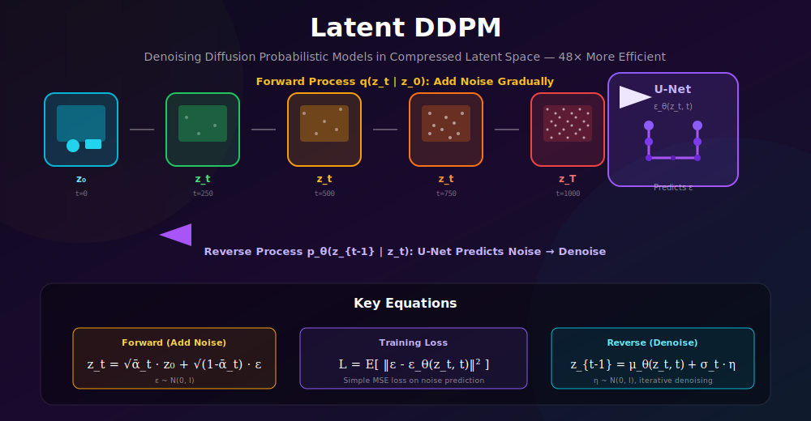
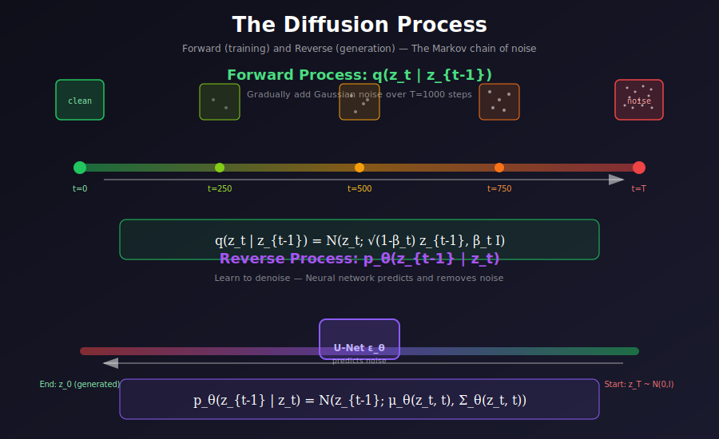

# 🎲 Latent DDPM

<div align="center">



*Diffusion in Compressed Space — 48× More Efficient Without Sacrificing Quality*

[](#)
[](#)
[](#)

</div>

---

## 🌟 Where & Why Use Latent DDPM?

<table>
<tr>
<th width="20%">🎯 Application</th>
<th width="40%">💡 Why Latent DDPM?</th>
<th width="40%">🌍 Real-World Examples</th>
</tr>
<tr>
<td><b>High-Res Generation</b></td>
<td>512×512, 1024×1024 images feasible on consumer GPUs</td>
<td>Stable Diffusion, DALL-E 2</td>
</tr>
<tr>
<td><b>Video Diffusion</b></td>
<td>Compress spatiotemporal dimensions for tractable video generation</td>
<td>Stable Video Diffusion, Sora</td>
</tr>
<tr>
<td><b>Fast Iteration</b></td>
<td>Rapid prototyping with reasonable training times</td>
<td>Research labs, indie developers</td>
</tr>
<tr>
<td><b>Edge Deployment</b></td>
<td>Smaller models fit on mobile/edge devices</td>
<td>On-device image generation</td>
</tr>
<tr>
<td><b>Multi-Modal</b></td>
<td>Different modalities share latent space structure</td>
<td>Audio-visual generation</td>
</tr>
</table>

### 💡 The Key Innovation

> **Problem**: Pixel-space diffusion at 512×512 requires processing 786,432 values per step. With 1000 denoising steps, this becomes computationally prohibitive.
>
> **Solution**: Encode images to 64×64×4 latent space (16,384 values) and run diffusion there. **Same quality, 48× less compute!**

---

## 📚 Core Concept

Latent DDPM combines two powerful ideas:

1. **Autoencoders**: Compress images to compact latent representations
2. **DDPM**: Gradually denoise random noise to generate samples

<div align="center">



</div>

### The Two-Stage Pipeline

```
TRAINING:
Image x → VAE Encoder → Latent z₀ → Add Noise → zₜ → U-Net predicts noise → Loss

INFERENCE:  
Random Noise z_T → Iterative Denoising → Clean Latent z₀ → VAE Decoder → Image x̂
```

---

## 🧮 Mathematical Framework

### 1. Forward Process (Adding Noise)

Given a clean latent $z_0 = \mathcal{E}(x)$, we add noise over $T$ timesteps:

$$q(z_t | z_0) = \mathcal{N}(z_t; \sqrt{\bar{\alpha}_t} z_0, (1 - \bar{\alpha}_t)I)$$

**Direct sampling** at any timestep $t$:
$$\boxed{z_t = \sqrt{\bar{\alpha}_t} \cdot z_0 + \sqrt{1 - \bar{\alpha}_t} \cdot \epsilon}$$

where:
- $\bar{\alpha}_t = \prod_{s=1}^{t} \alpha_s = \prod_{s=1}^{t} (1 - \beta_s)$
- $\epsilon \sim \mathcal{N}(0, I)$

---

## 📐 Deep Dive: Forward Process Derivation

### Markov Chain Construction

The forward process is a **Markov chain** where each step adds Gaussian noise:

$$q(z_t | z_{t-1}) = \mathcal{N}(z_t; \sqrt{1-\beta_t} \cdot z_{t-1}, \beta_t I)$$

### Deriving the Direct Sampling Formula

**Goal**: Sample $z_t$ directly from $z_0$ without iterating through all steps.

**Step 1**: Single step transition
$$z_t = \sqrt{1-\beta_t} \cdot z_{t-1} + \sqrt{\beta_t} \cdot \epsilon_t, \quad \epsilon_t \sim \mathcal{N}(0, I)$$

**Step 2**: Recursive expansion
$$z_t = \sqrt{\alpha_t} \cdot z_{t-1} + \sqrt{1-\alpha_t} \cdot \epsilon_t$$
$$= \sqrt{\alpha_t} \left(\sqrt{\alpha_{t-1}} \cdot z_{t-2} + \sqrt{1-\alpha_{t-1}} \cdot \epsilon_{t-1}\right) + \sqrt{1-\alpha_t} \cdot \epsilon_t$$

**Step 3**: Combine Gaussians using the identity
$$\mathcal{N}(0, \sigma_1^2) + \mathcal{N}(0, \sigma_2^2) = \mathcal{N}(0, \sigma_1^2 + \sigma_2^2)$$

After $t$ steps:
$$z_t = \sqrt{\bar{\alpha}_t} \cdot z_0 + \sqrt{1 - \bar{\alpha}_t} \cdot \epsilon$$

**Proof of variance term**:
$$\text{Var}(z_t) = \bar{\alpha}_t \cdot \text{Var}(z_0) + (1-\bar{\alpha}_t) \cdot I = I$$

(assuming $\text{Var}(z_0) = I$ after scaling)

---

## 🔬 Signal-to-Noise Ratio Analysis

The **SNR** at timestep $t$ is:

$$\text{SNR}(t) = \frac{\bar{\alpha}_t}{1 - \bar{\alpha}_t}$$

| Timestep | $\bar{\alpha}_t$ | SNR | Interpretation |
|:---------|:----------------:|:---:|:---------------|
| $t=0$ | 1.0 | $\infty$ | Pure signal |
| $t=T/4$ | ~0.9 | ~9 | Mostly signal |
| $t=T/2$ | ~0.5 | ~1 | Equal signal/noise |
| $t=3T/4$ | ~0.1 | ~0.1 | Mostly noise |
| $t=T$ | ~0 | ~0 | Pure noise |

In **log-SNR space**:
$$\lambda_t = \log \frac{\bar{\alpha}_t}{1 - \bar{\alpha}_t}$$

The noise schedule should provide uniform coverage in log-SNR space for optimal training.

---

### 2. Noise Schedule

<div align="center">


</div>

**Linear Schedule** (original DDPM):
$$\beta_t = \beta_{start} + \frac{t}{T}(\beta_{end} - \beta_{start})$$

Typical values: $\beta_{start} = 0.0001$, $\beta_{end} = 0.02$

**Cosine Schedule** (improved):
$$\bar{\alpha}_t = \frac{f(t)}{f(0)}, \quad f(t) = \cos\left(\frac{t/T + s}{1 + s} \cdot \frac{\pi}{2}\right)^2$$

**Why Cosine is Better**: Linear schedule destroys information too quickly at early timesteps. Cosine provides more gradual noise addition.

---

## 📊 Reverse Process: Full Derivation

### The Goal
Learn $p_\theta(z_{t-1} | z_t)$ to reverse the forward process.

### Posterior Distribution (with $z_0$ known)

Using Bayes' theorem:
$$q(z_{t-1} | z_t, z_0) = \frac{q(z_t | z_{t-1}, z_0) \cdot q(z_{t-1} | z_0)}{q(z_t | z_0)}$$

Since the forward process is Markov: $q(z_t | z_{t-1}, z_0) = q(z_t | z_{t-1})$

**Result** (after Gaussian algebra):
$$q(z_{t-1} | z_t, z_0) = \mathcal{N}(z_{t-1}; \tilde{\mu}_t(z_t, z_0), \tilde{\beta}_t I)$$

where:
$$\boxed{\tilde{\mu}_t = \frac{\sqrt{\bar{\alpha}_{t-1}} \beta_t}{1 - \bar{\alpha}_t} z_0 + \frac{\sqrt{\alpha_t}(1-\bar{\alpha}_{t-1})}{1 - \bar{\alpha}_t} z_t}$$

$$\boxed{\tilde{\beta}_t = \frac{(1-\bar{\alpha}_{t-1})}{(1-\bar{\alpha}_t)} \beta_t}$$

### Expressing $z_0$ in Terms of Noise

From forward process: $z_t = \sqrt{\bar{\alpha}_t} z_0 + \sqrt{1-\bar{\alpha}_t} \epsilon$

Solving for $z_0$:
$$z_0 = \frac{z_t - \sqrt{1-\bar{\alpha}_t} \epsilon}{\sqrt{\bar{\alpha}_t}}$$

### The Parameterized Reverse Mean

Substituting $z_0$ into $\tilde{\mu}_t$:

$$\mu_\theta(z_t, t) = \frac{1}{\sqrt{\alpha_t}}\left(z_t - \frac{\beta_t}{\sqrt{1-\bar{\alpha}_t}} \epsilon_\theta(z_t, t)\right)$$

This is why we **predict noise** $\epsilon_\theta$ rather than $z_0$ directly!

---

## 🧮 Training Objective Derivation

### Variational Lower Bound

The DDPM objective comes from maximizing:
$$\log p_\theta(z_0) \geq \mathbb{E}_q\left[\log \frac{p_\theta(z_{0:T})}{q(z_{1:T}|z_0)}\right] = \mathcal{L}_{VLB}$$

### Decomposition

$$\mathcal{L}_{VLB} = \underbrace{D_{KL}(q(z_T|z_0) \| p(z_T))}_{\mathcal{L}_T} + \sum_{t=2}^{T} \underbrace{D_{KL}(q(z_{t-1}|z_t, z_0) \| p_\theta(z_{t-1}|z_t))}_{\mathcal{L}_{t-1}} - \underbrace{\log p_\theta(z_0|z_1)}_{\mathcal{L}_0}$$

### Simplified Loss

The KL between Gaussians with same variance:
$$D_{KL}(q \| p_\theta) = \frac{1}{2\tilde{\beta}_t} \|\tilde{\mu}_t - \mu_\theta\|^2$$

After substitution and simplification:

$$\mathcal{L}_{simple} = \mathbb{E}_{z_0, \epsilon, t}\left[\|\epsilon - \epsilon_\theta(z_t, t)\|^2\right]$$

**Key insight**: Predicting noise is equivalent to predicting $z_0$ or the score $\nabla_{z_t} \log q(z_t)$.

---

## 🔗 Connection to Score Matching

### Score Function

The **score** of a distribution is:
$$s(z) = \nabla_z \log p(z)$$

For the noisy distribution $q(z_t | z_0)$:
$$\nabla_{z_t} \log q(z_t | z_0) = -\frac{z_t - \sqrt{\bar{\alpha}_t} z_0}{1 - \bar{\alpha}_t} = -\frac{\epsilon}{\sqrt{1 - \bar{\alpha}_t}}$$

### Equivalence

The noise predictor $\epsilon_\theta$ is related to the score by:
$$s_\theta(z_t, t) = -\frac{\epsilon_\theta(z_t, t)}{\sqrt{1 - \bar{\alpha}_t}}$$

This connects DDPM to **score-based generative models**!

---

### 3. Training Objective

The model learns to predict the noise added at each timestep:

$$\boxed{\mathcal{L} = \mathbb{E}_{z_0, \epsilon, t}\left[\|\epsilon - \epsilon_\theta(z_t, t)\|^2\right]}$$

### Alternative Parameterizations

| Predict | Loss | Pros | Cons |
|:--------|:-----|:-----|:-----|
| $\epsilon$ (noise) | $\|\epsilon - \epsilon_\theta\|^2$ | Stable training | - |
| $z_0$ (clean) | $\|z_0 - z_\theta\|^2$ | Direct prediction | Harder to learn |
| $v$ (velocity) | $\|v - v_\theta\|^2$ | Better for low SNR | More complex |

**v-prediction**: $v = \sqrt{\bar{\alpha}_t} \epsilon - \sqrt{1-\bar{\alpha}_t} z_0$

---

### 4. Reverse Process (Sampling)

Starting from $z_T \sim \mathcal{N}(0, I)$, iteratively denoise:

$$z_{t-1} = \frac{1}{\sqrt{\alpha_t}}\left(z_t - \frac{\beta_t}{\sqrt{1-\bar{\alpha}_t}}\epsilon_\theta(z_t, t)\right) + \sigma_t \cdot \eta$$

where $\eta \sim \mathcal{N}(0, I)$ and $\sigma_t = \sqrt{\beta_t}$ for DDPM.

---

## ⚡ DDIM: Deterministic Sampling Derivation

DDIM (Denoising Diffusion Implicit Models) enables faster, deterministic sampling.

### Key Insight

The forward process can be written as:
$$z_t = \sqrt{\bar{\alpha}_t} z_0 + \sqrt{1-\bar{\alpha}_t} \epsilon$$

We can **jump** between any two timesteps without going through intermediate steps!

### DDIM Update Rule

For any $\tau < t$:
$$z_\tau = \sqrt{\bar{\alpha}_\tau} \underbrace{\left(\frac{z_t - \sqrt{1-\bar{\alpha}_t} \epsilon_\theta(z_t, t)}{\sqrt{\bar{\alpha}_t}}\right)}_{\text{predicted } z_0} + \sqrt{1-\bar{\alpha}_\tau - \sigma_\tau^2} \cdot \epsilon_\theta(z_t, t) + \sigma_\tau \epsilon$$

### Deterministic Case ($\sigma = 0$)

$$\boxed{z_\tau = \sqrt{\bar{\alpha}_\tau} \hat{z}_0 + \sqrt{1-\bar{\alpha}_\tau} \cdot \epsilon_\theta(z_t, t)}$$

where $\hat{z}_0 = \frac{z_t - \sqrt{1-\bar{\alpha}_t} \epsilon_\theta}{\sqrt{\bar{\alpha}_t}}$

**Advantages**:
1. Same noise → same output (reproducible)
2. Skip steps: 1000 → 50 steps with minimal quality loss
3. Enables latent interpolation

---

### 5. Latent Scaling

For numerical stability, latents are scaled:
$$z_{scaled} = z_0 \times 0.18215$$

This ensures $\text{Var}(z_{scaled}) \approx 1$, matching the noise prior.

---

## 💻 Complete Implementation

### Latent DDPM Class

```python
import torch
import torch.nn as nn
import torch.nn.functional as F
import numpy as np

class LatentDDPM:
    """
    Latent Denoising Diffusion Probabilistic Model.
    
    Performs diffusion in the latent space of a pre-trained VAE.
    """
    
    def __init__(
        self,
        unet,
        vae,
        num_timesteps=1000,
        beta_start=0.0001,
        beta_end=0.02,
        beta_schedule='linear',
        device='cuda'
    ):
        self.unet = unet
        self.vae = vae
        self.num_timesteps = num_timesteps
        self.device = device
        
        # Freeze VAE
        self.vae.eval()
        for param in self.vae.parameters():
            param.requires_grad = False
        
        # Latent scaling factor (SD default)
        self.scale_factor = 0.18215
        
        # Compute noise schedule
        if beta_schedule == 'linear':
            betas = torch.linspace(beta_start, beta_end, num_timesteps)
        elif beta_schedule == 'cosine':
            betas = self._cosine_beta_schedule(num_timesteps)
        else:
            raise ValueError(f"Unknown schedule: {beta_schedule}")
        
        self.betas = betas.to(device)
        self.alphas = 1.0 - self.betas
        self.alphas_cumprod = torch.cumprod(self.alphas, dim=0)
        self.alphas_cumprod_prev = F.pad(self.alphas_cumprod[:-1], (1, 0), value=1.0)
        
        # Precompute useful quantities
        self.sqrt_alphas_cumprod = torch.sqrt(self.alphas_cumprod)
        self.sqrt_one_minus_alphas_cumprod = torch.sqrt(1.0 - self.alphas_cumprod)
        self.sqrt_recip_alphas = torch.sqrt(1.0 / self.alphas)
        
        # Posterior variance
        self.posterior_variance = (
            self.betas * (1.0 - self.alphas_cumprod_prev) / (1.0 - self.alphas_cumprod)
        )
    
    def _cosine_beta_schedule(self, timesteps, s=0.008):
        """Cosine schedule as proposed in improved DDPM."""
        steps = timesteps + 1
        x = torch.linspace(0, timesteps, steps)
        alphas_cumprod = torch.cos(((x / timesteps) + s) / (1 + s) * np.pi * 0.5) ** 2
        alphas_cumprod = alphas_cumprod / alphas_cumprod[0]
        betas = 1 - (alphas_cumprod[1:] / alphas_cumprod[:-1])
        return torch.clip(betas, 0.0001, 0.9999)
    
    @torch.no_grad()
    def encode(self, x):
        """Encode images to scaled latents."""
        posterior = self.vae.encode(x)
        z = posterior.sample() if hasattr(posterior, 'sample') else posterior[0]
        return z * self.scale_factor
    
    @torch.no_grad()
    def decode(self, z):
        """Decode latents to images."""
        z = z / self.scale_factor
        return self.vae.decode(z)
    
    def q_sample(self, z_0, t, noise=None):
        """
        Forward diffusion: sample z_t given z_0.
        
        z_t = sqrt(ᾱ_t) * z_0 + sqrt(1 - ᾱ_t) * ε
        """
        if noise is None:
            noise = torch.randn_like(z_0)
        
        sqrt_alpha_cumprod = self.sqrt_alphas_cumprod[t].view(-1, 1, 1, 1)
        sqrt_one_minus_alpha_cumprod = self.sqrt_one_minus_alphas_cumprod[t].view(-1, 1, 1, 1)
        
        return sqrt_alpha_cumprod * z_0 + sqrt_one_minus_alpha_cumprod * noise
    
    def p_losses(self, z_0, t, noise=None):
        """
        Compute training loss.
        
        L = E[||ε - ε_θ(z_t, t)||²]
        """
        if noise is None:
            noise = torch.randn_like(z_0)
        
        z_t = self.q_sample(z_0, t, noise)
        noise_pred = self.unet(z_t, t)
        
        loss = F.mse_loss(noise_pred, noise)
        return loss
    
    def training_step(self, images):
        """Complete training step."""
        # Encode to latent space
        z_0 = self.encode(images)
        
        # Sample random timesteps
        t = torch.randint(0, self.num_timesteps, (len(images),), device=self.device)
        
        # Compute loss
        loss = self.p_losses(z_0, t)
        return loss
```

### DDPM Sampling

```python
@torch.no_grad()
def p_sample(self, z_t, t):
    """
    Single reverse diffusion step: z_t → z_{t-1}
    """
    # Predict noise
    noise_pred = self.unet(z_t, t)
    
    # Get schedule values
    beta_t = self.betas[t].view(-1, 1, 1, 1)
    sqrt_one_minus_alpha_cumprod = self.sqrt_one_minus_alphas_cumprod[t].view(-1, 1, 1, 1)
    sqrt_recip_alpha = self.sqrt_recip_alphas[t].view(-1, 1, 1, 1)
    
    # Compute mean of p(z_{t-1} | z_t)
    model_mean = sqrt_recip_alpha * (
        z_t - beta_t / sqrt_one_minus_alpha_cumprod * noise_pred
    )
    
    # Add noise (except at t=0)
    if t[0] > 0:
        noise = torch.randn_like(z_t)
        posterior_variance = self.posterior_variance[t].view(-1, 1, 1, 1)
        z_t_minus_1 = model_mean + torch.sqrt(posterior_variance) * noise
    else:
        z_t_minus_1 = model_mean
    
    return z_t_minus_1

@torch.no_grad()
def sample(self, batch_size, latent_size=64, return_intermediates=False):
    """
    Generate samples via reverse diffusion.
    
    Args:
        batch_size: Number of samples to generate
        latent_size: Spatial size of latent (default 64 for 512px images)
        return_intermediates: Whether to return intermediate steps
    
    Returns:
        Generated images (and optionally intermediate latents)
    """
    shape = (batch_size, 4, latent_size, latent_size)
    
    # Start from pure noise
    z = torch.randn(shape, device=self.device)
    
    intermediates = [z] if return_intermediates else None
    
    # Reverse diffusion
    for t in reversed(range(self.num_timesteps)):
        t_batch = torch.full((batch_size,), t, device=self.device, dtype=torch.long)
        z = self.p_sample(z, t_batch)
        
        if return_intermediates and t % 100 == 0:
            intermediates.append(z)
    
    # Decode to images
    images = self.decode(z)
    
    if return_intermediates:
        return images, intermediates
    return images
```

### DDIM Sampling (Faster)

```python
@torch.no_grad()
def ddim_sample(self, batch_size, num_steps=50, eta=0.0):
    """
    DDIM sampling for faster generation.
    
    Args:
        batch_size: Number of samples
        num_steps: Number of denoising steps (can be much less than training steps)
        eta: Stochasticity (0 = deterministic, 1 = DDPM-like)
    
    Returns:
        Generated images
    """
    # Create timestep subsequence
    step_ratio = self.num_timesteps // num_steps
    timesteps = list(range(0, self.num_timesteps, step_ratio))[::-1]
    
    # Start from noise
    z = torch.randn(batch_size, 4, 64, 64, device=self.device)
    
    for i, t in enumerate(timesteps):
        t_batch = torch.full((batch_size,), t, device=self.device, dtype=torch.long)
        
        # Predict noise
        noise_pred = self.unet(z, t_batch)
        
        # Get alpha values
        alpha_cumprod_t = self.alphas_cumprod[t]
        alpha_cumprod_prev = (
            self.alphas_cumprod[timesteps[i + 1]] 
            if i < len(timesteps) - 1 
            else torch.tensor(1.0)
        )
        
        # Predict x_0
        pred_z_0 = (z - torch.sqrt(1 - alpha_cumprod_t) * noise_pred) / torch.sqrt(alpha_cumprod_t)
        
        # Compute variance
        sigma = eta * torch.sqrt(
            (1 - alpha_cumprod_prev) / (1 - alpha_cumprod_t) * 
            (1 - alpha_cumprod_t / alpha_cumprod_prev)
        )
        
        # Direction pointing to x_t
        dir_xt = torch.sqrt(1 - alpha_cumprod_prev - sigma ** 2) * noise_pred
        
        # DDIM update
        z = torch.sqrt(alpha_cumprod_prev) * pred_z_0 + dir_xt
        
        if sigma > 0 and i < len(timesteps) - 1:
            z = z + sigma * torch.randn_like(z)
    
    return self.decode(z)
```

---

## 🔧 Training Configuration

### Hyperparameters

| Parameter | Typical Value | Notes |
|:----------|:-------------:|:------|
| Diffusion steps | 1000 | Training timesteps |
| β schedule | Linear/Cosine | Cosine often better |
| β_start | 0.0001 | Low noise at t=0 |
| β_end | 0.02 | High noise at t=T |
| Latent channels | 4 | SD default |
| Latent size | 64×64 | For 512×512 images |
| Scale factor | 0.18215 | Normalize variance |
| Learning rate | 1e-4 | AdamW |
| Batch size | 256-2048 | Larger is better |
| EMA decay | 0.9999 | For stable sampling |

### Training Script

```python
def train_latent_ddpm(
    ddpm,
    train_loader,
    epochs=100,
    lr=1e-4,
    ema_decay=0.9999,
    gradient_accumulation=4
):
    """Train Latent DDPM model."""
    optimizer = torch.optim.AdamW(ddpm.unet.parameters(), lr=lr)
    scheduler = torch.optim.lr_scheduler.CosineAnnealingLR(optimizer, epochs * len(train_loader))
    
    # EMA for stable sampling
    ema = EMAModel(ddpm.unet, decay=ema_decay)
    
    step = 0
    for epoch in range(epochs):
        for batch_idx, images in enumerate(train_loader):
            images = images.cuda()
            
            # Training step
            loss = ddpm.training_step(images)
            loss = loss / gradient_accumulation
            loss.backward()
            
            if (batch_idx + 1) % gradient_accumulation == 0:
                torch.nn.utils.clip_grad_norm_(ddpm.unet.parameters(), 1.0)
                optimizer.step()
                scheduler.step()
                optimizer.zero_grad()
                ema.update()
                step += 1
            
            if step % 1000 == 0:
                print(f"Epoch {epoch}, Step {step}, Loss: {loss.item():.4f}")
                
                # Sample and log
                ema.apply()
                samples = ddpm.sample(4)
                save_images(samples, f"samples_{step}.png")
                ema.restore()


class EMAModel:
    """Exponential Moving Average for model weights."""
    
    def __init__(self, model, decay=0.9999):
        self.model = model
        self.decay = decay
        self.shadow = {k: v.clone() for k, v in model.named_parameters()}
        self.backup = {}
    
    def update(self):
        for name, param in self.model.named_parameters():
            self.shadow[name] = self.decay * self.shadow[name] + (1 - self.decay) * param
    
    def apply(self):
        self.backup = {k: v.clone() for k, v in self.model.named_parameters()}
        for name, param in self.model.named_parameters():
            param.data.copy_(self.shadow[name])
    
    def restore(self):
        for name, param in self.model.named_parameters():
            param.data.copy_(self.backup[name])
```

---

## 📊 Computational Comparison

### Memory & Speed

| Model | Resolution | Latent Size | Memory | Time/Step |
|:------|:----------:|:-----------:|:------:|:---------:|
| Pixel DDPM | 256×256 | - | ~16 GB | ~200ms |
| Pixel DDPM | 512×512 | - | ~48 GB | ~800ms |
| **Latent DDPM** | 512×512 | 64×64×4 | ~6 GB | ~50ms |
| **Latent DDPM** | 1024×1024 | 128×128×4 | ~12 GB | ~150ms |

### Training Efficiency

| Approach | Steps to Converge | Wall Time | GPU Hours |
|:---------|:-----------------:|:---------:|:---------:|
| Pixel DDPM 256 | ~500K | ~2 weeks | ~5000 |
| Latent DDPM 512 | ~400K | ~3 days | ~500 |
| **Speedup** | - | **~4.5×** | **~10×** |

---

## 📚 References

1. **Ho, J., et al.** (2020). "Denoising Diffusion Probabilistic Models." *NeurIPS*. [arXiv:2006.11239](https://arxiv.org/abs/2006.11239)

2. **Rombach, R., et al.** (2022). "High-Resolution Image Synthesis with Latent Diffusion Models." *CVPR*. [arXiv:2112.10752](https://arxiv.org/abs/2112.10752)

3. **Song, J., et al.** (2021). "Denoising Diffusion Implicit Models." *ICLR*. [arXiv:2010.02502](https://arxiv.org/abs/2010.02502)

4. **Nichol, A., & Dhariwal, P.** (2021). "Improved Denoising Diffusion Probabilistic Models." *ICML*. [arXiv:2102.09672](https://arxiv.org/abs/2102.09672)

---

## ✏️ Exercises

1. **Implement** the full latent DDPM training loop from scratch.

2. **Compare** linear vs cosine noise schedules — measure FID on a test set.

3. **Measure** the speedup of DDIM (50 steps) vs DDPM (1000 steps) sampling.

4. **Train** a class-conditional latent DDPM on CIFAR-10 in latent space.

5. **Experiment** with different numbers of U-Net channels and measure quality/speed trade-offs.

---

<div align="center">

**[← Previous: Autoencoder Backbone](../02_autoencoder_backbone/)** | **[Next: Cross-Attention →](../04_cross_attention/)**

*Master efficient diffusion in compressed latent space*

</div>
