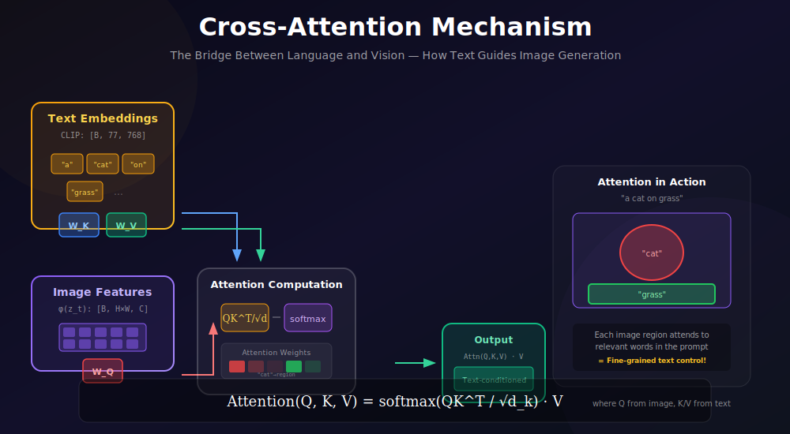
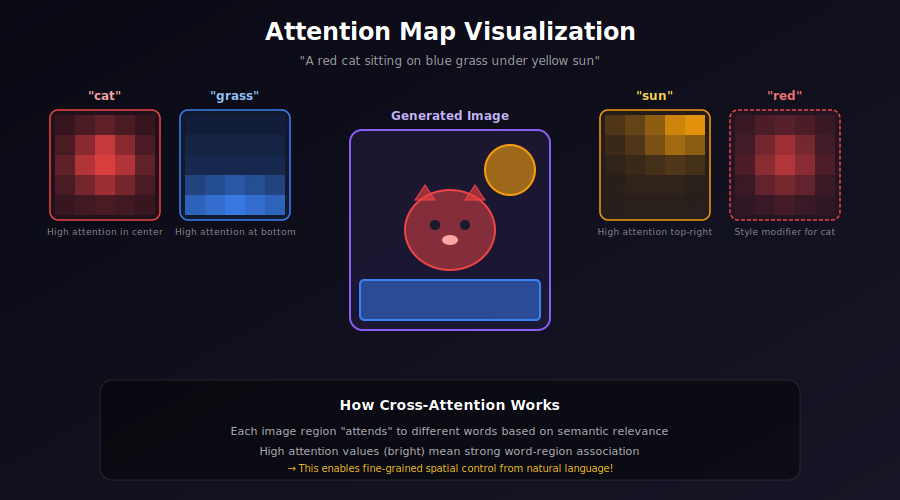
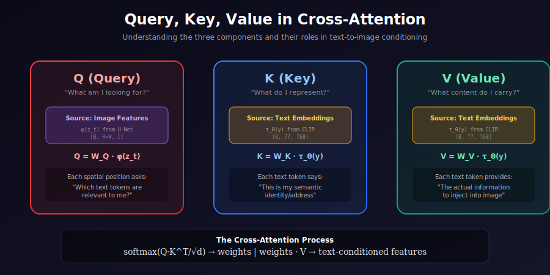

# 🔗 Cross-Attention in Latent Diffusion

<div align="center">



*The Bridge Between Language and Vision — How Text Guides Image Generation*

[](#)
[](#)
[](#)

</div>

---

## 🌟 Where & Why Use Cross-Attention?

<table>
<tr>
<th width="20%">🎯 Application</th>
<th width="40%">💡 Why Cross-Attention?</th>
<th width="40%">🌍 Real-World Examples</th>
</tr>
<tr>
<td><b>Text-to-Image</b></td>
<td>Each image region attends to relevant words in the prompt</td>
<td>Stable Diffusion, Midjourney, DALL-E</td>
</tr>
<tr>
<td><b>Image Editing</b></td>
<td>Manipulate attention maps to control which regions change</td>
<td>Prompt-to-Prompt, InstructPix2Pix</td>
</tr>
<tr>
<td><b>Semantic Control</b></td>
<td>Word-level control over spatial layout</td>
<td>ControlNet, T2I-Adapter</td>
</tr>
<tr>
<td><b>Style Transfer</b></td>
<td>Text describes style while attending to content</td>
<td>Style-aligned generation</td>
</tr>
<tr>
<td><b>Multi-Modal</b></td>
<td>Cross-attend between any two modalities (image, text, audio)</td>
<td>ImageBind, unified models</td>
</tr>
</table>

### 💡 The Core Insight

> **Self-Attention** asks: "How do different parts of the image relate to each other?"
>
> **Cross-Attention** asks: "Which parts of the text are relevant to each part of the image?"
>
> This enables **fine-grained text control** over image generation!

---

## 📚 Understanding Attention Mechanisms

### Self-Attention vs Cross-Attention

<div align="center">

| Aspect | Self-Attention | Cross-Attention |
|:-------|:---------------|:----------------|
| **Query Source** | Image features | Image features |
| **Key/Value Source** | Image features | Text embeddings |
| **Purpose** | Model spatial relationships | Condition on text |
| **Complexity** | O(N²) where N = image tokens | O(N × M) where M = text tokens |

</div>

<div align="center">



</div>

---

## 🧮 Mathematical Framework

### 1. Attention Formula

The fundamental attention operation:

$$\boxed{\text{Attention}(Q, K, V) = \text{softmax}\left(\frac{QK^T}{\sqrt{d_k}}\right) \cdot V}$$

---

## 📐 Deep Dive: Scaled Dot-Product Attention

### Why Scaling by $\sqrt{d_k}$?

Consider the dot product of two random vectors $q, k \in \mathbb{R}^{d_k}$ with entries from $\mathcal{N}(0, 1)$:

$$q \cdot k = \sum_{i=1}^{d_k} q_i k_i$$

**Mean**: $\mathbb{E}[q \cdot k] = \sum_{i=1}^{d_k} \mathbb{E}[q_i]\mathbb{E}[k_i] = 0$

**Variance**: $\text{Var}(q \cdot k) = \sum_{i=1}^{d_k} \text{Var}(q_i k_i) = d_k$

So $q \cdot k \sim \mathcal{N}(0, d_k)$ for large $d_k$.

**Problem**: For large $d_k$, dot products can be very large, pushing softmax into saturation where gradients vanish.

**Solution**: Divide by $\sqrt{d_k}$ to normalize:
$$\frac{q \cdot k}{\sqrt{d_k}} \sim \mathcal{N}(0, 1)$$

### Softmax Temperature

More generally, attention uses temperature $\tau$:
$$\text{Attention} = \text{softmax}\left(\frac{QK^T}{\tau}\right) V$$

| Temperature | Effect | Use Case |
|:------------|:-------|:---------|
| $\tau < \sqrt{d_k}$ | Sharper, more focused | Precise conditioning |
| $\tau = \sqrt{d_k}$ | Standard | Default |
| $\tau > \sqrt{d_k}$ | Softer, more diffuse | Smoother blending |

---

## 🔢 Dimension Analysis

### Input/Output Dimensions

| Tensor | Shape | Description |
|:-------|:------|:------------|
| Image features $X$ | $[B, N, C]$ | $N = H \times W$ spatial positions |
| Text embeddings $Y$ | $[B, L, D]$ | $L = 77$ CLIP tokens |
| Query $Q$ | $[B, N, d]$ | Projected from image |
| Key $K$ | $[B, L, d]$ | Projected from text |
| Value $V$ | $[B, L, d]$ | Projected from text |
| Attention weights $A$ | $[B, N, L]$ | Image-to-text attention |
| Output | $[B, N, d]$ | Conditioned features |

### Memory Complexity

$$\text{Memory}(A) = O(B \cdot N \cdot L) = O(B \cdot H \cdot W \cdot L)$$

For 64×64 latents with 77 tokens:
$$64 \times 64 \times 77 = 315,392 \text{ attention weights per head}$$

---

### 2. Cross-Attention Components

**Queries** (from image features):
$$Q = W_Q \cdot \phi(z_t) \in \mathbb{R}^{N \times d}, \quad N = H \times W$$

**Keys** (from text):
$$K = W_K \cdot \tau_\theta(y) \in \mathbb{R}^{L \times d}$$

**Values** (from text):
$$V = W_V \cdot \tau_\theta(y) \in \mathbb{R}^{L \times d}$$

where:
- $\phi(z_t)$: Flattened image features from U-Net
- $\tau_\theta(y)$: Text embeddings from CLIP (77 tokens × 768 dims)
- $H \times W$: Spatial dimensions (e.g., 64×64, 32×32, 16×16)
- $L$: Sequence length (77 for CLIP)
- $d$: Attention dimension

### Attention Weights Computation

$$A = \text{softmax}\left(\frac{QK^T}{\sqrt{d}}\right) \in \mathbb{R}^{N \times L}$$

**Row-wise softmax**: Each image position sums to 1 over all text tokens:
$$\sum_{j=1}^{L} A_{ij} = 1 \quad \forall i \in \{1, ..., N\}$$

### Output Computation

$$O = A \cdot V \in \mathbb{R}^{N \times d}$$

Each output row is a **weighted combination of text values**:
$$O_i = \sum_{j=1}^{L} A_{ij} \cdot V_j$$

---

### 3. Multi-Head Attention

Multiple attention heads capture different relationships:

$$\text{MultiHead}(Q, K, V) = \text{Concat}(\text{head}_1, ..., \text{head}_h) W^O$$

where each head:
$$\text{head}_i = \text{Attention}(Q W_i^Q, K W_i^K, V W_i^V)$$

### Parameter Counts

| Component | Parameters | Formula |
|:----------|:-----------|:--------|
| $W^Q$ | $C \times (h \cdot d_k)$ | Query projection |
| $W^K$ | $D \times (h \cdot d_k)$ | Key projection |
| $W^V$ | $D \times (h \cdot d_k)$ | Value projection |
| $W^O$ | $(h \cdot d_k) \times C$ | Output projection |
| **Total** | $C \cdot h \cdot d_k + 2D \cdot h \cdot d_k + h \cdot d_k \cdot C$ | |

For typical SD values ($C=320$, $D=768$, $h=8$, $d_k=40$):
$$= 320 \times 320 + 2 \times 768 \times 320 + 320 \times 320 \approx 700K$$

---

## 📊 Gradient Flow Analysis

### Backpropagation Through Attention

**Forward**:
1. $S = QK^T / \sqrt{d}$ (scores)
2. $A = \text{softmax}(S)$ (attention weights)
3. $O = AV$ (output)

**Backward** (for loss $\mathcal{L}$):

$$\frac{\partial \mathcal{L}}{\partial V} = A^T \frac{\partial \mathcal{L}}{\partial O}$$

$$\frac{\partial \mathcal{L}}{\partial A} = \frac{\partial \mathcal{L}}{\partial O} V^T$$

$$\frac{\partial \mathcal{L}}{\partial S_{ij}} = A_{ij}\left(\frac{\partial \mathcal{L}}{\partial A_{ij}} - \sum_k A_{ik} \frac{\partial \mathcal{L}}{\partial A_{ik}}\right)$$

**Softmax Jacobian**:
$$\frac{\partial A_i}{\partial S_j} = A_i(\delta_{ij} - A_j)$$

where $\delta_{ij}$ is the Kronecker delta.

### Gradient Issues

**Vanishing gradients**: When attention is very peaked (one $A_{ij} \approx 1$), gradients to other positions vanish.

**Solution**: Temperature scaling, multiple heads, residual connections.

---

### 4. Attention Map Interpretation

The attention weights $A = \text{softmax}(QK^T / \sqrt{d})$ tell us:

- $A_{ij}$ = how much image position $i$ attends to text token $j$
- High values → strong semantic association
- Can be visualized as heatmaps per word

### Entropy of Attention

**Attention entropy** measures how distributed the attention is:

$$H(A_i) = -\sum_{j=1}^{L} A_{ij} \log A_{ij}$$

| Entropy | Interpretation |
|:--------|:---------------|
| $H \approx 0$ | Focused on single token |
| $H \approx \log L$ | Uniform attention |

**Observation**: Early diffusion steps have higher entropy (exploring), late steps have lower entropy (refining).

---

## 🔑 Query, Key, Value Explained

<div align="center">



</div>

Understanding Q, K, V in cross-attention:

| Component | Source | Role | Intuition |
|:----------|:-------|:-----|:----------|
| **Query (Q)** | Image features | "What am I looking for?" | Each image patch asks a question |
| **Key (K)** | Text embeddings | "What do I represent?" | Each word provides its identity |
| **Value (V)** | Text embeddings | "What content do I carry?" | Each word provides its information |

The attention score between a query and key tells us how relevant that text token is to that image location.

---

## 💻 Complete Implementation

### Cross-Attention Layer

```python
import torch
import torch.nn as nn
import torch.nn.functional as F
import math

class CrossAttention(nn.Module):
    """
    Cross-attention layer for text conditioning.
    
    Image features (queries) attend to text embeddings (keys/values).
    """
    
    def __init__(
        self,
        query_dim: int,
        context_dim: int = None,
        heads: int = 8,
        dim_head: int = 64,
        dropout: float = 0.0,
    ):
        super().__init__()
        
        self.heads = heads
        self.dim_head = dim_head
        inner_dim = heads * dim_head
        context_dim = context_dim or query_dim
        
        self.scale = dim_head ** -0.5
        
        # Projections
        self.to_q = nn.Linear(query_dim, inner_dim, bias=False)
        self.to_k = nn.Linear(context_dim, inner_dim, bias=False)
        self.to_v = nn.Linear(context_dim, inner_dim, bias=False)
        
        # Output projection
        self.to_out = nn.Sequential(
            nn.Linear(inner_dim, query_dim),
            nn.Dropout(dropout)
        )
    
    def forward(self, x, context=None, return_attention=False):
        """
        Args:
            x: Image features [B, N, C] where N = H*W
            context: Text embeddings [B, L, D] where L = 77 for CLIP
            return_attention: Whether to return attention weights
        
        Returns:
            Output features [B, N, C]
            (Optional) Attention weights [B, heads, N, L]
        """
        # Default to self-attention if no context
        if context is None:
            context = x
        
        B, N, C = x.shape
        
        # Project to Q, K, V
        q = self.to_q(x)      # [B, N, inner_dim]
        k = self.to_k(context) # [B, L, inner_dim]
        v = self.to_v(context) # [B, L, inner_dim]
        
        # Reshape for multi-head attention
        # [B, N, heads * dim_head] -> [B, heads, N, dim_head]
        q = q.view(B, N, self.heads, self.dim_head).permute(0, 2, 1, 3)
        k = k.view(B, -1, self.heads, self.dim_head).permute(0, 2, 1, 3)
        v = v.view(B, -1, self.heads, self.dim_head).permute(0, 2, 1, 3)
        
        # Attention: [B, heads, N, L]
        attn_weights = torch.matmul(q, k.transpose(-2, -1)) * self.scale
        attn_weights = F.softmax(attn_weights, dim=-1)
        
        # Apply attention to values
        out = torch.matmul(attn_weights, v)  # [B, heads, N, dim_head]
        
        # Reshape back
        out = out.permute(0, 2, 1, 3).reshape(B, N, -1)
        out = self.to_out(out)
        
        if return_attention:
            return out, attn_weights
        return out


class FlashCrossAttention(CrossAttention):
    """Memory-efficient cross-attention using Flash Attention."""
    
    def forward(self, x, context=None, return_attention=False):
        if context is None:
            context = x
        
        B, N, C = x.shape
        
        q = self.to_q(x)
        k = self.to_k(context)
        v = self.to_v(context)
        
        # Reshape for flash attention
        q = q.view(B, N, self.heads, self.dim_head)
        k = k.view(B, -1, self.heads, self.dim_head)
        v = v.view(B, -1, self.heads, self.dim_head)
        
        # Use Flash Attention (requires flash-attn package)
        try:
            from flash_attn import flash_attn_func
            out = flash_attn_func(q, k, v, causal=False)
        except ImportError:
            # Fallback to standard attention
            return super().forward(x, context, return_attention)
        
        out = out.reshape(B, N, -1)
        return self.to_out(out)
```

### Transformer Block with Cross-Attention

```python
class TransformerBlock(nn.Module):
    """
    Transformer block combining self-attention, cross-attention, and FFN.
    
    Used at each resolution in the U-Net.
    """
    
    def __init__(
        self,
        dim: int,
        context_dim: int,
        heads: int = 8,
        dim_head: int = 64,
        ff_mult: int = 4,
        dropout: float = 0.0,
    ):
        super().__init__()
        
        # Self-attention
        self.norm1 = nn.LayerNorm(dim)
        self.self_attn = CrossAttention(
            query_dim=dim,
            context_dim=dim,
            heads=heads,
            dim_head=dim_head,
            dropout=dropout
        )
        
        # Cross-attention
        self.norm2 = nn.LayerNorm(dim)
        self.cross_attn = CrossAttention(
            query_dim=dim,
            context_dim=context_dim,
            heads=heads,
            dim_head=dim_head,
            dropout=dropout
        )
        
        # Feed-forward network
        self.norm3 = nn.LayerNorm(dim)
        self.ff = nn.Sequential(
            nn.Linear(dim, dim * ff_mult),
            nn.GELU(),
            nn.Dropout(dropout),
            nn.Linear(dim * ff_mult, dim),
            nn.Dropout(dropout)
        )
    
    def forward(self, x, context):
        """
        Args:
            x: Image features [B, N, C]
            context: Text embeddings [B, L, D]
        """
        # Self-attention with residual
        x = x + self.self_attn(self.norm1(x))
        
        # Cross-attention with residual
        x = x + self.cross_attn(self.norm2(x), context)
        
        # FFN with residual
        x = x + self.ff(self.norm3(x))
        
        return x
```

### Spatial Transformer for U-Net

```python
class SpatialTransformer(nn.Module):
    """
    Spatial transformer block for U-Net integration.
    
    Handles the conversion between spatial (B, C, H, W) and 
    sequence (B, H*W, C) formats.
    """
    
    def __init__(
        self,
        in_channels: int,
        context_dim: int,
        n_heads: int = 8,
        d_head: int = 64,
        depth: int = 1,
    ):
        super().__init__()
        
        self.in_channels = in_channels
        inner_dim = n_heads * d_head
        
        # Input projection
        self.norm = nn.GroupNorm(32, in_channels)
        self.proj_in = nn.Conv2d(in_channels, inner_dim, 1)
        
        # Transformer blocks
        self.transformer_blocks = nn.ModuleList([
            TransformerBlock(
                dim=inner_dim,
                context_dim=context_dim,
                heads=n_heads,
                dim_head=d_head,
            )
            for _ in range(depth)
        ])
        
        # Output projection
        self.proj_out = nn.Conv2d(inner_dim, in_channels, 1)
    
    def forward(self, x, context):
        """
        Args:
            x: Spatial features [B, C, H, W]
            context: Text embeddings [B, L, D]
        
        Returns:
            Conditioned features [B, C, H, W]
        """
        B, C, H, W = x.shape
        
        # Save for residual
        x_in = x
        
        # Normalize and project
        x = self.norm(x)
        x = self.proj_in(x)
        
        # Flatten spatial dims: [B, C, H, W] -> [B, H*W, C]
        x = x.permute(0, 2, 3, 1).reshape(B, H * W, -1)
        
        # Apply transformer blocks
        for block in self.transformer_blocks:
            x = block(x, context)
        
        # Reshape back: [B, H*W, C] -> [B, C, H, W]
        x = x.reshape(B, H, W, -1).permute(0, 3, 1, 2)
        
        # Project and add residual
        x = self.proj_out(x)
        
        return x + x_in
```

---

## 🔍 Attention Map Analysis

### Extracting Attention Maps

```python
class AttentionStore:
    """Store attention maps during forward pass for visualization."""
    
    def __init__(self):
        self.attention_maps = []
        self.hooks = []
    
    def hook_fn(self, module, input, output):
        """Hook to capture attention weights."""
        if hasattr(module, '_attention_weights'):
            self.attention_maps.append(module._attention_weights.detach().cpu())
    
    def register_hooks(self, unet):
        """Register hooks on all cross-attention layers."""
        for name, module in unet.named_modules():
            if isinstance(module, CrossAttention):
                hook = module.register_forward_hook(self.hook_fn)
                self.hooks.append(hook)
    
    def clear(self):
        self.attention_maps = []
    
    def remove_hooks(self):
        for hook in self.hooks:
            hook.remove()


def visualize_attention(attention_maps, tokens, resolution=64):
    """
    Visualize which image regions attend to which words.
    
    Args:
        attention_maps: List of attention tensors [B, heads, N, L]
        tokens: List of token strings
        resolution: Spatial resolution to visualize
    """
    import matplotlib.pyplot as plt
    
    # Average over heads and batch
    attn = attention_maps[0].mean(dim=[0, 1])  # [N, L]
    
    # Reshape to spatial
    attn = attn.view(resolution, resolution, -1)  # [H, W, L]
    
    # Plot attention for each token
    n_tokens = min(len(tokens), 8)
    fig, axes = plt.subplots(2, 4, figsize=(16, 8))
    
    for i, (ax, token) in enumerate(zip(axes.flatten(), tokens[:n_tokens])):
        attn_map = attn[:, :, i].numpy()
        ax.imshow(attn_map, cmap='hot', interpolation='bilinear')
        ax.set_title(f'"{token}"')
        ax.axis('off')
    
    plt.tight_layout()
    plt.savefig('attention_visualization.png', dpi=150)
    plt.close()
```

### Prompt-to-Prompt Editing

```python
def attention_reweighting(
    attn_weights: torch.Tensor,
    word_indices: list,
    scale: float = 2.0
) -> torch.Tensor:
    """
    Reweight attention for specific words.
    
    Used for emphasizing or de-emphasizing concepts.
    
    Args:
        attn_weights: [B, heads, N, L]
        word_indices: Indices of words to reweight
        scale: Multiplication factor (>1 emphasize, <1 de-emphasize)
    """
    reweighted = attn_weights.clone()
    for idx in word_indices:
        reweighted[:, :, :, idx] *= scale
    
    # Renormalize
    reweighted = reweighted / reweighted.sum(dim=-1, keepdim=True)
    
    return reweighted


def cross_attention_control(
    source_attn: torch.Tensor,
    target_attn: torch.Tensor,
    blend_words: list,
    blend_factor: float = 0.8
) -> torch.Tensor:
    """
    Blend attention maps for controlled editing.
    
    Keep structure from source, inject content from target.
    """
    blended = source_attn.clone()
    
    for word_idx in blend_words:
        blended[:, :, :, word_idx] = (
            blend_factor * target_attn[:, :, :, word_idx] +
            (1 - blend_factor) * source_attn[:, :, :, word_idx]
        )
    
    return blended
```

---

## 📊 Text Encoder: CLIP Integration

### Loading CLIP

```python
from transformers import CLIPTextModel, CLIPTokenizer

class TextEncoder:
    """CLIP text encoder for conditioning."""
    
    def __init__(self, model_name="openai/clip-vit-large-patch14"):
        self.tokenizer = CLIPTokenizer.from_pretrained(model_name)
        self.model = CLIPTextModel.from_pretrained(model_name)
        self.model.eval()
    
    @torch.no_grad()
    def encode(self, prompts: list[str], device='cuda'):
        """
        Encode text prompts to embeddings.
        
        Args:
            prompts: List of text strings
        
        Returns:
            Text embeddings [B, 77, 768]
        """
        # Tokenize
        tokens = self.tokenizer(
            prompts,
            padding="max_length",
            max_length=77,
            truncation=True,
            return_tensors="pt"
        )
        
        # Encode
        tokens = {k: v.to(device) for k, v in tokens.items()}
        outputs = self.model(**tokens)
        
        # Return last hidden state (not pooled)
        return outputs.last_hidden_state  # [B, 77, 768]


def prepare_conditioning(prompt, text_encoder, device='cuda'):
    """Prepare text conditioning for diffusion."""
    # Encode prompt
    text_emb = text_encoder.encode([prompt], device)
    
    # Encode empty prompt for classifier-free guidance
    uncond_emb = text_encoder.encode([""], device)
    
    # Concatenate for batched inference
    return torch.cat([uncond_emb, text_emb])
```

---

## ⚡ Classifier-Free Guidance

Cross-attention enables powerful **classifier-free guidance**:

$$\epsilon_{guided} = \epsilon_{uncond} + s \cdot (\epsilon_{cond} - \epsilon_{uncond})$$

where $s$ is the guidance scale (typically 7.5).

```python
def guided_sampling_step(unet, z_t, t, text_emb, uncond_emb, guidance_scale=7.5):
    """Single sampling step with classifier-free guidance."""
    
    # Expand latent for batched forward
    z_t_input = torch.cat([z_t, z_t])
    context = torch.cat([uncond_emb, text_emb])
    
    # Single forward pass (efficient)
    noise_pred = unet(z_t_input, t, context)
    
    # Split predictions
    noise_uncond, noise_cond = noise_pred.chunk(2)
    
    # Apply guidance
    noise_guided = noise_uncond + guidance_scale * (noise_cond - noise_uncond)
    
    return noise_guided
```

---

## 📚 References

1. **Vaswani, A., et al.** (2017). "Attention Is All You Need." *NeurIPS*. [arXiv:1706.03762](https://arxiv.org/abs/1706.03762)

2. **Rombach, R., et al.** (2022). "High-Resolution Image Synthesis with Latent Diffusion Models." *CVPR*. [arXiv:2112.10752](https://arxiv.org/abs/2112.10752)

3. **Hertz, A., et al.** (2022). "Prompt-to-Prompt Image Editing with Cross Attention Control." *ICLR*. [arXiv:2208.01626](https://arxiv.org/abs/2208.01626)

4. **Radford, A., et al.** (2021). "Learning Transferable Visual Models From Natural Language Supervision." (CLIP)

---

## ✏️ Exercises

1. **Implement** cross-attention from scratch and verify output shapes at each step.

2. **Visualize** attention maps for different words in a prompt like "a red car on a blue road."

3. **Experiment** with attention reweighting — emphasize/de-emphasize specific words.

4. **Compare** generation quality with and without cross-attention (unconditional vs conditional).

5. **Analyze** how attention patterns change across diffusion timesteps (early vs late).

---

<div align="center">

**[← Previous: Latent DDPM](../03_latent_ddpm/)** | **[Next: Memory Efficient Diffusion →](../05_memory_efficient_diffusion/)**

*Master the mechanism that connects language to vision*

</div>
