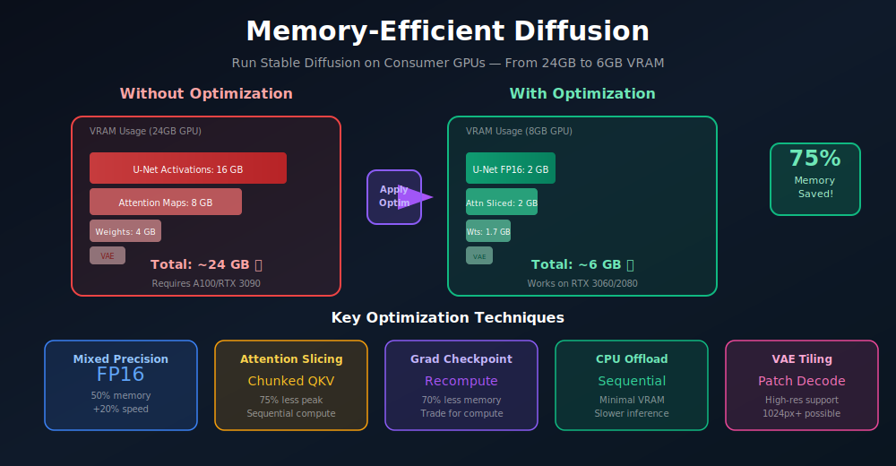
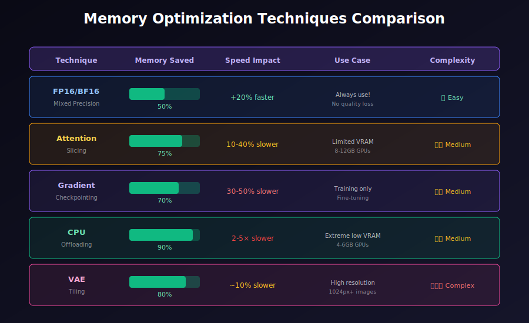
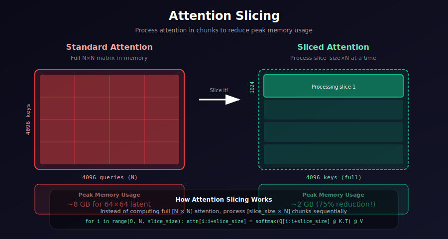

# 💾 Memory-Efficient Diffusion

<div align="center">



*Optimization Techniques for Running Diffusion on Consumer Hardware*

[](#)
[](#)
[](#)

</div>

---

## 🌟 Where & Why Use These Techniques?

<table>
<tr>
<th width="20%">🎯 Scenario</th>
<th width="40%">💡 Why Memory Optimization?</th>
<th width="40%">🛠️ Recommended Techniques</th>
</tr>
<tr>
<td><b>Consumer GPUs (8-12GB)</b></td>
<td>Run SD 1.5/2.0 without OOM errors</td>
<td>Attention slicing, FP16, VAE tiling</td>
</tr>
<tr>
<td><b>High-Resolution (1024+)</b></td>
<td>Memory scales quadratically with resolution</td>
<td>VAE tiling, attention slicing, CPU offload</td>
</tr>
<tr>
<td><b>Batch Generation</b></td>
<td>Generate multiple images simultaneously</td>
<td>Gradient checkpointing, mixed precision</td>
</tr>
<tr>
<td><b>Training on Limited HW</b></td>
<td>Fine-tune models with limited VRAM</td>
<td>All techniques combined, LoRA/QLoRA</td>
</tr>
<tr>
<td><b>Edge Deployment</b></td>
<td>Mobile/embedded inference</td>
<td>Quantization, model pruning</td>
</tr>
</table>

### 💡 The Memory Challenge

> **Problem**: Stable Diffusion with 512×512 images can require 20+ GB VRAM for training and 10+ GB for inference at full precision.
>
> **Solution**: Combine multiple optimization techniques to reduce memory by 70%+ while maintaining quality.

---

## 📈 Optimization Techniques Comparison

<div align="center">



</div>

---

## 📊 Memory Breakdown

### Where Memory Goes

| Component | FP32 Size | Notes |
|:----------|:---------:|:------|
| **U-Net Weights** | ~3.4 GB | ~860M parameters |
| **VAE Weights** | ~330 MB | ~83M parameters |
| **CLIP Weights** | ~500 MB | ~123M parameters |
| **Activations** | ~8-16 GB | During forward pass |
| **Attention Maps** | ~2-8 GB | Scales with resolution² |
| **Gradients** | ~3.4 GB | During training |
| **Optimizer States** | ~6.8 GB | Adam: 2× model size |

### Memory Scaling

Attention memory scales **quadratically**:

$$\text{Memory} = O(B \times H \times N^2 \times d)$$

where:
- $B$ = batch size
- $H$ = number of heads
- $N$ = sequence length (e.g., 4096 for 64×64)
- $d$ = head dimension

---

## 📐 Deep Dive: Memory Complexity Analysis

### Self-Attention Memory Breakdown

For input $X \in \mathbb{R}^{N \times d}$:

| Tensor | Shape | Memory (float32) |
|:-------|:------|:-----------------|
| Input $X$ | $N \times d$ | $4Nd$ bytes |
| Query $Q$ | $N \times d$ | $4Nd$ bytes |
| Key $K$ | $N \times d$ | $4Nd$ bytes |
| Value $V$ | $N \times d$ | $4Nd$ bytes |
| **Attention $A = QK^T$** | **$N \times N$** | **$4N^2$ bytes** |
| Output $O$ | $N \times d$ | $4Nd$ bytes |

**The bottleneck is $A$!** For $N = 4096$ (64×64 image):
$$\text{Memory}(A) = 4 \times 4096^2 = 67 \text{ MB per head}$$

With 8 heads and batch size 1: $67 \times 8 = 536$ MB just for attention matrices!

### Quadratic Growth

| Resolution | $N = H \times W$ | Attention Memory |
|:-----------|:----------------:|:----------------:|
| 32×32 | 1,024 | ~4 MB |
| 64×64 | 4,096 | ~67 MB |
| 128×128 | 16,384 | ~1 GB |
| 256×256 | 65,536 | ~17 GB |

This explains why high-resolution diffusion is challenging!

---

## 🧮 Flash Attention: IO-Aware Algorithm

### The Memory Hierarchy Problem

Modern GPUs have:
- **SRAM** (on-chip): ~20 MB, 19 TB/s bandwidth
- **HBM** (main GPU memory): ~40 GB, 1.5 TB/s bandwidth

Standard attention requires reading/writing $A$ to HBM multiple times.

### Flash Attention Algorithm

**Key insight**: Compute attention **block by block**, never materializing full $N \times N$ matrix.

$$\text{FlashAttention}: O(N^2) \text{ memory} \rightarrow O(N) \text{ memory}$$

**Algorithm** (simplified):

```
For each block of queries Q[i]:
    Initialize: m_i = -∞, l_i = 0, O_i = 0
    For each block of keys/values K[j], V[j]:
        S_ij = Q[i] @ K[j].T / √d
        m_new = max(m_i, rowmax(S_ij))
        P_ij = exp(S_ij - m_new)
        l_new = exp(m_i - m_new) * l_i + rowsum(P_ij)
        O_i = (exp(m_i - m_new) * l_i * O_i + P_ij @ V[j]) / l_new
        m_i, l_i = m_new, l_new
```

### Memory Savings

| Method | Memory | Speed |
|:-------|:------:|:-----:|
| Standard | $O(N^2)$ | 1× |
| Flash Attention | $O(N)$ | 2-4× faster |
| Flash Attention 2 | $O(N)$ | 3-5× faster |

---

## 📊 Gradient Checkpointing Mathematics

### Forward Pass Memory

Standard forward stores all activations for backward:
$$M_{forward} = \sum_{l=1}^{L} |a_l|$$

For a transformer with $L$ layers, each storing activations of size $O(Nd)$:
$$M_{forward} = O(L \cdot N \cdot d)$$

### Checkpointing Trade-off

With checkpointing every $k$ layers:
- **Memory**: Store only $L/k$ checkpoints → $O(\frac{L}{k} \cdot N \cdot d)$
- **Compute**: Recompute $k$ layers during backward → $\frac{k+1}{2}$ extra forwards on average

**Optimal checkpoint interval**: $k^* = \sqrt{L}$

$$M_{checkpoint} = O(\sqrt{L} \cdot N \cdot d)$$

### Memory-Compute Pareto

| Strategy | Memory | Extra Compute |
|:---------|:------:|:-------------:|
| No checkpointing | $L$ | 0% |
| Checkpoint every layer | $1$ | +100% |
| Checkpoint every $\sqrt{L}$ | $\sqrt{L}$ | +$\sqrt{L}/L$ |
| Selective (attention only) | ~$0.4L$ | ~+30% |

<div align="center">



</div>

---

## 🔧 Technique 1: Attention Slicing

Process attention in **chunks** instead of all at once:

### Concept

```
Standard:  Compute full [4096 × 4096] attention matrix
Sliced:    Compute [1024 × 4096] chunks sequentially
           → 75% less peak memory, ~20% slower
```

### Implementation

```python
def sliced_attention(query, key, value, slice_size=2048):
    """
    Memory-efficient attention via slicing.
    
    Instead of computing the full N×N attention matrix,
    compute it in chunks of slice_size×N.
    
    Args:
        query: [B, heads, N, d]
        key: [B, heads, N, d]
        value: [B, heads, N, d]
        slice_size: Number of queries to process at once
    
    Returns:
        Attention output [B, heads, N, d]
    """
    B, H, N, D = query.shape
    scale = D ** -0.5
    
    # Process in slices
    output_chunks = []
    
    for i in range(0, N, slice_size):
        end = min(i + slice_size, N)
        q_slice = query[:, :, i:end]  # [B, H, slice_size, D]
        
        # Compute attention for this slice against ALL keys
        attn = torch.matmul(q_slice, key.transpose(-2, -1)) * scale  # [B, H, slice, N]
        attn = F.softmax(attn, dim=-1)
        
        # Apply to values
        out_slice = torch.matmul(attn, value)  # [B, H, slice, D]
        output_chunks.append(out_slice)
    
    return torch.cat(output_chunks, dim=2)


class SlicedCrossAttention(nn.Module):
    """Cross-attention with configurable slicing."""
    
    def __init__(self, query_dim, context_dim, heads=8, dim_head=64, slice_size=None):
        super().__init__()
        self.heads = heads
        self.dim_head = dim_head
        self.slice_size = slice_size  # None = no slicing
        
        inner_dim = heads * dim_head
        self.to_q = nn.Linear(query_dim, inner_dim, bias=False)
        self.to_k = nn.Linear(context_dim, inner_dim, bias=False)
        self.to_v = nn.Linear(context_dim, inner_dim, bias=False)
        self.to_out = nn.Linear(inner_dim, query_dim)
    
    def forward(self, x, context):
        B, N, _ = x.shape
        
        q = self.to_q(x).view(B, N, self.heads, self.dim_head).permute(0, 2, 1, 3)
        k = self.to_k(context).view(B, -1, self.heads, self.dim_head).permute(0, 2, 1, 3)
        v = self.to_v(context).view(B, -1, self.heads, self.dim_head).permute(0, 2, 1, 3)
        
        if self.slice_size is not None:
            out = sliced_attention(q, k, v, self.slice_size)
        else:
            # Standard attention
            attn = torch.matmul(q, k.transpose(-2, -1)) * (self.dim_head ** -0.5)
            attn = F.softmax(attn, dim=-1)
            out = torch.matmul(attn, v)
        
        out = out.permute(0, 2, 1, 3).reshape(B, N, -1)
        return self.to_out(out)
```

### Memory Savings

| Slice Size | Peak Memory | Speed Impact |
|:-----------|:-----------:|:------------:|
| None (full) | 100% | 1.0× |
| 2048 | 50% | 1.1× slower |
| 1024 | 25% | 1.2× slower |
| 512 | 12.5% | 1.4× slower |

---

## 🔧 Technique 2: Gradient Checkpointing

Trade **compute for memory** during training:

### Concept

```
Standard:  Store all activations for backward pass → High memory
Checkpoint: Recompute activations during backward → Lower memory, ~30% slower
```

### Implementation

```python
from torch.utils.checkpoint import checkpoint

class CheckpointedUNet(nn.Module):
    """U-Net with gradient checkpointing for memory efficiency."""
    
    def __init__(self, base_unet, checkpoint_blocks=True):
        super().__init__()
        self.unet = base_unet
        self.checkpoint_blocks = checkpoint_blocks
    
    def forward(self, x, timestep, context):
        # Time embedding (small, no checkpointing needed)
        t_emb = self.unet.time_embedding(timestep)
        
        # Encoder path
        skip_connections = []
        for block in self.unet.down_blocks:
            if self.checkpoint_blocks:
                x = checkpoint(block, x, t_emb, context, use_reentrant=False)
            else:
                x = block(x, t_emb, context)
            skip_connections.append(x)
        
        # Middle block
        if self.checkpoint_blocks:
            x = checkpoint(self.unet.mid_block, x, t_emb, context, use_reentrant=False)
        else:
            x = self.unet.mid_block(x, t_emb, context)
        
        # Decoder path
        for block in self.unet.up_blocks:
            skip = skip_connections.pop()
            x = torch.cat([x, skip], dim=1)
            
            if self.checkpoint_blocks:
                x = checkpoint(block, x, t_emb, context, use_reentrant=False)
            else:
                x = block(x, t_emb, context)
        
        return self.unet.out(x)


def enable_gradient_checkpointing(model):
    """Enable checkpointing on a model's transformer blocks."""
    for module in model.modules():
        if hasattr(module, 'gradient_checkpointing'):
            module.gradient_checkpointing = True
        elif isinstance(module, nn.ModuleList):
            for submodule in module:
                if hasattr(submodule, 'forward'):
                    # Wrap forward with checkpointing
                    original_forward = submodule.forward
                    submodule.forward = lambda *args, orig=original_forward, **kwargs: \
                        checkpoint(orig, *args, use_reentrant=False, **kwargs)
```

### Memory vs Compute Trade-off

| Strategy | Memory Saved | Compute Overhead |
|:---------|:------------:|:----------------:|
| No checkpointing | 0% | 0% |
| Attention only | 40-50% | 10-15% |
| All blocks | 60-70% | 30-50% |

---

## 🔧 Technique 3: Mixed Precision (FP16/BF16)

Use **half-precision** for most computations:

### Implementation

```python
from torch.cuda.amp import autocast, GradScaler

class MixedPrecisionTrainer:
    """Training with automatic mixed precision."""
    
    def __init__(self, model, optimizer, dtype=torch.float16):
        self.model = model
        self.optimizer = optimizer
        self.scaler = GradScaler()
        self.dtype = dtype
    
    def training_step(self, images, text_embeddings):
        self.optimizer.zero_grad()
        
        # Forward pass in mixed precision
        with autocast(dtype=self.dtype):
            noise_pred = self.model(images, text_embeddings)
            loss = F.mse_loss(noise_pred, target_noise)
        
        # Backward with gradient scaling
        self.scaler.scale(loss).backward()
        
        # Unscale and clip gradients
        self.scaler.unscale_(self.optimizer)
        torch.nn.utils.clip_grad_norm_(self.model.parameters(), 1.0)
        
        # Update weights
        self.scaler.step(self.optimizer)
        self.scaler.update()
        
        return loss.item()


# For inference only (simpler)
@torch.inference_mode()
def generate_fp16(model, latent, text_emb, num_steps=50):
    """FP16 inference."""
    model = model.half()
    latent = latent.half()
    text_emb = text_emb.half()
    
    for t in range(num_steps):
        noise_pred = model(latent, t, text_emb)
        latent = scheduler.step(noise_pred, t, latent)
    
    return latent.float()  # Convert back for VAE decode
```

### Precision Comparison

| Precision | Memory | Speed | Quality |
|:----------|:------:|:-----:|:-------:|
| FP32 | 100% | 1.0× | Baseline |
| FP16 | 50% | 1.2× faster | ~Same |
| BF16 | 50% | 1.2× faster | ~Same |
| INT8 | 25% | Variable | Lower |

---

## 🔧 Technique 4: CPU Offloading

Move unused components to CPU:

### Sequential Offload

```python
class SequentialOffloadPipeline:
    """
    Move model components to GPU only when needed.
    
    Order: Text Encoder → U-Net (iterative) → VAE Decoder
    """
    
    def __init__(self, text_encoder, unet, vae):
        self.text_encoder = text_encoder.cpu()
        self.unet = unet.cpu()
        self.vae = vae.cpu()
    
    @torch.inference_mode()
    def generate(self, prompt, num_steps=50, guidance_scale=7.5):
        device = 'cuda'
        
        # === Stage 1: Text Encoding ===
        self.text_encoder.to(device)
        text_emb = self.text_encoder.encode(prompt)
        uncond_emb = self.text_encoder.encode("")
        self.text_encoder.cpu()
        torch.cuda.empty_cache()
        
        # === Stage 2: Diffusion ===
        self.unet.to(device)
        latent = torch.randn(1, 4, 64, 64, device=device)
        
        for t in reversed(range(num_steps)):
            # Classifier-free guidance
            latent_input = torch.cat([latent, latent])
            context = torch.cat([uncond_emb, text_emb])
            
            noise_pred = self.unet(latent_input, t, context)
            noise_uncond, noise_cond = noise_pred.chunk(2)
            noise_pred = noise_uncond + guidance_scale * (noise_cond - noise_uncond)
            
            latent = scheduler.step(noise_pred, t, latent)
        
        self.unet.cpu()
        torch.cuda.empty_cache()
        
        # === Stage 3: Decoding ===
        self.vae.to(device)
        image = self.vae.decode(latent)
        self.vae.cpu()
        
        return image
```

### Using Accelerate Library

```python
from accelerate import cpu_offload_with_hook

def setup_model_cpu_offload(model, device='cuda:0'):
    """Setup automatic CPU offloading with accelerate."""
    
    # Offload each component with hooks
    model.text_encoder, text_hook = cpu_offload_with_hook(
        model.text_encoder, device
    )
    model.unet, unet_hook = cpu_offload_with_hook(
        model.unet, device, prev_module_hook=text_hook
    )
    model.vae, vae_hook = cpu_offload_with_hook(
        model.vae, device, prev_module_hook=unet_hook
    )
    
    return model
```

---

## 🔧 Technique 5: VAE Tiling

Decode large images in **tiles** to avoid OOM:

```python
class TiledVAEDecoder:
    """
    Decode large latents by processing tiles.
    
    Essential for high-resolution generation (1024+).
    """
    
    def __init__(self, vae, tile_size=512, tile_overlap=64):
        self.vae = vae
        self.tile_size = tile_size
        self.tile_overlap = tile_overlap
        
        # Latent tile size (8x downsampling)
        self.latent_tile_size = tile_size // 8
        self.latent_overlap = tile_overlap // 8
    
    @torch.no_grad()
    def decode(self, latent):
        """
        Decode latent by tiles with blending.
        
        Args:
            latent: [B, 4, H, W] latent tensor
        
        Returns:
            Decoded image [B, 3, H*8, W*8]
        """
        B, C, H, W = latent.shape
        
        # Output size
        out_H, out_W = H * 8, W * 8
        output = torch.zeros(B, 3, out_H, out_W, device=latent.device)
        weights = torch.zeros(B, 1, out_H, out_W, device=latent.device)
        
        # Calculate tile positions
        stride = self.latent_tile_size - self.latent_overlap
        
        for y in range(0, H, stride):
            for x in range(0, W, stride):
                # Extract tile
                y_end = min(y + self.latent_tile_size, H)
                x_end = min(x + self.latent_tile_size, W)
                
                tile = latent[:, :, y:y_end, x:x_end]
                
                # Decode tile
                decoded_tile = self.vae.decode(tile)
                
                # Create blending mask
                mask = self._create_blend_mask(decoded_tile.shape[2:])
                mask = mask.to(latent.device)
                
                # Add to output with blending
                out_y, out_x = y * 8, x * 8
                out_y_end, out_x_end = y_end * 8, x_end * 8
                
                output[:, :, out_y:out_y_end, out_x:out_x_end] += decoded_tile * mask
                weights[:, :, out_y:out_y_end, out_x:out_x_end] += mask
        
        # Normalize by weights
        output = output / (weights + 1e-8)
        
        return output
    
    def _create_blend_mask(self, size):
        """Create feathered blending mask for smooth tile boundaries."""
        H, W = size
        mask = torch.ones(1, 1, H, W)
        
        # Feather edges
        feather = self.tile_overlap * 8
        
        for i in range(feather):
            factor = i / feather
            mask[:, :, i, :] *= factor
            mask[:, :, H - i - 1, :] *= factor
            mask[:, :, :, i] *= factor
            mask[:, :, :, W - i - 1] *= factor
        
        return mask
```

---

## 📊 Combined Optimization Recipe

### For 8GB GPUs

```python
def setup_memory_efficient_pipeline(model):
    """Optimal settings for 8GB VRAM."""
    
    # 1. Enable attention slicing
    model.unet.set_attention_slice_size(1024)
    
    # 2. Use FP16
    model = model.to(torch.float16)
    
    # 3. Enable VAE tiling
    model.vae = TiledVAEDecoder(model.vae)
    
    # 4. Optional: CPU offload if still tight
    # model = setup_model_cpu_offload(model)
    
    return model


# Usage
pipe = setup_memory_efficient_pipeline(pipe)
image = pipe.generate("a beautiful sunset", num_steps=30)
```

### Memory Savings Summary

| Technique | Memory Reduction | Speed Impact |
|:----------|:----------------:|:------------:|
| FP16 | 50% | +20% faster |
| Attention Slicing | 25-50% | 10-40% slower |
| Gradient Checkpointing | 60-70% | 30-50% slower |
| CPU Offloading | 70%+ | 2-5× slower |
| VAE Tiling | Enables large images | Minimal |
| **Combined** | **~75%** | **Variable** |

---

## 🔬 Memory Profiling

```python
def profile_memory(model, input_shape, device='cuda'):
    """Profile peak memory usage."""
    torch.cuda.reset_peak_memory_stats()
    torch.cuda.empty_cache()
    
    x = torch.randn(input_shape, device=device)
    
    # Forward pass
    with torch.no_grad():
        _ = model(x)
    
    peak_memory_gb = torch.cuda.max_memory_allocated() / 1e9
    print(f"Peak memory: {peak_memory_gb:.2f} GB")
    
    return peak_memory_gb


def compare_optimization_strategies(model, input_shape):
    """Compare memory usage across strategies."""
    results = {}
    
    # Baseline
    results['baseline'] = profile_memory(model, input_shape)
    
    # FP16
    model_fp16 = model.half()
    results['fp16'] = profile_memory(model_fp16, input_shape)
    
    # Sliced attention
    model.set_attention_slice_size(1024)
    results['sliced'] = profile_memory(model, input_shape)
    
    # Print comparison
    for name, mem in results.items():
        savings = (1 - mem / results['baseline']) * 100
        print(f"{name}: {mem:.2f} GB ({savings:.1f}% saved)")
```

---

## 📚 References

1. **Dao, T., et al.** (2022). "FlashAttention: Fast and Memory-Efficient Exact Attention with IO-Awareness." *NeurIPS*. [arXiv:2205.14135](https://arxiv.org/abs/2205.14135)

2. **Chen, T., et al.** (2016). "Training Deep Nets with Sublinear Memory Cost." [arXiv:1604.06174](https://arxiv.org/abs/1604.06174)

3. **Micikevicius, P., et al.** (2018). "Mixed Precision Training." *ICLR*. [arXiv:1710.03740](https://arxiv.org/abs/1710.03740)

4. **Rajbhandari, S., et al.** (2020). "ZeRO: Memory Optimizations Toward Training Trillion Parameter Models." *SC*. [arXiv:1910.02054](https://arxiv.org/abs/1910.02054)

---

## ✏️ Exercises

1. **Implement** attention slicing and measure memory savings at different slice sizes.

2. **Profile** memory usage of a U-Net forward pass with PyTorch memory profiler.

3. **Compare** generation quality and speed with FP32 vs FP16 vs BF16.

4. **Implement** VAE tiling and generate a 2048×2048 image on an 8GB GPU.

5. **Benchmark** different combinations of optimizations and find the best trade-off for your hardware.

---

<div align="center">

**[← Previous: Cross-Attention](../04_cross_attention/)** | **[Next: Stable Diffusion Architecture →](../06_stable_diffusion_architecture/)**

*Run state-of-the-art diffusion models on consumer hardware*

</div>
