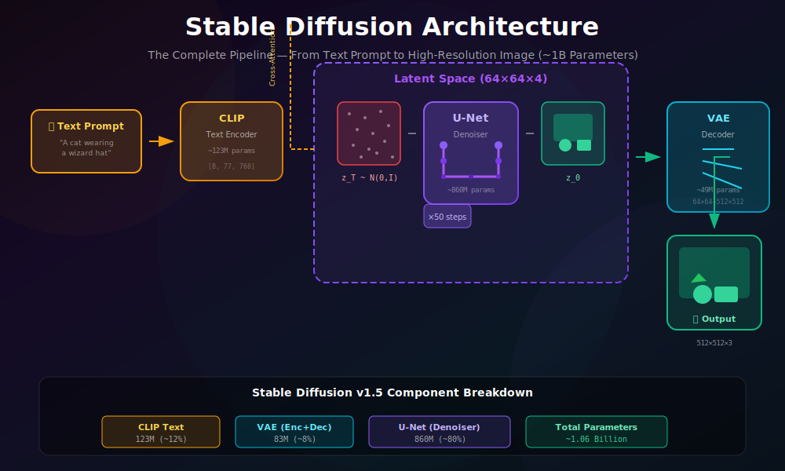
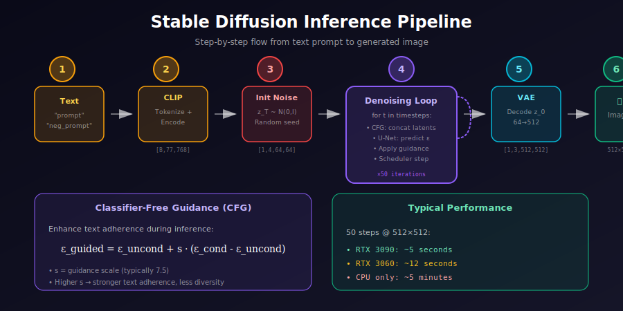

# 🏗️ Stable Diffusion Architecture

<div align="center">



*The Complete Pipeline — From Text Prompt to High-Resolution Image*

[](#)
[](#)
[](#)

</div>

---

## 🌟 Where & Why Use Stable Diffusion?

<table>
<tr>
<th width="20%">🎯 Application</th>
<th width="40%">💡 Why Stable Diffusion?</th>
<th width="40%">🌍 Real-World Examples</th>
</tr>
<tr>
<td><b>Text-to-Image</b></td>
<td>Open-source, customizable, runs locally</td>
<td>Art generation, concept visualization</td>
</tr>
<tr>
<td><b>Image Editing</b></td>
<td>Inpainting, outpainting, img2img workflows</td>
<td>Photo editing, design iteration</td>
</tr>
<tr>
<td><b>Product Design</b></td>
<td>Rapid prototyping with fine-tuned models</td>
<td>Fashion, furniture, product mockups</td>
</tr>
<tr>
<td><b>Game Assets</b></td>
<td>Generate textures, sprites, concept art</td>
<td>Indie games, asset libraries</td>
</tr>
<tr>
<td><b>Research</b></td>
<td>Baseline for diffusion research, highly documented</td>
<td>Academic papers, ablation studies</td>
</tr>
</table>

### 💡 Why Stable Diffusion Changed Everything

> **Before SD**: High-quality image generation required massive compute (DALL-E 2: proprietary, cloud-only)
>
> **After SD**: Open-source model running on consumer GPUs, spawning an ecosystem of tools, fine-tunes, and research
>
> **Key Innovation**: Latent space diffusion makes high-resolution generation **48× more efficient**

---

## 📚 Architecture Overview

Stable Diffusion consists of **four main components**:

<div align="center">

| Component | Purpose | Parameters | Input → Output |
|:----------|:--------|:----------:|:---------------|
| **VAE Encoder** | Compress image to latent | ~34M | 512×512×3 → 64×64×4 |
| **VAE Decoder** | Reconstruct from latent | ~49M | 64×64×4 → 512×512×3 |
| **U-Net** | Denoise latents | ~860M | 64×64×4 → 64×64×4 |
| **Text Encoder** | Encode text to embeddings | ~123M | 77 tokens → 77×768 |
| **Total** | | **~1B** | |

</div>

<div align="center">


</div>

---

## 🧮 Mathematical Framework

### 1. The Complete Pipeline

**Training**:
$$x \xrightarrow{\mathcal{E}} z_0 \xrightarrow{+\epsilon} z_t \xrightarrow{\epsilon_\theta} \hat{\epsilon} \xrightarrow{\mathcal{L}} \text{Loss}$$

**Inference**:
$$y \xrightarrow{\tau_\theta} c \quad \land \quad z_T \sim \mathcal{N}(0,I) \xrightarrow{\text{denoise}} z_0 \xrightarrow{\mathcal{D}} \hat{x}$$

### 2. Training Objective

$$\boxed{\mathcal{L}_{LDM} = \mathbb{E}_{z_0, \epsilon, t, c}\left[\|\epsilon - \epsilon_\theta(z_t, t, \tau_\theta(y))\|^2\right]}$$

where:
- $z_0 = \mathcal{E}(x) \cdot 0.18215$ (scaled latent)
- $z_t = \sqrt{\bar{\alpha}_t} z_0 + \sqrt{1-\bar{\alpha}_t} \epsilon$
- $c = \tau_\theta(y)$ (CLIP text embeddings)

---

## 📐 Deep Dive: Classifier-Free Guidance Derivation

### Motivation: Conditional Score

We want to sample from $p(z | c)$ where $c$ is the conditioning (text).

Using Bayes' rule:
$$\nabla_z \log p(z | c) = \nabla_z \log p(z) + \nabla_z \log p(c | z)$$

The second term $\nabla_z \log p(c | z)$ is hard to compute directly.

### Classifier Guidance (Original Approach)

Train a separate classifier $p_\phi(c | z_t)$ and use:
$$\tilde{\epsilon}_\theta = \epsilon_\theta(z_t, t) - \sqrt{1-\bar{\alpha}_t} \cdot s \cdot \nabla_z \log p_\phi(c | z_t)$$

**Problem**: Requires training an additional classifier on noisy data.

### Classifier-Free Guidance (Elegant Solution)

**Key insight**: Train the same model with and without conditioning, then extrapolate!

During training, randomly drop conditioning with probability $p_{uncond}$ (typically 10%):
$$c_{train} = \begin{cases} c & \text{with prob } 1 - p_{uncond} \\ \varnothing & \text{with prob } p_{uncond} \end{cases}$$

During inference:
$$\epsilon_{guided} = \epsilon_\theta(z_t, t, \varnothing) + s \cdot \underbrace{(\epsilon_\theta(z_t, t, c) - \epsilon_\theta(z_t, t, \varnothing))}_{\text{direction toward conditioning}}$$

### Mathematical Interpretation

The guidance direction approximates the score of the implicit classifier:
$$\epsilon_\theta(z_t, t, c) - \epsilon_\theta(z_t, t, \varnothing) \propto -\nabla_z \log p(c | z_t)$$

**Proof sketch**: Using the relationship between noise prediction and score:
$$\epsilon_\theta(z_t, t, c) = -\sqrt{1-\bar{\alpha}_t} \cdot \nabla_z \log p(z_t | c)$$

Subtracting unconditional:
$$\epsilon_\theta(z_t, t, c) - \epsilon_\theta(z_t, t, \varnothing) \propto \nabla_z \log \frac{p(z_t | c)}{p(z_t)} = \nabla_z \log p(c | z_t)$$

### Guidance Scale Effect

| Scale $s$ | Effect | Quality |
|:----------|:-------|:--------|
| $s = 1$ | No guidance | Poor text alignment |
| $s = 3-5$ | Moderate | Balanced |
| $s = 7-8$ | Strong | Good alignment, some artifacts |
| $s > 12$ | Very strong | Over-saturated, artifacts |

**Optimal range**: $s \in [7, 9]$ for most prompts.

---

## 🔢 U-Net Parameter Analysis

### Layer-wise Parameter Count

For U-Net with channels $(C_0, C_1, C_2, C_3) = (320, 640, 1280, 1280)$:

| Block | Resolution | Channels | Parameters |
|:------|:----------:|:--------:|:----------:|
| Down 1 | 64×64 | 320 | ~15M |
| Down 2 | 32×32 | 640 | ~45M |
| Down 3 | 16×16 | 1280 | ~180M |
| Down 4 | 8×8 | 1280 | ~180M |
| Mid | 8×8 | 1280 | ~120M |
| Up 4 | 8×8 | 1280 | ~200M |
| Up 3 | 16×16 | 1280 | ~200M |
| Up 2 | 32×32 | 640 | ~55M |
| Up 1 | 64×64 | 320 | ~20M |
| **Total** | - | - | **~860M** |

### Attention Computation

Cross-attention at each resolution:
$$\text{Attention}_{res} = O\left(\frac{H \cdot W}{res^2} \times L \times d\right)$$

| Resolution | Spatial | Attention FLOPs |
|:-----------|:-------:|:---------------:|
| 64×64 | 4096 | $4096 \times 77 \times 320 \approx 100M$ |
| 32×32 | 1024 | $1024 \times 77 \times 640 \approx 50M$ |
| 16×16 | 256 | $256 \times 77 \times 1280 \approx 25M$ |
| 8×8 | 64 | $64 \times 77 \times 1280 \approx 6M$ |

Most attention compute happens at **higher resolutions** (64×64, 32×32).

---

### 3. Classifier-Free Guidance

During inference, combine conditional and unconditional predictions:

$$\epsilon_{guided} = \epsilon_\theta(z_t, t, \varnothing) + s \cdot (\epsilon_\theta(z_t, t, c) - \epsilon_\theta(z_t, t, \varnothing))$$

where $s$ is the guidance scale (typically 7.5).

### 4. Latent Scaling Factor

The magic number `0.18215`:

$$z_{scaled} = z \times 0.18215$$

This ensures $\text{Var}(z_{scaled}) \approx 1$, matching the noise prior $\mathcal{N}(0, I)$.

### How 0.18215 Was Derived

Given trained VAE latents with variance $\sigma_z^2$:
$$\text{scale} = \frac{1}{\sigma_z} \approx \frac{1}{5.489} \approx 0.18215$$

This normalization is critical: if latents have variance ≠ 1, the noise schedule $\bar{\alpha}_t$ won't work correctly.

---

## 📊 Timestep Embedding Mathematics

### Sinusoidal Encoding

Timestep $t$ is encoded using sinusoidal position encoding:

$$PE(t, 2i) = \sin\left(\frac{t}{10000^{2i/d}}\right)$$
$$PE(t, 2i+1) = \cos\left(\frac{t}{10000^{2i/d}}\right)$$

where $d$ is the embedding dimension.

### Why Sinusoidal?

1. **Bounded**: Values always in $[-1, 1]$
2. **Unique**: Different timesteps get different embeddings
3. **Smooth**: Nearby timesteps have similar embeddings
4. **Learnable relationships**: $PE(t+k)$ can be represented as linear function of $PE(t)$

### Embedding MLP

The sinusoidal encoding is projected through an MLP:
$$t_{emb} = \text{SiLU}(W_2 \cdot \text{SiLU}(W_1 \cdot PE(t)))$$

This allows the model to learn task-specific timestep representations.

---

## ⚡ Inference Pipeline

<div align="center">



</div>

---

## 💻 Complete Implementation

### VAE (Autoencoder)

```python
class AutoencoderKL(nn.Module):
    """
    Variational Autoencoder for Stable Diffusion.
    
    Compresses 512×512×3 images to 64×64×4 latents.
    """
    
    def __init__(self):
        super().__init__()
        
        self.encoder = Encoder(
            in_channels=3,
            out_channels=4,
            down_block_types=["DownEncoderBlock2D"] * 4,
            block_out_channels=[128, 256, 512, 512],
            layers_per_block=2,
        )
        
        self.decoder = Decoder(
            in_channels=4,
            out_channels=3,
            up_block_types=["UpDecoderBlock2D"] * 4,
            block_out_channels=[128, 256, 512, 512],
            layers_per_block=2,
        )
        
        # Quantization convolutions
        self.quant_conv = nn.Conv2d(8, 8, 1)
        self.post_quant_conv = nn.Conv2d(4, 4, 1)
        
        self.scaling_factor = 0.18215
    
    def encode(self, x):
        """Encode image to latent distribution."""
        h = self.encoder(x)
        moments = self.quant_conv(h)
        mean, logvar = torch.chunk(moments, 2, dim=1)
        
        # Sample from distribution
        std = torch.exp(0.5 * logvar)
        z = mean + std * torch.randn_like(std)
        
        return z * self.scaling_factor
    
    def decode(self, z):
        """Decode latent to image."""
        z = z / self.scaling_factor
        z = self.post_quant_conv(z)
        return self.decoder(z)
```

### U-Net Architecture

```python
class UNet2DConditionModel(nn.Module):
    """
    U-Net with cross-attention for text conditioning.
    
    Structure:
        - 4 encoder blocks (downsampling)
        - 1 middle block
        - 4 decoder blocks (upsampling with skip connections)
        - Cross-attention at resolutions 64, 32, 16, 8
    """
    
    def __init__(
        self,
        in_channels=4,
        out_channels=4,
        block_out_channels=(320, 640, 1280, 1280),
        cross_attention_dim=768,  # CLIP embedding dim
        attention_head_dim=8,
    ):
        super().__init__()
        
        # Time embedding
        self.time_embedding = TimestepEmbedding(
            channel=320,
            time_embed_dim=1280,
        )
        
        # Input convolution
        self.conv_in = nn.Conv2d(in_channels, block_out_channels[0], 3, padding=1)
        
        # Encoder (downsampling) blocks
        self.down_blocks = nn.ModuleList([
            CrossAttnDownBlock2D(
                in_channels=block_out_channels[i-1] if i > 0 else block_out_channels[0],
                out_channels=block_out_channels[i],
                temb_channels=1280,
                cross_attention_dim=cross_attention_dim,
                num_layers=2,
                add_downsample=i < len(block_out_channels) - 1,
            )
            for i in range(len(block_out_channels))
        ])
        
        # Middle block
        self.mid_block = UNetMidBlock2DCrossAttn(
            in_channels=block_out_channels[-1],
            temb_channels=1280,
            cross_attention_dim=cross_attention_dim,
        )
        
        # Decoder (upsampling) blocks
        reversed_channels = list(reversed(block_out_channels))
        self.up_blocks = nn.ModuleList([
            CrossAttnUpBlock2D(
                in_channels=reversed_channels[i],
                out_channels=reversed_channels[i+1] if i < len(reversed_channels)-1 else reversed_channels[-1],
                prev_output_channel=reversed_channels[i-1] if i > 0 else reversed_channels[0],
                temb_channels=1280,
                cross_attention_dim=cross_attention_dim,
                num_layers=3,
                add_upsample=i < len(reversed_channels) - 1,
            )
            for i in range(len(reversed_channels))
        ])
        
        # Output
        self.conv_norm_out = nn.GroupNorm(32, block_out_channels[0])
        self.conv_out = nn.Conv2d(block_out_channels[0], out_channels, 3, padding=1)
    
    def forward(self, sample, timestep, encoder_hidden_states):
        """
        Args:
            sample: Noisy latent [B, 4, 64, 64]
            timestep: Diffusion timestep [B]
            encoder_hidden_states: Text embeddings [B, 77, 768]
        
        Returns:
            Predicted noise [B, 4, 64, 64]
        """
        # Time embedding
        t_emb = self.time_embedding(timestep)
        
        # Initial convolution
        sample = self.conv_in(sample)
        
        # Encoder path (save skip connections)
        skip_connections = [sample]
        for block in self.down_blocks:
            sample, skips = block(
                sample,
                temb=t_emb,
                encoder_hidden_states=encoder_hidden_states
            )
            skip_connections.extend(skips)
        
        # Middle block
        sample = self.mid_block(
            sample,
            temb=t_emb,
            encoder_hidden_states=encoder_hidden_states
        )
        
        # Decoder path (use skip connections)
        for block in self.up_blocks:
            # Get skip connections for this block
            n_skips = len(block.resnets)
            skips = skip_connections[-n_skips:]
            skip_connections = skip_connections[:-n_skips]
            
            sample = block(
                sample,
                res_hidden_states_tuple=tuple(skips),
                temb=t_emb,
                encoder_hidden_states=encoder_hidden_states
            )
        
        # Output
        sample = self.conv_norm_out(sample)
        sample = F.silu(sample)
        sample = self.conv_out(sample)
        
        return sample
```

### Text Encoder (CLIP)

```python
from transformers import CLIPTextModel, CLIPTokenizer

class StableDiffusionTextEncoder:
    """CLIP text encoder wrapper for Stable Diffusion."""
    
    def __init__(self, model_id="openai/clip-vit-large-patch14"):
        self.tokenizer = CLIPTokenizer.from_pretrained(model_id)
        self.text_encoder = CLIPTextModel.from_pretrained(model_id)
        self.text_encoder.eval()
    
    @torch.no_grad()
    def encode(self, prompts, device='cuda'):
        """
        Encode text prompts to embeddings.
        
        Args:
            prompts: List of strings
        
        Returns:
            Text embeddings [B, 77, 768]
        """
        # Tokenize
        text_inputs = self.tokenizer(
            prompts,
            padding="max_length",
            max_length=77,
            truncation=True,
            return_tensors="pt"
        )
        
        text_input_ids = text_inputs.input_ids.to(device)
        
        # Encode
        text_embeddings = self.text_encoder(text_input_ids)[0]
        
        return text_embeddings
```

### Complete Pipeline

```python
class StableDiffusionPipeline:
    """
    Complete Stable Diffusion inference pipeline.
    """
    
    def __init__(self, vae, text_encoder, unet, scheduler):
        self.vae = vae
        self.text_encoder = text_encoder
        self.unet = unet
        self.scheduler = scheduler
    
    @torch.no_grad()
    def __call__(
        self,
        prompt,
        negative_prompt="",
        num_inference_steps=50,
        guidance_scale=7.5,
        height=512,
        width=512,
        seed=None,
    ):
        device = self.unet.device
        
        # Set seed for reproducibility
        if seed is not None:
            torch.manual_seed(seed)
        
        # 1. Encode text
        text_embeddings = self.text_encoder.encode([prompt], device)
        uncond_embeddings = self.text_encoder.encode([negative_prompt], device)
        
        # Concatenate for classifier-free guidance
        text_embeddings = torch.cat([uncond_embeddings, text_embeddings])
        
        # 2. Prepare latents
        latent_height = height // 8
        latent_width = width // 8
        latents = torch.randn(
            1, 4, latent_height, latent_width,
            device=device,
            dtype=text_embeddings.dtype
        )
        
        # Scale latents
        latents = latents * self.scheduler.init_noise_sigma
        
        # 3. Denoising loop
        self.scheduler.set_timesteps(num_inference_steps)
        
        for t in self.scheduler.timesteps:
            # Expand latents for CFG
            latent_model_input = torch.cat([latents] * 2)
            latent_model_input = self.scheduler.scale_model_input(latent_model_input, t)
            
            # Predict noise
            noise_pred = self.unet(
                latent_model_input,
                t,
                encoder_hidden_states=text_embeddings
            )
            
            # Classifier-free guidance
            noise_pred_uncond, noise_pred_text = noise_pred.chunk(2)
            noise_pred = noise_pred_uncond + guidance_scale * (
                noise_pred_text - noise_pred_uncond
            )
            
            # Scheduler step
            latents = self.scheduler.step(noise_pred, t, latents).prev_sample
        
        # 4. Decode latents
        latents = latents / self.vae.scaling_factor
        image = self.vae.decode(latents)
        
        # Convert to PIL
        image = (image / 2 + 0.5).clamp(0, 1)
        image = image.cpu().permute(0, 2, 3, 1).numpy()
        image = (image * 255).astype(np.uint8)
        
        return Image.fromarray(image[0])
```

---

## 📊 Model Configurations

### Stable Diffusion Versions

| Version | Text Encoder | Resolution | U-Net Channels | Notes |
|:--------|:-------------|:----------:|:--------------:|:------|
| **v1.4** | CLIP ViT-L/14 | 512×512 | 320→1280 | Original public release |
| **v1.5** | CLIP ViT-L/14 | 512×512 | 320→1280 | More training steps |
| **v2.0** | OpenCLIP ViT-H/14 | 768×768 | 320→1280 | Better text understanding |
| **v2.1** | OpenCLIP ViT-H/14 | 768×768 | 320→1280 | Less restrictive |
| **XL** | Dual CLIP | 1024×1024 | 320→2560 | 3.5B params, refiner |

### SDXL Differences

```python
# SDXL uses TWO text encoders
class SDXLTextEncoder:
    def __init__(self):
        # OpenAI CLIP
        self.text_encoder_1 = CLIPTextModel.from_pretrained(
            "openai/clip-vit-large-patch14"
        )
        # OpenCLIP ViT-bigG
        self.text_encoder_2 = CLIPTextModelWithProjection.from_pretrained(
            "laion/CLIP-ViT-bigG-14-laion2B-39B-b160k"
        )
    
    def encode(self, prompt):
        emb1 = self.text_encoder_1(prompt)  # [B, 77, 768]
        emb2 = self.text_encoder_2(prompt)  # [B, 77, 1280]
        return torch.cat([emb1, emb2], dim=-1)  # [B, 77, 2048]
```

---

## 🔧 Common Applications

### Image-to-Image

```python
def img2img(self, init_image, prompt, strength=0.75, **kwargs):
    """
    Start from an existing image instead of noise.
    
    Args:
        init_image: PIL Image or tensor
        strength: How much to change (0=no change, 1=full generation)
    """
    # Encode init image to latent
    init_latent = self.vae.encode(preprocess(init_image))
    
    # Add noise according to strength
    noise = torch.randn_like(init_latent)
    timestep = int(self.scheduler.num_train_timesteps * strength)
    noisy_latent = self.scheduler.add_noise(init_latent, noise, timestep)
    
    # Denoise from this point
    # ... (rest of pipeline starting from noisy_latent)
```

### Inpainting

```python
def inpaint(self, image, mask, prompt, **kwargs):
    """
    Fill masked regions with generated content.
    """
    # Encode image
    latent = self.vae.encode(image)
    
    # Resize mask to latent size
    mask_latent = F.interpolate(mask, size=(64, 64))
    
    # During denoising, keep unmasked regions
    for t in timesteps:
        noise_pred = self.unet(latent, t, text_emb)
        latent_denoised = self.scheduler.step(noise_pred, t, latent)
        
        # Blend: keep original where mask=0
        latent = mask_latent * latent_denoised + (1 - mask_latent) * original_latent
```

### ControlNet

```python
class ControlNetPipeline:
    """Add spatial control via auxiliary networks."""
    
    def __init__(self, base_model, controlnet):
        self.base = base_model
        self.controlnet = controlnet
    
    def __call__(self, prompt, control_image, **kwargs):
        # Extract control features
        control_latent = self.preprocess_control(control_image)
        
        for t in timesteps:
            # Get ControlNet residuals
            control_residuals = self.controlnet(
                latent, t, text_emb, control_latent
            )
            
            # Add residuals to U-Net skip connections
            noise_pred = self.base.unet(
                latent, t, text_emb,
                down_block_additional_residuals=control_residuals
            )
```

---

## 📈 Training Details

### Dataset

**LAION-5B subset**:
- ~2 billion image-text pairs
- Filtered by CLIP score (> 0.28)
- Filtered by resolution (> 512×512)
- Filtered by aesthetic score (> 5.0)

### Hyperparameters

| Parameter | Value |
|:----------|:------|
| Training steps | ~400,000 |
| Batch size | 2048 |
| Learning rate | 1e-4 |
| EMA decay | 0.9999 |
| Noise schedule | Linear (1000 steps) |
| β range | [0.00085, 0.012] |

---

## 📚 References

1. **Rombach, R., et al.** (2022). "High-Resolution Image Synthesis with Latent Diffusion Models." *CVPR*. [arXiv:2112.10752](https://arxiv.org/abs/2112.10752)

2. **Radford, A., et al.** (2021). "Learning Transferable Visual Models From Natural Language Supervision." *ICML*. (CLIP)

3. **Podell, D., et al.** (2023). "SDXL: Improving Latent Diffusion Models for High-Resolution Image Synthesis." [arXiv:2307.01952](https://arxiv.org/abs/2307.01952)

4. **Zhang, L., et al.** (2023). "Adding Conditional Control to Text-to-Image Diffusion Models." *ICCV*. (ControlNet)

---

## ✏️ Exercises

1. **Trace** through the complete inference pipeline, noting tensor shapes at each step.

2. **Implement** image-to-image generation from scratch.

3. **Compare** outputs at different guidance scales (1, 5, 7.5, 15, 20).

4. **Analyze** attention maps to understand how different words affect different image regions.

5. **Experiment** with different schedulers (DDPM, DDIM, Euler, DPM++) and compare quality/speed.

---

<div align="center">

**[← Previous: Memory Efficient Diffusion](../05_memory_efficient_diffusion/)** | **[Back to Main →](../README.md)**

*Master the architecture that powers modern text-to-image generation*

</div>
