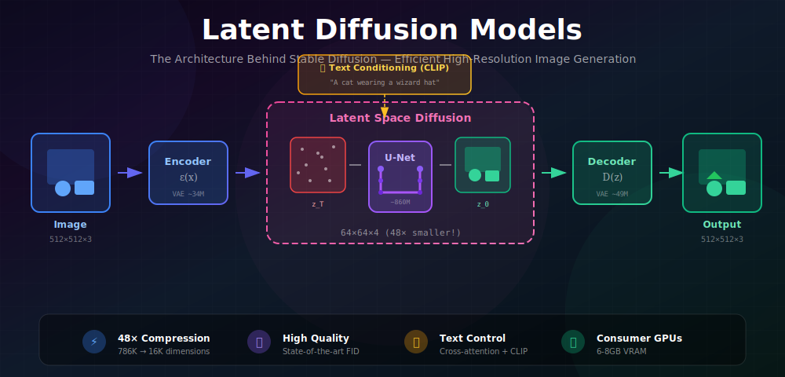
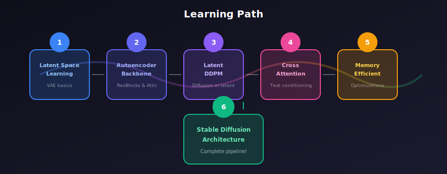

# 🖼️ Latent Diffusion Models

<div align="center">



*The Architecture Behind Stable Diffusion — Efficient High-Resolution Image Generation*

[](#)
[](#)
[](#)

</div>

---

## 🎯 Where & Why Use Latent Diffusion?

<table>
<tr>
<th width="25%">🎨 Application</th>
<th width="35%">💡 Why Latent Diffusion</th>
<th width="40%">🌍 Real-World Examples</th>
</tr>
<tr>
<td><b>Text-to-Image</b></td>
<td>High-res generation with reasonable compute</td>
<td>Stable Diffusion, DALL-E 2, Midjourney</td>
</tr>
<tr>
<td><b>Image Editing</b></td>
<td>Semantic edits in compressed space</td>
<td>InstructPix2Pix, Photoshop AI</td>
</tr>
<tr>
<td><b>Video Generation</b></td>
<td>Temporal consistency at scale</td>
<td>Stable Video Diffusion, Sora, AnimateDiff</td>
</tr>
<tr>
<td><b>Super Resolution</b></td>
<td>Upscale while adding realistic details</td>
<td>Real-ESRGAN, Stable Diffusion Upscaler</td>
</tr>
<tr>
<td><b>Inpainting</b></td>
<td>Context-aware content completion</td>
<td>SD Inpainting, Runway, Adobe Firefly</td>
</tr>
<tr>
<td><b>3D Generation</b></td>
<td>Multi-view consistency through latent space</td>
<td>Zero123, DreamFusion, Wonder3D</td>
</tr>
</table>

### 💡 The Key Insight

> **Problem:** Diffusion in pixel space is computationally expensive for high-resolution images.
> Processing 512×512×3 = 786,432 dimensions per denoising step is prohibitive!
>
> **Solution:** Compress images to a latent space first, then run diffusion there.
> 64×64×4 = 16,384 dimensions — that's **48× more efficient**!

<div align="center">

| Approach | Resolution | Dimensions | Compute | Memory |
|:---------|:----------:|:----------:|:-------:|:------:|
| Pixel Diffusion | 512×512×3 | 786,432 | ⚠️ Very high | ~24 GB |
| **Latent Diffusion** | 64×64×4 | 16,384 | ✅ **48× less** | ~6 GB |

</div>

---

## 📖 Learning Path

<div align="center">



</div>

### The Three Pillars

| Component | Purpose | Key Innovation |
|:----------|:--------|:---------------|
| 🔷 **VAE** | Compress/decompress images | Perceptual + adversarial training |
| 🔶 **U-Net** | Denoise in latent space | Cross-attention for conditioning |
| 🟣 **CLIP** | Text understanding | Bridges language and vision |

---

## 🗂️ Topics in This Module

<div align="center">

| # | Topic | Description | Key Concepts |
|:-:|:------|:------------|:-------------|
| 📐 | **[Latent Space Learning](./01_latent_space_learning/)** | VAE for compression | Perceptual loss, KL regularization |
| 🔧 | **[Autoencoder Backbone](./02_autoencoder_backbone/)** | Encoder/decoder design | ResNet blocks, attention |
| 🎲 | **[Latent DDPM](./03_latent_ddpm/)** | Diffusion in latent space | Forward/reverse process, sampling |
| 🔗 | **[Cross-Attention](./04_cross_attention/)** | Text conditioning | CLIP embeddings, Q/K/V mechanism |
| 💾 | **[Memory Efficient Diffusion](./05_memory_efficient_diffusion/)** | Practical optimizations | Slicing, checkpointing, FP16 |
| 🏗️ | **[Stable Diffusion Architecture](./06_stable_diffusion_architecture/)** | Complete pipeline | Full system integration |

</div>

---

## 🧮 Mathematical Framework

### 1. The Autoencoder (VAE)

**Encoder** $\mathcal{E}$: Compresses image to latent representation
$$z = \mathcal{E}(x), \quad x \in \mathbb{R}^{512 \times 512 \times 3} \rightarrow z \in \mathbb{R}^{64 \times 64 \times 4}$$

**Decoder** $\mathcal{D}$: Reconstructs image from latent
$$\hat{x} = \mathcal{D}(z), \quad \hat{x} \approx x$$

**Training Objective:**
$$\mathcal{L}_{AE} = \underbrace{\|x - \mathcal{D}(\mathcal{E}(x))\|}_{\text{Reconstruction}} + \underbrace{\lambda_{perc} \mathcal{L}_{LPIPS}}_{\text{Perceptual}} + \underbrace{\lambda_{KL} D_{KL}(q(z|x) \| \mathcal{N}(0,I))}_{\text{Regularization}} + \underbrace{\lambda_{GAN} \mathcal{L}_{GAN}}_{\text{Adversarial}}$$

### 2. Latent Diffusion Process

**Forward Process** (adding noise):
$$z_t = \sqrt{\bar{\alpha}_t} \cdot z_0 + \sqrt{1-\bar{\alpha}_t} \cdot \epsilon, \quad \epsilon \sim \mathcal{N}(0, I)$$

**Training Objective** (predict the noise):
$$\mathcal{L}_{LDM} = \mathbb{E}_{z_0, \epsilon, t, c}\left[\|\epsilon - \epsilon_\theta(z_t, t, c)\|^2\right]$$

where $c = \tau_\theta(y)$ is the text conditioning from CLIP.

### 3. Cross-Attention for Conditioning

Text embeddings guide the denoising process:

$$\text{Attention}(Q, K, V) = \text{softmax}\left(\frac{QK^T}{\sqrt{d}}\right)V$$

where:
- $Q = W_Q \cdot \phi(z_t)$ — Queries from image features
- $K = W_K \cdot \tau_\theta(y)$ — Keys from text embeddings
- $V = W_V \cdot \tau_\theta(y)$ — Values from text embeddings

### 4. Classifier-Free Guidance

Enhance text adherence during inference:
$$\epsilon_{guided} = \epsilon_\theta(z_t, t, \varnothing) + s \cdot (\epsilon_\theta(z_t, t, c) - \epsilon_\theta(z_t, t, \varnothing))$$

where $s$ is the guidance scale (typically 7.5).

---

## 🏗️ Stable Diffusion Component Specifications

### Model Sizes (SD 1.5)

| Component | Parameters | Purpose |
|:----------|:----------:|:--------|
| **VAE Encoder** | ~34M | Image → Latent compression |
| **VAE Decoder** | ~49M | Latent → Image reconstruction |
| **U-Net** | ~860M | Noise prediction with conditioning |
| **CLIP Text Encoder** | ~123M | Text → Embedding conversion |
| **Total** | **~1B** | Complete pipeline |

### U-Net Channel Configuration

| Level | Resolution | Channels | Attention |
|:------|:----------:|:--------:|:---------:|
| Input | 64×64 | 320 | ✅ |
| Down 1 | 32×32 | 640 | ✅ |
| Down 2 | 16×16 | 1280 | ✅ |
| Down 3 | 8×8 | 1280 | ❌ |
| Middle | 8×8 | 1280 | ✅ |

---

## 📊 Two-Stage Training

### Stage 1: Train Autoencoder

```python
def train_vae(vae, dataloader, epochs=100):
    """Train VAE with perceptual and adversarial losses."""
    for epoch in range(epochs):
        for images in dataloader:
            # Encode → Decode
            posterior = vae.encode(images)
            z = posterior.sample()
            reconstructed = vae.decode(z)
            
            # Multi-term loss
            rec_loss = F.l1_loss(reconstructed, images)
            perc_loss = lpips_loss(reconstructed, images)
            kl_loss = posterior.kl().mean()
            
            loss = rec_loss + 0.5 * perc_loss + 1e-6 * kl_loss
            loss.backward()
            optimizer.step()
```

### Stage 2: Train Diffusion (Frozen VAE)

```python
def train_ldm(unet, vae, text_encoder, dataloader):
    """Train latent diffusion with frozen VAE."""
    vae.eval()  # Freeze VAE
    
    for images, captions in dataloader:
        # Encode to latent space
        with torch.no_grad():
            z = vae.encode(images).sample() * 0.18215
            text_emb = text_encoder(captions)
        
        # Standard diffusion training
        noise = torch.randn_like(z)
        t = torch.randint(0, 1000, (len(images),))
        z_noisy = sqrt_alpha_bar[t] * z + sqrt_one_minus_alpha_bar[t] * noise
        
        noise_pred = unet(z_noisy, t, text_emb)
        loss = F.mse_loss(noise_pred, noise)
        
        loss.backward()
        optimizer.step()
```

---

## ⚡ Inference Pipeline

```python
@torch.no_grad()
def generate(prompt, num_steps=50, guidance_scale=7.5):
    """Complete Stable Diffusion inference."""
    
    # 1. Encode text
    text_emb = text_encoder(prompt)
    uncond_emb = text_encoder("")  # For CFG
    
    # 2. Start from random noise
    latent = torch.randn(1, 4, 64, 64)
    
    # 3. Iterative denoising
    for t in scheduler.timesteps:
        # Classifier-free guidance
        latent_input = torch.cat([latent, latent])
        text_input = torch.cat([uncond_emb, text_emb])
        
        noise_pred = unet(latent_input, t, text_input)
        noise_uncond, noise_cond = noise_pred.chunk(2)
        noise_pred = noise_uncond + guidance_scale * (noise_cond - noise_uncond)
        
        latent = scheduler.step(noise_pred, t, latent)
    
    # 4. Decode to image
    image = vae.decode(latent / 0.18215)
    return image
```

---

## 📈 Performance Comparison

| Aspect | Pixel Diffusion | Latent Diffusion |
|:-------|:---------------:|:----------------:|
| **Training Data** | Millions | Billions possible |
| **Training Time** | Weeks on TPU pods | Days on consumer GPUs |
| **Memory (512px)** | ~24 GB | ~6 GB |
| **Max Resolution** | Limited | 512, 768, 1024+ |
| **Quality** | Excellent | Excellent |
| **Speed (50 steps)** | ~30s | ~5s |

---

## 🏆 Evolution of Latent Diffusion

| Year | Milestone | Innovation |
|:-----|:----------|:-----------|
| **Dec 2021** | LDM Paper | Original latent diffusion concept |
| **Aug 2022** | SD 1.x | Open source, 512px, CLIP conditioning |
| **Nov 2022** | SD 2.x | OpenCLIP, 768px, depth/inpainting |
| **Jul 2023** | SDXL | 1024px, dual text encoders, refiner |
| **Nov 2023** | SDXL Turbo | 1-4 step generation via distillation |
| **2024** | SD3 / Flux | DiT backbone, flow matching |

---

## 📚 References

### Foundational Papers

1. **Rombach, R., et al.** (2022). "High-Resolution Image Synthesis with Latent Diffusion Models." *CVPR*. [arXiv:2112.10752](https://arxiv.org/abs/2112.10752)

2. **Esser, P., et al.** (2021). "Taming Transformers for High-Resolution Image Synthesis." *CVPR*. [arXiv:2012.09841](https://arxiv.org/abs/2012.09841)

3. **Podell, D., et al.** (2023). "SDXL: Improving Latent Diffusion Models for High-Resolution Image Synthesis." [arXiv:2307.01952](https://arxiv.org/abs/2307.01952)

4. **Ho, J., et al.** (2020). "Denoising Diffusion Probabilistic Models." *NeurIPS*. [arXiv:2006.11239](https://arxiv.org/abs/2006.11239)

---

## ✏️ Exercises

1. **Compare** reconstruction quality of VAE vs simple downsampling/upsampling.

2. **Visualize** what different latent channels encode by zeroing them selectively.

3. **Implement** a simple latent diffusion model on MNIST (8×8 latent).

4. **Experiment** with different latent scaling factors and observe effects on generation.

5. **Analyze** cross-attention maps during text-conditioned generation to see word-region associations.

---

## 🚀 Getting Started

```bash
# Clone and setup
git clone <repository>
cd 06_latent_diffusion

# Install dependencies
pip install torch torchvision transformers diffusers accelerate

# Start with the first topic
cd 01_latent_space_learning
```

---

<div align="center">

### 📖 Learning Path

**Start Here →** [Latent Space Learning](./01_latent_space_learning/)

*Understand how to train effective autoencoders for latent diffusion*

---

**Built with 💜 for the GenAI learning community**

</div>
