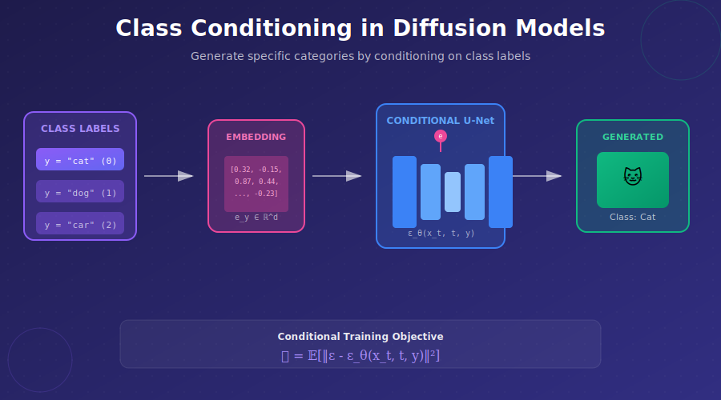

# 🎯 Class Conditioning

<div align="center">



*Control generation by conditioning on discrete class labels*

[](#)
[](#)

</div>

---

## 🎯 Where & Why: Real-World Applications

### Where is Class Conditioning Used?

| Industry | Application | Why It Matters |
|----------|-------------|----------------|
| 🎮 **Gaming** | Generate specific character types, items, environments | Create diverse game assets on-demand |
| 🏥 **Medical** | Generate synthetic X-rays of specific conditions | Train diagnostic models with balanced datasets |
| 🛒 **E-commerce** | Generate product images by category | Automated catalog expansion |
| 🎨 **Art Tools** | Generate images of specific subjects | Artist assistance tools |
| 🔬 **Research** | Controlled experiments on generation quality | Benchmark and evaluation |

### Why Learn This First?

Class conditioning is the **foundation** for all other conditioning methods:

```
Class Conditioning (discrete labels)
       ↓
Text Conditioning (continuous embeddings)
       ↓
Multi-modal Conditioning (images, audio, etc.)
```

> 💡 **Key Insight**: Once you understand how to inject discrete class information into a diffusion model, extending to text or other modalities is straightforward!

---

## 📖 Introduction

Class conditioning enables **controlled generation** of specific categories. Instead of generating random images, we can specify "generate a cat" or "generate the digit 7".

### Problem Setup

**Given:**
- Dataset of images $\{x_i\}_{i=1}^N$ with class labels $\{y_i\}_{i=1}^N$
- $y \in \{0, 1, \ldots, C-1\}$ for $C$ classes

**Goal:**
- Learn the conditional distribution $p(x|y)$
- Generate images of specific classes on demand

---

## 🧮 Mathematical Formulation

### Standard Diffusion Objective

Without conditioning:
$$\mathcal{L} = \mathbb{E}_{x_0, \epsilon, t}\left[\|\epsilon - \epsilon_\theta(x_t, t)\|^2\right]$$

### Conditional Diffusion Objective

With class conditioning:
$$\mathcal{L} = \mathbb{E}_{x_0, y, \epsilon, t}\left[\|\epsilon - \epsilon_\theta(x_t, t, y)\|^2\right]$$

The only change is that our noise predictor now takes the class label $y$ as an additional input.

---

## 🏗️ Architecture: How to Inject Class Information

### Method 1: Embedding Addition (Simple)

Convert discrete class to continuous embedding, add to time embedding:

$$e_{total} = e_t + e_y$$

where:
- $e_t = \text{MLP}(\text{sinusoidal}(t))$ — time embedding
- $e_y = \text{Embedding}(y)$ — learned class embedding

```python
class ConditionalUNet(nn.Module):
    def __init__(self, num_classes, time_dim=256):
        super().__init__()
        self.time_mlp = nn.Sequential(
            SinusoidalEmbedding(time_dim),
            nn.Linear(time_dim, time_dim * 4),
            nn.GELU(),
            nn.Linear(time_dim * 4, time_dim)
        )
        self.class_embed = nn.Embedding(num_classes, time_dim)
    
    def forward(self, x, t, y):
        t_emb = self.time_mlp(t)
        c_emb = self.class_embed(y)
        emb = t_emb + c_emb  # Simple addition
        return self.unet(x, emb)
```

### Method 2: Adaptive Normalization (AdaGN/AdaLN)

More expressive: predict per-layer scale and shift from embedding.

$$\text{AdaGN}(x, e) = \gamma(e) \cdot \text{GroupNorm}(x) + \beta(e)$$

```python
class AdaGroupNorm(nn.Module):
    def __init__(self, channels, embed_dim):
        super().__init__()
        self.norm = nn.GroupNorm(32, channels, affine=False)
        self.proj = nn.Linear(embed_dim, channels * 2)
    
    def forward(self, x, emb):
        scale_shift = self.proj(emb)
        scale, shift = scale_shift.chunk(2, dim=-1)
        scale = scale.view(-1, scale.shape[-1], 1, 1)
        shift = shift.view(-1, shift.shape[-1], 1, 1)
        return self.norm(x) * (1 + scale) + shift
```

### Method 3: Cross-Attention

Most flexible, used in larger models like DiT:

$$\text{Attention}(Q, K, V) = \text{softmax}\left(\frac{QK^T}{\sqrt{d}}\right)V$$

where $K, V$ come from class embeddings.

---

## 🔧 Training with Label Dropout (for CFG)

To enable **Classifier-Free Guidance** at inference time, randomly drop labels during training:

```python
def training_step(model, images, labels, drop_prob=0.1):
    batch_size = images.shape[0]
    
    # Randomly drop labels (replace with "null" class)
    drop_mask = torch.rand(batch_size) < drop_prob
    labels_dropped = labels.clone()
    labels_dropped[drop_mask] = num_classes  # Special null token
    
    t = torch.randint(0, num_steps, (batch_size,))
    noise = torch.randn_like(images)
    x_t = q_sample(images, t, noise)
    
    noise_pred = model(x_t, t, labels_dropped)
    loss = F.mse_loss(noise_pred, noise)
    return loss
```

---

## 🎲 Sampling with Classifier-Free Guidance

At inference, amplify the conditioning signal:

$$\tilde{\epsilon}_\theta = \epsilon_\theta(x_t, t, \varnothing) + w \cdot (\epsilon_\theta(x_t, t, y) - \epsilon_\theta(x_t, t, \varnothing))$$

where $w > 1$ strengthens adherence to the class.

```python
@torch.no_grad()
def sample_with_cfg(model, class_label, guidance_scale=7.5):
    x = torch.randn(batch_size, 3, 64, 64)
    
    for t in reversed(range(num_steps)):
        # Conditional and unconditional predictions
        noise_cond = model(x, t, class_label)
        noise_uncond = model(x, t, null_class)
        
        # CFG formula
        noise_pred = noise_uncond + guidance_scale * (noise_cond - noise_uncond)
        
        x = ddpm_step(x, noise_pred, t)
    
    return x
```

---

## 📊 Evaluation Metrics

### Class-Conditional FID

Compute FID separately for each class:

```python
def per_class_fid(model, real_images_by_class, samples=1000):
    fids = {}
    for class_idx in range(num_classes):
        generated = sample_class(model, class_idx, samples)
        fids[class_idx] = compute_fid(generated, real_images_by_class[class_idx])
    return fids
```

### Classification Accuracy

Use a pretrained classifier to check if generated images match their conditioning:

$$\text{Accuracy} = \frac{1}{N}\sum_{i=1}^N \mathbb{1}[\text{Classifier}(G(z, y_i)) = y_i]$$

---

## 🏆 Best Practices

| Practice | Why |
|----------|-----|
| **Initialize embeddings with small variance** | Prevents disrupting pretrained weights |
| **Use label dropout (10-20%)** | Enables CFG at inference |
| **Balance classes during training** | Prevents mode collapse to majority class |
| **Start with embedding addition** | Simple and effective baseline |

---

## 📚 Key Equations Summary

| Concept | Equation |
|---------|----------|
| **Conditional Loss** | $\mathcal{L} = \mathbb{E}[\|\epsilon - \epsilon_\theta(x_t, t, y)\|^2]$ |
| **Embedding Combination** | $e = e_t + e_y$ |
| **AdaGN** | $\gamma(e) \cdot \text{Norm}(x) + \beta(e)$ |
| **CFG** | $\tilde{\epsilon} = \epsilon_\varnothing + w(\epsilon_y - \epsilon_\varnothing)$ |

---

## 📖 References

1. **Ho, J., & Salimans, T.** (2022). "Classifier-Free Diffusion Guidance." *NeurIPS Workshop*. [arXiv:2207.12598](https://arxiv.org/abs/2207.12598)

2. **Peebles, W., & Xie, S.** (2023). "Scalable Diffusion Models with Transformers (DiT)." *ICCV*. [arXiv:2212.09748](https://arxiv.org/abs/2212.09748)

3. **Dhariwal, P., & Nichol, A.** (2021). "Diffusion Models Beat GANs on Image Synthesis." *NeurIPS*. [arXiv:2105.05233](https://arxiv.org/abs/2105.05233)

---

## ✏️ Exercises

<details>
<summary><b>Exercise 1:</b> Implement class-conditional DDPM on MNIST</summary>

**Task:** Train a class-conditional diffusion model on MNIST digits.

**Steps:**
1. Implement class embedding layer
2. Add embedding to time embedding
3. Train with 10% label dropout
4. Sample each digit class and visualize

**Expected:** Clear, distinct digits for each class.
</details>

<details>
<summary><b>Exercise 2:</b> Compare embedding injection methods</summary>

**Task:** Compare addition vs AdaGN on CIFAR-10.

**Measure:** FID, training stability, inference speed.
</details>

<details>
<summary><b>Exercise 3:</b> CFG scale ablation</summary>

**Task:** Generate images at w = {1, 3, 7, 15, 30}.

**Observe:** Quality vs diversity trade-off.
</details>

---

<div align="center">

**[← Back to Conditioning](../)** | **[Next: Text-to-Image →](../02_text_to_image/)**

</div>
