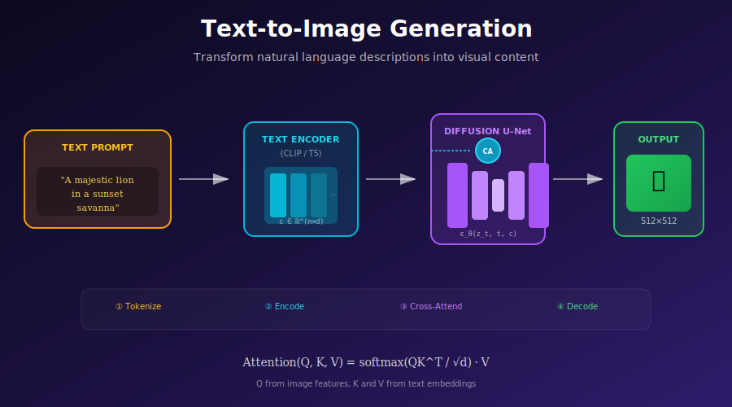

# 🖼️ Text-to-Image Generation

<div align="center">



</div>

## 📖 Introduction

Text-to-image generation is one of the most impactful applications of diffusion models, enabling users to create images from natural language descriptions. This document covers the architectures, training methods, and techniques that power modern text-to-image systems like Stable Diffusion and DALL-E.

---

## 🎯 Where & Why to Use Text-to-Image Generation

Text-to-image generation has revolutionized creative workflows and opened entirely new possibilities across industries.

### Industry Applications

| Industry | Use Case | Why Text-to-Image Works |
|----------|----------|------------------------|
| **Digital Marketing** | Ad creatives, social media content | Rapid iteration on visual concepts; A/B test hundreds of variations in minutes |
| **Game Development** | Concept art, asset prototyping | Accelerate pre-production; explore vast design spaces quickly |
| **E-commerce** | Product visualization, lifestyle shots | Generate product images before manufacturing; reduce photography costs |
| **Publishing** | Book covers, illustrations | Create unique, copyright-free visuals; match author's vision precisely |
| **Architecture** | Visualization, mood boards | Communicate design intent to clients; rapid ideation |
| **Fashion** | Design exploration, lookbooks | Prototype designs before production; generate diverse model shots |
| **Education** | Learning materials, diagrams | Create custom educational visuals; illustrate abstract concepts |
| **Entertainment** | Storyboarding, VFX previs | Speed up production pipeline; visualize scenes before shooting |

### Why Choose Text-to-Image?

Choose text-to-image generation when:

1. **Natural Language Control**: You want to describe images in plain English rather than technical parameters
2. **Creative Exploration**: You need to rapidly explore a vast design space
3. **Cost Efficiency**: Traditional photography or illustration would be prohibitively expensive
4. **Unique Content**: You need novel, non-stock imagery that doesn't exist
5. **Iteration Speed**: You need to produce and refine visual concepts quickly
6. **Accessibility**: You want to democratize image creation for non-artists

### Mathematical Foundation: Why Does It Work?

Text-to-image works by learning the conditional distribution \( p(x|c) \), where \( x \) is an image and \( c \) is text. The key insight is that CLIP-style embeddings create a **shared semantic space** where:

\[
\text{sim}(f_{\text{image}}(x), f_{\text{text}}(c)) \approx \text{semantic alignment}
\]

This means when we condition a diffusion model on text embeddings, we're guiding it toward regions of image space that are semantically aligned with the text description.

---

## 1. Overview

### 1.1 The Task

Given a text prompt $c$ (e.g., "a photo of a cat sitting on a sofa"), generate an image $x$ that matches the description:
$$x \sim p_\theta(x|c)$$

### 1.2 Key Components

1. **Text Encoder:** Convert text to embeddings
2. **Diffusion Model:** Generate image conditioned on text
3. **Cross-Attention:** Connect text and image features
4. **Guidance:** Strengthen text-image alignment

---

## 2. Text Encoding

### 2.1 CLIP Text Encoder

Most common choice due to image-text alignment:

```python
import clip

class CLIPTextEncoder:
    def __init__(self, model_name="ViT-L/14"):
        self.model, _ = clip.load(model_name)
        self.model.eval()
        self.tokenizer = clip.tokenize
    
    @torch.no_grad()
    def encode(self, text):
        tokens = self.tokenizer(text, truncate=True)
        
        # Get per-token embeddings
        x = self.model.token_embedding(tokens)
        x = x + self.model.positional_embedding
        x = x.permute(1, 0, 2)
        x = self.model.transformer(x)
        x = x.permute(1, 0, 2)
        x = self.model.ln_final(x)
        
        return x  # [B, 77, 768]
```

### 2.2 T5 Text Encoder

Alternative with better language understanding:

```python
from transformers import T5EncoderModel, T5Tokenizer

class T5TextEncoder:
    def __init__(self, model_name="google/t5-v1_1-xxl"):
        self.tokenizer = T5Tokenizer.from_pretrained(model_name)
        self.model = T5EncoderModel.from_pretrained(model_name)
    
    @torch.no_grad()
    def encode(self, text, max_length=256):
        tokens = self.tokenizer(
            text, 
            max_length=max_length,
            padding="max_length",
            truncation=True,
            return_tensors="pt"
        )
        
        outputs = self.model(
            input_ids=tokens.input_ids,
            attention_mask=tokens.attention_mask
        )
        
        return outputs.last_hidden_state  # [B, seq_len, 4096]
```

### 2.3 Dual Encoders (SDXL)

```python
class DualTextEncoder:
    def __init__(self):
        self.clip_encoder = CLIPTextEncoder("ViT-L/14")
        self.openclip_encoder = CLIPTextEncoder("ViT-bigG/14")
    
    def encode(self, text):
        clip_emb = self.clip_encoder.encode(text)      # [B, 77, 768]
        openclip_emb = self.openclip_encoder.encode(text)  # [B, 77, 1280]
        
        # Concatenate along feature dimension
        return torch.cat([clip_emb, openclip_emb], dim=-1)  # [B, 77, 2048]
```

---

## 3. Architecture

### 3.1 U-Net with Cross-Attention

```python
class TextConditionedUNet(nn.Module):
    def __init__(self, in_channels=4, context_dim=768):
        super().__init__()
        
        # Encoder
        self.down_blocks = nn.ModuleList([
            DownBlock(320, 320, context_dim),
            DownBlock(320, 640, context_dim),
            DownBlock(640, 1280, context_dim),
            DownBlock(1280, 1280, context_dim),
        ])
        
        # Middle
        self.mid_block = MidBlock(1280, context_dim)
        
        # Decoder
        self.up_blocks = nn.ModuleList([
            UpBlock(1280, 1280, context_dim),
            UpBlock(1280, 640, context_dim),
            UpBlock(640, 320, context_dim),
            UpBlock(320, 320, context_dim),
        ])
    
    def forward(self, x, t, context):
        """
        Args:
            x: Noisy latent [B, 4, H, W]
            t: Timestep [B]
            context: Text embeddings [B, 77, 768]
        """
        t_emb = self.time_embed(t)
        
        # Encoder with skip connections
        skips = []
        for block in self.down_blocks:
            x, skip = block(x, t_emb, context)
            skips.append(skip)
        
        # Middle
        x = self.mid_block(x, t_emb, context)
        
        # Decoder
        for block in self.up_blocks:
            skip = skips.pop()
            x = block(x, skip, t_emb, context)
        
        return x
```

### 3.2 Transformer Block with Cross-Attention

```python
class SpatialTransformer(nn.Module):
    def __init__(self, channels, context_dim, num_heads=8):
        super().__init__()
        self.norm = nn.GroupNorm(32, channels)
        self.proj_in = nn.Conv2d(channels, channels, 1)
        
        self.transformer_blocks = nn.ModuleList([
            TransformerBlock(channels, context_dim, num_heads)
        ])
        
        self.proj_out = nn.Conv2d(channels, channels, 1)
    
    def forward(self, x, context):
        b, c, h, w = x.shape
        residual = x
        
        x = self.norm(x)
        x = self.proj_in(x)
        
        # Reshape for transformer
        x = x.view(b, c, h*w).permute(0, 2, 1)  # [B, H*W, C]
        
        for block in self.transformer_blocks:
            x = block(x, context)
        
        # Reshape back
        x = x.permute(0, 2, 1).view(b, c, h, w)
        x = self.proj_out(x)
        
        return x + residual
```

---

## 4. Training

### 4.1 Training Objective

$$\mathcal{L} = \mathbb{E}_{x,c,\epsilon,t}\left[\|\epsilon - \epsilon_\theta(x_t, t, \tau_\theta(c))\|^2\right]$$

where $\tau_\theta(c)$ is the text encoder output.

### 4.2 Training Loop

```python
def train_text_to_image(
    unet,
    text_encoder,
    vae,
    dataloader,
    num_epochs
):
    optimizer = AdamW(unet.parameters(), lr=1e-4)
    
    for epoch in range(num_epochs):
        for images, captions in dataloader:
            # Encode images to latent
            with torch.no_grad():
                latents = vae.encode(images).sample() * 0.18215
            
            # Encode text
            with torch.no_grad():
                text_emb = text_encoder.encode(captions)
            
            # Sample timesteps
            t = torch.randint(0, 1000, (len(images),))
            
            # Add noise
            noise = torch.randn_like(latents)
            noisy_latents = q_sample(latents, t, noise)
            
            # Predict noise
            noise_pred = unet(noisy_latents, t, text_emb)
            
            # Loss
            loss = F.mse_loss(noise_pred, noise)
            
            optimizer.zero_grad()
            loss.backward()
            optimizer.step()
```

### 4.3 Conditioning Dropout for CFG

```python
def train_step_with_cfg_dropout(unet, latents, text_emb, drop_prob=0.1):
    # Randomly drop text conditioning
    mask = torch.rand(len(latents)) < drop_prob
    
    # Replace with null embedding (zeros or learned)
    null_emb = torch.zeros_like(text_emb)
    text_emb_dropped = torch.where(
        mask[:, None, None],
        null_emb,
        text_emb
    )
    
    # Rest of training...
```

---

## 5. Inference

### 5.1 Basic Sampling

```python
@torch.no_grad()
def generate(prompt, unet, text_encoder, vae, num_steps=50):
    # Encode prompt
    text_emb = text_encoder.encode([prompt])
    
    # Start from noise
    latent = torch.randn(1, 4, 64, 64)
    
    # Denoise
    for t in tqdm(reversed(range(num_steps))):
        t_tensor = torch.tensor([t])
        noise_pred = unet(latent, t_tensor, text_emb)
        latent = ddim_step(latent, noise_pred, t)
    
    # Decode
    image = vae.decode(latent / 0.18215)
    return image
```

### 5.2 Classifier-Free Guidance

```python
@torch.no_grad()
def generate_cfg(prompt, guidance_scale=7.5, **kwargs):
    # Encode prompt and null prompt
    text_emb = text_encoder.encode([prompt])
    null_emb = text_encoder.encode([""])
    
    latent = torch.randn(1, 4, 64, 64)
    
    for t in reversed(range(num_steps)):
        t_tensor = torch.tensor([t])
        
        # Batched forward for efficiency
        latent_input = torch.cat([latent, latent])
        text_input = torch.cat([null_emb, text_emb])
        
        noise_pred = unet(latent_input, t_tensor.expand(2), text_input)
        noise_uncond, noise_cond = noise_pred.chunk(2)
        
        # Apply guidance
        noise_pred = noise_uncond + guidance_scale * (noise_cond - noise_uncond)
        
        latent = ddim_step(latent, noise_pred, t)
    
    return vae.decode(latent / 0.18215)
```

### 5.3 Negative Prompts

```python
def generate_with_negative(prompt, negative_prompt, guidance_scale=7.5):
    """Use negative prompt instead of empty string."""
    text_emb = text_encoder.encode([prompt])
    neg_emb = text_encoder.encode([negative_prompt])
    
    # ... same as CFG but use neg_emb instead of null_emb
```

---

## 6. Prompt Engineering

### 6.1 Effective Prompting

```python
# Basic structure
prompt = "subject, style, quality modifiers"

# Examples
prompts = [
    "a beautiful sunset over mountains, oil painting, highly detailed",
    "portrait of a young woman, professional photography, studio lighting",
    "futuristic city, cyberpunk style, neon lights, detailed architecture",
]
```

### 6.2 Prompt Weighting

```python
def parse_weighted_prompt(prompt):
    """Parse prompts with weight syntax: (word:weight)"""
    import re
    
    pattern = r'\(([^:]+):([0-9.]+)\)'
    
    tokens = []
    weights = []
    
    for match in re.finditer(pattern, prompt):
        token, weight = match.groups()
        tokens.append(token)
        weights.append(float(weight))
    
    return tokens, weights

def apply_prompt_weights(text_emb, token_weights):
    """Scale token embeddings by weights."""
    for i, weight in enumerate(token_weights):
        text_emb[:, i] *= weight
    return text_emb
```

### 6.3 Long Prompts

```python
def encode_long_prompt(text, max_length=77):
    """Handle prompts longer than token limit."""
    tokens = tokenizer.encode(text)
    
    if len(tokens) <= max_length:
        return text_encoder.encode([text])
    
    # Split into chunks
    chunks = []
    for i in range(0, len(tokens), max_length - 2):  # Account for special tokens
        chunk_tokens = tokens[i:i + max_length - 2]
        chunks.append(tokenizer.decode(chunk_tokens))
    
    # Encode and average
    embeddings = [text_encoder.encode([chunk]) for chunk in chunks]
    return torch.stack(embeddings).mean(dim=0)
```

---

## 7. Advanced Techniques

### 7.1 Multi-Resolution Generation

```python
def generate_highres(prompt, base_size=512, upscale_size=1024):
    """Two-stage high-resolution generation."""
    # Stage 1: Generate at base resolution
    latent_base = generate_latent(prompt, size=base_size//8)
    
    # Stage 2: Upscale and refine
    latent_upscaled = F.interpolate(
        latent_base, 
        size=upscale_size//8, 
        mode='bilinear'
    )
    
    # Add noise and denoise at higher resolution
    noise_level = 0.5
    latent_noisy = latent_upscaled + noise_level * torch.randn_like(latent_upscaled)
    
    latent_refined = denoise_from_level(latent_noisy, prompt, start_t=int(noise_level * 1000))
    
    return vae.decode(latent_refined)
```

### 7.2 Prompt Interpolation

```python
def interpolate_prompts(prompt_a, prompt_b, alpha=0.5):
    """Interpolate between two prompts."""
    emb_a = text_encoder.encode([prompt_a])
    emb_b = text_encoder.encode([prompt_b])
    
    emb_interp = (1 - alpha) * emb_a + alpha * emb_b
    
    return generate_from_embedding(emb_interp)
```

---

## 8. Common Issues

### 8.1 Text-Image Mismatch

**Problem:** Generated image doesn't match prompt
**Solutions:**
- Increase guidance scale
- Use more specific prompts
- Add quality modifiers

### 8.2 Artifacts

**Problem:** Visual artifacts in generated images
**Solutions:**
- Adjust guidance scale (try 5-15)
- Use more sampling steps
- Add negative prompts

### 8.3 Compositional Failures

**Problem:** Multiple objects/attributes mixed up
**Solutions:**
- Use structured prompts
- Attention manipulation techniques
- Generate objects separately and composite

---

## Key Components Summary

| Component | Purpose | Example |
|-----------|---------|---------|
| Text Encoder | Convert text to embeddings | CLIP ViT-L/14 |
| Cross-Attention | Connect text to image | At 64, 32, 16, 8 resolution |
| CFG | Strengthen conditioning | Scale 5-15 |
| Negative Prompt | Remove unwanted features | "blurry, low quality" |

---

## References

1. **Ramesh, A., et al.** (2022). "Hierarchical Text-Conditional Image Generation with CLIP Latents." [arXiv:2204.06125](https://arxiv.org/abs/2204.06125) (DALL-E 2)
2. **Rombach, R., et al.** (2022). "High-Resolution Image Synthesis with Latent Diffusion Models." *CVPR*. [arXiv:2112.10752](https://arxiv.org/abs/2112.10752)
3. **Saharia, C., et al.** (2022). "Photorealistic Text-to-Image Diffusion Models with Deep Language Understanding." *NeurIPS*. [arXiv:2205.11487](https://arxiv.org/abs/2205.11487) (Imagen)

---

## Exercises

1. **Implement** basic text-to-image generation with a pretrained model.

2. **Experiment** with different guidance scales and compare results.

3. **Implement** prompt weighting for emphasis control.

4. **Compare** CLIP vs T5 text encoders on the same prompts.

5. **Build** a prompt interpolation visualization tool.

---

<div align="center">

**[← Class Conditioning](../01_class_conditioning/)** | **[Next: CLIP Models →](../03_clip_models/)**

</div>
