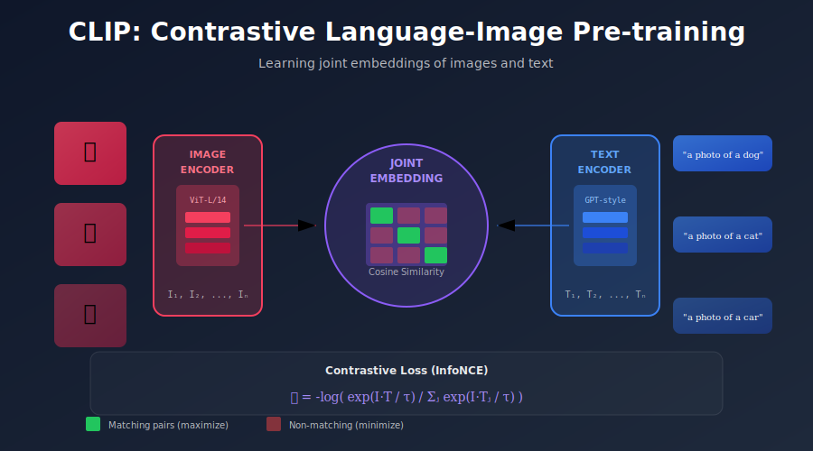

# 🔗 CLIP Models

<div align="center">



</div>

## 📖 Introduction

CLIP (Contrastive Language-Image Pre-training) is foundational to modern text-to-image systems. It provides the text encoder that creates meaningful embeddings for conditioning diffusion models. This document covers CLIP's architecture, how it's used in diffusion models, and its variants.

---

## 🎯 Where & Why to Use CLIP Models

CLIP has become a cornerstone of modern AI systems, extending far beyond its original image classification purpose.

### Real-World Applications

| Application | How CLIP Is Used | Why It's Effective |
|-------------|------------------|-------------------|
| **Text-to-Image Generation** | Text encoder for Stable Diffusion, DALL-E | Creates semantically meaningful embeddings that guide image generation |
| **Image Search & Retrieval** | Zero-shot image search with natural language queries | No need for labeled training data; searches by meaning not keywords |
| **Content Moderation** | Detect inappropriate content without explicit labels | Generalizes to new categories without retraining |
| **Image Captioning** | Guide caption generation with image embeddings | Provides strong visual understanding for language models |
| **Visual Question Answering** | Joint embedding for image-text reasoning | Understands relationships between visual and textual concepts |
| **Zero-Shot Classification** | Classify images into arbitrary categories | No training required; just provide category names |
| **Aesthetic Scoring** | Predict image quality and aesthetics | Fine-tuned CLIP correlates with human preferences |
| **Image Editing Guidance** | Direct image manipulation via text | CLIP loss guides optimization toward text descriptions |

### The Mathematical Magic Behind CLIP

CLIP's power comes from learning a **joint embedding space** where related images and text are close together:

**Contrastive Learning Objective:**

For a batch of \( N \) image-text pairs, CLIP maximizes agreement between matching pairs while minimizing it for non-matching pairs:

\[
\mathcal{L} = -\frac{1}{2N}\sum_{i=1}^{N}\left[\log\frac{\exp(\langle z_i^I, z_i^T \rangle / \tau)}{\sum_{j=1}^{N} \exp(\langle z_i^I, z_j^T \rangle / \tau)} + \log\frac{\exp(\langle z_i^T, z_i^I \rangle / \tau)}{\sum_{j=1}^{N} \exp(\langle z_j^T, z_i^I \rangle / \tau)}\right]
\]

Where:
- \( z^I \) = image embedding, \( z^T \) = text embedding
- \( \langle \cdot, \cdot \rangle \) = cosine similarity
- \( \tau \) = learned temperature parameter

This creates embeddings where \( \cos(z^I, z^T) \approx 1 \) for semantically matching pairs.

### Why Choose CLIP?

| Scenario | Why CLIP Is the Right Choice |
|----------|------------------------------|
| **Zero-shot tasks** | No labeled data needed; just describe categories in text |
| **Open vocabulary** | Can understand concepts never seen during training |
| **Multimodal alignment** | Bridges vision and language in a unified space |
| **Transfer learning** | Strong features transfer to many downstream tasks |
| **Interpretability** | Text queries make model behavior explainable |

---

## 1. CLIP Overview

### 1.1 Core Idea

CLIP learns aligned image-text representations through contrastive learning:
- **Image Encoder:** Maps images to embedding space
- **Text Encoder:** Maps text to same embedding space
- **Training:** Maximize similarity of matching pairs, minimize for non-matching

### 1.2 Contrastive Objective

$$\mathcal{L} = -\frac{1}{N}\sum_{i=1}^{N}\left[\log\frac{\exp(s_{i,i}/\tau)}{\sum_j \exp(s_{i,j}/\tau)} + \log\frac{\exp(s_{i,i}/\tau)}{\sum_j \exp(s_{j,i}/\tau)}\right]$$

where $s_{i,j} = \cos(f_I(x_i), f_T(c_j))$ is cosine similarity.

---

## 2. Architecture

### 2.1 Text Encoder

```python
class CLIPTextEncoder(nn.Module):
    def __init__(
        self,
        vocab_size=49408,
        embed_dim=768,
        context_length=77,
        transformer_width=768,
        transformer_heads=12,
        transformer_layers=12,
    ):
        super().__init__()
        
        # Token embeddings
        self.token_embedding = nn.Embedding(vocab_size, transformer_width)
        self.positional_embedding = nn.Parameter(
            torch.empty(context_length, transformer_width)
        )
        
        # Transformer
        self.transformer = nn.TransformerEncoder(
            nn.TransformerEncoderLayer(
                d_model=transformer_width,
                nhead=transformer_heads,
                dim_feedforward=transformer_width * 4,
                batch_first=True
            ),
            num_layers=transformer_layers
        )
        
        self.ln_final = nn.LayerNorm(transformer_width)
        self.text_projection = nn.Parameter(torch.empty(transformer_width, embed_dim))
    
    def forward(self, text_tokens):
        # Token + positional embedding
        x = self.token_embedding(text_tokens)
        x = x + self.positional_embedding
        
        # Causal mask for autoregressive behavior
        mask = self.build_causal_mask(text_tokens.shape[1])
        
        # Transformer
        x = self.transformer(x, mask=mask)
        x = self.ln_final(x)
        
        # Take features at [EOS] token position
        x = x[torch.arange(x.shape[0]), text_tokens.argmax(dim=-1)]
        
        # Project to shared embedding space
        x = x @ self.text_projection
        
        return x
    
    def build_causal_mask(self, seq_len):
        mask = torch.triu(torch.ones(seq_len, seq_len), diagonal=1)
        mask = mask.masked_fill(mask == 1, float('-inf'))
        return mask
```

### 2.2 Image Encoder (Vision Transformer)

```python
class CLIPVisionEncoder(nn.Module):
    def __init__(
        self,
        image_size=224,
        patch_size=14,
        embed_dim=768,
        transformer_width=1024,
        transformer_heads=16,
        transformer_layers=24,
    ):
        super().__init__()
        
        # Patch embedding
        self.patch_embed = nn.Conv2d(
            3, transformer_width, 
            kernel_size=patch_size, stride=patch_size
        )
        
        num_patches = (image_size // patch_size) ** 2
        
        # Class token and positional embedding
        self.class_token = nn.Parameter(torch.zeros(1, 1, transformer_width))
        self.positional_embedding = nn.Parameter(
            torch.empty(1, num_patches + 1, transformer_width)
        )
        
        # Transformer
        self.transformer = nn.TransformerEncoder(
            nn.TransformerEncoderLayer(
                d_model=transformer_width,
                nhead=transformer_heads,
                dim_feedforward=transformer_width * 4,
                batch_first=True
            ),
            num_layers=transformer_layers
        )
        
        self.ln_post = nn.LayerNorm(transformer_width)
        self.proj = nn.Parameter(torch.empty(transformer_width, embed_dim))
    
    def forward(self, images):
        # Patch embedding
        x = self.patch_embed(images)  # [B, C, H, W]
        x = x.flatten(2).transpose(1, 2)  # [B, num_patches, C]
        
        # Add class token
        cls_tokens = self.class_token.expand(x.shape[0], -1, -1)
        x = torch.cat([cls_tokens, x], dim=1)
        
        # Add positional embedding
        x = x + self.positional_embedding
        
        # Transformer
        x = self.transformer(x)
        x = self.ln_post(x[:, 0])  # Take class token
        
        # Project to shared space
        x = x @ self.proj
        
        return x
```

---

## 3. Using CLIP for Diffusion

### 3.1 Text Conditioning Pipeline

```python
class DiffusionTextConditioner:
    def __init__(self, clip_model_name="ViT-L/14"):
        self.model, self.preprocess = clip.load(clip_model_name)
        self.model.eval()
        self.tokenizer = clip.tokenize
    
    def encode_text(self, prompts):
        """Encode text for diffusion conditioning."""
        # Tokenize
        tokens = self.tokenizer(prompts, truncate=True)
        
        with torch.no_grad():
            # Get all token embeddings (not just [CLS])
            x = self.model.token_embedding(tokens)
            x = x + self.model.positional_embedding
            x = x.permute(1, 0, 2)  # [seq, batch, dim]
            x = self.model.transformer(x)
            x = x.permute(1, 0, 2)  # [batch, seq, dim]
            x = self.model.ln_final(x)
        
        return x  # Full sequence for cross-attention
```

### 3.2 Pooled vs Sequence Embeddings

```python
def get_clip_embeddings(model, text_tokens):
    """Get both pooled and sequence embeddings."""
    x = model.token_embedding(text_tokens)
    x = x + model.positional_embedding
    x = x.permute(1, 0, 2)
    x = model.transformer(x)
    x = x.permute(1, 0, 2)
    x = model.ln_final(x)
    
    # Sequence embedding for cross-attention
    sequence_emb = x  # [B, 77, 768]
    
    # Pooled embedding (at [EOS] position)
    pooled_emb = x[torch.arange(x.shape[0]), text_tokens.argmax(-1)]
    pooled_emb = pooled_emb @ model.text_projection  # [B, 768]
    
    return sequence_emb, pooled_emb
```

---

## 4. CLIP Variants

### 4.1 OpenCLIP

Open-source CLIP trained on larger datasets:

```python
import open_clip

# Available models
models = open_clip.list_pretrained()
# ['ViT-B-32', 'ViT-B-16', 'ViT-L-14', 'ViT-H-14', 'ViT-bigG-14', ...]

# Load model
model, _, preprocess = open_clip.create_model_and_transforms(
    'ViT-bigG-14',
    pretrained='laion2b_s39b_b160k'
)
tokenizer = open_clip.get_tokenizer('ViT-bigG-14')
```

### 4.2 Model Comparison

| Model | Params | Embed Dim | Training Data |
|-------|--------|-----------|---------------|
| CLIP ViT-B/32 | 151M | 512 | 400M pairs |
| CLIP ViT-L/14 | 428M | 768 | 400M pairs |
| OpenCLIP ViT-H/14 | 986M | 1024 | 2B pairs |
| OpenCLIP ViT-bigG/14 | 2.5B | 1280 | 2B pairs |

### 4.3 SD/SDXL Text Encoders

```python
# Stable Diffusion 1.x / 2.x
# Uses CLIP ViT-L/14 text encoder
text_encoder = CLIPTextModel.from_pretrained(
    "openai/clip-vit-large-patch14"
)

# Stable Diffusion XL
# Uses two text encoders
text_encoder_1 = CLIPTextModel.from_pretrained(
    "openai/clip-vit-large-patch14"
)  # 768-dim
text_encoder_2 = CLIPTextModelWithProjection.from_pretrained(
    "laion/CLIP-ViT-bigG-14-laion2B-39B-b160k"
)  # 1280-dim
```

---

## 5. CLIP for Guidance

### 5.1 CLIP Guidance (Early Approach)

```python
def clip_guided_diffusion(
    diffusion_model,
    clip_model,
    text_prompt,
    guidance_scale=100,
    num_steps=1000
):
    """Generate images guided by CLIP similarity."""
    text_features = clip_model.encode_text(clip.tokenize([text_prompt]))
    
    x = torch.randn(1, 3, 256, 256)
    
    for t in reversed(range(num_steps)):
        # Standard diffusion step
        with torch.no_grad():
            eps_pred = diffusion_model(x, t)
        
        # CLIP guidance
        with torch.enable_grad():
            x_in = x.detach().requires_grad_(True)
            
            # Get CLIP image features
            x_processed = clip_preprocess(x_in)
            image_features = clip_model.encode_image(x_processed)
            
            # Compute similarity
            similarity = (image_features @ text_features.T).sum()
            
            # Gradient
            clip_grad = torch.autograd.grad(similarity, x_in)[0]
        
        # Apply guidance
        eps_guided = eps_pred - guidance_scale * clip_grad
        
        x = diffusion_step(x, eps_guided, t)
    
    return x
```

### 5.2 CLIP Score for Evaluation

```python
def compute_clip_score(images, prompts, clip_model):
    """Compute CLIP score for generated images."""
    image_features = clip_model.encode_image(images)
    text_features = clip_model.encode_text(clip.tokenize(prompts))
    
    # Normalize
    image_features = F.normalize(image_features, dim=-1)
    text_features = F.normalize(text_features, dim=-1)
    
    # Cosine similarity
    scores = (image_features * text_features).sum(dim=-1)
    
    return scores.mean().item()
```

---

## 6. Fine-tuning CLIP

### 6.1 When to Fine-tune

- Domain-specific vocabulary (medical, technical)
- Style-specific concepts
- Personalization (specific subjects)

### 6.2 Fine-tuning Approaches

```python
def finetune_clip_text_encoder(
    text_encoder,
    train_data,
    freeze_layers=10,
    lr=1e-6
):
    """Fine-tune CLIP text encoder on domain data."""
    # Freeze early layers
    for i, layer in enumerate(text_encoder.transformer.layers):
        if i < freeze_layers:
            for param in layer.parameters():
                param.requires_grad = False
    
    optimizer = AdamW(
        filter(lambda p: p.requires_grad, text_encoder.parameters()),
        lr=lr
    )
    
    for images, captions in train_data:
        text_emb = text_encoder(captions)
        image_emb = image_encoder(images)  # Frozen
        
        # Contrastive loss
        loss = contrastive_loss(text_emb, image_emb)
        
        optimizer.zero_grad()
        loss.backward()
        optimizer.step()
```

---

## 7. Tokenization

### 7.1 CLIP Tokenizer

```python
import clip

def analyze_tokenization(text):
    """Analyze how CLIP tokenizes text."""
    tokens = clip.tokenize([text], truncate=False)
    
    # Decode tokens
    vocab = clip.simple_tokenizer.SimpleTokenizer()
    
    decoded = []
    for token_id in tokens[0]:
        if token_id == 0:
            break
        decoded.append(vocab.decoder.get(token_id.item(), f"[{token_id}]"))
    
    return decoded

# Example
print(analyze_tokenization("a photo of a cat"))
# ['<start>', 'a</w>', 'photo</w>', 'of</w>', 'a</w>', 'cat</w>', '<end>']
```

### 7.2 Handling Special Characters

```python
def clean_prompt(prompt):
    """Clean prompt for better tokenization."""
    # Remove problematic characters
    prompt = prompt.replace('\n', ' ')
    prompt = ' '.join(prompt.split())  # Normalize whitespace
    
    # Truncate if too long
    tokens = clip.tokenize([prompt], truncate=True)
    
    return prompt
```

---

## 8. Best Practices

### 8.1 Prompt Formatting

```python
# Use clear, descriptive language
good_prompts = [
    "a professional photograph of a golden retriever",
    "oil painting of a sunset over the ocean, impressionist style",
    "3D render of a futuristic car, high detail, studio lighting",
]

# Avoid
bad_prompts = [
    "dog",  # Too vague
    "a very very very beautiful amazing stunning gorgeous sunset",  # Redundant
]
```

### 8.2 Embedding Caching

```python
class CachedTextEncoder:
    def __init__(self, text_encoder, cache_size=10000):
        self.encoder = text_encoder
        self.cache = {}
        self.cache_size = cache_size
    
    def encode(self, text):
        if text in self.cache:
            return self.cache[text].clone()
        
        with torch.no_grad():
            embedding = self.encoder.encode(text)
        
        if len(self.cache) < self.cache_size:
            self.cache[text] = embedding.cpu()
        
        return embedding
```

---

## Key Concepts Summary

| Aspect | Details |
|--------|---------|
| Purpose | Aligned image-text embeddings |
| Text dim | 768 (ViT-L) or 1280 (ViT-bigG) |
| Sequence length | 77 tokens |
| Training | Contrastive on image-text pairs |
| Usage in diffusion | Cross-attention conditioning |

---

## References

1. **Radford, A., et al.** (2021). "Learning Transferable Visual Models From Natural Language Supervision." *ICML*. [arXiv:2103.00020](https://arxiv.org/abs/2103.00020)
2. **Cherti, M., et al.** (2023). "Reproducible scaling laws for contrastive language-image learning." *CVPR*. [arXiv:2212.07143](https://arxiv.org/abs/2212.07143) (OpenCLIP)
3. **Ilharco, G., et al.** (2021). "OpenCLIP." GitHub repository.

---

## Exercises

1. **Compare** embeddings from different CLIP model sizes.

2. **Visualize** the similarity matrix for a set of prompts.

3. **Implement** CLIP-guided image generation.

4. **Analyze** how different phrasings affect embeddings.

5. **Fine-tune** CLIP on a domain-specific dataset.

---

<div align="center">

**[← Text-to-Image](../02_text_to_image/)** | **[Next: Classifier-Free Guidance →](../04_classifier_free_guidance/)**

</div>
