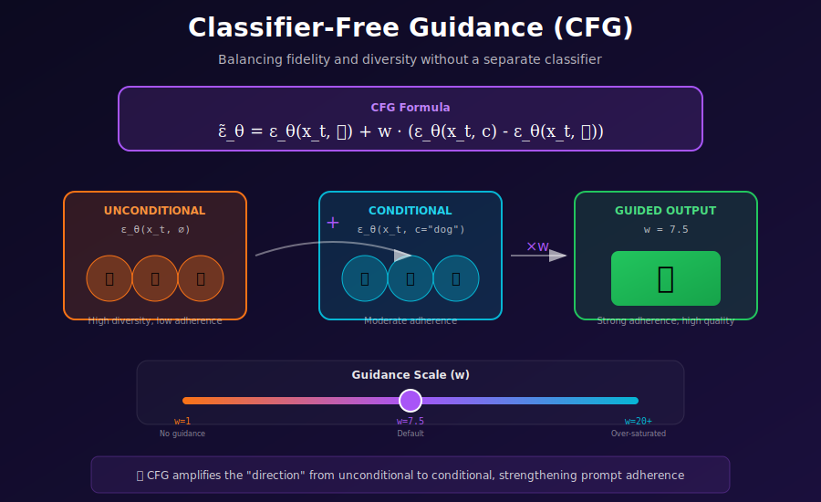

# 🆓 Classifier-Free Guidance

<div align="center">



</div>

## 📖 Introduction

**Classifier-Free Guidance (CFG)** (Ho & Salimans, 2022) enables conditional generation without a separate classifier, now the standard approach in text-to-image models like Stable Diffusion and DALL-E.

---

## 🎯 Where & Why to Use Classifier-Free Guidance

CFG is the **de facto standard** for conditional generation in modern diffusion models. Understanding when and how to use it is crucial for anyone working with generative AI.

### Real-World Applications

| Application | Why CFG Is Essential |
|-------------|---------------------|
| **Text-to-Image Generation** | Ensures generated images match text prompts accurately; the backbone of Stable Diffusion, DALL-E, Midjourney |
| **Controlled Content Creation** | Allows fine-tuning the balance between creativity (diversity) and accuracy (prompt adherence) |
| **Commercial Image Generation** | Higher guidance scales ensure brand-consistent outputs that match specifications |
| **Art & Creative Tools** | Artists can dial in exactly how much the AI should follow their prompts vs. explore |
| **Product Visualization** | Ensures generated product images match descriptions precisely |
| **Data Augmentation** | Generate class-specific training data with controllable fidelity |
| **Scientific Visualization** | Create accurate representations of concepts described in text |

### The Mathematics: Why CFG Works

**The Core Insight:**

CFG implicitly performs **guidance without a classifier** by leveraging the difference between conditional and unconditional predictions:

\[
\tilde{\epsilon}(x_t, c) = \epsilon_\theta(x_t, \varnothing) + w \cdot \underbrace{(\epsilon_\theta(x_t, c) - \epsilon_\theta(x_t, \varnothing))}_{\text{direction toward condition}}
\]

**Interpretation as Implicit Classifier Gradient:**

This is equivalent to:

\[
\nabla_{x_t} \log p(x_t | c) \approx \nabla_{x_t} \log p(x_t) + w \cdot \nabla_{x_t} \log p(c | x_t)
\]

The term \( \epsilon_\theta(x_t, c) - \epsilon_\theta(x_t, \varnothing) \) acts as a **pseudo-classifier gradient**, pointing in the direction that makes \( x_t \) more likely given condition \( c \).

**Why Scale \( w \)?**

- \( w = 1 \): Standard conditional generation
- \( w > 1 \): **Amplified** conditioning—pushes samples further toward the conditional distribution
- \( w \to \infty \): Maximizes \( p(c|x) \) but loses diversity and quality

### When to Use Different Guidance Scales

| Use Case | Recommended \( w \) | Rationale |
|----------|-------------------|-----------|
| **Exploration/Brainstorming** | 3-5 | More diversity, looser prompt adherence |
| **Standard Generation** | 7-8 | Balanced quality and adherence |
| **Precise Specifications** | 10-15 | Strong prompt following, less diversity |
| **Style Consistency** | 5-7 | Allow some artistic interpretation |
| **Technical/Product Images** | 10-12 | Accuracy over creativity |

---

## Mathematical Foundation

### The Key Idea

During training, randomly drop conditioning with probability $p_{\text{uncond}}$:
- With probability $1 - p_{\text{uncond}}$: Train $\boldsymbol{\epsilon}_\theta(\mathbf{x}_t, t, \mathbf{c})$
- With probability $p_{\text{uncond}}$: Train $\boldsymbol{\epsilon}_\theta(\mathbf{x}_t, t, \varnothing)$

### Guidance Formula

At inference, combine conditional and unconditional predictions:
$$\tilde{\boldsymbol{\epsilon}}_\theta(\mathbf{x}_t, t, \mathbf{c}) = \boldsymbol{\epsilon}_\theta(\mathbf{x}_t, t, \varnothing) + w \cdot (\boldsymbol{\epsilon}_\theta(\mathbf{x}_t, t, \mathbf{c}) - \boldsymbol{\epsilon}_\theta(\mathbf{x}_t, t, \varnothing))$$

where $w$ is the **guidance scale** (typically 7.5 for text-to-image).

### Interpretation

This is equivalent to:
$$\nabla_{\mathbf{x}_t} \log p(\mathbf{x}_t | \mathbf{c})^w$$

Higher $w$ = stronger adherence to condition, less diversity.

---

## Implementation

```python
@torch.no_grad()
def sample_cfg(
    model,
    scheduler,
    condition,      # Text embeddings
    uncond,         # Empty text embeddings
    guidance_scale=7.5,
    num_steps=50,
    shape=(1, 4, 64, 64),
    device='cuda'
):
    """Sample with classifier-free guidance."""
    
    # Start from noise
    x = torch.randn(shape, device=device)
    
    # Stack condition and unconditional for batch processing
    cond_batch = torch.cat([uncond, condition])
    
    for t in scheduler.timesteps:
        # Duplicate x for both conditional and unconditional
        x_in = torch.cat([x, x])
        t_in = torch.cat([t.unsqueeze(0), t.unsqueeze(0)])
        
        # Single forward pass for both
        noise_pred = model(x_in, t_in, cond_batch)
        
        # Split predictions
        noise_uncond, noise_cond = noise_pred.chunk(2)
        
        # Apply guidance
        noise_guided = noise_uncond + guidance_scale * (noise_cond - noise_uncond)
        
        # Scheduler step
        x = scheduler.step(noise_guided, t, x)
    
    return x
```

---

## Guidance Scale Effects

| Scale | Effect |
|-------|--------|
| w = 1 | No guidance (conditional only) |
| w = 3-5 | Mild guidance, more diverse |
| w = 7-8 | Standard (Stable Diffusion default) |
| w = 10-15 | Strong adherence, less diverse |
| w > 20 | Over-saturated, artifacts |

---

## Training with CFG

```python
def train_step_cfg(model, x, condition, p_uncond=0.1):
    """Training step with classifier-free guidance dropout."""
    batch_size = x.size(0)
    
    # Randomly drop conditioning
    mask = torch.rand(batch_size) < p_uncond
    condition_masked = condition.clone()
    condition_masked[mask] = 0  # Or use learned null embedding
    
    # Normal diffusion training
    t = torch.randint(0, num_timesteps, (batch_size,))
    noise = torch.randn_like(x)
    x_t = q_sample(x, t, noise)
    
    noise_pred = model(x_t, t, condition_masked)
    loss = F.mse_loss(noise_pred, noise)
    
    return loss
```

---

## References

1. **Ho, J., & Salimans, T.** (2022). Classifier-Free Diffusion Guidance.
   - arXiv: https://arxiv.org/abs/2207.12598

---

<div align="center">

**[← CLIP Models](../03_clip_models/)** | **[Next: Image-to-Image →](../05_image_to_image/)**

</div>
