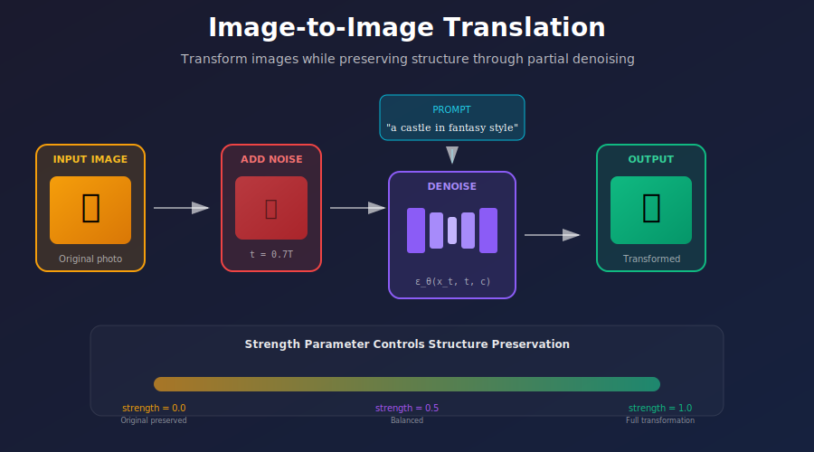
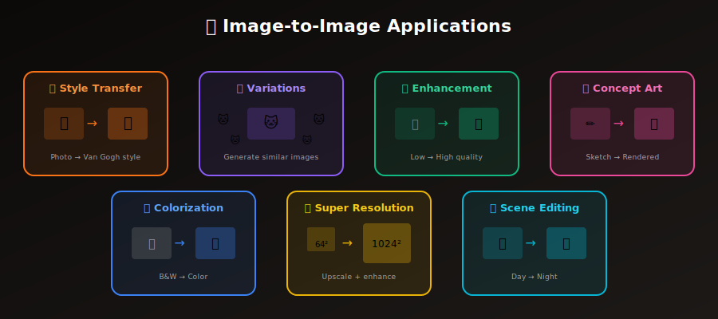
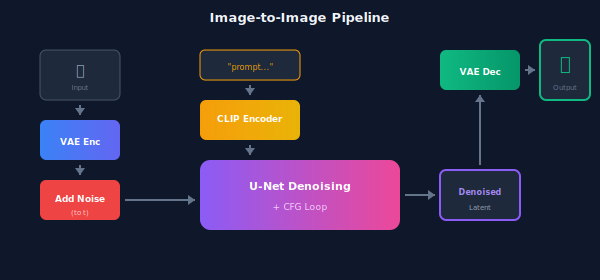

# 🖼️ Image-to-Image Generation

<div align="center">



*Transform images while preserving structure through controlled denoising*

[](#)
[](#)
[](#)

</div>

---

## 🎯 Where & Why: Real-World Applications

Image-to-image (img2img) generation has become **indispensable** across creative and commercial industries. Unlike text-to-image which creates from scratch, img2img transforms existing images—giving you control over the transformation while preserving essential structure.

### Industry Applications

<div align="center">



</div>

| Industry | Application | Why Img2Img Excels |
|----------|-------------|-------------------|
| 🎬 **Film & VFX** | Concept art iteration, matte painting enhancement | Rapid iteration on established visual direction |
| 🎮 **Game Development** | Texture refinement, asset variations | Generate consistent style variations at scale |
| 🛍️ **E-commerce** | Product photo enhancement, lifestyle shots | Transform basic photos into polished marketing assets |
| 🏠 **Architecture** | Rendering style transfer, seasonal variations | Show different moods/times without re-rendering |
| 👗 **Fashion** | Pattern transfer, color exploration | Visualize designs on existing garments |
| 📱 **Social Media** | Filter effects, artistic transformations | AI-powered photo editing for content creators |
| 🔬 **Medical Imaging** | Modality transfer, synthetic data | Generate training data while preserving anatomy |
| 🎨 **Digital Art** | Style exploration, sketch-to-painting | Bridge concept sketches to finished artwork |

### Why Use Img2Img Instead of Text-to-Image?

| Scenario | Text-to-Image | **Image-to-Image** ✓ |
|----------|---------------|---------------------|
| Maintain exact composition | ❌ Unpredictable layout | ✅ Preserves structure |
| Style transfer | ❌ Can't reference original | ✅ Keeps content, changes style |
| Iterative refinement | ❌ Each generation is new | ✅ Build upon previous results |
| Client revisions | ❌ Start over each time | ✅ Modify specific aspects |
| Consistent variations | ❌ Random differences | ✅ Controlled similarity |

### The Mathematical Insight: Why It Works

The key insight is that **partial noising creates a bridge** between the original and the generated:

$$x_t = \sqrt{\bar{\alpha}_t} \cdot x_0 + \sqrt{1-\bar{\alpha}_t} \cdot \epsilon$$

When we start denoising from timestep $t$ instead of $T$:
- **More original preserved** ($t$ small) → Minor stylistic changes
- **Less original preserved** ($t$ large) → Major transformations

> 💡 **Think of it as**: The strength parameter $s$ controls how much "memory" of the original survives through the noise.

---

## 📖 Introduction

Image-to-image generation allows using an existing image as a starting point for diffusion. Instead of starting from pure noise $x_T \sim \mathcal{N}(0, I)$, we begin with a partially noised version of the input image. This enables:

- **Style transfer** while maintaining content
- **Image variations** with controlled similarity  
- **Quality enhancement** through guided denoising
- **Concept visualization** from rough sketches

<div align="center">


</div>

---

## 🧮 Mathematical Foundation

### Core Concept: Partial Diffusion

In standard diffusion, we start from pure noise at $t = T$. In img2img, we start from a **partially noised** version of the input at some intermediate $t$:

$$x_t = \sqrt{\bar{\alpha}_t} \cdot x_0 + \sqrt{1-\bar{\alpha}_t} \cdot \epsilon, \quad \epsilon \sim \mathcal{N}(0, I)$$

The **strength parameter** $s \in [0, 1]$ determines where we start:

$$t_{\text{start}} = \lfloor s \cdot T \rfloor$$

### Strength Parameter Deep Dive

| Strength $s$ | Starting Point | Effect | Use Case |
|-------------|----------------|--------|----------|
| $s = 0.0$ | $t = 0$ | Output = Input | No change |
| $s = 0.3$ | $t = 0.3T$ | Minor adjustments | Enhancement, color correction |
| $s = 0.5$ | $t = 0.5T$ | Balanced transformation | Style transfer |
| $s = 0.7$ | $t = 0.7T$ | Major changes | Heavy stylization |
| $s = 1.0$ | $t = T$ | Full generation | Input as rough guide only |

### Information Preservation Analysis

The signal-to-noise ratio at timestep $t$:

$$\text{SNR}(t) = \frac{\bar{\alpha}_t}{1 - \bar{\alpha}_t}$$

As $t$ increases, SNR decreases exponentially—the original image information is progressively destroyed. This is why:

- **Low strength** → High SNR → Original well-preserved
- **High strength** → Low SNR → Original mostly destroyed

---

## 🏗️ Architecture & Pipeline

### Complete Img2Img Pipeline



### Implementation

```python
@torch.no_grad()
def img2img(
    model: UNet2DConditionModel,
    vae: AutoencoderKL,
    text_encoder: CLIPTextModel,
    scheduler: DDIMScheduler,
    init_image: torch.Tensor,
    prompt: str,
    strength: float = 0.75,
    num_inference_steps: int = 50,
    guidance_scale: float = 7.5,
) -> torch.Tensor:
    """
    Image-to-image generation with diffusion models.
    
    Args:
        init_image: Input image tensor [B, C, H, W] in [-1, 1]
        prompt: Text prompt for guidance
        strength: How much to transform (0=none, 1=full)
        num_inference_steps: Total denoising steps
        guidance_scale: CFG scale for prompt adherence
    
    Returns:
        Generated image tensor [B, C, H, W]
    """
    device = model.device
    batch_size = init_image.shape[0]
    
    # === Step 1: Encode input image to latent space ===
    init_latent = vae.encode(init_image).latent_dist.sample()
    init_latent = init_latent * 0.18215  # Scaling factor
    
    # === Step 2: Setup timesteps based on strength ===
    scheduler.set_timesteps(num_inference_steps)
    
    # Calculate starting timestep
    init_timestep = int(num_inference_steps * strength)
    init_timestep = min(init_timestep, num_inference_steps)
    
    t_start = max(num_inference_steps - init_timestep, 0)
    timesteps = scheduler.timesteps[t_start:]
    
    # === Step 3: Add noise to latent at starting timestep ===
    noise = torch.randn_like(init_latent)
    
    # Get the initial noised latent
    init_latent_noisy = scheduler.add_noise(
        init_latent, 
        noise, 
        timesteps[:1].repeat(batch_size)
    )
    
    # === Step 4: Encode text prompt ===
    text_input = tokenizer(
        prompt,
        padding="max_length",
        max_length=77,
        truncation=True,
        return_tensors="pt"
    ).input_ids.to(device)
    
    text_embeddings = text_encoder(text_input)[0]
    
    # For CFG: prepare unconditional embeddings
    uncond_input = tokenizer(
        "",
        padding="max_length",
        max_length=77,
        return_tensors="pt"
    ).input_ids.to(device)
    
    uncond_embeddings = text_encoder(uncond_input)[0]
    text_embeddings = torch.cat([uncond_embeddings, text_embeddings])
    
    # === Step 5: Denoising loop ===
    latent = init_latent_noisy
    
    for t in tqdm(timesteps, desc="Denoising"):
        # Duplicate latent for CFG
        latent_model_input = torch.cat([latent] * 2)
        
        # Predict noise
        noise_pred = model(
            latent_model_input,
            t,
            encoder_hidden_states=text_embeddings
        ).sample
        
        # Apply classifier-free guidance
        noise_pred_uncond, noise_pred_text = noise_pred.chunk(2)
        noise_pred = noise_pred_uncond + guidance_scale * (
            noise_pred_text - noise_pred_uncond
        )
        
        # Scheduler step
        latent = scheduler.step(noise_pred, t, latent).prev_sample
    
    # === Step 6: Decode latent to image ===
    latent = latent / 0.18215
    image = vae.decode(latent).sample
    
    return image
```

---

## 🎨 Applications & Techniques

### 1. Style Transfer

Transform the visual style while preserving content structure:

```python
def style_transfer(
    content_image: torch.Tensor,
    style_prompt: str,
    strength: float = 0.6,
    guidance_scale: float = 10.0
) -> torch.Tensor:
    """
    Transfer artistic style to an image.
    
    Higher strength = more stylization, less content preservation
    Higher guidance = stronger prompt influence
    """
    prompt = f"{style_prompt}, masterpiece, detailed, high quality"
    
    return img2img(
        init_image=content_image,
        prompt=prompt,
        strength=strength,  # 0.5-0.7 works well
        guidance_scale=guidance_scale
    )

# Example usage
style_transfer(
    content_image=photo,
    style_prompt="oil painting in the style of Van Gogh, impressionist",
    strength=0.65
)
```

### 2. Image Variations

Create variations of an image with controlled diversity:

```python
def create_variations(
    image: torch.Tensor,
    num_variations: int = 4,
    strength: float = 0.5,
    seeds: Optional[List[int]] = None
) -> List[torch.Tensor]:
    """
    Generate variations of an image with different random seeds.
    """
    variations = []
    
    for i in range(num_variations):
        if seeds:
            torch.manual_seed(seeds[i])
        
        variation = img2img(
            init_image=image,
            prompt="",  # Let the model interpret
            strength=strength,
            guidance_scale=3.0  # Lower for more diversity
        )
        variations.append(variation)
    
    return variations
```

### 3. SDEdit: Stochastic Differential Editing

The theoretical foundation from the SDEdit paper:

```python
def sdedit(
    image: torch.Tensor,
    prompt: str,
    noise_level: float = 0.5,
) -> torch.Tensor:
    """
    SDEdit: Add noise then denoise with new guidance.
    
    The noise_level controls the edit strength:
    - Low: Subtle changes, structure preserved
    - High: Major changes, structure approximated
    """
    # Encode to latent
    latent = vae.encode(image).latent_dist.sample() * 0.18215
    
    # Add noise to specific level
    t = int(noise_level * scheduler.config.num_train_timesteps)
    noise = torch.randn_like(latent)
    
    noisy_latent = (
        sqrt_alphas_cumprod[t] * latent + 
        sqrt_one_minus_alphas_cumprod[t] * noise
    )
    
    # Denoise with new prompt
    return denoise_from_timestep(noisy_latent, prompt, start_t=t)
```

### 4. DDIM Inversion for Precise Editing

For edits requiring precise reconstruction:

```python
def ddim_inversion(
    image: torch.Tensor,
    prompt: str,
    num_steps: int = 50
) -> List[torch.Tensor]:
    """
    Invert an image to its noise trajectory.
    
    Returns latents at each timestep that can be used
    for faithful reconstruction or editing.
    """
    latent = vae.encode(image).latent_dist.sample() * 0.18215
    text_emb = text_encoder(prompt)
    
    latents = [latent]
    
    # Forward DDIM (adding noise deterministically)
    for t in range(0, num_steps):
        noise_pred = unet(latent, t, text_emb)
        
        # DDIM inversion formula
        alpha_t = alphas_cumprod[t]
        alpha_next = alphas_cumprod[t + 1] if t < num_steps - 1 else 0
        
        # Predict x0
        x0_pred = (latent - sqrt(1 - alpha_t) * noise_pred) / sqrt(alpha_t)
        
        # Get next noisy latent
        latent = sqrt(alpha_next) * x0_pred + sqrt(1 - alpha_next) * noise_pred
        latents.append(latent)
    
    return latents

def edit_with_inversion(
    image: torch.Tensor,
    source_prompt: str,
    target_prompt: str
) -> torch.Tensor:
    """Edit using DDIM inversion for faithful reconstruction."""
    # Get inverted latents
    inverted = ddim_inversion(image, source_prompt)
    
    # Denoise with target prompt using inverted noise
    return denoise_with_latent_trajectory(inverted, target_prompt)
```

---

## 📊 Parameter Tuning Guide

### Strength vs Guidance Scale

```
                    Low Guidance (3-5)     High Guidance (10-15)
                    ─────────────────      ──────────────────────
Low Strength        Subtle variations      Enhanced details
(0.2-0.4)           Original preserved     Original + prompt emphasis
                    
Medium Strength     Balanced transform     Strong style transfer
(0.5-0.7)           Natural blending       Clear prompt adherence
                    
High Strength       Creative variations    New composition
(0.8-1.0)           Loose interpretation   Prompt-dominated
```

### Recommended Settings by Use Case

| Use Case | Strength | Guidance | Steps | Notes |
|----------|----------|----------|-------|-------|
| Enhancement | 0.2-0.3 | 5-7 | 30 | Preserve most detail |
| Style Transfer | 0.5-0.7 | 8-12 | 50 | Balance style/content |
| Sketch to Art | 0.6-0.8 | 10-15 | 50 | Allow creative freedom |
| Color Adjustment | 0.2-0.4 | 5-8 | 30 | Subtle changes |
| Variations | 0.4-0.6 | 3-5 | 40 | Diversity over adherence |

---

## 🔑 Key Equations Summary

| Concept | Equation | Purpose |
|---------|----------|---------|
| **Noising** | $x_t = \sqrt{\bar{\alpha}_t}x_0 + \sqrt{1-\bar{\alpha}_t}\epsilon$ | Add noise to input |
| **Strength** | $t_{\text{start}} = \lfloor s \cdot T \rfloor$ | Control transformation |
| **SNR** | $\text{SNR}(t) = \bar{\alpha}_t / (1-\bar{\alpha}_t)$ | Information preservation |
| **CFG** | $\tilde{\epsilon} = \epsilon_\varnothing + w(\epsilon_c - \epsilon_\varnothing)$ | Prompt adherence |

---

## 📚 References

1. **Meng, C., et al.** (2022). "SDEdit: Guided Image Synthesis and Editing with Stochastic Differential Equations." *ICLR*. [arXiv:2108.01073](https://arxiv.org/abs/2108.01073)

2. **Song, J., et al.** (2021). "Denoising Diffusion Implicit Models." *ICLR*. [arXiv:2010.02502](https://arxiv.org/abs/2010.02502)

3. **Rombach, R., et al.** (2022). "High-Resolution Image Synthesis with Latent Diffusion Models." *CVPR*. [arXiv:2112.10752](https://arxiv.org/abs/2112.10752)

4. **Mokady, R., et al.** (2023). "Null-text Inversion for Editing Real Images using Guided Diffusion Models." *CVPR*. [arXiv:2211.09794](https://arxiv.org/abs/2211.09794)

---

## ✏️ Exercises

<details>
<summary><b>Exercise 1:</b> Implement basic img2img and explore strength values</summary>

**Task:** Generate transformations at strengths [0.2, 0.4, 0.6, 0.8] for a single image.

**Expected Observation:** Progressive departure from original structure.

**Bonus:** Plot SNR vs strength to visualize information loss.
</details>

<details>
<summary><b>Exercise 2:</b> Build a style transfer application</summary>

**Task:** Create a pipeline that transfers these styles:
- Oil painting
- Watercolor
- Pencil sketch
- Anime/manga

**Measure:** User preference for different strength/guidance combinations.
</details>

<details>
<summary><b>Exercise 3:</b> Implement DDIM inversion</summary>

**Task:** Implement full DDIM inversion and verify you can reconstruct the original.

**Metric:** MSE between original and reconstructed should be < 0.01.
</details>

<details>
<summary><b>Exercise 4:</b> Compare samplers for img2img</summary>

**Task:** Compare DDIM, DDPM, and DPM++ for img2img quality.

**Variables:** Fix strength=0.5, vary sampler and steps.
</details>

---

<div align="center">

**[← Classifier-Free Guidance](../04_classifier_free_guidance/)** | **[Next: Inpainting & Outpainting →](../06_inpainting_outpainting/)**

</div>
