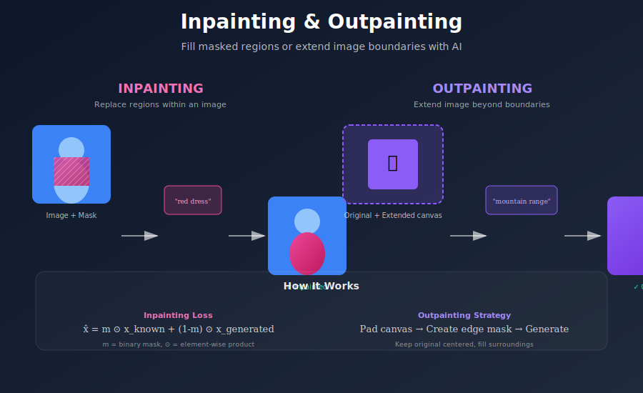
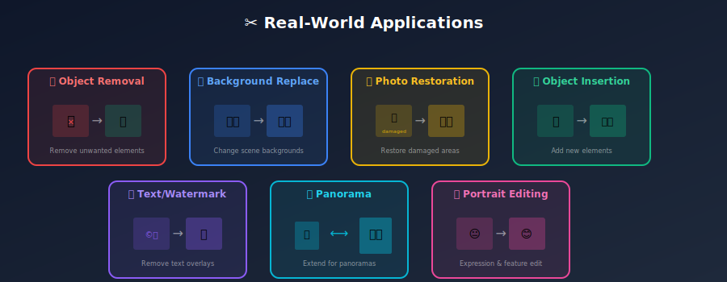
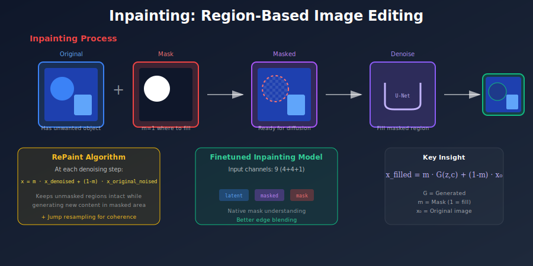
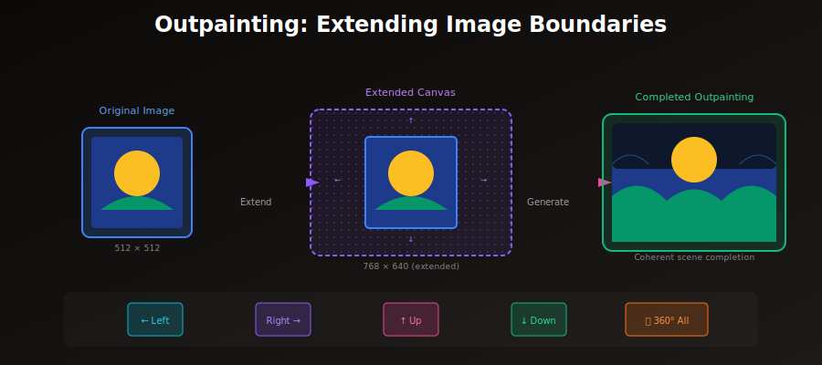

# ✂️ Inpainting & Outpainting

<div align="center">



*Fill masked regions and extend images beyond their boundaries*

[](#)
[](#)
[](#)

</div>

---

## 🎯 Where & Why: Real-World Applications

Inpainting and outpainting are among the **most commercially valuable** applications of diffusion models. They solve real problems that previously required hours of manual work by skilled artists.

### Where It's Used

<div align="center">



</div>

| Industry | Application | Business Impact |
|----------|-------------|-----------------|
| 📸 **Photography** | Remove unwanted objects, fix photo imperfections | Minutes vs hours of manual retouching |
| 🛍️ **E-commerce** | Clean product photos, extend backgrounds | Consistent product catalogs at scale |
| 🏠 **Real Estate** | Remove furniture for virtual staging, fix reflections | Faster property listings, better presentations |
| 🎬 **Film/VFX** | Remove boom mics, extend sets, fix costumes | Reduce expensive reshoots |
| 🎨 **Digital Art** | Iterate on compositions, extend canvases | Rapid creative exploration |
| 🔬 **Medical** | Generate synthetic pathologies for training | Address data scarcity in healthcare AI |
| 🗺️ **Satellite/GIS** | Fill cloud-obscured regions | Complete coverage analysis |
| 🎮 **Gaming** | Generate tileable textures, extend concept art | Accelerate asset creation |

### Why Inpainting is Revolutionary

**Before Diffusion Models:**
- Manual Photoshop work: 30-60 minutes per edit
- Required skilled artists
- Often visible artifacts at boundaries
- Limited to "clone stamp" style copying

**With Diffusion Inpainting:**
- Automatic generation: 5-30 seconds
- Understands semantic context
- Generates new, coherent content
- Can follow text prompts for what to generate

### The Mathematical Magic

The key insight is that diffusion models naturally handle **conditional generation**:

$$p(x_{\text{masked}} | x_{\text{visible}}, c)$$

By keeping the unmasked regions anchored to the original image at each denoising step, we force the model to generate content that is **coherent** with the surroundings.

> 💡 **Think of it as**: The model "sees" the context and imagines what should naturally fill the gap.

---

## 📖 Introduction

**Inpainting** fills in masked regions of an image with contextually appropriate content. **Outpainting** extends images beyond their original boundaries. Both leverage diffusion models' ability to generate coherent content conditioned on surrounding context.

<div align="center">



</div>

---

## 🧮 Mathematical Foundation

### Problem Definition

Given:
- Image $x \in \mathbb{R}^{H \times W \times 3}$ with missing regions
- Binary mask $m \in \{0, 1\}^{H \times W}$ where:
  - $m_{ij} = 1$: Region to **fill** (generate new content)
  - $m_{ij} = 0$: Region to **preserve** (keep original)

**Goal**: Generate content for masked region that:
1. Looks **realistic** and natural
2. Is **semantically coherent** with surrounding context  
3. Optionally follows a **text prompt** $c$

### Two Main Approaches

#### Approach 1: RePaint (Inference-Time Method)

No model modification needed. During each denoising step, replace known regions with noised original:

$$x_t^{\text{combined}} = m \cdot x_t^{\text{denoised}} + (1 - m) \cdot x_t^{\text{original\_noised}}$$

Where:
- $x_t^{\text{denoised}}$ = Output from one denoising step
- $x_t^{\text{original\_noised}}$ = Original image with noise added at level $t$

**Algorithm**:
```
for t = T, T-1, ..., 1:
    1. x_denoised = denoise_step(x_t, t, prompt)
    2. x_original_noised = add_noise(x_original, t)
    3. x_t-1 = mask * x_denoised + (1-mask) * x_original_noised
```

#### Approach 2: Finetuned Inpainting Model

Modify model architecture to accept mask as input:

$$\text{Input} = \text{concat}(z_t, z_{\text{masked}}, m) \in \mathbb{R}^{H \times W \times 9}$$

Where:
- $z_t$: Noisy latent (4 channels)
- $z_{\text{masked}}$: Masked image latent (4 channels)
- $m$: Downsampled mask (1 channel)

**Advantages**: Better edge blending, faster inference, more coherent results.

---

## 🏗️ Implementation

### RePaint Algorithm

```python
@torch.no_grad()
def repaint_inpainting(
    model: UNet2DConditionModel,
    vae: AutoencoderKL,
    scheduler: DDIMScheduler,
    image: torch.Tensor,
    mask: torch.Tensor,
    prompt: str,
    num_inference_steps: int = 50,
    jump_length: int = 10,
    jump_n_sample: int = 10,
    guidance_scale: float = 7.5,
) -> torch.Tensor:
    """
    RePaint: Inpainting through iterative resampling.
    
    Args:
        image: Original image [B, 3, H, W] in [-1, 1]
        mask: Binary mask [B, 1, H, W], 1 = fill region
        prompt: Text guidance for generation
        jump_length: Steps to jump back for resampling
        jump_n_sample: Number of resampling iterations
    
    Returns:
        Inpainted image [B, 3, H, W]
    """
    device = model.device
    
    # Encode original image
    original_latent = vae.encode(image).latent_dist.sample() * 0.18215
    
    # Resize mask to latent space
    mask_latent = F.interpolate(
        mask, 
        size=original_latent.shape[-2:],
        mode='nearest'
    )
    
    # Encode prompt
    text_embeddings = encode_prompt(prompt, guidance_scale > 1)
    
    # Start from pure noise
    latent = torch.randn_like(original_latent)
    
    scheduler.set_timesteps(num_inference_steps)
    
    for i, t in enumerate(scheduler.timesteps):
        # === Standard denoising step ===
        latent_input = torch.cat([latent] * 2) if guidance_scale > 1 else latent
        noise_pred = model(latent_input, t, text_embeddings).sample
        
        if guidance_scale > 1:
            noise_uncond, noise_cond = noise_pred.chunk(2)
            noise_pred = noise_uncond + guidance_scale * (noise_cond - noise_uncond)
        
        latent_denoised = scheduler.step(noise_pred, t, latent).prev_sample
        
        # === RePaint: Replace known regions ===
        noise = torch.randn_like(original_latent)
        original_noised = scheduler.add_noise(original_latent, noise, t)
        
        # Combine: generated in mask, original elsewhere
        latent = mask_latent * latent_denoised + (1 - mask_latent) * original_noised
        
        # === Jump resampling for better coherence ===
        if i < len(scheduler.timesteps) - 1:
            if (i + 1) % jump_length == 0:
                for _ in range(jump_n_sample):
                    # Jump back
                    t_jump = scheduler.timesteps[max(0, i - jump_length)]
                    latent = scheduler.add_noise(latent, torch.randn_like(latent), t_jump)
                    
                    # Re-denoise
                    for j in range(jump_length):
                        idx = min(i - jump_length + j + 1, len(scheduler.timesteps) - 1)
                        t_j = scheduler.timesteps[idx]
                        
                        latent_input = torch.cat([latent] * 2) if guidance_scale > 1 else latent
                        noise_pred = model(latent_input, t_j, text_embeddings).sample
                        
                        if guidance_scale > 1:
                            noise_uncond, noise_cond = noise_pred.chunk(2)
                            noise_pred = noise_uncond + guidance_scale * (noise_cond - noise_uncond)
                        
                        latent = scheduler.step(noise_pred, t_j, latent).prev_sample
                        
                        # Maintain known regions
                        original_noised = scheduler.add_noise(
                            original_latent, 
                            torch.randn_like(original_latent), 
                            t_j
                        )
                        latent = mask_latent * latent + (1 - mask_latent) * original_noised
    
    # Decode
    return vae.decode(latent / 0.18215).sample
```

### Finetuned Inpainting Model

```python
class InpaintingPipeline:
    """Pipeline using SD inpainting model with 9-channel input."""
    
    def __init__(self, model_id="runwayml/stable-diffusion-inpainting"):
        self.pipe = StableDiffusionInpaintPipeline.from_pretrained(model_id)
    
    @torch.no_grad()
    def __call__(
        self,
        image: Image.Image,
        mask: Image.Image,
        prompt: str,
        negative_prompt: str = "",
        num_inference_steps: int = 50,
        guidance_scale: float = 7.5,
        strength: float = 1.0,
    ) -> Image.Image:
        """
        Inpaint using finetuned model.
        
        Args:
            image: PIL image
            mask: PIL mask (white = fill)
            prompt: What to generate
            negative_prompt: What to avoid
            strength: How much to change masked region
        
        Returns:
            Inpainted PIL image
        """
        return self.pipe(
            prompt=prompt,
            negative_prompt=negative_prompt,
            image=image,
            mask_image=mask,
            num_inference_steps=num_inference_steps,
            guidance_scale=guidance_scale,
            strength=strength,
        ).images[0]
```

---

## 🖼️ Outpainting

<div align="center">



</div>

Outpainting extends images beyond their boundaries using inpainting on an expanded canvas.

### Implementation

```python
def outpaint(
    image: torch.Tensor,
    direction: str,  # 'left', 'right', 'up', 'down', 'all'
    extend_pixels: int = 256,
    prompt: str = "",
    guidance_scale: float = 7.5,
) -> torch.Tensor:
    """
    Extend image in specified direction(s).
    
    The key is creating a canvas with the original centered
    and a mask covering the extension areas.
    """
    B, C, H, W = image.shape
    
    # Calculate new dimensions
    if direction == 'right':
        new_W = W + extend_pixels
        canvas = torch.zeros(B, C, H, new_W, device=image.device)
        canvas[:, :, :, :W] = image
        mask = torch.zeros(B, 1, H, new_W, device=image.device)
        mask[:, :, :, W:] = 1
        
    elif direction == 'left':
        new_W = W + extend_pixels
        canvas = torch.zeros(B, C, H, new_W, device=image.device)
        canvas[:, :, :, extend_pixels:] = image
        mask = torch.zeros(B, 1, H, new_W, device=image.device)
        mask[:, :, :, :extend_pixels] = 1
        
    elif direction == 'up':
        new_H = H + extend_pixels
        canvas = torch.zeros(B, C, new_H, W, device=image.device)
        canvas[:, :, extend_pixels:, :] = image
        mask = torch.zeros(B, 1, new_H, W, device=image.device)
        mask[:, :, :extend_pixels, :] = 1
        
    elif direction == 'down':
        new_H = H + extend_pixels
        canvas = torch.zeros(B, C, new_H, W, device=image.device)
        canvas[:, :, :H, :] = image
        mask = torch.zeros(B, 1, new_H, W, device=image.device)
        mask[:, :, H:, :] = 1
        
    elif direction == 'all':
        # Extend in all directions
        new_H = H + 2 * extend_pixels
        new_W = W + 2 * extend_pixels
        canvas = torch.zeros(B, C, new_H, new_W, device=image.device)
        canvas[:, :, extend_pixels:extend_pixels+H, extend_pixels:extend_pixels+W] = image
        mask = torch.ones(B, 1, new_H, new_W, device=image.device)
        mask[:, :, extend_pixels:extend_pixels+H, extend_pixels:extend_pixels+W] = 0
    
    # Use inpainting to fill extended regions
    return inpaint(canvas, mask, prompt, guidance_scale)


def iterative_outpaint(
    image: torch.Tensor,
    direction: str,
    total_extend: int,
    step_size: int = 128,
    prompt: str = "",
) -> torch.Tensor:
    """
    Outpaint in multiple steps for better coherence.
    
    Large extensions are done iteratively to maintain
    context and prevent hallucinations.
    """
    current = image
    remaining = total_extend
    
    while remaining > 0:
        extend = min(step_size, remaining)
        current = outpaint(current, direction, extend, prompt)
        remaining -= extend
    
    return current
```

---

## 🎨 Mask Generation Techniques

### Automatic Mask Generation

```python
def segment_object_mask(
    image: Image.Image,
    object_description: str,
) -> torch.Tensor:
    """
    Generate mask for specific object using segmentation model.
    
    Uses SAM or similar for precise object boundaries.
    """
    # Use Grounding DINO for detection
    boxes = detect_objects(image, object_description)
    
    # Use SAM for segmentation
    masks = segment_anything(image, boxes)
    
    return masks


def brush_stroke_mask(
    size: Tuple[int, int],
    strokes: List[Tuple[Tuple[int, int], int]],  # (center, radius)
) -> torch.Tensor:
    """
    Create mask from brush strokes.
    
    Args:
        size: (H, W) of output mask
        strokes: List of (center_point, brush_radius)
    
    Returns:
        Binary mask
    """
    mask = np.zeros(size)
    
    for center, radius in strokes:
        cv2.circle(mask, center, radius, 1, -1)
    
    return torch.from_numpy(mask).unsqueeze(0).unsqueeze(0)


def random_mask_for_training(
    batch_size: int,
    size: Tuple[int, int],
    mask_type: str = 'mixed',  # 'rectangular', 'freeform', 'mixed'
) -> torch.Tensor:
    """
    Generate random masks for training inpainting models.
    
    Variety of mask types helps model generalize.
    """
    masks = torch.zeros(batch_size, 1, *size)
    
    for i in range(batch_size):
        if mask_type == 'rectangular' or (mask_type == 'mixed' and random.random() < 0.5):
            # Random rectangle
            h = random.randint(size[0] // 4, size[0] // 2)
            w = random.randint(size[1] // 4, size[1] // 2)
            top = random.randint(0, size[0] - h)
            left = random.randint(0, size[1] - w)
            masks[i, :, top:top+h, left:left+w] = 1
        else:
            # Freeform brush strokes
            mask = np.zeros(size)
            num_strokes = random.randint(1, 4)
            
            for _ in range(num_strokes):
                start = (random.randint(0, size[1]), random.randint(0, size[0]))
                
                for _ in range(random.randint(10, 30)):
                    radius = random.randint(10, 30)
                    cv2.circle(mask, start, radius, 1, -1)
                    
                    # Random walk
                    start = (
                        max(0, min(size[1]-1, start[0] + random.randint(-20, 20))),
                        max(0, min(size[0]-1, start[1] + random.randint(-20, 20)))
                    )
            
            masks[i, 0] = torch.from_numpy(mask)
    
    return masks
```

---

## 🔧 Advanced Techniques

### Blended Inpainting

Smooth boundaries by feathering the mask edges:

```python
def blended_inpaint(
    image: torch.Tensor,
    mask: torch.Tensor,
    prompt: str,
    blend_radius: int = 32,
) -> torch.Tensor:
    """
    Inpainting with soft blending at boundaries.
    
    Creates more natural transitions between
    original and generated content.
    """
    # Generate inpainted result with hard mask
    inpainted = inpaint(image, mask, prompt)
    
    # Create soft mask with Gaussian blur
    soft_mask = gaussian_blur(
        mask.float(), 
        kernel_size=blend_radius * 2 + 1,
        sigma=blend_radius / 3
    )
    
    # Blend
    result = soft_mask * inpainted + (1 - soft_mask) * image
    
    return result
```

### Multi-Scale Inpainting

For large masked regions:

```python
def multiscale_inpaint(
    image: torch.Tensor,
    mask: torch.Tensor,
    prompt: str,
) -> torch.Tensor:
    """
    Inpaint large regions in multiple scales.
    
    1. Coarse pass at low resolution for structure
    2. Fine pass at full resolution for details
    """
    # Coarse pass at 0.5x
    small_image = F.interpolate(image, scale_factor=0.5, mode='bilinear')
    small_mask = F.interpolate(mask, scale_factor=0.5, mode='nearest')
    
    coarse_result = inpaint(small_image, small_mask, prompt)
    
    # Upscale coarse result
    coarse_upscaled = F.interpolate(
        coarse_result, 
        size=image.shape[-2:], 
        mode='bilinear'
    )
    
    # Composite for fine pass initialization
    init_image = mask * coarse_upscaled + (1 - mask) * image
    
    # Fine pass with reduced strength
    return img2img(init_image, prompt, strength=0.5, mask=mask)
```

---

## 📊 Comparison: Methods

| Method | Pros | Cons | Best For |
|--------|------|------|----------|
| **RePaint** | Works with any model, no finetuning | Slower, may have edge artifacts | Quick experiments |
| **Finetuned** | Fast, better edges | Requires special model | Production use |
| **Blended** | Smooth transitions | Extra computation | Visible boundaries |
| **Multi-scale** | Handles large regions | More complex | Large mask areas |

---

## 🔑 Key Equations Summary

| Concept | Equation | Purpose |
|---------|----------|---------|
| **Mask Combination** | $x = m \cdot x_{\text{gen}} + (1-m) \cdot x_{\text{orig}}$ | Blend regions |
| **RePaint Step** | $x_{t-1} = m \cdot f_\theta(x_t) + (1-m) \cdot q(x_0, t-1)$ | Iterative fill |
| **Soft Blend** | $x_{\text{out}} = \sigma_r(m) \cdot x_{\text{gen}} + (1-\sigma_r(m)) \cdot x_{\text{orig}}$ | Smooth edges |

---

## 📚 References

1. **Lugmayr, A., et al.** (2022). "RePaint: Inpainting using Denoising Diffusion Probabilistic Models." *CVPR*. [arXiv:2201.09865](https://arxiv.org/abs/2201.09865)

2. **Rombach, R., et al.** (2022). "High-Resolution Image Synthesis with Latent Diffusion Models." *CVPR*. [arXiv:2112.10752](https://arxiv.org/abs/2112.10752)

3. **Saharia, C., et al.** (2022). "Palette: Image-to-Image Diffusion Models." *SIGGRAPH*. [arXiv:2111.05826](https://arxiv.org/abs/2111.05826)

4. **Suvorov, R., et al.** (2022). "Resolution-robust Large Mask Inpainting with Fourier Convolutions." *WACV*. [arXiv:2109.07161](https://arxiv.org/abs/2109.07161)

---

## ✏️ Exercises

<details>
<summary><b>Exercise 1:</b> Implement basic RePaint inpainting</summary>

**Task:** Implement RePaint without jump resampling first.

**Test:** Remove a rectangular region and verify coherent fill.

**Bonus:** Add jump resampling and compare quality.
</details>

<details>
<summary><b>Exercise 2:</b> Build object removal pipeline</summary>

**Task:** Combine SAM segmentation with inpainting.

**Steps:**
1. Click on object to remove
2. Auto-generate mask with SAM
3. Inpaint with empty prompt

**Expected:** Clean object removal.
</details>

<details>
<summary><b>Exercise 3:</b> Create panorama via outpainting</summary>

**Task:** Take a photo and extend it 2x horizontally.

**Method:** Iterative outpainting in small steps.

**Measure:** Visual coherence across extensions.
</details>

<details>
<summary><b>Exercise 4:</b> Compare inpainting methods</summary>

**Task:** Compare RePaint vs finetuned model on:
- Speed
- Edge quality
- Prompt adherence

**Report:** Pros/cons for different use cases.
</details>

---

<div align="center">

**[← Image-to-Image](../05_image_to_image/)** | **[Next: ControlNet →](../07_controlnet/)**

</div>
