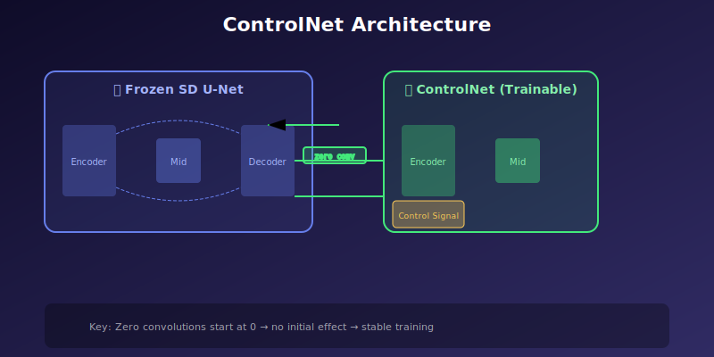
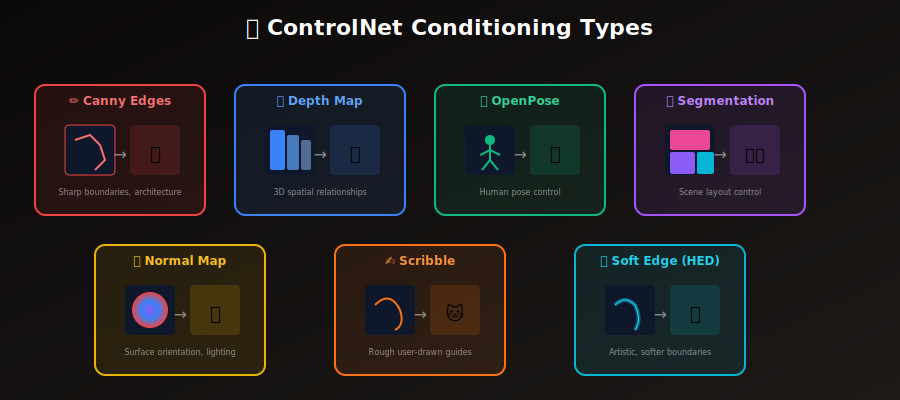
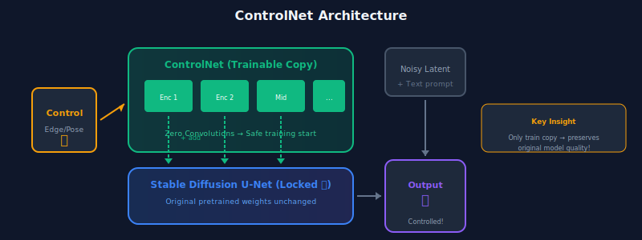

# 🎛️ ControlNet: Fine-Grained Spatial Control

<div align="center">



*Add precise spatial control to diffusion models without retraining*

[](#)
[](#)
[](#)

</div>

---

## 🎯 Where & Why: Real-World Applications

ControlNet (Zhang & Agrawala, 2023) is arguably the **most impactful innovation** in controllable image generation since Stable Diffusion itself. It solved a fundamental problem: how to add precise spatial control without destroying the pretrained model's capabilities.

### The Problem It Solves

**Before ControlNet:**
- Text prompts couldn't specify exact positions
- "Person standing on the left" → Unpredictable results
- Precise poses, layouts, structures were impossible
- Artists had limited control over composition

**With ControlNet:**
- Exact spatial control from edge maps, poses, depth
- Preserve quality of pretrained model
- No full retraining needed
- Combine multiple control signals

### Industry Applications

| Industry | Control Type | Application | Impact |
|----------|-------------|-------------|--------|
| 🎬 **Film/VFX** | Pose + Depth | Generate background plates matching filmed actors | Reduce costly reshoots |
| 🎮 **Gaming** | Segmentation | Generate environments from layout sketches | Accelerate concept art pipeline |
| 👗 **Fashion** | Pose | Generate models in specific poses | Virtual try-on, catalog automation |
| 🏗️ **Architecture** | Edge + Depth | Visualize buildings from line drawings | Rapid client presentations |
| 🎨 **Digital Art** | Scribble | Transform rough sketches to finished art | Democratize artistic creation |
| 🏥 **Medical** | Segmentation | Generate synthetic training data | Address data scarcity |
| 🤖 **Robotics** | Depth | Generate training scenarios | Sim-to-real transfer |
| 📱 **AR/VR** | Normal maps | Create consistent 3D assets | Scalable content creation |

<div align="center">



</div>

### Why ControlNet is Revolutionary

| Aspect | Previous Approaches | ControlNet |
|--------|---------------------|------------|
| **Training** | Retrain entire model | Train adapter only (~500M params) |
| **Base Model** | Modified/degraded | Completely preserved (frozen) |
| **Control Quality** | Often blurry/weak | Precise, sharp control |
| **Composability** | Hard to combine | Easy multi-control |
| **Stability** | Often unstable training | Zero conv → stable from start |

### The Genius of Zero Convolution

The key insight is deceptively simple:

> **Initialize the added connections with zero weights**, so the ControlNet starts with **zero effect** on the output.

This means:
1. At training start: Model behaves exactly like original
2. During training: Gradually learns control signal
3. No "catastrophic forgetting" of pretrained knowledge

$$\text{At } t=0: \quad y = \mathcal{F}(x; \Theta) + \underbrace{\mathcal{Z}(\cdot; \Theta_{z})}_{\text{= 0 initially}} = \mathcal{F}(x; \Theta)$$

---

## 📖 Introduction

ControlNet enables **precise spatial control** over image generation by conditioning diffusion models on additional input modalities like edge maps, depth maps, pose skeletons, and more. It preserves the quality and diversity of pretrained models while adding fine-grained control.

<div align="center">



</div>

---

## 🧮 Mathematical Foundation

### Architecture Overview

ControlNet creates a **trainable copy** of the pretrained encoder and middle blocks, then connects them to the frozen decoder through **zero convolutions**.

Let $\mathcal{F}(\cdot; \Theta)$ be a pretrained network block with parameters $\Theta$.

**Original output:**
$$y = \mathcal{F}(x; \Theta)$$

**With ControlNet:**
$$y = \mathcal{F}(x; \Theta) + \mathcal{Z}\big(\mathcal{F}(x + \mathcal{Z}(c; \Theta_{z_1}); \Theta_c); \Theta_{z_2}\big)$$

Where:
- $c$ = conditioning signal (edge map, pose, depth, etc.)
- $\Theta_c$ = trainable copy of encoder parameters
- $\mathcal{Z}(\cdot; \Theta_z)$ = zero convolution (initialized to zero)
- $\Theta_{z_1}, \Theta_{z_2}$ = zero-initialized convolution parameters

### Zero Convolution

A 1×1 convolution initialized with all zeros:

```python
class ZeroConvolution(nn.Module):
    """
    Key innovation: Initialize with zeros so ControlNet
    starts with no effect on the pretrained model.
    """
    def __init__(self, in_channels: int, out_channels: int):
        super().__init__()
        self.conv = nn.Conv2d(in_channels, out_channels, kernel_size=1)
        
        # Critical: Zero initialization
        nn.init.zeros_(self.conv.weight)
        nn.init.zeros_(self.conv.bias)
    
    def forward(self, x: torch.Tensor) -> torch.Tensor:
        return self.conv(x)
```

### Why Zero Initialization Works

At training start ($t = 0$):
- $\mathcal{Z}(\cdot) = 0$ → ControlNet output is zero
- $y = \mathcal{F}(x; \Theta) + 0 = \mathcal{F}(x; \Theta)$
- Model behaves exactly like the pretrained model

During training:
- Gradients flow through zero convs
- $\Theta_z$ gradually become non-zero
- ControlNet learns to contribute meaningful control

This prevents:
- Random noise corrupting pretrained features
- Catastrophic forgetting
- Training instability

---

## 🏗️ Implementation

### Full ControlNet Architecture

```python
class ControlNet(nn.Module):
    """
    ControlNet: Trainable copy of encoder + zero convolutions.
    
    Architecture:
    1. Condition encoder: Process control signal
    2. Copied encoder blocks: Trainable copy of UNet encoder
    3. Copied middle block: Trainable copy of UNet middle
    4. Zero convolutions: Connect to frozen UNet decoder
    """
    
    def __init__(
        self,
        unet: UNet2DConditionModel,
        conditioning_channels: int = 3,  # e.g., 3 for RGB control image
    ):
        super().__init__()
        
        # Condition encoder: Process control signal
        self.condition_encoder = nn.Sequential(
            nn.Conv2d(conditioning_channels, 16, 3, padding=1),
            nn.SiLU(),
            nn.Conv2d(16, 32, 3, padding=1, stride=2),
            nn.SiLU(),
            nn.Conv2d(32, 96, 3, padding=1, stride=2),
            nn.SiLU(),
            nn.Conv2d(96, 256, 3, padding=1, stride=2),
            nn.SiLU(),
            ZeroConvolution(256, 320),  # Zero conv at input
        )
        
        # Copy encoder blocks from UNet
        self.encoder_blocks = nn.ModuleList()
        self.zero_convs_down = nn.ModuleList()
        
        for block in unet.down_blocks:
            # Deep copy the block
            self.encoder_blocks.append(copy.deepcopy(block))
            
            # Zero convolution for this block's output
            out_channels = block.resnets[-1].out_channels
            self.zero_convs_down.append(ZeroConvolution(out_channels, out_channels))
        
        # Copy middle block
        self.middle_block = copy.deepcopy(unet.mid_block)
        self.zero_conv_mid = ZeroConvolution(
            unet.mid_block.resnets[-1].out_channels,
            unet.mid_block.resnets[-1].out_channels
        )
    
    def forward(
        self,
        sample: torch.Tensor,      # Noisy latent
        timestep: torch.Tensor,     # Diffusion timestep
        encoder_hidden_states: torch.Tensor,  # Text embeddings
        controlnet_cond: torch.Tensor,  # Control signal (e.g., edge map)
    ) -> Dict[str, List[torch.Tensor]]:
        """
        Forward pass producing residuals for UNet decoder.
        
        Returns:
            dict with 'down_block_res' and 'mid_block_res'
        """
        # Process control condition
        controlnet_cond = self.condition_encoder(controlnet_cond)
        
        # Add condition to sample
        sample = sample + controlnet_cond
        
        # Time embedding
        t_emb = self.time_embedding(timestep)
        
        # Encoder blocks with zero conv outputs
        down_block_res = []
        
        for block, zero_conv in zip(self.encoder_blocks, self.zero_convs_down):
            sample, res = block(sample, t_emb, encoder_hidden_states)
            down_block_res.append(zero_conv(res))
        
        # Middle block
        sample = self.middle_block(sample, t_emb, encoder_hidden_states)
        mid_block_res = self.zero_conv_mid(sample)
        
        return {
            'down_block_res': down_block_res,
            'mid_block_res': mid_block_res
        }
```

### Training Loop

```python
def train_controlnet(
    controlnet: ControlNet,
    unet: UNet2DConditionModel,  # Frozen
    train_dataloader: DataLoader,
    num_epochs: int = 100,
    learning_rate: float = 1e-5,
):
    """
    Train ControlNet while keeping base UNet frozen.
    """
    # Freeze UNet
    unet.eval()
    for param in unet.parameters():
        param.requires_grad = False
    
    # Only train ControlNet
    controlnet.train()
    optimizer = AdamW(controlnet.parameters(), lr=learning_rate)
    
    for epoch in range(num_epochs):
        for batch in train_dataloader:
            images = batch['image']
            conditions = batch['condition']  # e.g., Canny edges
            captions = batch['caption']
            
            # Encode images to latent
            with torch.no_grad():
                latents = vae.encode(images).latent_dist.sample() * 0.18215
            
            # Sample timesteps
            timesteps = torch.randint(0, 1000, (len(images),))
            
            # Add noise
            noise = torch.randn_like(latents)
            noisy_latents = scheduler.add_noise(latents, noise, timesteps)
            
            # Encode text
            text_embeddings = text_encoder(captions)
            
            # ControlNet forward
            controlnet_output = controlnet(
                noisy_latents, timesteps, text_embeddings, conditions
            )
            
            # UNet forward with ControlNet residuals
            noise_pred = unet(
                noisy_latents,
                timesteps,
                encoder_hidden_states=text_embeddings,
                down_block_additional_residuals=controlnet_output['down_block_res'],
                mid_block_additional_residual=controlnet_output['mid_block_res'],
            ).sample
            
            # Loss
            loss = F.mse_loss(noise_pred, noise)
            
            optimizer.zero_grad()
            loss.backward()
            optimizer.step()
```

### Inference

```python
@torch.no_grad()
def generate_with_controlnet(
    prompt: str,
    control_image: torch.Tensor,  # Preprocessed control signal
    controlnet: ControlNet,
    unet: UNet2DConditionModel,
    controlnet_conditioning_scale: float = 1.0,
    num_inference_steps: int = 50,
    guidance_scale: float = 7.5,
) -> torch.Tensor:
    """
    Generate image with ControlNet guidance.
    
    Args:
        control_image: Preprocessed control signal (e.g., Canny edges)
        controlnet_conditioning_scale: How strongly to apply control (0-2)
    """
    # Encode prompt
    text_embeddings = encode_prompt(prompt, guidance_scale > 1)
    
    # Start from noise
    latent = torch.randn(1, 4, 64, 64)
    
    scheduler.set_timesteps(num_inference_steps)
    
    for t in scheduler.timesteps:
        # Duplicate for CFG
        latent_input = torch.cat([latent] * 2) if guidance_scale > 1 else latent
        control_input = torch.cat([control_image] * 2) if guidance_scale > 1 else control_image
        
        # ControlNet forward
        controlnet_output = controlnet(
            latent_input, t, text_embeddings, control_input
        )
        
        # Scale control strength
        down_res = [r * controlnet_conditioning_scale for r in controlnet_output['down_block_res']]
        mid_res = controlnet_output['mid_block_res'] * controlnet_conditioning_scale
        
        # UNet forward with control
        noise_pred = unet(
            latent_input,
            t,
            encoder_hidden_states=text_embeddings,
            down_block_additional_residuals=down_res,
            mid_block_additional_residual=mid_res,
        ).sample
        
        # CFG
        if guidance_scale > 1:
            noise_uncond, noise_cond = noise_pred.chunk(2)
            noise_pred = noise_uncond + guidance_scale * (noise_cond - noise_uncond)
        
        # Scheduler step
        latent = scheduler.step(noise_pred, t, latent).prev_sample
    
    return vae.decode(latent / 0.18215).sample
```

---

## 🎨 Conditioning Types

### Edge-Based Control

```python
def preprocess_canny(image: np.ndarray, low: int = 100, high: int = 200) -> torch.Tensor:
    """Canny edge detection for ControlNet."""
    edges = cv2.Canny(image, low, high)
    edges = np.stack([edges] * 3, axis=-1)  # Convert to 3-channel
    edges = torch.from_numpy(edges).permute(2, 0, 1).float() / 255.0
    return edges

def preprocess_hed(image: np.ndarray) -> torch.Tensor:
    """HED soft edge detection (requires pretrained model)."""
    # HED produces softer, more artistic edges
    edges = hed_model(image)
    return edges
```

### Depth-Based Control

```python
def preprocess_depth(image: np.ndarray) -> torch.Tensor:
    """MiDaS depth estimation for ControlNet."""
    depth = midas_model(image)
    depth = (depth - depth.min()) / (depth.max() - depth.min())
    depth = np.stack([depth] * 3, axis=-1)
    return torch.from_numpy(depth).permute(2, 0, 1).float()
```

### Pose-Based Control

```python
def preprocess_openpose(image: np.ndarray) -> torch.Tensor:
    """OpenPose skeleton detection for ControlNet."""
    pose = openpose_model(image)
    # pose is typically a skeleton visualization
    return torch.from_numpy(pose).permute(2, 0, 1).float() / 255.0
```

---

## 🔧 Multi-ControlNet

Combine multiple control signals:

```python
@torch.no_grad()
def generate_with_multi_control(
    prompt: str,
    controlnets: List[ControlNet],
    control_images: List[torch.Tensor],
    control_scales: List[float],  # Weight for each control
    **kwargs
) -> torch.Tensor:
    """
    Use multiple ControlNets simultaneously.
    
    Example: Pose (0.8) + Depth (0.5) for character in scene
    """
    # Aggregate all ControlNet outputs
    all_down_res = [[] for _ in range(num_down_blocks)]
    all_mid_res = []
    
    for controlnet, control_img, scale in zip(controlnets, control_images, control_scales):
        output = controlnet(latent_input, t, text_embeddings, control_img)
        
        for i, res in enumerate(output['down_block_res']):
            all_down_res[i].append(res * scale)
        all_mid_res.append(output['mid_block_res'] * scale)
    
    # Sum contributions from all controls
    combined_down = [sum(res_list) for res_list in all_down_res]
    combined_mid = sum(all_mid_res)
    
    # Continue with UNet...
```

---

## 📊 Control Strength Guidelines

| Control Scale | Effect | Use Case |
|---------------|--------|----------|
| 0.0 | No control | Debugging |
| 0.3-0.5 | Soft guidance | Artistic interpretation |
| 0.7-1.0 | Standard | Most use cases |
| 1.0-1.5 | Strong | Precise adherence needed |
| >1.5 | Over-control | May degrade quality |

---

## 🔑 Key Equations Summary

| Concept | Equation | Purpose |
|---------|----------|---------|
| **Zero Conv Init** | $W = 0, b = 0$ | Stable training start |
| **ControlNet Output** | $y = F(x) + Z(\text{CN}(x, c))$ | Add control signal |
| **Control Scale** | $y = F(x) + s \cdot Z(\text{CN}(x, c))$ | Adjust strength |
| **Multi-Control** | $y = F(x) + \sum_i s_i \cdot Z_i(\text{CN}_i)$ | Combine signals |

---

## 📚 References

1. **Zhang, L., Rao, A., & Agrawala, M.** (2023). "Adding Conditional Control to Text-to-Image Diffusion Models." *ICCV*. [arXiv:2302.05543](https://arxiv.org/abs/2302.05543)

2. **Mou, C., et al.** (2023). "T2I-Adapter: Learning Adapters to Dig out More Controllable Ability for Text-to-Image Diffusion Models." [arXiv:2302.08453](https://arxiv.org/abs/2302.08453)

3. **Zhao, S., et al.** (2023). "Uni-ControlNet: All-in-One Control to Text-to-Image Diffusion Models." [arXiv:2305.16322](https://arxiv.org/abs/2305.16322)

---

## ✏️ Exercises

<details>
<summary><b>Exercise 1:</b> Implement zero convolution and verify behavior</summary>

**Task:** Implement `ZeroConvolution` and verify:
1. Output is zero at initialization
2. Gradients flow properly
3. Model starts as identity

**Test:** Compare UNet output with/without ControlNet at init.
</details>

<details>
<summary><b>Exercise 2:</b> Train ControlNet for custom condition</summary>

**Task:** Train a ControlNet for line art → image.

**Steps:**
1. Prepare dataset (image, line art pairs)
2. Extract line art automatically
3. Train for 50k steps
4. Evaluate control fidelity
</details>

<details>
<summary><b>Exercise 3:</b> Multi-ControlNet composition</summary>

**Task:** Combine pose + depth for character generation.

**Experiment:** Find optimal balance of scales.

**Report:** Quality vs control trade-offs.
</details>

<details>
<summary><b>Exercise 4:</b> Compare with T2I-Adapter</summary>

**Task:** Compare ControlNet vs T2I-Adapter on:
- Model size
- Training time
- Control quality
- Inference speed
</details>

---

<div align="center">

**[← Inpainting/Outpainting](../06_inpainting_outpainting/)** | **[Next: Multimodal Conditioning →](../08_multimodal_conditioning/)**

</div>
