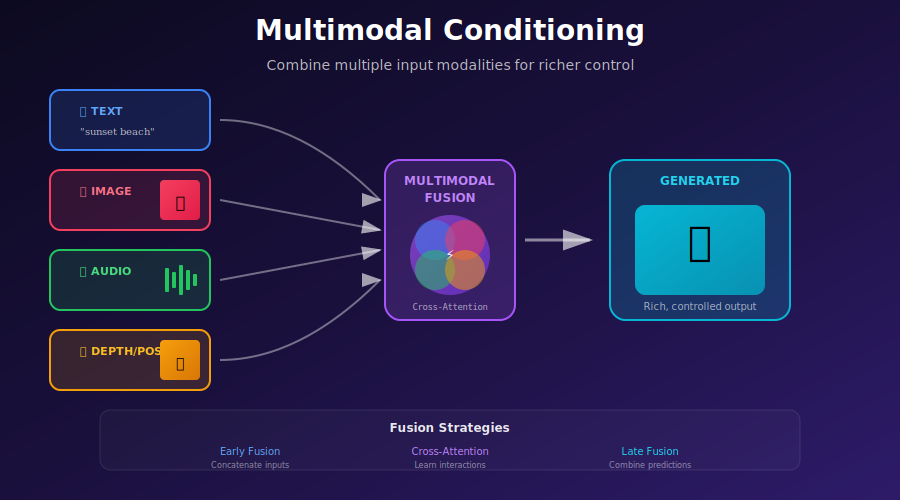
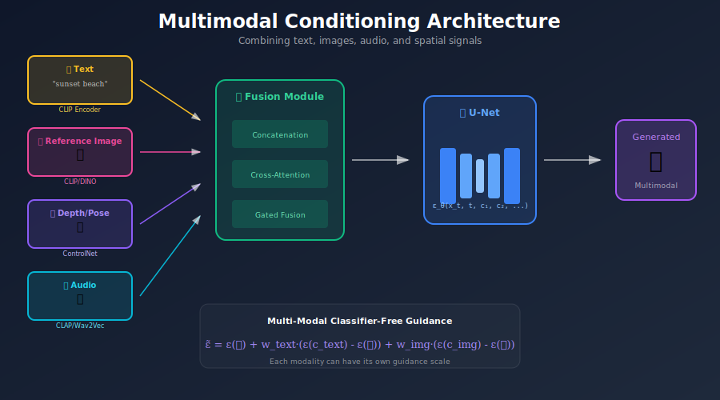
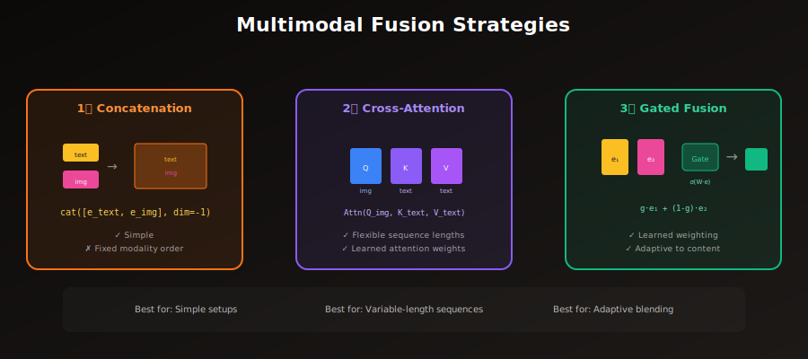

# 🎭 Multimodal Conditioning

<div align="center">



*Combine text, images, audio, and spatial signals for rich control*

[](#)
[](#)
[](#)

</div>

---

## 🎯 Where & Why: Real-World Applications

Multimodal conditioning represents the **frontier of generative AI**—the ability to combine diverse input types (text, images, audio, spatial signals) into a single coherent generation. This is how humans naturally think and create: we don't describe a scene with just words or just a reference image—we use everything available.

### Why Multimodal Matters

**Single modality limitations:**
- **Text alone**: Can't show exact style, hard to describe precise layouts
- **Image alone**: Can't specify modifications in natural language
- **Spatial alone**: No semantic control over what fills the structure

**Multimodal advantage:**
> "Generate an image with the **style** of this reference photo, following this **pose** skeleton, depicting a **medieval knight** (text), with the **lighting mood** from this painting."

### Industry Applications

| Industry | Modalities Combined | Application | Impact |
|----------|---------------------|-------------|--------|
| 🎬 **Film/VFX** | Text + Pose + Style Reference | Generate consistent character designs | 10x faster concept iteration |
| 🎮 **Gaming** | Text + Depth + Segmentation | Generate game environments | Reduce asset creation time |
| 👗 **Fashion** | Text + Pose + Style | Virtual try-on with specific poses | Eliminate physical photoshoots |
| 🎨 **Art** | Text + Style + Composition | Guided artistic creation | New creative possibilities |
| 🏠 **Interior Design** | Text + Layout + Style Reference | Visualize room designs | Instant client presentations |
| 🎵 **Music Video** | Audio + Text + Style | Generate visuals synced to music | Automated content creation |
| 📚 **Education** | Text + Diagrams + Style | Generate educational illustrations | Scalable visual content |
| 🏥 **Medical** | Text + Scan + Segmentation | Generate annotated synthetic data | Address data scarcity |

<div align="center">



</div>

### The Mathematical Foundation

Multimodal conditioning learns the joint distribution:

$$p(x | c_1, c_2, ..., c_n)$$

Where each $c_i$ is a different modality. The key challenge is **fusion**—how to combine embeddings from different modality encoders into a coherent conditioning signal.

The beauty is that **classifier-free guidance extends naturally**:

$$\tilde{\epsilon} = \epsilon(\varnothing) + \sum_{i=1}^{n} w_i \cdot (\epsilon(c_i) - \epsilon(\varnothing))$$

Each modality can have its own guidance scale $w_i$!

---

## 📖 Introduction

Multimodal conditioning allows diffusion models to accept **multiple input modalities simultaneously**—text, images, audio, depth maps, poses, and more. This enables rich, controllable generation that combines diverse information sources.

<div align="center">



</div>

---

## 🧮 Mathematical Framework

### Modality Encoders

Each modality requires a specialized encoder:

| Modality | Common Encoders | Output Shape | Purpose |
|----------|-----------------|--------------|---------|
| **Text** | CLIP, T5, BERT | $[B, L, D_{text}]$ | Semantic content |
| **Image** | CLIP, DINO, IP-Adapter | $[B, D_{img}]$ or $[B, N, D_{img}]$ | Style, content reference |
| **Depth** | MiDaS, DPT | $[B, H, W]$ | 3D structure |
| **Pose** | OpenPose, DWPose | $[B, 3, H, W]$ | Body structure |
| **Segmentation** | SAM, SegGPT | $[B, C, H, W]$ | Layout |
| **Audio** | CLAP, Wav2Vec | $[B, T, D_{audio}]$ | Sound-to-image |

### Fusion Strategies

#### 1. Concatenation

Simplest approach—concatenate embeddings:

```python
def concat_fusion(embeddings: Dict[str, torch.Tensor]) -> torch.Tensor:
    """
    Concatenate embeddings along sequence dimension.
    
    Args:
        embeddings: {'text': [B, L1, D], 'image': [B, L2, D], ...}
    
    Returns:
        Combined embedding [B, L1+L2+..., D]
    """
    # Project all to same dimension if needed
    projected = [project(e, target_dim) for e in embeddings.values()]
    
    # Concatenate along sequence
    return torch.cat(projected, dim=1)
```

#### 2. Cross-Attention

Each modality attends to others:

```python
class CrossModalAttention(nn.Module):
    """Cross-attention between modalities."""
    
    def __init__(self, dim: int, num_heads: int = 8):
        super().__init__()
        self.text_to_image = nn.MultiheadAttention(dim, num_heads)
        self.image_to_text = nn.MultiheadAttention(dim, num_heads)
    
    def forward(
        self, 
        text_emb: torch.Tensor, 
        image_emb: torch.Tensor
    ) -> Tuple[torch.Tensor, torch.Tensor]:
        # Text attends to image
        text_enhanced, _ = self.text_to_image(
            query=text_emb,
            key=image_emb,
            value=image_emb
        )
        
        # Image attends to text
        image_enhanced, _ = self.image_to_text(
            query=image_emb,
            key=text_emb,
            value=text_emb
        )
        
        return text_emb + text_enhanced, image_emb + image_enhanced
```

#### 3. Gated Fusion

Learn to weight modalities adaptively:

```python
class GatedFusion(nn.Module):
    """Learn optimal weighting of modalities."""
    
    def __init__(self, dim: int, num_modalities: int):
        super().__init__()
        self.gate = nn.Sequential(
            nn.Linear(dim * num_modalities, dim),
            nn.ReLU(),
            nn.Linear(dim, num_modalities),
            nn.Softmax(dim=-1)
        )
    
    def forward(self, embeddings: List[torch.Tensor]) -> torch.Tensor:
        """
        Args:
            embeddings: List of [B, D] tensors, one per modality
        
        Returns:
            Weighted combination [B, D]
        """
        # Concatenate for gate input
        concat = torch.cat(embeddings, dim=-1)  # [B, D*num_mod]
        
        # Compute adaptive weights
        weights = self.gate(concat)  # [B, num_mod]
        
        # Stack and weight
        stacked = torch.stack(embeddings, dim=1)  # [B, num_mod, D]
        weighted = (stacked * weights.unsqueeze(-1)).sum(dim=1)  # [B, D]
        
        return weighted
```

---

## 🏗️ Implementation

### Multi-Encoder Architecture

```python
class MultimodalEncoder(nn.Module):
    """
    Encode multiple modalities into a unified conditioning space.
    """
    
    def __init__(
        self,
        text_encoder: Optional[nn.Module] = None,
        image_encoder: Optional[nn.Module] = None,
        depth_encoder: Optional[nn.Module] = None,
        pose_encoder: Optional[nn.Module] = None,
        output_dim: int = 1024,
        fusion_type: str = 'cross_attention',  # or 'concat', 'gated'
    ):
        super().__init__()
        
        # Modality encoders
        self.text_encoder = text_encoder or CLIPTextEncoder()
        self.image_encoder = image_encoder or CLIPVisionEncoder()
        self.depth_encoder = depth_encoder or DepthEncoder()
        self.pose_encoder = pose_encoder or PoseEncoder()
        
        # Projection layers to common dimension
        self.text_proj = nn.Linear(768, output_dim)
        self.image_proj = nn.Linear(768, output_dim)
        self.depth_proj = nn.Linear(512, output_dim)
        self.pose_proj = nn.Linear(256, output_dim)
        
        # Fusion module
        if fusion_type == 'cross_attention':
            self.fusion = MultimodalCrossAttention(output_dim)
        elif fusion_type == 'gated':
            self.fusion = GatedFusion(output_dim, num_modalities=4)
        else:
            self.fusion = None  # Simple concatenation
    
    def forward(
        self,
        text: Optional[str] = None,
        image: Optional[torch.Tensor] = None,
        depth: Optional[torch.Tensor] = None,
        pose: Optional[torch.Tensor] = None,
    ) -> torch.Tensor:
        """
        Encode available modalities and fuse them.
        
        Args:
            text: Text prompt
            image: Reference image [B, 3, H, W]
            depth: Depth map [B, 1, H, W]
            pose: Pose skeleton [B, 3, H, W]
        
        Returns:
            Fused conditioning embedding
        """
        embeddings = {}
        
        if text is not None:
            text_emb = self.text_encoder(text)
            embeddings['text'] = self.text_proj(text_emb)
        
        if image is not None:
            image_emb = self.image_encoder(image)
            embeddings['image'] = self.image_proj(image_emb)
        
        if depth is not None:
            depth_emb = self.depth_encoder(depth)
            embeddings['depth'] = self.depth_proj(depth_emb)
        
        if pose is not None:
            pose_emb = self.pose_encoder(pose)
            embeddings['pose'] = self.pose_proj(pose_emb)
        
        # Fuse embeddings
        if self.fusion is not None:
            return self.fusion(list(embeddings.values()))
        else:
            # Simple concatenation
            return torch.cat(list(embeddings.values()), dim=1)
```

### Multi-CFG Sampling

```python
@torch.no_grad()
def sample_multimodal_cfg(
    model: UNet2DConditionModel,
    encoder: MultimodalEncoder,
    text: Optional[str] = None,
    reference_image: Optional[torch.Tensor] = None,
    depth_map: Optional[torch.Tensor] = None,
    guidance_scales: Dict[str, float] = {
        'text': 7.5,
        'image': 1.5,
        'depth': 1.0,
    },
    num_inference_steps: int = 50,
) -> torch.Tensor:
    """
    Sample with per-modality classifier-free guidance.
    
    Each modality gets its own guidance scale for fine control.
    """
    device = model.device
    
    # Encode all modalities
    cond_embeddings = {}
    if text:
        cond_embeddings['text'] = encoder.encode_text(text)
    if reference_image is not None:
        cond_embeddings['image'] = encoder.encode_image(reference_image)
    if depth_map is not None:
        cond_embeddings['depth'] = encoder.encode_depth(depth_map)
    
    # Unconditional embedding
    uncond_embedding = encoder.encode_text("")
    
    # Start from noise
    latent = torch.randn(1, 4, 64, 64, device=device)
    
    scheduler.set_timesteps(num_inference_steps)
    
    for t in scheduler.timesteps:
        # Unconditional prediction
        noise_uncond = model(latent, t, uncond_embedding).sample
        
        # Start with unconditional
        noise_pred = noise_uncond.clone()
        
        # Add each modality's contribution
        for modality, emb in cond_embeddings.items():
            if modality in guidance_scales:
                noise_cond = model(latent, t, emb).sample
                noise_pred += guidance_scales[modality] * (noise_cond - noise_uncond)
        
        # Scheduler step
        latent = scheduler.step(noise_pred, t, latent).prev_sample
    
    return vae.decode(latent / 0.18215).sample
```

---

## 🎨 Practical Examples

### Text + Style Reference

```python
def generate_with_style_reference(
    prompt: str,
    style_image: torch.Tensor,
    text_scale: float = 7.5,
    style_scale: float = 1.5,
) -> torch.Tensor:
    """
    Generate with content from text and style from reference image.
    
    Example:
        prompt = "a medieval castle"
        style_image = load_image("monet_painting.jpg")
        # Result: castle in Monet's style
    """
    return sample_multimodal_cfg(
        model=unet,
        encoder=encoder,
        text=prompt,
        reference_image=style_image,
        guidance_scales={
            'text': text_scale,    # Content
            'image': style_scale,  # Style
        }
    )
```

### Text + Pose + Depth

```python
def generate_character_in_scene(
    prompt: str,
    pose: torch.Tensor,
    depth: torch.Tensor,
    scales: Dict[str, float] = {'text': 10, 'pose': 1.0, 'depth': 0.8},
) -> torch.Tensor:
    """
    Generate character following pose in scene following depth.
    
    Perfect for: consistent character generation in environments
    """
    return sample_multimodal_cfg(
        model=unet,
        encoder=encoder,
        text=prompt,
        pose=pose,
        depth_map=depth,
        guidance_scales=scales
    )
```

---

## 🔧 Training Strategies

### Modality Dropout

Critical for enabling CFG with each modality:

```python
def training_step_with_dropout(
    model: nn.Module,
    batch: Dict[str, torch.Tensor],
    drop_probs: Dict[str, float] = {
        'text': 0.1,
        'image': 0.2,
        'depth': 0.3,
    }
) -> torch.Tensor:
    """
    Training with per-modality dropout.
    
    Different dropout rates allow:
    - Lower rate for primary modality (text)
    - Higher rate for auxiliary modalities
    """
    text, image, depth, target = (
        batch['text'], batch['image'], batch['depth'], batch['target']
    )
    
    # Independent dropout per modality
    if torch.rand(1) < drop_probs.get('text', 0.1):
        text = None  # or empty string
    
    if torch.rand(1) < drop_probs.get('image', 0.2):
        image = None  # or zeros
    
    if torch.rand(1) < drop_probs.get('depth', 0.3):
        depth = None
    
    # Forward pass with available modalities
    embedding = encoder(text=text, image=image, depth=depth)
    
    return diffusion_loss(model, target, embedding)
```

### Balanced Training

Ensure model learns from all modality combinations:

```python
def balanced_training(
    model: nn.Module,
    batch: Dict[str, torch.Tensor],
) -> torch.Tensor:
    """
    Explicitly train on all modality combinations.
    """
    text, image, depth, target = (
        batch['text'], batch['image'], batch['depth'], batch['target']
    )
    
    # All possible combinations
    combinations = [
        {'text': text},
        {'image': image},
        {'depth': depth},
        {'text': text, 'image': image},
        {'text': text, 'depth': depth},
        {'image': image, 'depth': depth},
        {'text': text, 'image': image, 'depth': depth},
    ]
    
    total_loss = 0
    for combo in combinations:
        emb = encoder(**combo)
        total_loss += diffusion_loss(model, target, emb)
    
    return total_loss / len(combinations)
```

---

## 📊 Guidance Scale Guidelines

| Combination | Text Scale | Image Scale | Spatial Scale | Notes |
|-------------|------------|-------------|---------------|-------|
| Text only | 7.5 | - | - | Standard SD |
| Text + Style | 7-10 | 1-2 | - | Higher text for content |
| Text + Pose | 8-12 | - | 0.8-1.2 | Balance pose adherence |
| Text + Depth + Style | 7-10 | 1-1.5 | 0.5-1.0 | Complex, tune carefully |
| Style transfer | 3-5 | 2-3 | - | Lower text, higher image |

---

## 🔑 Key Equations Summary

| Concept | Equation | Purpose |
|---------|----------|---------|
| **Multi-CFG** | $\tilde{\epsilon} = \epsilon_\varnothing + \sum_i w_i(\epsilon_{c_i} - \epsilon_\varnothing)$ | Per-modality guidance |
| **Concat Fusion** | $e = [e_1; e_2; ...; e_n]$ | Simple combination |
| **Gated Fusion** | $e = \sum_i g_i \cdot e_i, \sum g_i = 1$ | Adaptive weighting |
| **Cross-Attention** | $\text{Attn}(Q_1, K_2, V_2)$ | Inter-modal attention |

---

## 📚 References

1. **Balaji, Y., et al.** (2022). "eDiff-I: Text-to-Image Diffusion Models with an Ensemble of Expert Denoisers." [arXiv:2211.01324](https://arxiv.org/abs/2211.01324)

2. **Huang, L., et al.** (2023). "Composer: Creative and Controllable Image Synthesis with Composable Conditions." [arXiv:2302.09778](https://arxiv.org/abs/2302.09778)

3. **Ye, H., et al.** (2023). "IP-Adapter: Text Compatible Image Prompt Adapter for Text-to-Image Diffusion Models." [arXiv:2308.06721](https://arxiv.org/abs/2308.06721)

4. **Podell, D., et al.** (2023). "SDXL: Improving Latent Diffusion Models for High-Resolution Image Synthesis." [arXiv:2307.01952](https://arxiv.org/abs/2307.01952)

---

## ✏️ Exercises

<details>
<summary><b>Exercise 1:</b> Implement text + image encoder system</summary>

**Task:** Build a dual encoder that combines CLIP text and image embeddings.

**Steps:**
1. Load CLIP text and vision encoders
2. Implement projection to common space
3. Test with concatenation fusion

**Expected:** Coherent generation from text + style reference.
</details>

<details>
<summary><b>Exercise 2:</b> Compare fusion strategies</summary>

**Task:** Compare concat vs cross-attention vs gated fusion.

**Metrics:**
- FID
- CLIP score for text adherence
- Style similarity for image adherence

**Report:** Trade-offs for each approach.
</details>

<details>
<summary><b>Exercise 3:</b> Train with modality dropout</summary>

**Task:** Train with varying dropout rates and analyze:
- Does high dropout help CFG work?
- What happens with unbalanced rates?

**Experiment:** Dropout rates [0.05, 0.1, 0.2, 0.3] for each modality.
</details>

<details>
<summary><b>Exercise 4:</b> Build multimodal generation app</summary>

**Task:** Create an interactive demo that accepts:
- Text prompt
- Optional style reference image
- Optional pose skeleton
- Per-modality guidance sliders

**Deliverable:** Gradio or Streamlit app.
</details>

---

---

<div align="center">

**[← ControlNet](../07_controlnet/)** | **[Back to Conditioning →](../)**

</div>
