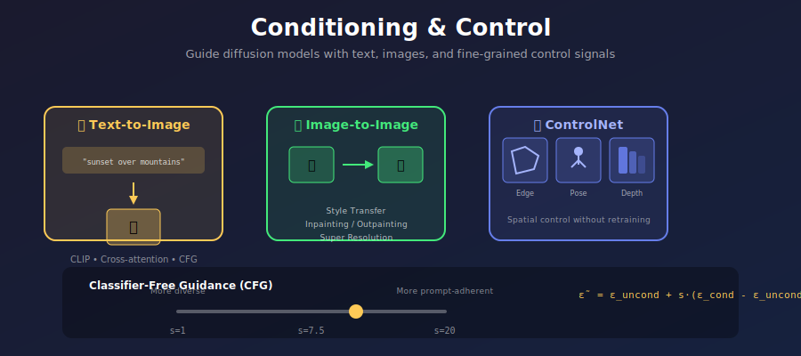
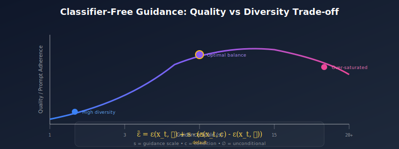
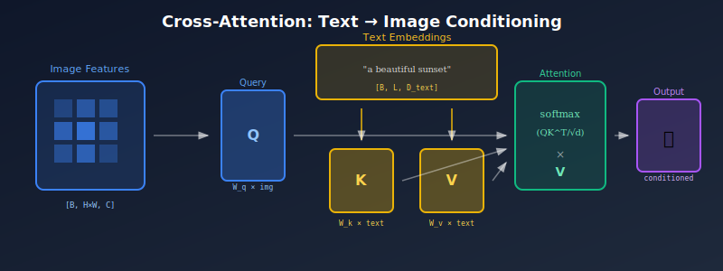

# 🎛️ Conditioning & Control

<div align="center">



*Guide diffusion models with text, images, and fine-grained control signals*

[](#)
[](#)
[](#)

</div>

---

## 🎯 Where & Why Use Conditioning?

Conditioning is what transforms a random noise generator into a **controllable creative tool**. Without conditioning, diffusion models generate random samples from their training distribution. With conditioning, they become instruments for precise visual creation.

<table>
<tr>
<th width="25%">Application</th>
<th width="35%">Conditioning Type</th>
<th width="40%">Real-World Examples</th>
</tr>
<tr>
<td><b>📝 Text-to-Image</b></td>
<td>Natural language descriptions</td>
<td>DALL-E 3, Midjourney, Stable Diffusion</td>
</tr>
<tr>
<td><b>🖼️ Image-to-Image</b></td>
<td>Reference image + text prompt</td>
<td>Style transfer, variation generation</td>
</tr>
<tr>
<td><b>✏️ Inpainting</b></td>
<td>Masked regions + context</td>
<td>Object removal, background replacement</td>
</tr>
<tr>
<td><b>🎭 Face/Pose Control</b></td>
<td>Skeleton, depth, edge maps</td>
<td>ControlNet, T2I-Adapter</td>
</tr>
<tr>
<td><b>🎨 Style Transfer</b></td>
<td>Style reference + content</td>
<td>IP-Adapter, Style injection</td>
</tr>
<tr>
<td><b>📐 Layout Control</b></td>
<td>Bounding boxes, segmentation</td>
<td>GLIGEN, Layout-to-Image</td>
</tr>
</table>

---

## 📚 Topics in This Module

| # | Topic | Description | Key Concepts |
|:-:|-------|-------------|--------------|
| 🏷️ | **[Class Conditioning](./01_class_conditioning/)** | Categorical control | Embeddings, AdaGN |
| 📝 | **[Text-to-Image](./02_text_to_image/)** | Language-guided generation | Tokenization, cross-attention |
| 🔗 | **[CLIP Models](./03_clip_models/)** | Vision-language alignment | Contrastive learning, embeddings |
| 🎯 | **[Classifier-Free Guidance](./04_classifier_free_guidance/)** | No classifier needed | CFG scale, label dropout |
| 🖼️ | **[Image-to-Image](./05_image_to_image/)** | Reference-based generation | SDEdit, noise injection |
| ✂️ | **[Inpainting/Outpainting](./06_inpainting_outpainting/)** | Region-based editing | Masked diffusion |
| 🎛️ | **[ControlNet](./07_controlnet/)** | Fine-grained spatial control | Zero convolutions, copy weights |
| 🎭 | **[Multimodal Conditioning](./08_multimodal_conditioning/)** | Multiple condition types | Composition, attention routing |

---

## 🧮 Core Concepts

### 1. Classifier-Free Guidance (CFG)

The most important conditioning technique in modern diffusion:

<div align="center">



</div>

**Training:** Randomly drop conditioning with probability $p_{uncond}$ (typically 10%):

$$\epsilon_\theta(x_t, t, c) \text{ trained with } c = \emptyset \text{ sometimes}$$

**Inference:** Extrapolate between conditional and unconditional predictions:

$$\boxed{\tilde{\epsilon}_\theta(x_t, t, c) = \epsilon_\theta(x_t, t, \emptyset) + s \cdot (\epsilon_\theta(x_t, t, c) - \epsilon_\theta(x_t, t, \emptyset))}$$

where $s$ is the **guidance scale**:
- $s = 1$: Standard conditional generation
- $s = 7.5$: Typical for Stable Diffusion
- $s > 10$: Strong adherence (may reduce diversity)

### 2. Cross-Attention Conditioning

Text embeddings attend to spatial features:

<div align="center">



</div>

```python
class CrossAttention(nn.Module):
    def __init__(self, dim, context_dim):
        self.to_q = nn.Linear(dim, dim)           # Image features → queries
        self.to_k = nn.Linear(context_dim, dim)   # Text → keys
        self.to_v = nn.Linear(context_dim, dim)   # Text → values
    
    def forward(self, x, context):
        # x: [B, H*W, C] image features
        # context: [B, L, D] text embeddings
        
        q = self.to_q(x)
        k = self.to_k(context)
        v = self.to_v(context)
        
        # Attention: which text tokens are relevant for each spatial location?
        attn = softmax(q @ k.T / sqrt(d))
        out = attn @ v
        
        return out
```

### 3. ControlNet Architecture

Add spatial control without modifying the base model:

<div align="center">


</div>

**Key Innovation:** Zero convolutions start at zero, so ControlNet initially has no effect → stable training.

---

## 💡 Conditioning Methods Comparison

| Method | Input Type | Modification | Training |
|--------|------------|--------------|----------|
| **Class embedding** | Discrete label | Add to time emb | From scratch |
| **Cross-attention** | Sequence (text) | Attention layers | From scratch |
| **Concatenation** | Image/mask | Channel concat | Fine-tune |
| **ControlNet** | Spatial signal | Additive | Adapter only |
| **IP-Adapter** | Image embedding | Cross-attention | Adapter only |
| **T2I-Adapter** | Spatial signal | Feature addition | Adapter only |

---

## 📊 Guidance Scale Effects

| Scale | Effect | Use Case |
|-------|--------|----------|
| $s = 1.0$ | Pure conditional | When diversity matters |
| $s = 3.0$ | Balanced | General purpose |
| $s = 7.5$ | Strong guidance | Text-to-image (SD default) |
| $s = 15.0$ | Very strong | When prompt adherence is critical |
| $s > 20$ | Over-saturated | Usually too extreme |

---

## 🔧 Implementation Examples

### Text-to-Image with CFG

```python
def generate_with_cfg(prompt, guidance_scale=7.5, steps=50):
    # Encode prompts
    cond_embeds = encode_text(prompt)
    uncond_embeds = encode_text("")
    
    # Double batch for CFG
    text_embeds = torch.cat([uncond_embeds, cond_embeds])
    
    latent = torch.randn(1, 4, 64, 64)
    
    for t in scheduler.timesteps:
        latent_input = torch.cat([latent] * 2)
        
        # Single forward pass for both
        noise_pred = unet(latent_input, t, text_embeds)
        noise_uncond, noise_cond = noise_pred.chunk(2)
        
        # CFG combination
        noise_pred = noise_uncond + guidance_scale * (noise_cond - noise_uncond)
        
        latent = scheduler.step(noise_pred, t, latent)
    
    return decode(latent)
```

### ControlNet Inference

```python
def generate_with_control(prompt, control_image, control_scale=1.0):
    # Process control signal (e.g., Canny edges)
    control_signal = preprocess(control_image)
    
    latent = torch.randn(1, 4, 64, 64)
    
    for t in scheduler.timesteps:
        # ControlNet forward
        control_features = controlnet(latent, t, text_embeds, control_signal)
        
        # Apply control features to base U-Net
        noise_pred = unet(
            latent, t, text_embeds,
            down_block_additional_residuals=[f * control_scale for f in control_features['down']],
            mid_block_additional_residual=control_features['mid'] * control_scale
        )
        
        latent = scheduler.step(noise_pred, t, latent)
    
    return decode(latent)
```

---

## 🏆 Key Models and Timeline

```
2021 ━━━━━━━━━━━━━━━━━━━━━━━━━━━━━━━━━━━━━━━━━━━━━━━━━━━━━━━━━► 2024
  │
  ├── CLIP (OpenAI, 2021)
  │     └── Vision-language alignment
  │
  ├── GLIDE / DALL-E 2 (2022)
  │     └── Text-to-image with CLIP guidance
  │
  ├── Classifier-Free Guidance (Ho & Salimans, 2022)
  │     └── No external classifier needed
  │
  ├── Stable Diffusion (2022)
  │     └── Open-source text-to-image
  │
  ├── ControlNet (Zhang et al., 2023)
  │     └── Fine-grained spatial control
  │
  ├── IP-Adapter (2023)
  │     └── Image prompt adapter
  │
  └── SDXL + Refiners (2023-24)
        └── Multi-stage, multi-condition
```

---

## 📚 References

### Key Papers

1. **Radford, A., et al.** (2021). "Learning Transferable Visual Models From Natural Language Supervision." *ICML*. [arXiv:2103.00020](https://arxiv.org/abs/2103.00020)

2. **Ho, J., & Salimans, T.** (2022). "Classifier-Free Diffusion Guidance." *NeurIPS Workshop*. [arXiv:2207.12598](https://arxiv.org/abs/2207.12598)

3. **Zhang, L., et al.** (2023). "Adding Conditional Control to Text-to-Image Diffusion Models." *ICCV*. [arXiv:2302.05543](https://arxiv.org/abs/2302.05543)

4. **Rombach, R., et al.** (2022). "High-Resolution Image Synthesis with Latent Diffusion Models." *CVPR*. [arXiv:2112.10752](https://arxiv.org/abs/2112.10752)

---

## ✏️ Exercises

1. **Implement** class-conditional diffusion on CIFAR-10.

2. **Experiment** with different CFG scales and analyze quality vs diversity.

3. **Visualize** cross-attention maps for different text prompts.

4. **Fine-tune** a ControlNet for a custom control signal.

5. **Compare** prompt adherence with/without negative prompts.

---

<div align="center">

**Next:** [Class Conditioning](./01_class_conditioning/) →

*Start with the simplest form of conditioning*

</div>
