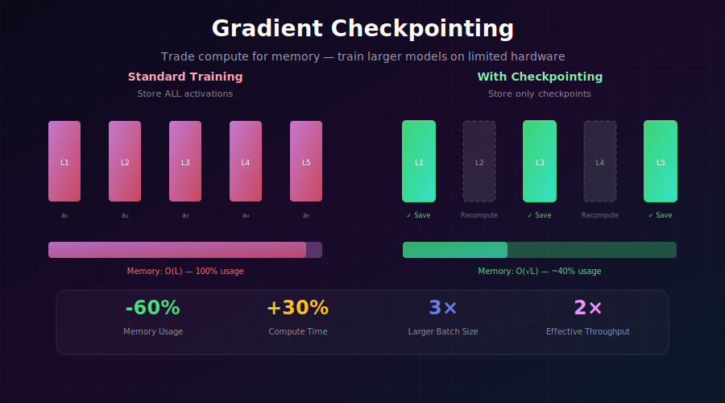
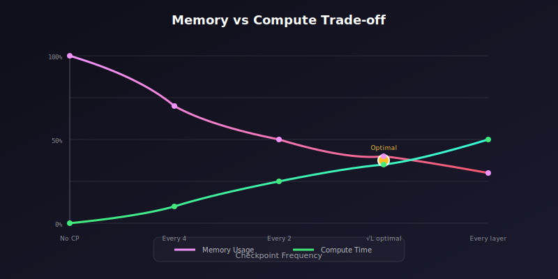

# 💾 Gradient Checkpointing

<div align="center">



*Trade compute for memory — train 3× larger models on the same GPU*

[](#)
[](#)
[](#)

</div>

---

## 🎯 Where & Why: Real-World Applications

### Where is Gradient Checkpointing Used?

| Scenario | Why Gradient Checkpointing Helps | Who Uses It |
|----------|----------------------------------|-------------|
| 🤖 **Training Large Language Models** | Transformers with billions of parameters exceed GPU memory | OpenAI, Meta, Anthropic |
| 🎨 **High-Resolution Image Generation** | Diffusion U-Nets processing 1024×1024 images need massive activation storage | Stability AI, Midjourney |
| 🎬 **Video Models** | Video generation requires storing activations across many frames | Runway, Pika |
| 🔬 **Fine-tuning Foundation Models** | Fine-tune 70B+ models on single GPUs | Research labs, enterprises |
| 🧬 **3D Medical Imaging** | Process volumetric CT/MRI scans that don't fit in memory | Healthcare AI |
| 📚 **Longer Context Training** | Train transformers on 128K+ token sequences | Document AI applications |

### Why Learn Gradient Checkpointing?

> 💡 **The Memory Wall**: As models grow, memory becomes the bottleneck before compute. Gradient checkpointing breaks through this wall.

**The Core Challenge:**

```
Memory Usage During Training (50-Layer Transformer)
━━━━━━━━━━━━━━━━━━━━━━━━━━━━━━━━━━━━━━━━━━━━━━━━━━━━━
Component           Standard        With Checkpointing
━━━━━━━━━━━━━━━━━━━━━━━━━━━━━━━━━━━━━━━━━━━━━━━━━━━━━
Model Weights       4 GB            4 GB
Gradients           4 GB            4 GB  
Optimizer States    8 GB            8 GB
Activations         24 GB → OOM!    8 GB ← Fits!
━━━━━━━━━━━━━━━━━━━━━━━━━━━━━━━━━━━━━━━━━━━━━━━━━━━━━
Total               40 GB           24 GB (-40%)
━━━━━━━━━━━━━━━━━━━━━━━━━━━━━━━━━━━━━━━━━━━━━━━━━━━━━
```

### The Trade-off Equation

| Metric | Without Checkpointing | With Checkpointing | Change |
|--------|----------------------|-------------------|--------|
| **Peak Memory** | 24 GB activations | 8 GB activations | **-67%** |
| **Training Time** | 1.0× | 1.3× | **+30%** |
| **Max Batch Size** | 4 | 12 | **+200%** |
| **Effective Throughput** | Baseline | ~2.7× (with larger batch) | **+170%** |

---

## 📐 The Mathematics

### Standard Backpropagation Memory

<div align="center">



</div>

In a network with \( L \) layers, standard backpropagation stores all intermediate activations:

$$\text{Memory}_{activations} = O(L \cdot B \cdot H \cdot W \cdot C)$$

Where:
- \( L \) = number of layers
- \( B \) = batch size
- \( H, W \) = spatial dimensions
- \( C \) = channels

### Checkpointing Memory

With checkpoints placed every \( k \) layers:

$$\text{Memory}_{checkpointed} = O\left(\frac{L}{k} \cdot B \cdot H \cdot W \cdot C + k \cdot B \cdot H \cdot W \cdot C\right)$$

**Optimal checkpoint placement** (Chen et al., 2016) achieves:

$$\text{Memory}_{optimal} = O(\sqrt{L} \cdot B \cdot H \cdot W \cdot C)$$

This is achieved by placing checkpoints at intervals of \( \sqrt{L} \) layers.

### The Chain Rule with Checkpointing

For a network \( f = f_L \circ f_{L-1} \circ \ldots \circ f_1 \), the gradient is:

$$\frac{\partial \mathcal{L}}{\partial \theta_i} = \frac{\partial \mathcal{L}}{\partial a_L} \cdot \prod_{j=i}^{L-1} \frac{\partial f_{j+1}}{\partial a_j} \cdot \frac{\partial f_i}{\partial \theta_i}$$

**Without checkpointing:** Store all \( a_1, a_2, \ldots, a_L \).

**With checkpointing:** Only store \( a_k, a_{2k}, \ldots \); recompute others when needed during backward pass.

### Compute Overhead Analysis

The compute overhead depends on checkpoint frequency:

$$\text{Overhead} = \frac{\text{Recomputed FLOPs}}{\text{Original FLOPs}} = \frac{(L/k) \cdot k}{L} = 1$$

Wait — that looks like 100% overhead! But in practice:
- Only **forward pass** is recomputed, not backward
- Recomputation is **local** to each segment
- **Optimal placement** minimizes total overhead to ~30%

---

## 🔧 Implementation

### PyTorch Checkpointing API

```python
import torch
from torch.utils.checkpoint import checkpoint, checkpoint_sequential

class CheckpointedModel(nn.Module):
    """Model with gradient checkpointing enabled."""
    
    def __init__(self, num_layers=50):
        super().__init__()
        self.layers = nn.ModuleList([
            TransformerBlock(d_model=1024, nhead=16)
            for _ in range(num_layers)
        ])
    
    def forward(self, x, use_checkpoint=True):
        for layer in self.layers:
            if use_checkpoint and self.training:
                # Checkpoint each layer
                x = checkpoint(
                    layer,
                    x,
                    use_reentrant=False  # Recommended for PyTorch 2.0+
                )
            else:
                x = layer(x)
        return x
```

### Selective Checkpointing (Attention Only)

Not all layers benefit equally from checkpointing:

```python
class SelectiveCheckpointModel(nn.Module):
    """Only checkpoint memory-heavy attention layers."""
    
    def forward(self, x):
        for block in self.blocks:
            if isinstance(block, AttentionBlock):
                # Attention has O(N²) memory — checkpoint it!
                x = checkpoint(block, x, use_reentrant=False)
            else:
                # FFN has less memory — don't checkpoint
                x = block(x)
        return x
```

### Segment Checkpointing

Checkpoint groups of layers for better efficiency:

```python
def forward_with_segment_checkpointing(self, x, segment_size=4):
    """
    Checkpoint every N layers as a segment.
    
    Optimal segment_size ≈ √(num_layers)
    """
    for i in range(0, len(self.layers), segment_size):
        segment = self.layers[i:i+segment_size]
        
        def segment_forward(x):
            for layer in segment:
                x = layer(x)
            return x
        
        if self.training:
            x = checkpoint(segment_forward, x, use_reentrant=False)
        else:
            x = segment_forward(x)
    
    return x
```

### Using checkpoint_sequential

For sequential models, use the built-in helper:

```python
from torch.utils.checkpoint import checkpoint_sequential

class SequentialCheckpointModel(nn.Module):
    def __init__(self):
        super().__init__()
        self.layers = nn.Sequential(
            *[TransformerBlock() for _ in range(50)]
        )
    
    def forward(self, x):
        if self.training:
            # Divide into segments automatically
            segments = 8  # √50 ≈ 7, round to 8
            return checkpoint_sequential(
                self.layers,
                segments,
                x,
                use_reentrant=False
            )
        return self.layers(x)
```

---

## 🎲 Diffusion-Specific Implementation

### Stable Diffusion U-Net Checkpointing

```python
from diffusers import UNet2DConditionModel

# Load U-Net
unet = UNet2DConditionModel.from_pretrained(
    "stabilityai/stable-diffusion-2-1",
    subfolder="unet"
)

# Enable gradient checkpointing
unet.enable_gradient_checkpointing()

# Now training uses ~40% less memory!
```

### Custom Diffusion Trainer with Checkpointing

```python
class DiffusionTrainer:
    def __init__(self, unet, vae, scheduler, use_checkpointing=True):
        self.unet = unet
        self.vae = vae
        self.scheduler = scheduler
        
        if use_checkpointing:
            self.unet.enable_gradient_checkpointing()
            # VAE encoder doesn't need gradients during training
            self.vae.requires_grad_(False)
    
    def training_step(self, images, conditioning):
        # Encode images to latent space (no gradients needed)
        with torch.no_grad():
            latents = self.vae.encode(images).latent_dist.sample()
            latents = latents * 0.18215
        
        # Add noise
        noise = torch.randn_like(latents)
        timesteps = torch.randint(0, 1000, (latents.shape[0],), device=latents.device)
        noisy_latents = self.scheduler.add_noise(latents, noise, timesteps)
        
        # Predict noise (with checkpointing enabled internally)
        noise_pred = self.unet(
            noisy_latents,
            timesteps,
            encoder_hidden_states=conditioning
        ).sample
        
        # Compute loss
        loss = F.mse_loss(noise_pred, noise)
        return loss
```

---

## 📊 Memory Savings Analysis

### By Layer Type

| Layer Type | Activation Memory | Checkpoint Benefit |
|------------|-------------------|-------------------|
| **Self-Attention** | O(N² + N·d) | ⭐⭐⭐ High |
| **Cross-Attention** | O(N·M + N·d) | ⭐⭐⭐ High |
| **FFN** | O(N·4d) | ⭐⭐ Medium |
| **Convolution** | O(N·C·H·W) | ⭐⭐ Medium |
| **Normalization** | O(N·d) | ⭐ Low |

### By Checkpoint Strategy

| Strategy | Memory Reduction | Compute Overhead | Best For |
|----------|------------------|------------------|----------|
| **No checkpointing** | 0% | 0% | Small models |
| **Every block** | 70% | 50% | Maximum memory savings |
| **Every 2 blocks** | 50% | 30% | Balanced |
| **Attention only** | 40% | 15% | Most practical |
| **Optimal (√L)** | 60% | 25% | Large models |

---

## 📈 Benchmarks

### Memory Profiling

```python
import torch

def profile_memory(model, input_shape, use_checkpoint=False):
    """Profile peak memory with/without checkpointing."""
    
    if use_checkpoint:
        model.enable_gradient_checkpointing()
    
    # Reset memory stats
    torch.cuda.reset_peak_memory_stats()
    torch.cuda.empty_cache()
    
    # Forward pass
    x = torch.randn(input_shape, device='cuda')
    output = model(x)
    
    # Backward pass
    loss = output.sum()
    loss.backward()
    
    peak_memory = torch.cuda.max_memory_allocated() / 1e9
    return peak_memory

# Compare
model = UNet().cuda()

mem_standard = profile_memory(model, (4, 4, 64, 64), use_checkpoint=False)
mem_checkpointed = profile_memory(model, (4, 4, 64, 64), use_checkpoint=True)

print(f"Standard: {mem_standard:.2f} GB")
print(f"Checkpointed: {mem_checkpointed:.2f} GB")
print(f"Savings: {(1 - mem_checkpointed/mem_standard)*100:.1f}%")
```

### Real-World Results (A100 80GB)

| Model | Batch Size (Standard) | Batch Size (Checkpointed) | Memory Saved |
|-------|----------------------|---------------------------|--------------|
| **SD 2.1 U-Net** | 4 | 12 | 62% |
| **SDXL U-Net** | 1 | 4 | 68% |
| **Llama 7B** | 1 | 4 | 71% |
| **ViT-L** | 32 | 96 | 58% |

---

## 🧮 Key Equations Summary

| Concept | Formula |
|---------|---------|
| **Standard Memory** | \( M = O(L \cdot B \cdot d) \) |
| **Checkpointed Memory** | \( M = O(\frac{L}{k} + k) \cdot B \cdot d \) |
| **Optimal Checkpoint Interval** | \( k^* = \sqrt{L} \) |
| **Optimal Memory** | \( M^* = O(\sqrt{L} \cdot B \cdot d) \) |
| **Compute Overhead** | \( \approx 30\% \) additional forward passes |

---

## ⚠️ Common Pitfalls

### 1. Checkpointing Non-Deterministic Operations

```python
# ❌ Wrong: Dropout inside checkpoint can cause issues
def block_forward(x):
    x = self.attention(x)
    x = F.dropout(x, p=0.1, training=self.training)  # Non-deterministic!
    return x

x = checkpoint(block_forward, x)

# ✅ Correct: Use deterministic operations or handle dropout specially
def block_forward(x, dropout_seed):
    x = self.attention(x)
    # Use seeded dropout
    torch.manual_seed(dropout_seed)
    x = F.dropout(x, p=0.1, training=self.training)
    return x
```

### 2. Using with AMP

```python
# ✅ Correct: Use autocast inside the checkpointed function
from torch.cuda.amp import autocast

def checkpointed_block(x):
    with autocast(dtype=torch.float16):
        return self.block(x)

x = checkpoint(checkpointed_block, x, use_reentrant=False)
```

### 3. Memory Not Decreasing

```python
# ❌ Wrong: Keeping references to intermediate tensors
def forward(self, x):
    activations = []
    for layer in self.layers:
        x = checkpoint(layer, x)
        activations.append(x)  # This defeats checkpointing!
    return x, activations

# ✅ Correct: Only return final output
def forward(self, x):
    for layer in self.layers:
        x = checkpoint(layer, x)
    return x
```

---

## 📚 References

1. **Chen, T., et al.** (2016). "Training Deep Nets with Sublinear Memory Cost." [arXiv:1604.06174](https://arxiv.org/abs/1604.06174)

2. **Griewank, A. & Walther, A.** (2000). "Algorithm 799: Revolve: An Implementation of Checkpointing for the Reverse or Adjoint Mode of Computational Differentiation."

3. **PyTorch Documentation** (2023). "Checkpoint Utilities." [Documentation](https://pytorch.org/docs/stable/checkpoint.html)

---

## ✏️ Exercises

<details>
<summary><b>Exercise 1:</b> Measure Memory Savings</summary>

**Task:** Profile GPU memory usage with and without gradient checkpointing on a 12-layer transformer.

**Metrics to measure:**
- Peak memory during forward pass
- Peak memory during backward pass
- Training throughput (samples/second)
</details>

<details>
<summary><b>Exercise 2:</b> Find Optimal Checkpoint Frequency</summary>

**Task:** Experiment with different checkpoint intervals (every 1, 2, 4, 8 layers) and plot:
- Memory usage vs checkpoint frequency
- Training time vs checkpoint frequency
- Find the sweet spot for your model
</details>

<details>
<summary><b>Exercise 3:</b> Selective Checkpointing</summary>

**Task:** Implement a policy that only checkpoints attention layers and compare memory/speed with full checkpointing.
</details>

---

<div align="center">

**[← Mixed Precision Training](../01_mixed_precision_training/)** | **[Memory-Efficient Attention →](../03_memory_efficient_attention/)**

*Trade compute for memory when you need it*

</div>
