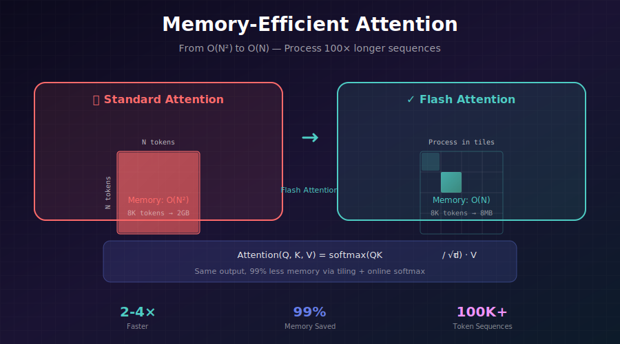
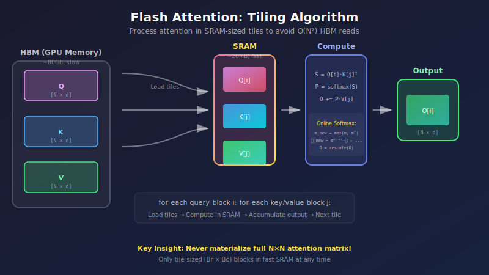
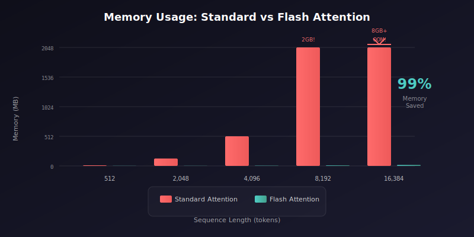

# 🧠 Memory-Efficient Attention

<div align="center">



*From O(N²) to O(N) memory — enabling longer sequences and bigger batches*

[](#)
[](#)
[](#)

</div>

---

## 🎯 Where & Why: Real-World Applications

### Where is Memory-Efficient Attention Used?

| Industry | Application | Impact | Who Uses It |
|----------|-------------|--------|-------------|
| 🎨 **Image Generation** | High-resolution diffusion models (2K, 4K) | Process 4× larger images | Stability AI, Midjourney |
| 🤖 **Large Language Models** | GPT-4, Claude, Llama with 100K+ context | Enable long documents | OpenAI, Anthropic, Meta |
| 🎬 **Video Generation** | Sora, Runway, Pika video models | Process 100+ frames | OpenAI, Runway |
| 🔬 **Scientific Research** | AlphaFold protein folding | Handle 10K+ residue sequences | DeepMind |
| 🎵 **Audio/Music** | AudioLM, MusicGen long sequences | Generate minutes of audio | Google, Meta |
| 📄 **Document AI** | Long document understanding | Process 100-page PDFs | Enterprise AI |

### Why Learn Memory-Efficient Attention?

> 💡 **The Quadratic Problem**: Standard attention with a sequence of 8K tokens needs **256× more memory** than 512 tokens. Flash Attention makes it linear!

**The Core Challenge:**

```
Standard Attention Memory = O(N²)
━━━━━━━━━━━━━━━━━━━━━━━━━━━━━━━━━━━━━━━━━━━━━━━━━━━
Sequence Length    Memory for Attention Matrix
512                1 MB
2,048              16 MB     (×16)
8,192              256 MB    (×256)
32,768             4 GB      (×4096)
131,072            64 GB     (×65536) ← Impossible!
━━━━━━━━━━━━━━━━━━━━━━━━━━━━━━━━━━━━━━━━━━━━━━━━━━━
```

**With Flash Attention (O(N) memory):**

```
Sequence Length    Memory      Speedup
512                0.03 MB     1.5×
2,048              0.12 MB     2×
8,192              0.5 MB      3×
32,768             2 MB        4×
131,072            8 MB        5× ← Now possible!
```

---

## 📐 The Mathematics of Attention

### Standard Attention Formula

The self-attention mechanism computes:

$$\text{Attention}(Q, K, V) = \text{softmax}\left(\frac{QK^T}{\sqrt{d_k}}\right)V$$

Where:
- \( Q \in \mathbb{R}^{N \times d_k} \) — Query matrix
- \( K \in \mathbb{R}^{N \times d_k} \) — Key matrix  
- \( V \in \mathbb{R}^{N \times d_v} \) — Value matrix
- \( N \) — Sequence length
- \( d_k \) — Key/Query dimension

### Memory Complexity Analysis

**Standard Implementation:**

```python
# Step 1: Compute attention scores
S = Q @ K.T / sqrt(d_k)    # S ∈ ℝ^(N×N) — O(N²) memory!

# Step 2: Apply softmax
P = softmax(S, dim=-1)      # P ∈ ℝ^(N×N) — O(N²) memory!

# Step 3: Compute output
O = P @ V                   # O ∈ ℝ^(N×d_v)
```

**Memory breakdown for N = 4096, d = 64:**
- Attention matrix \( S \): \( N^2 = 16M \) elements = **64 MB** (FP32)
- Softmax output \( P \): \( N^2 = 16M \) elements = **64 MB** (FP32)
- **Total per head**: ~128 MB
- **With 32 heads**: ~4 GB just for attention!

### The Softmax Decomposition (Key Insight)

The key to memory efficiency is understanding that softmax can be computed **incrementally**:

$$\text{softmax}(x_i) = \frac{e^{x_i}}{\sum_j e^{x_j}} = \frac{e^{x_i - m}}{\sum_j e^{x_j - m}}$$

Where \( m = \max(x) \) for numerical stability.

**Online Softmax Algorithm:**

$$m^{(new)} = \max(m^{(old)}, m^{(block)})$$

$$\ell^{(new)} = e^{m^{(old)} - m^{(new)}} \cdot \ell^{(old)} + e^{m^{(block)} - m^{(new)}} \cdot \ell^{(block)}$$

This allows computing attention **block by block** without storing the full \( N \times N \) matrix!

---

## ⚡ Flash Attention: The Algorithm

### Core Concept: Tiling + Recomputation

<div align="center">



</div>

Flash Attention achieves O(N) memory by:

1. **Tiling**: Process Q, K, V in blocks that fit in GPU SRAM
2. **Online Softmax**: Compute softmax incrementally across blocks
3. **Recomputation**: Recompute attention in backward pass (no storage)
4. **Fusion**: Single GPU kernel for entire operation

### Mathematical Formulation

For block sizes \( B_r \) (rows) and \( B_c \) (columns):

**Forward Pass:**
```
for each query block Qi (i = 1, ..., N/Br):
    Initialize: mi = -∞, ℓi = 0, Oi = 0
    
    for each key-value block (Kj, Vj) (j = 1, ..., N/Bc):
        # Load blocks to SRAM
        Sij = Qi @ Kj.T / √d
        
        # Online softmax update
        m̃ij = rowmax(Sij)
        P̃ij = exp(Sij - m̃ij)
        ℓ̃ij = rowsum(P̃ij)
        
        # Update running statistics
        mi_new = max(mi, m̃ij)
        ℓi_new = exp(mi - mi_new) · ℓi + exp(m̃ij - mi_new) · ℓ̃ij
        
        # Update output
        Oi = (ℓi · exp(mi - mi_new) · Oi + exp(m̃ij - mi_new) · P̃ij @ Vj) / ℓi_new
        
        mi = mi_new, ℓi = ℓi_new
```

### Memory Analysis

| Component | Standard | Flash Attention |
|-----------|----------|-----------------|
| Attention Matrix | \( O(N^2) \) | \( O(B_r \times B_c) \) |
| Softmax Statistics | \( O(N^2) \) | \( O(N) \) |
| Total Memory | \( O(N^2) \) | \( O(N) \) |

---

## 🔧 Implementation

### Using Flash Attention (Recommended)

```python
# Install: pip install flash-attn --no-build-isolation

from flash_attn import flash_attn_func, flash_attn_qkvpacked_func

class FlashSelfAttention(nn.Module):
    def __init__(self, dim, num_heads=8, dropout=0.0):
        super().__init__()
        self.num_heads = num_heads
        self.head_dim = dim // num_heads
        self.scale = self.head_dim ** -0.5
        
        self.qkv = nn.Linear(dim, dim * 3)
        self.proj = nn.Linear(dim, dim)
        self.dropout = dropout
    
    def forward(self, x):
        B, N, C = x.shape
        
        # Compute Q, K, V
        qkv = self.qkv(x).reshape(B, N, 3, self.num_heads, self.head_dim)
        
        # Flash Attention (expects: B, N, 3, H, D)
        out = flash_attn_qkvpacked_func(
            qkv, 
            dropout_p=self.dropout if self.training else 0.0,
            causal=False  # Set True for autoregressive
        )
        
        # Reshape and project
        out = out.reshape(B, N, C)
        return self.proj(out)
```

### PyTorch 2.0+ SDPA (Built-in)

```python
import torch.nn.functional as F

class SDPAttention(nn.Module):
    """Scaled Dot-Product Attention using PyTorch 2.0+ SDPA"""
    
    def __init__(self, dim, num_heads=8, dropout=0.0):
        super().__init__()
        self.num_heads = num_heads
        self.head_dim = dim // num_heads
        
        self.q_proj = nn.Linear(dim, dim)
        self.k_proj = nn.Linear(dim, dim)
        self.v_proj = nn.Linear(dim, dim)
        self.out_proj = nn.Linear(dim, dim)
        self.dropout = dropout
    
    def forward(self, x, attn_mask=None):
        B, N, C = x.shape
        
        # Project and reshape
        q = self.q_proj(x).reshape(B, N, self.num_heads, self.head_dim).transpose(1, 2)
        k = self.k_proj(x).reshape(B, N, self.num_heads, self.head_dim).transpose(1, 2)
        v = self.v_proj(x).reshape(B, N, self.num_heads, self.head_dim).transpose(1, 2)
        
        # Scaled Dot-Product Attention (auto-selects best implementation)
        out = F.scaled_dot_product_attention(
            q, k, v,
            attn_mask=attn_mask,
            dropout_p=self.dropout if self.training else 0.0,
            is_causal=False
        )
        
        # Reshape and project
        out = out.transpose(1, 2).reshape(B, N, C)
        return self.out_proj(out)
```

### xFormers Memory-Efficient Attention

```python
from xformers.ops import memory_efficient_attention, LowerTriangularMask

class XFormersAttention(nn.Module):
    def __init__(self, dim, num_heads=8):
        super().__init__()
        self.num_heads = num_heads
        self.head_dim = dim // num_heads
        
        self.qkv = nn.Linear(dim, dim * 3)
        self.proj = nn.Linear(dim, dim)
    
    def forward(self, x, causal=False):
        B, N, C = x.shape
        
        qkv = self.qkv(x).reshape(B, N, 3, self.num_heads, self.head_dim)
        q, k, v = qkv.unbind(2)  # Each: (B, N, H, D)
        
        # xFormers expects (B, N, H, D) format
        attn_bias = LowerTriangularMask() if causal else None
        out = memory_efficient_attention(q, k, v, attn_bias=attn_bias)
        
        return self.proj(out.reshape(B, N, C))
```

---

## 🎯 Attention Slicing (Fallback Method)

When Flash Attention isn't available, slice the computation:

```python
def sliced_attention(q, k, v, slice_size=1024):
    """
    Memory-efficient attention via query slicing.
    
    Args:
        q, k, v: (B, H, N, D) tensors
        slice_size: Number of queries to process at once
    """
    B, H, N, D = q.shape
    scale = D ** -0.5
    
    outputs = []
    
    for i in range(0, N, slice_size):
        # Process slice of queries against all keys
        q_slice = q[:, :, i:i+slice_size]  # (B, H, slice, D)
        
        # Compute attention for this slice
        attn = torch.matmul(q_slice, k.transpose(-2, -1)) * scale  # (B, H, slice, N)
        attn = F.softmax(attn, dim=-1)
        
        # Apply to values
        out_slice = torch.matmul(attn, v)  # (B, H, slice, D)
        outputs.append(out_slice)
    
    return torch.cat(outputs, dim=2)
```

### Memory Savings with Slicing

| Method | N=4096 | N=8192 | N=16384 |
|--------|--------|--------|---------|
| **Standard** | 256 MB | 1 GB | 4 GB |
| **Slice=1024** | 64 MB | 128 MB | 256 MB |
| **Slice=512** | 32 MB | 64 MB | 128 MB |

---

## 🎲 Integration with Diffusion Models

### Stable Diffusion / SDXL

```python
from diffusers import StableDiffusionPipeline

# Load pipeline
pipe = StableDiffusionPipeline.from_pretrained(
    "stabilityai/stable-diffusion-2-1",
    torch_dtype=torch.float16
)

# Enable memory-efficient attention (choose one)

# Option 1: xFormers (if installed)
pipe.enable_xformers_memory_efficient_attention()

# Option 2: PyTorch 2.0 SDPA
from diffusers.models.attention_processor import AttnProcessor2_0
pipe.unet.set_attn_processor(AttnProcessor2_0())

# Option 3: Attention slicing (works everywhere)
pipe.enable_attention_slicing(slice_size="auto")

# Generate
image = pipe("a beautiful sunset over mountains").images[0]
```

### Custom U-Net with Flash Attention

```python
class FlashAttentionUNetBlock(nn.Module):
    """U-Net block with Flash Attention for cross-attention"""
    
    def __init__(self, dim, context_dim, num_heads=8):
        super().__init__()
        self.norm1 = nn.LayerNorm(dim)
        self.self_attn = FlashSelfAttention(dim, num_heads)
        
        self.norm2 = nn.LayerNorm(dim)
        self.cross_attn = FlashCrossAttention(dim, context_dim, num_heads)
        
        self.norm3 = nn.LayerNorm(dim)
        self.ffn = FeedForward(dim)
    
    def forward(self, x, context):
        # Self-attention
        x = x + self.self_attn(self.norm1(x))
        
        # Cross-attention with text conditioning
        x = x + self.cross_attn(self.norm2(x), context)
        
        # Feed-forward
        x = x + self.ffn(self.norm3(x))
        
        return x


class FlashCrossAttention(nn.Module):
    def __init__(self, dim, context_dim, num_heads=8):
        super().__init__()
        self.num_heads = num_heads
        self.head_dim = dim // num_heads
        
        self.q_proj = nn.Linear(dim, dim)
        self.kv_proj = nn.Linear(context_dim, dim * 2)
        self.out_proj = nn.Linear(dim, dim)
    
    def forward(self, x, context):
        B, N, C = x.shape
        _, M, _ = context.shape
        
        q = self.q_proj(x).reshape(B, N, self.num_heads, self.head_dim)
        kv = self.kv_proj(context).reshape(B, M, 2, self.num_heads, self.head_dim)
        k, v = kv.unbind(2)
        
        # Flash attention for cross-attention
        from flash_attn import flash_attn_func
        out = flash_attn_func(q, k, v, causal=False)
        
        return self.out_proj(out.reshape(B, N, C))
```

---

## 📊 Performance Benchmarks

### Memory Usage Comparison

<div align="center">



</div>

| Sequence Length | Standard | Flash Attention | Savings |
|-----------------|----------|-----------------|---------|
| 512 | 8 MB | 0.5 MB | **94%** |
| 2,048 | 128 MB | 2 MB | **98%** |
| 4,096 | 512 MB | 4 MB | **99%** |
| 8,192 | 2 GB | 8 MB | **99.6%** |
| 16,384 | 8 GB | 16 MB | **99.8%** |

### Speed Comparison (A100 GPU)

| Method | 2K Tokens | 4K Tokens | 8K Tokens |
|--------|-----------|-----------|-----------|
| **Standard PyTorch** | 1.0× | 1.0× | OOM |
| **xFormers** | 1.3× | 1.5× | 1.8× |
| **Flash Attention** | 2.0× | 2.5× | 3.5× |
| **Flash Attention 2** | 2.2× | 3.0× | 4.5× |

---

## 🧮 Key Equations Summary

| Concept | Formula |
|---------|---------|
| **Standard Attention** | \( \text{Attention}(Q,K,V) = \text{softmax}\left(\frac{QK^T}{\sqrt{d_k}}\right)V \) |
| **Memory Complexity** | Standard: \( O(N^2) \), Flash: \( O(N) \) |
| **IO Complexity** | Standard: \( O(N^2 d) \), Flash: \( O(N^2 d^2 M^{-1}) \) |
| **Online Softmax** | \( m^{(new)} = \max(m^{(old)}, m^{(block)}) \) |
| **Normalization Update** | \( \ell^{(new)} = e^{m^{(old)}-m^{(new)}} \ell^{(old)} + e^{m^{(block)}-m^{(new)}} \ell^{(block)} \) |

---

## ⚠️ Common Pitfalls

### 1. Incorrect Tensor Layout

```python
# ❌ Wrong: Standard PyTorch attention expects (B, H, N, D)
# ❌ Flash Attention expects (B, N, H, D)

# ✅ Correct conversion
def convert_for_flash(x):
    # From (B, H, N, D) to (B, N, H, D)
    return x.transpose(1, 2).contiguous()
```

### 2. Forgetting Contiguous Tensors

```python
# ❌ Flash attention requires contiguous memory
q = q.view(B, N, H, D)  # May not be contiguous!

# ✅ Ensure contiguous
q = q.view(B, N, H, D).contiguous()
# Or use reshape which handles this
q = q.reshape(B, N, H, D)
```

### 3. Causal Mask Handling

```python
# For autoregressive models, use built-in causal support
out = flash_attn_func(q, k, v, causal=True)  # ✅ Efficient

# ❌ Don't pass explicit causal mask - it defeats memory savings
```

---

## 📚 References

1. **Dao, T., et al.** (2022). "FlashAttention: Fast and Memory-Efficient Exact Attention with IO-Awareness." *NeurIPS*. [arXiv:2205.14135](https://arxiv.org/abs/2205.14135)

2. **Dao, T.** (2023). "FlashAttention-2: Faster Attention with Better Parallelism and Work Partitioning." [arXiv:2307.08691](https://arxiv.org/abs/2307.08691)

3. **Lefaudeux, B., et al.** (2022). "xFormers: A modular and hackable Transformer modelling library." [GitHub](https://github.com/facebookresearch/xformers)

4. **Rabe, M. & Staats, C.** (2021). "Self-attention Does Not Need O(n²) Memory." [arXiv:2112.05682](https://arxiv.org/abs/2112.05682)

---

## ✏️ Exercises

<details>
<summary><b>Exercise 1:</b> Benchmark Memory Usage</summary>

**Task:** Measure GPU memory with standard vs Flash attention for different sequence lengths.

```python
import torch
from flash_attn import flash_attn_func

def benchmark_memory(seq_len, num_heads=8, head_dim=64):
    B = 4
    q = torch.randn(B, seq_len, num_heads, head_dim, device='cuda', dtype=torch.float16)
    k = torch.randn(B, seq_len, num_heads, head_dim, device='cuda', dtype=torch.float16)
    v = torch.randn(B, seq_len, num_heads, head_dim, device='cuda', dtype=torch.float16)
    
    torch.cuda.reset_peak_memory_stats()
    
    # Flash attention
    out = flash_attn_func(q, k, v)
    out.sum().backward()
    
    return torch.cuda.max_memory_allocated() / 1e6  # MB

# Test with different sequence lengths
for seq_len in [512, 1024, 2048, 4096, 8192]:
    mem = benchmark_memory(seq_len)
    print(f"Seq {seq_len}: {mem:.1f} MB")
```
</details>

<details>
<summary><b>Exercise 2:</b> Implement Chunked Attention</summary>

**Task:** Implement memory-efficient attention by chunking along the key dimension.

**Hint:** Process K, V in chunks while keeping full Q.
</details>

<details>
<summary><b>Exercise 3:</b> Enable Flash Attention in a Diffusion Model</summary>

**Task:** Modify a Stable Diffusion pipeline to use Flash Attention and measure the memory savings.
</details>

---

<div align="center">

**[← Gradient Checkpointing](../02_gradient_checkpointing/)** | **[Distributed Training →](../04_distributed_training/)**

*Unlock longer sequences and bigger batches*

</div>
