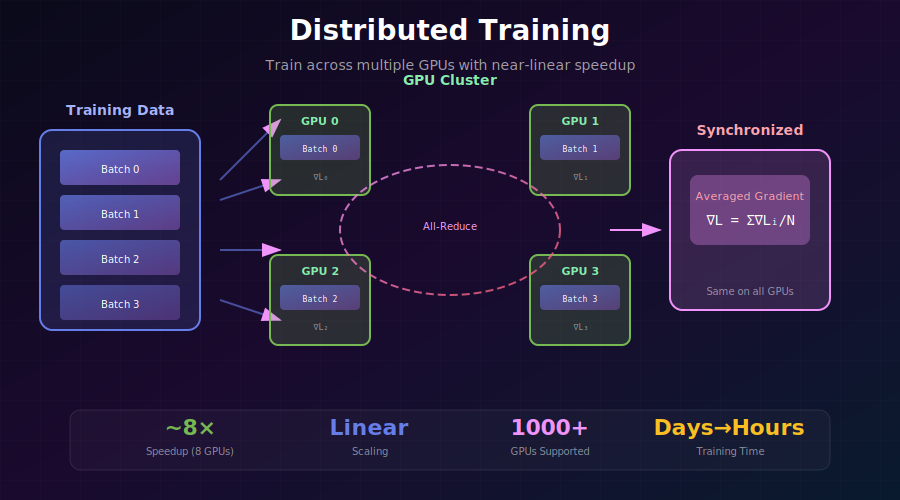
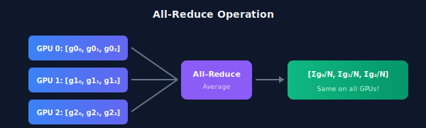
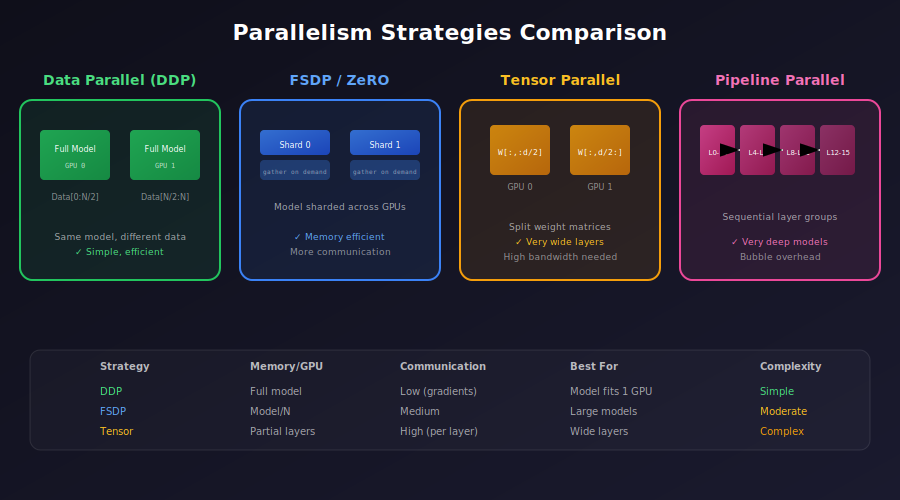
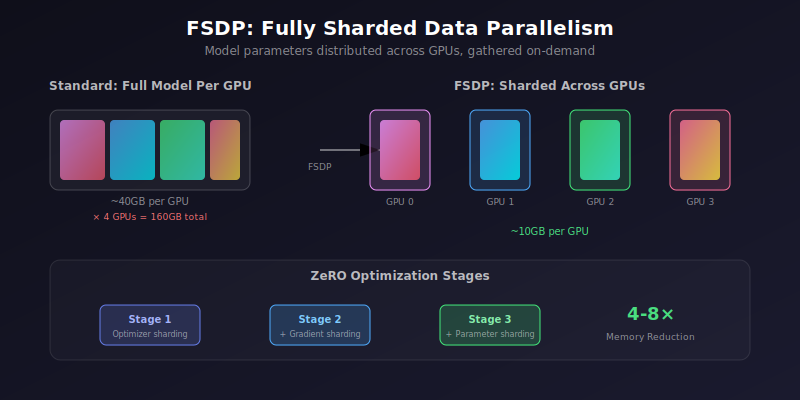

# 🖥️ Distributed Training

<div align="center">



*Train models across multiple GPUs — from hours to minutes*

[](#)
[](#)
[](#)

</div>

---

## 🎯 Where & Why: Real-World Applications

### Where is Distributed Training Used?

| Organization | Model | GPUs Used | Training Time | Impact |
|--------------|-------|-----------|---------------|--------|
| 🤖 **OpenAI** | GPT-4 | 10,000+ A100s | ~3 months | World-leading LLM |
| 🦙 **Meta** | Llama 2 70B | 2,000 A100s | ~35 days | Open-source revolution |
| 🎨 **Stability AI** | SDXL | 256 A100s | ~2 weeks | Image generation |
| 🔬 **DeepMind** | AlphaFold 2 | 128 TPUv3s | ~11 days | Protein folding |
| 🎵 **Google** | MusicLM | 512 TPUv4s | ~weeks | Music generation |
| 💬 **Anthropic** | Claude | 1000s of GPUs | ~months | Constitutional AI |

### Why Learn Distributed Training?

> 💡 **The Scaling Law Reality**: Modern AI capabilities scale with compute. Training competitive models requires distributing across many GPUs.

**The Core Challenge:**

```
Single GPU Training Reality
━━━━━━━━━━━━━━━━━━━━━━━━━━━━━━━━━━━━━━━━━━━━━━━━━━━━━━
Model Size    Single A100    8× A100 (DDP)    Speedup
100M params   1 hour         8 minutes        ~7.5×
1B params     10 hours       80 minutes       ~7.5×
10B params    4+ days        13 hours         ~7.5×
70B params    1 month+       4 days           ~7.5×
━━━━━━━━━━━━━━━━━━━━━━━━━━━━━━━━━━━━━━━━━━━━━━━━━━━━━━
```

**When you NEED distributed training:**

| Scenario | Why Distributed? |
|----------|------------------|
| **Model > GPU Memory** | Can't fit weights + gradients + optimizer states |
| **Training takes weeks** | Need to parallelize to iterate faster |
| **Large batch sizes** | Better convergence with larger effective batches |
| **Research deadlines** | Conference/product timelines require speed |
| **Production pipelines** | Need reproducible, scalable training |

---

## 📐 The Mathematics of Parallel Training

### Data Parallelism Fundamentals

In Data Parallel training, each GPU processes different data but maintains identical model copies:

$$\nabla L_{total} = \frac{1}{N} \sum_{i=1}^{N} \nabla L_i$$

Where:
- \( N \) = number of GPUs
- \( \nabla L_i \) = gradient from GPU \( i \)
- Gradients are **averaged** across all GPUs

**Effective Batch Size:**
$$B_{effective} = B_{per\_gpu} \times N_{gpus} \times G_{accumulation}$$

### Gradient Synchronization

**All-Reduce Operation:**

The key operation in data parallelism. Combines gradients from all GPUs:



**Ring All-Reduce Complexity:**

$$\text{Communication Time} = 2(N-1) \cdot \frac{D}{N \cdot B}$$

Where:
- \( N \) = number of GPUs
- \( D \) = total gradient size
- \( B \) = bandwidth between GPUs

### Scaling Efficiency

**Linear Scaling Rule** (Goyal et al., 2017):

When multiplying batch size by \( k \), multiply learning rate by \( k \):

$$\eta_{new} = k \cdot \eta_{base}$$

$$B_{new} = k \cdot B_{base}$$

**Warmup Schedule:**
$$\eta(t) = \begin{cases} \frac{t}{T_{warmup}} \cdot \eta_{target} & t < T_{warmup} \\ \eta_{target} & t \geq T_{warmup} \end{cases}$$

---

## 🔀 Parallelism Strategies

<div align="center">



</div>

### Strategy Comparison

| Strategy | What's Split | Memory/GPU | Communication | Best For |
|----------|--------------|------------|---------------|----------|
| **Data Parallel (DDP)** | Batch | Full model | Gradient sync | Model fits in 1 GPU |
| **FSDP / ZeRO** | Model + Optimizer | Model/N | More frequent | Large models |
| **Tensor Parallel** | Weight matrices | Partial model | Every layer | Very wide layers |
| **Pipeline Parallel** | Layers | Sequential subset | Between stages | Very deep models |

### Decision Tree

```
                    Model fits in single GPU memory?
                              │
              ┌───────────────┴───────────────┐
              │ YES                           │ NO
              ▼                               ▼
         Use DDP                    Need more than 8 GPUs?
    (fastest, simplest)                       │
                              ┌───────────────┴───────────────┐
                              │ NO                            │ YES
                              ▼                               ▼
                         Use FSDP                   Use Pipeline + Tensor
                   (model sharding)                   (3D parallelism)
```

---

## 🔧 Implementation: Data Parallelism (DDP)

### PyTorch DDP (Recommended)

```python
import os
import torch
import torch.distributed as dist
from torch.nn.parallel import DistributedDataParallel as DDP
from torch.utils.data import DataLoader, DistributedSampler

def setup(rank, world_size):
    """Initialize distributed process group"""
    os.environ['MASTER_ADDR'] = 'localhost'
    os.environ['MASTER_PORT'] = '12355'
    
    # Initialize process group (NCCL is fastest for NVIDIA GPUs)
    dist.init_process_group(
        backend="nccl",
        rank=rank,
        world_size=world_size
    )
    torch.cuda.set_device(rank)

def cleanup():
    dist.destroy_process_group()

def train(rank, world_size, args):
    setup(rank, world_size)
    
    # Create model and wrap with DDP
    model = UNet(args.config).to(rank)
    model = DDP(model, device_ids=[rank])
    
    # Distributed sampler ensures different data on each GPU
    dataset = ImageDataset(args.data_path)
    sampler = DistributedSampler(
        dataset,
        num_replicas=world_size,
        rank=rank,
        shuffle=True
    )
    
    dataloader = DataLoader(
        dataset,
        batch_size=args.batch_size,  # Per-GPU batch size
        sampler=sampler,
        num_workers=4,
        pin_memory=True
    )
    
    optimizer = torch.optim.AdamW(model.parameters(), lr=args.lr)
    
    for epoch in range(args.epochs):
        # IMPORTANT: Set epoch for proper shuffling
        sampler.set_epoch(epoch)
        
        for batch in dataloader:
            batch = batch.to(rank)
            optimizer.zero_grad()
            
            loss = compute_loss(model, batch)
            loss.backward()  # Gradients auto-synchronized!
            
            optimizer.step()
        
        # Only save on rank 0
        if rank == 0:
            torch.save(model.module.state_dict(), f"checkpoint_{epoch}.pt")
    
    cleanup()

# Launch distributed training
if __name__ == "__main__":
    world_size = torch.cuda.device_count()
    torch.multiprocessing.spawn(
        train,
        args=(world_size, args),
        nprocs=world_size,
        join=True
    )
```

### Launch with torchrun (Preferred)

```bash
# Single node, 4 GPUs
torchrun --nproc_per_node=4 train.py

# Multi-node (2 nodes, 4 GPUs each)
# Node 0:
torchrun --nproc_per_node=4 --nnodes=2 --node_rank=0 \
         --master_addr="192.168.1.1" --master_port=29500 train.py

# Node 1:
torchrun --nproc_per_node=4 --nnodes=2 --node_rank=1 \
         --master_addr="192.168.1.1" --master_port=29500 train.py
```

---

## 💾 FSDP: Fully Sharded Data Parallelism

<div align="center">



</div>

### When to Use FSDP

- Model doesn't fit on single GPU
- Training models with 1B+ parameters
- Want automatic sharding without code changes

### FSDP Implementation

```python
from torch.distributed.fsdp import (
    FullyShardedDataParallel as FSDP,
    ShardingStrategy,
    MixedPrecision,
    CPUOffload
)
from torch.distributed.fsdp.wrap import (
    transformer_auto_wrap_policy,
    size_based_auto_wrap_policy
)
import functools

def setup_fsdp_model(model, args):
    """Configure FSDP with optimal settings"""
    
    # Mixed precision policy
    mixed_precision_policy = MixedPrecision(
        param_dtype=torch.bfloat16,      # Parameters in BF16
        reduce_dtype=torch.bfloat16,      # Gradient reduction in BF16
        buffer_dtype=torch.bfloat16,      # Buffers in BF16
    )
    
    # Auto-wrap policy: wrap transformer blocks
    auto_wrap_policy = functools.partial(
        transformer_auto_wrap_policy,
        transformer_layer_cls={
            TransformerBlock,
            AttentionBlock,
        }
    )
    
    # Or wrap by size
    # auto_wrap_policy = functools.partial(
    #     size_based_auto_wrap_policy,
    #     min_num_params=100_000_000  # 100M params
    # )
    
    model = FSDP(
        model,
        sharding_strategy=ShardingStrategy.FULL_SHARD,  # ZeRO-3
        mixed_precision=mixed_precision_policy,
        auto_wrap_policy=auto_wrap_policy,
        cpu_offload=CPUOffload(offload_params=args.cpu_offload),
        device_id=torch.cuda.current_device(),
    )
    
    return model


def save_fsdp_checkpoint(model, optimizer, path, rank):
    """Save FSDP checkpoint (full state dict)"""
    from torch.distributed.fsdp import (
        FullStateDictConfig,
        StateDictType
    )
    
    # Gather full state dict on rank 0
    full_state_config = FullStateDictConfig(
        offload_to_cpu=True,
        rank0_only=True
    )
    
    with FSDP.state_dict_type(
        model,
        StateDictType.FULL_STATE_DICT,
        full_state_config
    ):
        state_dict = model.state_dict()
        
        if rank == 0:
            torch.save({
                'model': state_dict,
                'optimizer': optimizer.state_dict(),
            }, path)
```

### FSDP Sharding Strategies

| Strategy | Memory | Communication | Use Case |
|----------|--------|---------------|----------|
| **FULL_SHARD** | Minimum | Highest | Large models, memory-bound |
| **SHARD_GRAD_OP** | Medium | Medium | Balanced |
| **NO_SHARD** | Maximum | Lowest | Fast models, bandwidth-bound |

---

## 🚀 DeepSpeed Integration

### ZeRO Optimization Stages

```
ZeRO Stage 0: No optimization (baseline DDP)
ZeRO Stage 1: Optimizer state sharding (4× memory reduction)
ZeRO Stage 2: + Gradient sharding (8× memory reduction)
ZeRO Stage 3: + Parameter sharding (Linear with GPUs)
```

### DeepSpeed Configuration

```python
import deepspeed

# DeepSpeed config
ds_config = {
    "train_batch_size": 256,
    "gradient_accumulation_steps": 4,
    "fp16": {
        "enabled": True,
        "loss_scale": 0,
        "initial_scale_power": 16,
    },
    "zero_optimization": {
        "stage": 2,  # ZeRO Stage 2
        "offload_optimizer": {
            "device": "cpu",
            "pin_memory": True
        },
        "allgather_partitions": True,
        "reduce_scatter": True,
        "overlap_comm": True,
        "contiguous_gradients": True,
    },
    "gradient_clipping": 1.0,
    "optimizer": {
        "type": "AdamW",
        "params": {
            "lr": 1e-4,
            "betas": [0.9, 0.999],
            "eps": 1e-8,
            "weight_decay": 0.01
        }
    },
    "scheduler": {
        "type": "WarmupDecayLR",
        "params": {
            "warmup_min_lr": 0,
            "warmup_max_lr": 1e-4,
            "warmup_num_steps": 1000,
            "total_num_steps": 100000
        }
    }
}

# Initialize DeepSpeed
model, optimizer, _, scheduler = deepspeed.initialize(
    model=model,
    model_parameters=model.parameters(),
    config=ds_config
)

# Training loop
for batch in dataloader:
    loss = model(batch)
    model.backward(loss)
    model.step()
```

### ZeRO-3 for Giant Models

```python
ds_config_zero3 = {
    "zero_optimization": {
        "stage": 3,
        "offload_param": {
            "device": "cpu",
            "pin_memory": True
        },
        "offload_optimizer": {
            "device": "cpu",
            "pin_memory": True
        },
        "sub_group_size": 1e9,
        "stage3_prefetch_bucket_size": 5e7,
        "stage3_param_persistence_threshold": 1e5,
        "stage3_gather_16bit_weights_on_model_save": True,
    }
}
```

---

## 🎛️ HuggingFace Accelerate

The easiest way to add distributed training:

```python
from accelerate import Accelerator

# Initialize accelerator
accelerator = Accelerator(
    mixed_precision="bf16",
    gradient_accumulation_steps=4,
)

# Prepare model, optimizer, dataloader
model, optimizer, dataloader, scheduler = accelerator.prepare(
    model, optimizer, dataloader, scheduler
)

# Training loop (unchanged!)
for batch in dataloader:
    with accelerator.accumulate(model):
        outputs = model(batch)
        loss = compute_loss(outputs)
        
        accelerator.backward(loss)
        optimizer.step()
        scheduler.step()
        optimizer.zero_grad()

# Save model (handles distributed automatically)
accelerator.save_state("checkpoint/")
```

### Accelerate Config

```yaml
# accelerate_config.yaml
compute_environment: LOCAL_MACHINE
distributed_type: MULTI_GPU
num_machines: 1
num_processes: 8
mixed_precision: bf16
gradient_accumulation_steps: 4
```

Launch: `accelerate launch --config_file accelerate_config.yaml train.py`

---

## 📊 Performance Benchmarks

### Scaling Efficiency

| GPUs | Theoretical Speedup | Actual (DDP) | Actual (FSDP) |
|------|---------------------|--------------|---------------|
| 1 | 1.0× | 1.0× | 1.0× |
| 2 | 2.0× | 1.95× | 1.9× |
| 4 | 4.0× | 3.8× | 3.7× |
| 8 | 8.0× | 7.5× | 7.2× |
| 16 | 16.0× | 14.5× | 13.8× |
| 32 | 32.0× | 28× | 26× |

### Memory Comparison (7B Model)

| Method | Memory/GPU | Can Train? |
|--------|------------|------------|
| **Single GPU** | 140+ GB | ❌ OOM |
| **DDP** | 140+ GB | ❌ OOM |
| **FSDP (Stage 3)** | ~25 GB | ✅ Yes |
| **DeepSpeed ZeRO-3** | ~20 GB | ✅ Yes |
| **+ CPU Offload** | ~8 GB | ✅ Yes |

---

## 🧮 Key Equations Summary

| Concept | Formula |
|---------|---------|
| **Effective Batch Size** | \( B_{eff} = B_{gpu} \times N_{gpus} \times G_{accum} \) |
| **Linear Scaling** | \( \eta_{new} = \eta_{base} \times \frac{B_{new}}{B_{base}} \) |
| **Gradient Sync** | \( \nabla L = \frac{1}{N}\sum_{i=1}^{N} \nabla L_i \) |
| **All-Reduce Time** | \( T = 2(N-1) \cdot \frac{D}{N \cdot B} \) |
| **Scaling Efficiency** | \( \eta_{scale} = \frac{T_1}{N \cdot T_N} \) |

---

## ⚠️ Common Pitfalls

### 1. Forgetting to Set Epoch

```python
# ❌ Wrong: Same data order every epoch
for batch in dataloader:
    ...

# ✅ Correct: Different shuffling each epoch
sampler.set_epoch(epoch)
for batch in dataloader:
    ...
```

### 2. Incorrect Learning Rate Scaling

```python
# ❌ Wrong: Same LR with more GPUs
lr = 1e-4

# ✅ Correct: Scale LR with effective batch size
base_lr = 1e-4
base_batch = 32
effective_batch = batch_per_gpu * world_size * grad_accum
lr = base_lr * (effective_batch / base_batch)
```

### 3. Saving Only on Rank 0

```python
# ❌ Wrong: All ranks try to save
torch.save(model.state_dict(), "model.pt")

# ✅ Correct: Only rank 0 saves
if dist.get_rank() == 0:
    torch.save(model.module.state_dict(), "model.pt")
```

---

## 📚 References

1. **Goyal, P., et al.** (2017). "Accurate, Large Minibatch SGD: Training ImageNet in 1 Hour." [arXiv:1706.02677](https://arxiv.org/abs/1706.02677)

2. **Rajbhandari, S., et al.** (2020). "ZeRO: Memory Optimizations Toward Training Trillion Parameter Models." *SC20*. [arXiv:1910.02054](https://arxiv.org/abs/1910.02054)

3. **Zhao, Y., et al.** (2023). "PyTorch FSDP: Experiences on Scaling Fully Sharded Data Parallel." [arXiv:2304.11277](https://arxiv.org/abs/2304.11277)

4. **Narayanan, D., et al.** (2021). "Efficient Large-Scale Language Model Training on GPU Clusters Using Megatron-LM." *SC21*. [arXiv:2104.04473](https://arxiv.org/abs/2104.04473)

---

## ✏️ Exercises

<details>
<summary><b>Exercise 1:</b> Convert Single-GPU to DDP</summary>

**Task:** Take a single-GPU training script and convert it to use DDP.

**Checklist:**
- [ ] Initialize process group
- [ ] Wrap model with DDP
- [ ] Use DistributedSampler
- [ ] Set epoch on sampler
- [ ] Save only on rank 0
</details>

<details>
<summary><b>Exercise 2:</b> Measure Scaling Efficiency</summary>

**Task:** Train a model with 1, 2, 4, and 8 GPUs and plot the speedup curve.

**Metric:** Time per epoch vs. number of GPUs
</details>

<details>
<summary><b>Exercise 3:</b> Configure FSDP for a Large Model</summary>

**Task:** Set up FSDP to train a 7B parameter model on 4× 24GB GPUs.

**Hint:** Use FULL_SHARD + CPU offloading
</details>

---

<div align="center">

**[← Memory-Efficient Attention](../03_memory_efficient_attention/)** | **[Training at Scale →](../05_training_at_scale/)**

*Scale your training across the GPU cluster*

</div>
