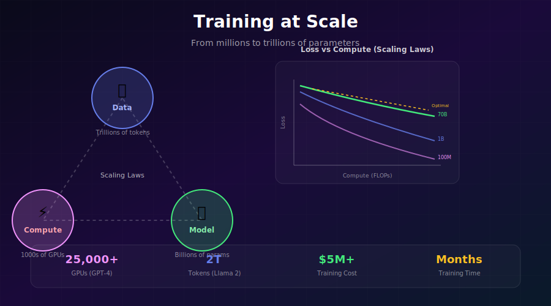
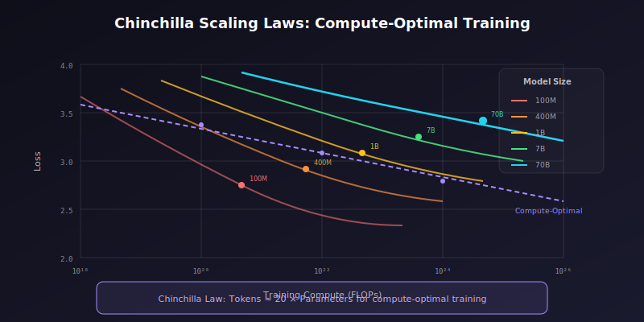
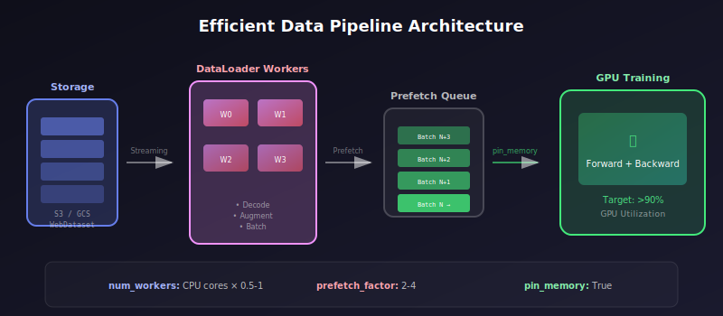

# 📈 Training at Scale

<div align="center">



*From research prototype to production-grade training pipelines*

[](#)
[](#)
[](#)

</div>

---

## 🎯 Where & Why: Real-World Applications

### Where is Large-Scale Training Used?

| Organization | Model | Dataset Size | Compute | Result |
|--------------|-------|--------------|---------|--------|
| 🤖 **OpenAI** | GPT-4 | ~13T tokens | 25,000 A100s | AGI research |
| 🦙 **Meta** | Llama 2 | 2T tokens | 2,000 A100s (35 days) | Open-source LLM |
| 🎨 **Stability AI** | SDXL | 2B images | 256 A100s (2 weeks) | Image generation |
| 🔬 **DeepMind** | Gemini | Multi-modal | TPU v4 pods | Multimodal AI |
| 🎵 **Google** | MusicLM | Millions of hours | 512 TPUv4s | Music generation |
| 🧬 **DeepMind** | AlphaFold 2 | 170K proteins | 128 TPUv3s | Protein structure |

### Why Learn Large-Scale Training?

> 💡 **The Scaling Law**: Model capabilities improve predictably with compute, data, and parameters. Training at scale unlocks emergent abilities.

**The Core Challenge:**

```
Large-Scale Training Complexity
━━━━━━━━━━━━━━━━━━━━━━━━━━━━━━━━━━━━━━━━━━━━━━━━━━━━━━━━━━━━━
Challenge              Impact                 Solution
━━━━━━━━━━━━━━━━━━━━━━━━━━━━━━━━━━━━━━━━━━━━━━━━━━━━━━━━━━━━━
Training Stability     Loss spikes, NaN       Gradient clipping, LR warmup
Learning Rate         Divergence             Proper scheduling, scaling
Data Pipeline         GPU starvation         Streaming, prefetching
Checkpointing         Lost progress          Frequent saves, redundancy
Reproducibility       Inconsistent results   Deterministic ops, seeding
Cost Management       Budget overruns        Efficient scheduling
━━━━━━━━━━━━━━━━━━━━━━━━━━━━━━━━━━━━━━━━━━━━━━━━━━━━━━━━━━━━━
```

### Real Costs of Large-Scale Training

| Model | Training Compute | Estimated Cost | Time |
|-------|------------------|----------------|------|
| GPT-3 (175B) | ~3,640 PF-days | ~$4.6M | Months |
| Stable Diffusion | ~150,000 A100-hours | ~$600K | Weeks |
| Llama 2 (70B) | ~1.7M A100-hours | ~$5M | 5 weeks |
| GPT-4 | ~Unknown | ~$100M+ | Months |

---

## 📐 The Mathematics of Scaling

### Compute-Optimal Training (Chinchilla Scaling)

<div align="center">



</div>

The **Chinchilla scaling law** (Hoffmann et al., 2022) provides optimal allocation:

$$N_{opt} \approx 0.7 \cdot C^{0.5}$$
$$D_{opt} \approx 1.4 \cdot C^{0.5}$$

Where:
- \( C \) = compute budget (FLOPs)
- \( N_{opt} \) = optimal number of parameters
- \( D_{opt} \) = optimal number of tokens

**Practical implication:** For compute-optimal training:
$$\text{Tokens} \approx 20 \times \text{Parameters}$$

### Learning Rate Scaling

**Linear Scaling Rule:**

When increasing batch size by factor \( k \):

$$\eta_{new} = k \cdot \eta_{base}$$

**Square Root Scaling (for very large batches):**

$$\eta_{new} = \sqrt{k} \cdot \eta_{base}$$

**Critical Batch Size:**

Beyond a certain batch size, returns diminish:

$$B_{crit} = \frac{E[g^2]}{E[g]^2}$$

### Training FLOPs Estimation

For transformer models:

$$C \approx 6 \cdot N \cdot D$$

Where:
- \( C \) = total FLOPs
- \( N \) = parameters
- \( D \) = tokens

For a **forward + backward pass**:
$$\text{FLOPs/token} \approx 6N$$

---

## 🔧 Hardware Planning

### Memory Requirements

For training a model with \( N \) parameters in mixed precision:

$$\text{Memory}_{total} = \text{Memory}_{model} + \text{Memory}_{optimizer} + \text{Memory}_{activations}$$

| Component | FP32 | Mixed Precision |
|-----------|------|-----------------|
| **Model Weights** | \( 4N \) bytes | \( 2N \) bytes (FP16) + \( 4N \) bytes (FP32 copy) |
| **Gradients** | \( 4N \) bytes | \( 2N \) bytes |
| **Adam States** | \( 8N \) bytes | \( 8N \) bytes (FP32) |
| **Activations** | Variable | \( \propto B \cdot L \cdot d \) |

**Rule of thumb:** ~16-20 bytes per parameter for AdamW training

### GPU Cluster Sizing

```python
def estimate_gpus_needed(
    model_params: int,          # In billions
    sequence_length: int = 2048,
    batch_size_per_gpu: int = 4,
    gpu_memory_gb: int = 80,    # A100 80GB
    strategy: str = "fsdp"      # ddp, fsdp, or deepspeed
) -> dict:
    """Estimate GPU requirements for training."""
    
    # Memory per parameter (bytes)
    bytes_per_param = 18  # Mixed precision + Adam
    
    # Model memory (GB)
    model_memory = (model_params * 1e9 * bytes_per_param) / 1e9
    
    # Activation memory estimate (rough)
    activation_memory = (
        batch_size_per_gpu * sequence_length * model_params * 0.5  # GB
    )
    
    if strategy == "ddp":
        # Full model on each GPU
        memory_per_gpu = model_memory + activation_memory
        min_gpus = max(1, int(memory_per_gpu / gpu_memory_gb) + 1)
    elif strategy == "fsdp":
        # Model sharded across GPUs
        min_gpus = max(4, int(model_memory / (gpu_memory_gb * 0.7)))
        memory_per_gpu = model_memory / min_gpus + activation_memory
    
    return {
        "min_gpus": min_gpus,
        "memory_per_gpu": memory_per_gpu,
        "total_memory": model_memory + activation_memory * min_gpus
    }

# Example: 7B model
print(estimate_gpus_needed(7))
# {'min_gpus': 2, 'memory_per_gpu': ~70GB, ...}
```

---

## 📊 Data Pipeline at Scale

### Streaming Datasets

```python
from torch.utils.data import IterableDataset
import webdataset as wds

class StreamingImageDataset(IterableDataset):
    """Memory-efficient streaming dataset for billions of samples."""
    
    def __init__(self, shards_pattern, transform=None, shuffle_buffer=10000):
        self.shards_pattern = shards_pattern
        self.transform = transform
        self.shuffle_buffer = shuffle_buffer
    
    def __iter__(self):
        # WebDataset handles distributed sharding automatically
        dataset = (
            wds.WebDataset(self.shards_pattern, shardshuffle=True)
            .shuffle(self.shuffle_buffer)
            .decode("pil")
            .to_tuple("jpg", "txt")
        )
        
        for image, caption in dataset:
            if self.transform:
                image = self.transform(image)
            yield {"image": image, "caption": caption}


# Usage with distributed training
def get_dataloader(rank, world_size, batch_size):
    dataset = StreamingImageDataset(
        shards_pattern="s3://bucket/data-{000000..010000}.tar",
        transform=train_transforms
    )
    
    # WebDataset handles worker splitting
    dataloader = DataLoader(
        dataset,
        batch_size=batch_size,
        num_workers=8,
        pin_memory=True,
        prefetch_factor=4
    )
    
    return dataloader
```

### Data Loading Best Practices

<div align="center">



</div>

```python
# Optimal DataLoader configuration
dataloader = DataLoader(
    dataset,
    batch_size=batch_size,
    num_workers=min(8, os.cpu_count()),  # Don't over-allocate
    pin_memory=True,                       # Faster GPU transfer
    prefetch_factor=4,                     # Prefetch batches
    persistent_workers=True,               # Keep workers alive
    drop_last=True,                        # Consistent batch sizes
)
```

---

## 📈 Training Stability

### Learning Rate Schedule

```python
import math
from torch.optim.lr_scheduler import LambdaLR

def get_cosine_schedule_with_warmup(
    optimizer,
    num_warmup_steps: int,
    num_training_steps: int,
    min_lr_ratio: float = 0.1
):
    """
    Cosine annealing with linear warmup.
    
    Standard schedule for large-scale training.
    """
    def lr_lambda(current_step: int):
        # Warmup phase
        if current_step < num_warmup_steps:
            return float(current_step) / float(max(1, num_warmup_steps))
        
        # Cosine annealing phase
        progress = float(current_step - num_warmup_steps) / float(
            max(1, num_training_steps - num_warmup_steps)
        )
        return min_lr_ratio + (1 - min_lr_ratio) * 0.5 * (
            1.0 + math.cos(math.pi * progress)
        )
    
    return LambdaLR(optimizer, lr_lambda)


# Warmup calculation
# Rule: ~1-5% of total steps, or until loss stabilizes
warmup_steps = min(
    10000,
    int(0.03 * total_steps)  # 3% warmup
)
```

### Gradient Clipping & Monitoring

```python
class TrainingMonitor:
    """Monitor training health at scale."""
    
    def __init__(self, model, log_every=100):
        self.model = model
        self.log_every = log_every
        self.grad_history = []
        self.loss_history = []
    
    def log_gradients(self, step):
        """Track gradient statistics for debugging."""
        total_norm = 0.0
        param_norms = {}
        
        for name, param in self.model.named_parameters():
            if param.grad is not None:
                param_norm = param.grad.data.norm(2).item()
                total_norm += param_norm ** 2
                param_norms[name] = param_norm
        
        total_norm = total_norm ** 0.5
        self.grad_history.append(total_norm)
        
        if step % self.log_every == 0:
            # Log to W&B, TensorBoard, etc.
            wandb.log({
                "grad_norm": total_norm,
                "grad_norm_max": max(param_norms.values()),
                "grad_norm_min": min(param_norms.values()),
            }, step=step)
        
        # Alert on gradient explosion
        if total_norm > 100 or math.isnan(total_norm):
            print(f"⚠️ Gradient explosion at step {step}: {total_norm}")
            return False
        
        return True
    
    def should_skip_step(self, loss):
        """Skip steps with bad loss values."""
        if math.isnan(loss) or math.isinf(loss):
            return True
        if len(self.loss_history) > 0:
            # Skip if loss spikes more than 10x
            if loss > 10 * sum(self.loss_history[-100:]) / len(self.loss_history[-100:]):
                return True
        return False
```

### Exponential Moving Average (EMA)

```python
import copy

class EMAModel:
    """
    Exponential Moving Average of model weights.
    
    Essential for stable training and better final models.
    """
    
    def __init__(self, model, decay=0.9999, device=None):
        self.decay = decay
        self.device = device
        
        # Create EMA model
        self.ema_model = copy.deepcopy(model)
        self.ema_model.eval()
        self.ema_model.requires_grad_(False)
        
        if device:
            self.ema_model.to(device)
    
    @torch.no_grad()
    def update(self, model):
        """Update EMA weights."""
        for ema_param, param in zip(
            self.ema_model.parameters(),
            model.parameters()
        ):
            ema_param.data.mul_(self.decay).add_(
                param.data, alpha=1 - self.decay
            )
    
    def forward(self, *args, **kwargs):
        return self.ema_model(*args, **kwargs)
    
    def state_dict(self):
        return self.ema_model.state_dict()


# Usage
ema = EMAModel(model, decay=0.9999)

for step, batch in enumerate(dataloader):
    loss = train_step(model, batch)
    optimizer.step()
    
    # Update EMA after each step
    ema.update(model)
    
    # Use EMA for evaluation
    if step % eval_every == 0:
        eval_loss = evaluate(ema.ema_model, eval_dataloader)
```

---

## 💾 Checkpointing Strategy

### Robust Checkpointing

```python
import os
import torch
from pathlib import Path

class CheckpointManager:
    """
    Production-grade checkpoint management.
    
    Features:
    - Automatic rotation
    - Async saving
    - Corruption detection
    - Distributed-aware
    """
    
    def __init__(
        self,
        save_dir: str,
        max_checkpoints: int = 5,
        save_every: int = 1000
    ):
        self.save_dir = Path(save_dir)
        self.save_dir.mkdir(parents=True, exist_ok=True)
        self.max_checkpoints = max_checkpoints
        self.save_every = save_every
        self.checkpoints = []
    
    def save(
        self,
        model,
        optimizer,
        scheduler,
        step: int,
        ema=None,
        extra_state=None,
        rank: int = 0
    ):
        """Save checkpoint with rotation."""
        if rank != 0:
            return  # Only save on rank 0
        
        checkpoint = {
            'step': step,
            'model_state_dict': model.state_dict(),
            'optimizer_state_dict': optimizer.state_dict(),
            'scheduler_state_dict': scheduler.state_dict(),
        }
        
        if ema is not None:
            checkpoint['ema_state_dict'] = ema.state_dict()
        
        if extra_state is not None:
            checkpoint.update(extra_state)
        
        # Save with temporary name first (atomic write)
        path = self.save_dir / f"checkpoint_{step}.pt"
        temp_path = self.save_dir / f"checkpoint_{step}.pt.tmp"
        
        torch.save(checkpoint, temp_path)
        temp_path.rename(path)  # Atomic rename
        
        self.checkpoints.append(path)
        
        # Rotate old checkpoints
        while len(self.checkpoints) > self.max_checkpoints:
            old_path = self.checkpoints.pop(0)
            if old_path.exists():
                old_path.unlink()
        
        print(f"✓ Saved checkpoint at step {step}")
    
    def load_latest(self, model, optimizer, scheduler, ema=None):
        """Load most recent checkpoint."""
        checkpoints = sorted(
            self.save_dir.glob("checkpoint_*.pt"),
            key=lambda p: int(p.stem.split('_')[1])
        )
        
        if not checkpoints:
            print("No checkpoints found, starting fresh")
            return 0
        
        latest = checkpoints[-1]
        print(f"Loading checkpoint: {latest}")
        
        checkpoint = torch.load(latest, map_location='cpu')
        
        model.load_state_dict(checkpoint['model_state_dict'])
        optimizer.load_state_dict(checkpoint['optimizer_state_dict'])
        scheduler.load_state_dict(checkpoint['scheduler_state_dict'])
        
        if ema is not None and 'ema_state_dict' in checkpoint:
            ema.ema_model.load_state_dict(checkpoint['ema_state_dict'])
        
        return checkpoint['step']
```

---

## 🔍 Monitoring & Observability

### Comprehensive Logging

```python
import wandb
from datetime import datetime

class ExperimentTracker:
    """Track all aspects of training run."""
    
    def __init__(self, config, project_name="diffusion-training"):
        self.run = wandb.init(
            project=project_name,
            config=config,
            name=f"{config.model_name}_{datetime.now():%Y%m%d_%H%M}",
            tags=[config.model_size, config.dataset],
        )
        
        self.step = 0
        self.start_time = datetime.now()
    
    def log_training_step(
        self,
        loss: float,
        lr: float,
        grad_norm: float,
        throughput: float,  # samples/sec
        gpu_memory: float,
    ):
        """Log per-step metrics."""
        elapsed = (datetime.now() - self.start_time).total_seconds()
        
        wandb.log({
            "train/loss": loss,
            "train/learning_rate": lr,
            "train/grad_norm": grad_norm,
            "train/throughput": throughput,
            "train/samples_seen": self.step * self.batch_size,
            "system/gpu_memory_gb": gpu_memory,
            "system/elapsed_hours": elapsed / 3600,
        }, step=self.step)
        
        self.step += 1
    
    def log_evaluation(self, metrics: dict, samples=None):
        """Log evaluation metrics and samples."""
        eval_metrics = {f"eval/{k}": v for k, v in metrics.items()}
        
        if samples is not None:
            eval_metrics["samples"] = wandb.Image(samples)
        
        wandb.log(eval_metrics, step=self.step)
    
    def log_system_metrics(self):
        """Log GPU utilization, temperature, etc."""
        import pynvml
        pynvml.nvmlInit()
        
        for i in range(torch.cuda.device_count()):
            handle = pynvml.nvmlDeviceGetHandleByIndex(i)
            util = pynvml.nvmlDeviceGetUtilizationRates(handle)
            temp = pynvml.nvmlDeviceGetTemperature(
                handle, pynvml.NVML_TEMPERATURE_GPU
            )
            memory = pynvml.nvmlDeviceGetMemoryInfo(handle)
            
            wandb.log({
                f"gpu_{i}/utilization": util.gpu,
                f"gpu_{i}/memory_used_gb": memory.used / 1e9,
                f"gpu_{i}/temperature_c": temp,
            }, step=self.step)
```

---

## 🧮 Key Equations Summary

| Concept | Formula |
|---------|---------|
| **Training FLOPs** | \( C \approx 6ND \) (N=params, D=tokens) |
| **Chinchilla Optimal** | \( D_{opt} \approx 20N \) |
| **Linear LR Scaling** | \( \eta_{new} = k \cdot \eta_{base} \) |
| **Warmup Steps** | \( T_{warmup} \approx 0.01-0.05 \times T_{total} \) |
| **EMA Update** | \( \theta_{EMA} = \beta \theta_{EMA} + (1-\beta)\theta \) |
| **Memory/Param** | ~16-20 bytes (AdamW + Mixed Precision) |

---

## ⚠️ Common Pitfalls at Scale

### 1. Learning Rate Too High After Scaling

```python
# ❌ Wrong: Directly scale LR with batch size
lr = base_lr * (batch_size / 256)  # May cause divergence!

# ✅ Correct: Use square root scaling for large batches
lr = base_lr * math.sqrt(batch_size / 256)

# ✅ Better: Tune LR independently, use longer warmup
```

### 2. Insufficient Warmup

```python
# ❌ Wrong: Fixed short warmup
warmup_steps = 1000

# ✅ Correct: Scale warmup with total training
warmup_steps = max(1000, int(0.03 * total_steps))
```

### 3. Not Monitoring Gradient Norms

```python
# ✅ Always monitor and clip gradients
grad_norm = torch.nn.utils.clip_grad_norm_(model.parameters(), max_norm=1.0)

if grad_norm > 10:
    logger.warning(f"Large gradient norm: {grad_norm}")
```

---

## 📚 References

1. **Hoffmann, J., et al.** (2022). "Training Compute-Optimal Large Language Models." [arXiv:2203.15556](https://arxiv.org/abs/2203.15556) (Chinchilla)

2. **Kaplan, J., et al.** (2020). "Scaling Laws for Neural Language Models." [arXiv:2001.08361](https://arxiv.org/abs/2001.08361)

3. **Goyal, P., et al.** (2017). "Accurate, Large Minibatch SGD: Training ImageNet in 1 Hour." [arXiv:1706.02677](https://arxiv.org/abs/1706.02677)

4. **Touvron, H., et al.** (2023). "Llama 2: Open Foundation and Fine-Tuned Chat Models." [arXiv:2307.09288](https://arxiv.org/abs/2307.09288)

---

## ✏️ Exercises

<details>
<summary><b>Exercise 1:</b> Calculate Training Requirements</summary>

**Task:** Estimate the compute and cost to train a 13B parameter model on 1T tokens.

**Hints:**
- FLOPs ≈ 6 × N × D
- A100 delivers ~300 TFLOPS (FP16)
- A100 costs ~$2-3/hour on cloud
</details>

<details>
<summary><b>Exercise 2:</b> Implement Training Health Checks</summary>

**Task:** Create a monitoring class that detects:
- Loss spikes (>3x recent average)
- Gradient explosions (>100 norm)
- NaN values
- Learning rate anomalies
</details>

<details>
<summary><b>Exercise 3:</b> Optimize Data Pipeline</summary>

**Task:** Profile your DataLoader and optimize to achieve >90% GPU utilization.

**Metrics to track:**
- Data loading time vs compute time
- GPU utilization percentage
- CPU utilization
</details>

---

<div align="center">

**[← Distributed Training](../04_distributed_training/)** | **[Inference Optimization →](../06_inference_optimization/)**

*Master the art of training at scale*

</div>
