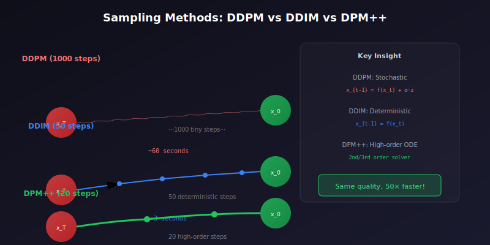
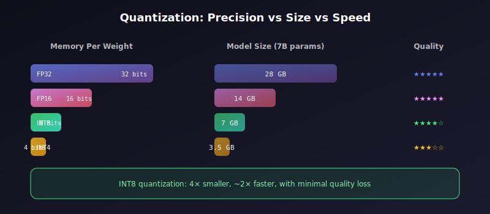

# ⚡ Inference Optimization

<div align="center">


*From minutes to milliseconds — making AI real-time*

[](#)
[](#)
[](#)

</div>

---

## 🎯 Where & Why: Real-World Applications

### Where is Inference Optimization Used?

| Application | Requirement | Optimization | Impact |
|-------------|-------------|--------------|--------|
| 📱 **Mobile Apps** | <100ms response | Quantization, distillation | Real-time filters |
| 🎮 **Gaming** | 60 FPS | TensorRT, batching | AI NPCs, DLSS |
| 🏭 **Manufacturing** | 24/7 operation | Efficient models | Quality control |
| 💬 **Chatbots** | <2s first response | KV caching, speculative | User experience |
| 🎨 **Image Generation** | <5s per image | Few-step models | User engagement |
| 🚗 **Autonomous Vehicles** | <50ms decisions | Specialized hardware | Safety-critical |

### Why Learn Inference Optimization?

> 💡 **The Deployment Reality**: A model is only as good as its deployment. The fastest model in the lab is useless if it's too slow in production.

**The Optimization Landscape:**

```
Inference Speed Journey (512×512 Diffusion)
━━━━━━━━━━━━━━━━━━━━━━━━━━━━━━━━━━━━━━━━━━━━━━━━━━━━━━━━━
Method                Steps    Time        Speedup
━━━━━━━━━━━━━━━━━━━━━━━━━━━━━━━━━━━━━━━━━━━━━━━━━━━━━━━━━
DDPM (Original)       1000     ~60s        1×
DDIM                  50       ~3s         20×
DPM++ 2M              20       ~1.2s       50×
LCM (Distilled)       4        ~0.3s       200×
SDXL Turbo            1        ~0.1s       600×
━━━━━━━━━━━━━━━━━━━━━━━━━━━━━━━━━━━━━━━━━━━━━━━━━━━━━━━━━
```

### Cost Impact

| Optimization | Latency Impact | Cost Reduction | User Experience |
|--------------|----------------|----------------|-----------------|
| **50→20 steps** | 2.5× faster | ~60% | Acceptable wait |
| **+ TensorRT** | 5× faster | ~80% | Near instant |
| **+ Batching** | N× throughput | ~90% | Scale efficiently |
| **+ Distillation** | 10-50× faster | ~95% | Real-time |

---

## 📐 The Mathematics of Fast Sampling

### From DDPM to DDIM

<div align="center">



</div>

**DDPM (Denoising Diffusion Probabilistic Models):**

$$x_{t-1} = \frac{1}{\sqrt{\alpha_t}}\left(x_t - \frac{\beta_t}{\sqrt{1-\bar{\alpha}_t}}\epsilon_\theta(x_t, t)\right) + \sigma_t z$$

Requires 1000 steps because each step is small and stochastic.

**DDIM (Denoising Diffusion Implicit Models):**

$$x_{t-1} = \sqrt{\bar{\alpha}_{t-1}}\left(\frac{x_t - \sqrt{1-\bar{\alpha}_t}\epsilon_\theta(x_t, t)}{\sqrt{\bar{\alpha}_t}}\right) + \sqrt{1-\bar{\alpha}_{t-1}-\sigma_t^2}\epsilon_\theta(x_t, t) + \sigma_t z$$

**Key insight:** DDIM makes the process deterministic when \(\sigma_t = 0\), allowing larger steps!

### ODE Solvers for Diffusion

The diffusion process can be viewed as solving an ODE:

$$\frac{dx}{dt} = f(x, t) = \frac{\dot{\sigma}(t)}{\sigma(t)}x - \frac{\dot{\sigma}(t)\sigma(t)}{s(t)^2}\nabla_x \log p_t(x)$$

**DPM-Solver** uses high-order ODE solvers:

$$x_{t_{i+1}} = e^{h_i}x_{t_i} + \sum_{j=0}^{k} c_j \epsilon_\theta(x_{t_{i-j}}, t_{i-j})$$

| Solver | Order | Steps for Good Quality | Math |
|--------|-------|------------------------|------|
| **DDIM** | 1 | 50+ | Euler method |
| **DPM++ 2S** | 2 | 20-30 | 2nd order solver |
| **DPM++ 2M** | 2 | 15-25 | Multistep |
| **DPM++ 3M** | 3 | 10-20 | Higher order |

### Consistency Distillation Loss

**Latent Consistency Models (LCM)** use:

$$\mathcal{L}_{CD} = \mathbb{E}_{x, t, t'}\left[d(f_\theta(x_t, t), f_{\theta^-}(x_{t'}, t'))\right]$$

Where \(f_\theta\) is the consistency function that maps any point to the trajectory's endpoint.

---

## 🔧 Implementation

### Fast Schedulers in Diffusers

```python
from diffusers import (
    StableDiffusionPipeline,
    DPMSolverMultistepScheduler,
    EulerAncestralDiscreteScheduler,
    LCMScheduler
)

# Load base pipeline
pipe = StableDiffusionPipeline.from_pretrained(
    "stabilityai/stable-diffusion-2-1",
    torch_dtype=torch.float16
).to("cuda")

# Option 1: DPM++ 2M (Best quality/speed balance)
pipe.scheduler = DPMSolverMultistepScheduler.from_config(
    pipe.scheduler.config,
    algorithm_type="dpmsolver++",
    solver_order=2,
    use_karras_sigmas=True
)
image = pipe(prompt, num_inference_steps=20).images[0]

# Option 2: Euler Ancestral (Good for artistic styles)
pipe.scheduler = EulerAncestralDiscreteScheduler.from_config(
    pipe.scheduler.config
)
image = pipe(prompt, num_inference_steps=25).images[0]

# Option 3: LCM (Ultra-fast, 4 steps)
# Requires LCM-LoRA or LCM model
from diffusers import LCMScheduler
pipe.scheduler = LCMScheduler.from_config(pipe.scheduler.config)
pipe.load_lora_weights("latent-consistency/lcm-lora-sdv1-5")
image = pipe(prompt, num_inference_steps=4, guidance_scale=1.0).images[0]
```

### SDXL Turbo (1-4 Steps)

```python
from diffusers import AutoPipelineForText2Image

# SDXL Turbo - 1-4 step generation
pipe = AutoPipelineForText2Image.from_pretrained(
    "stabilityai/sdxl-turbo",
    torch_dtype=torch.float16,
    variant="fp16"
).to("cuda")

# Single step generation!
image = pipe(
    prompt="A majestic lion in the savanna",
    num_inference_steps=1,
    guidance_scale=0.0  # No CFG needed
).images[0]
```

---

## 🚀 Model Compilation & Runtime Optimization

### PyTorch 2.0 torch.compile

```python
import torch

# Compile the model for faster inference
pipe.unet = torch.compile(
    pipe.unet,
    mode="reduce-overhead",  # Best for inference
    fullgraph=True
)

# First call triggers compilation (slow)
_ = pipe(prompt, num_inference_steps=20)

# Subsequent calls are fast
image = pipe(prompt, num_inference_steps=20).images[0]
```

### TensorRT Optimization

```python
# Method 1: Using torch-tensorrt
import torch_tensorrt

# Trace and compile
example_input = torch.randn(1, 4, 64, 64, device="cuda", dtype=torch.float16)
traced = torch.jit.trace(pipe.unet, example_input)

trt_model = torch_tensorrt.compile(
    traced,
    inputs=[torch_tensorrt.Input(
        shape=(1, 4, 64, 64),
        dtype=torch.float16
    )],
    enabled_precisions={torch.float16},
    workspace_size=1 << 30  # 1GB workspace
)

# Method 2: Using Stable Diffusion TensorRT
# https://github.com/NVIDIA/TensorRT/tree/main/demo/Diffusion
from stable_diffusion_tensorrt import StableDiffusionTRT

trt_pipe = StableDiffusionTRT(
    model_path="stabilityai/stable-diffusion-2-1",
    engine_dir="./engines",
    precision="fp16"
)
trt_pipe.build_engines()  # One-time compilation
image = trt_pipe(prompt)  # 2-3x faster!
```

### ONNX Runtime Optimization

```python
from optimum.onnxruntime import ORTStableDiffusionPipeline

# Export and optimize with ONNX
pipe = ORTStableDiffusionPipeline.from_pretrained(
    "stabilityai/stable-diffusion-2-1",
    export=True,
    provider="CUDAExecutionProvider"
)

# Use optimized pipeline
image = pipe(prompt, num_inference_steps=20).images[0]

# Further optimization with graph optimizations
from onnxruntime.transformers import optimizer
optimized_model = optimizer.optimize_model(
    "model.onnx",
    model_type="bert",  # Use appropriate type
    opt_level=99,
    use_gpu=True
)
```

---

## 💾 Memory Optimization for Inference

### Attention Optimization

```python
# Enable memory-efficient attention
pipe.enable_xformers_memory_efficient_attention()

# Or use PyTorch 2.0 SDPA (built-in)
from diffusers.models.attention_processor import AttnProcessor2_0
pipe.unet.set_attn_processor(AttnProcessor2_0())
```

### Sequential CPU Offloading

```python
# For memory-constrained GPUs
pipe.enable_sequential_cpu_offload()

# Or model-level offloading (better performance)
pipe.enable_model_cpu_offload()
```

### VAE Slicing and Tiling

```python
# Process large images without OOM
pipe.enable_vae_slicing()   # Slice batch dimension
pipe.enable_vae_tiling()    # Tile spatial dimensions

# Generate high-resolution images
image = pipe(
    prompt,
    height=1024,
    width=1024
).images[0]
```

---

## 📊 Batching Strategies

### Static Batching

```python
# Simple batching for multiple prompts
prompts = ["cat", "dog", "bird", "fish"] * 4  # 16 prompts
images = pipe(prompts, num_inference_steps=20).images
```

### Dynamic Batching Server

```python
import asyncio
from queue import Queue
from threading import Thread
import torch

class DiffusionBatchServer:
    """
    Production-grade batching server for diffusion models.
    """
    
    def __init__(self, pipe, max_batch_size=8, max_wait_ms=100):
        self.pipe = pipe
        self.max_batch_size = max_batch_size
        self.max_wait_ms = max_wait_ms / 1000
        
        self.request_queue = asyncio.Queue()
        self.running = True
    
    async def add_request(self, prompt, **kwargs):
        """Add request to queue and wait for result."""
        future = asyncio.Future()
        await self.request_queue.put((prompt, kwargs, future))
        return await future
    
    async def process_batches(self):
        """Main processing loop."""
        while self.running:
            batch = []
            futures = []
            kwargs_list = []
            
            # Collect batch
            try:
                # Wait for first request
                prompt, kwargs, future = await asyncio.wait_for(
                    self.request_queue.get(),
                    timeout=1.0
                )
                batch.append(prompt)
                futures.append(future)
                kwargs_list.append(kwargs)
                
                # Collect more requests up to batch size
                deadline = asyncio.get_event_loop().time() + self.max_wait_ms
                while len(batch) < self.max_batch_size:
                    remaining = deadline - asyncio.get_event_loop().time()
                    if remaining <= 0:
                        break
                    try:
                        prompt, kwargs, future = await asyncio.wait_for(
                            self.request_queue.get(),
                            timeout=remaining
                        )
                        batch.append(prompt)
                        futures.append(future)
                        kwargs_list.append(kwargs)
                    except asyncio.TimeoutError:
                        break
                
                # Process batch
                if batch:
                    images = self.pipe(
                        batch,
                        **kwargs_list[0]  # Assume same params
                    ).images
                    
                    for future, image in zip(futures, images):
                        future.set_result(image)
                        
            except asyncio.TimeoutError:
                continue
```

---

## 📈 Quantization

<div align="center">



</div>

### INT8 Quantization

```python
import torch
from torch.quantization import quantize_dynamic

# Dynamic quantization (easy, small speedup)
quantized_model = quantize_dynamic(
    pipe.unet,
    {torch.nn.Linear, torch.nn.Conv2d},
    dtype=torch.qint8
)

# Static quantization (better speedup, needs calibration)
from torch.quantization import prepare, convert

# Add observers
pipe.unet.qconfig = torch.quantization.get_default_qconfig('fbgemm')
prepare(pipe.unet, inplace=True)

# Calibrate with sample data
with torch.no_grad():
    for _ in range(100):
        _ = pipe.unet(sample_input)

# Convert to quantized
convert(pipe.unet, inplace=True)
```

### BitsAndBytes 4/8-bit

```python
from diffusers import BitsAndBytesConfig

# 8-bit loading
bnb_config = BitsAndBytesConfig(
    load_in_8bit=True,
)

pipe = StableDiffusionPipeline.from_pretrained(
    "stabilityai/stable-diffusion-2-1",
    quantization_config=bnb_config
)

# 4-bit loading (maximum compression)
bnb_config_4bit = BitsAndBytesConfig(
    load_in_4bit=True,
    bnb_4bit_compute_dtype=torch.float16,
    bnb_4bit_quant_type="nf4",
)
```

---

## 🧮 Key Equations Summary

| Concept | Formula |
|---------|---------|
| **DDIM Step** | \( x_{t-1} = \sqrt{\bar{\alpha}_{t-1}}\hat{x}_0 + \sqrt{1-\bar{\alpha}_{t-1}}\epsilon_\theta \) |
| **DPM++ Update** | \( x_{t+h} = e^h x_t + \sum_j c_j \epsilon_\theta(x_{t-j}, t-j) \) |
| **Consistency** | \( f_\theta(x_t, t) \rightarrow x_0 \) for any \( t \) |
| **Speedup** | \( S = \frac{T_{original}}{T_{optimized}} \) |
| **Throughput** | \( \Theta = \frac{B}{T_{batch}} \) images/sec |

---

## 📊 Benchmark Comparison

### Stable Diffusion 1.5 (512×512)

| Setup | Steps | Time | Memory | Quality |
|-------|-------|------|--------|---------|
| **Baseline (FP32)** | 50 | ~15s | 8GB | Reference |
| **FP16** | 50 | ~6s | 4GB | Same |
| **FP16 + xFormers** | 50 | ~4s | 3.5GB | Same |
| **+ DPM++ 20 steps** | 20 | ~1.6s | 3.5GB | ~Same |
| **+ TensorRT** | 20 | ~0.8s | 3GB | Same |
| **LCM 4 steps** | 4 | ~0.3s | 3.5GB | Good |
| **SDXL Turbo** | 1 | ~0.1s | 6GB | Good |

### Throughput (A100 80GB)

| Method | Batch Size | Images/sec |
|--------|------------|------------|
| SD 1.5 (50 steps) | 8 | 1.3 |
| SD 1.5 (20 steps) | 16 | 8 |
| LCM (4 steps) | 32 | 100+ |
| SDXL Turbo (1 step) | 16 | 160+ |

---

## ⚠️ Common Pitfalls

### 1. Wrong Guidance Scale for Few-Step Models

```python
# ❌ Wrong: Using CFG with Turbo models
image = turbo_pipe(prompt, guidance_scale=7.5)  # Produces artifacts!

# ✅ Correct: Turbo models trained without CFG
image = turbo_pipe(prompt, guidance_scale=0.0)

# LCM uses low guidance
image = lcm_pipe(prompt, guidance_scale=1.0)
```

### 2. Not Warming Up Compiled Models

```python
# ❌ Wrong: Benchmarking first call
compiled_unet = torch.compile(pipe.unet)
start = time.time()
image = pipe(prompt)  # Includes compilation time!
print(time.time() - start)  # Very slow!

# ✅ Correct: Warmup then benchmark
_ = pipe(prompt)  # Warmup
start = time.time()
image = pipe(prompt)  # Actual inference time
print(time.time() - start)  # Fast!
```

### 3. Ignoring Memory Bandwidth

```python
# Loading model weights is often the bottleneck
# Consider keeping models in GPU memory for repeated calls

pipe = pipe.to("cuda")
pipe.unet.eval()
torch.cuda.synchronize()

# Pre-load all components
for _ in range(3):
    with torch.no_grad():
        _ = pipe(prompt, num_inference_steps=1)
```

---

## 📚 References

1. **Song, J., et al.** (2021). "Denoising Diffusion Implicit Models." *ICLR*. [arXiv:2010.02502](https://arxiv.org/abs/2010.02502)

2. **Lu, C., et al.** (2022). "DPM-Solver: A Fast ODE Solver for Diffusion Probabilistic Model Sampling." *NeurIPS*. [arXiv:2206.00927](https://arxiv.org/abs/2206.00927)

3. **Luo, S., et al.** (2023). "Latent Consistency Models." [arXiv:2310.04378](https://arxiv.org/abs/2310.04378)

4. **Sauer, A., et al.** (2023). "Adversarial Diffusion Distillation." [arXiv:2311.17042](https://arxiv.org/abs/2311.17042) (SDXL Turbo)

---

## ✏️ Exercises

<details>
<summary><b>Exercise 1:</b> Benchmark Different Schedulers</summary>

**Task:** Compare DDIM, DPM++, and Euler schedulers at various step counts.

**Metrics:**
- Generation time
- Image quality (FID/CLIP score)
- Memory usage
</details>

<details>
<summary><b>Exercise 2:</b> Implement TensorRT Pipeline</summary>

**Task:** Convert a Stable Diffusion pipeline to TensorRT and benchmark the speedup.
</details>

<details>
<summary><b>Exercise 3:</b> Build a Batching Server</summary>

**Task:** Create an async server that collects requests and processes them in batches.

**Requirements:**
- Maximum batch size: 8
- Maximum wait time: 100ms
- Measure throughput vs single-request processing
</details>

---

<div align="center">

**[← Training at Scale](../05_training_at_scale/)** | **[Deployment Considerations →](../07_deployment_considerations/)**

*Make your models production-ready*

</div>
