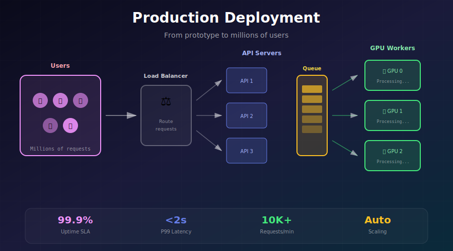
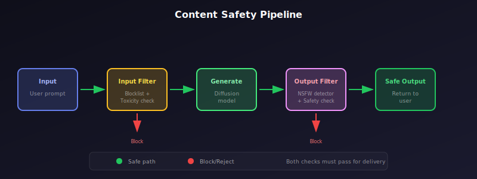

# 🚀 Deployment Considerations

<div align="center">



*From prototype to production — serving AI at scale*

[](#)
[](#)
[](#)

</div>

---

## 🎯 Where & Why: Real-World Applications

### Where is Production Deployment Used?

| Company | Application | Scale | Key Challenge |
|---------|-------------|-------|---------------|
| 🎨 **Midjourney** | Image generation | 15M+ users | Queue management |
| 💬 **OpenAI** | ChatGPT | 100M+ users | Low latency at scale |
| 🔍 **Google** | Search AI features | Billions queries | Cost efficiency |
| 🛒 **Amazon** | Product images | Millions SKUs | Throughput |
| 📸 **Adobe** | Firefly | Creative workflows | Integration |
| 🎮 **Game Studios** | AI NPCs, textures | Real-time | Edge deployment |

### Why Learn Production Deployment?

> 💡 **The Reality Gap**: A model that works in Jupyter doesn't automatically work in production. The gap between demo and deployment is where projects fail.

**Production Challenges:**

```
Research vs Production
━━━━━━━━━━━━━━━━━━━━━━━━━━━━━━━━━━━━━━━━━━━━━━━━━━━━━━━━━━━━━
Research               Production                Challenge
━━━━━━━━━━━━━━━━━━━━━━━━━━━━━━━━━━━━━━━━━━━━━━━━━━━━━━━━━━━━━
One user               Millions concurrent       Scaling
"Works on my machine"  Must work everywhere      Reproducibility
Occasional errors OK   99.9% uptime required     Reliability
Minutes latency OK     <1 second expected        Performance
Cost doesn't matter    ROI must be positive      Economics
━━━━━━━━━━━━━━━━━━━━━━━━━━━━━━━━━━━━━━━━━━━━━━━━━━━━━━━━━━━━━
```

### Cost Reality Check

| Deployment Type | Cost/1000 Images | When to Use |
|-----------------|------------------|-------------|
| **Cloud GPU (on-demand)** | $0.50-2.00 | Prototyping |
| **Reserved instances** | $0.20-0.80 | Steady load |
| **Spot/Preemptible** | $0.10-0.30 | Batch processing |
| **Serverless GPU** | $0.05-0.20 | Variable load |
| **On-premise** | $0.01-0.05 | High volume |

---

## 🏗️ Architecture Patterns

<div align="center">


</div>

### Pattern 1: Synchronous API

```python
from fastapi import FastAPI, HTTPException
from pydantic import BaseModel
import torch
from diffusers import StableDiffusionPipeline

app = FastAPI()

# Load model at startup
@app.on_event("startup")
async def load_model():
    global pipe
    pipe = StableDiffusionPipeline.from_pretrained(
        "stabilityai/stable-diffusion-2-1",
        torch_dtype=torch.float16
    ).to("cuda")
    pipe.enable_xformers_memory_efficient_attention()

class GenerateRequest(BaseModel):
    prompt: str
    negative_prompt: str = ""
    num_steps: int = 20
    guidance_scale: float = 7.5
    seed: int = None

@app.post("/generate")
async def generate(request: GenerateRequest):
    """Synchronous generation - blocks until complete."""
    generator = None
    if request.seed:
        generator = torch.Generator("cuda").manual_seed(request.seed)
    
    try:
        image = pipe(
            prompt=request.prompt,
            negative_prompt=request.negative_prompt,
            num_inference_steps=request.num_steps,
            guidance_scale=request.guidance_scale,
            generator=generator
        ).images[0]
        
        # Convert to base64
        buffered = io.BytesIO()
        image.save(buffered, format="PNG")
        return {"image": base64.b64encode(buffered.getvalue()).decode()}
    
    except Exception as e:
        raise HTTPException(status_code=500, detail=str(e))
```

**Use when:** Low latency (<5s), low volume (<100 req/min)

### Pattern 2: Async Queue-Based

```python
import asyncio
import redis.asyncio as redis
from uuid import uuid4
import json

class AsyncGenerationService:
    """
    Queue-based architecture for high-volume generation.
    
    Components:
    - API Server: Accepts requests, returns job IDs
    - Redis: Job queue and result storage
    - Workers: GPU processes that consume jobs
    """
    
    def __init__(self, redis_url="redis://localhost"):
        self.redis = redis.from_url(redis_url)
        self.job_queue = "generation_jobs"
        self.result_prefix = "result:"
    
    async def submit_job(self, prompt: str, **kwargs) -> str:
        """Submit job to queue, return job ID."""
        job_id = str(uuid4())
        job_data = {
            "id": job_id,
            "prompt": prompt,
            "status": "pending",
            **kwargs
        }
        
        # Add to queue
        await self.redis.rpush(self.job_queue, json.dumps(job_data))
        await self.redis.set(f"{self.result_prefix}{job_id}", json.dumps({
            "status": "pending"
        }))
        
        return job_id
    
    async def get_result(self, job_id: str) -> dict:
        """Check job status and get result if ready."""
        result = await self.redis.get(f"{self.result_prefix}{job_id}")
        if result:
            return json.loads(result)
        return {"status": "not_found"}
    
    async def worker_loop(self, pipe):
        """Worker process that consumes jobs."""
        while True:
            # Blocking pop from queue
            job_data = await self.redis.blpop(self.job_queue, timeout=30)
            if not job_data:
                continue
            
            job = json.loads(job_data[1])
            job_id = job["id"]
            
            try:
                # Update status
                await self.redis.set(
                    f"{self.result_prefix}{job_id}",
                    json.dumps({"status": "processing"})
                )
                
                # Generate image
                image = pipe(job["prompt"]).images[0]
                
                # Store result
                buffered = io.BytesIO()
                image.save(buffered, format="PNG")
                image_b64 = base64.b64encode(buffered.getvalue()).decode()
                
                await self.redis.set(
                    f"{self.result_prefix}{job_id}",
                    json.dumps({
                        "status": "completed",
                        "image": image_b64
                    }),
                    ex=3600  # Expire after 1 hour
                )
                
            except Exception as e:
                await self.redis.set(
                    f"{self.result_prefix}{job_id}",
                    json.dumps({
                        "status": "failed",
                        "error": str(e)
                    })
                )


# FastAPI endpoints
service = AsyncGenerationService()

@app.post("/generate")
async def submit_generation(request: GenerateRequest):
    job_id = await service.submit_job(request.prompt)
    return {"job_id": job_id, "status": "pending"}

@app.get("/result/{job_id}")
async def get_result(job_id: str):
    return await service.get_result(job_id)
```

**Use when:** High volume, variable latency acceptable, need scaling

### Pattern 3: Streaming/Real-time

```python
from fastapi import FastAPI, WebSocket
from fastapi.responses import StreamingResponse
import asyncio

@app.websocket("/ws/generate")
async def websocket_generate(websocket: WebSocket):
    """
    WebSocket endpoint for real-time generation updates.
    Streams intermediate results during diffusion.
    """
    await websocket.accept()
    
    try:
        data = await websocket.receive_json()
        prompt = data["prompt"]
        
        # Custom callback to stream intermediate images
        def progress_callback(step, timestep, latents):
            # Decode latents to image
            with torch.no_grad():
                image = pipe.vae.decode(latents / 0.18215).sample
                image = (image / 2 + 0.5).clamp(0, 1)
                image = image.cpu().permute(0, 2, 3, 1).numpy()[0]
                image = (image * 255).astype(np.uint8)
            
            # Send preview
            buffered = io.BytesIO()
            Image.fromarray(image).save(buffered, format="JPEG", quality=50)
            asyncio.create_task(websocket.send_json({
                "type": "progress",
                "step": step,
                "preview": base64.b64encode(buffered.getvalue()).decode()
            }))
        
        # Generate with callbacks
        image = pipe(
            prompt,
            callback=progress_callback,
            callback_steps=5
        ).images[0]
        
        # Send final result
        buffered = io.BytesIO()
        image.save(buffered, format="PNG")
        await websocket.send_json({
            "type": "complete",
            "image": base64.b64encode(buffered.getvalue()).decode()
        })
        
    except Exception as e:
        await websocket.send_json({"type": "error", "message": str(e)})
    finally:
        await websocket.close()
```

---

## 📊 Scaling Strategies

### Horizontal Scaling

```yaml
# docker-compose.yml for horizontal scaling
version: '3.8'

services:
  api:
    image: generation-api:latest
    ports:
      - "8000:8000"
    deploy:
      replicas: 3
    depends_on:
      - redis
  
  worker:
    image: generation-worker:latest
    deploy:
      replicas: 4
      resources:
        reservations:
          devices:
            - driver: nvidia
              count: 1
              capabilities: [gpu]
    depends_on:
      - redis
  
  redis:
    image: redis:7-alpine
    ports:
      - "6379:6379"
  
  nginx:
    image: nginx:alpine
    ports:
      - "80:80"
    volumes:
      - ./nginx.conf:/etc/nginx/nginx.conf
```

### Auto-scaling with Kubernetes

```yaml
# kubernetes deployment with GPU auto-scaling
apiVersion: apps/v1
kind: Deployment
metadata:
  name: diffusion-worker
spec:
  replicas: 2
  selector:
    matchLabels:
      app: diffusion-worker
  template:
    metadata:
      labels:
        app: diffusion-worker
    spec:
      containers:
      - name: worker
        image: diffusion-worker:latest
        resources:
          limits:
            nvidia.com/gpu: 1
          requests:
            nvidia.com/gpu: 1
            memory: "16Gi"
            cpu: "4"
---
apiVersion: autoscaling/v2
kind: HorizontalPodAutoscaler
metadata:
  name: diffusion-worker-hpa
spec:
  scaleTargetRef:
    apiVersion: apps/v1
    kind: Deployment
    name: diffusion-worker
  minReplicas: 2
  maxReplicas: 10
  metrics:
  - type: External
    external:
      metric:
        name: redis_queue_length
        selector:
          matchLabels:
            queue: generation_jobs
      target:
        type: AverageValue
        averageValue: 10  # Scale when >10 jobs per worker
```

---

## 🛡️ Reliability & Monitoring

### Health Checks

```python
from fastapi import FastAPI, Response
import torch
import psutil
import GPUtil

app = FastAPI()

@app.get("/health")
async def health_check():
    """Comprehensive health check endpoint."""
    checks = {
        "status": "healthy",
        "checks": {}
    }
    
    # GPU check
    try:
        if torch.cuda.is_available():
            gpu = GPUtil.getGPUs()[0]
            checks["checks"]["gpu"] = {
                "available": True,
                "memory_used_percent": gpu.memoryUtil * 100,
                "temperature": gpu.temperature
            }
            if gpu.temperature > 85:
                checks["status"] = "degraded"
                checks["checks"]["gpu"]["warning"] = "High temperature"
        else:
            checks["status"] = "unhealthy"
            checks["checks"]["gpu"] = {"available": False}
    except Exception as e:
        checks["checks"]["gpu"] = {"error": str(e)}
        checks["status"] = "unhealthy"
    
    # Model check
    try:
        checks["checks"]["model"] = {
            "loaded": pipe is not None,
            "device": str(pipe.device) if pipe else None
        }
    except:
        checks["checks"]["model"] = {"loaded": False}
        checks["status"] = "unhealthy"
    
    # Memory check
    memory = psutil.virtual_memory()
    checks["checks"]["memory"] = {
        "percent_used": memory.percent,
        "available_gb": memory.available / (1024**3)
    }
    if memory.percent > 90:
        checks["status"] = "degraded"
    
    status_code = 200 if checks["status"] == "healthy" else 503
    return Response(
        content=json.dumps(checks),
        status_code=status_code,
        media_type="application/json"
    )

@app.get("/ready")
async def readiness_check():
    """Check if service is ready to accept traffic."""
    if pipe is not None and torch.cuda.is_available():
        return {"ready": True}
    return Response(status_code=503, content='{"ready": false}')
```

### Metrics & Monitoring

```python
from prometheus_client import Counter, Histogram, Gauge, generate_latest
import time

# Define metrics
REQUESTS_TOTAL = Counter(
    'generation_requests_total',
    'Total generation requests',
    ['status']
)

GENERATION_TIME = Histogram(
    'generation_duration_seconds',
    'Time spent generating images',
    buckets=[0.5, 1, 2, 5, 10, 30, 60]
)

GPU_MEMORY_USED = Gauge(
    'gpu_memory_used_bytes',
    'GPU memory currently in use'
)

QUEUE_SIZE = Gauge(
    'generation_queue_size',
    'Number of pending generation jobs'
)

class MetricsMiddleware:
    """Middleware to collect request metrics."""
    
    async def __call__(self, request, call_next):
        start_time = time.time()
        
        try:
            response = await call_next(request)
            REQUESTS_TOTAL.labels(status="success").inc()
            return response
        except Exception as e:
            REQUESTS_TOTAL.labels(status="error").inc()
            raise
        finally:
            duration = time.time() - start_time
            if "/generate" in str(request.url):
                GENERATION_TIME.observe(duration)

@app.get("/metrics")
async def metrics():
    """Prometheus metrics endpoint."""
    # Update GPU metrics
    if torch.cuda.is_available():
        GPU_MEMORY_USED.set(torch.cuda.memory_allocated())
    
    return Response(
        content=generate_latest(),
        media_type="text/plain"
    )
```

---

## 🔒 Safety & Content Moderation

<div align="center">



</div>

### Input Filtering

```python
from transformers import pipeline

class ContentModerator:
    """
    Multi-layer content moderation system.
    """
    
    def __init__(self):
        # Text classifier for prompts
        self.text_classifier = pipeline(
            "text-classification",
            model="unitary/toxic-bert"
        )
        
        # Blocklist
        self.blocked_terms = self._load_blocklist()
    
    def check_prompt(self, prompt: str) -> tuple[bool, str]:
        """
        Check if prompt is safe.
        Returns (is_safe, reason).
        """
        prompt_lower = prompt.lower()
        
        # Check blocklist
        for term in self.blocked_terms:
            if term in prompt_lower:
                return False, f"Blocked term detected"
        
        # ML-based classification
        result = self.text_classifier(prompt)[0]
        if result["label"] == "TOXIC" and result["score"] > 0.8:
            return False, "Content classified as inappropriate"
        
        return True, "OK"
    
    def check_image(self, image) -> tuple[bool, str]:
        """Check generated image for NSFW content."""
        # Use safety checker
        safety_result = self.safety_checker(
            images=[image],
            clip_input=self.feature_extractor(
                images=[image],
                return_tensors="pt"
            ).pixel_values
        )
        
        if safety_result.has_nsfw:
            return False, "Generated content flagged as NSFW"
        
        return True, "OK"


# Integration in generation endpoint
moderator = ContentModerator()

@app.post("/generate")
async def safe_generate(request: GenerateRequest):
    # Check input
    is_safe, reason = moderator.check_prompt(request.prompt)
    if not is_safe:
        raise HTTPException(status_code=400, detail=reason)
    
    # Generate
    image = pipe(request.prompt).images[0]
    
    # Check output
    is_safe, reason = moderator.check_image(image)
    if not is_safe:
        raise HTTPException(status_code=400, detail=reason)
    
    return {"image": encode_image(image)}
```

---

## 💰 Cost Optimization

### Instance Selection

| Provider | Instance | GPU | Price/hr | Best For |
|----------|----------|-----|----------|----------|
| **AWS** | p3.2xlarge | V100 | $3.06 | General |
| **AWS** | g5.xlarge | A10G | $1.19 | Cost-effective |
| **GCP** | a2-highgpu-1g | A100 | $3.67 | Performance |
| **Azure** | NC6s_v3 | V100 | $3.06 | Enterprise |
| **Lambda** | 1x A100 | A100 | $1.29 | ML-focused |
| **RunPod** | A100 | A100 | $1.89 | Spot-like |

### Spot Instance Strategy

```python
import boto3
from botocore.exceptions import ClientError

class SpotInstanceManager:
    """
    Manage spot instances for cost-effective GPU compute.
    """
    
    def __init__(self):
        self.ec2 = boto3.client('ec2')
        self.instance_types = [
            'g5.xlarge',   # Preferred
            'g5.2xlarge',  # Fallback 1
            'p3.2xlarge',  # Fallback 2
        ]
    
    def request_spot_instance(self) -> str:
        """Try to get cheapest available spot instance."""
        for instance_type in self.instance_types:
            try:
                response = self.ec2.request_spot_instances(
                    InstanceCount=1,
                    Type='one-time',
                    LaunchSpecification={
                        'ImageId': 'ami-xxxxx',
                        'InstanceType': instance_type,
                        'SecurityGroupIds': ['sg-xxxxx'],
                        'IamInstanceProfile': {
                            'Arn': 'arn:aws:iam::xxx:instance-profile/xxx'
                        }
                    }
                )
                return response['SpotInstanceRequests'][0]['SpotInstanceRequestId']
            except ClientError as e:
                if 'InsufficientInstanceCapacity' in str(e):
                    continue
                raise
        
        # Fall back to on-demand
        return self.launch_on_demand()
    
    def handle_interruption(self, instance_id: str):
        """Handle spot instance interruption gracefully."""
        # Save current state
        self.save_checkpoint()
        
        # Request new instance
        new_instance = self.request_spot_instance()
        
        # Resume from checkpoint
        self.restore_checkpoint(new_instance)
```

---

## 📈 Performance Optimization Checklist

### Model Optimization
- [ ] Use FP16/BF16 precision
- [ ] Enable xFormers or SDPA attention
- [ ] Use optimized schedulers (DPM++, LCM)
- [ ] Consider model distillation (Turbo, LCM)
- [ ] Apply torch.compile for inference

### Infrastructure Optimization
- [ ] Use GPU-optimized container images
- [ ] Enable CUDA graphs where possible
- [ ] Configure proper CUDA memory allocation
- [ ] Use NVLink for multi-GPU setups
- [ ] Optimize batch sizes for throughput

### Serving Optimization
- [ ] Implement request batching
- [ ] Use async I/O throughout
- [ ] Cache frequently used models
- [ ] Pre-warm model on startup
- [ ] Configure proper connection pooling

---

## 📚 References

1. **NVIDIA** (2023). "Triton Inference Server." [Documentation](https://developer.nvidia.com/nvidia-triton-inference-server)

2. **Hugging Face** (2023). "Inference Endpoints." [Documentation](https://huggingface.co/docs/inference-endpoints)

3. **BentoML** (2023). "Serving ML Models in Production." [Documentation](https://docs.bentoml.com/)

4. **Ray Serve** (2023). "Scalable Model Serving." [Documentation](https://docs.ray.io/en/latest/serve/)

---

## ✏️ Exercises

<details>
<summary><b>Exercise 1:</b> Build a Production API</summary>

**Task:** Create a FastAPI service with:
- Health check endpoint
- Async generation endpoint
- Prometheus metrics
- Error handling

**Requirements:**
- Handle 10 concurrent requests
- Return results in <10 seconds
- 99% success rate
</details>

<details>
<summary><b>Exercise 2:</b> Implement Auto-scaling</summary>

**Task:** Set up Kubernetes HPA based on queue length.

**Metrics:**
- Scale up when queue > 20 jobs
- Scale down when queue < 5 jobs
- Min: 2 replicas, Max: 8 replicas
</details>

<details>
<summary><b>Exercise 3:</b> Cost Analysis</summary>

**Task:** Calculate the cost per image for different deployment scenarios:
- On-demand A100 vs spot G5
- Single GPU vs batched multi-GPU
- Different model sizes (SD 1.5 vs SDXL)
</details>

---

<div align="center">

**[← Inference Optimization](../06_inference_optimization/)** | **[Back to Module Overview →](../)**

*Ship your AI models with confidence*

</div>
