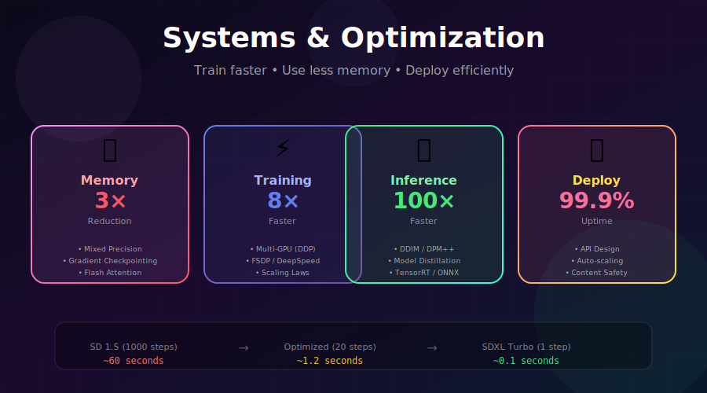

# ⚡ Systems & Optimization

<div align="center">



*Master the art of training faster, using less memory, and deploying efficiently*

[](#memory-optimization)
[](#distributed-training)
[](#inference-optimization)

</div>

---

## 🎯 Where & Why Use These Optimizations?

> 💡 **The Reality**: Without optimization, training a single image takes 60 seconds and requires 24GB GPU memory. With the techniques in this module, you can achieve **0.1 second generation** on **8GB GPUs**.

<table>
<tr>
<th width="20%">Challenge</th>
<th width="30%">Solution</th>
<th width="25%">Impact</th>
<th width="25%">Who Uses It</th>
</tr>
<tr>
<td><b>💾 GPU Memory</b><br><small>Can't fit model + data</small></td>
<td>Mixed precision, gradient checkpointing, Flash Attention</td>
<td>Train on <b>consumer GPUs</b> (8-16GB)</td>
<td>Every ML practitioner</td>
</tr>
<tr>
<td><b>⏱️ Training Time</b><br><small>Takes weeks/months</small></td>
<td>Multi-GPU parallelism, FSDP, DeepSpeed</td>
<td><b>Days → Hours</b></td>
<td>OpenAI, Meta, Stability AI</td>
</tr>
<tr>
<td><b>🚀 Inference Speed</b><br><small>Too slow for production</small></td>
<td>Fewer steps, distillation, TensorRT</td>
<td><b>60s → 0.1s</b> per image</td>
<td>Midjourney, Adobe, Google</td>
</tr>
<tr>
<td><b>💰 Cost</b><br><small>Cloud bills exploding</small></td>
<td>Efficient architectures, quantization, batching</td>
<td><b>10× cheaper</b> deployment</td>
<td>Every production system</td>
</tr>
</table>

---

## 📚 Module Contents

<div align="center">

| # | Topic | What You'll Learn | Difficulty |
|:-:|-------|-------------------|:----------:|
| 🔢 | **[Mixed Precision Training](./01_mixed_precision_training/)** | FP16/BF16 training for 2× speed, 50% memory | ⭐⭐ |
| 💾 | **[Gradient Checkpointing](./02_gradient_checkpointing/)** | Trade compute for memory, train 3× larger models | ⭐⭐ |
| 🧠 | **[Memory Efficient Attention](./03_memory_efficient_attention/)** | Flash Attention, O(N²) → O(N) memory | ⭐⭐⭐ |
| 🖥️ | **[Distributed Training](./04_distributed_training/)** | Multi-GPU strategies: DDP, FSDP, DeepSpeed | ⭐⭐⭐ |
| 📈 | **[Training at Scale](./05_training_at_scale/)** | Chinchilla scaling, data pipelines, stability | ⭐⭐⭐⭐ |
| ⚡ | **[Inference Optimization](./06_inference_optimization/)** | DDIM, DPM++, distillation, TensorRT | ⭐⭐⭐ |
| 🚀 | **[Deployment Considerations](./07_deployment_considerations/)** | Production APIs, scaling, safety | ⭐⭐⭐⭐ |

</div>

---

## 🧮 Memory Optimization

### The Memory Challenge

Training a 1B parameter model in FP32 requires:

$$\text{Memory}_{total} = \underbrace{4N}_{\text{weights}} + \underbrace{4N}_{\text{gradients}} + \underbrace{8N}_{\text{Adam states}} + \underbrace{\text{activations}}_{\propto \text{batch size}}$$

For 1B parameters: **~16 GB just for weights and optimizer**, plus activations!

### Mixed Precision Training

Use 16-bit floats for most operations:

```python
from torch.cuda.amp import autocast, GradScaler

scaler = GradScaler()

for batch in dataloader:
    optimizer.zero_grad()
    
    with autocast(dtype=torch.bfloat16):  # 2× faster, 50% memory
        output = model(batch)
        loss = criterion(output)
    
    scaler.scale(loss).backward()
    scaler.step(optimizer)
    scaler.update()
```

| Precision | Memory | Speed | Notes |
|-----------|--------|-------|-------|
| **FP32** | 100% | 1.0× | Baseline |
| **FP16** | 50% | 1.5-2× | Needs loss scaling |
| **BF16** | 50% | 1.5-2× | No loss scaling (Ampere+) |

### Gradient Checkpointing

Trade compute for memory by recomputing activations:

```python
from torch.utils.checkpoint import checkpoint

class CheckpointedBlock(nn.Module):
    def forward(self, x):
        # Recompute activations during backward pass
        return checkpoint(self.block, x, use_reentrant=False)
```

**Memory savings:** Up to **60% reduction**  
**Speed cost:** ~30% slower training, but enables **3× larger batch sizes**

### Flash Attention

Transform \( O(N^2) \) memory to \( O(N) \):

```python
# Standard attention: O(N²) memory
attn = softmax(Q @ K.T / sqrt(d)) @ V  # Stores N×N matrix!

# Flash Attention: O(N) memory
from flash_attn import flash_attn_func
out = flash_attn_func(q, k, v)  # Fused, memory-efficient
```

| Sequence Length | Standard Attention | Flash Attention | Savings |
|-----------------|-------------------|-----------------|---------|
| 2,048 | 16 MB | 0.1 MB | **99%** |
| 8,192 | 256 MB | 0.5 MB | **99.8%** |
| 32,768 | 4 GB | 2 MB | **99.95%** |

---

## 🖥️ Distributed Training

### Parallelism Strategies

<table>
<tr>
<th>Strategy</th>
<th>What's Split</th>
<th>Memory/GPU</th>
<th>When to Use</th>
</tr>
<tr>
<td><b>Data Parallel (DDP)</b></td>
<td>Batch</td>
<td>Full model</td>
<td>Model fits in 1 GPU</td>
</tr>
<tr>
<td><b>FSDP / ZeRO</b></td>
<td>Model + Optimizer</td>
<td>Model/N</td>
<td>Large models (1B+)</td>
</tr>
<tr>
<td><b>Tensor Parallel</b></td>
<td>Weight matrices</td>
<td>Partial model</td>
<td>Very wide layers</td>
</tr>
<tr>
<td><b>Pipeline Parallel</b></td>
<td>Sequential layers</td>
<td>Subset of layers</td>
<td>Very deep models</td>
</tr>
</table>

### Data Parallelism (DDP)

```python
import torch.distributed as dist
from torch.nn.parallel import DistributedDataParallel as DDP

dist.init_process_group("nccl")
model = DDP(model.cuda(), device_ids=[local_rank])

# Training loop unchanged - gradients auto-synchronized!
```

### FSDP for Large Models

```python
from torch.distributed.fsdp import FullyShardedDataParallel as FSDP

model = FSDP(
    model,
    sharding_strategy=ShardingStrategy.FULL_SHARD,
    mixed_precision=MixedPrecision(
        param_dtype=torch.bfloat16,
        reduce_dtype=torch.bfloat16,
    ),
)
```

---

## ⚡ Inference Optimization

### The Speed Journey

| Sampler | Steps | Time | Speedup |
|---------|-------|------|---------|
| **DDPM** | 1000 | ~60s | 1× |
| **DDIM** | 50 | ~3s | 20× |
| **DPM++ 2M** | 20 | ~1.2s | 50× |
| **LCM** | 4 | ~0.3s | 200× |
| **SDXL Turbo** | 1 | ~0.1s | **600×** |

### Fast Sampling Code

```python
from diffusers import DPMSolverMultistepScheduler

# Switch to fast sampler
pipe.scheduler = DPMSolverMultistepScheduler.from_config(
    pipe.scheduler.config,
    algorithm_type="dpmsolver++",
    use_karras_sigmas=True
)

# 20 steps instead of 50
image = pipe(prompt, num_inference_steps=20).images[0]
```

### Compilation & Optimization

```python
# PyTorch 2.0+ compilation
model = torch.compile(model, mode="max-autotune")

# TensorRT for production
import torch_tensorrt
optimized = torch_tensorrt.compile(model, inputs=[example_input])
```

---

## 📊 Real-World Benchmarks

### Stable Diffusion Inference (512×512)

| Setup | Time/Image | GPU Memory |
|-------|------------|------------|
| SD 1.5, 50 steps, FP32 | ~15s | 8 GB |
| SD 1.5, 50 steps, FP16 | ~6s | 4 GB |
| SD 1.5, 25 steps, FP16 + xFormers | ~3s | 3.5 GB |
| SDXL Turbo, 4 steps, FP16 | ~0.8s | 6 GB |
| SD 1.5 + TensorRT, 20 steps | ~1.5s | 3 GB |

### Training Cost Comparison

| Setup | Time (100K steps) | Estimated Cost |
|-------|-------------------|----------------|
| 1× A100 (80GB) | ~10 days | $3,000 |
| 8× A100 (DDP) | ~1.5 days | $3,600 |
| 8× A100 (FSDP) | ~1.2 days | $2,900 |

---

## 🔧 Complete Optimization Stack

```python
import torch
from torch.cuda.amp import autocast, GradScaler
from torch.distributed.fsdp import FullyShardedDataParallel as FSDP

def setup_optimized_training(model, args):
    """Production-ready training setup."""
    
    # 1. Mixed precision
    scaler = GradScaler() if args.fp16 else None
    
    # 2. Gradient checkpointing
    if args.gradient_checkpointing:
        model.enable_gradient_checkpointing()
    
    # 3. Memory-efficient attention
    if args.use_flash_attn:
        model = enable_flash_attention(model)
    
    # 4. Distributed training
    if args.distributed:
        model = FSDP(model, mixed_precision=...)
    
    # 5. Compilation (PyTorch 2.0+)
    if args.compile:
        model = torch.compile(model, mode="reduce-overhead")
    
    return model, scaler
```

---

## 📈 Scaling Laws

### Batch Size & Learning Rate

The **linear scaling rule** (Goyal et al., 2017):

$$\eta_{new} = \eta_{base} \times \frac{B_{new}}{B_{base}}$$

```python
# Example
base_lr = 1e-4
base_batch_size = 256
actual_batch_size = 2048

lr = base_lr * (actual_batch_size / base_batch_size)  # lr = 8e-4
```

### Compute-Optimal Training (Chinchilla)

For optimal training efficiency:

$$\text{Tokens} \approx 20 \times \text{Parameters}$$

A 7B model should see ~140B tokens for compute-optimal training.

---

## 📚 References

1. **Micikevicius, P., et al.** (2018). "Mixed Precision Training." [arXiv:1710.03740](https://arxiv.org/abs/1710.03740)

2. **Dao, T., et al.** (2022). "FlashAttention: Fast and Memory-Efficient Exact Attention." [arXiv:2205.14135](https://arxiv.org/abs/2205.14135)

3. **Rajbhandari, S., et al.** (2020). "ZeRO: Memory Optimizations Toward Training Trillion Parameter Models." [arXiv:1910.02054](https://arxiv.org/abs/1910.02054)

4. **Hoffmann, J., et al.** (2022). "Training Compute-Optimal Large Language Models." [arXiv:2203.15556](https://arxiv.org/abs/2203.15556)

5. **Luo, S., et al.** (2023). "Latent Consistency Models." [arXiv:2310.04378](https://arxiv.org/abs/2310.04378)

---

## ✏️ Exercises

1. **Measure Memory**: Profile memory usage with/without gradient checkpointing on a transformer.

2. **Benchmark Samplers**: Compare DDIM vs DPM++ vs Euler at different step counts.

3. **Scale Training**: Convert a single-GPU script to multi-GPU using DDP.

4. **Optimize Inference**: Apply torch.compile and measure the speedup.

5. **Deploy an API**: Build a FastAPI service with batching and health checks.

---

<div align="center">

## 🚀 Start Your Optimization Journey

**[Begin with Mixed Precision Training →](./01_mixed_precision_training/)**

*The easiest optimization with immediate 2× speed improvement*

---

<sub>Built with 💜 for the ML community</sub>

</div>
