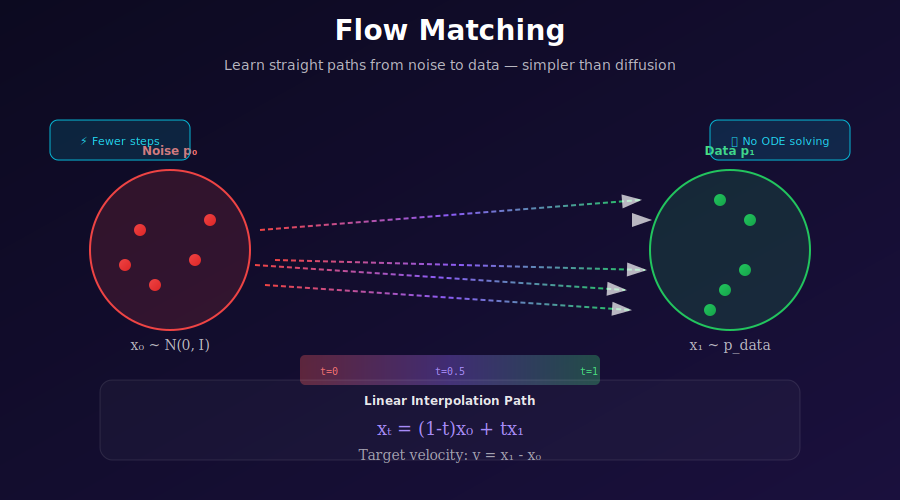
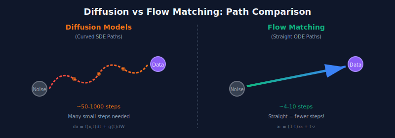

# ✨ Flow Matching

<div align="center">



<br/>

### 🛤️ *The Shortest Path from Noise to Art* 🛤️

<br/>

[](#)
[](#)
[](#)

---

*"Why take a winding road when you can walk a straight line?"*

</div>

---

## 🎬 The Plot Twist

> **2020:** Diffusion models take over generative AI. They're amazing, but slow. 1000 steps to generate an image? Really?
>
> **2022:** Researchers ask a simple question: *"What if the path from noise to data was... straight?"*
>
> **The answer changed everything.**

<div align="center">



</div>

---

## 💡 The Core Insight

<table>
<tr>
<td width="50%" style="vertical-align: top">

### 🌀 Diffusion's Approach
*"Gradually add noise, then learn to reverse it step by step."*

```
Forward: Stochastic (random) corruption
Reverse: Also stochastic
Path: Curved and noisy
Math: SDEs (scary)
```

**Problem:** Many small steps needed to follow the curves.

</td>
<td width="50%" style="vertical-align: top">

### 🎯 Flow Matching's Approach
*"Just learn to walk in a straight line from noise to data."*

```
Forward: Deterministic interpolation
Reverse: Also deterministic
Path: Straight lines
Math: ODEs (simpler)
```

**Advantage:** Euler method is exact for straight lines!

</td>
</tr>
</table>

<div align="center">

### 🔑 The Key Equation

$$\boxed{x_t = (1-t) \cdot x_0 + t \cdot z}$$

Where $x_0 \sim \mathcal{N}(0,I)$ is noise and $z$ is your data point.

**That's it.** Linear interpolation. No fancy noise schedules. No variance explosion.

</div>

---

## 🌍 Where Flow Matching Is Taking Over

> *The next generation of generative AI runs on flow matching.*

<table>
<tr>
<th width="20%">Application</th>
<th width="35%">Why Flow Matching?</th>
<th width="45%">Who's Using It</th>
</tr>
<tr>
<td>

### 🖼️ 
**Images**

</td>
<td>

4-10 steps instead of 50
Better FID scores
Cleaner training

</td>
<td>

**Stable Diffusion 3** • **FLUX**

*The new standard for text-to-image*

</td>
</tr>
<tr>
<td>

### 🎬 
**Video**

</td>
<td>

Temporal consistency
Efficient sampling
Scalable training

</td>
<td>

**Sora-style architectures**

*Next-gen video synthesis*

</td>
</tr>
<tr>
<td>

### 🔊 
**Audio**

</td>
<td>

Fast waveform generation
Real-time synthesis
Better prosody

</td>
<td>

**VoiceFlow** • **Matcha-TTS**

*Real-time voice synthesis*

</td>
</tr>
<tr>
<td>

### 🧬 
**Molecules**

</td>
<td>

SE(3)-equivariant flows
Physical constraints
Faster drug design

</td>
<td>

**EquiFlow** • **FlowSite**

*Protein and molecule design*

</td>
</tr>
</table>

---

## 🧮 The Mathematics (Surprisingly Simple)

### Act I: The Setup

**Goal:** Transform noise $p_0 = \mathcal{N}(0, I)$ into data $p_1 = p_{data}$.

**Tool:** A time-dependent velocity field $v_t: \mathbb{R}^d \to \mathbb{R}^d$.

**Dynamics:** Samples follow the ODE:

$$\frac{dx_t}{dt} = v_t(x_t)$$

<div align="center">

> 🎭 **Interpretation:** At each point in space-time, the velocity tells you which way to go.

</div>

---

### Act II: The Problem

**What we want:** A velocity field $v_t$ such that if $x_0 \sim p_0$, then $x_1 \sim p_1$.

**The traditional approach (Neural ODEs):**
1. Parameterize $v_\theta$
2. Solve ODE from $t=0$ to $t=1$
3. Compute likelihood, backprop through solver
4. Update $\theta$

**Why it's painful:**
- ❌ Solving ODE = many function evaluations
- ❌ Backprop through solver = memory explosion
- ❌ Numerical errors accumulate

---

### Act III: The Magic Trick

<div align="center">

### 💫 *Conditional Flow Matching: Train without solving ODEs!* 💫

</div>

**The insight:** Instead of learning the marginal velocity, learn the conditional velocity.

For each data point $z$, define:
- **Conditional path:** $x_t = (1-t)x_0 + tz$ where $x_0 \sim \mathcal{N}(0,I)$
- **Conditional velocity:** $u_t = \frac{dx_t}{dt} = z - x_0$

**The loss:**

$$\boxed{\mathcal{L}_{CFM} = \mathbb{E}_{t, z, x_0}\left[\|v_\theta(x_t, t) - (z - x_0)\|^2\right]}$$

<div align="center">

**This is just MSE regression!**

Sample $(t, z, x_0)$, compute $x_t$, predict $z - x_0$. Done.

</div>

---

### The Proof: Why CFM Works

<details>
<summary><b>📐 Click to expand: Complete Proof of CFM Equivalence</b></summary>

**Theorem (Lipman et al., 2023):** The Conditional Flow Matching gradient equals the Marginal Flow Matching gradient.

$$\nabla_\theta \mathcal{L}_{CFM} = \nabla_\theta \mathcal{L}_{MFM}$$

---

**Step 1: Define the marginal velocity**

The true marginal velocity $v_t(x)$ satisfies:

$$v_t(x) = \mathbb{E}[u_t(x|z) \mid x_t = x] = \frac{\int u_t(x|z) p_t(x|z) p_{data}(z) dz}{\int p_t(x|z) p_{data}(z) dz}$$

---

**Step 2: Expand CFM loss**

$$\mathcal{L}_{CFM} = \mathbb{E}_{t,z,x_0}\left[\|v_\theta(x_t,t)\|^2 - 2v_\theta(x_t,t) \cdot u_t(x_t|z) + \|u_t(x_t|z)\|^2\right]$$

---

**Step 3: Take gradient**

$$\nabla_\theta \mathcal{L}_{CFM} = 2\mathbb{E}_{t,z,x_0}\left[\nabla_\theta v_\theta(x_t,t) \cdot (v_\theta(x_t,t) - u_t(x_t|z))\right]$$

---

**Step 4: Marginalize over $z$**

$$= 2\mathbb{E}_{t,x}\left[\nabla_\theta v_\theta(x,t) \cdot \left(v_\theta(x,t) - \underbrace{\mathbb{E}[u_t(x|z)|x_t=x]}_{= v_t(x)}\right)\right]$$

---

**Step 5: Recognize MFM gradient**

$$= \nabla_\theta \mathbb{E}_{t,x}\left[\|v_\theta(x,t) - v_t(x)\|^2\right] = \nabla_\theta \mathcal{L}_{MFM}$$

$\blacksquare$

</details>

---

### The Optimal Transport Connection

<div align="center">

> 🚚 *"The linear path isn't just simple — it's optimal."*

</div>

**Theorem:** The linear interpolation $x_t = (1-t)x_0 + tz$ corresponds to the **optimal transport** displacement interpolant.

<details>
<summary><b>📐 Click to expand: Why Straight Lines Are Optimal</b></summary>

**The Optimal Transport Problem:**

Given distributions $p_0$ and $p_1$, find the coupling $\pi$ that minimizes:

$$\min_{\pi \in \Pi(p_0, p_1)} \int \|x - z\|^2 d\pi(x, z)$$

**The Solution (for Gaussian source):**

For $p_0 = \mathcal{N}(0,I)$, the OT map is (approximately) the identity-plus-translation.

**Displacement Interpolation:**

The OT geodesic at time $t$ is:

$$x_t = (1-t)x_0 + t \cdot T(x_0)$$

For empirical $p_1$, this becomes $x_t = (1-t)x_0 + tz$.

**Why It's Optimal:**

The kinetic energy along this path:

$$KE = \int_0^1 \|u_t\|^2 dt = \|z - x_0\|^2$$

**No other path with the same endpoints has lower energy!** $\blacksquare$

</details>

---

## 🔧 Implementation: Clean & Simple

### Training

```python
def flow_matching_loss(model, data_batch):
    """
    The entire flow matching training step.
    Beautifully simple.
    """
    batch_size = data_batch.shape[0]
    device = data_batch.device
    
    # 1. Sample time uniformly in [0, 1]
    t = torch.rand(batch_size, 1, 1, 1, device=device)
    
    # 2. Sample noise
    x0 = torch.randn_like(data_batch)
    
    # 3. Linear interpolation: x_t = (1-t)*noise + t*data
    xt = (1 - t) * x0 + t * data_batch
    
    # 4. Target velocity: just the direction from noise to data!
    target = data_batch - x0
    
    # 5. Predict and compare
    pred = model(xt, t.squeeze())
    
    # 6. MSE loss. That's it.
    loss = F.mse_loss(pred, target)
    
    return loss
```

### Sampling (Euler Method)

```python
@torch.no_grad()
def sample_flow(model, shape, num_steps=10):
    """
    Generate samples by following the learned velocity field.
    """
    device = next(model.parameters()).device
    
    # Start from pure noise
    x = torch.randn(shape, device=device)
    
    # Time step size
    dt = 1.0 / num_steps
    
    # Euler integration from t=0 to t=1
    for i in range(num_steps):
        t = torch.full((shape[0],), i * dt, device=device)
        
        # Get velocity at current point
        v = model(x, t)
        
        # Take a step in that direction
        x = x + v * dt
    
    return x
```

### Better Sampling (Heun's Method)

```python
@torch.no_grad()
def sample_flow_heun(model, shape, num_steps=10):
    """
    2nd order Runge-Kutta for better quality.
    Almost free: just 2× the evaluations.
    """
    x = torch.randn(shape)
    dt = 1.0 / num_steps
    
    for i in range(num_steps):
        t = i * dt
        
        # Velocity at current point
        v1 = model(x, torch.full((shape[0],), t))
        
        # Euler prediction
        x_euler = x + v1 * dt
        
        # Velocity at predicted point
        v2 = model(x_euler, torch.full((shape[0],), t + dt))
        
        # Average (Heun's correction)
        x = x + (v1 + v2) * dt / 2
    
    return x
```

---

## 📊 The Speed Comparison

<table>
<tr>
<th>Method</th>
<th>Steps Needed</th>
<th>Quality</th>
<th>Training Complexity</th>
</tr>
<tr>
<td><b>DDPM</b></td>
<td>1000</td>
<td>⭐⭐⭐⭐⭐</td>
<td>Score matching</td>
</tr>
<tr>
<td><b>DDIM</b></td>
<td>50-100</td>
<td>⭐⭐⭐⭐</td>
<td>Score matching</td>
</tr>
<tr>
<td><b>Flow Matching</b></td>
<td><b>4-10</b></td>
<td>⭐⭐⭐⭐⭐</td>
<td><b>Simple MSE</b></td>
</tr>
</table>

<div align="center">

> 💡 **The punchline:** Same quality (or better), 10-100× fewer steps, simpler training.

</div>

---

## 🔄 Connection to Diffusion

<div align="center">

### Flow Matching and Diffusion Are Cousins

</div>

<table>
<tr>
<th>Aspect</th>
<th>Diffusion</th>
<th>Flow Matching</th>
</tr>
<tr>
<td><b>Forward Process</b></td>
<td>$dx = f(x,t)dt + g(t)dW$ (SDE)</td>
<td>$dx = v(x,t)dt$ (ODE)</td>
</tr>
<tr>
<td><b>What We Learn</b></td>
<td>Noise $\epsilon$ or score $\nabla \log p$</td>
<td>Velocity $v = z - x_0$</td>
</tr>
<tr>
<td><b>Path Shape</b></td>
<td>Curved (stochastic)</td>
<td>Straight (deterministic)</td>
</tr>
<tr>
<td><b>Discretization Error</b></td>
<td>Accumulates over steps</td>
<td>Minimal for straight paths</td>
</tr>
</table>

**The Mathematical Bridge:**

Score and velocity are related by:

$$v_t(x) = \frac{\partial \mu_t}{\partial t} + \frac{\partial \sigma_t^2}{\partial t} \nabla_x \log p_t(x)$$

You can convert between them!

---

## 📝 Key Equations Summary

| Concept | Formula | Intuition |
|---------|---------|-----------|
| **Linear interpolation** | $x_t = (1-t)x_0 + tz$ | Walk from noise to data |
| **Velocity target** | $v = z - x_0$ | Direction of the walk |
| **Training loss** | $\mathcal{L} = \mathbb{E}[\|v_\theta(x_t, t) - (z-x_0)\|^2]$ | Predict the direction |
| **Euler sampling** | $x_{t+\Delta t} = x_t + v_\theta(x_t, t)\Delta t$ | Take a step |
| **Continuity equation** | $\partial_t p_t = -\nabla \cdot (p_t v_t)$ | How density evolves |

---

## 📚 The Essential Papers

<table>
<tr>
<th width="55%">Paper</th>
<th width="45%">Contribution</th>
</tr>
<tr>
<td>

**Lipman et al.** (2023)
*"Flow Matching for Generative Modeling"*
[ICLR](https://arxiv.org/abs/2210.02747)

</td>
<td>

🏆 **The Foundation**
Introduced conditional flow matching.

</td>
</tr>
<tr>
<td>

**Liu et al.** (2023)
*"Flow Straight and Fast: Rectified Flow"*
[ICLR](https://arxiv.org/abs/2209.03003)

</td>
<td>

🎯 **Straightening Flows**
Iterative refinement for straighter paths.

</td>
</tr>
<tr>
<td>

**Albergo & Vanden-Eijnden** (2023)
*"Stochastic Interpolants"*
[ICLR](https://arxiv.org/abs/2209.15571)

</td>
<td>

🔬 **Theoretical Framework**
Unified view of interpolation.

</td>
</tr>
<tr>
<td>

**Esser et al.** (2024)
*"Scaling Rectified Flow Transformers"*
[ICML](https://arxiv.org/abs/2403.03206)

</td>
<td>

🖼️ **Stable Diffusion 3**
Flow matching at scale.

</td>
</tr>
</table>

---

## ✏️ Exercises

<details>
<summary><b>🟢 Exercise 1:</b> 2D Toy Data</summary>

**Task:** Implement flow matching on Swiss Roll or Two Moons.

**Visualize:**
1. The learned vector field at $t = 0, 0.25, 0.5, 0.75, 1$
2. Sample trajectories from noise to data
3. Compare Euler (10 steps) vs Heun (10 steps)

</details>

<details>
<summary><b>🟡 Exercise 2:</b> MNIST Flow Matching</summary>

**Task:** Train flow matching on MNIST with a simple U-Net.

**Compare to DDPM:**
1. Training iterations to similar FID
2. Sample quality at 5, 10, 25, 50 steps
3. Training loss curves

</details>

<details>
<summary><b>🟡 Exercise 3:</b> Alternative Interpolations</summary>

**Task:** Implement and compare:
- Linear: $x_t = (1-t)x_0 + tz$
- Cosine: $x_t = \cos(\frac{\pi t}{2})x_0 + \sin(\frac{\pi t}{2})z$

**Question:** How does curvature affect sample quality and number of steps needed?

</details>

<details>
<summary><b>🔴 Exercise 4:</b> Prove CFM Equivalence</summary>

**Task:** Work through the full proof that:

$$\nabla_\theta \mathcal{L}_{CFM} = \nabla_\theta \mathcal{L}_{MFM}$$

**Key Steps:**
1. Define marginal velocity via conditional expectation
2. Expand the squared loss
3. Show that cross-terms match

</details>

---

<div align="center">

## 🚀 The Future Is Straight

<br/>

Flow matching is the foundation of **Stable Diffusion 3**, **FLUX**, and the next generation of generative models.

<br/>

**Next →** [Rectified Flow](../02_rectified_flow/)

---

<div align="center">

**[← Back to Advanced Research](../)** | **[Next: Rectified Flow →](../02_rectified_flow/)**

</div>
