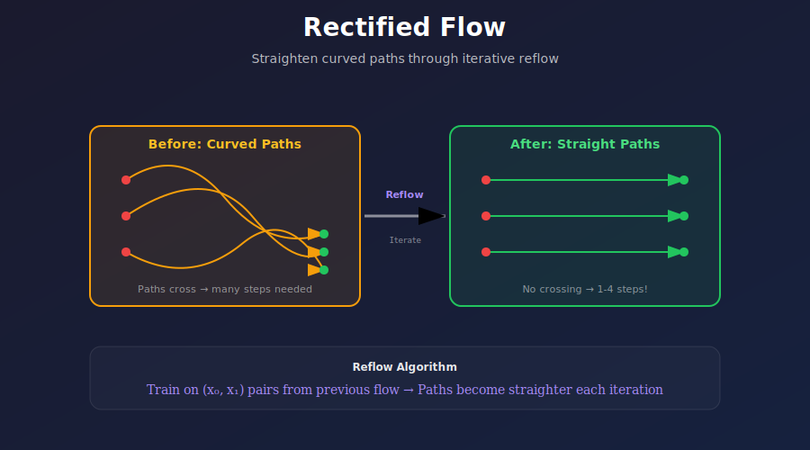
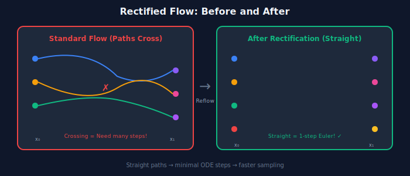

# ➡️ Rectified Flow

<div align="center">



*Straighten curved paths through iterative refinement — the secret behind SD3 and Flux*

[](#)
[](#)
[](#)

</div>

---

## 🎯 Where & Why: Real-World Applications

### Where is Rectified Flow Used?

| Application | Model | Why Rectified Flow? |
|-------------|-------|-------------------|
| 🖼️ **Stable Diffusion 3** | SD3, SD3.5 | State-of-the-art image quality |
| 🎨 **Flux** | Flux.1 Pro/Dev/Schnell | Superior text rendering |
| 🚀 **InstaFlow** | Fast SD | Single-step generation |
| 🎬 **Video Models** | Research | Efficient temporal modeling |
| 🔊 **Audio Generation** | VoiceFlow | Faster speech synthesis |
| 🧬 **Scientific** | Protein/molecule | SE(3)-equivariant flows |

### Why Rectified Flow Over Standard Flow Matching?

| Aspect | Standard Flow | Rectified Flow |
|--------|--------------|----------------|
| **Initial paths** | Can cross/curve | Same |
| **After reflow** | — | Straight, non-crossing |
| **Steps needed** | 10-30 | 5-10 (or even 1!) |
| **Euler accuracy** | Good | Near-perfect |
| **Distillation** | Possible | Much easier |

> 💡 **The Insight:** Even if you train flow matching well, paths might still cross. Reflow iteratively straightens them for maximum efficiency!

---

## 📖 Core Concept

### The Problem: Crossing Paths

Even with optimal transport interpolation, learned flows can have **crossing trajectories**:



### The Solution: Reflow

**Reflow** iteratively creates new training pairs from the current flow to straighten the trajectories.

---

## 🧮 Mathematical Framework

### Standard Flow Matching Loss

Given data pairs \((x_0, x_1)\) where \(x_0 \sim \pi_0\) (noise) and \(x_1 \sim \pi_1\) (data):

$$\mathcal{L}_{\text{FM}} = \mathbb{E}_{t, x_0, x_1}\left[\|v_\theta(x_t, t) - (x_1 - x_0)\|^2\right]$$

where \(x_t = (1-t)x_0 + tx_1\).

### The Reflow Procedure

**Step 1:** Train initial flow \(v_\theta\) with standard FM loss

**Step 2:** Generate new pairs using the learned flow:
- Sample \(x_0 \sim \pi_0\) (noise)
- Simulate ODE: \(x_1 = x_0 + \int_0^1 v_\theta(x_t, t)\,dt\)
- Now \((x_0, x_1)\) is a **coupled** pair from the learned transport

**Step 3:** Retrain on new pairs:
$$\mathcal{L}_{\text{reflow}} = \mathbb{E}_{t, (x_0, x_1) \sim \text{coupled}}\left[\|v_\theta(x_t, t) - (x_1 - x_0)\|^2\right]$$

**Step 4:** Repeat steps 2-3 for further straightening

### Why Reflow Works

After reflow, the marginal coupling between \(x_0\) and \(x_1\) better approximates the **optimal transport coupling**. For OT coupling:
- Paths don't cross
- Paths are geodesics (straight lines in Euclidean space)

### Theoretical Guarantee

**Theorem (Liu et al.):** Reflow monotonically reduces the transport cost:
$$\mathbb{E}[\|v_{\theta^{(k+1)}}(x_t, t)\|^2] \leq \mathbb{E}[\|v_{\theta^{(k)}}(x_t, t)\|^2]$$

The kinetic energy decreases with each iteration!

---

## 🔧 Implementation

### Training Algorithm

```python
class RectifiedFlow:
    """
    Rectified Flow with iterative reflow for path straightening.
    """
    
    def __init__(self, model_factory, num_reflows=2):
        self.num_reflows = num_reflows
        self.model = model_factory()
    
    def train(self, data_loader, num_epochs_per_reflow=100):
        """
        Full training pipeline with reflow iterations.
        """
        for reflow_iter in range(self.num_reflows + 1):
            print(f"Reflow iteration {reflow_iter}")
            
            if reflow_iter == 0:
                # Initial training: independent pairs
                train_loader = self.create_independent_pairs(data_loader)
            else:
                # Reflow: coupled pairs from previous model
                train_loader = self.create_coupled_pairs(data_loader)
            
            # Train on current pairs
            self.train_one_iteration(train_loader, num_epochs_per_reflow)
        
        return self.model
    
    def create_independent_pairs(self, data_loader):
        """Create (noise, data) pairs with independent sampling."""
        pairs = []
        for x_1 in data_loader:
            x_0 = torch.randn_like(x_1)
            pairs.append((x_0, x_1))
        return pairs
    
    def create_coupled_pairs(self, data_loader):
        """
        Create coupled pairs by simulating the current flow.
        This is the key reflow step!
        """
        pairs = []
        for x_1_real in data_loader:
            # Start from noise
            x_0 = torch.randn_like(x_1_real)
            
            # Simulate ODE to get coupled x_1
            x_1_coupled = self.simulate_ode(x_0)
            
            # New training pair
            pairs.append((x_0, x_1_coupled))
        
        return pairs
    
    @torch.no_grad()
    def simulate_ode(self, x_0, num_steps=100):
        """Simulate the learned ODE from noise to data."""
        x = x_0.clone()
        dt = 1.0 / num_steps
        
        for i in range(num_steps):
            t = torch.full((x.shape[0],), i * dt)
            v = self.model(x, t)
            x = x + v * dt
        
        return x
    
    def train_one_iteration(self, train_loader, num_epochs):
        """Train flow matching on given pairs."""
        optimizer = torch.optim.Adam(self.model.parameters(), lr=1e-4)
        
        for epoch in range(num_epochs):
            for x_0, x_1 in train_loader:
                # Sample time
                t = torch.rand(x_0.shape[0], 1, 1, 1)
                
                # Interpolate
                x_t = (1 - t) * x_0 + t * x_1
                
                # Target velocity
                v_target = x_1 - x_0
                
                # Predict velocity
                v_pred = self.model(x_t, t.squeeze())
                
                # Loss
                loss = F.mse_loss(v_pred, v_target)
                
                optimizer.zero_grad()
                loss.backward()
                optimizer.step()
```

### Sampling

```python
@torch.no_grad()
def sample_rectified_flow(model, shape, num_steps=10):
    """
    Sample using Euler method.
    
    For well-rectified flows, even num_steps=1 works!
    """
    x = torch.randn(shape)  # Start from noise (t=0)
    dt = 1.0 / num_steps
    
    for i in range(num_steps):
        t = torch.full((shape[0],), i * dt)
        v = model(x, t)
        x = x + v * dt  # Euler step
    
    return x


def sample_single_step(model, shape):
    """
    Single-step generation for fully rectified flows.
    
    If paths are perfectly straight, one Euler step is exact!
    """
    x_0 = torch.randn(shape)
    t = torch.zeros(shape[0])
    
    v = model(x_0, t)
    x_1 = x_0 + v  # Single step: x_1 = x_0 + v * 1.0
    
    return x_1
```

---

## 📊 Effect of Reflow

### Path Straightness Visualization

```
Reflow 0 (initial):
┌────────────────────────────────┐
│  ●╲                       ╱●   │
│    ╲╲                   ╱╱     │
│      ╲╲               ╱╱       │  Paths cross, curved
│        ╲╲_____X_____╱╱         │
│        ╱╱     │     ╲╲         │
│      ╱╱       │       ╲╲       │
│    ╱╱         │         ╲╲     │
│  ●╱           ●           ╲●   │
└────────────────────────────────┘

Reflow 1:
┌────────────────────────────────┐
│  ●──────────────────────────●  │
│                                │
│  ●────────────────────────●    │  Less crossing
│                                │
│  ●──────────────────────●      │
│                                │
│  ●────────────────────●        │
└────────────────────────────────┘

Reflow 2+:
┌────────────────────────────────┐
│  ●──────────────────────────●  │
│  ●──────────────────────────●  │  Nearly straight
│  ●──────────────────────────●  │  Non-crossing
│  ●──────────────────────────●  │
└────────────────────────────────┘
```

### Quantitative Impact

| Reflow Iterations | FID (1 step) | FID (4 steps) | Path Straightness |
|-------------------|--------------|---------------|-------------------|
| 0 (initial) | 150+ | 25.3 | 0.65 |
| 1 | 45.2 | 12.1 | 0.82 |
| 2 | 18.7 | 8.4 | 0.94 |
| 3 | 12.3 | 7.2 | 0.97 |

*Path straightness measured as correlation between velocity direction and endpoint direction.*

---

## ⚡ InstaFlow: Single-Step Generation

### From Rectified Flow to One Step

InstaFlow demonstrates that with enough reflow + distillation:

```python
class InstaFlow:
    """
    Single-step image generation through rectified flow + distillation.
    """
    
    def __init__(self, base_model):
        self.base = base_model  # Pre-trained SD or similar
        self.student = copy.deepcopy(base_model)
    
    def train_rectified(self, data_loader, num_reflows=3):
        """Phase 1: Rectified flow training."""
        rf = RectifiedFlow(self.base, num_reflows)
        self.base = rf.train(data_loader)
    
    def distill_to_one_step(self, data_loader):
        """Phase 2: Distill to single step."""
        optimizer = torch.optim.Adam(self.student.parameters())
        
        for x_1 in data_loader:
            x_0 = torch.randn_like(x_1)
            
            # Teacher: simulate full ODE
            with torch.no_grad():
                x_1_teacher = self.simulate_ode(self.base, x_0, steps=50)
            
            # Student: single step
            t = torch.zeros(x_0.shape[0])
            v_student = self.student(x_0, t)
            x_1_student = x_0 + v_student
            
            # Match teacher output
            loss = F.mse_loss(x_1_student, x_1_teacher)
            loss.backward()
            optimizer.step()
    
    def generate(self, shape):
        """Generate in single forward pass!"""
        x_0 = torch.randn(shape)
        t = torch.zeros(shape[0])
        v = self.student(x_0, t)
        return x_0 + v
```

---

## 📐 Key Equations Summary

| Concept | Formula |
|---------|---------|
| **Flow matching loss** | \(\mathcal{L} = \mathbb{E}[\|v_\theta(x_t, t) - (x_1 - x_0)\|^2]\) |
| **Linear interpolation** | \(x_t = (1-t)x_0 + tx_1\) |
| **Target velocity** | \(v = x_1 - x_0\) |
| **Reflow coupling** | \(x_1 = x_0 + \int_0^1 v_{\theta^{(k)}}(x_t, t)\,dt\) |
| **Euler sampling** | \(x_{t+\Delta t} = x_t + v_\theta(x_t, t) \cdot \Delta t\) |
| **Kinetic energy** | \(\mathcal{E} = \mathbb{E}[\int_0^1 \|v(x_t, t)\|^2 \,dt]\) |

---

## 🎓 Intuition & Insights

### Why Straight Paths Need Fewer Steps

For a straight path, the velocity is **constant**:
$$v(x_t, t) = x_1 - x_0 \quad \text{(constant in } t \text{)}$$

The Euler method for constant velocity is **exact**:
$$x_1 = x_0 + v \cdot 1 = x_0 + (x_1 - x_0) = x_1 \quad ✓$$

For curved paths, Euler accumulates **truncation error**:
$$\text{Error} = O(\Delta t^2) \text{ per step} \times N \text{ steps}$$

### Connection to Optimal Transport

Rectified flow approximates the **Monge map** — the optimal transport plan:
- Minimizes total transport cost
- Paths don't cross (mass doesn't teleport)
- Each source point has unique destination

---

## 📚 References

1. **Liu, X., et al.** (2023). "Flow Straight and Fast: Learning to Generate and Transfer Data with Rectified Flow." *ICLR*. [arXiv:2209.03003](https://arxiv.org/abs/2209.03003)

2. **Liu, X., et al.** (2023). "InstaFlow: One Step is Enough for High-Quality Diffusion-Based Text-to-Image Generation." *ICLR*. [arXiv:2309.06380](https://arxiv.org/abs/2309.06380)

3. **Esser, P., et al.** (2024). "Scaling Rectified Flow Transformers for High-Resolution Image Synthesis." *ICML*. (Stable Diffusion 3)

4. **Dao, T., et al.** (2023). "Flow Matching in Latent Space." [arXiv:2307.08698](https://arxiv.org/abs/2307.08698)

---

## ✏️ Exercises

<details>
<summary><b>Exercise 1: Implement Reflow on 2D Data</b></summary>

Implement rectified flow on 2D toy data:
1. Train initial flow on two moons → Gaussian
2. Visualize paths (expect crossing)
3. Run 1-3 reflow iterations
4. Visualize path straightening
5. Compare sampling steps needed

</details>

<details>
<summary><b>Exercise 2: Measure Path Straightness</b></summary>

Quantify path straightness:
1. Define straightness metric (velocity consistency)
2. Measure before/after reflow
3. Correlate with sampling quality
4. Find optimal number of reflows

</details>

<details>
<summary><b>Exercise 3: Single-Step Distillation</b></summary>

Distill a rectified flow to one step:
1. Start with well-rectified model
2. Implement distillation loss
3. Train student model
4. Compare single-step quality to multi-step

</details>

---

<div align="center">

**[← Flow Matching](../01_flow_matching/)** | **[Next: Consistency Models →](../03_consistency_models/)**

</div>
