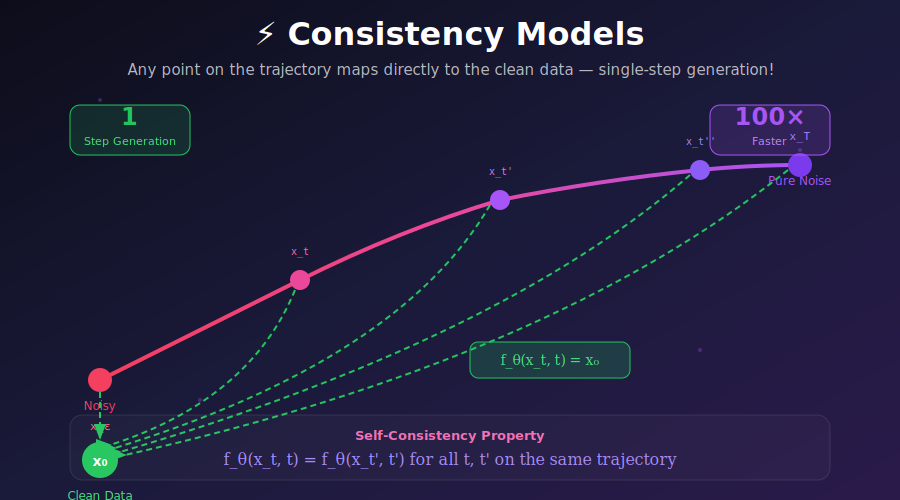
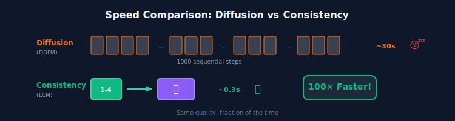
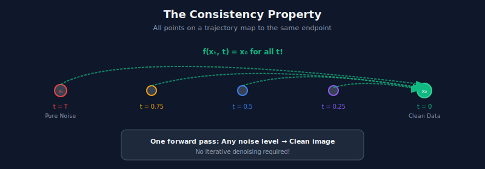

# ⚡ Consistency Models

<div align="center">



<br/>

### 🚀 *One Step to Rule Them All* 🚀

<br/>

[](#)
[](#)
[](#)

---

*"What if generating an image took one forward pass instead of a thousand?"*

**That question is no longer hypothetical.**

</div>

---

## 🎬 The Speed Barrier

> **The year is 2023.** Diffusion models are everywhere. They're generating incredible images. There's just one problem:
>
> **They're slow.**

<div align="center">



</div>

---

## 💡 The Breakthrough Insight

<div align="center">

### 💫 *"All points on a diffusion trajectory lead to the same destination. So skip the journey."* 💫

</div>

<table>
<tr>
<td width="50%" style="vertical-align: top">

### 🐌 The Diffusion Way
*"Walk carefully from noise to image, one step at a time."*

- Start at pure noise
- Take small denoising steps
- Each step removes a bit of noise
- **1000 steps × 1 forward pass each = 1000 forward passes**

**Like walking from NYC to LA, step by step.**

</td>
<td width="50%" style="vertical-align: top">

### ⚡ The Consistency Way
*"Teleport directly to the destination."*

- Start at any noise level
- Predict the final clean image directly
- **1 step × 1 forward pass = 1 forward pass**

**Like having a transporter beam.**

</td>
</tr>
</table>

<div align="center">

> 🧠 **The Key Realization:** Every point on a diffusion trajectory ends at the same place.
> 
> So why not learn a function that takes you there directly?

</div>

---

## 🌍 The Impact: Where Speed Matters

> *Suddenly, generative AI can go places it couldn't before.*

<table>
<tr>
<th width="18%">Application</th>
<th width="30%">Before (Diffusion)</th>
<th width="30%">After (Consistency)</th>
<th width="22%">Who's Using It</th>
</tr>
<tr>
<td>

### 📱 
**Mobile Apps**

</td>
<td>

❌ 30s per image
Battery drain
Users give up

</td>
<td>

✅ <1s per image
Efficient
Delightful UX

</td>
<td>

On-device AI photo editing

</td>
</tr>
<tr>
<td>

### 🎮 
**Gaming**

</td>
<td>

❌ Impossible
Can't wait 30s
Breaks immersion

</td>
<td>

✅ Real-time
In-game asset gen
Dynamic textures

</td>
<td>

**SDXL-Lightning**

</td>
</tr>
<tr>
<td>

### 🖼️ 
**Interactive Art**

</td>
<td>

❌ Delayed feedback
Clunky workflow
Limited iteration

</td>
<td>

✅ Instant preview
Rapid iteration
Creative flow

</td>
<td>

**StreamDiffusion**

</td>
</tr>
<tr>
<td>

### 🌐 
**API Services**

</td>
<td>

❌ High latency
Expensive compute
$$$$ per image

</td>
<td>

✅ Low latency
10-100× cheaper
Scale easily

</td>
<td>

**LCM-LoRA APIs**

</td>
</tr>
<tr>
<td>

### 🤖 
**Robotics**

</td>
<td>

❌ Too slow
Robot waits
Safety issues

</td>
<td>

✅ Real-time visual planning
Immediate decisions

</td>
<td>

Research labs

</td>
</tr>
</table>

---

## 🧮 The Mathematics: Elegant Simplicity

### The Core Property: Self-Consistency

<div align="center">

**The Definition:** A consistency function $f$ maps ANY point on a trajectory to its endpoint.

$$\boxed{f(x_t, t) = f(x_{t'}, t') = x_0 \quad \forall\ t, t' \text{ on the same trajectory}}$$

</div>

<div align="center">



</div>

---

### Why This Works: The Probability Flow ODE

<details>
<summary><b>📐 Click to expand: Mathematical Foundation</b></summary>

**The Probability Flow ODE:**

Every diffusion process has an associated deterministic ODE:

$$\frac{dx}{dt} = v(x, t) = f(x,t) - \frac{g(t)^2}{2}\nabla_x \log p_t(x)$$

**Key Property:** This ODE has **unique trajectories**. Given any point $(x_t, t)$, there is exactly one path through it.

**Consistency Function Definition:**

For a trajectory $\{x_\tau\}_{\tau \in [\epsilon, T]}$, define:

$$f: (x_t, t) \mapsto x_\epsilon \approx x_0$$

**The Self-Consistency Equation:**

Let $\Phi_t(x, s)$ = solving the ODE from time $s$ to $t$ starting at $x$.

Then for any $t, t' \in [\epsilon, T]$:

$$f(x_t, t) = f(\Phi_{t'}(x_t, t), t') = x_\epsilon$$

Both map to the same endpoint because they're on the same trajectory!

$\blacksquare$

</details>

---

### The Architecture: Satisfying Boundary Conditions

**The Problem:** We need $f_\theta(x_\epsilon, \epsilon) = x_\epsilon$ (identity at minimal noise).

**The Solution:** Skip connections with learned coefficients:

$$\boxed{f_\theta(x, t) = c_{\text{skip}}(t) \cdot x + c_{\text{out}}(t) \cdot F_\theta(x, t)}$$

<table>
<tr>
<th>Coefficient</th>
<th>Formula</th>
<th>At $t = \epsilon$</th>
<th>At $t = T$</th>
</tr>
<tr>
<td>$c_{\text{skip}}(t)$</td>
<td>$\frac{\sigma_{\text{data}}^2}{(t - \epsilon)^2 + \sigma_{\text{data}}^2}$</td>
<td>$\approx 1$</td>
<td>$\approx 0$</td>
</tr>
<tr>
<td>$c_{\text{out}}(t)$</td>
<td>$\frac{\sigma_{\text{data}}(t - \epsilon)}{\sqrt{\sigma_{\text{data}}^2 + t^2}}$</td>
<td>$= 0$</td>
<td>$\approx 1$</td>
</tr>
</table>

<div align="center">

> 🎯 At $t = \epsilon$: $f(x, \epsilon) = 1 \cdot x + 0 \cdot F(x, \epsilon) = x$ ✓
>
> At $t = T$: $f(x, T) \approx 0 \cdot x + 1 \cdot F(x, T) = F(x, T)$ (full network prediction)

</div>

---

## 🏋️ Two Paths to Consistency

### 🎓 Method 1: Consistency Distillation (CD)

*"Learn from a master (pre-trained diffusion model)"*

<div align="center">

```
                    CONSISTENCY DISTILLATION
                    
    Pre-trained Teacher (Diffusion)
              │
              │  Takes one step: x_t ──▶ x_{t'}
              ▼
    ┌─────────────────────────────────────────────────┐
    │                                                 │
    │   f_θ(x_t, t)  should equal  f_θ(x_{t'}, t')   │
    │                                                 │
    │   Student learns: points connected by teacher  │
    │   should map to the same output                │
    │                                                 │
    └─────────────────────────────────────────────────┘
```

</div>

```python
def consistency_distillation_loss(student, teacher, x_0, schedule):
    """
    Distill the "skip ahead" ability from a diffusion teacher.
    
    Key insight: The teacher connects x_t and x_{t'}.
    The student learns both should map to the same place.
    """
    batch_size = x_0.shape[0]
    
    # Sample timesteps
    n = torch.randint(1, len(schedule), (batch_size,))
    t = schedule[n]
    t_next = schedule[n - 1]  # Closer to clean
    
    # Create noisy image
    noise = torch.randn_like(x_0)
    x_t = x_0 + t.view(-1,1,1,1) * noise
    
    # ══════════════════════════════════════════════════════════
    # Teacher takes ONE step from x_t toward x_0
    # ══════════════════════════════════════════════════════════
    with torch.no_grad():
        eps_pred = teacher(x_t, t)
        x_t_next = x_t - (t - t_next).view(-1,1,1,1) * eps_pred
    
    # ══════════════════════════════════════════════════════════
    # Student must map BOTH to the same output
    # ══════════════════════════════════════════════════════════
    f_t = student(x_t, t)
    
    with torch.no_grad():  # EMA target for stability
        f_t_next = student(x_t_next, t_next)
    
    # Consistency loss: they should be equal!
    loss = F.mse_loss(f_t, f_t_next)
    
    return loss
```

---

### 🌱 Method 2: Consistency Training (CT)

*"Learn consistency from scratch — no teacher needed!"*

<div align="center">

```
                    CONSISTENCY TRAINING
                    
    Same x_0, Same noise ε
              │
              │  Different noise levels: t and t'
              ▼
    ┌─────────────────────────────────────────────────┐
    │                                                 │
    │   x_t = x_0 + t·ε                               │
    │   x_{t'} = x_0 + t'·ε                           │
    │                                                 │
    │   SAME trajectory! (because same x_0 and ε)    │
    │                                                 │
    │   So: f(x_t, t) should equal f(x_{t'}, t')     │
    │                                                 │
    └─────────────────────────────────────────────────┘
```

</div>

```python
def consistency_training_loss(model, ema_model, x_0, schedule, N):
    """
    Train from scratch using the key insight:
    Same base (x_0, ε) at different noise levels = same trajectory!
    """
    batch_size = x_0.shape[0]
    
    # Sample adjacent timesteps
    n = torch.randint(1, N, (batch_size,))
    t = schedule[n]
    t_next = schedule[n - 1]
    
    # ══════════════════════════════════════════════════════════
    # THE MAGIC: Same noise for both!
    # This guarantees they're on the same trajectory
    # ══════════════════════════════════════════════════════════
    noise = torch.randn_like(x_0)
    x_t = x_0 + t.view(-1,1,1,1) * noise
    x_t_next = x_0 + t_next.view(-1,1,1,1) * noise  # Same noise!
    
    # Student prediction
    f_t = model(x_t, t)
    
    # EMA target (slowly-moving, stabilizes training)
    with torch.no_grad():
        f_t_next = ema_model(x_t_next, t_next)
    
    # They should match!
    loss = F.mse_loss(f_t, f_t_next)
    
    return loss
```

<div align="center">

| Method | Needs Teacher? | Training | Quality |
|:------:|:--------------:|:--------:|:-------:|
| **CD** | ✅ Yes | Faster convergence | Higher ceiling |
| **CT** | ❌ No | From scratch | Slightly lower |

</div>

---

## 🎨 Sampling: The Payoff

### ⚡ Single-Step Generation (Maximum Speed)

```python
@torch.no_grad()
def generate_one_step(model, shape, sigma_max=80.0):
    """
    The holy grail: one forward pass, one image.
    """
    # Pure noise
    x = torch.randn(shape) * sigma_max
    
    # One. Single. Forward pass.
    image = model(x, sigma_max)
    
    return image  # 🎉 Done!
```

### 🎯 Multi-Step Generation (Trade Speed for Quality)

```python
@torch.no_grad()
def generate_multistep(model, shape, sigmas=[80, 24, 5.4, 1.2]):
    """
    More steps = better quality.
    
    The trick: denoise → add smaller noise → denoise → ...
    """
    x = torch.randn(shape) * sigmas[0]
    
    for i, sigma in enumerate(sigmas):
        # Denoise: predict clean image
        x = model(x, sigma)
        
        # Add fresh noise at smaller level (except last step)
        if i < len(sigmas) - 1:
            noise = torch.randn_like(x)
            x = x + sigmas[i + 1] * noise
    
    return x
```

---

## 📊 The Numbers Don't Lie

### Quality vs Speed (ImageNet 64×64)

<table>
<tr>
<th>Model</th>
<th>Steps</th>
<th>FID ↓</th>
<th>Speedup</th>
<th>Note</th>
</tr>
<tr>
<td><b>EDM (baseline)</b></td>
<td>79</td>
<td>2.44</td>
<td>1×</td>
<td>Full diffusion</td>
</tr>
<tr>
<td><b>DDIM</b></td>
<td>50</td>
<td>4.67</td>
<td>1.6×</td>
<td>Faster diffusion</td>
</tr>
<tr style="background-color: #f0fdf4;">
<td><b>Consistency (CT)</b></td>
<td>1</td>
<td>3.55</td>
<td><b>79×</b></td>
<td>⚡ One step!</td>
</tr>
<tr style="background-color: #f0fdf4;">
<td><b>Consistency (CT)</b></td>
<td>2</td>
<td>2.93</td>
<td><b>40×</b></td>
<td>Near-SOTA</td>
</tr>
</table>

### Real-World: Stable Diffusion XL

<table>
<tr>
<th>Method</th>
<th>Steps</th>
<th>Latency</th>
<th>Quality</th>
</tr>
<tr>
<td><b>SDXL Base</b></td>
<td>50</td>
<td>~15s</td>
<td>⭐⭐⭐⭐⭐</td>
</tr>
<tr style="background-color: #faf5ff;">
<td><b>SDXL + LCM-LoRA</b></td>
<td>4</td>
<td><b>~1.2s</b></td>
<td>⭐⭐⭐⭐</td>
</tr>
<tr style="background-color: #faf5ff;">
<td><b>SDXL + LCM-LoRA</b></td>
<td>8</td>
<td><b>~2.4s</b></td>
<td>⭐⭐⭐⭐⭐</td>
</tr>
<tr style="background-color: #fffbeb;">
<td><b>SDXL-Lightning</b></td>
<td>4</td>
<td><b>~1.0s</b></td>
<td>⭐⭐⭐⭐⭐</td>
</tr>
</table>

---

## 🔧 LCM: Consistency for Stable Diffusion

### Latent Consistency Models (LCM)

<div align="center">

> 💡 Apply consistency training in **latent space** = works with Stable Diffusion!

</div>

```python
class LatentConsistencyModel:
    """
    Consistency models for latent diffusion (like Stable Diffusion).
    """
    
    def __init__(self, vae, unet, text_encoder):
        self.vae = vae               # Image ↔ Latent
        self.unet = unet             # Modified for consistency
        self.text_encoder = text_encoder
    
    def generate(self, prompt, num_steps=4, cfg_scale=1.5):
        # Encode text
        text_emb = self.text_encoder(prompt)
        
        # Start from noise in latent space (64×64, not 512×512!)
        latent = torch.randn(1, 4, 64, 64)
        
        # LCM's special timestep schedule
        timesteps = self.get_lcm_timesteps(num_steps)
        
        for t in timesteps:
            # Consistency prediction in latent space
            latent = self.unet(latent, t, text_emb, cfg_scale)
            
            if t > timesteps[-1]:
                # Add back smaller noise
                latent = self.add_noise(latent, next_t)
        
        # Decode to pixels
        image = self.vae.decode(latent)
        return image
```

### 🔌 LCM-LoRA: Plug-and-Play Speed

```python
# Works with ANY SD/SDXL checkpoint!
from diffusers import DiffusionPipeline, LCMScheduler

# Load your favorite model
pipe = DiffusionPipeline.from_pretrained("stabilityai/sdxl-base-1.0")

# Add the LCM magic (tiny LoRA adapter)
pipe.load_lora_weights("latent-consistency/lcm-lora-sdxl")
pipe.scheduler = LCMScheduler.from_config(pipe.scheduler.config)

# Generate in 4 steps! 🚀
image = pipe(
    prompt="A cyberpunk cityscape at sunset, neon lights reflecting on wet streets",
    num_inference_steps=4,     # Just 4 steps!
    guidance_scale=1.5         # LCM uses lower CFG
).images[0]
```

---

## 📝 Key Equations Summary

| Concept | Formula | Meaning |
|---------|---------|---------|
| **Self-consistency** | $f(x_t, t) = f(x_{t'}, t')$ | Same trajectory → same output |
| **Boundary condition** | $f(x_\epsilon, \epsilon) = x_\epsilon$ | Identity at minimal noise |
| **Skip connection** | $f = c_{\text{skip}} \cdot x + c_{\text{out}} \cdot F(x,t)$ | Satisfies boundary |
| **CD loss** | $\|f_\theta(x_t, t) - f_{\theta^-}(\hat{x}_{t'}, t')\|^2$ | Teacher-guided consistency |
| **CT loss** | $\|f_\theta(x_t, t) - f_{\theta^-}(x_{t'}, t')\|^2$ | Self-guided consistency |

---

## 📚 The Essential Papers

<table>
<tr>
<th width="55%">Paper</th>
<th width="45%">Why It Matters</th>
</tr>
<tr>
<td>

**Song et al.** (2023)
*"Consistency Models"*
[ICML](https://arxiv.org/abs/2303.01469)

</td>
<td>

🏆 **The Original**
Introduced the framework.

</td>
</tr>
<tr>
<td>

**Luo et al.** (2023)
*"Latent Consistency Models"*
[arXiv](https://arxiv.org/abs/2310.04378)

</td>
<td>

🖼️ **LCM**
Made it work with Stable Diffusion.

</td>
</tr>
<tr>
<td>

**Song et al.** (2023)
*"Improved Techniques for Training Consistency Models"*
[arXiv](https://arxiv.org/abs/2310.14189)

</td>
<td>

📈 **Better Training**
Improved quality significantly.

</td>
</tr>
<tr>
<td>

**Lin et al.** (2024)
*"SDXL-Lightning"*
[arXiv](https://arxiv.org/abs/2402.13929)

</td>
<td>

⚡ **Production Ready**
State-of-the-art 4-step generation.

</td>
</tr>
</table>

---

## ✏️ Exercises

<details>
<summary><b>🟢 Exercise 1:</b> Single-step MNIST</summary>

**Task:** Implement a minimal consistency model for MNIST.

**Steps:**
1. Build a simple U-Net with skip connections
2. Implement the boundary condition architecture
3. Train with CT loss
4. Generate digits in ONE step

**Success:** Recognizable digits from a single forward pass.

</details>

<details>
<summary><b>🟡 Exercise 2:</b> Compare CD vs CT</summary>

**Task:** Train both methods on CIFAR-10.

**Compare:**
1. Training curves
2. 1-step FID
3. 2-step and 4-step FID
4. Training time to reach similar quality

</details>

<details>
<summary><b>🟡 Exercise 3:</b> Use LCM-LoRA</summary>

**Task:** Try LCM-LoRA with different base models.

**Experiment:**
1. Test with SD 1.5, SD 2.1, SDXL
2. Measure quality at 1, 2, 4, 8 steps
3. Compare CFG scales (1.0, 1.5, 2.0, 4.0)
4. Find optimal settings for each model

</details>

<details>
<summary><b>🔴 Exercise 4:</b> Prove the self-consistency property</summary>

**Task:** Show mathematically why the consistency function is well-defined.

**Prove:**
1. The PF-ODE has unique trajectories
2. Any two points on a trajectory share an endpoint
3. Therefore $f(x_t, t) = f(x_{t'}, t')$ for all $t, t'$ on the same path

</details>

---

<div align="center">

## ⚡ The Future is Fast

<br/>

Consistency models answered the question:
*"Can we have diffusion quality at GAN speed?"*

**The answer is yes.**

<br/>

**Next →** [Diffusion Distillation](../04_diffusion_distillation/)

---

<div align="center">

**[← Rectified Flow](../02_rectified_flow/)** | **[Next: Diffusion Distillation →](../04_diffusion_distillation/)**

</div>
