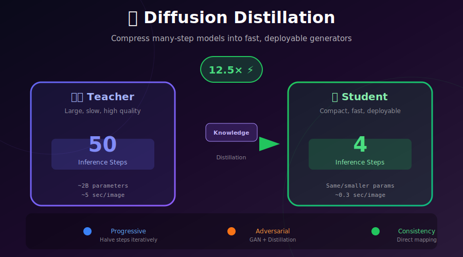
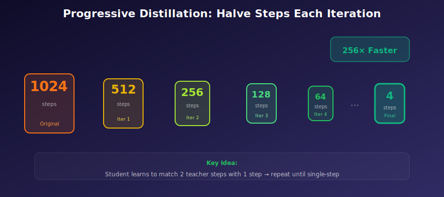

# 📚 Diffusion Distillation

<div align="center">



*Compress many-step diffusion models into fast, deployable generators*

[](#)
[](#)
[](#)

</div>

---

## 🎯 Where & Why: Real-World Applications

### Where is Distillation Used?

| Application | Model | Why Distillation? |
|-------------|-------|-------------------|
| 🚀 **SDXL Turbo** | Adversarial Distillation | 1-4 step generation for production |
| ⚡ **SD Turbo** | ADD | Real-time image editing |
| 📱 **Mobile Deployment** | Progressive Distillation | Reduce compute 10-50× |
| 🎮 **Gaming Assets** | Knowledge Distillation | Fast texture generation |
| 🌐 **API Services** | Various | Lower latency, reduced costs |
| 🎬 **Video Tools** | SVD-XT Turbo | Real-time video generation |

### Why Use Distillation?

| Challenge | Without Distillation | With Distillation |
|-----------|---------------------|-------------------|
| **Latency** | 5-30 seconds | 0.3-2 seconds |
| **GPU memory** | High (full model) | Can be optimized |
| **API costs** | $0.02-0.05/image | $0.002-0.01/image |
| **User experience** | Wait for results | Near-instant feedback |
| **Edge deployment** | Impractical | Feasible |

> 💡 **The Goal:** Get 95%+ of teacher quality at 10-100× the speed.

---

## 📖 The Distillation Landscape

### Overview of Methods



| Method | Approach | Final Steps | Quality | Complexity |
|--------|----------|-------------|---------|------------|
| **Progressive** | Halve steps iteratively | 4-8 | ⭐⭐⭐⭐ | Low |
| **Knowledge** | Match predictions | 4-8 | ⭐⭐⭐ | Low |
| **Adversarial (ADD)** | GAN + Distillation | 1-4 | ⭐⭐⭐⭐⭐ | High |
| **Guided** | Classifier-free guidance | 1-4 | ⭐⭐⭐⭐ | Medium |
| **Score (SDS)** | 3D optimization | N/A | ⭐⭐⭐⭐ | Special |

---

## 🔧 Progressive Distillation

### The Core Idea

**Halve the number of steps each iteration:**

$$N \to N/2 \to N/4 \to \cdots \to 4$$

The student learns to do in **1 step** what the teacher does in **2 steps**.

### Mathematical Formulation

Given teacher with \(N\) steps and step size \(\Delta t = T/N\):

**Teacher:** Two steps from \(t\) to \(t - 2\Delta t\)
$$x_{t-\Delta t} = \text{step}(x_t, t, \Delta t)$$
$$x_{t-2\Delta t} = \text{step}(x_{t-\Delta t}, t-\Delta t, \Delta t)$$

**Student:** One step from \(t\) to \(t - 2\Delta t\)
$$\hat{x}_{t-2\Delta t} = \text{step}_\theta(x_t, t, 2\Delta t)$$

**Loss:**
$$\mathcal{L} = \mathbb{E}_{t, x_0}\left[\|x_{t-2\Delta t} - \hat{x}_{t-2\Delta t}\|^2\right]$$

### Implementation

```python
class ProgressiveDistillation:
    """
    Progressive Distillation: Halve steps each iteration.
    
    1024 → 512 → 256 → 128 → 64 → 32 → 16 → 8 → 4
    """
    
    def __init__(self, teacher_model, initial_steps=1024):
        self.teacher = teacher_model
        self.current_steps = initial_steps
    
    def distill_one_iteration(self, dataloader, num_epochs=100):
        """Distill teacher into student with half the steps."""
        
        # Student starts as copy of teacher
        student = copy.deepcopy(self.teacher)
        target_steps = self.current_steps // 2
        
        optimizer = torch.optim.Adam(student.parameters(), lr=1e-4)
        
        for epoch in range(num_epochs):
            for x_0 in dataloader:
                # Sample random timestep
                t_idx = torch.randint(0, target_steps, (x_0.shape[0],))
                t = t_idx / target_steps  # Normalized time
                dt = 1.0 / target_steps
                
                # Add noise
                noise = torch.randn_like(x_0)
                x_t = self.add_noise(x_0, t, noise)
                
                # Teacher: 2 smaller steps
                with torch.no_grad():
                    x_mid = self.teacher_step(x_t, t, dt)
                    x_target = self.teacher_step(x_mid, t - dt, dt)
                
                # Student: 1 larger step  
                x_pred = self.student_step(student, x_t, t, 2 * dt)
                
                # Match outputs
                loss = F.mse_loss(x_pred, x_target)
                
                optimizer.zero_grad()
                loss.backward()
                optimizer.step()
        
        # Update for next iteration
        self.teacher = student
        self.current_steps = target_steps
        
        return student
    
    def full_distillation(self, dataloader, target_steps=4):
        """Run progressive distillation until target steps."""
        while self.current_steps > target_steps:
            print(f"Distilling {self.current_steps} → {self.current_steps // 2}")
            self.distill_one_iteration(dataloader)
        
        return self.teacher
```

---

## ⚔️ Adversarial Diffusion Distillation (ADD)

### The Breakthrough: SDXL Turbo

ADD combines **diffusion distillation** with **adversarial training** for state-of-the-art few-step generation.

### Architecture

```
                    ┌─────────────────┐
    x_real ────────▶│  Discriminator  │──────▶ D(x_real) ≈ 1
                    │   (Features)    │
                    └─────────────────┘
                            ▲
                            │
    ┌─────────────────────────────────────────────┐
    │                  Training Loop               │
    │  z ~ N(0,I)                                  │
    │      │                                       │
    │      ▼                                       │
    │  ┌─────────┐    ┌─────────┐    ┌─────────┐  │
    │  │ Student │───▶│ x_fake  │───▶│  D(x)   │  │
    │  │ (1-4    │    │         │    │         │  │
    │  │  steps) │    └────┬────┘    └─────────┘  │
    │  └────┬────┘         │                      │
    │       │              │                      │
    │       │    ┌─────────▼─────────┐            │
    │       │    │    Teacher        │            │
    │       └───▶│   (50 steps)      │            │
    │            │    x_teacher      │            │
    │            └───────────────────┘            │
    └─────────────────────────────────────────────┘
```

### Loss Functions

**Discriminator Loss:**
$$\mathcal{L}_D = \mathbb{E}[\max(0, 1 - D(x_{\text{real}}))] + \mathbb{E}[\max(0, 1 + D(x_{\text{fake}}))]$$

**Generator Loss:**
$$\mathcal{L}_G = -\mathbb{E}[D(x_{\text{fake}})]$$

**Distillation Loss:**
$$\mathcal{L}_{\text{distill}} = \mathbb{E}[\|x_{\text{student}} - x_{\text{teacher}}\|^2]$$

**Combined:**
$$\mathcal{L}_{\text{ADD}} = \mathcal{L}_G + \lambda \cdot \mathcal{L}_{\text{distill}}$$

### Implementation

```python
class AdversarialDiffusionDistillation:
    """
    ADD: Combine adversarial loss with distillation for 1-4 step generation.
    Used in SDXL Turbo and SD Turbo.
    """
    
    def __init__(self, teacher, student, discriminator):
        self.teacher = teacher
        self.student = student
        self.discriminator = discriminator
        
        self.opt_g = torch.optim.Adam(student.parameters(), lr=1e-5)
        self.opt_d = torch.optim.Adam(discriminator.parameters(), lr=1e-5)
    
    def training_step(self, x_real, text_embed):
        batch_size = x_real.shape[0]
        
        # === Discriminator Update ===
        z = torch.randn_like(x_real)
        
        with torch.no_grad():
            # Student generates in 4 steps
            x_fake = self.student_sample(z, text_embed, steps=4)
        
        # Discriminator predictions
        d_real = self.discriminator(x_real)
        d_fake = self.discriminator(x_fake)
        
        # Hinge loss
        d_loss = (
            F.relu(1 - d_real).mean() + 
            F.relu(1 + d_fake).mean()
        )
        
        self.opt_d.zero_grad()
        d_loss.backward()
        self.opt_d.step()
        
        # === Generator (Student) Update ===
        z = torch.randn_like(x_real)
        x_fake = self.student_sample(z, text_embed, steps=4)
        
        # Adversarial loss
        d_fake = self.discriminator(x_fake)
        g_loss = -d_fake.mean()
        
        # Distillation loss (match teacher)
        with torch.no_grad():
            x_teacher = self.teacher_sample(z, text_embed, steps=50)
        
        distill_loss = F.mse_loss(x_fake, x_teacher)
        
        # Combined loss
        total_loss = g_loss + 0.5 * distill_loss
        
        self.opt_g.zero_grad()
        total_loss.backward()
        self.opt_g.step()
        
        return {'d_loss': d_loss.item(), 'g_loss': g_loss.item()}
```

---

## 🎯 Score Distillation Sampling (SDS)

### A Special Kind of Distillation: 2D → 3D

SDS uses a 2D diffusion model to optimize 3D representations:

$$\nabla_\theta \mathcal{L}_{\text{SDS}} = \mathbb{E}_{t, \epsilon}\left[w(t)\left(\hat{\epsilon}_\phi(x_t; t, y) - \epsilon\right) \frac{\partial x}{\partial \theta}\right]$$

where:
- \(\theta\): Parameters of 3D representation (NeRF, 3DGS)
- \(x\): Rendered 2D image
- \(\hat{\epsilon}_\phi\): Pre-trained diffusion model's noise prediction
- \(y\): Text conditioning

### How SDS Works

```python
def sds_loss(nerf, diffusion_model, camera, prompt, guidance_scale=100):
    """
    Score Distillation Sampling for text-to-3D.
    
    The gradient from the frozen 2D diffusion model guides
    the 3D representation to match the text description.
    """
    # Render image from current NeRF
    rendered = nerf.render(camera)  # [H, W, 3]
    
    # Add noise
    t = torch.randint(20, 980, (1,))  # Avoid extremes
    noise = torch.randn_like(rendered)
    x_t = add_noise(rendered, t, noise)
    
    # Get diffusion model prediction
    with torch.no_grad():
        # Classifier-free guidance
        eps_uncond = diffusion_model(x_t, t, null_text)
        eps_cond = diffusion_model(x_t, t, encode(prompt))
        eps_pred = eps_uncond + guidance_scale * (eps_cond - eps_uncond)
    
    # SDS gradient: difference between predicted and actual noise
    grad = (eps_pred - noise)
    
    # Weight by timestep
    w = 1.0  # Can use SNR weighting
    
    # Backprop through rendering (not through diffusion model!)
    loss = w * (grad.detach() * rendered).sum()
    
    return loss
```

---

## 📊 Results Comparison

### SDXL vs Distilled Variants

| Model | Steps | Time (A100) | FID (COCO) | CLIP Score |
|-------|-------|-------------|------------|------------|
| SDXL | 50 | ~8s | 22.1 | 0.317 |
| SDXL + LCM | 4 | ~0.8s | 25.3 | 0.312 |
| SDXL Turbo (ADD) | 1 | ~0.2s | 28.5 | 0.305 |
| SDXL Turbo (ADD) | 4 | ~0.7s | 23.8 | 0.315 |
| SDXL Lightning | 4 | ~0.7s | 23.2 | 0.316 |

### Quality vs Speed Trade-off

```
Quality (FID ↓)
    │
 22 │                    ⭐ SDXL (50 steps)
    │                 ⭐ Lightning (4)
 24 │              ⭐ ADD (4 steps)
    │          ⭐ LCM (4 steps)
 26 │      
    │  
 28 │  ⭐ ADD (1 step)
    │
    └────────────────────────────────────▶ Speed
        0.2s   0.5s   1s    2s    5s    8s
```

---

## 🛠️ Practical Usage

### SDXL Turbo

```python
from diffusers import AutoPipelineForText2Image
import torch

# Load SDXL Turbo
pipe = AutoPipelineForText2Image.from_pretrained(
    "stabilityai/sdxl-turbo",
    torch_dtype=torch.float16,
    variant="fp16"
)
pipe.to("cuda")

# Generate in 1 step!
image = pipe(
    prompt="A cinematic shot of a baby raccoon wearing an intricate italian priest robe",
    num_inference_steps=1,
    guidance_scale=0.0  # No CFG needed for Turbo
).images[0]
```

### SD Turbo

```python
from diffusers import AutoPipelineForImage2Image
import torch

pipe = AutoPipelineForImage2Image.from_pretrained(
    "stabilityai/sd-turbo",
    torch_dtype=torch.float16
)
pipe.to("cuda")

# Image-to-image in 2 steps
init_image = load_image("input.png")
image = pipe(
    prompt="cat wizard, gandalf style",
    image=init_image,
    num_inference_steps=2,
    strength=0.5,
    guidance_scale=0.0
).images[0]
```

---

## 📚 References

1. **Salimans, T., & Ho, J.** (2022). "Progressive Distillation for Fast Sampling of Diffusion Models." *ICLR*. [arXiv:2202.00512](https://arxiv.org/abs/2202.00512)

2. **Sauer, A., et al.** (2023). "Adversarial Diffusion Distillation." [arXiv:2311.17042](https://arxiv.org/abs/2311.17042)

3. **Meng, C., et al.** (2023). "On Distillation of Guided Diffusion Models." [arXiv:2210.03142](https://arxiv.org/abs/2210.03142)

4. **Poole, B., et al.** (2023). "DreamFusion: Text-to-3D using 2D Diffusion." *ICLR*. [arXiv:2209.14988](https://arxiv.org/abs/2209.14988)

---

## ✏️ Exercises

<details>
<summary><b>Exercise 1: Implement Progressive Distillation</b></summary>

On MNIST or CIFAR-10:
1. Train a diffusion model with 1000 steps
2. Distill to 500 → 250 → 125 → 64 → 32 → 16 → 8 steps
3. Compare quality at each stage
4. Plot FID vs number of steps

</details>

<details>
<summary><b>Exercise 2: Compare Distillation Methods</b></summary>

Using a pre-trained SD model:
1. Apply progressive distillation
2. Apply consistency distillation
3. Compare quality and speed
4. Analyze failure cases

</details>

<details>
<summary><b>Exercise 3: SDS for 2D Optimization</b></summary>

Use SDS to optimize a 2D image (not 3D):
1. Start with random noise
2. Use SDS gradient from text prompt
3. Observe the "mode-seeking" behavior
4. Experiment with guidance scale

</details>

---

<div align="center">

**[← Consistency Models](../03_consistency_models/)** | **[Next: Diffusion vs Flows →](../05_diffusion_vs_flows/)**

</div>
