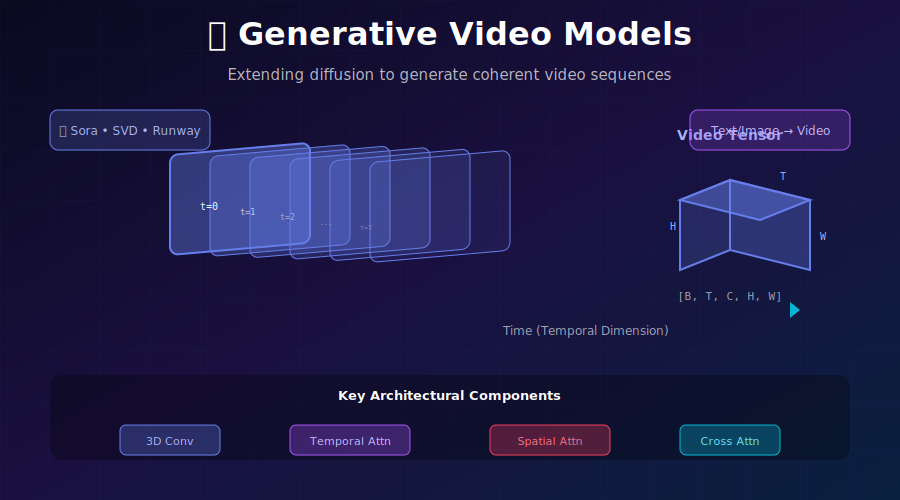
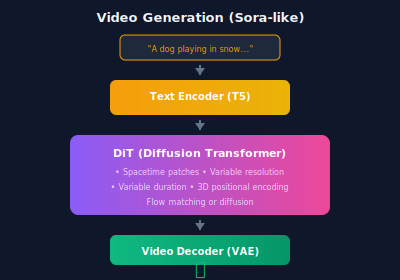

# 🎬 Generative Video Models

<div align="center">



*Extending diffusion to generate coherent, temporally consistent video sequences*

[](#)
[](#)
[](#)

</div>

---

## 🎯 Where & Why: Real-World Applications

### Where is Video Generation Used?

| Application | Models | Why Video Generation? |
|-------------|--------|----------------------|
| 🎬 **Film Pre-visualization** | Sora, Runway | Rapid concept visualization |
| 📱 **Social Media Content** | Pika, Kling | Engaging short-form videos |
| 🎮 **Game Cinematics** | Research | Procedural cutscene generation |
| 🛒 **E-commerce** | SVD | Product animations |
| 📚 **Education** | Various | Explanatory visualizations |
| 🎨 **Art & Music Videos** | Kaiber, Runway | Creative expression |
| 🤖 **Robotics Simulation** | World models | Training data generation |

### Why is Video Generation Hard?

| Challenge | Why It's Difficult | Current Solutions |
|-----------|-------------------|-------------------|
| **Temporal coherence** | Objects must persist across frames | Temporal attention, 3D conv |
| **Motion consistency** | Physics must be plausible | Motion modeling, optical flow |
| **Compute cost** | 3D tensors are massive | Latent space, factorization |
| **Long-range deps** | Story coherence over time | Hierarchical modeling |
| **Training data** | Need high-quality videos | Web scraping, filtering |

> 💡 **The Challenge:** A 10-second 1080p video at 30fps contains **324 million pixels** vs 2 million for a single image. This is a 162× increase in data!

---

## 📖 Core Concepts

### Video as a 3D Tensor

```
Video Tensor Shape: [B, T, C, H, W]
                    │  │  │  │  └─ Width (spatial)
                    │  │  │  └──── Height (spatial)
                    │  │  └─────── Channels (RGB or latent)
                    │  └────────── Time (frames)
                    └───────────── Batch size

Example: 16 frames of 512×512 latent video
         [1, 16, 4, 64, 64] in latent space
         [1, 16, 3, 512, 512] in pixel space
```

### The Temporal Consistency Problem

Without special handling, generating frames independently leads to:
- **Flickering:** Random variations between frames
- **Object teleportation:** Things moving unrealistically
- **Identity drift:** Characters slowly changing appearance
- **Physics violations:** Impossible motions

---

## 🏗️ Architectural Approaches

### 1. Factorized Spatial-Temporal Attention

Process spatial and temporal dimensions separately:

```python
class SpatioTemporalAttention(nn.Module):
    """
    Factorized attention: Spatial first, then temporal.
    More efficient than full 3D attention.
    """
    
    def __init__(self, dim, heads=8):
        super().__init__()
        self.spatial_attn = nn.MultiheadAttention(dim, heads)
        self.temporal_attn = nn.MultiheadAttention(dim, heads)
        self.norm1 = nn.LayerNorm(dim)
        self.norm2 = nn.LayerNorm(dim)
    
    def forward(self, x):
        # x: [B, T, H, W, C]
        B, T, H, W, C = x.shape
        
        # === Spatial Attention (within each frame) ===
        # Reshape: treat each frame independently
        x_spatial = rearrange(x, 'b t h w c -> (b t) (h w) c')
        
        # Self-attention over spatial positions
        x_spatial = self.norm1(x_spatial)
        attn_out, _ = self.spatial_attn(x_spatial, x_spatial, x_spatial)
        x_spatial = x_spatial + attn_out
        
        # Reshape back
        x = rearrange(x_spatial, '(b t) (h w) c -> b t h w c', b=B, t=T, h=H, w=W)
        
        # === Temporal Attention (across frames) ===
        # Reshape: treat each spatial position independently
        x_temporal = rearrange(x, 'b t h w c -> (b h w) t c')
        
        # Self-attention over time
        x_temporal = self.norm2(x_temporal)
        attn_out, _ = self.temporal_attn(x_temporal, x_temporal, x_temporal)
        x_temporal = x_temporal + attn_out
        
        # Reshape back
        x = rearrange(x_temporal, '(b h w) t c -> b t h w c', b=B, h=H, w=W)
        
        return x
```

### 2. 3D Convolutions

Extend 2D convolutions to handle time:

```python
class Temporal3DConvBlock(nn.Module):
    """
    3D convolution for video: spatial + temporal processing.
    """
    
    def __init__(self, in_channels, out_channels):
        super().__init__()
        
        # Spatial convolution (acts on H, W)
        self.spatial_conv = nn.Conv3d(
            in_channels, out_channels,
            kernel_size=(1, 3, 3),  # [T, H, W]
            padding=(0, 1, 1)
        )
        
        # Temporal convolution (acts on T)
        self.temporal_conv = nn.Conv3d(
            out_channels, out_channels,
            kernel_size=(3, 1, 1),  # [T, H, W]
            padding=(1, 0, 0)
        )
        
        self.norm = nn.GroupNorm(8, out_channels)
        self.act = nn.SiLU()
    
    def forward(self, x):
        # x: [B, C, T, H, W]
        x = self.spatial_conv(x)
        x = self.norm(x)
        x = self.act(x)
        
        x = self.temporal_conv(x)
        x = self.norm(x)
        x = self.act(x)
        
        return x
```

### 3. Temporal Layers in U-Net

Insert temporal processing into existing 2D U-Nets:

```python
class VideoUNetBlock(nn.Module):
    """
    U-Net block adapted for video with temporal layers.
    """
    
    def __init__(self, channels, num_frames):
        super().__init__()
        
        # Standard 2D spatial processing
        self.spatial_block = ResBlock2D(channels)
        self.spatial_attn = SpatialSelfAttention(channels)
        
        # NEW: Temporal processing
        self.temporal_conv = nn.Conv1d(channels, channels, 3, padding=1)
        self.temporal_attn = TemporalSelfAttention(channels)
        
        self.num_frames = num_frames
    
    def forward(self, x, t_emb):
        # x: [B*T, C, H, W] or [B, C, T, H, W]
        B_T, C, H, W = x.shape
        B = B_T // self.num_frames
        T = self.num_frames
        
        # Spatial processing (per frame)
        x = self.spatial_block(x, t_emb)
        x = self.spatial_attn(x)
        
        # Reshape for temporal processing
        x = rearrange(x, '(b t) c h w -> (b h w) c t', b=B, t=T)
        
        # Temporal convolution
        x = x + self.temporal_conv(x)
        
        # Temporal attention
        x = rearrange(x, '(b h w) c t -> (b h w) t c', b=B, h=H, w=W)
        x = x + self.temporal_attn(x)
        
        # Reshape back
        x = rearrange(x, '(b h w) t c -> (b t) c h w', b=B, h=H, w=W)
        
        return x
```

---

## 🧮 Training Video Diffusion

### Video Diffusion Loss

```python
def video_diffusion_loss(model, video, text_embed):
    """
    Standard diffusion loss adapted for video.
    
    video: [B, T, C, H, W]
    """
    B, T, C, H, W = video.shape
    
    # Encode to latent space (frame by frame or 3D VAE)
    latent = encode_video(video)  # [B, T, 4, h, w]
    
    # Sample timestep (same for all frames in a video)
    t = torch.randint(0, 1000, (B,))
    
    # Add noise
    noise = torch.randn_like(latent)
    noisy_latent = add_noise(latent, t, noise)
    
    # Predict noise
    noise_pred = model(noisy_latent, t, text_embed)
    
    # MSE loss
    loss = F.mse_loss(noise_pred, noise)
    
    return loss
```

### Flow Matching for Video

```python
def video_flow_matching_loss(model, video, text_embed):
    """
    Flow matching adapted for video generation.
    """
    B, T, C, H, W = video.shape
    
    # Encode video
    x_1 = encode_video(video)  # [B, T, 4, h, w]
    
    # Sample noise
    x_0 = torch.randn_like(x_1)
    
    # Sample time
    t = torch.rand(B, 1, 1, 1, 1)  # Same t for all frames
    
    # Interpolate
    x_t = (1 - t) * x_0 + t * x_1
    
    # Target velocity
    v_target = x_1 - x_0
    
    # Predict velocity
    v_pred = model(x_t, t.squeeze(), text_embed)
    
    # MSE loss
    loss = F.mse_loss(v_pred, v_target)
    
    return loss
```

---

## 🎥 Generation Modes

### 1. Text-to-Video

```python
@torch.no_grad()
def text_to_video(model, prompt, num_frames=16, num_steps=50):
    """Generate video from text description."""
    
    # Encode text
    text_embed = encode_text(prompt)
    
    # Start from noise
    latent = torch.randn(1, num_frames, 4, 64, 64)
    
    # Diffusion sampling
    for t in reversed(range(num_steps)):
        t_tensor = torch.full((1,), t)
        
        # Predict noise
        noise_pred = model(latent, t_tensor, text_embed)
        
        # DDIM step
        latent = ddim_step(latent, noise_pred, t)
    
    # Decode to pixel space
    video = decode_video(latent)
    
    return video  # [1, T, 3, H, W]
```

### 2. Image-to-Video (Animation)

```python
@torch.no_grad()
def image_to_video(model, image, motion_prompt=None, num_frames=14):
    """
    Animate a static image (like SVD).
    
    The first frame is fixed, subsequent frames are generated.
    """
    
    # Encode first frame
    first_frame_latent = encode_image(image)
    
    # Initialize: first frame fixed, rest is noise
    latent = torch.randn(1, num_frames, 4, 64, 64)
    latent[:, 0] = first_frame_latent
    
    # Conditioning on first frame
    image_embed = encode_image_clip(image)
    
    for t in reversed(range(num_steps)):
        t_tensor = torch.full((1,), t)
        
        # Predict noise (model is conditioned on first frame)
        noise_pred = model(latent, t_tensor, image_embed)
        
        # Only update non-first frames
        latent[:, 1:] = ddim_step(latent[:, 1:], noise_pred[:, 1:], t)
    
    video = decode_video(latent)
    return video
```

### 3. Video Extension

```python
def extend_video(model, video, num_new_frames=8):
    """
    Extend an existing video with more frames.
    Uses autoregressive generation with overlap.
    """
    
    # Get last few frames as context
    context_frames = video[:, -4:]  # Last 4 frames
    
    # Generate new frames conditioned on context
    new_latent = torch.randn(1, num_new_frames, 4, 64, 64)
    
    # Concatenate context + new
    full_latent = torch.cat([
        encode_video(context_frames),
        new_latent
    ], dim=1)
    
    # Generate with context fixed
    for t in reversed(range(num_steps)):
        noise_pred = model(full_latent, t)
        # Only update new frames
        full_latent[:, 4:] = ddim_step(full_latent[:, 4:], noise_pred[:, 4:], t)
    
    # Return only new frames (or blend at boundary)
    new_video = decode_video(full_latent[:, 4:])
    return new_video
```

---

## 🏆 State-of-the-Art Models

### Model Comparison

| Model | Type | Max Length | Resolution | Key Innovation |
|-------|------|------------|------------|----------------|
| **Sora** | T2V, I2V | ~60s | Up to 1080p | DiT, spacetime patches |
| **SVD** | I2V | ~4s | 1024×576 | Latent video diffusion |
| **Runway Gen-3** | T2V, I2V | ~10s | 1280×768 | Multi-modal conditioning |
| **Kling** | T2V | ~5min | 1080p | Long-form coherence |
| **Pika** | T2V, I2V | ~3s | Various | User-friendly editing |
| **Make-A-Video** | T2V | ~5s | 768×768 | Spatiotemporal layers |

### Sora's Architecture (Speculated)



---

## 📊 Evaluation Metrics

### Common Metrics

| Metric | Measures | Range | Notes |
|--------|----------|-------|-------|
| **FVD** | Video quality (like FID) | 0 - ∞ (lower better) | Standard for video |
| **FID per frame** | Individual frame quality | 0 - ∞ | Ignores temporal |
| **CLIP Score** | Text-video alignment | 0 - 1 | Semantic match |
| **Motion Smoothness** | Temporal coherence | Various | Custom metrics |
| **Human Eval** | Overall quality | Likert scale | Gold standard |

### Computing FVD

```python
def compute_fvd(real_videos, generated_videos, detector='i3d'):
    """
    Frechet Video Distance - video equivalent of FID.
    
    Uses I3D network pretrained on Kinetics.
    """
    # Extract features using I3D
    real_features = i3d_model(real_videos)  # [N, feature_dim]
    gen_features = i3d_model(generated_videos)
    
    # Compute Frechet distance
    mu_real, sigma_real = real_features.mean(0), np.cov(real_features.T)
    mu_gen, sigma_gen = gen_features.mean(0), np.cov(gen_features.T)
    
    fvd = frechet_distance(mu_real, sigma_real, mu_gen, sigma_gen)
    return fvd
```

---

## 📚 References

1. **Ho, J., et al.** (2022). "Video Diffusion Models." *NeurIPS*. [arXiv:2204.03458](https://arxiv.org/abs/2204.03458)

2. **Blattmann, A., et al.** (2023). "Stable Video Diffusion: Scaling Latent Video Diffusion Models to Large Datasets." [arXiv:2311.15127](https://arxiv.org/abs/2311.15127)

3. **Brooks, T., et al.** (2024). "Video generation models as world simulators." OpenAI Technical Report.

4. **Singer, U., et al.** (2023). "Make-A-Video: Text-to-Video Generation without Text-Video Data." *ICLR*.

---

## ✏️ Exercises

<details>
<summary><b>Exercise 1: Add Temporal Layers</b></summary>

Take a pre-trained image diffusion model and:
1. Insert temporal attention layers
2. Initialize temporal layers to identity
3. Fine-tune on video data
4. Compare with from-scratch training

</details>

<details>
<summary><b>Exercise 2: Implement SVD-style I2V</b></summary>

Build an image-to-video pipeline:
1. Use CLIP image encoder for conditioning
2. Implement first-frame conditioning
3. Train on WebVid or similar
4. Evaluate temporal consistency

</details>

<details>
<summary><b>Exercise 3: Video Interpolation</b></summary>

Given first and last frames:
1. Generate intermediate frames
2. Compare with optical flow methods
3. Evaluate smoothness metrics

</details>

---

<div align="center">

**[← Diffusion vs Flows](../05_diffusion_vs_flows/)** | **[Next: 3D Generation →](../07_3d_generation/)**

</div>
