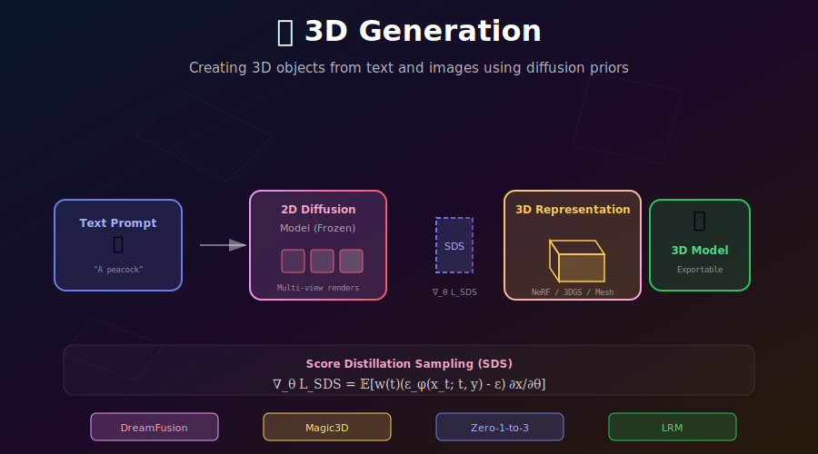

# 🎲 3D Generation

<div align="center">



*Creating 3D objects and scenes from text and images using diffusion priors*

[](#)
[](#)
[](#)

</div>

---

## 🎯 Where & Why: Real-World Applications

### Where is 3D Generation Used?

| Application | Models | Why 3D Generation? |
|-------------|--------|-------------------|
| 🎮 **Game Development** | DreamFusion, Magic3D | Rapid asset creation |
| 🎬 **Film & VFX** | Various | Quick 3D previsualization |
| 🛒 **E-commerce** | Zero-1-to-3, Wonder3D | Product 3D views |
| 🏠 **Architecture** | Text-to-Room | Interior visualization |
| 🤖 **Robotics** | Simulation | Training environment creation |
| 🎨 **Digital Art** | Various | 3D NFTs, virtual worlds |
| 📚 **Education** | Interactive | 3D educational models |
| 🏥 **Medical** | Specialized | Anatomical visualization |

### Why is 3D Generation Revolutionary?

| Traditional 3D Pipeline | With AI Generation |
|------------------------|-------------------|
| ❌ Requires skilled 3D artists | ✅ Text/image input |
| ❌ Days to weeks per asset | ✅ Minutes to hours |
| ❌ Expensive software | ✅ API or open source |
| ❌ Iterative manual refinement | ✅ Prompt-based editing |

> 💡 **The Magic:** Use powerful 2D diffusion models to create 3D content **without any 3D training data**!

---

## 📖 3D Representations

### Overview

| Representation | Rendering | Quality | Editability | Export |
|---------------|-----------|---------|-------------|--------|
| **NeRF** | Volume rendering | High | Hard | Limited |
| **3D Gaussians** | Splatting | High | Medium | Limited |
| **Mesh** | Rasterization | Variable | Easy | Standard |
| **Point Cloud** | Splatting | Low | Easy | Easy |
| **Triplane** | Feature planes | High | Medium | Custom |
| **SDF** | Sphere tracing | High | Hard | Marching cubes |

### Neural Radiance Fields (NeRF)

```python
class NeRF(nn.Module):
    """
    Neural Radiance Field: MLP that maps 3D position to color and density.
    """
    
    def __init__(self, hidden_dim=256, num_layers=8):
        super().__init__()
        
        # Positional encoding for high-frequency details
        self.pos_encoding = PositionalEncoding(L=10)  # 60-dim
        self.dir_encoding = PositionalEncoding(L=4)   # 24-dim
        
        # Main network: position → features
        self.layers = nn.ModuleList()
        in_dim = 60  # Encoded position
        for i in range(num_layers):
            self.layers.append(nn.Linear(in_dim, hidden_dim))
            in_dim = hidden_dim
            # Skip connection at layer 4
            if i == 4:
                in_dim = hidden_dim + 60
        
        # Output heads
        self.density_head = nn.Linear(hidden_dim, 1)
        self.feature_head = nn.Linear(hidden_dim, hidden_dim)
        self.color_head = nn.Linear(hidden_dim + 24, 3)  # +24 for direction
    
    def forward(self, positions, directions):
        """
        positions: [N, 3] - 3D coordinates
        directions: [N, 3] - viewing directions
        
        Returns: colors [N, 3], densities [N, 1]
        """
        # Encode inputs
        pos_enc = self.pos_encoding(positions)
        dir_enc = self.dir_encoding(directions)
        
        # Forward through network
        x = pos_enc
        for i, layer in enumerate(self.layers):
            x = F.relu(layer(x))
            if i == 4:
                x = torch.cat([x, pos_enc], dim=-1)
        
        # Density (view-independent)
        density = F.relu(self.density_head(x))
        
        # Color (view-dependent)
        features = self.feature_head(x)
        color_input = torch.cat([features, dir_enc], dim=-1)
        color = torch.sigmoid(self.color_head(color_input))
        
        return color, density
```

### 3D Gaussian Splatting

```python
class GaussianSplatting:
    """
    3D Gaussian Splatting: Represent scene as a set of 3D Gaussians.
    Much faster rendering than NeRF!
    """
    
    def __init__(self, num_gaussians=100000):
        # Learnable parameters per Gaussian
        self.positions = nn.Parameter(torch.randn(num_gaussians, 3))  # μ
        self.scales = nn.Parameter(torch.ones(num_gaussians, 3))      # σ
        self.rotations = nn.Parameter(torch.zeros(num_gaussians, 4))  # quaternion
        self.opacities = nn.Parameter(torch.zeros(num_gaussians, 1))
        self.colors = nn.Parameter(torch.randn(num_gaussians, 3))     # SH coeffs
    
    def render(self, camera):
        """Render view using differentiable splatting."""
        # Project 3D Gaussians to 2D
        projected = self.project_gaussians(camera)
        
        # Rasterize with alpha blending
        image = self.rasterize(projected, camera.resolution)
        
        return image
```

---

## 🧮 Score Distillation Sampling (SDS)

### The Core Innovation

**Problem:** We have great 2D diffusion models but want 3D outputs.

**Solution:** Use the 2D model's "knowledge" to guide 3D optimization!

### Mathematical Derivation

Start with the diffusion model's learned distribution \(p_\phi(x|y)\) for text \(y\).

We want our 3D representation \(\theta\) (e.g., NeRF) to produce renders \(x = g(\theta, c)\) for camera \(c\) that look like samples from \(p_\phi(x|y)\).

**KL Divergence objective:**
$$\min_\theta D_{KL}(q(x_0|\theta) || p_\phi(x_0|y))$$

**Gradient (simplified):**
$$\nabla_\theta \mathcal{L}_{SDS} = \mathbb{E}_{t, \epsilon, c}\left[w(t)\left(\hat{\epsilon}_\phi(x_t; t, y) - \epsilon\right) \frac{\partial g(\theta, c)}{\partial \theta}\right]$$

### Intuition

1. **Render** an image from the current 3D model
2. **Add noise** to the rendered image
3. **Ask diffusion model:** "What noise do you think was added?"
4. **Compare:** If diffusion model predicts different noise, the render doesn't match the text
5. **Update:** Push 3D parameters to reduce this difference

### Implementation

```python
class SDSLoss:
    """
    Score Distillation Sampling for text-to-3D optimization.
    """
    
    def __init__(self, diffusion_model, guidance_scale=100.0):
        self.diffusion = diffusion_model
        self.guidance_scale = guidance_scale
    
    def __call__(self, nerf, camera, prompt, t_range=(0.02, 0.98)):
        """
        Compute SDS loss and gradient.
        
        nerf: 3D representation to optimize
        camera: Camera parameters for rendering
        prompt: Text description
        """
        # Render current 3D model
        rendered = nerf.render(camera)  # [H, W, 3]
        rendered = rendered.permute(2, 0, 1).unsqueeze(0)  # [1, 3, H, W]
        
        # Sample timestep (avoid extremes)
        t = torch.randint(
            int(t_range[0] * 1000), 
            int(t_range[1] * 1000), 
            (1,)
        )
        
        # Add noise
        noise = torch.randn_like(rendered)
        alpha_t = self.diffusion.alpha(t)
        sigma_t = self.diffusion.sigma(t)
        x_t = alpha_t * rendered + sigma_t * noise
        
        # Get diffusion model prediction with CFG
        with torch.no_grad():
            # Unconditional prediction
            eps_uncond = self.diffusion(x_t, t, null_text_embed)
            # Conditional prediction
            eps_cond = self.diffusion(x_t, t, encode_text(prompt))
            
            # Classifier-free guidance
            eps_pred = eps_uncond + self.guidance_scale * (eps_cond - eps_uncond)
        
        # SDS gradient: predicted noise - actual noise
        grad = (eps_pred - noise)
        
        # Weighting (can use SNR-based weighting)
        w = (1 - alpha_t ** 2)  # Example weighting
        
        # Compute loss that gives correct gradient
        # We want: d(loss)/d(rendered) = w * grad
        # So: loss = w * (grad.detach() * rendered).sum()
        target = (rendered - w * grad).detach()
        loss = 0.5 * F.mse_loss(rendered, target)
        
        return loss
```

---

## 🔧 Complete Training Pipeline

### DreamFusion-style Pipeline

```python
class TextTo3DPipeline:
    """
    Complete text-to-3D pipeline using SDS.
    """
    
    def __init__(self, diffusion_model, representation='nerf'):
        self.diffusion = diffusion_model
        self.sds = SDSLoss(diffusion_model)
        
        if representation == 'nerf':
            self.model = NeRF()
        elif representation == '3dgs':
            self.model = GaussianSplatting()
        elif representation == 'dmtet':
            self.model = DMTet()  # Differentiable mesh
    
    def train(self, prompt, num_iterations=10000):
        optimizer = torch.optim.Adam(self.model.parameters(), lr=1e-3)
        
        for i in range(num_iterations):
            # Sample random camera pose
            camera = self.sample_camera()
            
            # Compute SDS loss
            loss = self.sds(self.model, camera, prompt)
            
            # Regularization losses
            loss += 0.01 * self.density_regularization()
            loss += 0.001 * self.normal_smoothness()
            
            # Optimization step
            optimizer.zero_grad()
            loss.backward()
            optimizer.step()
            
            # Logging
            if i % 100 == 0:
                self.log_progress(i, loss)
        
        return self.model
    
    def sample_camera(self):
        """Sample random camera on sphere looking at origin."""
        # Random spherical coordinates
        theta = torch.rand(1) * 2 * math.pi
        phi = torch.rand(1) * math.pi * 0.6 + math.pi * 0.2  # Avoid poles
        radius = 1.5 + torch.rand(1) * 0.5
        
        # Convert to Cartesian
        x = radius * torch.sin(phi) * torch.cos(theta)
        y = radius * torch.sin(phi) * torch.sin(theta)
        z = radius * torch.cos(phi)
        
        position = torch.stack([x, y, z]).squeeze()
        look_at = torch.zeros(3)
        
        return Camera(position, look_at)
```

---

## 🚀 Advanced Methods

### Magic3D: Coarse-to-Fine

Two-stage optimization for higher quality:

```python
class Magic3D:
    """
    Coarse-to-fine text-to-3D with mesh refinement.
    
    Stage 1: Low-res NeRF with SD 2.1 guidance
    Stage 2: High-res mesh with SD XL guidance
    """
    
    def train(self, prompt):
        # === Stage 1: Coarse NeRF ===
        nerf = NeRF(resolution=64)
        optimizer = torch.optim.Adam(nerf.parameters(), lr=1e-3)
        
        for i in range(5000):
            camera = self.sample_camera()
            rendered = nerf.render(camera, resolution=64)
            loss = self.sds_sd21(rendered, prompt)
            loss.backward()
            optimizer.step()
        
        # === Convert to mesh ===
        mesh = self.nerf_to_mesh(nerf, resolution=256)
        
        # === Stage 2: Fine mesh ===
        optimizer = torch.optim.Adam([mesh.vertices, mesh.textures], lr=1e-4)
        
        for i in range(5000):
            camera = self.sample_camera()
            rendered = self.render_mesh(mesh, camera, resolution=512)
            loss = self.sds_sdxl(rendered, prompt)  # Higher quality diffusion
            loss.backward()
            optimizer.step()
        
        return mesh
```

### Multi-View Diffusion: Zero-1-to-3

Generate consistent multi-view images, then reconstruct:

```python
class Zero1to3:
    """
    Image-conditioned novel view synthesis.
    Given one image, generate from any viewpoint.
    """
    
    def __init__(self, multiview_diffusion):
        self.diffusion = multiview_diffusion
    
    def generate_views(self, input_image, target_cameras):
        """Generate images from specified viewpoints."""
        views = []
        
        for camera in target_cameras:
            # Relative camera transformation
            R, T = camera.relative_to_canonical()
            
            # Generate novel view
            novel_view = self.diffusion(
                input_image,
                R=R, T=T
            )
            views.append(novel_view)
        
        return views
    
    def image_to_3d(self, input_image):
        """Full image-to-3D pipeline."""
        # Generate multiple views
        cameras = self.get_orbit_cameras(num_views=8)
        views = self.generate_views(input_image, cameras)
        
        # Reconstruct 3D from multi-view images
        mesh = self.reconstruct_3d(views, cameras)
        
        return mesh
```

### Feed-Forward: LRM

Direct prediction without optimization:

```python
class LRM:
    """
    Large Reconstruction Model: Single-image to 3D in one forward pass!
    
    No SDS optimization needed - direct prediction.
    """
    
    def __init__(self):
        self.encoder = DINOv2()  # Image encoder
        self.transformer = TriplaneTransformer()
        self.decoder = NeRFDecoder()
    
    def forward(self, image):
        """
        Predict 3D from single image in ~5 seconds.
        """
        # Encode image
        features = self.encoder(image)  # [1, N, D]
        
        # Predict triplane features
        triplane = self.transformer(features)  # [1, 3, C, H, W]
        
        # Can now render from any viewpoint
        return triplane
    
    def render(self, triplane, camera):
        """Render from predicted triplane."""
        rays = self.get_rays(camera)
        
        # Query triplane at ray positions
        features = self.query_triplane(triplane, rays)
        
        # Decode to color and density
        colors, densities = self.decoder(features)
        
        # Volume rendering
        image = self.volume_render(colors, densities, rays)
        
        return image
```

---

## 📊 Methods Comparison

| Method | Input | Speed | Quality | Output |
|--------|-------|-------|---------|--------|
| **DreamFusion** | Text | ~1 hour | ⭐⭐⭐ | NeRF |
| **Magic3D** | Text | ~40 min | ⭐⭐⭐⭐ | Mesh |
| **ProlificDreamer** | Text | ~2 hours | ⭐⭐⭐⭐⭐ | NeRF/Mesh |
| **Zero-1-to-3** | Image | ~2 min | ⭐⭐⭐⭐ | Multi-view |
| **LRM** | Image | ~5 sec | ⭐⭐⭐⭐ | Triplane |
| **Instant3D** | Text | ~20 sec | ⭐⭐⭐ | Triplane |

---

## ⚠️ Challenges & Limitations

### Common Issues

| Problem | Cause | Mitigation |
|---------|-------|------------|
| **Janus problem** | Multiple faces | View-dependent prompting |
| **Over-saturation** | High CFG | Lower guidance, VSD |
| **Floaters** | Density regularization | Prune low-opacity |
| **Blurry textures** | Low SDS resolution | Multi-resolution |
| **Slow optimization** | Many iterations | Feed-forward methods |

### The Janus Problem

Objects often grow multiple faces because the diffusion model expects frontal views:

```python
# Mitigation: View-dependent prompting
def get_view_prompt(base_prompt, camera):
    azimuth = camera.get_azimuth()
    
    if -45 < azimuth < 45:
        view = "front view"
    elif 45 < azimuth < 135:
        view = "side view"
    elif azimuth > 135 or azimuth < -135:
        view = "back view"
    else:
        view = "side view"
    
    return f"{base_prompt}, {view}"
```

---

## 📚 References

1. **Poole, B., et al.** (2023). "DreamFusion: Text-to-3D using 2D Diffusion." *ICLR*. [arXiv:2209.14988](https://arxiv.org/abs/2209.14988)

2. **Lin, C., et al.** (2023). "Magic3D: High-Resolution Text-to-3D Content Creation." *CVPR*.

3. **Liu, R., et al.** (2023). "Zero-1-to-3: Zero-shot One Image to 3D Object." *ICCV*. [arXiv:2303.11328](https://arxiv.org/abs/2303.11328)

4. **Hong, Y., et al.** (2023). "LRM: Large Reconstruction Model for Single Image to 3D." [arXiv:2311.04400](https://arxiv.org/abs/2311.04400)

5. **Wang, Z., et al.** (2023). "ProlificDreamer: High-Fidelity and Diverse Text-to-3D Generation with Variational Score Distillation." [arXiv:2305.16213](https://arxiv.org/abs/2305.16213)

---

## ✏️ Exercises

<details>
<summary><b>Exercise 1: Implement Basic SDS</b></summary>

Build a minimal SDS pipeline:
1. Use a 2D NeRF (2D image parameterization)
2. Optimize with SDS from Stable Diffusion
3. Generate 2D images from text
4. Understand the "mode-seeking" behavior

</details>

<details>
<summary><b>Exercise 2: 3D Gaussian Splatting</b></summary>

Implement basic 3DGS:
1. Initialize Gaussians from point cloud
2. Implement differentiable splatting
3. Train on multi-view images
4. Compare speed with NeRF

</details>

<details>
<summary><b>Exercise 3: Multi-View Consistency</b></summary>

Analyze multi-view generation:
1. Generate 8 views with Zero-1-to-3
2. Measure consistency (LPIPS between adjacent views)
3. Compare with MVDream-style methods
4. Identify failure modes

</details>

---

<div align="center">

**[← Video Generation](../06_generative_video_models/)** | **[Next: Open Research Problems →](../08_open_research_problems/)**

</div>
