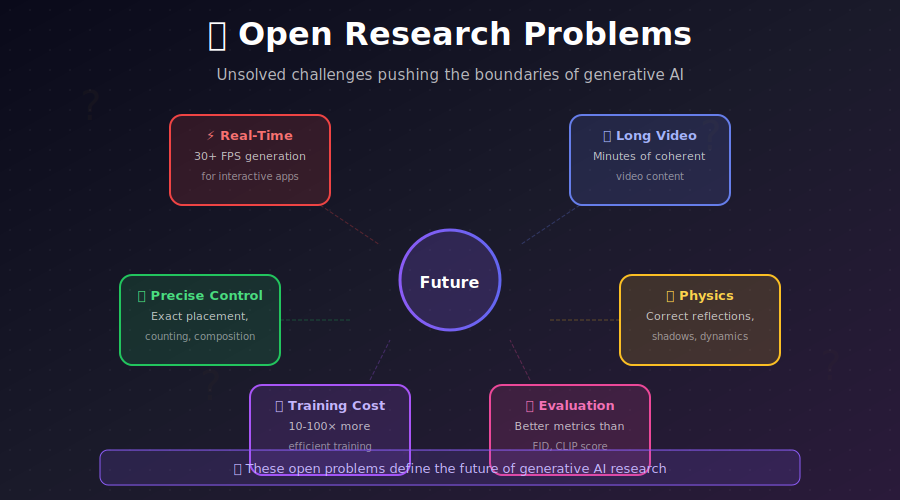

# 🔮 Open Research Problems

<div align="center">



*Unsolved challenges pushing the boundaries of generative AI*

[](#1-real-time-generation)
[](#2-long-form-video-generation)
[](#3-precise-controllability)

</div>

---

## 🎯 Why Study Open Problems?

Understanding open problems helps you:

| Benefit | Description |
|---------|-------------|
| 🎓 **Research Direction** | Identify impactful thesis/paper topics |
| 🛠️ **Practical Limitations** | Know when to expect limitations |
| 💼 **Career Positioning** | Skills for future job market |
| 🔮 **Technology Forecasting** | Predict where the field is heading |
| 🤝 **Collaboration** | Find problems that match your expertise |

---

## 1. ⚡ Real-Time Generation

### The Challenge

Current state-of-the-art models require **hundreds of milliseconds to seconds** per image. True real-time (30+ FPS) remains elusive for high-quality generation.

### Current State

| Method | Latency | Quality | Resolution |
|--------|---------|---------|------------|
| SDXL | ~8s | ⭐⭐⭐⭐⭐ | 1024² |
| SDXL Turbo (1 step) | ~200ms | ⭐⭐⭐⭐ | 512² |
| LCM-LoRA (4 steps) | ~800ms | ⭐⭐⭐⭐ | 1024² |
| **Target: Real-time** | **<33ms** | ⭐⭐⭐⭐ | 512²+ |

### Why It's Hard

```
Current bottleneck analysis:
┌─────────────────────────────────────────────────────────┐
│ U-Net forward pass: ~50-200ms (main bottleneck)         │
│ VAE decode: ~20-50ms                                     │
│ Text encoding: ~5-10ms                                   │
│ Scheduling overhead: ~1-2ms                              │
└─────────────────────────────────────────────────────────┘
Total: 76-262ms per step × N steps = too slow!
```

### Promising Directions

1. **Architecture innovations:**
   - Smaller, more efficient backbones
   - MobileNet-style designs for diffusion
   - Mixture of experts (route computation)

2. **Training innovations:**
   - Better single-step training
   - Curriculum learning for step reduction
   - Neural architecture search

3. **Hardware co-design:**
   - Custom kernels for diffusion
   - Quantization-aware training
   - Speculative decoding for diffusion

### Research Questions

- Can we achieve single-step generation with no quality loss?
- What's the fundamental speed-quality trade-off?
- Can hardware advances enable real-time generation?

---

## 2. 🎬 Long-Form Video Generation

### The Challenge

Current video models generate **5-60 seconds** at best. Creating **minutes to hours** of coherent video is unsolved.

### Current State

| Model | Max Duration | Coherence | Resolution |
|-------|-------------|-----------|------------|
| SVD | ~4s | High | 1024×576 |
| Sora | ~60s | High | 1080p |
| Kling | ~2min | Medium | 1080p |
| **Target** | **10+ min** | High | 1080p+ |

### Why It's Hard

```
Challenges scale with duration:
┌──────────────────────────────────────────────────────────┐
│ Duration  │ Frames (30fps) │ Memory │ Coherence          │
│ 4 sec     │ 120            │ ~8GB   │ High               │
│ 1 min     │ 1,800          │ ~120GB │ Medium             │
│ 10 min    │ 18,000         │ ~1.2TB │ Very hard          │
│ 1 hour    │ 108,000        │ ~7TB   │ Currently impossible│
└──────────────────────────────────────────────────────────┘
```

### Promising Directions

1. **Hierarchical generation:**
   ```
   Story outline → Scene descriptions → Keyframes → Full video
   ```

2. **Autoregressive with context:**
   - Generate chunks conditioned on previous
   - Learn long-range dependencies
   - Efficient context compression

3. **World models:**
   - Learn physics and causality
   - Plan then render
   - Compositional generation

### Research Questions

- How do we maintain character consistency over minutes?
- Can we learn narrative structure?
- How to handle scene transitions naturally?

---

## 3. 🎯 Precise Controllability

### The Challenge

Current models struggle with **exact** specifications:
- Count exactly 5 apples
- Place object at specific (x, y) coordinates
- Follow complex multi-object arrangements

### Current State

| Control Type | Difficulty | Current Methods |
|-------------|-----------|-----------------|
| Style transfer | ✅ Easy | LoRA, IP-Adapter |
| Pose control | ✅ Easy | ControlNet |
| Exact counting | ❌ Hard | Training tricks |
| Precise layout | ⚠️ Medium | GLIGEN, BoxDiff |
| Attribute binding | ❌ Hard | Attention manipulation |
| Negation | ❌ Very hard | Limited solutions |

### Example Failures

```
Prompt: "A red cube to the left of a blue sphere"
Common failures:
- Red sphere, blue cube (attribute swap)
- Both objects the same color
- Wrong spatial relationship
- Objects merged together
```

### Promising Directions

1. **Compositional architectures:**
   - Separate object representations
   - Explicit slot attention
   - Scene graphs as intermediate

2. **Training innovations:**
   - Counting-aware losses
   - Layout supervision
   - Negative mining

3. **Inference techniques:**
   - Attention editing
   - Iterative refinement
   - Verification loops

### Research Questions

- Can we achieve 100% accuracy on counting?
- How to handle negation ("no cars in the scene")?
- Can we separate objects in latent space?

---

## 4. 🌍 Physical Realism

### The Challenge

Generated content often violates physical laws:
- Impossible reflections
- Wrong shadows
- Hands with wrong finger counts
- Objects floating/interpenetrating

### Current State

| Physical Property | Accuracy | Notes |
|------------------|----------|-------|
| Lighting direction | Medium | Often inconsistent |
| Reflections | Low | Frequently wrong |
| Shadows | Medium | Can be absent |
| Human hands | Low | Infamous failure mode |
| Object physics | Low | Floating, intersecting |
| Material properties | Medium | Texture over physics |

### Why It's Hard

Diffusion models learn **statistical patterns**, not physics:
- Training data has physical correlations
- But no explicit physics simulation
- Distribution matching ≠ physics understanding

### Promising Directions

1. **Physics-aware training:**
   - Synthetic data with known physics
   - Physics simulation in the loop
   - Differentiable rendering

2. **Architecture changes:**
   - 3D-aware generators
   - Explicit lighting modules
   - Geometry reasoning

3. **Hybrid approaches:**
   - Generate + physics refinement
   - Neural physics simulators
   - Compositional generation

### Research Questions

- Can we inject physics priors without hurting creativity?
- How to handle physics for novel concepts?
- Can we learn physics from video?

---

## 5. 💰 Training Efficiency

### The Challenge

State-of-the-art models require **enormous compute**:

| Model | Training Compute | Cost Estimate |
|-------|-----------------|---------------|
| SD 1.5 | ~6,000 A100-hours | ~$150K |
| SDXL | ~25,000 A100-hours | ~$625K |
| SD3 | Unknown (larger) | ~$1M+ |
| Sora | Unknown | ~$10M+ (speculated) |

### Why It Matters

```
Barrier to entry:
┌─────────────────────────────────────────────────────────┐
│ Who can train SOTA models?                              │
│ ✓ Large companies (OpenAI, Google, Meta, Stability)     │
│ ✓ Well-funded startups                                  │
│ ✗ Academic labs (mostly)                                │
│ ✗ Individual researchers                                │
│ ✗ Most organizations                                    │
└─────────────────────────────────────────────────────────┘
```

### Promising Directions

1. **Data efficiency:**
   - Better data curation
   - Curriculum learning
   - Active learning for diffusion

2. **Architectural efficiency:**
   - Sparse transformers
   - Mixture of experts
   - Progressive growing

3. **Training innovations:**
   - Better optimizers
   - Smarter noise schedules
   - Pre-training / fine-tuning paradigms

4. **Hardware utilization:**
   - Better parallelization
   - Mixed precision training
   - Memory-efficient attention

### Research Questions

- Can we achieve SD-quality with 10× less compute?
- What's the optimal data/compute ratio?
- Can we predict final quality from early training?

---

## 6. 📊 Evaluation Metrics

### The Challenge

Current metrics don't capture what humans care about:

| Metric | What it Measures | Limitations |
|--------|-----------------|-------------|
| FID | Distribution match | Ignores individual quality |
| CLIP Score | Text alignment | Semantic, not perceptual |
| LPIPS | Perceptual similarity | Needs reference |
| Human eval | Everything | Expensive, slow |

### The Gap

```
Metric vs Reality:
┌──────────────────────────────────────────────────────────┐
│ FID can prefer:                                          │
│ - Blurry images (if training data is blurry)             │
│ - Incorrect images (if text is ignored)                  │
│ - Mode collapse (if modes match)                         │
│                                                          │
│ CLIP Score can prefer:                                   │
│ - Text rendering (it can read)                           │
│ - Stock photo style (CLIP training data)                 │
│ - Semantically correct but ugly images                   │
└──────────────────────────────────────────────────────────┘
```

### Promising Directions

1. **Better automated metrics:**
   - Multi-aspect scoring
   - Compositional evaluation
   - Controllability benchmarks

2. **Efficient human evaluation:**
   - Standardized protocols
   - Crowdsourcing best practices
   - AI-assisted evaluation

3. **Task-specific metrics:**
   - Editing fidelity
   - Style consistency
   - Controllability accuracy

### Research Questions

- Can we build a single metric that correlates with human preference?
- How to evaluate creative/artistic quality?
- How to benchmark controllability systematically?

---

## 7. 🔒 Safety & Ethics

### The Challenge

Generative AI raises serious concerns:

| Issue | Current State | Needed |
|-------|--------------|--------|
| Deepfakes | Detection lags creation | Better forensics |
| Copyright | Unclear legal status | Technical + legal solutions |
| Bias | Present in training data | Fair representation |
| Misuse | NSFW filters exist | More robust safeguards |
| Attribution | Difficult to verify | Watermarking standards |

### Promising Directions

1. **Detection:**
   - Robust watermarking
   - Statistical fingerprinting
   - Provenance tracking

2. **Prevention:**
   - Better content filtering
   - Concept removal techniques
   - Red-teaming and auditing

3. **Governance:**
   - Industry standards
   - Regulatory frameworks
   - Ethical guidelines

### Research Questions

- Can we make undetectable content detectable?
- How to balance safety with capability?
- Can we ensure consent for training data?

---

## 📈 Research Trends 2024-2025

### What's Hot Now

| Direction | Activity | Potential Impact |
|-----------|----------|-----------------|
| Flow matching | 🔥🔥🔥🔥🔥 | New training paradigm |
| Video generation | 🔥🔥🔥🔥🔥 | Massive commercial interest |
| Efficient inference | 🔥🔥🔥🔥 | Practical deployment |
| 3D generation | 🔥🔥🔥 | Gaming, VR, AR |
| Multimodal | 🔥🔥🔥🔥 | Unified models |
| Safety/alignment | 🔥🔥🔥 | Regulatory pressure |

### Predictions

1. **2024-2025:**
   - Real-time image generation becomes practical
   - Video reaches 1-2 minutes
   - 3D becomes feed-forward

2. **2025-2027:**
   - Video reaches 10+ minutes
   - Unified image/video/3D models
   - On-device generation common

3. **2027+:**
   - Hour-long coherent video
   - Physics-aware generation
   - Truly interactive generation

---

## 🎓 How to Contribute

### For Researchers

1. **Reproduce papers:** Verify claims, find edge cases
2. **Ablation studies:** What really matters?
3. **New benchmarks:** Better evaluation
4. **Theoretical analysis:** Why do things work?

### For Engineers

1. **Optimize inference:** Every millisecond counts
2. **Build tools:** Make research accessible
3. **Find failure modes:** Stress test models
4. **Document best practices:** Share knowledge

### For Everyone

1. **Open source:** Share code and models
2. **Write tutorials:** Lower barriers to entry
3. **Collaborate:** Interdisciplinary work
4. **Engage ethically:** Consider impact

---

## 📚 Key Resources

### Papers & Surveys
- arXiv cs.CV, cs.LG (daily updates)
- OpenReview (conference submissions)
- Google Scholar alerts

### Code & Models
- Hugging Face Hub
- GitHub Trending
- Papers with Code

### Community
- Twitter/X ML community
- Discord servers (Eleuther, LAION)
- Reddit r/MachineLearning

### Conferences
- NeurIPS, ICML, ICLR (ML)
- CVPR, ICCV, ECCV (Vision)
- SIGGRAPH (Graphics)

---

## ✏️ Exercises

<details>
<summary><b>Exercise 1: Problem Analysis</b></summary>

Pick one open problem:
1. Survey the last 20 papers addressing it
2. Categorize approaches
3. Identify common failure modes
4. Propose a novel angle

</details>

<details>
<summary><b>Exercise 2: Benchmark Creation</b></summary>

Design a benchmark for one challenge:
1. Define success criteria
2. Create test cases
3. Implement automatic evaluation
4. Test on existing methods

</details>

<details>
<summary><b>Exercise 3: Proof of Concept</b></summary>

Implement a minimal solution:
1. Pick one specific sub-problem
2. Build a prototype (can be simple)
3. Evaluate honestly
4. Document learnings

</details>

---

---

<div align="center">

**[← 3D Generation](../07_3d_generation/)** | **[Back to Advanced Research →](../)**

</div>
