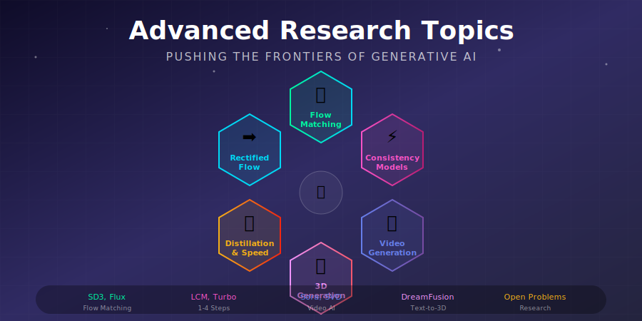
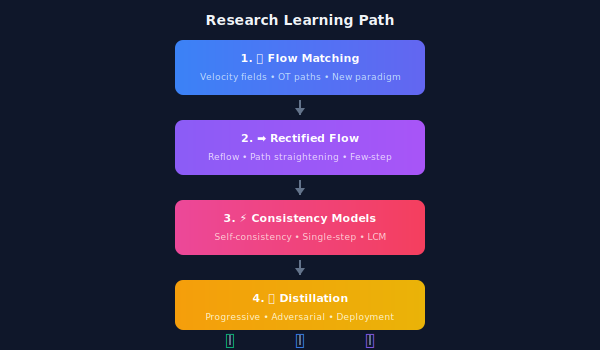

# 🔬 Advanced Research Topics in Generative AI

<div align="center">



*Cutting-edge developments pushing the boundaries of generative AI*

[](#-flow-matching)
[](#-consistency-models)
[](#-video-generation)

</div>

---

## 🎯 What's Inside This Module?

This module explores the **cutting-edge research frontiers** in generative AI, covering breakthroughs that are shaping the next generation of models like **Stable Diffusion 3**, **Sora**, and **SDXL Turbo**.

### Who Should Read This?

| Audience | What You'll Gain |
|----------|------------------|
| 🎓 **ML Researchers** | Deep mathematical foundations, derivations, and intuitions |
| 🛠️ **Practitioners** | Practical insights for choosing the right approach |
| 🚀 **Engineers** | Implementation patterns and deployment strategies |
| 📚 **Students** | Comprehensive learning path from basics to frontier |

---

## 📚 Topics Overview

<table>
<tr>
<th width="8%">#</th>
<th width="25%">Topic</th>
<th width="40%">Key Concepts</th>
<th width="27%">Real-World Models</th>
</tr>
<tr>
<td align="center">🌊</td>
<td><b><a href="./01_flow_matching/">Flow Matching</a></b></td>
<td>Optimal transport paths, velocity fields, simulation-free training</td>
<td>SD3, Flux, VoiceFlow</td>
</tr>
<tr>
<td align="center">➡️</td>
<td><b><a href="./02_rectified_flow/">Rectified Flow</a></b></td>
<td>Straight trajectories, reflow algorithm, OT coupling</td>
<td>InstaFlow, SD3-Turbo</td>
</tr>
<tr>
<td align="center">⚡</td>
<td><b><a href="./03_consistency_models/">Consistency Models</a></b></td>
<td>Single-step generation, self-consistency, distillation</td>
<td>LCM, SDXL-Lightning</td>
</tr>
<tr>
<td align="center">📚</td>
<td><b><a href="./04_diffusion_distillation/">Diffusion Distillation</a></b></td>
<td>Progressive compression, adversarial training, SDS</td>
<td>SDXL Turbo, SD Turbo</td>
</tr>
<tr>
<td align="center">🔀</td>
<td><b><a href="./05_diffusion_vs_flows/">Diffusion vs Flows</a></b></td>
<td>Unified perspectives, probability flow ODE, hybrid methods</td>
<td>Theoretical foundation</td>
</tr>
<tr>
<td align="center">🎬</td>
<td><b><a href="./06_generative_video_models/">Video Generation</a></b></td>
<td>Temporal modeling, 3D attention, coherence</td>
<td>Sora, SVD, Runway Gen-3</td>
</tr>
<tr>
<td align="center">🎲</td>
<td><b><a href="./07_3d_generation/">3D Generation</a></b></td>
<td>NeRF, SDS loss, multi-view diffusion</td>
<td>DreamFusion, Magic3D, LRM</td>
</tr>
<tr>
<td align="center">🔮</td>
<td><b><a href="./08_open_research_problems/">Open Problems</a></b></td>
<td>Future directions, unsolved challenges</td>
<td>Research frontiers</td>
</tr>
</table>

---

## 🌊 Flow Matching — The New Paradigm

> *"Why take curved paths when straight lines are faster?"*

Flow Matching is revolutionizing generative modeling by replacing the curved, stochastic paths of diffusion with **straight-line optimal transport**.

### The Core Mathematics

Instead of learning to predict noise \(\epsilon\), we learn a **velocity field** \(v_\theta\) that transports samples along straight paths:

$$x_t = (1-t)x_0 + tx_1$$

where \(x_0 \sim \mathcal{N}(0, I)\) (noise) and \(x_1 \sim p_{\text{data}}\) (data).

### Training Objective

$$\mathcal{L}_{\text{FM}} = \mathbb{E}_{t \sim U[0,1], x_0, x_1}\left[\|v_\theta(x_t, t) - (x_1 - x_0)\|^2\right]$$

This is simply **MSE regression** on the velocity direction!

### Why It Matters

| Aspect | Diffusion (DDPM) | Flow Matching |
|--------|------------------|---------------|
| **Path shape** | Curved (SDE) | Straight (ODE) |
| **Training target** | Noise prediction | Velocity prediction |
| **Typical steps** | 20-50 | 4-10 |
| **ODE solving** | Required | Not needed for training |

📖 **[Deep Dive: Flow Matching →](./01_flow_matching/)**

---

## ⚡ Few-Step Generation

The holy grail of generative AI: **high-quality images in 1-4 steps**.

### Consistency Models

Learn a function that maps **any point** on the diffusion trajectory directly to clean data:

$$f_\theta(x_t, t) = f_\theta(x_{t'}, t') = x_0 \quad \forall\ t, t' \text{ on same trajectory}$$

**Result:** 1-step generation with quality approaching multi-step diffusion!

### Distillation Approaches

| Method | Steps | Quality | Training |
|--------|-------|---------|----------|
| Progressive Distillation | 4-8 | ⭐⭐⭐⭐ | Teacher required |
| Adversarial Distillation | 1-4 | ⭐⭐⭐⭐⭐ | GAN + Teacher |
| Consistency Distillation | 1-4 | ⭐⭐⭐⭐ | Teacher required |
| Consistency Training | 1-4 | ⭐⭐⭐⭐ | From scratch |

📖 **[Deep Dive: Consistency Models →](./03_consistency_models/)**  
📖 **[Deep Dive: Distillation →](./04_diffusion_distillation/)**

---

## 🎬 Video & 3D Generation

### Video: Temporal Diffusion

Extending 2D diffusion to video requires handling the **temporal dimension**:

```
Video Tensor: [B, T, C, H, W]
              │  │  │  │  └─ Width
              │  │  │  └──── Height  
              │  │  └─────── Channels (RGB/Latent)
              │  └────────── Time (frames)
              └───────────── Batch
```

**Key architectures:**
- 3D U-Net (spatial + temporal convolutions)
- Factorized attention (spatial-then-temporal)
- DiT with spacetime patches (Sora-style)

### 3D: Score Distillation Sampling

Use a 2D diffusion model to optimize a 3D representation:

$$\nabla_\theta \mathcal{L}_{\text{SDS}} = \mathbb{E}_{t, \epsilon}\left[w(t)(\epsilon_\phi(x_t; t, y) - \epsilon) \frac{\partial x}{\partial \theta}\right]$$

This allows creating 3D objects **without 3D training data**!

📖 **[Deep Dive: Video Generation →](./06_generative_video_models/)**  
📖 **[Deep Dive: 3D Generation →](./07_3d_generation/)**

---

## 📊 Research Landscape 2024-2025

### Current Focus Areas

| Area | Activity Level | Key Breakthroughs |
|------|---------------|-------------------|
| 🌊 **Flow Matching** | 🔥🔥🔥🔥🔥 | SD3, Flux, state-of-the-art |
| 🎬 **Video Generation** | 🔥🔥🔥🔥🔥 | Sora, unprecedented quality |
| ⚡ **Few-Step Methods** | 🔥🔥🔥🔥 | LCM, production-ready |
| 🎲 **3D Generation** | 🔥🔥🔥 | Feed-forward methods emerging |
| 🎵 **Audio/Music** | 🔥🔥🔥 | MusicGen, Stable Audio |
| 🌐 **Multimodal** | 🔥🔥🔥🔥 | Unified generation |

### What's Next?

1. **Real-time generation** (30+ FPS)
2. **Long-form video** (minutes, not seconds)
3. **Physical understanding** (world models)
4. **Unified multimodal** (any-to-any generation)

📖 **[Deep Dive: Open Problems →](./08_open_research_problems/)**

---

## 📚 Key References

### Flow Matching & Rectified Flow
1. **Lipman et al.** (2023). "Flow Matching for Generative Modeling." *ICLR*. [arXiv:2210.02747](https://arxiv.org/abs/2210.02747)
2. **Liu et al.** (2023). "Flow Straight and Fast: Rectified Flow." *ICLR*. [arXiv:2209.03003](https://arxiv.org/abs/2209.03003)

### Consistency & Distillation
3. **Song et al.** (2023). "Consistency Models." *ICML*. [arXiv:2303.01469](https://arxiv.org/abs/2303.01469)
4. **Sauer et al.** (2023). "Adversarial Diffusion Distillation." [arXiv:2311.17042](https://arxiv.org/abs/2311.17042)

### Video & 3D
5. **Brooks et al.** (2024). "Sora: Video Generation as World Simulators." OpenAI.
6. **Poole et al.** (2023). "DreamFusion: Text-to-3D using 2D Diffusion." *ICLR*. [arXiv:2209.14988](https://arxiv.org/abs/2209.14988)

---

## ✏️ Exercises & Projects

<details>
<summary><b>🌊 Exercise 1: Implement Flow Matching</b></summary>

Train a flow matching model on 2D toy data (Swiss Roll, Two Moons):
1. Implement the linear interpolation path
2. Train the velocity network
3. Visualize learned vector fields
4. Compare Euler vs Heun sampling

</details>

<details>
<summary><b>⚡ Exercise 2: Compare Sampling Methods</b></summary>

On the same trained model, compare:
- DDPM (1000 steps)
- DDIM (50 steps)
- Flow matching (10 steps)
- Consistency model (1-4 steps)

Measure FID and generation time.

</details>

<details>
<summary><b>🎲 Exercise 3: Derive SDS Gradient</b></summary>

Starting from the KL divergence between rendered distribution and diffusion prior:
1. Show how SDS gradient emerges
2. Explain the "mode-seeking" behavior
3. Discuss the "over-saturation" problem

</details>

<details>
<summary><b>🔮 Project: Propose a Solution</b></summary>

Pick one open research problem and:
1. Survey existing approaches
2. Identify limitations
3. Propose a novel solution
4. Implement a proof-of-concept

</details>

---

## 🗺️ Learning Path



---

<div align="center">

**Start Your Journey:** [🌊 Flow Matching →](./01_flow_matching/)

*Explore the paradigm powering Stable Diffusion 3 and Flux*

---

Made with ❤️ for the GenAI community

</div>
