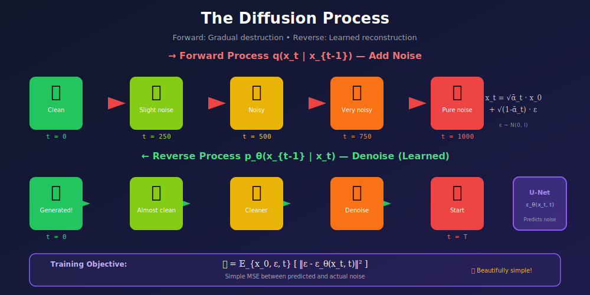
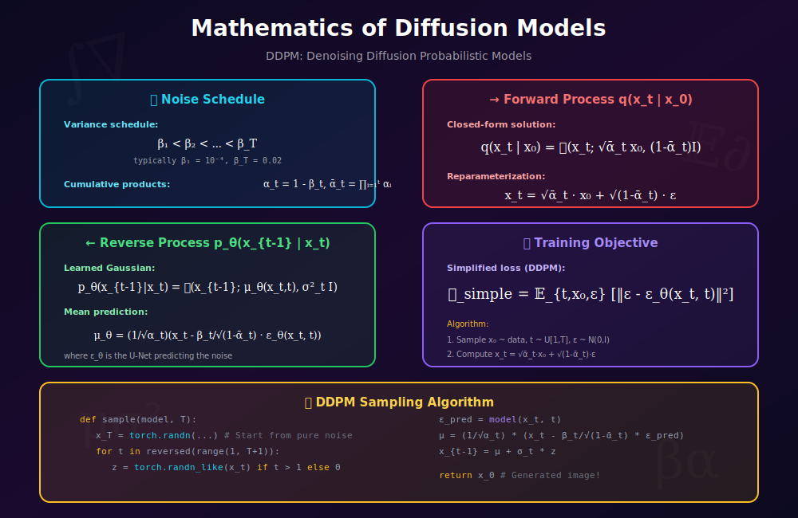
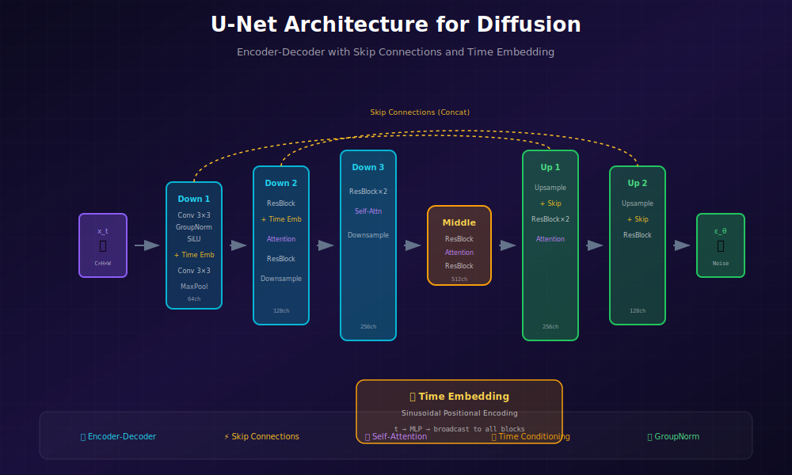

# 🛠️ Project: Diffusion Model from Scratch

<div align="center">


*Master the denoising diffusion paradigm that powers modern AI image generation*

[](#)
[](#)
[](#)

</div>

---

## 🎯 Where & Why: Learning Objectives

### Why Build a Diffusion Model from Scratch?

| What You'll Learn | Why It Matters |
|-------------------|----------------|
| 🔄 **Forward/Reverse processes** | Foundation for Stable Diffusion, DALL-E 3, Midjourney |
| 📊 **Noise scheduling** | Critical hyperparameter affecting quality |
| 🏗️ **U-Net architecture** | Most common denoiser architecture |
| ⏱️ **Time embedding** | How models learn timestep-dependent denoising |
| 🎲 **DDPM/DDIM sampling** | Different speed-quality tradeoffs |

### Real-World Applications

After completing this project, you'll understand the core technology behind:
- ✅ **Stable Diffusion** — The open-source image generation model
- ✅ **DALL-E 2/3** — OpenAI's text-to-image systems
- ✅ **Midjourney** — Professional AI art generation
- ✅ **Video diffusion** — Runway, Pika Labs
- ✅ **Audio generation** — AudioLDM, MusicGen

---

## 📖 The Big Picture



### What Makes Diffusion Special?

Unlike GANs (adversarial training) or VAEs (reconstruction), diffusion models learn to **gradually denoise** images:

1. **Forward Process**: Systematically destroy an image by adding noise over T steps
2. **Reverse Process**: Learn to undo each step, recovering the image from pure noise

> 💡 **Key Insight**: By breaking generation into many small denoising steps, each step becomes an easier learning problem than generating an entire image at once.

---

## 🧮 Mathematical Foundation



### The Noise Schedule

The diffusion process is controlled by a **variance schedule** \(\{\beta_t\}_{t=1}^T\):

$$\beta_1 < \beta_2 < \cdots < \beta_T$$

**Common choices:**
- **Linear**: \(\beta_t = \beta_1 + \frac{t-1}{T-1}(\beta_T - \beta_1)\)
- **Cosine** (better for low-res): \(\bar{\alpha}_t = \frac{f(t)}{f(0)}\) where \(f(t) = \cos\left(\frac{t/T + s}{1+s} \cdot \frac{\pi}{2}\right)^2\)

**Derived quantities:**
$$\alpha_t = 1 - \beta_t, \quad \bar{\alpha}_t = \prod_{i=1}^{t} \alpha_i$$

### Forward Process (Adding Noise)

The forward process \(q(x_t | x_0)\) adds Gaussian noise progressively:

$$q(x_t | x_{t-1}) = \mathcal{N}(x_t; \sqrt{1-\beta_t}\, x_{t-1}, \beta_t \mathbf{I})$$

**The Magic Formula** — We can sample any timestep directly:

$$\boxed{x_t = \sqrt{\bar{\alpha}_t}\, x_0 + \sqrt{1-\bar{\alpha}_t}\, \epsilon, \quad \epsilon \sim \mathcal{N}(0, \mathbf{I})}$$

**Intuition:**
- \(\sqrt{\bar{\alpha}_t}\) controls how much original signal remains
- \(\sqrt{1-\bar{\alpha}_t}\) controls the noise level
- As \(t \to T\), \(\bar{\alpha}_T \approx 0\), so \(x_T \approx \epsilon\) (pure noise)

### Reverse Process (Denoising)

The reverse process \(p_\theta(x_{t-1} | x_t)\) learns to denoise:

$$p_\theta(x_{t-1} | x_t) = \mathcal{N}(x_{t-1}; \mu_\theta(x_t, t), \sigma_t^2 \mathbf{I})$$

**Mean prediction** (after simplification):

$$\mu_\theta(x_t, t) = \frac{1}{\sqrt{\alpha_t}} \left( x_t - \frac{\beta_t}{\sqrt{1-\bar{\alpha}_t}} \epsilon_\theta(x_t, t) \right)$$

Where \(\epsilon_\theta\) is our neural network predicting the noise.

### Training Objective

The simplified DDPM loss is elegantly simple:

$$\boxed{\mathcal{L}_{\text{simple}} = \mathbb{E}_{x_0, \epsilon, t} \left[ \| \epsilon - \epsilon_\theta(x_t, t) \|^2 \right]}$$

**Algorithm:**
1. Sample \(x_0\) from data, \(t \sim \text{Uniform}[1, T]\), \(\epsilon \sim \mathcal{N}(0, \mathbf{I})\)
2. Compute \(x_t = \sqrt{\bar{\alpha}_t}\, x_0 + \sqrt{1-\bar{\alpha}_t}\, \epsilon\)
3. Predict \(\hat{\epsilon} = \epsilon_\theta(x_t, t)\)
4. Loss = MSE\((\epsilon, \hat{\epsilon})\)

---

## 🏗️ Architecture Guide



### The U-Net Denoiser

```python
import torch
import torch.nn as nn
import torch.nn.functional as F
import math

class SinusoidalPositionEmbeddings(nn.Module):
    """Encodes timestep into a vector using sinusoidal frequencies."""
    def __init__(self, dim):
        super().__init__()
        self.dim = dim

    def forward(self, time):
        device = time.device
        half_dim = self.dim // 2
        embeddings = math.log(10000) / (half_dim - 1)
        embeddings = torch.exp(torch.arange(half_dim, device=device) * -embeddings)
        embeddings = time[:, None] * embeddings[None, :]
        return torch.cat((embeddings.sin(), embeddings.cos()), dim=-1)


class ResidualBlock(nn.Module):
    """Residual block with time embedding injection."""
    def __init__(self, in_channels, out_channels, time_emb_dim):
        super().__init__()
        self.time_mlp = nn.Linear(time_emb_dim, out_channels)
        
        self.block1 = nn.Sequential(
            nn.GroupNorm(8, in_channels),
            nn.SiLU(),
            nn.Conv2d(in_channels, out_channels, 3, padding=1)
        )
        self.block2 = nn.Sequential(
            nn.GroupNorm(8, out_channels),
            nn.SiLU(),
            nn.Conv2d(out_channels, out_channels, 3, padding=1)
        )
        
        self.residual_conv = nn.Conv2d(in_channels, out_channels, 1) \
            if in_channels != out_channels else nn.Identity()
    
    def forward(self, x, t_emb):
        h = self.block1(x)
        # Add time embedding
        h = h + self.time_mlp(t_emb)[:, :, None, None]
        h = self.block2(h)
        return h + self.residual_conv(x)


class SimpleUNet(nn.Module):
    """Simplified U-Net for diffusion models."""
    def __init__(self, in_channels=1, base_dim=64, time_emb_dim=256):
        super().__init__()
        
        # Time embedding
        self.time_mlp = nn.Sequential(
            SinusoidalPositionEmbeddings(time_emb_dim),
            nn.Linear(time_emb_dim, time_emb_dim),
            nn.SiLU(),
            nn.Linear(time_emb_dim, time_emb_dim)
        )
        
        # Encoder (downsampling)
        self.enc1 = ResidualBlock(in_channels, base_dim, time_emb_dim)
        self.down1 = nn.Conv2d(base_dim, base_dim, 4, 2, 1)  # /2
        
        self.enc2 = ResidualBlock(base_dim, base_dim * 2, time_emb_dim)
        self.down2 = nn.Conv2d(base_dim * 2, base_dim * 2, 4, 2, 1)  # /4
        
        self.enc3 = ResidualBlock(base_dim * 2, base_dim * 4, time_emb_dim)
        self.down3 = nn.Conv2d(base_dim * 4, base_dim * 4, 4, 2, 1)  # /8
        
        # Bottleneck
        self.bottleneck = ResidualBlock(base_dim * 4, base_dim * 4, time_emb_dim)
        
        # Decoder (upsampling)
        self.up3 = nn.ConvTranspose2d(base_dim * 4, base_dim * 4, 4, 2, 1)
        self.dec3 = ResidualBlock(base_dim * 8, base_dim * 2, time_emb_dim)  # Skip connection
        
        self.up2 = nn.ConvTranspose2d(base_dim * 2, base_dim * 2, 4, 2, 1)
        self.dec2 = ResidualBlock(base_dim * 4, base_dim, time_emb_dim)
        
        self.up1 = nn.ConvTranspose2d(base_dim, base_dim, 4, 2, 1)
        self.dec1 = ResidualBlock(base_dim * 2, base_dim, time_emb_dim)
        
        # Output
        self.out = nn.Sequential(
            nn.GroupNorm(8, base_dim),
            nn.SiLU(),
            nn.Conv2d(base_dim, in_channels, 3, padding=1)
        )
    
    def forward(self, x, t):
        t_emb = self.time_mlp(t)
        
        # Encoder with skip connections
        e1 = self.enc1(x, t_emb)
        e2 = self.enc2(self.down1(e1), t_emb)
        e3 = self.enc3(self.down2(e2), t_emb)
        
        # Bottleneck
        b = self.bottleneck(self.down3(e3), t_emb)
        
        # Decoder with skip connections
        d3 = self.dec3(torch.cat([self.up3(b), e3], dim=1), t_emb)
        d2 = self.dec2(torch.cat([self.up2(d3), e2], dim=1), t_emb)
        d1 = self.dec1(torch.cat([self.up1(d2), e1], dim=1), t_emb)
        
        return self.out(d1)
```

---

## 🔧 Diffusion Pipeline

### Noise Schedule Implementation

```python
class DiffusionSchedule:
    """Manages the noise schedule and provides utilities."""
    def __init__(self, timesteps=1000, beta_start=1e-4, beta_end=0.02, schedule='linear'):
        self.timesteps = timesteps
        
        if schedule == 'linear':
            self.betas = torch.linspace(beta_start, beta_end, timesteps)
        elif schedule == 'cosine':
            self.betas = self._cosine_schedule(timesteps)
        
        self.alphas = 1.0 - self.betas
        self.alpha_bars = torch.cumprod(self.alphas, dim=0)
        self.alpha_bars_prev = F.pad(self.alpha_bars[:-1], (1, 0), value=1.0)
        
        # Pre-compute useful quantities
        self.sqrt_alpha_bars = torch.sqrt(self.alpha_bars)
        self.sqrt_one_minus_alpha_bars = torch.sqrt(1.0 - self.alpha_bars)
        self.sqrt_recip_alphas = torch.sqrt(1.0 / self.alphas)
        
        # For posterior q(x_{t-1} | x_t, x_0)
        self.posterior_variance = self.betas * (1.0 - self.alpha_bars_prev) / (1.0 - self.alpha_bars)
    
    def _cosine_schedule(self, timesteps, s=0.008):
        steps = timesteps + 1
        x = torch.linspace(0, timesteps, steps)
        alphas_cumprod = torch.cos(((x / timesteps) + s) / (1 + s) * torch.pi * 0.5) ** 2
        alphas_cumprod = alphas_cumprod / alphas_cumprod[0]
        betas = 1 - (alphas_cumprod[1:] / alphas_cumprod[:-1])
        return torch.clip(betas, 0.0001, 0.9999)
    
    def q_sample(self, x_0, t, noise=None):
        """Forward diffusion: sample x_t given x_0."""
        if noise is None:
            noise = torch.randn_like(x_0)
        
        sqrt_alpha_bar = self.sqrt_alpha_bars[t][:, None, None, None]
        sqrt_one_minus = self.sqrt_one_minus_alpha_bars[t][:, None, None, None]
        
        return sqrt_alpha_bar * x_0 + sqrt_one_minus * noise
```

### Training Loop

```python
def train_diffusion(model, dataloader, schedule, epochs=100, lr=1e-4):
    device = torch.device('cuda' if torch.cuda.is_available() else 'cpu')
    model = model.to(device)
    optimizer = torch.optim.AdamW(model.parameters(), lr=lr)
    
    # Move schedule tensors to device
    schedule_device = lambda t: t.to(device)
    
    for epoch in range(epochs):
        total_loss = 0
        for images, _ in dataloader:
            images = images.to(device)
            batch_size = images.size(0)
            
            # Sample random timesteps
            t = torch.randint(0, schedule.timesteps, (batch_size,), device=device)
            
            # Sample noise
            noise = torch.randn_like(images)
            
            # Forward diffusion: add noise
            x_t = schedule.q_sample(images, t.cpu(), noise)
            x_t = x_t.to(device)
            
            # Predict the noise
            noise_pred = model(x_t, t)
            
            # Simple MSE loss
            loss = F.mse_loss(noise_pred, noise)
            
            optimizer.zero_grad()
            loss.backward()
            torch.nn.utils.clip_grad_norm_(model.parameters(), 1.0)
            optimizer.step()
            
            total_loss += loss.item()
        
        avg_loss = total_loss / len(dataloader)
        print(f"Epoch {epoch+1}/{epochs}, Loss: {avg_loss:.4f}")
```

### DDPM Sampling

```python
@torch.no_grad()
def ddpm_sample(model, schedule, shape, device):
    """Sample using DDPM (stochastic)."""
    model.eval()
    
    # Start from pure noise
    x = torch.randn(shape, device=device)
    
    for t in reversed(range(schedule.timesteps)):
        t_batch = torch.full((shape[0],), t, device=device, dtype=torch.long)
        
        # Predict noise
        noise_pred = model(x, t_batch)
        
        # Compute mean
        alpha_t = schedule.alphas[t]
        alpha_bar_t = schedule.alpha_bars[t]
        beta_t = schedule.betas[t]
        
        mean = (1 / alpha_t.sqrt()) * (
            x - (beta_t / (1 - alpha_bar_t).sqrt()) * noise_pred
        )
        
        # Add noise (except at t=0)
        if t > 0:
            variance = schedule.posterior_variance[t]
            noise = torch.randn_like(x)
            x = mean + variance.sqrt() * noise
        else:
            x = mean
    
    return x
```

### DDIM Sampling (Faster!)

```python
@torch.no_grad()
def ddim_sample(model, schedule, shape, device, num_steps=50, eta=0.0):
    """Sample using DDIM (deterministic when eta=0)."""
    model.eval()
    
    # Create timestep sequence (subset of [0, T])
    step_size = schedule.timesteps // num_steps
    timesteps = list(range(0, schedule.timesteps, step_size))[::-1]
    
    x = torch.randn(shape, device=device)
    
    for i, t in enumerate(timesteps):
        t_batch = torch.full((shape[0],), t, device=device, dtype=torch.long)
        
        # Predict noise
        noise_pred = model(x, t_batch)
        
        alpha_bar_t = schedule.alpha_bars[t]
        
        # Previous timestep
        t_prev = timesteps[i + 1] if i + 1 < len(timesteps) else 0
        alpha_bar_t_prev = schedule.alpha_bars[t_prev]
        
        # DDIM update
        pred_x0 = (x - (1 - alpha_bar_t).sqrt() * noise_pred) / alpha_bar_t.sqrt()
        
        sigma = eta * ((1 - alpha_bar_t_prev) / (1 - alpha_bar_t) * (1 - alpha_bar_t / alpha_bar_t_prev)).sqrt()
        
        x = alpha_bar_t_prev.sqrt() * pred_x0 + \
            (1 - alpha_bar_t_prev - sigma**2).sqrt() * noise_pred + \
            sigma * torch.randn_like(x) if eta > 0 else 0
    
    return x
```

---

## 📊 Experiments

### MNIST Training

```python
from torchvision import datasets, transforms
from torch.utils.data import DataLoader

# Dataset
transform = transforms.Compose([
    transforms.ToTensor(),
    transforms.Normalize((0.5,), (0.5,))  # Scale to [-1, 1]
])

train_dataset = datasets.MNIST('./data', train=True, download=True, transform=transform)
train_loader = DataLoader(train_dataset, batch_size=128, shuffle=True, num_workers=4)

# Initialize
model = SimpleUNet(in_channels=1, base_dim=64, time_emb_dim=256)
schedule = DiffusionSchedule(timesteps=1000, schedule='cosine')

# Train
train_diffusion(model, train_loader, schedule, epochs=50)

# Generate samples
samples = ddpm_sample(model, schedule, shape=(16, 1, 28, 28), device='cuda')
```

---

## 🐛 Common Issues & Solutions

| Issue | Symptom | Solution |
|-------|---------|----------|
| **Blurry samples** | Low detail | More training, larger model |
| **Mode collapse** | Same outputs | Check data preprocessing |
| **NaN loss** | Loss explodes | Gradient clipping, lower LR |
| **Checkerboard** | Grid patterns | Use bilinear upsampling |
| **Slow convergence** | Loss stuck | Cosine schedule, warmup |

---

## ✅ Milestones Checklist

- [ ] **Noise schedule** — Linear and cosine implemented
- [ ] **Forward process** — Can destroy images over T steps
- [ ] **U-Net** — Time-conditioned denoiser working
- [ ] **DDPM sampling** — 1000-step generation
- [ ] **DDIM sampling** — 50-step fast generation
- [ ] **MNIST training** — Recognizable digits
- [ ] **FID evaluation** — Compare sample quality

---

## 📚 References

1. **Ho, J., et al.** (2020). "Denoising Diffusion Probabilistic Models." *NeurIPS*. [arXiv:2006.11239](https://arxiv.org/abs/2006.11239)

2. **Song, J., et al.** (2021). "Denoising Diffusion Implicit Models." *ICLR*. [arXiv:2010.02502](https://arxiv.org/abs/2010.02502)

3. **Nichol, A., Dhariwal, P.** (2021). "Improved Denoising Diffusion Probabilistic Models." *ICML*. [arXiv:2102.09672](https://arxiv.org/abs/2102.09672)

---

<div align="center">

**[← GAN from Scratch](../01_gan_from_scratch/)** | **[Next: Latent Diffusion Mini →](../03_latent_diffusion_mini/)**

</div>
