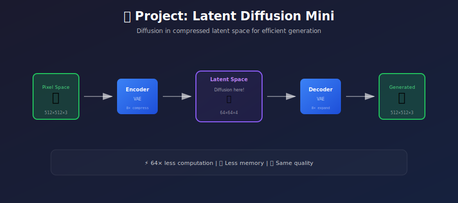
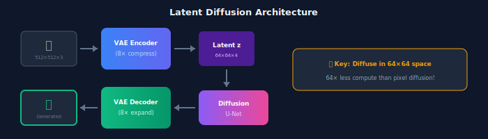
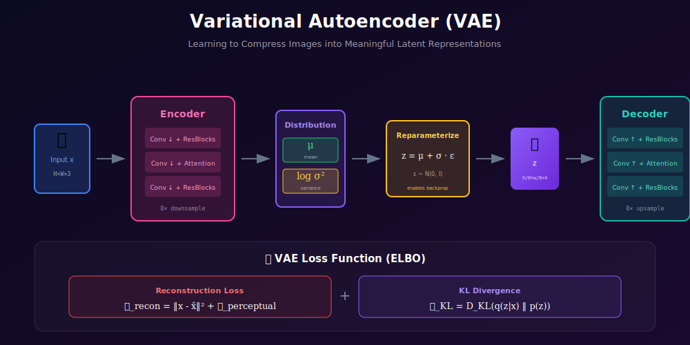

# 🛠️ Project: Latent Diffusion Mini

<div align="center">



*Build a miniature Stable Diffusion: VAE + Latent Space Diffusion*

[](#)
[](#)
[](#)

</div>

---

## 🎯 Where & Why: Learning Objectives

### Why Build Latent Diffusion from Scratch?

| What You'll Learn | Why It Matters |
|-------------------|----------------|
| 📦 **VAE compression** | Foundation of Stable Diffusion's efficiency |
| 💎 **Latent space** | Where the magic happens (48× smaller!) |
| 🔗 **Two-stage training** | Decouple perception from generation |
| ⚡ **Efficiency gains** | Generate 512×512 images on consumer GPUs |
| 🎨 **Perceptual loss** | Better reconstructions than MSE alone |

### Real-World Impact

Latent diffusion is **the** architecture behind:
- ✅ **Stable Diffusion 1.x/2.x/XL** — The most popular open model
- ✅ **DALL-E 2** — OpenAI's image generation (uses CLIP latents)
- ✅ **Midjourney** — Commercial art generation
- ✅ **Runway Gen-2** — Video generation
- ✅ **Control techniques** — ControlNet, IP-Adapter, LoRA

> 💡 **Why Latent?** Running diffusion in pixel space for 512×512 images requires processing 786,432 values. In latent space (64×64×4), that's only 16,384 values — **48× reduction!**

---

## 📖 The Architecture


### The Three Components



---

## 🧮 Mathematical Foundation

### VAE: The Compression Engine



#### The Variational Objective (ELBO)

$$\log p(x) \geq \mathbb{E}_{q(z|x)}[\log p(x|z)] - D_{KL}(q(z|x) \| p(z))$$

**In practice:**

$$\mathcal{L}_{VAE} = \underbrace{\|x - \hat{x}\|^2}_{\text{Reconstruction}} + \underbrace{\mathcal{L}_{perceptual}}_{\text{LPIPS}} + \underbrace{\beta \cdot D_{KL}}_{\text{Regularization}}$$

#### The Reparameterization Trick

To backpropagate through sampling:

$$z = \mu + \sigma \odot \epsilon, \quad \epsilon \sim \mathcal{N}(0, I)$$

This makes the random sampling deterministic given \(\epsilon\), allowing gradients to flow.

### Latent Scaling Factor

Stable Diffusion uses a specific scaling:

$$z = \text{Encoder}(x) \times 0.18215$$

**Why?** This normalizes the latent variance to approximately 1, matching the Gaussian prior used in diffusion.

### Latent Diffusion Process

The diffusion happens entirely in latent space:

$$z_t = \sqrt{\bar{\alpha}_t}\, z_0 + \sqrt{1-\bar{\alpha}_t}\, \epsilon$$

Training objective:

$$\mathcal{L}_{LDM} = \mathbb{E}_{z_0, \epsilon, t} \left[ \| \epsilon - \epsilon_\theta(z_t, t) \|^2 \right]$$

---

## 🏗️ Implementation

### Step 1: VAE Autoencoder

```python
import torch
import torch.nn as nn
import torch.nn.functional as F

class Encoder(nn.Module):
    """Compresses images to latent space."""
    def __init__(self, in_channels=3, latent_channels=4, base_channels=64):
        super().__init__()
        
        # Initial conv
        self.conv_in = nn.Conv2d(in_channels, base_channels, 3, padding=1)
        
        # Downsampling blocks: 512 -> 256 -> 128 -> 64
        self.down1 = self._make_down_block(base_channels, base_channels * 2)
        self.down2 = self._make_down_block(base_channels * 2, base_channels * 4)
        self.down3 = self._make_down_block(base_channels * 4, base_channels * 4)
        
        # Middle blocks
        self.mid = nn.Sequential(
            ResBlock(base_channels * 4),
            SelfAttention(base_channels * 4),
            ResBlock(base_channels * 4)
        )
        
        # Output to μ and log(σ²)
        self.conv_out = nn.Conv2d(base_channels * 4, latent_channels * 2, 3, padding=1)
    
    def _make_down_block(self, in_ch, out_ch):
        return nn.Sequential(
            ResBlock(in_ch, out_ch),
            ResBlock(out_ch),
            nn.Conv2d(out_ch, out_ch, 4, stride=2, padding=1)  # Downsample
        )
    
    def forward(self, x):
        h = self.conv_in(x)
        h = self.down1(h)
        h = self.down2(h)
        h = self.down3(h)
        h = self.mid(h)
        h = self.conv_out(h)
        
        # Split into mean and log variance
        mean, logvar = torch.chunk(h, 2, dim=1)
        return mean, logvar


class Decoder(nn.Module):
    """Reconstructs images from latent space."""
    def __init__(self, out_channels=3, latent_channels=4, base_channels=64):
        super().__init__()
        
        self.conv_in = nn.Conv2d(latent_channels, base_channels * 4, 3, padding=1)
        
        self.mid = nn.Sequential(
            ResBlock(base_channels * 4),
            SelfAttention(base_channels * 4),
            ResBlock(base_channels * 4)
        )
        
        # Upsampling blocks: 64 -> 128 -> 256 -> 512
        self.up1 = self._make_up_block(base_channels * 4, base_channels * 4)
        self.up2 = self._make_up_block(base_channels * 4, base_channels * 2)
        self.up3 = self._make_up_block(base_channels * 2, base_channels)
        
        self.conv_out = nn.Sequential(
            nn.GroupNorm(8, base_channels),
            nn.SiLU(),
            nn.Conv2d(base_channels, out_channels, 3, padding=1)
        )
    
    def _make_up_block(self, in_ch, out_ch):
        return nn.Sequential(
            nn.Upsample(scale_factor=2, mode='nearest'),
            nn.Conv2d(in_ch, out_ch, 3, padding=1),
            ResBlock(out_ch),
            ResBlock(out_ch)
        )
    
    def forward(self, z):
        h = self.conv_in(z)
        h = self.mid(h)
        h = self.up1(h)
        h = self.up2(h)
        h = self.up3(h)
        return self.conv_out(h)


class VAE(nn.Module):
    """Full VAE with reparameterization."""
    def __init__(self, in_channels=3, latent_channels=4):
        super().__init__()
        self.encoder = Encoder(in_channels, latent_channels)
        self.decoder = Decoder(in_channels, latent_channels)
        self.scale_factor = 0.18215
    
    def encode(self, x):
        mean, logvar = self.encoder(x)
        # Reparameterization
        std = torch.exp(0.5 * logvar)
        eps = torch.randn_like(std)
        z = mean + eps * std
        return z * self.scale_factor, mean, logvar
    
    def decode(self, z):
        return self.decoder(z / self.scale_factor)
    
    def forward(self, x):
        z, mean, logvar = self.encode(x)
        recon = self.decode(z)
        return recon, mean, logvar
```

### Step 2: VAE Training with Perceptual Loss

```python
import lpips

class VAELoss(nn.Module):
    """Combined VAE loss with perceptual component."""
    def __init__(self, kl_weight=1e-6, perceptual_weight=1.0):
        super().__init__()
        self.kl_weight = kl_weight
        self.perceptual_weight = perceptual_weight
        self.lpips = lpips.LPIPS(net='vgg').eval()
    
    def forward(self, recon, target, mean, logvar):
        # Reconstruction loss (L1 often works better than L2)
        recon_loss = F.l1_loss(recon, target)
        
        # Perceptual loss (LPIPS)
        perceptual_loss = self.lpips(recon, target).mean()
        
        # KL divergence
        kl_loss = -0.5 * torch.mean(1 + logvar - mean.pow(2) - logvar.exp())
        
        total = recon_loss + \
                self.perceptual_weight * perceptual_loss + \
                self.kl_weight * kl_loss
        
        return total, {
            'recon': recon_loss.item(),
            'perceptual': perceptual_loss.item(),
            'kl': kl_loss.item()
        }


def train_vae(vae, dataloader, epochs=50, lr=1e-4):
    device = torch.device('cuda' if torch.cuda.is_available() else 'cpu')
    vae = vae.to(device)
    optimizer = torch.optim.AdamW(vae.parameters(), lr=lr)
    criterion = VAELoss()
    
    for epoch in range(epochs):
        total_loss = 0
        for images, _ in dataloader:
            images = images.to(device)
            
            recon, mean, logvar = vae(images)
            loss, metrics = criterion(recon, images, mean, logvar)
            
            optimizer.zero_grad()
            loss.backward()
            optimizer.step()
            
            total_loss += loss.item()
        
        print(f"Epoch {epoch+1}: Loss={total_loss/len(dataloader):.4f}")
```

### Step 3: Latent Diffusion Model

```python
class LatentDiffusion:
    """Combines VAE with diffusion in latent space."""
    def __init__(self, vae, unet, schedule):
        self.vae = vae
        self.unet = unet
        self.schedule = schedule
    
    def encode(self, images):
        """Encode images to latents (with gradient)."""
        with torch.no_grad():
            z, _, _ = self.vae.encode(images)
        return z
    
    def decode(self, latents):
        """Decode latents to images."""
        with torch.no_grad():
            return self.vae.decode(latents)
    
    def training_step(self, images):
        """One training step for the diffusion model."""
        # Encode to latent
        z = self.encode(images)
        
        # Sample timesteps
        t = torch.randint(0, self.schedule.timesteps, (z.size(0),), device=z.device)
        
        # Add noise
        noise = torch.randn_like(z)
        z_t = self.schedule.q_sample(z, t, noise)
        
        # Predict noise
        noise_pred = self.unet(z_t, t)
        
        # Loss
        return F.mse_loss(noise_pred, noise)
    
    @torch.no_grad()
    def generate(self, batch_size, steps=50, device='cuda'):
        """Generate images from noise."""
        # Start from random latents
        latents = torch.randn(batch_size, 4, 64, 64, device=device)
        
        # Denoise
        for t in reversed(range(0, self.schedule.timesteps, self.schedule.timesteps // steps)):
            t_batch = torch.full((batch_size,), t, device=device, dtype=torch.long)
            
            noise_pred = self.unet(latents, t_batch)
            latents = self.schedule.ddim_step(latents, noise_pred, t)
        
        # Decode to images
        images = self.decode(latents)
        return images
```

---

## 📊 Efficiency Comparison

| Aspect | Pixel Diffusion | Latent Diffusion |
|--------|----------------|------------------|
| **Resolution** | 512×512×3 | 64×64×4 |
| **Values** | 786,432 | 16,384 |
| **Compression** | 1× | **48×** |
| **Memory** | ~24GB | ~8GB |
| **Speed** | ~60s/image | ~5s/image |

---

## ✅ Milestones Checklist

- [ ] **VAE encoder** — Compresses to 8× smaller
- [ ] **VAE decoder** — Reconstructs with high fidelity
- [ ] **Perceptual loss** — LPIPS implemented
- [ ] **VAE training** — PSNR > 25dB on test set
- [ ] **Latent diffusion** — U-Net on 64×64 latents
- [ ] **End-to-end** — Generate coherent images

---

## 🐛 Common Issues

| Issue | Symptom | Solution |
|-------|---------|----------|
| **Blurry VAE** | Poor reconstruction | Add perceptual loss |
| **Posterior collapse** | KL → 0 | KL warmup, lower KL weight |
| **Latent mismatch** | Generated images wrong | Check scaling factor |
| **Mode dropping** | Missing diversity | Higher KL weight |

---

## 📚 References

1. **Rombach, R., et al.** (2022). "High-Resolution Image Synthesis with Latent Diffusion Models." *CVPR*. [arXiv:2112.10752](https://arxiv.org/abs/2112.10752)

2. **Esser, P., et al.** (2021). "Taming Transformers for High-Resolution Image Synthesis." *CVPR*. [arXiv:2012.09841](https://arxiv.org/abs/2012.09841)

---

<div align="center">

**[← Diffusion from Scratch](../02_diffusion_from_scratch/)** | **[Next: Text-to-Image Mini →](../04_text_to_image_mini/)**

</div>
