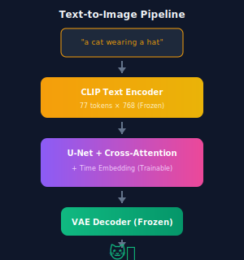
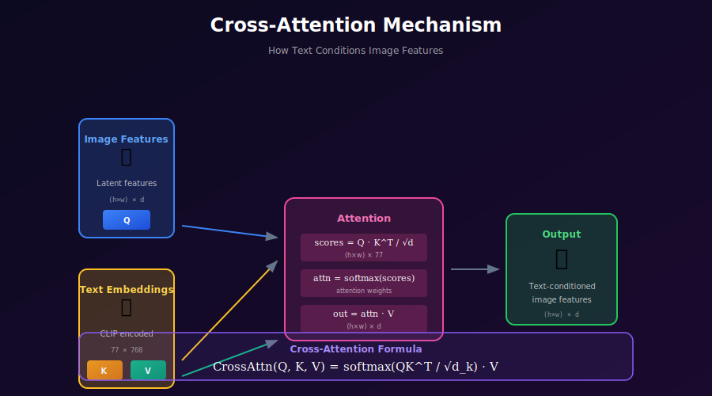

# 🛠️ Project: Text-to-Image Mini

<div align="center">


*Build a miniature text-to-image system with CLIP and cross-attention*

[](#)
[](#)
[](#)

</div>

---

## 🎯 Where & Why: Learning Objectives

### Why Build Text-to-Image from Scratch?

| What You'll Learn | Why It Matters |
|-------------------|----------------|
| 📝 **CLIP text encoding** | The bridge between language and vision |
| 🎯 **Cross-attention** | How text guides image generation |
| 🎛️ **Classifier-free guidance** | Control generation quality vs diversity |
| 🔧 **Conditioning mechanisms** | Generalizes to any conditioning type |
| 🎨 **Prompt engineering** | Why some prompts work better |

### Industry Applications

Text-to-image is the foundation for:
- ✅ **Creative tools** — Midjourney, DALL-E, Stable Diffusion
- ✅ **Design automation** — Marketing materials, product mockups
- ✅ **Gaming/Entertainment** — Asset generation, concept art
- ✅ **E-commerce** — Product visualization
- ✅ **Personalization** — Custom avatars, NFTs

---

## 📖 The Architecture


### The Complete Pipeline



---

## 🧮 Mathematical Foundation

### Cross-Attention: The Key Mechanism



Cross-attention allows image features to "attend" to relevant text tokens:

$$\text{CrossAttn}(Q, K, V) = \text{softmax}\left(\frac{QK^T}{\sqrt{d_k}}\right) \cdot V$$

Where:
- **Q (Query)**: Derived from image features \(Q = W_Q \cdot h_{image}\)
- **K (Key)**: Derived from text embeddings \(K = W_K \cdot h_{text}\)
- **V (Value)**: Derived from text embeddings \(V = W_V \cdot h_{text}\)

**Intuition:** Each spatial location in the image "asks" which words are relevant, then incorporates that information.

### Classifier-Free Guidance (CFG)

The magic sauce for high-quality generation:

$$\tilde{\epsilon}_\theta = \epsilon_\theta(z_t, t, \varnothing) + w \cdot \left( \epsilon_\theta(z_t, t, c) - \epsilon_\theta(z_t, t, \varnothing) \right)$$

Where:
- \(c\) = text conditioning
- \(\varnothing\) = unconditional (empty text)
- \(w\) = guidance scale (typically 7.5)

**Simplified:**
$$\tilde{\epsilon} = \epsilon_{uncond} + w \cdot (\epsilon_{cond} - \epsilon_{uncond})$$

**Effect of guidance scale:**
| Scale (w) | Effect |
|-----------|--------|
| 1.0 | Pure conditional (diverse but may ignore prompt) |
| 3-5 | Balanced quality and diversity |
| 7-8 | Strong text adherence (default) |
| 10+ | Over-saturated, artifacts |

### Training with CFG Dropout

```python
# During training, randomly drop the conditioning
if random.random() < cfg_dropout_prob:  # e.g., 0.1
    text_embedding = empty_embedding  # Learn unconditional
else:
    text_embedding = clip_encode(caption)
```

---

## 🏗️ Implementation

### Step 1: CLIP Text Encoder (Frozen)

```python
import torch
import clip

class CLIPTextEncoder:
    """Wraps CLIP for text encoding."""
    def __init__(self, model_name="ViT-B/32", device="cuda"):
        self.device = device
        self.model, _ = clip.load(model_name, device=device)
        self.model.eval()
        
        # Freeze all parameters
        for param in self.model.parameters():
            param.requires_grad = False
    
    @torch.no_grad()
    def encode(self, texts):
        """Encode text to CLIP embeddings."""
        tokens = clip.tokenize(texts, truncate=True).to(self.device)
        
        # Get last hidden states (not just CLS token)
        # This requires modifying CLIP slightly or using transformers library
        text_features = self.model.encode_text(tokens)
        
        return text_features  # Shape: (batch, 512 or 768)
    
    def get_empty_embedding(self, batch_size):
        """Get embedding for empty/null text."""
        return self.encode([""] * batch_size)
```

### Step 2: Cross-Attention Layer

```python
class CrossAttention(nn.Module):
    """Cross-attention between image features and text."""
    def __init__(self, query_dim, context_dim, heads=8, dim_head=64):
        super().__init__()
        inner_dim = dim_head * heads
        
        self.heads = heads
        self.scale = dim_head ** -0.5
        
        self.to_q = nn.Linear(query_dim, inner_dim, bias=False)
        self.to_k = nn.Linear(context_dim, inner_dim, bias=False)
        self.to_v = nn.Linear(context_dim, inner_dim, bias=False)
        self.to_out = nn.Linear(inner_dim, query_dim)
        
        self.norm = nn.LayerNorm(query_dim)
    
    def forward(self, x, context):
        """
        Args:
            x: Image features (B, H*W, C)
            context: Text embeddings (B, seq_len, context_dim)
        """
        h = self.heads
        
        # Normalize input
        x = self.norm(x)
        
        # Project to Q, K, V
        q = self.to_q(x)
        k = self.to_k(context)
        v = self.to_v(context)
        
        # Reshape for multi-head attention
        # (B, N, inner_dim) -> (B, heads, N, dim_head)
        q = q.view(q.size(0), q.size(1), h, -1).transpose(1, 2)
        k = k.view(k.size(0), k.size(1), h, -1).transpose(1, 2)
        v = v.view(v.size(0), v.size(1), h, -1).transpose(1, 2)
        
        # Attention
        attn = torch.matmul(q, k.transpose(-2, -1)) * self.scale
        attn = attn.softmax(dim=-1)
        
        # Apply attention to values
        out = torch.matmul(attn, v)
        
        # Reshape back
        out = out.transpose(1, 2).contiguous().view(out.size(0), -1, h * v.size(-1))
        
        return self.to_out(out)


class TransformerBlock(nn.Module):
    """Transformer block with self-attention and cross-attention."""
    def __init__(self, dim, context_dim, heads=8):
        super().__init__()
        
        # Self-attention (spatial)
        self.self_attn = nn.MultiheadAttention(dim, heads, batch_first=True)
        self.self_norm = nn.LayerNorm(dim)
        
        # Cross-attention (text conditioning)
        self.cross_attn = CrossAttention(dim, context_dim, heads)
        self.cross_norm = nn.LayerNorm(dim)
        
        # Feed-forward
        self.ff = nn.Sequential(
            nn.LayerNorm(dim),
            nn.Linear(dim, dim * 4),
            nn.GELU(),
            nn.Linear(dim * 4, dim)
        )
    
    def forward(self, x, context):
        # Self-attention
        x_norm = self.self_norm(x)
        x = x + self.self_attn(x_norm, x_norm, x_norm)[0]
        
        # Cross-attention with text
        x = x + self.cross_attn(x, context)
        
        # Feed-forward
        x = x + self.ff(x)
        
        return x
```

### Step 3: Text-Conditioned U-Net

```python
class TextConditionedUNet(nn.Module):
    """U-Net with text conditioning via cross-attention."""
    def __init__(self, in_channels=4, base_dim=320, context_dim=768, time_dim=320):
        super().__init__()
        
        # Time embedding
        self.time_embed = nn.Sequential(
            SinusoidalEmbedding(time_dim),
            nn.Linear(time_dim, time_dim * 4),
            nn.SiLU(),
            nn.Linear(time_dim * 4, time_dim)
        )
        
        # Input projection
        self.conv_in = nn.Conv2d(in_channels, base_dim, 3, padding=1)
        
        # Encoder with cross-attention at each level
        self.enc_blocks = nn.ModuleList([
            ResBlockWithAttention(base_dim, base_dim, time_dim, context_dim),
            DownBlock(base_dim, base_dim * 2),
            ResBlockWithAttention(base_dim * 2, base_dim * 2, time_dim, context_dim),
            DownBlock(base_dim * 2, base_dim * 4),
            ResBlockWithAttention(base_dim * 4, base_dim * 4, time_dim, context_dim),
        ])
        
        # Middle
        self.mid = ResBlockWithAttention(base_dim * 4, base_dim * 4, time_dim, context_dim)
        
        # Decoder with skip connections
        self.dec_blocks = nn.ModuleList([
            ResBlockWithAttention(base_dim * 8, base_dim * 4, time_dim, context_dim),
            UpBlock(base_dim * 4, base_dim * 2),
            ResBlockWithAttention(base_dim * 4, base_dim * 2, time_dim, context_dim),
            UpBlock(base_dim * 2, base_dim),
            ResBlockWithAttention(base_dim * 2, base_dim, time_dim, context_dim),
        ])
        
        # Output
        self.conv_out = nn.Sequential(
            nn.GroupNorm(32, base_dim),
            nn.SiLU(),
            nn.Conv2d(base_dim, in_channels, 3, padding=1)
        )
    
    def forward(self, x, t, context):
        """
        Args:
            x: Noisy latent (B, 4, H, W)
            t: Timesteps (B,)
            context: Text embeddings (B, seq_len, context_dim)
        """
        # Time embedding
        t_emb = self.time_embed(t)
        
        # Initial conv
        h = self.conv_in(x)
        
        # Encoder
        skips = []
        for block in self.enc_blocks:
            if isinstance(block, DownBlock):
                h = block(h)
            else:
                h = block(h, t_emb, context)
                skips.append(h)
        
        # Middle
        h = self.mid(h, t_emb, context)
        
        # Decoder
        for block in self.dec_blocks:
            if isinstance(block, UpBlock):
                h = block(h)
            else:
                h = torch.cat([h, skips.pop()], dim=1)
                h = block(h, t_emb, context)
        
        return self.conv_out(h)
```

### Step 4: Training with CFG

```python
def train_step(model, images, captions, text_encoder, schedule, cfg_dropout=0.1):
    """One training step with classifier-free guidance dropout."""
    device = images.device
    batch_size = images.size(0)
    
    # Encode text
    with torch.no_grad():
        text_emb = text_encoder.encode(captions)
        empty_emb = text_encoder.get_empty_embedding(batch_size)
    
    # CFG dropout: randomly replace with empty embedding
    mask = torch.rand(batch_size, device=device) < cfg_dropout
    text_emb[mask] = empty_emb[mask]
    
    # Sample timesteps
    t = torch.randint(0, schedule.timesteps, (batch_size,), device=device)
    
    # Add noise
    noise = torch.randn_like(images)
    noisy = schedule.q_sample(images, t, noise)
    
    # Predict noise
    noise_pred = model(noisy, t, text_emb)
    
    return F.mse_loss(noise_pred, noise)
```

### Step 5: Inference with CFG

```python
@torch.no_grad()
def generate(model, text_encoder, schedule, prompt, 
             guidance_scale=7.5, num_steps=50, device='cuda'):
    """Generate image from text prompt."""
    
    # Encode text
    text_emb = text_encoder.encode([prompt])
    empty_emb = text_encoder.get_empty_embedding(1)
    
    # Start from noise
    latent = torch.randn(1, 4, 64, 64, device=device)
    
    # Timesteps for sampling
    timesteps = torch.linspace(schedule.timesteps - 1, 0, num_steps, dtype=torch.long)
    
    for t in timesteps:
        t_batch = t.unsqueeze(0).to(device)
        
        # Predict noise - conditional and unconditional
        noise_cond = model(latent, t_batch, text_emb)
        noise_uncond = model(latent, t_batch, empty_emb)
        
        # Classifier-free guidance
        noise_pred = noise_uncond + guidance_scale * (noise_cond - noise_uncond)
        
        # DDIM step
        latent = schedule.ddim_step(latent, noise_pred, t.item())
    
    # Decode to image
    image = vae.decode(latent)
    
    return image
```

---

## 🎨 Demo Interface

```python
import gradio as gr

def generate_image(prompt, guidance_scale, steps):
    image = generate(
        model, text_encoder, schedule,
        prompt=prompt,
        guidance_scale=guidance_scale,
        num_steps=steps
    )
    # Convert to PIL
    image = (image[0].permute(1, 2, 0).cpu().numpy() + 1) / 2
    return image

demo = gr.Interface(
    fn=generate_image,
    inputs=[
        gr.Textbox(label="Prompt", placeholder="A cat wearing a top hat"),
        gr.Slider(1, 20, value=7.5, label="Guidance Scale"),
        gr.Slider(10, 100, value=50, step=10, label="Steps")
    ],
    outputs=gr.Image(label="Generated Image"),
    title="Text-to-Image Mini",
    description="Generate images from text descriptions"
)

demo.launch()
```

---

## 📊 Dataset Recommendations

| Dataset | Size | Domain | Difficulty |
|---------|------|--------|------------|
| Pokemon BLIP | ~800 | Sprites | Easy |
| Oxford Flowers | ~8K | Flowers | Medium |
| CUB Birds | ~12K | Birds | Medium |
| COCO (subset) | ~50K | General | Hard |

---

## ✅ Milestones Checklist

- [ ] **CLIP encoder** — Load and freeze pretrained model
- [ ] **Cross-attention** — Implement and test
- [ ] **U-Net integration** — Add cross-attention to each level
- [ ] **CFG training** — Implement dropout mechanism
- [ ] **CFG inference** — Guided sampling working
- [ ] **Demo** — Gradio interface running
- [ ] **Quality check** — Generated images match prompts

---

## 📚 References

1. **Ramesh, A., et al.** (2022). "Hierarchical Text-Conditional Image Generation with CLIP Latents." *arXiv*. [arXiv:2204.06125](https://arxiv.org/abs/2204.06125)

2. **Ho, J., Salimans, T.** (2022). "Classifier-Free Diffusion Guidance." *NeurIPS Workshop*. [arXiv:2207.12598](https://arxiv.org/abs/2207.12598)

3. **Radford, A., et al.** (2021). "Learning Transferable Visual Models From Natural Language Supervision." *ICML*. [arXiv:2103.00020](https://arxiv.org/abs/2103.00020)

---

<div align="center">

**[← Latent Diffusion Mini](../03_latent_diffusion_mini/)** | **[Next: ControlNet Mini →](../05_controlnet_mini/)**

</div>
