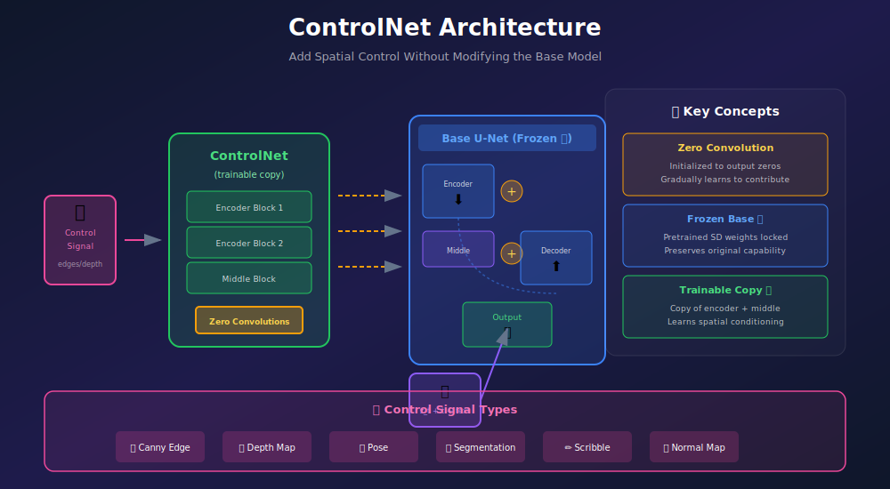
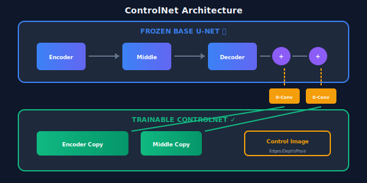

# 🛠️ Project: ControlNet Mini

<div align="center">


*Add precise spatial control without retraining the base model*

[](#)
[](#)
[](#)

</div>

---

## 🎯 Where & Why: Learning Objectives

### Why Build ControlNet from Scratch?

| What You'll Learn | Why It Matters |
|-------------------|----------------|
| 🔒 **Adapter pattern** | Extend models without modifying weights |
| 0️⃣ **Zero convolution** | Gradual learning from scratch |
| 🎛️ **Spatial conditioning** | Control pose, edges, depth, etc. |
| 🧊 **Weight cloning** | Efficient knowledge transfer |
| ⚡ **Fine-tuning efficiency** | Train on consumer GPUs |

### Real-World Applications

ControlNet enables:
- ✅ **Pose-guided generation** — Generate characters in specific poses
- ✅ **Edge-guided generation** — Turn sketches into artwork
- ✅ **Depth-guided generation** — Maintain spatial relationships
- ✅ **Architectural rendering** — Structure-preserving generation
- ✅ **Product design** — Controlled variations

> 💡 **The Genius**: ControlNet adds spatial control to pretrained diffusion models **without changing a single weight** of the original model. The base model stays frozen!

---

## 📖 The Architecture



### The Key Insight



---

## 🧮 Mathematical Foundation

### Zero Convolution

The key innovation that enables gradual learning:

$$\text{ZeroConv}(x) = W \cdot x + b, \quad \text{where } W = 0, b = 0 \text{ initially}$$

**Why?** At initialization:
- ControlNet output = 0
- Base model is unaffected
- Training gradually learns what to add

```python
class ZeroConv(nn.Module):
    """Convolution initialized to output zeros."""
    def __init__(self, in_channels, out_channels, kernel_size=1):
        super().__init__()
        self.conv = nn.Conv2d(in_channels, out_channels, kernel_size, padding=kernel_size//2)
        
        # Initialize to zeros
        nn.init.zeros_(self.conv.weight)
        nn.init.zeros_(self.conv.bias)
    
    def forward(self, x):
        return self.conv(x)
```

### The ControlNet Equation

For each encoder block \(i\), the controlled output is:

$$y_i = F_{frozen}(x) + \text{ZeroConv}_i(F_{control}(c, x))$$

Where:
- \(F_{frozen}\) = frozen encoder block from base U-Net
- \(F_{control}\) = trainable copy processing control signal \(c\)
- \(\text{ZeroConv}_i\) = zero-initialized projection

### Training Objective

Same as standard diffusion, but with control signal:

$$\mathcal{L} = \mathbb{E}_{z_0, c, \epsilon, t}\left[\|\epsilon - \epsilon_\theta(z_t, t, \text{text}, c)\|^2\right]$$

Only ControlNet parameters are optimized; base model stays frozen.

---

## 🏗️ Implementation

### Step 1: Control Signal Preprocessors

```python
import cv2
import numpy as np
import torch

class CannyDetector:
    """Extract edge maps using Canny detector."""
    def __call__(self, image, low_threshold=100, high_threshold=200):
        """
        Args:
            image: (H, W, 3) numpy array, uint8
        Returns:
            edges: (H, W) numpy array, float32 [0, 1]
        """
        gray = cv2.cvtColor(image, cv2.COLOR_RGB2GRAY)
        edges = cv2.Canny(gray, low_threshold, high_threshold)
        return edges.astype(np.float32) / 255.0


class DepthEstimator:
    """Estimate depth using pretrained model."""
    def __init__(self, device='cuda'):
        from transformers import DPTForDepthEstimation, DPTImageProcessor
        
        self.processor = DPTImageProcessor.from_pretrained("Intel/dpt-hybrid-midas")
        self.model = DPTForDepthEstimation.from_pretrained("Intel/dpt-hybrid-midas")
        self.model = self.model.to(device).eval()
        self.device = device
    
    @torch.no_grad()
    def __call__(self, image):
        """
        Args:
            image: PIL Image or numpy array
        Returns:
            depth: (H, W) tensor, normalized [0, 1]
        """
        inputs = self.processor(images=image, return_tensors="pt").to(self.device)
        depth = self.model(**inputs).predicted_depth
        
        # Normalize
        depth = (depth - depth.min()) / (depth.max() - depth.min())
        return depth.squeeze()


class PoseDetector:
    """Detect human poses using OpenPose or similar."""
    def __init__(self):
        # Could use OpenPose, MediaPipe, etc.
        pass
    
    def __call__(self, image):
        # Returns pose keypoints visualization
        pass
```

### Step 2: ControlNet Encoder

```python
class ControlNetEncoder(nn.Module):
    """Trainable copy of U-Net encoder with zero convolutions."""
    def __init__(self, base_unet, control_channels=3):
        super().__init__()
        
        # Input hint encoder (for control signal)
        self.input_hint_block = nn.Sequential(
            nn.Conv2d(control_channels, 16, 3, padding=1),
            nn.SiLU(),
            nn.Conv2d(16, 16, 3, padding=1),
            nn.SiLU(),
            nn.Conv2d(16, 32, 3, padding=1, stride=2),  # /2
            nn.SiLU(),
            nn.Conv2d(32, 32, 3, padding=1),
            nn.SiLU(),
            nn.Conv2d(32, 96, 3, padding=1, stride=2),  # /4
            nn.SiLU(),
            nn.Conv2d(96, 96, 3, padding=1),
            nn.SiLU(),
            nn.Conv2d(96, 256, 3, padding=1, stride=2),  # /8
            nn.SiLU(),
            nn.Conv2d(256, 320, 3, padding=1)
        )
        
        # Copy encoder blocks from base U-Net
        import copy
        self.encoder_blocks = copy.deepcopy(base_unet.encoder_blocks)
        self.middle_block = copy.deepcopy(base_unet.middle_block)
        
        # Zero convolutions for each output
        channels = [320, 320, 640, 640, 1280, 1280, 1280]  # SD channel progression
        self.zero_convs = nn.ModuleList([
            ZeroConv(ch, ch) for ch in channels
        ])
        
        self.middle_zero_conv = ZeroConv(1280, 1280)
    
    def forward(self, x, hint, timestep, context):
        """
        Args:
            x: Noisy latent (B, 4, H, W)
            hint: Control signal (B, 3, H*8, W*8) - full resolution
            timestep: (B,)
            context: Text embedding (B, seq_len, dim)
        
        Returns:
            List of residuals to add to base U-Net
        """
        # Process control hint
        guided_hint = self.input_hint_block(hint)
        
        # Add hint to input
        h = x + guided_hint
        
        residuals = []
        
        # Process through encoder
        for i, block in enumerate(self.encoder_blocks):
            h = block(h, timestep, context)
            residuals.append(self.zero_convs[i](h))
        
        # Middle block
        h = self.middle_block(h, timestep, context)
        middle_residual = self.middle_zero_conv(h)
        
        return residuals, middle_residual
```

### Step 3: ControlNet Integration

```python
class ControlledUNet(nn.Module):
    """U-Net with ControlNet integration."""
    def __init__(self, base_unet, controlnet):
        super().__init__()
        self.base_unet = base_unet
        self.controlnet = controlnet
        
        # Freeze base model
        for param in self.base_unet.parameters():
            param.requires_grad = False
    
    def forward(self, x, t, context, control_hint):
        """
        Args:
            x: Noisy latent
            t: Timesteps
            context: Text embeddings
            control_hint: Control signal (edges, depth, etc.)
        """
        # Get ControlNet residuals
        control_residuals, control_middle = self.controlnet(x, control_hint, t, context)
        
        # Forward through base U-Net encoder
        t_emb = self.base_unet.time_embed(t)
        h = self.base_unet.conv_in(x)
        
        encoder_outputs = []
        for i, block in enumerate(self.base_unet.encoder_blocks):
            h = block(h, t_emb, context)
            # Add ControlNet residual
            h = h + control_residuals[i]
            encoder_outputs.append(h)
        
        # Middle
        h = self.base_unet.middle_block(h, t_emb, context)
        h = h + control_middle
        
        # Decoder (with skip connections)
        for block in self.base_unet.decoder_blocks:
            skip = encoder_outputs.pop()
            h = torch.cat([h, skip], dim=1)
            h = block(h, t_emb, context)
        
        return self.base_unet.conv_out(h)
```

### Step 4: Training

```python
def train_controlnet(controlnet, base_unet, dataloader, epochs=10):
    """Train only the ControlNet, keeping base U-Net frozen."""
    device = torch.device('cuda')
    
    # Move models
    base_unet = base_unet.to(device).eval()
    controlnet = controlnet.to(device).train()
    
    # Only optimize ControlNet
    optimizer = torch.optim.AdamW(controlnet.parameters(), lr=1e-5)
    
    for epoch in range(epochs):
        for images, control_images, captions in dataloader:
            images = images.to(device)
            control_images = control_images.to(device)
            
            # Encode text
            text_emb = text_encoder.encode(captions)
            
            # Sample timesteps and noise
            t = torch.randint(0, 1000, (images.size(0),), device=device)
            noise = torch.randn_like(images)
            noisy = schedule.q_sample(images, t, noise)
            
            # Get ControlNet residuals
            residuals, mid_residual = controlnet(noisy, control_images, t, text_emb)
            
            # Forward through base U-Net with residuals
            noise_pred = controlled_forward(base_unet, noisy, t, text_emb, 
                                           residuals, mid_residual)
            
            # Loss
            loss = F.mse_loss(noise_pred, noise)
            
            optimizer.zero_grad()
            loss.backward()
            optimizer.step()
        
        print(f"Epoch {epoch+1}: Loss = {loss.item():.4f}")
```

### Step 5: Inference

```python
@torch.no_grad()
def generate_with_control(prompt, control_image, guidance_scale=9.0, num_steps=20):
    """Generate image guided by control signal."""
    
    # Encode text
    text_emb = text_encoder.encode([prompt])
    empty_emb = text_encoder.get_empty_embedding(1)
    
    # Process control image
    control_tensor = preprocess_control(control_image)  # (1, 3, 512, 512)
    
    # Start from noise
    latent = torch.randn(1, 4, 64, 64, device='cuda')
    
    for t in tqdm(reversed(range(0, 1000, 1000 // num_steps))):
        t_tensor = torch.tensor([t], device='cuda')
        
        # Conditional prediction (with control)
        noise_cond = controlled_unet(latent, t_tensor, text_emb, control_tensor)
        
        # Unconditional prediction (still with control)
        noise_uncond = controlled_unet(latent, t_tensor, empty_emb, control_tensor)
        
        # CFG
        noise_pred = noise_uncond + guidance_scale * (noise_cond - noise_uncond)
        
        # DDIM step
        latent = ddim_step(latent, noise_pred, t)
    
    # Decode
    image = vae.decode(latent)
    return image
```

---

## 🎛️ Control Types

| Type | Preprocessor | Use Case |
|------|--------------|----------|
| **Canny Edge** | cv2.Canny | Line art, sketches |
| **Depth** | MiDaS / DPT | 3D-aware generation |
| **Pose** | OpenPose | Character poses |
| **Segmentation** | SAM / DETR | Semantic regions |
| **Normal Map** | Surface normals | 3D structure |
| **Scribble** | User drawing | Rough guidance |
| **Soft Edge** | HED / PiDiNet | Smooth edges |

---

## ✅ Milestones Checklist

- [ ] **Zero convolution** — Implemented and tested
- [ ] **Weight cloning** — Copy encoder from base U-Net
- [ ] **Canny control** — Edge-guided generation
- [ ] **Depth control** — Depth-guided generation
- [ ] **Multi-control** — Combine multiple conditions
- [ ] **Quality check** — Control signals respected

---

## 📚 References

1. **Zhang, L., et al.** (2023). "Adding Conditional Control to Text-to-Image Diffusion Models." *ICCV*. [arXiv:2302.05543](https://arxiv.org/abs/2302.05543)

2. **Mou, C., et al.** (2023). "T2I-Adapter: Learning Adapters to Dig out More Controllable Ability for Text-to-Image Diffusion Models." *arXiv*. [arXiv:2302.08453](https://arxiv.org/abs/2302.08453)

---

<div align="center">

**[← Text-to-Image Mini](../04_text_to_image_mini/)** | **[Back to Projects →](../)**

</div>
