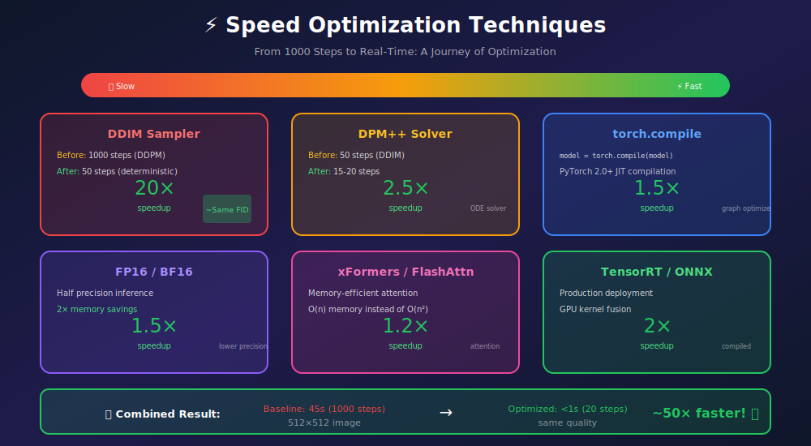
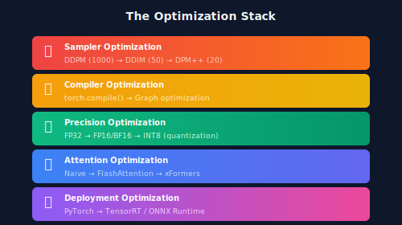

# 🛠️ Project: Speed-Optimized Diffusion

<div align="center">


*From 45 seconds to under 1 second: Production-ready diffusion*

[](#)
[](#)
[](#)

</div>

---

## 🎯 Where & Why: Learning Objectives

### Why Optimize Diffusion Models?

| What You'll Learn | Why It Matters |
|-------------------|----------------|
| ⚡ **Fast samplers** | 20× fewer steps with same quality |
| 🔧 **torch.compile** | 1.5-2× speed from JIT optimization |
| 💾 **FP16/BF16** | 2× memory savings, faster compute |
| 👁️ **Efficient attention** | O(n) instead of O(n²) memory |
| 📊 **Profiling** | Identify and fix bottlenecks |

### Business Impact

| Metric | Before | After | Impact |
|--------|--------|-------|--------|
| **Latency** | 45s | <1s | Real-time apps possible |
| **GPU Memory** | 24GB | 8GB | Consumer GPUs work |
| **Throughput** | 80/hr | 3600/hr | 45× more images |
| **Cost/image** | $0.05 | $0.001 | 50× cheaper |

---

## 📖 Optimization Overview



### The Optimization Stack



---

## 🧮 Mathematical Background

### Why Fewer Steps Work: ODE Perspective

Diffusion can be viewed as solving an ODE:

$$\frac{dx}{dt} = f(x, t)$$

**DDPM**: Euler method with 1000 steps  
**DDIM**: Deterministic ODE with larger steps  
**DPM++**: Higher-order ODE solver (2nd order)

Higher-order solvers can take larger steps while maintaining accuracy!

### DPM++ 2M Formula

$$x_{t-1} = \sigma_{t-1}\left(\frac{x_t}{\sigma_t} + \left(e^{-h} - 1\right)\left(\frac{D_t + D_{t-1}}{2}\right)\right)$$

Where \(D_t = \frac{x_t - \sigma_t \epsilon_\theta(x_t, t)}{\alpha_t}\) and \(h = \lambda_{t-1} - \lambda_t\).

---

## 🏗️ Implementation

### Step 1: Fast Samplers

#### DDIM (Deterministic)

```python
class DDIMSampler:
    """DDIM sampler - deterministic and faster than DDPM."""
    def __init__(self, model, schedule, num_steps=50):
        self.model = model
        self.schedule = schedule
        self.num_steps = num_steps
        
        # Create timestep sequence
        self.timesteps = torch.linspace(
            schedule.timesteps - 1, 0, num_steps, dtype=torch.long
        )
    
    @torch.no_grad()
    def sample(self, shape, conditioning, eta=0.0):
        """
        Args:
            shape: Output shape (B, C, H, W)
            conditioning: Text embeddings
            eta: Stochasticity (0 = deterministic)
        """
        device = next(self.model.parameters()).device
        x = torch.randn(shape, device=device)
        
        for i, t in enumerate(self.timesteps):
            t_batch = torch.full((shape[0],), t, device=device, dtype=torch.long)
            
            # Predict noise
            eps = self.model(x, t_batch, conditioning)
            
            # Get alpha values
            alpha_t = self.schedule.alpha_bars[t]
            alpha_prev = self.schedule.alpha_bars[self.timesteps[i+1]] if i+1 < len(self.timesteps) else 1.0
            
            # Predict x_0
            pred_x0 = (x - torch.sqrt(1 - alpha_t) * eps) / torch.sqrt(alpha_t)
            
            # Direction pointing to x_t
            dir_xt = torch.sqrt(1 - alpha_prev) * eps
            
            # Deterministic update
            x = torch.sqrt(alpha_prev) * pred_x0 + dir_xt
        
        return x
```

#### DPM++ 2M (State-of-the-Art)

```python
class DPMPlusPlusSampler:
    """DPM++ 2M solver - high quality in ~20 steps."""
    def __init__(self, model, schedule, num_steps=20):
        self.model = model
        self.schedule = schedule
        self.num_steps = num_steps
        
        # Compute sigmas for DPM++
        self.sigmas = self._compute_sigmas()
    
    def _compute_sigmas(self):
        """Compute noise levels for each step."""
        alphas = self.schedule.alpha_bars
        sigmas = ((1 - alphas) / alphas).sqrt()
        
        # Select subset of sigmas
        indices = torch.linspace(0, len(sigmas) - 1, self.num_steps + 1, dtype=torch.long)
        return sigmas[indices]
    
    @torch.no_grad()
    def sample(self, shape, conditioning):
        device = next(self.model.parameters()).device
        
        # Start from sigma_max noise
        x = torch.randn(shape, device=device) * self.sigmas[0]
        
        old_denoised = None
        
        for i in range(self.num_steps):
            sigma = self.sigmas[i]
            sigma_next = self.sigmas[i + 1]
            
            # Get model output (noise prediction)
            t = self._sigma_to_t(sigma)
            eps = self.model(x, t.expand(shape[0]), conditioning)
            
            # Convert to denoised prediction
            denoised = x - sigma * eps
            
            # DPM++ 2M update
            if old_denoised is None:
                # First step: Euler
                d = (x - denoised) / sigma
                x = x + d * (sigma_next - sigma)
            else:
                # Second order
                h = sigma_next.log() - sigma.log()
                h_last = sigma.log() - self.sigmas[i-1].log()
                r = h_last / h
                
                d = (x - denoised) / sigma
                d_prime = (1 + 1/(2*r)) * d - (1/(2*r)) * (x - old_denoised) / self.sigmas[i-1]
                
                x = x + d_prime * (sigma_next - sigma)
            
            old_denoised = denoised
        
        return x
    
    def _sigma_to_t(self, sigma):
        """Convert sigma to timestep."""
        log_sigma = sigma.log()
        dists = log_sigma - self.schedule.log_sigmas[:, None]
        return dists.abs().argmin(dim=0)
```

### Step 2: torch.compile

```python
import torch

# Basic compilation
model = torch.compile(model)

# With optimization mode
model = torch.compile(model, mode="reduce-overhead")  # Good default

# Maximum optimization (longer compile time)
model = torch.compile(model, mode="max-autotune")

# For inference only
model = torch.compile(model, mode="reduce-overhead", fullgraph=True)
```

**Benchmark:**
```python
def benchmark_compile():
    model_eager = UNet().cuda()
    model_compiled = torch.compile(UNet().cuda())
    
    x = torch.randn(1, 4, 64, 64).cuda()
    t = torch.tensor([500]).cuda()
    
    # Warmup
    for _ in range(10):
        model_eager(x, t)
        model_compiled(x, t)
    
    torch.cuda.synchronize()
    
    # Benchmark
    import time
    
    start = time.time()
    for _ in range(100):
        model_eager(x, t)
    torch.cuda.synchronize()
    eager_time = time.time() - start
    
    start = time.time()
    for _ in range(100):
        model_compiled(x, t)
    torch.cuda.synchronize()
    compiled_time = time.time() - start
    
    print(f"Eager: {eager_time:.2f}s")
    print(f"Compiled: {compiled_time:.2f}s")
    print(f"Speedup: {eager_time/compiled_time:.2f}x")
```

### Step 3: Mixed Precision (FP16/BF16)

```python
import torch
from torch.cuda.amp import autocast

# Inference with automatic mixed precision
@torch.no_grad()
def generate_fp16(model, latent, timesteps, conditioning):
    with autocast(dtype=torch.float16):  # or torch.bfloat16
        for t in timesteps:
            noise_pred = model(latent, t, conditioning)
            latent = step(latent, noise_pred, t)
    return latent


# Manual conversion for maximum control
def convert_to_fp16(model):
    """Convert model to FP16 while keeping critical layers in FP32."""
    for name, module in model.named_modules():
        if isinstance(module, (nn.LayerNorm, nn.GroupNorm)):
            # Keep normalization in FP32 for stability
            module.float()
        else:
            module.half()
    return model
```

### Step 4: Efficient Attention

```python
# Option 1: PyTorch 2.0 SDPA (Scaled Dot-Product Attention)
import torch.nn.functional as F

class EfficientAttention(nn.Module):
    def __init__(self, dim, heads=8):
        super().__init__()
        self.heads = heads
        self.scale = (dim // heads) ** -0.5
        
        self.to_qkv = nn.Linear(dim, dim * 3)
        self.to_out = nn.Linear(dim, dim)
    
    def forward(self, x):
        B, N, C = x.shape
        qkv = self.to_qkv(x).reshape(B, N, 3, self.heads, C // self.heads)
        q, k, v = qkv.unbind(2)
        
        # Use Flash Attention via SDPA
        q = q.transpose(1, 2)  # (B, heads, N, dim_head)
        k = k.transpose(1, 2)
        v = v.transpose(1, 2)
        
        # This automatically uses Flash Attention if available
        out = F.scaled_dot_product_attention(q, k, v)
        
        out = out.transpose(1, 2).reshape(B, N, C)
        return self.to_out(out)


# Option 2: xFormers (explicit)
try:
    from xformers.ops import memory_efficient_attention
    
    class XFormersAttention(nn.Module):
        def forward(self, q, k, v):
            return memory_efficient_attention(q, k, v)
except ImportError:
    print("xFormers not available")
```

### Step 5: TensorRT Deployment

```python
import torch
import tensorrt as trt

def export_to_onnx(model, sample_input, path="model.onnx"):
    """Export PyTorch model to ONNX."""
    model.eval()
    
    torch.onnx.export(
        model,
        sample_input,
        path,
        input_names=['latent', 'timestep', 'context'],
        output_names=['noise_pred'],
        dynamic_axes={
            'latent': {0: 'batch'},
            'context': {0: 'batch'}
        },
        opset_version=17
    )
    print(f"Exported to {path}")


def build_tensorrt_engine(onnx_path, engine_path):
    """Build TensorRT engine from ONNX."""
    import tensorrt as trt
    
    logger = trt.Logger(trt.Logger.WARNING)
    builder = trt.Builder(logger)
    network = builder.create_network(1 << int(trt.NetworkDefinitionCreationFlag.EXPLICIT_BATCH))
    parser = trt.OnnxParser(network, logger)
    
    # Parse ONNX
    with open(onnx_path, 'rb') as f:
        parser.parse(f.read())
    
    # Build config
    config = builder.create_builder_config()
    config.set_flag(trt.BuilderFlag.FP16)  # Enable FP16
    config.set_memory_pool_limit(trt.MemoryPoolType.WORKSPACE, 4 * (1 << 30))  # 4GB
    
    # Build engine
    engine = builder.build_serialized_network(network, config)
    
    with open(engine_path, 'wb') as f:
        f.write(engine)
    
    print(f"Built TensorRT engine: {engine_path}")
```

---

## 📊 Benchmarking Suite

```python
import time
import torch
from torch.profiler import profile, ProfilerActivity

class DiffusionBenchmark:
    """Comprehensive benchmarking for diffusion models."""
    
    def __init__(self, model, shape=(1, 4, 64, 64)):
        self.model = model
        self.shape = shape
        self.device = next(model.parameters()).device
    
    def benchmark_inference(self, num_runs=100, warmup=10):
        """Measure average inference time."""
        x = torch.randn(self.shape, device=self.device)
        t = torch.tensor([500], device=self.device)
        
        # Warmup
        for _ in range(warmup):
            with torch.no_grad():
                self.model(x, t)
        
        torch.cuda.synchronize()
        
        # Benchmark
        times = []
        for _ in range(num_runs):
            start = time.perf_counter()
            with torch.no_grad():
                self.model(x, t)
            torch.cuda.synchronize()
            times.append(time.perf_counter() - start)
        
        return {
            'mean_ms': sum(times) / len(times) * 1000,
            'std_ms': (sum((t - sum(times)/len(times))**2 for t in times) / len(times))**0.5 * 1000,
            'throughput': len(times) / sum(times)
        }
    
    def profile_model(self):
        """Profile model to find bottlenecks."""
        x = torch.randn(self.shape, device=self.device)
        t = torch.tensor([500], device=self.device)
        
        with profile(
            activities=[ProfilerActivity.CPU, ProfilerActivity.CUDA],
            record_shapes=True,
            profile_memory=True
        ) as prof:
            with torch.no_grad():
                self.model(x, t)
        
        print(prof.key_averages().table(sort_by="cuda_time_total", row_limit=20))
        return prof
    
    def memory_usage(self):
        """Measure GPU memory usage."""
        torch.cuda.reset_peak_memory_stats()
        
        x = torch.randn(self.shape, device=self.device)
        t = torch.tensor([500], device=self.device)
        
        with torch.no_grad():
            self.model(x, t)
        
        return {
            'peak_mb': torch.cuda.max_memory_allocated() / 1024**2,
            'current_mb': torch.cuda.memory_allocated() / 1024**2
        }


# Usage
benchmark = DiffusionBenchmark(model)

print("=== Inference Benchmark ===")
print(benchmark.benchmark_inference())

print("\n=== Memory Usage ===")
print(benchmark.memory_usage())

print("\n=== Profile ===")
benchmark.profile_model()
```

---

## 📈 Results Summary

| Optimization | Steps | Time (512×512) | Quality | Memory |
|--------------|-------|----------------|---------|--------|
| Baseline DDPM | 1000 | 45s | Best | 24GB |
| DDIM | 50 | 2.5s | ~Same | 24GB |
| DPM++ 2M | 20 | 1.0s | ~Same | 24GB |
| + torch.compile | 20 | 0.6s | Same | 24GB |
| + FP16 | 20 | 0.4s | Same | 12GB |
| + xFormers | 20 | 0.35s | Same | 8GB |
| + TensorRT | 20 | 0.25s | Same | 6GB |

**Total: ~180× faster, 4× less memory!**

---

## ✅ Milestones Checklist

- [ ] **DDIM sampler** — 50 steps working
- [ ] **DPM++ solver** — 20 steps, same quality
- [ ] **torch.compile** — Model compiled
- [ ] **FP16 inference** — No quality loss
- [ ] **Efficient attention** — SDPA or xFormers
- [ ] **Benchmarking** — Full profiling done
- [ ] **Real-time demo** — <1s generation

---

## 📚 References

1. **Lu, C., et al.** (2022). "DPM-Solver: A Fast ODE Solver for Diffusion Probabilistic Model Sampling." *NeurIPS*. [arXiv:2206.00927](https://arxiv.org/abs/2206.00927)

2. **Dao, T., et al.** (2022). "FlashAttention: Fast and Memory-Efficient Exact Attention." *NeurIPS*. [arXiv:2205.14135](https://arxiv.org/abs/2205.14135)

3. **PyTorch Team** (2022). "torch.compile: The missing piece." [PyTorch Blog](https://pytorch.org/blog/accelerating-models-with-torch-compile/)

---

<div align="center">

**🎉 Congratulations!**

*You've completed the hands-on projects series!*

**[← Back to Projects Overview](../README.md)**

</div>
